# OPENPPP2

English | [简体中文](README_CN.md)

OPENPPP2 is a source-driven, cross-platform network runtime built around the C++ executable `ppp`, with an optional Go management backend. The real implementation boundary lives in `main.cpp`, `ppp/configurations`, `ppp/transmissions`, `ppp/app/protocol`, `ppp/app/client`, `ppp/app/server`, and the platform-specific integration directories.

It is not a single-purpose VPN app. The code implements a layered system:

| Layer | What it actually does | Main code areas |
|-------|------------------------|-----------------|
| Protected transport | Frames, encrypts, obfuscates, and shapes handshake traffic | `ppp/transmissions/*` |
| Tunnel protocol | Defines session identity, link-layer opcodes, and packet meaning | `ppp/app/protocol/*` |
| Client runtime | Attaches to a virtual adapter, steers routes, DNS, proxy, and MUX | `ppp/app/client/*` |
| Server runtime | Accepts sessions, switches exchangers, forwards traffic, and manages IPv6/static paths | `ppp/app/server/*` |
| Platform integration | Binds the runtime to Windows/Linux/macOS/Android networking APIs | `windows/*`, `linux/*`, `darwin/*`, `android/*` |
| Management backend | Optional Go service for managed deployments | `go/*` |

The documentation is written from code facts upward. It explains what the system does, why each layer exists, and where the implementation boundaries really are.

---

## Table of Contents

1. [System Architecture Overview](#system-architecture-overview)
2. [Start Here](#start-here)
3. [Reading Paths](#reading-paths)
4. [Documentation Set](#documentation-set)
5. [Repository Layout](#repository-layout)
6. [Build Instructions](#build-instructions)
7. [Quick Start](#quick-start)
8. [Configuration Overview](#configuration-overview)
9. [Protocol and Transport Overview](#protocol-and-transport-overview)
10. [Client Runtime Summary](#client-runtime-summary)
11. [Server Runtime Summary](#server-runtime-summary)
12. [Platform Integration Summary](#platform-integration-summary)
13. [Concurrency and Threading Model](#concurrency-and-threading-model)
14. [Error Handling Summary](#error-handling-summary)
15. [Management Backend](#management-backend)
16. [Security Summary](#security-summary)
17. [Code Facts That Shape The Docs](#code-facts-that-shape-the-docs)
18. [Boundaries](#boundaries)
19. [Quick Reference](#quick-reference)
20. [Notes](#notes)

---

## System Architecture Overview

The following diagram shows the top-level layering of the OPENPPP2 runtime. Each box corresponds to real source directories.

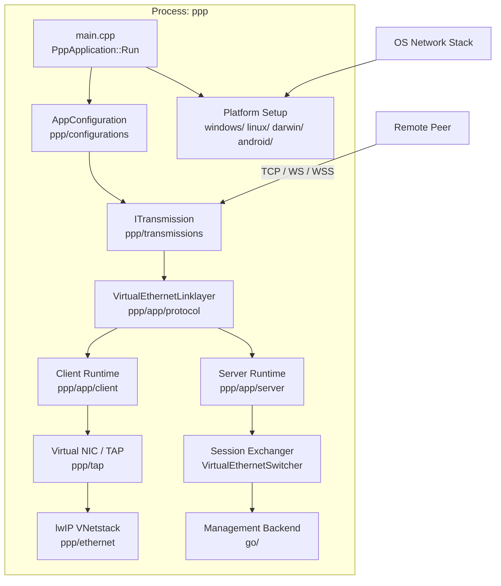
```mermaid
graph TD
    subgraph "Process: ppp"
        A[main.cpp\nPppApplication::Run] --> B[AppConfiguration\nppp/configurations]
        A --> C[Platform Setup\nwindows/ linux/ darwin/ android/]
        B --> D[ITransmission\nppp/transmissions]
        D --> E[VirtualEthernetLinklayer\nppp/app/protocol]
        E --> F[Client Runtime\nppp/app/client]
        E --> G[Server Runtime\nppp/app/server]
        F --> H[Virtual NIC / TAP\nppp/tap]
        G --> I[Session Exchanger\nVirtualEthernetSwitcher]
        H --> J[lwIP VNetstack\nppp/ethernet]
        I --> K[Management Backend\ngo/]
    end
    L[OS Network Stack] --> C
    M[Remote Peer] -->|TCP / WS / WSS| D
```

### Startup Pipeline


```mermaid
flowchart LR
    A[PreparedArgumentEnvironment] --> B[LoadConfiguration]
    B --> C[AppPrivilege Check]
    C --> D[prevent_rerun_ Lock]
    D --> E[Windows_PreparedEthernetEnvironment\nclient only]
    E --> F[PreparedLoopbackEnvironment]
    F --> G[ConsoleUI::Start]
    G --> H[NextTickAlwaysTimeout]
    H --> I[io_context::run]
    I --> J[OnTick loop]
```

### Shutdown Cascade

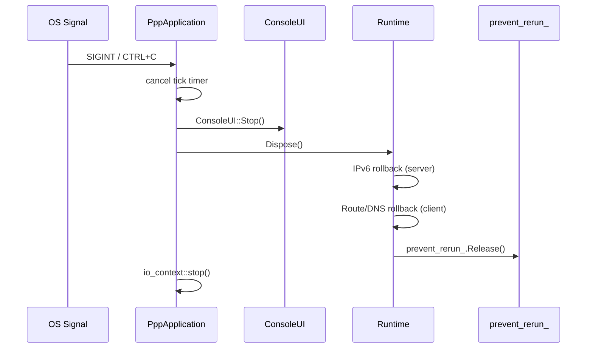
```mermaid
sequenceDiagram
    participant OS as OS Signal
    participant App as PppApplication
    participant UI as ConsoleUI
    participant RT as Runtime
    participant Lock as prevent_rerun_

    OS->>App: SIGINT / CTRL+C
    App->>App: cancel tick timer
    App->>UI: ConsoleUI::Stop()
    App->>RT: Dispose()
    RT->>RT: IPv6 rollback (server)
    RT->>RT: Route/DNS rollback (client)
    RT->>Lock: prevent_rerun_.Release()
    App->>App: io_context::stop()
```

---

## Start Here

| Document | Purpose |
|----------|---------|
| [`docs/README.md`](docs/README.md) | Documentation index and reading paths |
| [`docs/README_CN.md`](docs/README_CN.md) | Chinese documentation index |
| [`docs/ARCHITECTURE.md`](docs/ARCHITECTURE.md) | Top-level architecture map |
| [`docs/USER_MANUAL.md`](docs/USER_MANUAL.md) | End-user quick start and appendices |
| [`docs/SOURCE_READING_GUIDE.md`](docs/SOURCE_READING_GUIDE.md) | Source reading order |

---

## Reading Paths

### Whole System

1. [`docs/ENGINEERING_CONCEPTS.md`](docs/ENGINEERING_CONCEPTS.md)
2. [`docs/ARCHITECTURE.md`](docs/ARCHITECTURE.md)
3. [`docs/STARTUP_AND_LIFECYCLE.md`](docs/STARTUP_AND_LIFECYCLE.md)
4. [`docs/TRANSMISSION.md`](docs/TRANSMISSION.md)
5. [`docs/HANDSHAKE_SEQUENCE.md`](docs/HANDSHAKE_SEQUENCE.md)
6. [`docs/PACKET_FORMATS.md`](docs/PACKET_FORMATS.md)
7. [`docs/CLIENT_ARCHITECTURE.md`](docs/CLIENT_ARCHITECTURE.md)
8. [`docs/SERVER_ARCHITECTURE.md`](docs/SERVER_ARCHITECTURE.md)
9. [`docs/ROUTING_AND_DNS.md`](docs/ROUTING_AND_DNS.md)
10. [`docs/PLATFORMS.md`](docs/PLATFORMS.md)
11. [`docs/DEPLOYMENT.md`](docs/DEPLOYMENT.md)
12. [`docs/OPERATIONS.md`](docs/OPERATIONS.md)

### Code Reading

1. [`docs/SOURCE_READING_GUIDE.md`](docs/SOURCE_READING_GUIDE.md)
2. `main.cpp`
3. `ppp/configurations/*`
4. `ppp/transmissions/*`
5. `ppp/app/protocol/*`
6. `ppp/app/client/*`
7. `ppp/app/server/*`
8. Platform directories
9. `go/*` when managed deployment is used

### Deployment And Operations

1. [`docs/CONFIGURATION.md`](docs/CONFIGURATION.md)
2. [`docs/CLI_REFERENCE.md`](docs/CLI_REFERENCE.md)
3. [`docs/PLATFORMS.md`](docs/PLATFORMS.md)
4. [`docs/ROUTING_AND_DNS.md`](docs/ROUTING_AND_DNS.md)
5. [`docs/DEPLOYMENT.md`](docs/DEPLOYMENT.md)
6. [`docs/OPERATIONS.md`](docs/OPERATIONS.md)
7. [`docs/SECURITY.md`](docs/SECURITY.md)

### Deep Dives (Advanced)

1. [`docs/CONCURRENCY_MODEL.md`](docs/CONCURRENCY_MODEL.md)
2. [`docs/EDSM_STATE_MACHINES.md`](docs/EDSM_STATE_MACHINES.md)
3. [`docs/PACKET_LIFECYCLE.md`](docs/PACKET_LIFECYCLE.md)
4. [`docs/LINKLAYER_PROTOCOL.md`](docs/LINKLAYER_PROTOCOL.md)
5. [`docs/TRANSMISSION_PACK_SESSIONID.md`](docs/TRANSMISSION_PACK_SESSIONID.md)
6. [`docs/TUNNEL_DESIGN.md`](docs/TUNNEL_DESIGN.md)
7. [`docs/ERROR_CODES.md`](docs/ERROR_CODES.md)
8. [`docs/ERROR_HANDLING_API.md`](docs/ERROR_HANDLING_API.md)
9. [`docs/DIAGNOSTICS_ERROR_SYSTEM.md`](docs/DIAGNOSTICS_ERROR_SYSTEM.md)

### IPv6 Subsystem

1. [`docs/IPV6_LEASE_MANAGEMENT.md`](docs/IPV6_LEASE_MANAGEMENT.md)
2. [`docs/IPV6_TRANSIT_PLANE.md`](docs/IPV6_TRANSIT_PLANE.md)
3. [`docs/IPV6_NDP_PROXY.md`](docs/IPV6_NDP_PROXY.md)
4. [`docs/IPV6_CLIENT_ASSIGNMENT.md`](docs/IPV6_CLIENT_ASSIGNMENT.md)

---

## Documentation Set

The repository contains paired English/Chinese documents plus the root README pair. Each Chinese document has a one-to-one English counterpart.

| Area | English | Chinese |
|------|---------|---------|
| Foundation | `ENGINEERING_CONCEPTS.md` | `ENGINEERING_CONCEPTS_CN.md` |
| Foundation | `ARCHITECTURE.md` | `ARCHITECTURE_CN.md` |
| Foundation | `STARTUP_AND_LIFECYCLE.md` | `STARTUP_AND_LIFECYCLE_CN.md` |
| Transport | `TRANSMISSION.md` | `TRANSMISSION_CN.md` |
| Transport | `HANDSHAKE_SEQUENCE.md` | `HANDSHAKE_SEQUENCE_CN.md` |
| Transport | `PACKET_FORMATS.md` | `PACKET_FORMATS_CN.md` |
| Transport | `TRANSMISSION_PACK_SESSIONID.md` | `TRANSMISSION_PACK_SESSIONID_CN.md` |
| Protocol | `LINKLAYER_PROTOCOL.md` | `LINKLAYER_PROTOCOL_CN.md` |
| Runtime | `CLIENT_ARCHITECTURE.md` | `CLIENT_ARCHITECTURE_CN.md` |
| Runtime | `SERVER_ARCHITECTURE.md` | `SERVER_ARCHITECTURE_CN.md` |
| Runtime | `ROUTING_AND_DNS.md` | `ROUTING_AND_DNS_CN.md` |
| Runtime | `PACKET_LIFECYCLE.md` | `PACKET_LIFECYCLE_CN.md` |
| Platform | `PLATFORMS.md` | `PLATFORMS_CN.md` |
| Configuration | `CONFIGURATION.md` | `CONFIGURATION_CN.md` |
| Configuration | `CLI_REFERENCE.md` | `CLI_REFERENCE_CN.md` |
| Operations | `DEPLOYMENT.md` | `DEPLOYMENT_CN.md` |
| Operations | `OPERATIONS.md` | `OPERATIONS_CN.md` |
| Security | `SECURITY.md` | `SECURITY_CN.md` |
| Management | `MANAGEMENT_BACKEND.md` | `MANAGEMENT_BACKEND_CN.md` |
| Usage | `USER_MANUAL.md` | `USER_MANUAL_CN.md` |
| Reading | `SOURCE_READING_GUIDE.md` | `SOURCE_READING_GUIDE_CN.md` |
| Concurrency | `CONCURRENCY_MODEL.md` | `CONCURRENCY_MODEL_CN.md` |
| State Machines | `EDSM_STATE_MACHINES.md` | `EDSM_STATE_MACHINES_CN.md` |
| Tunnel | `TUNNEL_DESIGN.md` | `TUNNEL_DESIGN_CN.md` |
| Error Codes | `ERROR_CODES.md` | `ERROR_CODES_CN.md` |
| Error API | `ERROR_HANDLING_API.md` | `ERROR_HANDLING_API_CN.md` |
| Diagnostics | `DIAGNOSTICS_ERROR_SYSTEM.md` | `DIAGNOSTICS_ERROR_SYSTEM_CN.md` |
| IPv6 | `IPV6_LEASE_MANAGEMENT.md` | `IPV6_LEASE_MANAGEMENT_CN.md` |
| IPv6 | `IPV6_TRANSIT_PLANE.md` | `IPV6_TRANSIT_PLANE_CN.md` |
| IPv6 | `IPV6_NDP_PROXY.md` | `IPV6_NDP_PROXY_CN.md` |
| IPv6 | `IPV6_CLIENT_ASSIGNMENT.md` | `IPV6_CLIENT_ASSIGNMENT_CN.md` |
| TUI | `TUI_DESIGN.md` | `TUI_DESIGN_CN.md` |
| IPv6 Fix Notes | `IPV6_FIXES.md` | _(English only)_ |

---

## Repository Layout

```text
.
├── main.cpp                      # Process entry point: PppApplication::Run()
├── ppp/
│   ├── stdafx.h                  # Master header: macros, type aliases (read first)
│   ├── configurations/
│   │   ├── AppConfiguration.h    # Runtime configuration model
│   │   └── AppConfiguration.cpp  # Loaded(): policy compiler and normalizer
│   ├── transmissions/
│   │   ├── ITransmission.h/.cpp  # Protected transport + handshake
│   │   ├── ITcpipTransmission.h/.cpp  # TCP carrier
│   │   └── IWebsocketTransmission.h/.cpp  # WS/WSS carrier
│   ├── app/
│   │   ├── protocol/
│   │   │   ├── VirtualEthernetLinklayer.h/.cpp  # Opcode-based tunnel actions
│   │   │   ├── VirtualEthernetInformation.h/.cpp # Session envelope
│   │   │   └── VirtualEthernetPacket.cpp  # Static packet pack/unpack
│   │   ├── client/
│   │   │   ├── VEthernetExchanger.h/.cpp     # Client session exchanger
│   │   │   └── VEthernetNetworkSwitcher.h/.cpp # Route/DNS management
│   │   ├── server/
│   │   │   ├── VirtualEthernetSwitcher.h/.cpp   # Session coordination
│   │   │   ├── VirtualEthernetExchanger.h/.cpp  # Per-session server handler
│   │   │   ├── VirtualEthernetManagedServer.h/.cpp # Go backend bridge
│   │   │   ├── VirtualEthernetDatagramPort.h    # Server UDP forwarding
│   │   │   └── VirtualEthernetNamespaceCache.h  # DNS cache
│   │   └── ConsoleUI.h/.cpp      # TUI: render + input threads
│   ├── diagnostics/
│   │   ├── Error.h/.cpp          # Error code definitions and setters
│   │   ├── ErrorCodes.def        # X-macro source: 466 error codes
│   │   └── ErrorHandler.h/.cpp   # Handler registration / dispatch
│   ├── tap/
│   │   └── ITap.h/.cpp           # Virtual NIC abstraction interface
│   ├── ethernet/
│   │   ├── VEthernet.cpp         # TAP frame dispatch, Output()
│   │   └── VNetstack.cpp         # lwIP integration: UDP/TCP/ICMP hooks
│   ├── threading/
│   │   └── Executors.h/.cpp      # Thread pool and io_context management
│   └── net/                      # Sockets, ASIO, HTTP proxy, ICMP, firewall
├── windows/
│   └── ppp/tap/TapWindows.h/.cpp # Wintun / TAP-Windows implementation
├── linux/
│   └── ppp/tap/TapLinux.h/.cpp   # Linux TUN implementation
├── darwin/
│   └── ppp/tap/TapDarwin.h/.cpp  # macOS utun implementation
├── android/
│   └── libopenppp2.cpp           # Android JNI bridge
├── builds/                        # Named CMakeLists.txt variants
├── go/                            # Optional Go management backend
└── docs/                          # Paired EN + _CN.md documentation
    ├── *.md
    └── *_CN.md
```

---

## Build Instructions

### Linux / macOS

```bash
mkdir -p build && cd build
cmake .. -DCMAKE_BUILD_TYPE=Release
make -j$(nproc)
```

Output: `bin/ppp`

**Third-party library path**: `THIRD_PARTY_LIBRARY_DIR` defaults to `/root/dev`. Override before building:

```bash
sed -i 's|SET(THIRD_PARTY_LIBRARY_DIR /root/dev)|SET(THIRD_PARTY_LIBRARY_DIR /your/path)|' CMakeLists.txt
# macOS: sed -i '' '...' CMakeLists.txt
```

Expected layout under `THIRD_PARTY_LIBRARY_DIR`:

```text
boost/        # headers + stage/lib/*.a       (Boost 1.86.0)
jemalloc/     # headers + lib/libjemalloc.a   (jemalloc 5.3.0)
openssl/      # libssl.a, libcrypto.a, include/ (OpenSSL 3.0.13)
```

Optional CMake flags:

| Flag | Purpose |
|------|---------|
| `-DENABLE_SIMD=ON` | AES-NI acceleration (x86/x64 only) |
| `-DCMAKE_POLICY_VERSION_MINIMUM=3.5` | Required on macOS |

io_uring (Linux ≥ 5.10): uncomment `BOOST_ASIO_HAS_IO_URING` in `CMakeLists.txt` or use a `builds/` variant.

### Windows

```bat
build_windows.bat                  # Release x64 (default)
build_windows.bat Debug x64
build_windows.bat Release x86
build_windows.bat Release all      # Both x86 and x64
```

Uses CMake + **Ninja** (not MSBuild). vcpkg is required with static triplets `x86-windows-static` / `x64-windows-static`.

vcpkg discovery order:
1. `VCPKG_CMAKE_TOOLCHAIN_FILE` environment variable
2. `VCPKG_ROOT` environment variable
3. `%LOCALAPPDATA%\vcpkg\vcpkg.path.txt`
4. `..\vcpkg` relative path
5. Visual Studio integrated vcpkg

Output: `bin\Release\x64\ppp.exe`, `bin\Release\x86\ppp.exe`

### Android

```bash
# NDK_ROOT must be set (NDK r20b)
cd android
./build.sh all    # arm64-v8a, x86_64, armeabi-v7a, x86
./build.sh arm64  # single ABI
```

Output: `android/bin/android/<ABI>/libopenppp2.so`

Minimum API: 23 (Android 6.0). Android system provides jemalloc natively; no additional jemalloc dependency needed.

### Multi-variant builds (Linux amd64)

`builds/` contains named `CMakeLists.txt` variants:

| Variant | Description |
|---------|-------------|
| `io-uring` | Linux io_uring backend |
| `simd` | AES-NI acceleration |
| `tc` | Traffic control integration |
| Combinations | `io-uring+simd`, `io-uring+tc`, etc. |

Use `build-openppp2-by-builds.sh` to compile all variants into `bin/<variant>.zip`.

---

## Quick Start

### Minimal server configuration (`appsettings.json`)

```json
{
    "concurrent": 4,
    "cdn": [1, 2],
    "key": {
        "kf": 154543927,
        "kx": 128,
        "kl": 10,
        "kh": 12,
        "protocol": "aes-128-cfb",
        "protocol-key": "TSAO_PPP",
        "transport": "aes-256-cfb",
        "transport-key": "TSAO_PPP",
        "masked": false,
        "plaintext": false,
        "delta-encode": false,
        "shuffle-data": false
    },
    "server": {
        "bind": "0.0.0.0",
        "port": 20000,
        "subnet": true,
        "dns": "8.8.8.8",
        "ip": "10.0.0.0",
        "mask": "255.255.0.0"
    }
}
```

Run: `./ppp --mode=server --config=./appsettings.json`

### Minimal client configuration

```json
{
    "concurrent": 2,
    "key": {
        "kf": 154543927,
        "kx": 128,
        "kl": 10,
        "kh": 12,
        "protocol": "aes-128-cfb",
        "protocol-key": "TSAO_PPP",
        "transport": "aes-256-cfb",
        "transport-key": "TSAO_PPP"
    },
    "client": {
        "server": "ppp://your-server-ip:20000/",
        "bandwidth": 0,
        "reconnections": {
            "timeout": 5
        },
        "paper-airplane": {
            "tcp": true
        }
    }
}
```

Run: `./ppp --mode=client --config=./appsettings.json`

### URI schemes for `client.server`

| URI | Transport |
|-----|-----------|
| `ppp://host:port/` | Plain TCP |
| `ppp://ws/host:port/` | WebSocket |
| `ppp://wss/host:port/` | TLS WebSocket |

---

## Configuration Overview

`AppConfiguration` (`ppp/configurations/AppConfiguration.h`) is the central configuration model. Its `Loaded()` method is a **policy compiler**: it clamps, validates, and derives all secondary values from the raw JSON input.

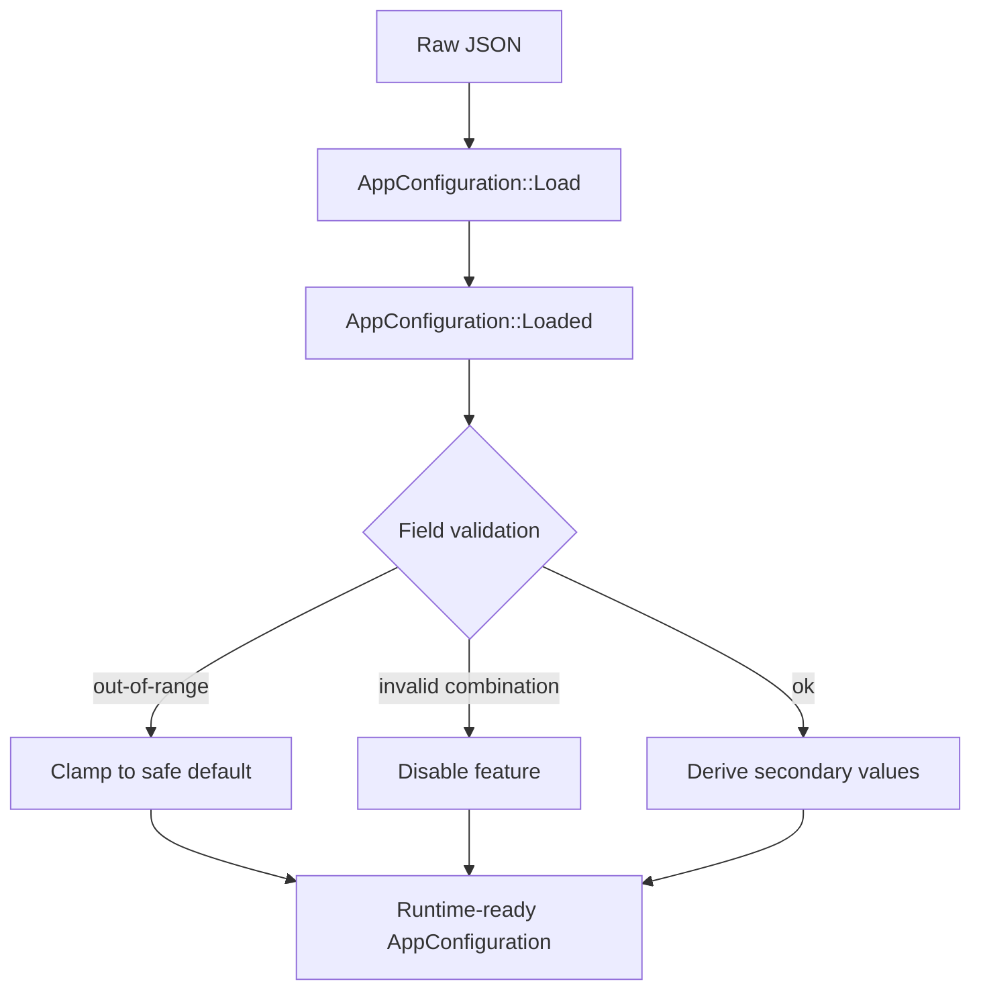
```mermaid
flowchart TD
    A[Raw JSON] --> B[AppConfiguration::Load]
    B --> C[AppConfiguration::Loaded]
    C --> D{Field validation}
    D -->|out-of-range| E[Clamp to safe default]
    D -->|invalid combination| F[Disable feature]
    D -->|ok| G[Derive secondary values]
    E --> H[Runtime-ready AppConfiguration]
    F --> H
    G --> H
```

Key configuration groups:

| Group | Key fields | Notes |
|-------|------------|-------|
| `key` | `kf`, `kx`, `kl`, `kh`, `protocol`, `transport`, `masked`, `plaintext`, `delta-encode`, `shuffle-data` | Cipher and obfuscation parameters |
| `server` | `bind`, `port`, `subnet`, `dns`, `ip`, `mask` | Server listen and IP pool |
| `client` | `server`, `bandwidth`, `reconnections`, `paper-airplane` | Client connection target and QoS |
| `concurrent` | (integer) | Number of io_context threads |
| `cdn` | (array) | Obfuscation CDN port modes |

Full reference: [`docs/CONFIGURATION.md`](docs/CONFIGURATION.md)

---

## Protocol and Transport Overview

### ITransmission: the handshake and framing layer

`ITransmission` (`ppp/transmissions/ITransmission.h`) owns:

- **Handshake**: NOP exchange → session ID → ivv → nmux → cipher rebuild
- **Framing**: base94 frame header (first packet: 4+3 bytes, later: 4 bytes)
- **Masking**: byte-level mask applied to payload header bytes
- **Delta encoding**: incremental delta compression on payload data
- **Two cipher layers**: protocol cipher (header metadata) and transport cipher (payload), both derived from `ivv + nmux + base_key`

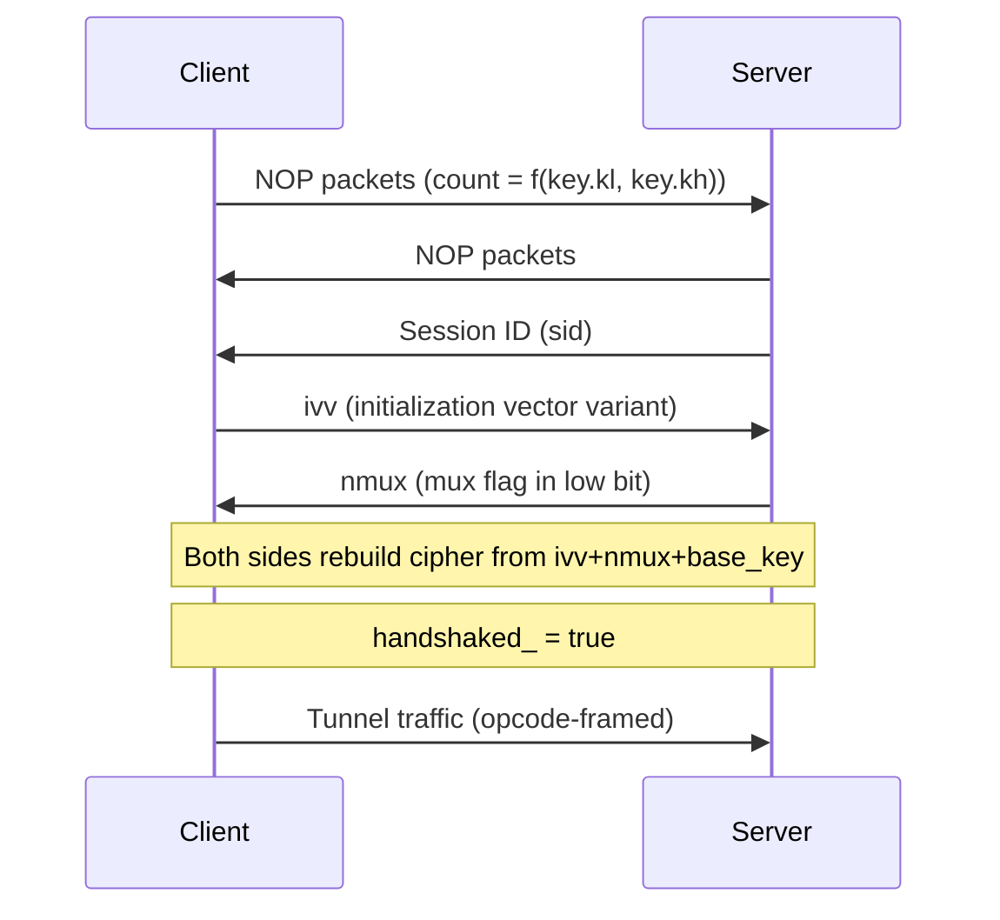
```mermaid
sequenceDiagram
    participant C as Client
    participant S as Server

    C->>S: NOP packets (count = f(key.kl, key.kh))
    S->>C: NOP packets
    S->>C: Session ID (sid)
    C->>S: ivv (initialization vector variant)
    S->>C: nmux (mux flag in low bit)
    Note over C,S: Both sides rebuild cipher from ivv+nmux+base_key
    Note over C,S: handshaked_ = true
    C->>S: Tunnel traffic (opcode-framed)
```

Carrier implementations:

| Class | Transport | Source |
|-------|-----------|--------|
| `ITcpipTransmission` | Plain TCP | `ppp/transmissions/ITcpipTransmission.h` |
| `IWebsocketTransmission` | WebSocket / TLS WS | `ppp/transmissions/IWebsocketTransmission.h` |

### VirtualEthernetLinklayer: the opcode protocol

`VirtualEthernetLinklayer` (`ppp/app/protocol/VirtualEthernetLinklayer.h`) defines the tunnel protocol. Every tunnel packet begins with a 1-byte opcode.

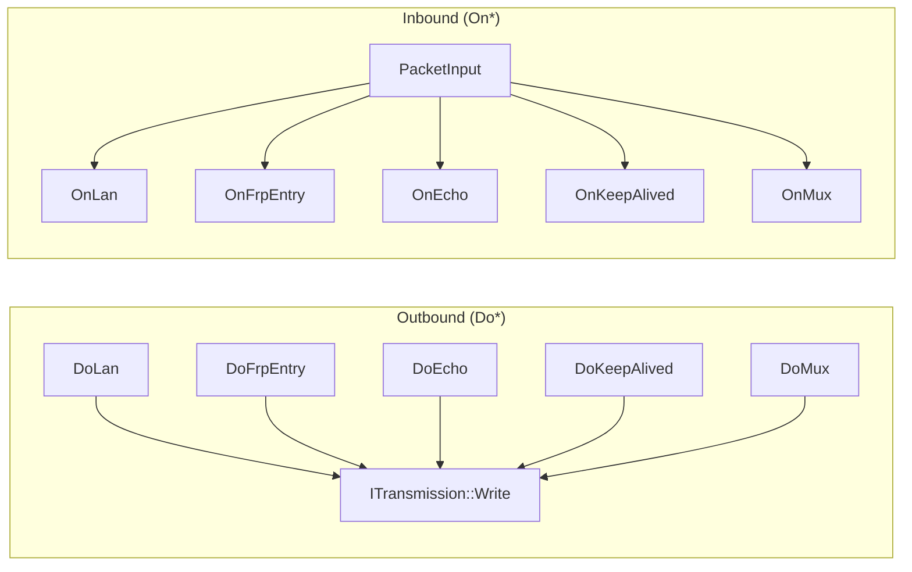
```mermaid
graph LR
    subgraph "Outbound (Do*)"
        D1[DoLan] --> OUT[ITransmission::Write]
        D2[DoFrpEntry] --> OUT
        D3[DoEcho] --> OUT
        D4[DoKeepAlived] --> OUT
        D5[DoMux] --> OUT
    end
    subgraph "Inbound (On*)"
        IN[PacketInput] --> O1[OnLan]
        IN --> O2[OnFrpEntry]
        IN --> O3[OnEcho]
        IN --> O4[OnKeepAlived]
        IN --> O5[OnMux]
    end
```

Key opcodes:

| Opcode | Value | Direction | Purpose |
|--------|-------|-----------|---------|
| `INFO` | `0x7E` | Both | Session info exchange |
| `KEEPALIVED` | `0x7F` | Both | Keep-alive heartbeat |
| `FRP_ENTRY` | `0x20` | C→S | New TCP connection request |
| `FRP_CONNECT` | `0x21` | S→C | Connection accepted |
| `FRP_CONNECT_OK` | `0x22` | C→S | Client acknowledged |
| `FRP_PUSH` | `0x23` | Both | TCP data push |
| `FRP_DISCONNECT` | `0x24` | Both | TCP connection close |
| `FRP_SENDTO` | `0x25` | Both | UDP datagram |
| `LAN` | `0x28` | Both | Raw Ethernet/IP frame |
| `PacketAction_NAT` | `0x29` | Both | NAT path packet |
| `DoEcho` | `0x2F` | C→S | ICMP echo request proxy |
| `PacketAction_STATIC` | `0x31` | Both | Static path packet |
| `PacketAction_STATICACK` | `0x32` | Both | Static path acknowledgment |
| `PacketAction_MUX` | `0x35` | Both | MUX channel data |
| `PacketAction_MUXON` | `0x36` | Both | MUX channel open |

Full opcode reference: [`docs/LINKLAYER_PROTOCOL.md`](docs/LINKLAYER_PROTOCOL.md)

---

## Client Runtime Summary

The client runtime (`ppp/app/client/`) connects to the server and integrates with the host OS networking.

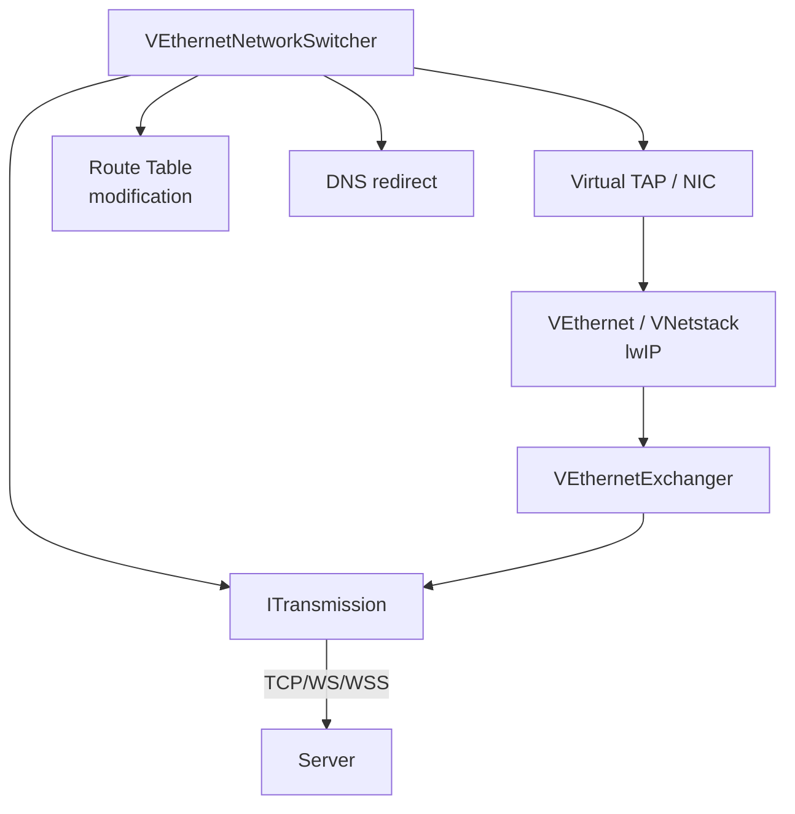
```mermaid
graph TD
    A[VEthernetNetworkSwitcher] --> B[ITransmission]
    A --> C[Virtual TAP / NIC]
    A --> D[Route Table\nmodification]
    A --> E[DNS redirect]
    C --> F[VEthernet / VNetstack\nlwIP]
    F --> G[VEthernetExchanger]
    G --> B
    B -->|TCP/WS/WSS| H[Server]
```

Responsibilities:

| Component | Responsibility |
|-----------|---------------|
| `VEthernetNetworkSwitcher` | Top-level client controller; manages reconnection, restart modes |
| `VEthernetExchanger` | Per-session tunnel action handler: FRP, UDP, ICMP, MUX, static |
| Virtual TAP | Provides a virtual Ethernet adapter to the OS |
| Route management | Redirects traffic through the tunnel |
| DNS redirect | Points OS DNS to tunnel endpoint |

**Restart modes:**

| Mode | What is rebuilt | What is preserved |
|------|----------------|-------------------|
| `--auto-restart` | Full runtime: TAP + Switcher | Nothing |
| `--link-restart` | ITransmission only | Switcher, TAP, routes |

Full reference: [`docs/CLIENT_ARCHITECTURE.md`](docs/CLIENT_ARCHITECTURE.md)

---

## Server Runtime Summary

The server runtime (`ppp/app/server/`) accepts connections and coordinates per-session state.

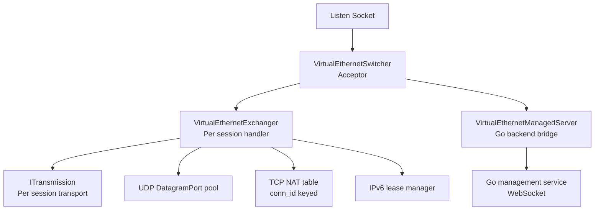
```mermaid
graph TD
    A[Listen Socket] --> B[VirtualEthernetSwitcher\nAcceptor]
    B --> C[VirtualEthernetExchanger\nPer session handler]
    C --> D[ITransmission\nPer session transport]
    C --> E[UDP DatagramPort pool]
    C --> F[TCP NAT table\nconn_id keyed]
    C --> G[IPv6 lease manager]
    B --> H[VirtualEthernetManagedServer\nGo backend bridge]
    H --> I[Go management service\nWebSocket]
```

Session lifecycle:

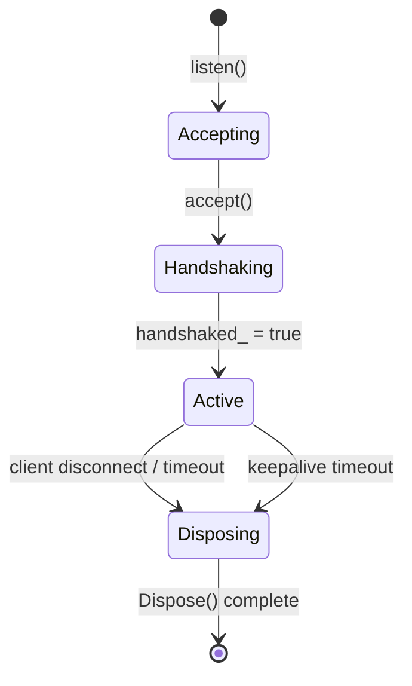
```mermaid
stateDiagram-v2
    [*] --> Accepting: listen()
    Accepting --> Handshaking: accept()
    Handshaking --> Active: handshaked_ = true
    Active --> Disposing: client disconnect / timeout
    Active --> Disposing: keepalive timeout
    Disposing --> [*]: Dispose() complete
```

Key facts:
- TCP `conn_id`: 32-bit, monotonically increasing per session, client-assigned. Server NAT table key = `(session_id, conn_id)`. Released on `OnDisconnect`.
- QoS token bucket: per-session, refill rate from `bandwidth` field (bytes/sec). Coroutine suspends on exhaustion.
- `OnTick()` tasks: stats refresh, tunnel liveness check, session aging, IPv6 lease aging, TUI dirty-flag publish.

Full reference: [`docs/SERVER_ARCHITECTURE.md`](docs/SERVER_ARCHITECTURE.md)

---

## Platform Integration Summary

The virtual NIC layer is abstracted by `ITap` (`ppp/tap/ITap.h`). Platform implementations differ significantly.

```mermaid
graph TD
    A[ITap interface\nppp/tap/ITap.h] --> B[TapLinux\nlinux/ppp/tap]
    A --> C[TapWindows\nwindows/ppp/tap]
    A --> D[TapDarwin\ndarwin/ppp/tap]
    A --> E[Android TapLinux variant\nandroid/libopenppp2.cpp]
    B --> B1[/dev/net/tun\nIFF_TUN or IFF_MULTI_QUEUE SSMT]
    C --> C1[Wintun ring-buffer\npreferred]
    C --> C2[TAP-Windows overlapped I/O\nfallback]
    D --> D1[/dev/utun*\n4-byte AF prefix strip/prepend]
    E --> E1[VpnService fd\nno /dev/net/tun open]
```

Platform-specific behaviors:

| Platform | Virtual NIC | Route management | Notes |
|----------|------------|-----------------|-------|
| Linux | `/dev/net/tun`, `IFF_TUN` | `ip route` / netlink | SSMT: one fd per io_context via `TapLinux::Ssmt()` |
| Windows | Wintun (preferred) or TAP-Windows | WinAPI routing table | `TapWindows::InstallDriver()` requires admin |
| macOS | `/dev/utun*` | BSD routing socket | 4-byte AF prefix on all frames |
| Android | `VpnService` fd | VpnService routing | JNI: `__LIBOPENPPP2__` macro; no direct tun open |

Full reference: [`docs/PLATFORMS.md`](docs/PLATFORMS.md)

---

## Concurrency and Threading Model

OPENPPP2 uses Boost.Asio `io_context` as its event loop, combined with C++ coroutines via `YieldContext`.

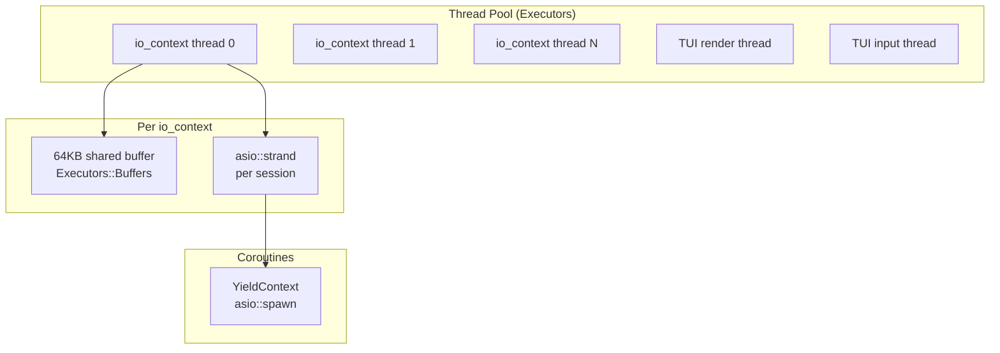
```mermaid
graph TD
    subgraph "Thread Pool (Executors)"
        T1[io_context thread 0]
        T2[io_context thread 1]
        TN[io_context thread N]
        TR[TUI render thread]
        TI[TUI input thread]
    end
    subgraph "Per io_context"
        T1 --> B1[64KB shared buffer\nExecutors::Buffers]
        T1 --> S1[asio::strand\nper session]
    end
    subgraph "Coroutines"
        S1 --> Y[YieldContext\nasio::spawn]
    end
```

**Critical rules:**
- Never block the IO thread.
- Cross-thread shared state: `std::shared_ptr` / `std::weak_ptr` for object lifetime.
- Lifecycle flags: `std::atomic<bool>` with `compare_exchange_strong(memory_order_acq_rel)`.
- `Executors::Awaitable<T>`: bridge for OS-thread callers waiting on IO-thread results. `Await()` must never be called from an IO thread.
- `nullof<YieldContext>()` returns a sentinel address for non-coroutine callers. Used deliberately in `DoKeepAlived()` and DNS paths.

`YieldContext` state transitions:

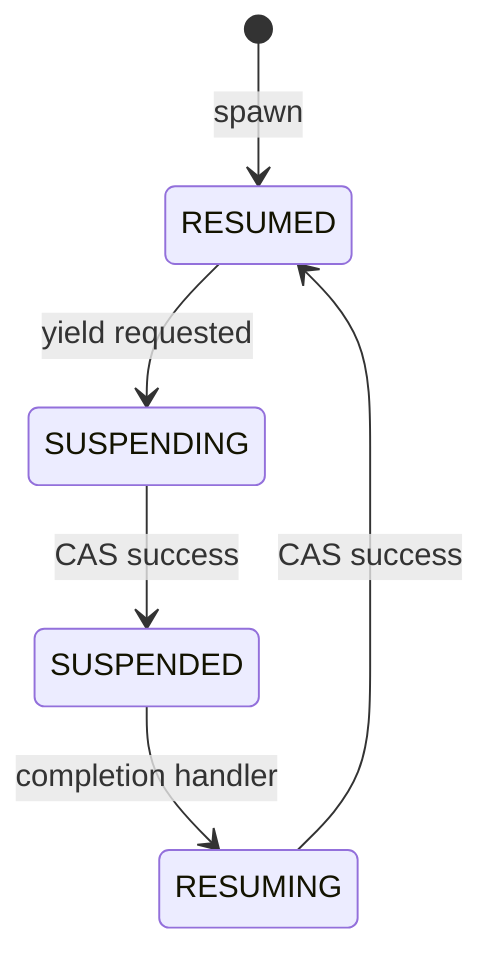
```mermaid
stateDiagram-v2
    [*] --> RESUMED: spawn
    RESUMED --> SUSPENDING: yield requested
    SUSPENDING --> SUSPENDED: CAS success
    SUSPENDED --> RESUMING: completion handler
    RESUMING --> RESUMED: CAS success
```

Full reference: [`docs/CONCURRENCY_MODEL.md`](docs/CONCURRENCY_MODEL.md)

---

## Error Handling Summary

Errors are represented as typed error codes defined in `ppp/diagnostics/ErrorCodes.def` via X-macro. There are **466 error codes across 22 categories**.

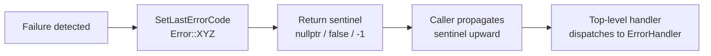
```mermaid
flowchart LR
    A[Failure detected] --> B[SetLastErrorCode\nError::XYZ]
    B --> C[Return sentinel\nnullptr / false / -1]
    C --> D[Caller propagates\nsentinel upward]
    D --> E[Top-level handler\ndispatches to ErrorHandler]
```

Error code categories (partial):

| Category | Examples |
|----------|---------|
| App startup | `AppPrivilegeRequired`, `AppAlreadyRunning`, `TunnelOpenFailed` |
| Protocol | `ProtocolKeepAliveTimeout`, `ProtocolCipherMismatch` |
| Session | `SessionDisposed`, `ResourceExhaustedSessionSlots` |
| Auth | `AuthCredentialInvalid` |
| IPv6 | `IPv6LeaseConflict`, `IPv6ServerPrepareFailed` |
| Generic | `GenericCanceled`, `GenericTimeout`, `SocketDisconnected` |
| Internal | `InternalLogicStateCorrupted` |

**Normal-operation benign codes** (high frequency, not problems):
- `GenericCanceled`, `GenericTimeout`, `SocketDisconnected`, `SessionDisposed`, `FirewallSegmentBlocked`

**Problem-indicating codes** (require operator attention):
- `AppPrivilegeRequired`, `TunnelOpenFailed`, `ProtocolCipherMismatch`, `AuthCredentialInvalid`, `InternalLogicStateCorrupted`

Atomic error snapshot: high 32 bits = truncated millisecond timestamp; low 32 bits = error code value.

Full reference: [`docs/ERROR_CODES.md`](docs/ERROR_CODES.md), [`docs/ERROR_HANDLING_API.md`](docs/ERROR_HANDLING_API.md)

---

## Management Backend

The Go backend (`go/`) is a completely separate optional process. It provides managed authentication and webhook capability that the C++ server calls over WebSocket.

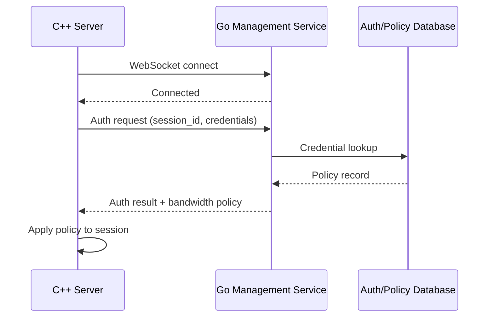
```mermaid
sequenceDiagram
    participant C as C++ Server
    participant G as Go Management Service
    participant DB as Auth/Policy Database

    C->>G: WebSocket connect
    G-->>C: Connected
    C->>G: Auth request (session_id, credentials)
    G->>DB: Credential lookup
    DB-->>G: Policy record
    G-->>C: Auth result + bandwidth policy
    C->>C: Apply policy to session
```

Build and run independently:

```bash
cd go && go build -o ppp-go .
./ppp-go --config=./management.json
```

The C++ server enables managed mode by setting `server.managed` to the Go service address in `appsettings.json`. Without the Go backend, the server runs in standalone mode with no external auth.

Full reference: [`docs/MANAGEMENT_BACKEND.md`](docs/MANAGEMENT_BACKEND.md)

---

## Security Summary

Security operates at two independent layers:

| Layer | What it protects | Cipher source |
|-------|-----------------|---------------|
| Protocol cipher | Header metadata and session framing | `ivv + nmux + base_key` |
| Transport cipher | Payload data | `ivv + nmux + base_key` (different derivation) |

Additional obfuscation features (configured via `key.*`):

| Feature | Config field | Description |
|---------|-------------|-------------|
| Masking | `masked: true` | Byte-level mask on header bytes |
| Delta encoding | `delta-encode: true` | Incremental delta on payload |
| Data shuffling | `shuffle-data: true` | Reorders bytes in payload |
| Plaintext mode | `plaintext: true` | Disables all encryption (test only) |

Supported cipher algorithms: AES-128-CFB, AES-256-CFB, and variants. The `kf`, `kx`, `kl`, `kh` fields in `key` control the NOP handshake timing and framing shape, making traffic fingerprinting significantly harder.

Full reference: [`docs/SECURITY.md`](docs/SECURITY.md)

---

## Code Facts That Shape The Docs

| Fact | Consequence |
|------|-------------|
| `main.cpp` owns startup, role selection, lifecycle, and host setup | The documentation separates bootstrap from runtime behavior |
| `AppConfiguration` normalizes many fields after load | The configuration docs must explain defaults and invalid-state cleanup |
| `ITransmission` performs handshake, framing, masking, delta encoding, and cipher layering | The transport docs must be implementation-driven, not abstract |
| `VirtualEthernetLinklayer` defines opcode-based tunnel actions | The protocol docs must explain actual opcodes and message flow |
| Client and server runtimes are different roles | The architecture docs must not treat them as symmetric peers |
| Platform code changes route, DNS, adapter, and firewall behavior | Platform docs must be explicit about side effects |
| The Go backend is optional | Managed deployment must be documented separately |
| `nullof<YieldContext>()` is intentional sentinel design, not UB | Concurrency docs must explain coroutine vs non-coroutine call paths |
| `NULLPTR` macro is mandatory (never `nullptr`) | All code examples use `NULLPTR` |
| UDP 64KB buffer is per-thread shared (not per-socket) | Memory docs must not mischaracterize this as UB |
| `stdafx.h` defines all platform guards and type aliases | New code must use `ppp::` types, `_WIN32`/`_LINUX` macros |
| No automated test suite | CI verifies compilation only; behavioral regressions are prose-only in docs |

---

## Boundaries

| Not true | True |
|---------|------|
| Consumer one-click VPN | Developer-oriented network runtime |
| Symmetric client/server peers | Role-specific runtimes with different responsibilities |
| Pure transport library | End-to-end system with host integration |
| Go is required | Go backend is optional |
| Routing is incidental | Routing and DNS are first-class runtime behavior |
| Single-cipher transport | Two independent cipher layers: protocol and transport |
| Simple session model | Sessions have full lifecycle: handshake, active, dispose, restart |
| Platform code is boilerplate | Platform code has significant behavioral differences per OS |

---

## Quick Reference

| Command | Purpose |
|---------|---------|
| `ppp --help` | Show the real CLI help |
| `ppp --mode=client` | Start in client mode |
| `ppp --mode=server` | Start in server mode |
| `ppp --config=./config.json` | Load an explicit config file |
| `ppp --pull-iplist [file/country]` | Download an IP list and exit |
| `ppp --mode=client --auto-restart` | Full restart on disconnect |
| `ppp --mode=client --link-restart` | Reconnect transport only on disconnect |

### Key source entry points

| What you want to understand | Start here |
|-----------------------------|-----------|
| Process startup | `main.cpp` |
| Configuration loading | `ppp/configurations/AppConfiguration.cpp` → `Loaded()` |
| Handshake mechanics | `ppp/transmissions/ITransmission.cpp` |
| Tunnel opcodes | `ppp/app/protocol/VirtualEthernetLinklayer.h` |
| Client session logic | `ppp/app/client/VEthernetExchanger.cpp` |
| Server session logic | `ppp/app/server/VirtualEthernetExchanger.cpp` |
| Virtual NIC interface | `ppp/tap/ITap.h` |
| Error code definitions | `ppp/diagnostics/ErrorCodes.def` |
| Thread pool and io_context | `ppp/threading/Executors.h` |
| lwIP integration | `ppp/ethernet/VNetstack.cpp` |

---

## Notes

- Example configuration values are examples, not production defaults.
- Linux is the most complete server-side IPv6 data-plane target.
- The documentation uses long-form bilingual writing because the system is implementation-heavy.
- `main.cpp` is the fastest entry point for understanding how the pieces connect.
- C++17 strictly — no C++20 features anywhere in the codebase.
- All code uses `ppp::` type aliases (`ppp::string`, `ppp::vector<T>`, `ppp::Byte`, etc.) defined in `ppp/stdafx.h`.
- Memory allocation routes through `ppp::Malloc` / `ppp::Mfree`, which use jemalloc when `JEMALLOC` is defined.
- Platform guards use repo macros only: `_WIN32`, `_LINUX`, `_MACOS`, `_ANDROID`. Never use `#ifdef __linux__` or `#ifdef _MSC_VER` in `ppp/` shared files.
- All public APIs are documented with Doxygen (`@brief`, `@param`, `@return`, `@note`, `@warning`).
- All functions aim to be `noexcept`. Exceptions are caught and converted to error codes at the boundary.

---

## IPv6 Subsystem Overview

OPENPPP2 includes a full IPv6 lease management and data-plane forwarding system on the server side. This is one of the more complex subsystems.

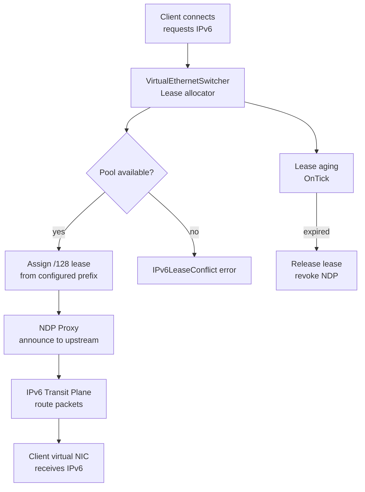
```mermaid
graph TD
    A[Client connects\nrequests IPv6] --> B[VirtualEthernetSwitcher\nLease allocator]
    B --> C{Pool available?}
    C -->|yes| D[Assign /128 lease\nfrom configured prefix]
    C -->|no| E[IPv6LeaseConflict error]
    D --> F[NDP Proxy\nannounce to upstream]
    F --> G[IPv6 Transit Plane\nroute packets]
    G --> H[Client virtual NIC\nreceives IPv6]
    B --> I[Lease aging\nOnTick]
    I -->|expired| J[Release lease\nrevoke NDP]
```

### IPv6 lease lifecycle

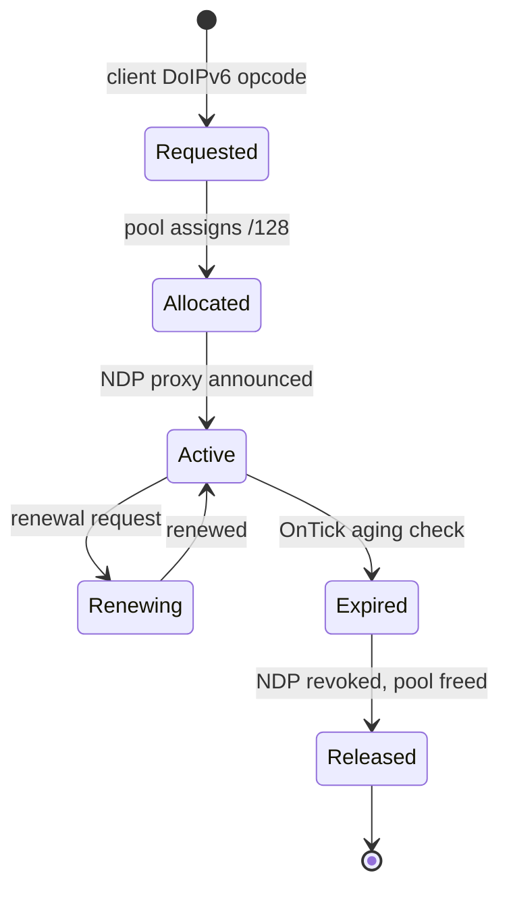
```mermaid
stateDiagram-v2
    [*] --> Requested: client DoIPv6 opcode
    Requested --> Allocated: pool assigns /128
    Allocated --> Active: NDP proxy announced
    Active --> Renewing: renewal request
    Renewing --> Active: renewed
    Active --> Expired: OnTick aging check
    Expired --> Released: NDP revoked, pool freed
    Released --> [*]
```

Key facts:
- Server maintains a lease table keyed by `(session_id, ipv6_address)`.
- NDP proxy announces leased addresses to the upstream router so return traffic is routed correctly.
- IPv6 lease aging runs in `OnTick()` — not in a separate thread.
- Linux is the primary platform for IPv6 data-plane. Windows and Android have limited IPv6 support in this context.

Full reference: [`docs/IPV6_LEASE_MANAGEMENT.md`](docs/IPV6_LEASE_MANAGEMENT.md), [`docs/IPV6_TRANSIT_PLANE.md`](docs/IPV6_TRANSIT_PLANE.md), [`docs/IPV6_NDP_PROXY.md`](docs/IPV6_NDP_PROXY.md), [`docs/IPV6_CLIENT_ASSIGNMENT.md`](docs/IPV6_CLIENT_ASSIGNMENT.md)

---

## TUI Console Interface

OPENPPP2 includes a built-in terminal UI (`ppp/app/ConsoleUI.h`). It runs on two dedicated threads (render and input), both outside the Boost.Asio io_context pool.

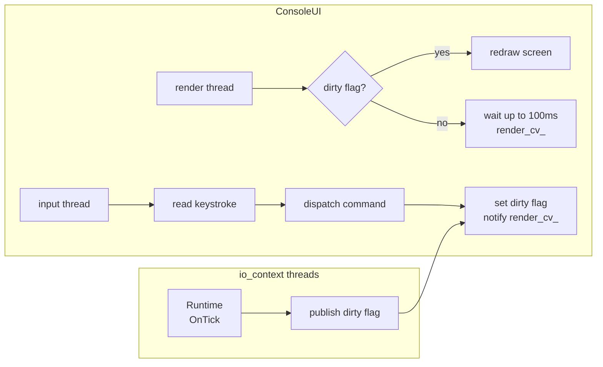
```mermaid
graph LR
    subgraph "ConsoleUI"
        RI[render thread] --> RD{dirty flag?}
        RD -->|yes| DRAW[redraw screen]
        RD -->|no| WAIT[wait up to 100ms\nrender_cv_]
        II[input thread] --> READ[read keystroke]
        READ --> CMD[dispatch command]
        CMD --> DF[set dirty flag\nnotify render_cv_]
    end
    subgraph "io_context threads"
        RT[Runtime\nOnTick] --> DF2[publish dirty flag]
        DF2 --> DF
    end
```

TUI layout:
- Fixed 10-row header (connection status, session stats, bandwidth)
- Scrollable 3-section body: info / command output / input history
- Fixed 5-row footer (input prompt)
- Alternate screen buffer (`\x1b[?1049h` on enter, `\x1b[?1049l` on exit)
- Real cursor hidden for full TUI lifetime
- Minimum terminal size: 40 columns × 20 rows

Full reference: [`docs/TUI_DESIGN.md`](docs/TUI_DESIGN.md)

---

## Static Routes and NAT Paths

Beyond tunneling Ethernet frames, OPENPPP2 supports two special forwarding paths: **NAT** and **Static**.

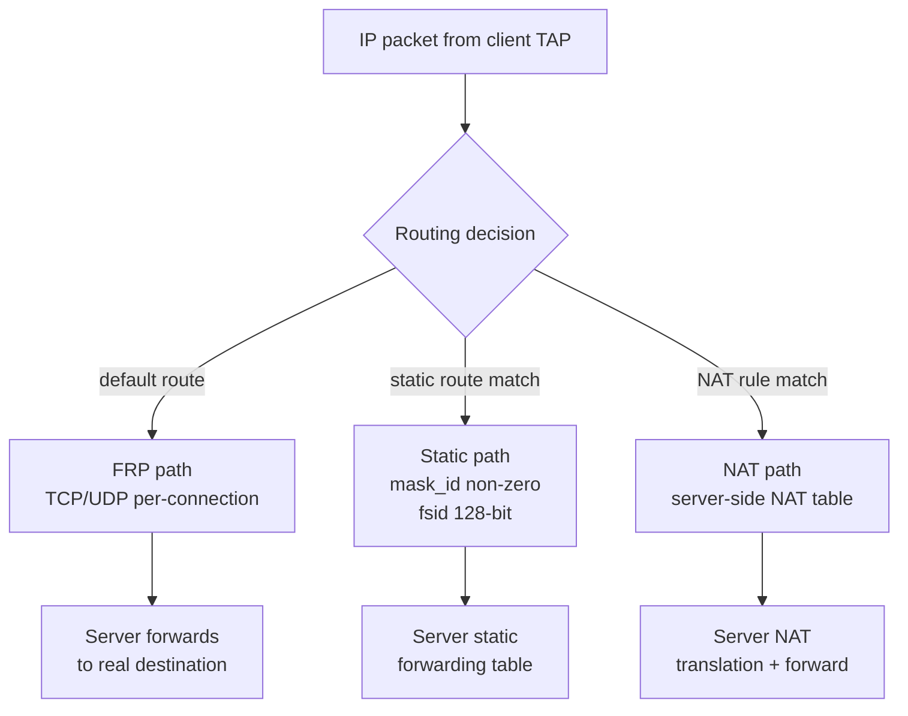
```mermaid
flowchart TD
    A[IP packet from client TAP] --> B{Routing decision}
    B -->|default route| C[FRP path\nTCP/UDP per-connection]
    B -->|static route match| D[Static path\nmask_id non-zero\nfsid 128-bit]
    B -->|NAT rule match| E[NAT path\nserver-side NAT table]
    C --> F[Server forwards\nto real destination]
    D --> G[Server static\nforwarding table]
    E --> H[Server NAT\ntranslation + forward]
```

Static packet constraints:
- `mask_id` must be non-zero (identifies the static route entry).
- `session_id` sign encodes address family: positive = UDP, negative = IP.
- `fsid` is a 128-bit identifier (`Int128`) for the flow.
- Checksum covers header + payload after all transforms.
- Pack pipeline has 14 steps; unpack exactly reverses them.

Full reference: [`docs/PACKET_FORMATS.md`](docs/PACKET_FORMATS.md), [`docs/TUNNEL_DESIGN.md`](docs/TUNNEL_DESIGN.md)

---

## MUX Channel Multiplexing

The MUX subsystem allows multiple logical sub-connections to share a single `ITransmission` carrier.

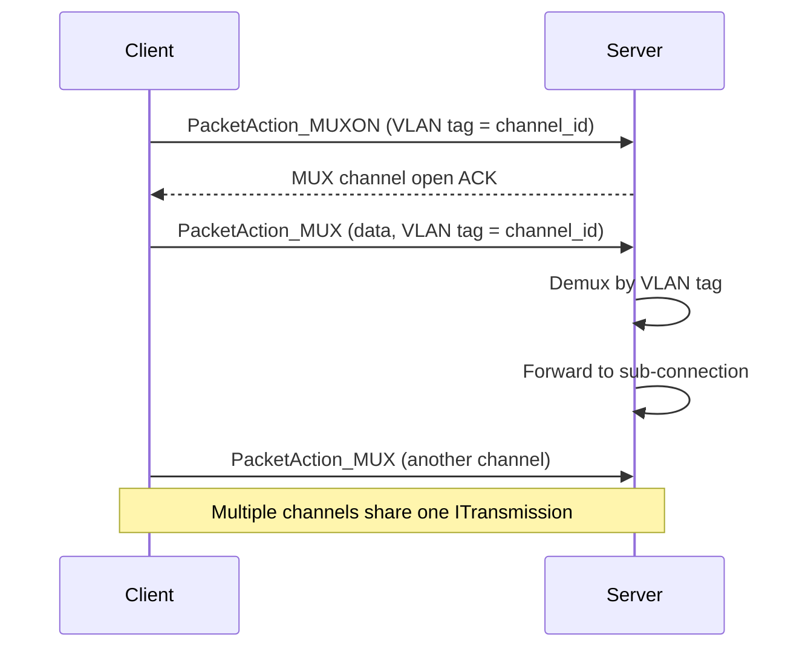
```mermaid
sequenceDiagram
    participant C as Client
    participant S as Server

    C->>S: PacketAction_MUXON (VLAN tag = channel_id)
    S-->>C: MUX channel open ACK
    C->>S: PacketAction_MUX (data, VLAN tag = channel_id)
    S->>S: Demux by VLAN tag
    S->>S: Forward to sub-connection
    C->>S: PacketAction_MUX (another channel)
    Note over C,S: Multiple channels share one ITransmission
```

Key facts:
- VLAN tag in the MUX packet header identifies the logical channel.
- `nmux` low bit in the handshake enables MUX mode.
- All sub-connections share the same underlying TCP/WS connection.
- Reduces connection setup overhead when many concurrent streams are needed.

Full reference: [`docs/LINKLAYER_PROTOCOL.md`](docs/LINKLAYER_PROTOCOL.md)

---

## Packet Lifecycle (Summary)

A full end-to-end packet journey from client application to remote host and back:

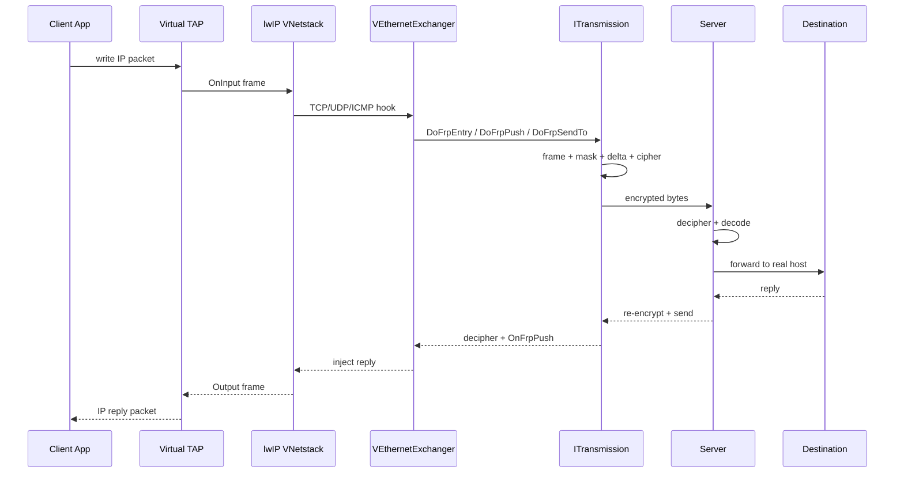
```mermaid
sequenceDiagram
    participant APP as Client App
    participant TAP as Virtual TAP
    participant LWIP as lwIP VNetstack
    participant EX as VEthernetExchanger
    participant TX as ITransmission
    participant SRV as Server
    participant DST as Destination

    APP->>TAP: write IP packet
    TAP->>LWIP: OnInput frame
    LWIP->>EX: TCP/UDP/ICMP hook
    EX->>TX: DoFrpEntry / DoFrpPush / DoFrpSendTo
    TX->>TX: frame + mask + delta + cipher
    TX->>SRV: encrypted bytes
    SRV->>SRV: decipher + decode
    SRV->>DST: forward to real host
    DST-->>SRV: reply
    SRV-->>TX: re-encrypt + send
    TX-->>EX: decipher + OnFrpPush
    EX-->>LWIP: inject reply
    LWIP-->>TAP: Output frame
    TAP-->>APP: IP reply packet
```

Full reference: [`docs/PACKET_LIFECYCLE.md`](docs/PACKET_LIFECYCLE.md)

---

## EDSM State Machines

OPENPPP2 uses an event-driven state machine (EDSM) architecture at every level: per-session, per-connection, per-transmission, and at the application lifecycle level.

```mermaid
stateDiagram-v2
    [*] --> Idle
    Idle --> Connecting: Connect()
    Connecting --> Handshaking: socket connected
    Handshaking --> Running: handshaked_ = true
    Running --> Reconnecting: transport error
    Running --> Stopping: Dispose() called
    Reconnecting --> Connecting: restart delay elapsed
    Stopping --> [*]: cleanup complete
```

Each state transition is driven by an Asio completion handler or a coroutine resume, not by a polling loop. The state machine never advances from a blocked OS thread.

State machine properties:
- All transitions happen on an `asio::strand` to avoid concurrent state mutations.
- `compare_exchange_strong` guards lifecycle flag transitions.
- `Dispose()` is idempotent: calling it multiple times is safe.
- Objects are kept alive by `std::shared_ptr` reference counting until all in-flight coroutines complete.

Full reference: [`docs/EDSM_STATE_MACHINES.md`](docs/EDSM_STATE_MACHINES.md)

---

## Transmission Pack / Session ID

Session identity is packed into the framed transmission stream. The `TRANSMISSION_PACK_SESSIONID` document covers the exact byte layout.

```mermaid
graph LR
    subgraph "First packet (extended header)"
        H1[4 bytes: length+flags] --> H2[3 bytes: session ID extension]
        H2 --> P[payload]
    end
    subgraph "Subsequent packets (simple header)"
        S1[4 bytes: length+flags] --> SP[payload]
    end
    H1 --> FT[frame_tn_ / frame_rn_ counter\ncontrols header mode]
```

The transition from extended to simple header is controlled by `frame_tn_` (transmit) and `frame_rn_` (receive) counters. The first packet in each direction uses the extended header; all subsequent packets use the simple 4-byte header.

Full reference: [`docs/TRANSMISSION_PACK_SESSIONID.md`](docs/TRANSMISSION_PACK_SESSIONID.md)

---

## Deployment Topologies

### Standalone server with direct clients

```mermaid
graph LR
    C1[Client A] -->|ppp://server:20000/| S[ppp server]
    C2[Client B] -->|ppp://server:20000/| S
    C3[Client C] -->|ppp://ws/server:20000/| S
    S --> I[Internet]
```

### Managed deployment with Go backend

```mermaid
graph LR
    C1[Client A] --> S[ppp server]
    C2[Client B] --> S
    S -->|WebSocket auth| G[ppp-go management]
    G --> DB[(User/Policy DB)]
    S --> I[Internet]
```

### CDN / reverse proxy fronted

```mermaid
graph LR
    C1[Client] -->|HTTPS/WSS| CDN[CDN or reverse proxy]
    CDN -->|WS| S[ppp server]
    S --> I[Internet]
```

The `cdn` field in `appsettings.json` configures port-mode obfuscation to make the traffic appear as regular HTTP/WebSocket to intermediate proxies.

Full reference: [`docs/DEPLOYMENT.md`](docs/DEPLOYMENT.md)

---

## Operations Reference

### Key runtime indicators

| Indicator | What it means |
|-----------|--------------|
| Keepalive timeout | `ProtocolKeepAliveTimeout` error code; session disposed |
| High `GenericTimeout` rate | Network congestion or path instability |
| `ResourceExhaustedSessionSlots` | Server session limit reached; increase `concurrent` or add instances |
| `AuthCredentialInvalid` | Credential mismatch; check `key.*` fields on both sides |
| `TunnelOpenFailed` at startup | TAP driver not installed (Windows) or insufficient privilege |
| `AppPrivilegeRequired` | Run as root (Linux/macOS) or Administrator (Windows) |

### `OnTick()` schedule

The main runtime tick fires on a configurable interval (default ~1 second). Each tick:

1. Refresh bandwidth / session statistics.
2. Check tunnel liveness (keepalive timeout detection).
3. Age out stale sessions (server).
4. Age out expired IPv6 leases (server).
5. Publish dirty flag to TUI render thread.
6. Reschedule via `NextTickAlwaysTimeout(false)`.

Full reference: [`docs/OPERATIONS.md`](docs/OPERATIONS.md)

---

## Diagnostics and Error System

The diagnostics subsystem provides structured error reporting without logging.

```mermaid
flowchart TD
    A[Error occurs\nin any subsystem] --> B[SetLastErrorCode\nError::XYZ\nthread-local]
    B --> C[Atomic snapshot\nhigh32=timestamp\nlow32=error_code]
    C --> D[ErrorHandler::Dispatch\nregistered callbacks]
    D --> E[TUI error display]
    D --> F[Management backend\nerror reporting]
    D --> G[Caller return value\nsentinel propagation]
```

The error snapshot is atomic: it can be read from any thread without locking. The timestamp is truncated milliseconds, sufficient for ordering events within a session.

Full reference: [`docs/DIAGNOSTICS_ERROR_SYSTEM.md`](docs/DIAGNOSTICS_ERROR_SYSTEM.md), [`docs/ERROR_CODES.md`](docs/ERROR_CODES.md)
