# OPENPPP2

[English](README.md) | 简体中文

OPENPPP2 是一套源码驱动、跨平台的网络运行时，围绕 C++ 主程序 `ppp` 构建，并提供一个可选的 Go 管理后端。它的真实实现边界分布在 `main.cpp`、`ppp/configurations`、`ppp/transmissions`、`ppp/app/protocol`、`ppp/app/client`、`ppp/app/server` 以及各平台宿主集成目录中。

它不能只被理解成 VPN client、VPN server 或 custom transport 中的某一种。代码实际组合的是一个分层系统：

| 层级 | 真实作用 | 主要代码区 |
|------|----------|------------|
| 受保护传输 | 负责分帧、加密、混淆与握手形态塑造 | `ppp/transmissions/*` |
| 隧道协议 | 定义会话标识、link-layer opcode、包语义 | `ppp/app/protocol/*` |
| 客户端运行时 | 对接虚拟网卡、路由、DNS、代理、MUX | `ppp/app/client/*` |
| 服务端运行时 | 接入会话、交换、转发、IPv6、静态路径 | `ppp/app/server/*` |
| 平台集成 | 绑定 Windows/Linux/macOS/Android 的宿主网络 API | `windows/*`、`linux/*`、`darwin/*`、`android/*` |
| 管理后端 | 可选 Go 服务，用于 managed deployment | `go/*` |

文档采用从代码事实出发的写法，目标是解释系统为什么这样设计、每个层次实际负责什么、以及部署和继续开发时应该如何理解这些边界。

---

## 目录

1. [系统架构总览](#系统架构总览)
2. [从这里开始](#从这里开始)
3. [推荐阅读路径](#推荐阅读路径)
4. [文档总表](#文档总表)
5. [仓库结构](#仓库结构)
6. [构建说明](#构建说明)
7. [快速开始](#快速开始)
8. [配置概述](#配置概述)
9. [协议与传输层概述](#协议与传输层概述)
10. [客户端运行时概述](#客户端运行时概述)
11. [服务端运行时概述](#服务端运行时概述)
12. [平台集成概述](#平台集成概述)
13. [并发与线程模型](#并发与线程模型)
14. [错误处理概述](#错误处理概述)
15. [管理后端](#管理后端)
16. [安全机制概述](#安全机制概述)
17. [代码事实决定的文档边界](#代码事实决定的文档边界)
18. [边界说明](#边界说明)
19. [快速参考](#快速参考)
20. [说明](#说明)

---

## 系统架构总览

以下图表展示了 OPENPPP2 运行时的顶层分层结构。每个方框对应实际源码目录。

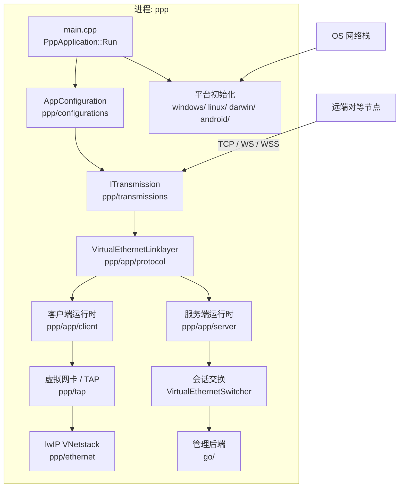
```mermaid
graph TD
    subgraph "进程: ppp"
        A[main.cpp\nPppApplication::Run] --> B[AppConfiguration\nppp/configurations]
        A --> C[平台初始化\nwindows/ linux/ darwin/ android/]
        B --> D[ITransmission\nppp/transmissions]
        D --> E[VirtualEthernetLinklayer\nppp/app/protocol]
        E --> F[客户端运行时\nppp/app/client]
        E --> G[服务端运行时\nppp/app/server]
        F --> H[虚拟网卡 / TAP\nppp/tap]
        G --> I[会话交换\nVirtualEthernetSwitcher]
        H --> J[lwIP VNetstack\nppp/ethernet]
        I --> K[管理后端\ngo/]
    end
    L[OS 网络栈] --> C
    M[远端对等节点] -->|TCP / WS / WSS| D
```

### 启动流水线


```mermaid
flowchart LR
    A[PreparedArgumentEnvironment] --> B[LoadConfiguration]
    B --> C[AppPrivilege 检查]
    C --> D[prevent_rerun_ 锁]
    D --> E[Windows_PreparedEthernetEnvironment\n仅客户端]
    E --> F[PreparedLoopbackEnvironment]
    F --> G[ConsoleUI::Start]
    G --> H[NextTickAlwaysTimeout]
    H --> I[io_context::run]
    I --> J[OnTick 循环]
```

### 关机级联

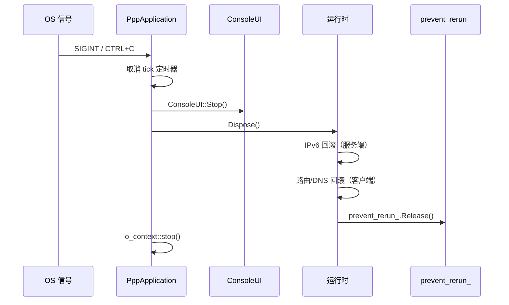
```mermaid
sequenceDiagram
    participant OS as OS 信号
    participant App as PppApplication
    participant UI as ConsoleUI
    participant RT as 运行时
    participant Lock as prevent_rerun_

    OS->>App: SIGINT / CTRL+C
    App->>App: 取消 tick 定时器
    App->>UI: ConsoleUI::Stop()
    App->>RT: Dispose()
    RT->>RT: IPv6 回滚（服务端）
    RT->>RT: 路由/DNS 回滚（客户端）
    RT->>Lock: prevent_rerun_.Release()
    App->>App: io_context::stop()
```

---

## 从这里开始

| 文档 | 用途 |
|------|------|
| [`docs/README_CN.md`](docs/README_CN.md) | 文档总索引与阅读路径 |
| [`docs/README.md`](docs/README.md) | English 文档总索引 |
| [`docs/ARCHITECTURE_CN.md`](docs/ARCHITECTURE_CN.md) | 顶层架构地图 |
| [`docs/USER_MANUAL_CN.md`](docs/USER_MANUAL_CN.md) | 用户快速开始与附录 |
| [`docs/SOURCE_READING_GUIDE_CN.md`](docs/SOURCE_READING_GUIDE_CN.md) | 源码阅读顺序 |

---

## 推荐阅读路径

### 想整体理解系统

1. [`docs/ENGINEERING_CONCEPTS_CN.md`](docs/ENGINEERING_CONCEPTS_CN.md)
2. [`docs/ARCHITECTURE_CN.md`](docs/ARCHITECTURE_CN.md)
3. [`docs/STARTUP_AND_LIFECYCLE_CN.md`](docs/STARTUP_AND_LIFECYCLE_CN.md)
4. [`docs/TRANSMISSION_CN.md`](docs/TRANSMISSION_CN.md)
5. [`docs/HANDSHAKE_SEQUENCE_CN.md`](docs/HANDSHAKE_SEQUENCE_CN.md)
6. [`docs/PACKET_FORMATS_CN.md`](docs/PACKET_FORMATS_CN.md)
7. [`docs/CLIENT_ARCHITECTURE_CN.md`](docs/CLIENT_ARCHITECTURE_CN.md)
8. [`docs/SERVER_ARCHITECTURE_CN.md`](docs/SERVER_ARCHITECTURE_CN.md)
9. [`docs/ROUTING_AND_DNS_CN.md`](docs/ROUTING_AND_DNS_CN.md)
10. [`docs/PLATFORMS_CN.md`](docs/PLATFORMS_CN.md)
11. [`docs/DEPLOYMENT_CN.md`](docs/DEPLOYMENT_CN.md)
12. [`docs/OPERATIONS_CN.md`](docs/OPERATIONS_CN.md)

### 想高效阅读源码

1. [`docs/SOURCE_READING_GUIDE_CN.md`](docs/SOURCE_READING_GUIDE_CN.md)
2. `main.cpp`
3. `ppp/configurations/*`
4. `ppp/transmissions/*`
5. `ppp/app/protocol/*`
6. `ppp/app/client/*`
7. `ppp/app/server/*`
8. 各平台目录
9. 需要 managed deployment 时再看 `go/*`

### 主要关心部署与运行

1. [`docs/CONFIGURATION_CN.md`](docs/CONFIGURATION_CN.md)
2. [`docs/CLI_REFERENCE_CN.md`](docs/CLI_REFERENCE_CN.md)
3. [`docs/PLATFORMS_CN.md`](docs/PLATFORMS_CN.md)
4. [`docs/ROUTING_AND_DNS_CN.md`](docs/ROUTING_AND_DNS_CN.md)
5. [`docs/DEPLOYMENT_CN.md`](docs/DEPLOYMENT_CN.md)
6. [`docs/OPERATIONS_CN.md`](docs/OPERATIONS_CN.md)
7. [`docs/SECURITY_CN.md`](docs/SECURITY_CN.md)

### 深入研究（进阶）

1. [`docs/CONCURRENCY_MODEL_CN.md`](docs/CONCURRENCY_MODEL_CN.md)
2. [`docs/EDSM_STATE_MACHINES_CN.md`](docs/EDSM_STATE_MACHINES_CN.md)
3. [`docs/PACKET_LIFECYCLE_CN.md`](docs/PACKET_LIFECYCLE_CN.md)
4. [`docs/LINKLAYER_PROTOCOL_CN.md`](docs/LINKLAYER_PROTOCOL_CN.md)
5. [`docs/TRANSMISSION_PACK_SESSIONID_CN.md`](docs/TRANSMISSION_PACK_SESSIONID_CN.md)
6. [`docs/TUNNEL_DESIGN_CN.md`](docs/TUNNEL_DESIGN_CN.md)
7. [`docs/ERROR_CODES_CN.md`](docs/ERROR_CODES_CN.md)
8. [`docs/ERROR_HANDLING_API_CN.md`](docs/ERROR_HANDLING_API_CN.md)
9. [`docs/DIAGNOSTICS_ERROR_SYSTEM_CN.md`](docs/DIAGNOSTICS_ERROR_SYSTEM_CN.md)

### IPv6 子系统

1. [`docs/IPV6_LEASE_MANAGEMENT_CN.md`](docs/IPV6_LEASE_MANAGEMENT_CN.md)
2. [`docs/IPV6_TRANSIT_PLANE_CN.md`](docs/IPV6_TRANSIT_PLANE_CN.md)
3. [`docs/IPV6_NDP_PROXY_CN.md`](docs/IPV6_NDP_PROXY_CN.md)
4. [`docs/IPV6_CLIENT_ASSIGNMENT_CN.md`](docs/IPV6_CLIENT_ASSIGNMENT_CN.md)

---

## 文档总表

仓库中共有多组英中文档配对，加上根目录 README 双语对照。每一份中文文档都有一份一对一英文文档。

| 领域 | English | 中文 |
|------|---------|------|
| 基础 | `ENGINEERING_CONCEPTS.md` | `ENGINEERING_CONCEPTS_CN.md` |
| 基础 | `ARCHITECTURE.md` | `ARCHITECTURE_CN.md` |
| 基础 | `STARTUP_AND_LIFECYCLE.md` | `STARTUP_AND_LIFECYCLE_CN.md` |
| 传输 | `TRANSMISSION.md` | `TRANSMISSION_CN.md` |
| 传输 | `HANDSHAKE_SEQUENCE.md` | `HANDSHAKE_SEQUENCE_CN.md` |
| 传输 | `PACKET_FORMATS.md` | `PACKET_FORMATS_CN.md` |
| 传输 | `TRANSMISSION_PACK_SESSIONID.md` | `TRANSMISSION_PACK_SESSIONID_CN.md` |
| 协议 | `LINKLAYER_PROTOCOL.md` | `LINKLAYER_PROTOCOL_CN.md` |
| 运行时 | `CLIENT_ARCHITECTURE.md` | `CLIENT_ARCHITECTURE_CN.md` |
| 运行时 | `SERVER_ARCHITECTURE.md` | `SERVER_ARCHITECTURE_CN.md` |
| 运行时 | `ROUTING_AND_DNS.md` | `ROUTING_AND_DNS_CN.md` |
| 运行时 | `PACKET_LIFECYCLE.md` | `PACKET_LIFECYCLE_CN.md` |
| 平台 | `PLATFORMS.md` | `PLATFORMS_CN.md` |
| 配置 | `CONFIGURATION.md` | `CONFIGURATION_CN.md` |
| 配置 | `CLI_REFERENCE.md` | `CLI_REFERENCE_CN.md` |
| 运维 | `DEPLOYMENT.md` | `DEPLOYMENT_CN.md` |
| 运维 | `OPERATIONS.md` | `OPERATIONS_CN.md` |
| 安全 | `SECURITY.md` | `SECURITY_CN.md` |
| 管理 | `MANAGEMENT_BACKEND.md` | `MANAGEMENT_BACKEND_CN.md` |
| 使用 | `USER_MANUAL.md` | `USER_MANUAL_CN.md` |
| 阅读 | `SOURCE_READING_GUIDE.md` | `SOURCE_READING_GUIDE_CN.md` |
| 并发 | `CONCURRENCY_MODEL.md` | `CONCURRENCY_MODEL_CN.md` |
| 状态机 | `EDSM_STATE_MACHINES.md` | `EDSM_STATE_MACHINES_CN.md` |
| 隧道 | `TUNNEL_DESIGN.md` | `TUNNEL_DESIGN_CN.md` |
| 错误码 | `ERROR_CODES.md` | `ERROR_CODES_CN.md` |
| 错误 API | `ERROR_HANDLING_API.md` | `ERROR_HANDLING_API_CN.md` |
| 诊断 | `DIAGNOSTICS_ERROR_SYSTEM.md` | `DIAGNOSTICS_ERROR_SYSTEM_CN.md` |
| IPv6 | `IPV6_LEASE_MANAGEMENT.md` | `IPV6_LEASE_MANAGEMENT_CN.md` |
| IPv6 | `IPV6_TRANSIT_PLANE.md` | `IPV6_TRANSIT_PLANE_CN.md` |
| IPv6 | `IPV6_NDP_PROXY.md` | `IPV6_NDP_PROXY_CN.md` |
| IPv6 | `IPV6_CLIENT_ASSIGNMENT.md` | `IPV6_CLIENT_ASSIGNMENT_CN.md` |
 | TUI | `TUI_DESIGN.md` | `TUI_DESIGN_CN.md` |
 | IPv6 修复说明 | `IPV6_FIXES.md` | `IPV6_FIXES_CN.md` |
 | 平台 | `MULTIQUEUE_TUN_MODEL.md` | `MULTIQUEUE_TUN_MODEL_CN.md` |
 | 可观测性 | `OTEL_DESIGN.md` | `OTEL_DESIGN_CN.md` |

---

## 仓库结构

```text
.
├── main.cpp                      # 进程入口：PppApplication::Run()
├── ppp/
│   ├── stdafx.h                  # 主头文件：所有宏、类型别名（阅读前必读）
│   ├── configurations/
│   │   ├── AppConfiguration.h    # 运行时配置模型
│   │   └── AppConfiguration.cpp  # Loaded()：策略编译器与归一化器
│   ├── transmissions/
│   │   ├── ITransmission.h/.cpp  # 受保护传输 + 握手逻辑
│   │   ├── ITcpipTransmission.h/.cpp  # TCP 载体实现
│   │   └── IWebsocketTransmission.h/.cpp  # WS/WSS 载体实现
│   ├── app/
│   │   ├── protocol/
│   │   │   ├── VirtualEthernetLinklayer.h/.cpp  # opcode 驱动的隧道动作
│   │   │   ├── VirtualEthernetInformation.h/.cpp # 会话信封
│   │   │   └── VirtualEthernetPacket.cpp  # 静态包打包/解包
│   │   ├── client/
│   │   │   ├── VEthernetExchanger.h/.cpp     # 客户端会话交换器
│   │   │   └── VEthernetNetworkSwitcher.h/.cpp # 路由/DNS 管理
│   │   ├── server/
│   │   │   ├── VirtualEthernetSwitcher.h/.cpp   # 会话协调
│   │   │   ├── VirtualEthernetExchanger.h/.cpp  # 单会话服务端处理器
│   │   │   ├── VirtualEthernetManagedServer.h/.cpp # Go 后端桥接
│   │   │   ├── VirtualEthernetDatagramPort.h    # 服务端 UDP 转发
│   │   │   └── VirtualEthernetNamespaceCache.h  # DNS 缓存
│   │   └── ConsoleUI.h/.cpp      # TUI：渲染线程 + 输入线程
│   ├── diagnostics/
│   │   ├── Error.h/.cpp          # 错误码定义与设置函数
│   │   ├── ErrorCodes.def        # X-macro 源：542 个错误码
│   │   └── ErrorHandler.h/.cpp   # 错误处理器注册与分发
│   ├── tap/
│   │   └── ITap.h/.cpp           # 虚拟网卡抽象接口
│   ├── ethernet/
│   │   ├── VEthernet.cpp         # TAP 帧分发，Output()
│   │   └── VNetstack.cpp         # lwIP 集成：UDP/TCP/ICMP 钩子
│   ├── threading/
│   │   └── Executors.h/.cpp      # 线程池与 io_context 管理
│   └── net/                      # 套接字、ASIO、HTTP 代理、ICMP、防火墙
├── windows/
│   └── ppp/tap/TapWindows.h/.cpp # Wintun / TAP-Windows 实现
├── linux/
│   └── ppp/tap/TapLinux.h/.cpp   # Linux TUN 实现
├── darwin/
│   └── ppp/tap/TapDarwin.h/.cpp  # macOS utun 实现
├── android/
│   └── libopenppp2.cpp           # Android JNI 桥接层
├── builds/                        # 变体 CMakeLists.txt 文件集
├── go/                            # 可选 Go 管理后端
└── docs/                          # 配对 EN + _CN.md 文档
    ├── *.md
    └── *_CN.md
```

---

## 构建说明

### Linux / macOS

```bash
mkdir -p build && cd build
cmake .. -DCMAKE_BUILD_TYPE=Release
make -j$(nproc)
```

输出：`bin/ppp`

**三方库路径**：`THIRD_PARTY_LIBRARY_DIR` 默认为 `/root/dev`。非默认路径时需在构建前修改：

```bash
sed -i 's|SET(THIRD_PARTY_LIBRARY_DIR /root/dev)|SET(THIRD_PARTY_LIBRARY_DIR /your/path)|' CMakeLists.txt
# macOS: sed -i '' '...' CMakeLists.txt
```

`THIRD_PARTY_LIBRARY_DIR` 下的预期目录结构：

```text
boost/        # 头文件 + stage/lib/*.a     (Boost 1.86.0)
jemalloc/     # 头文件 + lib/libjemalloc.a (jemalloc 5.3.0)
openssl/      # libssl.a, libcrypto.a, include/ (OpenSSL 3.0.13)
```

可选 CMake 标志：

| 标志 | 用途 |
|------|------|
| `-DENABLE_SIMD=ON` | 启用 AES-NI 加速（仅 x86/x64） |
| `-DCMAKE_POLICY_VERSION_MINIMUM=3.5` | macOS 必须 |

io_uring（Linux ≥ 5.10）：在 `CMakeLists.txt` 中取消注释 `BOOST_ASIO_HAS_IO_URING`，或使用 `builds/` 变体。

### Windows

```bat
build_windows.bat                  # Release x64（默认）
build_windows.bat Debug x64
build_windows.bat Release x86
build_windows.bat Release all      # x86 + x64 全平台
```

使用 CMake + **Ninja**（非 MSBuild）。需要 vcpkg，使用静态三元组 `x86-windows-static` / `x64-windows-static`。

vcpkg 搜索顺序：
1. 环境变量 `VCPKG_CMAKE_TOOLCHAIN_FILE`
2. 环境变量 `VCPKG_ROOT`
3. `%LOCALAPPDATA%\vcpkg\vcpkg.path.txt`
4. 相对路径 `..\vcpkg`
5. Visual Studio 集成 vcpkg

输出：`bin\Release\x64\ppp.exe`、`bin\Release\x86\ppp.exe`

### Android

```bash
# 必须设置 NDK_ROOT（NDK r20b）
cd android
./build.sh all    # arm64-v8a, x86_64, armeabi-v7a, x86
./build.sh arm64  # 单 ABI
```

输出：`android/bin/android/<ABI>/libopenppp2.so`

最低 API：23（Android 6.0）。Android 系统自带 jemalloc，应用层无需额外依赖。

### 多变体构建（Linux amd64）

`builds/` 包含多个命名变体 `CMakeLists.txt`：

| 变体 | 描述 |
|------|------|
| `io-uring` | Linux io_uring 后端 |
| `simd` | AES-NI 加速 |
| `tc` | 流量控制集成 |
| 组合变体 | `io-uring+simd`、`io-uring+tc` 等 |

使用 `build-openppp2-by-builds.sh` 将所有变体编译输出到 `bin/<variant>.zip`。

---

## 快速开始

### 最简服务端配置（`appsettings.json`）

```json
{
    "concurrent": 4,
    "cdn": [1, 2],
    "key": {
        "kf": 154543927,
        "kx": 128,
        "kl": 10,
        "kh": 12,
        "protocol": "aes-128-cfb",
        "protocol-key": "TSAO_PPP",
        "transport": "aes-256-cfb",
        "transport-key": "TSAO_PPP",
        "masked": false,
        "plaintext": false,
        "delta-encode": false,
        "shuffle-data": false
    },
    "server": {
        "bind": "0.0.0.0",
        "port": 20000,
        "subnet": true,
        "dns": "8.8.8.8",
        "ip": "10.0.0.0",
        "mask": "255.255.0.0"
    }
}
```

启动：`./ppp --mode=server --config=./appsettings.json`

### 最简客户端配置

```json
{
    "concurrent": 2,
    "key": {
        "kf": 154543927,
        "kx": 128,
        "kl": 10,
        "kh": 12,
        "protocol": "aes-128-cfb",
        "protocol-key": "TSAO_PPP",
        "transport": "aes-256-cfb",
        "transport-key": "TSAO_PPP"
    },
    "client": {
        "server": "ppp://your-server-ip:20000/",
        "bandwidth": 0,
        "reconnections": {
            "timeout": 5
        },
        "paper-airplane": {
            "tcp": true
        }
    }
}
```

启动：`./ppp --mode=client --config=./appsettings.json`

### `client.server` URI 格式

| URI | 传输协议 |
|-----|---------|
| `ppp://host:port/` | 明文 TCP |
| `ppp://ws/host:port/` | WebSocket |
| `ppp://wss/host:port/` | TLS WebSocket |

---

## 配置概述

`AppConfiguration`（`ppp/configurations/AppConfiguration.h`）是中央配置模型。其 `Loaded()` 方法是**策略编译器**：将原始 JSON 输入归一化、夹紧、推导所有次级字段。

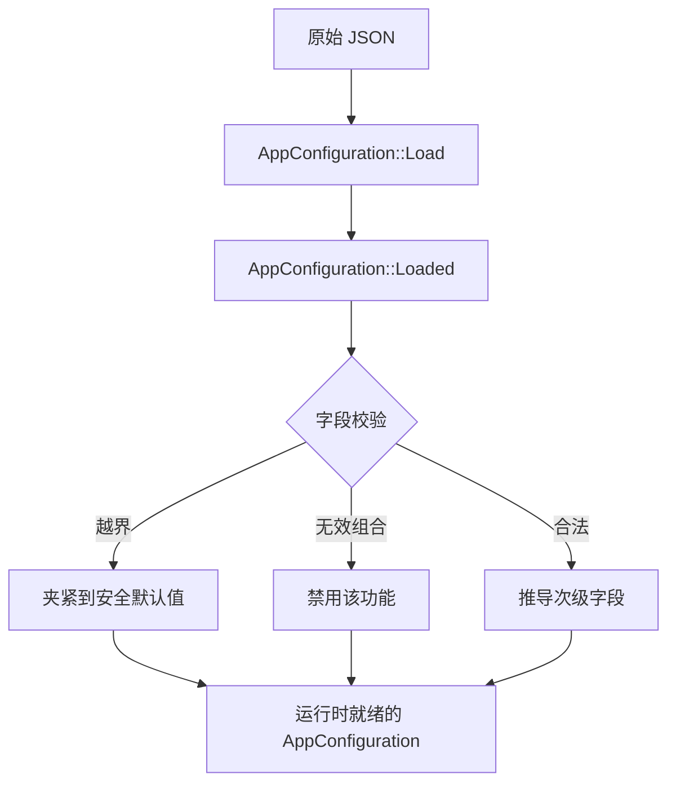
```mermaid
flowchart TD
    A[原始 JSON] --> B[AppConfiguration::Load]
    B --> C[AppConfiguration::Loaded]
    C --> D{字段校验}
    D -->|越界| E[夹紧到安全默认值]
    D -->|无效组合| F[禁用该功能]
    D -->|合法| G[推导次级字段]
    E --> H[运行时就绪的 AppConfiguration]
    F --> H
    G --> H
```

主要配置组：

| 组 | 关键字段 | 说明 |
|----|---------|------|
| `key` | `kf`, `kx`, `kl`, `kh`, `protocol`, `transport`, `masked`, `plaintext`, `delta-encode`, `shuffle-data` | 密码与混淆参数 |
| `server` | `bind`, `port`, `subnet`, `dns`, `ip`, `mask` | 服务端监听与 IP 池 |
| `client` | `server`, `bandwidth`, `reconnections`, `paper-airplane` | 客户端连接目标与 QoS |
| `concurrent` | （整数） | io_context 线程数 |
| `cdn` | （数组） | 混淆 CDN 端口模式 |

完整参考：[`docs/CONFIGURATION_CN.md`](docs/CONFIGURATION_CN.md)

---

## 协议与传输层概述

### ITransmission：握手与分帧层

`ITransmission`（`ppp/transmissions/ITransmission.h`）负责：

- **握手**：NOP 交换 → 会话 ID → ivv → nmux → 重建密码器
- **分帧**：base94 帧头（首包 4+3 字节，后续 4 字节）
- **掩码**：对载荷头部字节应用字节级掩码
- **Delta 编码**：对载荷数据进行增量差分压缩
- **双密码层**：协议密码（头部元数据）和传输密码（载荷），均从 `ivv + nmux + base_key` 推导

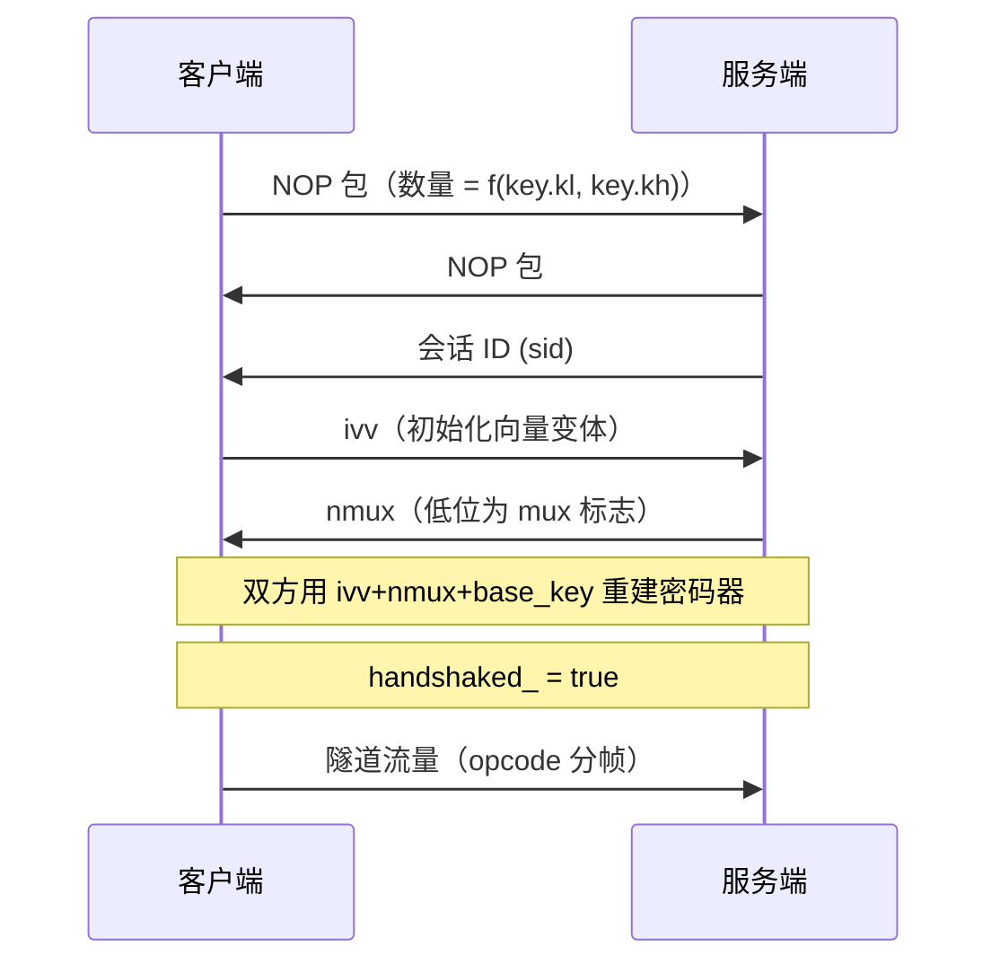
```mermaid
sequenceDiagram
    participant C as 客户端
    participant S as 服务端

    C->>S: NOP 包（数量 = f(key.kl, key.kh)）
    S->>C: NOP 包
    S->>C: 会话 ID (sid)
    C->>S: ivv（初始化向量变体）
    S->>C: nmux（低位为 mux 标志）
    Note over C,S: 双方用 ivv+nmux+base_key 重建密码器
    Note over C,S: handshaked_ = true
    C->>S: 隧道流量（opcode 分帧）
```

载体实现：

| 类 | 传输协议 | 源码 |
|----|---------|------|
| `ITcpipTransmission` | 明文 TCP | `ppp/transmissions/ITcpipTransmission.h` |
| `IWebsocketTransmission` | WebSocket / TLS WS | `ppp/transmissions/IWebsocketTransmission.h` |

### VirtualEthernetLinklayer：opcode 协议

`VirtualEthernetLinklayer`（`ppp/app/protocol/VirtualEthernetLinklayer.h`）定义隧道协议。每个隧道包以 1 字节 opcode 开头。

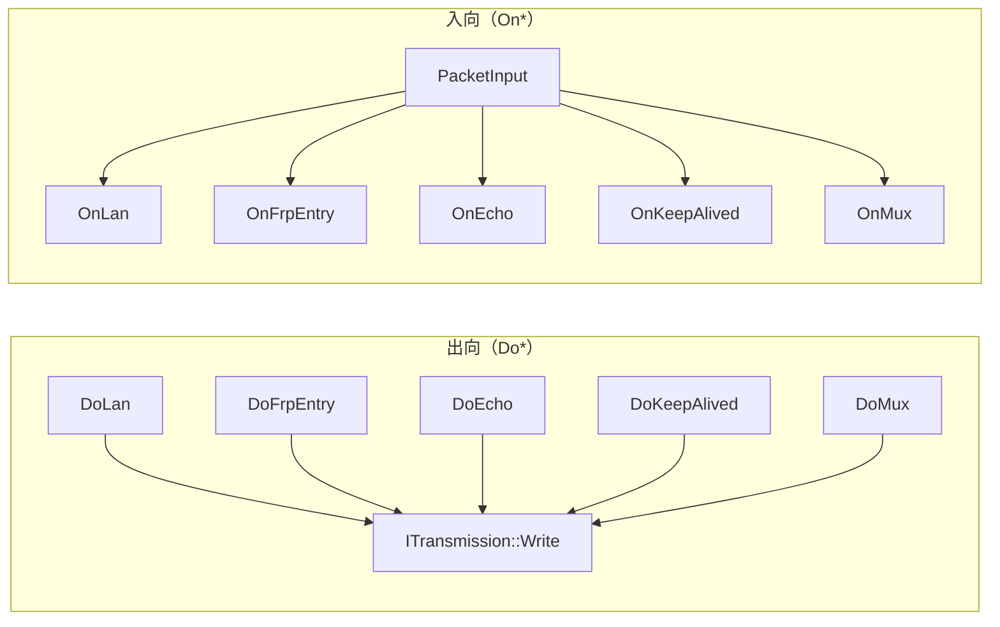
```mermaid
graph LR
    subgraph "出向（Do*）"
        D1[DoLan] --> OUT[ITransmission::Write]
        D2[DoFrpEntry] --> OUT
        D3[DoEcho] --> OUT
        D4[DoKeepAlived] --> OUT
        D5[DoMux] --> OUT
    end
    subgraph "入向（On*）"
        IN[PacketInput] --> O1[OnLan]
        IN --> O2[OnFrpEntry]
        IN --> O3[OnEcho]
        IN --> O4[OnKeepAlived]
        IN --> O5[OnMux]
    end
```

关键 opcode：

| Opcode | 值 | 方向 | 用途 |
|--------|---|------|------|
| `INFO` | `0x7E` | 双向 | 会话信息交换 |
| `KEEPALIVED` | `0x7F` | 双向 | 保活心跳 |
| `FRP_ENTRY` | `0x20` | C→S | 新建 TCP 连接请求 |
| `FRP_CONNECT` | `0x21` | S→C | 连接已接受 |
| `FRP_CONNECT_OK` | `0x22` | C→S | 客户端确认 |
| `FRP_PUSH` | `0x23` | 双向 | TCP 数据推送 |
| `FRP_DISCONNECT` | `0x24` | 双向 | TCP 连接关闭 |
| `FRP_SENDTO` | `0x25` | 双向 | UDP 数据报 |
| `LAN` | `0x28` | 双向 | 原始以太网/IP 帧 |
| `PacketAction_NAT` | `0x29` | 双向 | NAT 路径包 |
| `DoEcho` | `0x2F` | C→S | ICMP echo 请求代理 |
| `PacketAction_STATIC` | `0x31` | 双向 | 静态路径包 |
| `PacketAction_STATICACK` | `0x32` | 双向 | 静态路径确认 |
| `PacketAction_MUX` | `0x35` | 双向 | MUX 通道数据 |
| `PacketAction_MUXON` | `0x36` | 双向 | MUX 通道打开 |

完整 opcode 参考：[`docs/LINKLAYER_PROTOCOL_CN.md`](docs/LINKLAYER_PROTOCOL_CN.md)

---

## 客户端运行时概述

客户端运行时（`ppp/app/client/`）连接服务端并与宿主 OS 网络集成。

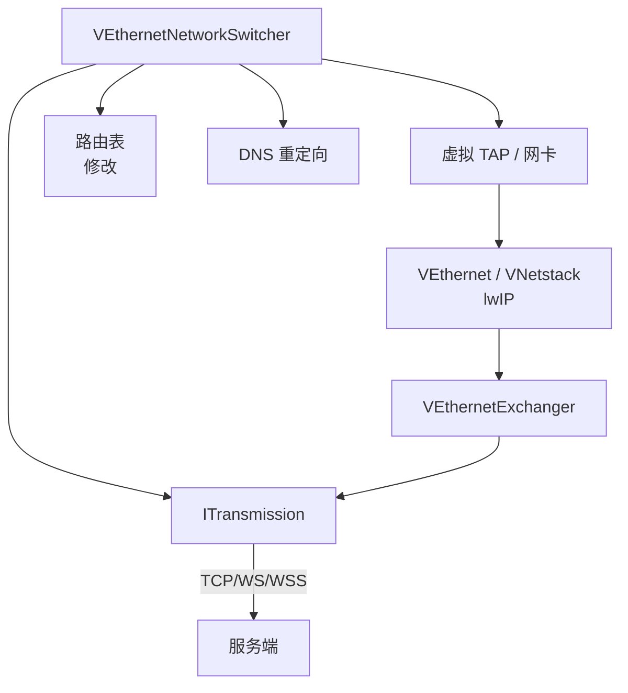
```mermaid
graph TD
    A[VEthernetNetworkSwitcher] --> B[ITransmission]
    A --> C[虚拟 TAP / 网卡]
    A --> D[路由表\n修改]
    A --> E[DNS 重定向]
    C --> F[VEthernet / VNetstack\nlwIP]
    F --> G[VEthernetExchanger]
    G --> B
    B -->|TCP/WS/WSS| H[服务端]
```

各组件职责：

| 组件 | 职责 |
|------|------|
| `VEthernetNetworkSwitcher` | 客户端顶层控制器；管理重连、重启模式 |
| `VEthernetExchanger` | 单会话隧道动作处理：FRP、UDP、ICMP、MUX、静态路径 |
| 虚拟 TAP | 向 OS 提供虚拟以太网适配器 |
| 路由管理 | 将流量重定向到隧道 |
| DNS 重定向 | 将 OS DNS 指向隧道端点 |

**重启模式：**

| 模式 | 重建内容 | 保留内容 |
|------|---------|---------|
| `--auto-restart` | 完整运行时：TAP + Switcher | 无 |
| `--link-restart` | 仅重建 ITransmission | Switcher、TAP、路由 |

完整参考：[`docs/CLIENT_ARCHITECTURE_CN.md`](docs/CLIENT_ARCHITECTURE_CN.md)

---

## 服务端运行时概述

服务端运行时（`ppp/app/server/`）接受连接并协调单会话状态。

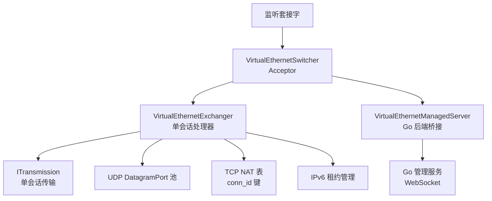
```mermaid
graph TD
    A[监听套接字] --> B[VirtualEthernetSwitcher\nAcceptor]
    B --> C[VirtualEthernetExchanger\n单会话处理器]
    C --> D[ITransmission\n单会话传输]
    C --> E[UDP DatagramPort 池]
    C --> F[TCP NAT 表\nconn_id 键]
    C --> G[IPv6 租约管理]
    B --> H[VirtualEthernetManagedServer\nGo 后端桥接]
    H --> I[Go 管理服务\nWebSocket]
```

会话生命周期：

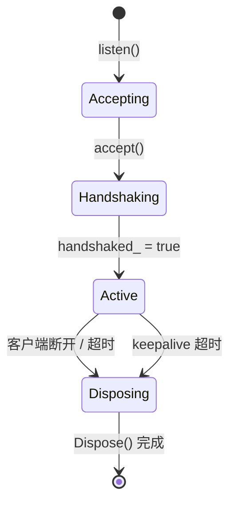
```mermaid
stateDiagram-v2
    [*] --> Accepting: listen()
    Accepting --> Handshaking: accept()
    Handshaking --> Active: handshaked_ = true
    Active --> Disposing: 客户端断开 / 超时
    Active --> Disposing: keepalive 超时
    Disposing --> [*]: Dispose() 完成
```

关键事实：
- TCP `conn_id`：32 位，单会话单调递增，客户端分配。服务端 NAT 表键 = `(session_id, conn_id)`。`OnDisconnect` 时释放。
- QoS 令牌桶：单会话，补充速率来自 `bandwidth` 字段（bytes/sec）。耗尽时协程挂起。
- `OnTick()` 任务：统计刷新、隧道存活检查、会话老化、IPv6 租约老化、TUI 脏标志发布。

完整参考：[`docs/SERVER_ARCHITECTURE_CN.md`](docs/SERVER_ARCHITECTURE_CN.md)

---

## 平台集成概述

虚拟网卡层由 `ITap`（`ppp/tap/ITap.h`）抽象。各平台实现差异显著。

```mermaid
graph TD
    A[ITap 接口\nppp/tap/ITap.h] --> B[TapLinux\nlinux/ppp/tap]
    A --> C[TapWindows\nwindows/ppp/tap]
    A --> D[TapDarwin\ndarwin/ppp/tap]
    A --> E[Android TapLinux 变体\nandroid/libopenppp2.cpp]
    B --> B1[/dev/net/tun\nIFF_TUN 或 IFF_MULTI_QUEUE SSMT]
    C --> C1[Wintun 环形缓冲区\n首选]
    C --> C2[TAP-Windows 重叠 I/O\n回退]
    D --> D1[/dev/utun*\n4 字节 AF 前缀去除/追加]
    E --> E1[VpnService fd\n不直接打开 /dev/net/tun]
```

各平台行为对比：

| 平台 | 虚拟网卡 | 路由管理 | 特殊说明 |
|------|---------|---------|---------|
| Linux | `/dev/net/tun`，`IFF_TUN` | `ip route` / netlink | SSMT：每个 io_context 一个 fd，通过 `TapLinux::Ssmt()` |
| Windows | Wintun（首选）或 TAP-Windows | WinAPI 路由表 | `TapWindows::InstallDriver()` 需要管理员权限 |
| macOS | `/dev/utun*` | BSD 路由套接字 | 所有帧需 4 字节 AF 前缀处理 |
| Android | `VpnService` fd | VpnService 路由 | JNI：`__LIBOPENPPP2__` 宏；不直接打开 tun |

完整参考：[`docs/PLATFORMS_CN.md`](docs/PLATFORMS_CN.md)

---

## 并发与线程模型

OPENPPP2 使用 Boost.Asio `io_context` 作为事件循环，结合 `YieldContext` 实现 C++ 协程。

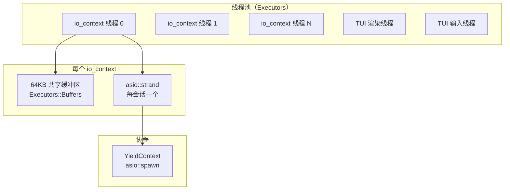
```mermaid
graph TD
    subgraph "线程池（Executors）"
        T1[io_context 线程 0]
        T2[io_context 线程 1]
        TN[io_context 线程 N]
        TR[TUI 渲染线程]
        TI[TUI 输入线程]
    end
    subgraph "每个 io_context"
        T1 --> B1[64KB 共享缓冲区\nExecutors::Buffers]
        T1 --> S1[asio::strand\n每会话一个]
    end
    subgraph "协程"
        S1 --> Y[YieldContext\nasio::spawn]
    end
```

**关键规则：**
- 绝对不能阻塞 IO 线程。
- 跨线程对象共享：`std::shared_ptr` / `std::weak_ptr` 管理生命周期。
- 生命周期标志：`std::atomic<bool>` + `compare_exchange_strong(memory_order_acq_rel)`。
- `Executors::Awaitable<T>`：OS 线程等待 IO 线程结果的桥接机制。`Await()` 绝对不能在 IO 线程上调用。
- `nullof<YieldContext>()` 返回哨兵地址，用于非协程调用者。在 `DoKeepAlived()` 和 DNS 路径中有意使用。

`YieldContext` 状态转移：

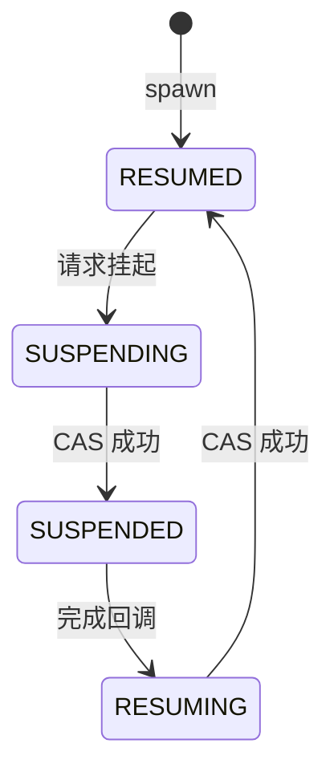
```mermaid
stateDiagram-v2
    [*] --> RESUMED: spawn
    RESUMED --> SUSPENDING: 请求挂起
    SUSPENDING --> SUSPENDED: CAS 成功
    SUSPENDED --> RESUMING: 完成回调
    RESUMING --> RESUMED: CAS 成功
```

完整参考：[`docs/CONCURRENCY_MODEL_CN.md`](docs/CONCURRENCY_MODEL_CN.md)

---

## 错误处理概述

错误用类型化错误码表示，定义在 `ppp/diagnostics/ErrorCodes.def`（X-macro 宏展开）。当前共有 **542 个错误码**。


```mermaid
flowchart LR
    A[检测到失败] --> B[SetLastErrorCode\nError::XYZ]
    B --> C[返回哨兵值\nnullptr / false / -1]
    C --> D[调用方向上传递\n哨兵值]
    D --> E[顶层处理器\n分发给 ErrorHandler]
```

错误码分类（部分）：

| 类别 | 示例 |
|------|------|
| 应用启动 | `AppPrivilegeRequired`、`AppAlreadyRunning`、`TunnelOpenFailed` |
| 协议 | `ProtocolKeepAliveTimeout`、`ProtocolCipherMismatch` |
| 会话 | `SessionDisposed`、`ResourceExhaustedSessionSlots` |
| 认证 | `AuthCredentialInvalid` |
| IPv6 | `IPv6LeaseConflict`、`IPv6ServerPrepareFailed` |
| 通用 | `GenericCanceled`、`GenericTimeout`、`SocketDisconnected` |
| 内部 | `InternalLogicStateCorrupted` |

**正常运行时的良性错误码**（高频出现，不代表问题）：
- `GenericCanceled`、`GenericTimeout`、`SocketDisconnected`、`SessionDisposed`、`FirewallSegmentBlocked`

**需要运维关注的错误码**：
- `AppPrivilegeRequired`、`TunnelOpenFailed`、`ProtocolCipherMismatch`、`AuthCredentialInvalid`、`InternalLogicStateCorrupted`

原子错误快照：高 32 位 = 截断毫秒时间戳；低 32 位 = 错误码值。

完整参考：[`docs/ERROR_CODES_CN.md`](docs/ERROR_CODES_CN.md)、[`docs/ERROR_HANDLING_API_CN.md`](docs/ERROR_HANDLING_API_CN.md)

---

## 管理后端

Go 后端（`go/`）是完全独立的可选进程，提供托管认证与 Webhook 能力，C++ 服务端通过 WebSocket 调用它。

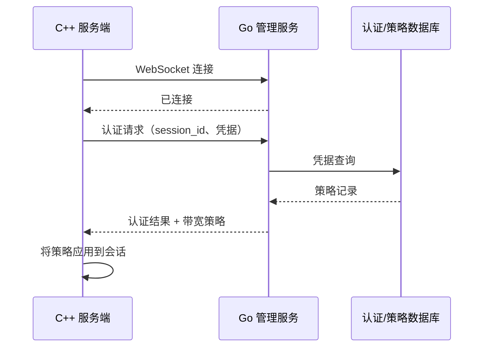
```mermaid
sequenceDiagram
    participant C as C++ 服务端
    participant G as Go 管理服务
    participant DB as 认证/策略数据库

    C->>G: WebSocket 连接
    G-->>C: 已连接
    C->>G: 认证请求（session_id、凭据）
    G->>DB: 凭据查询
    DB-->>G: 策略记录
    G-->>C: 认证结果 + 带宽策略
    C->>C: 将策略应用到会话
```

独立构建与启动：

```bash
cd go && go build -o ppp-go .
./ppp-go --config=./management.json
```

C++ 服务端通过在 `appsettings.json` 中将 `server.managed` 设置为 Go 服务地址来启用托管模式。不启用 Go 后端时，服务端以独立模式运行，无外部认证。

完整参考：[`docs/MANAGEMENT_BACKEND_CN.md`](docs/MANAGEMENT_BACKEND_CN.md)

---

## 安全机制概述

安全机制在两个独立层次上运作：

| 层次 | 保护对象 | 密码来源 |
|------|---------|---------|
| 协议密码层 | 头部元数据与会话分帧 | `ivv + nmux + base_key` |
| 传输密码层 | 载荷数据 | `ivv + nmux + base_key`（不同推导路径） |

附加混淆特性（通过 `key.*` 配置）：

| 特性 | 配置字段 | 描述 |
|------|---------|------|
| 掩码 | `masked: true` | 对头部字节应用字节级掩码 |
| Delta 编码 | `delta-encode: true` | 对载荷进行增量差分处理 |
| 数据洗牌 | `shuffle-data: true` | 重排载荷字节顺序 |
| 明文模式 | `plaintext: true` | 禁用所有加密（仅测试用途） |

支持的密码算法：AES-128-CFB、AES-256-CFB 及变体。`key` 中的 `kf`、`kx`、`kl`、`kh` 字段控制 NOP 握手时序和分帧形态，大幅提高流量指纹识别难度。

完整参考：[`docs/SECURITY_CN.md`](docs/SECURITY_CN.md)

---

## 代码事实决定的文档边界

| 事实 | 文档必须说明的结果 |
|------|--------------------|
| `main.cpp` 负责启动、角色分流、生命周期和宿主环境准备 | 必须把启动/运行/关闭拆开写 |
| `AppConfiguration` 会在加载后做归一化 | 必须说明默认值、纠偏、无效配置如何被修正 |
| `ITransmission` 负责握手、分帧、mask、delta、cipher layering | 必须按实现讲传输，而不是按抽象名词讲传输 |
| `VirtualEthernetLinklayer` 定义 opcode 驱动的隧道语义 | 必须说明每个动作的实际消息角色 |
| 客户端与服务端共享词汇但职责不同 | 必须避免把两端写成对称 peer |
| 平台代码会改变路由、DNS、适配器与防火墙 | 必须明确平台副作用是系统行为的一部分 |
| Go 后端是可选项 | 必须单独描述 managed deployment |
| `nullof<YieldContext>()` 是有意设计的哨兵，不是 UB | 并发文档必须解释协程与非协程调用路径的区别 |
| `NULLPTR` 宏是强制要求（禁用 `nullptr`） | 所有代码示例必须使用 `NULLPTR` |
| UDP 64KB 缓冲区是线程级共享（非套接字级） | 内存文档不能将此误描述为 UB |
| `stdafx.h` 定义所有平台守卫和类型别名 | 新代码必须使用 `ppp::` 类型和 `_WIN32`/`_LINUX` 宏 |
| 无自动化测试套件 | CI 仅验证编译；行为回归仅以文档描述 |

---

## 边界说明

| 不是 | 实际情况 |
|------|----------|
| 消费级一键 VPN | 面向开发者的网络运行时 |
| 对称的 client/server | 职责不同的双角色运行时 |
| 纯传输库 | 带宿主系统集成的完整系统 |
| 必须依赖 Go | Go 后端可选 |
| 路由只是附加功能 | 路由和 DNS 是一级运行时行为 |
| 单密码传输 | 两个独立密码层：协议层与传输层 |
| 简单会话模型 | 会话有完整生命周期：握手、活跃、释放、重启 |
| 平台代码是样板代码 | 平台代码在各 OS 上行为差异显著 |

---

## 快速参考

| 命令 | 作用 |
|------|------|
| `ppp --help` | 查看真实 CLI 帮助 |
| `ppp --mode=client` | 以 client 模式启动 |
| `ppp --mode=server` | 以 server 模式启动 |
| `ppp --config=./config.json` | 加载显式配置文件 |
| `ppp --pull-iplist [file/country]` | 下载 IP list 后退出 |
| `ppp --mode=client --auto-restart` | 断线后完整重启 |
| `ppp --mode=client --link-restart` | 断线后仅重连传输层 |

### 关键源码入口

| 想理解的内容 | 从这里开始 |
|-------------|-----------|
| 进程启动 | `main.cpp` |
| 配置加载 | `ppp/configurations/AppConfiguration.cpp` → `Loaded()` |
| 握手机制 | `ppp/transmissions/ITransmission.cpp` |
| 隧道 opcode | `ppp/app/protocol/VirtualEthernetLinklayer.h` |
| 客户端会话逻辑 | `ppp/app/client/VEthernetExchanger.cpp` |
| 服务端会话逻辑 | `ppp/app/server/VirtualEthernetExchanger.cpp` |
| 虚拟网卡接口 | `ppp/tap/ITap.h` |
| 错误码定义 | `ppp/diagnostics/ErrorCodes.def` |
| 线程池与 io_context | `ppp/threading/Executors.h` |
| lwIP 集成 | `ppp/ethernet/VNetstack.cpp` |

---

## 说明

- 仓库中的示例配置值可能包含本地地址、端口或凭据，应视为示例而不是生产默认值。
- Linux 是当前最完整的 server-side IPv6 data plane 目标。
- 文档采用长篇双语写法，是因为系统本身实现重、边界多、术语密集。
- `main.cpp` 是最快建立全局认知的入口。
- 严格遵守 C++17——代码库中不使用任何 C++20 特性。
- 所有代码使用 `ppp::` 类型别名（`ppp::string`、`ppp::vector<T>`、`ppp::Byte` 等），定义于 `ppp/stdafx.h`。
- 内存分配通过 `ppp::Malloc` / `ppp::Mfree` 路由，当定义了 `JEMALLOC` 宏时使用 jemalloc。
- 平台守卫只使用仓库宏：`_WIN32`、`_LINUX`、`_MACOS`、`_ANDROID`。`ppp/` 共享文件中禁止出现 `#ifdef __linux__` 或 `#ifdef _MSC_VER`。
- 所有公共 API 使用 Doxygen 文档化（`@brief`、`@param`、`@return`、`@note`、`@warning`）。
- 所有函数尽力声明为 `noexcept`。异常在边界处被捕获并转换为错误码。

---

## IPv6 子系统概述

OPENPPP2 在服务端包含完整的 IPv6 租约管理和数据面转发系统，是较为复杂的子系统之一。

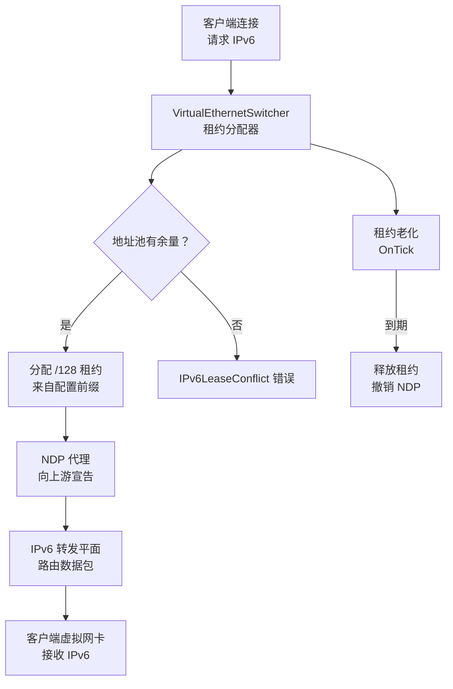
```mermaid
graph TD
    A[客户端连接\n请求 IPv6] --> B[VirtualEthernetSwitcher\n租约分配器]
    B --> C{地址池有余量？}
    C -->|是| D[分配 /128 租约\n来自配置前缀]
    C -->|否| E[IPv6LeaseConflict 错误]
    D --> F[NDP 代理\n向上游宣告]
    F --> G[IPv6 转发平面\n路由数据包]
    G --> H[客户端虚拟网卡\n接收 IPv6]
    B --> I[租约老化\nOnTick]
    I -->|到期| J[释放租约\n撤销 NDP]
```

### IPv6 租约生命周期

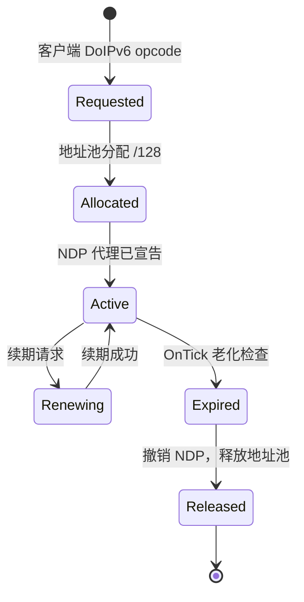
```mermaid
stateDiagram-v2
    [*] --> Requested: 客户端 DoIPv6 opcode
    Requested --> Allocated: 地址池分配 /128
    Allocated --> Active: NDP 代理已宣告
    Active --> Renewing: 续期请求
    Renewing --> Active: 续期成功
    Active --> Expired: OnTick 老化检查
    Expired --> Released: 撤销 NDP，释放地址池
    Released --> [*]
```

关键事实：
- 服务端以 `(session_id, ipv6_address)` 为键维护租约表。
- NDP 代理向上游路由器宣告已租出的地址，确保回程流量正确路由。
- IPv6 租约老化在 `OnTick()` 中执行，不使用单独线程。
- IPv6 数据面的主要平台是 Linux。Windows 和 Android 在此场景下支持有限。

完整参考：[`docs/IPV6_LEASE_MANAGEMENT_CN.md`](docs/IPV6_LEASE_MANAGEMENT_CN.md)、[`docs/IPV6_TRANSIT_PLANE_CN.md`](docs/IPV6_TRANSIT_PLANE_CN.md)、[`docs/IPV6_NDP_PROXY_CN.md`](docs/IPV6_NDP_PROXY_CN.md)、[`docs/IPV6_CLIENT_ASSIGNMENT_CN.md`](docs/IPV6_CLIENT_ASSIGNMENT_CN.md)

---

## TUI 控制台界面

OPENPPP2 内置终端 UI（`ppp/app/ConsoleUI.h`），运行在两个独立线程上（渲染线程 + 输入线程），均在 Boost.Asio io_context 线程池之外。

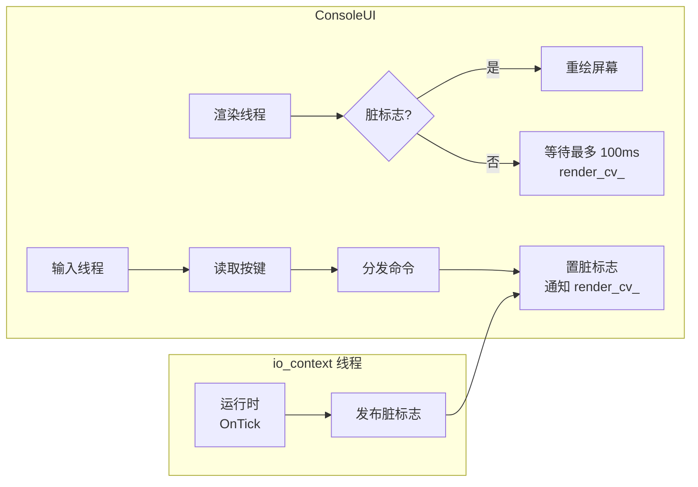
```mermaid
graph LR
    subgraph "ConsoleUI"
        RI[渲染线程] --> RD{脏标志?}
        RD -->|是| DRAW[重绘屏幕]
        RD -->|否| WAIT[等待最多 100ms\nrender_cv_]
        II[输入线程] --> READ[读取按键]
        READ --> CMD[分发命令]
        CMD --> DF[置脏标志\n通知 render_cv_]
    end
    subgraph "io_context 线程"
        RT[运行时\nOnTick] --> DF2[发布脏标志]
        DF2 --> DF
    end
```

TUI 布局：
- 固定 10 行头部（连接状态、会话统计、带宽）
- 可滚动的 3 节主体：信息 / 命令输出 / 输入历史
- 固定 5 行底部（输入提示符）
- 交替屏幕缓冲区（进入时 `\x1b[?1049h`，退出时 `\x1b[?1049l`）
- 全生命周期隐藏真实光标
- 最小终端尺寸：40 列 × 20 行

完整参考：[`docs/TUI_DESIGN_CN.md`](docs/TUI_DESIGN_CN.md)

---

## 静态路由与 NAT 路径

除了隧道传输以太网帧之外，OPENPPP2 还支持两种特殊转发路径：**NAT** 和**静态路由**。

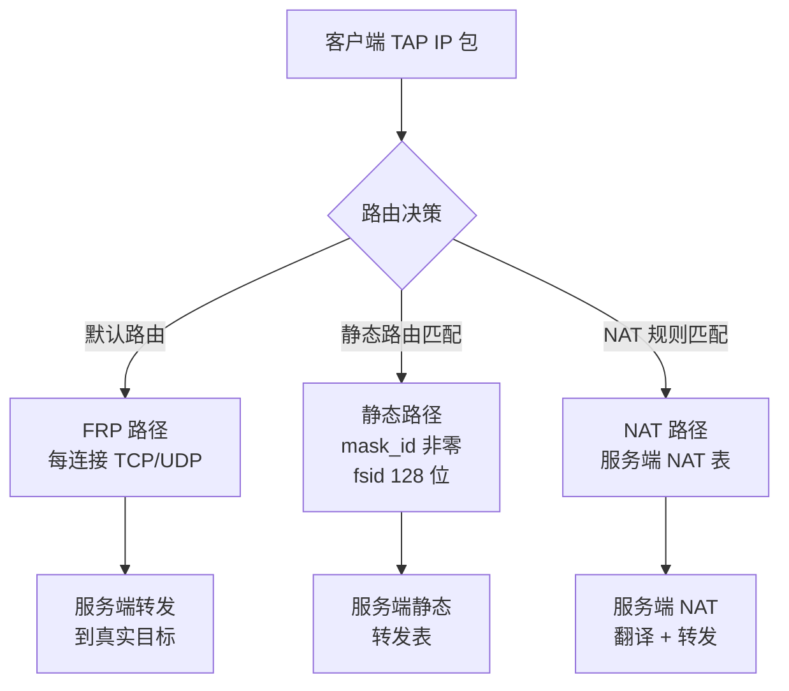
```mermaid
flowchart TD
    A[客户端 TAP IP 包] --> B{路由决策}
    B -->|默认路由| C[FRP 路径\n每连接 TCP/UDP]
    B -->|静态路由匹配| D[静态路径\nmask_id 非零\nfsid 128 位]
    B -->|NAT 规则匹配| E[NAT 路径\n服务端 NAT 表]
    C --> F[服务端转发\n到真实目标]
    D --> G[服务端静态\n转发表]
    E --> H[服务端 NAT\n翻译 + 转发]
```

静态包约束：
- `mask_id` 必须非零（标识静态路由条目）。
- `session_id` 符号编码地址族：正数 = UDP，负数 = IP。
- `fsid` 是 128 位流标识符（`Int128`）。
- 校验和覆盖所有变换后的头部+载荷。
- 打包流水线共 14 步；解包精确逆序。

完整参考：[`docs/PACKET_FORMATS_CN.md`](docs/PACKET_FORMATS_CN.md)、[`docs/TUNNEL_DESIGN_CN.md`](docs/TUNNEL_DESIGN_CN.md)

---

## MUX 通道多路复用

MUX 子系统允许多个逻辑子连接共享单一 `ITransmission` 载体。

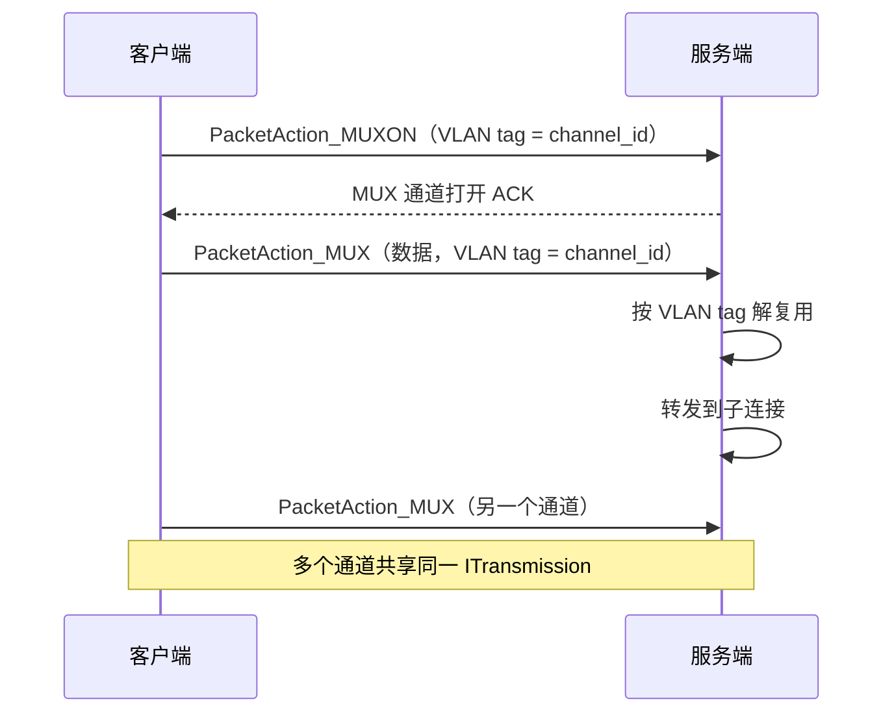
```mermaid
sequenceDiagram
    participant C as 客户端
    participant S as 服务端

    C->>S: PacketAction_MUXON（VLAN tag = channel_id）
    S-->>C: MUX 通道打开 ACK
    C->>S: PacketAction_MUX（数据，VLAN tag = channel_id）
    S->>S: 按 VLAN tag 解复用
    S->>S: 转发到子连接
    C->>S: PacketAction_MUX（另一个通道）
    Note over C,S: 多个通道共享同一 ITransmission
```

关键事实：
- MUX 包头中的 VLAN tag 标识逻辑通道。
- 握手中的 `nmux` 低位启用 MUX 模式。
- 所有子连接共享同一底层 TCP/WS 连接。
- 当需要大量并发流时，减少连接建立开销。

完整参考：[`docs/LINKLAYER_PROTOCOL_CN.md`](docs/LINKLAYER_PROTOCOL_CN.md)

---

## 数据包生命周期（摘要）

从客户端应用到远程主机再返回的完整端到端包旅程：

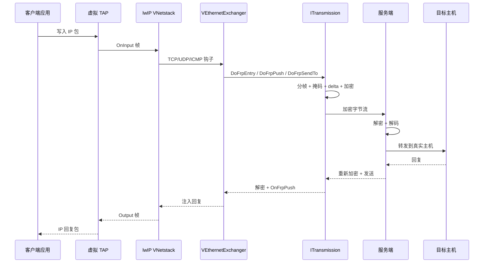
```mermaid
sequenceDiagram
    participant APP as 客户端应用
    participant TAP as 虚拟 TAP
    participant LWIP as lwIP VNetstack
    participant EX as VEthernetExchanger
    participant TX as ITransmission
    participant SRV as 服务端
    participant DST as 目标主机

    APP->>TAP: 写入 IP 包
    TAP->>LWIP: OnInput 帧
    LWIP->>EX: TCP/UDP/ICMP 钩子
    EX->>TX: DoFrpEntry / DoFrpPush / DoFrpSendTo
    TX->>TX: 分帧 + 掩码 + delta + 加密
    TX->>SRV: 加密字节流
    SRV->>SRV: 解密 + 解码
    SRV->>DST: 转发到真实主机
    DST-->>SRV: 回复
    SRV-->>TX: 重新加密 + 发送
    TX-->>EX: 解密 + OnFrpPush
    EX-->>LWIP: 注入回复
    LWIP-->>TAP: Output 帧
    TAP-->>APP: IP 回复包
```

完整参考：[`docs/PACKET_LIFECYCLE_CN.md`](docs/PACKET_LIFECYCLE_CN.md)

---

## EDSM 状态机

OPENPPP2 在每个层次使用事件驱动状态机（EDSM）架构：单会话、单连接、单传输、应用生命周期。

```mermaid
stateDiagram-v2
    [*] --> Idle
    Idle --> Connecting: Connect()
    Connecting --> Handshaking: 套接字已连接
    Handshaking --> Running: handshaked_ = true
    Running --> Reconnecting: 传输错误
    Running --> Stopping: Dispose() 调用
    Reconnecting --> Connecting: 重启延迟到期
    Stopping --> [*]: 清理完成
```

每次状态转移由 Asio 完成回调或协程恢复驱动，而非轮询循环。状态机永远不会从阻塞的 OS 线程推进。

状态机属性：
- 所有转移发生在 `asio::strand` 上，避免并发状态修改。
- `compare_exchange_strong` 保护生命周期标志转移。
- `Dispose()` 是幂等的：多次调用是安全的。
- 对象由 `std::shared_ptr` 引用计数保持存活，直到所有飞行中的协程完成。

完整参考：[`docs/EDSM_STATE_MACHINES_CN.md`](docs/EDSM_STATE_MACHINES_CN.md)

---

## 传输包与会话 ID

会话标识被打包进分帧传输流中。`TRANSMISSION_PACK_SESSIONID` 文档涵盖精确字节布局。

```mermaid
graph LR
    subgraph "首包（扩展头部）"
        H1[4 字节：长度+标志] --> H2[3 字节：会话 ID 扩展]
        H2 --> P[载荷]
    end
    subgraph "后续包（简单头部）"
        S1[4 字节：长度+标志] --> SP[载荷]
    end
    H1 --> FT[frame_tn_ / frame_rn_ 计数器\n控制头部模式]
```

扩展头部到简单头部的切换由 `frame_tn_`（发送）和 `frame_rn_`（接收）计数器控制。每个方向的第一个包使用扩展头部；后续包使用简单 4 字节头部。

完整参考：[`docs/TRANSMISSION_PACK_SESSIONID_CN.md`](docs/TRANSMISSION_PACK_SESSIONID_CN.md)

---

## 部署拓扑

### 独立服务端 + 直连客户端

```mermaid
graph LR
    C1[客户端 A] -->|ppp://server:20000/| S[ppp 服务端]
    C2[客户端 B] -->|ppp://server:20000/| S
    C3[客户端 C] -->|ppp://ws/server:20000/| S
    S --> I[Internet]
```

### 带 Go 后端的托管部署

```mermaid
graph LR
    C1[客户端 A] --> S[ppp 服务端]
    C2[客户端 B] --> S
    S -->|WebSocket 认证| G[ppp-go 管理服务]
    G --> DB[(用户/策略数据库)]
    S --> I[Internet]
```

### CDN / 反向代理前置

```mermaid
graph LR
    C1[客户端] -->|HTTPS/WSS| CDN[CDN 或反向代理]
    CDN -->|WS| S[ppp 服务端]
    S --> I[Internet]
```

`appsettings.json` 中的 `cdn` 字段配置端口模式混淆，使流量对中间代理呈现为普通 HTTP/WebSocket。

完整参考：[`docs/DEPLOYMENT_CN.md`](docs/DEPLOYMENT_CN.md)

---

## 运维参考

### 关键运行时指标

| 指标 | 含义 |
|------|------|
| Keepalive 超时 | `ProtocolKeepAliveTimeout` 错误码；会话已释放 |
| `GenericTimeout` 高频 | 网络拥塞或路径不稳定 |
| `ResourceExhaustedSessionSlots` | 服务端会话数已达上限；提高 `concurrent` 或增加实例 |
| `AuthCredentialInvalid` | 凭据不匹配；检查双端 `key.*` 字段是否一致 |
| 启动时 `TunnelOpenFailed` | TAP 驱动未安装（Windows）或权限不足 |
| `AppPrivilegeRequired` | 以 root（Linux/macOS）或 Administrator（Windows）运行 |

### `OnTick()` 调度

主运行时定时触发（默认约 1 秒）。每次 tick 执行：

1. 刷新带宽 / 会话统计。
2. 检查隧道存活状态（keepalive 超时检测）。
3. 老化过期会话（服务端）。
4. 老化过期 IPv6 租约（服务端）。
5. 向 TUI 渲染线程发布脏标志。
6. 通过 `NextTickAlwaysTimeout(false)` 重新调度。

完整参考：[`docs/OPERATIONS_CN.md`](docs/OPERATIONS_CN.md)

---

## 诊断与错误系统

诊断子系统提供结构化错误报告，无需日志记录。

```mermaid
flowchart TD
    A[任意子系统\n发生错误] --> B[SetLastErrorCode\nError::XYZ\n线程局部存储]
    B --> C[原子快照\nhigh32=时间戳\nlow32=错误码]
    C --> D[ErrorHandler::Dispatch\n已注册回调]
    D --> E[TUI 错误显示]
    D --> F[管理后端\n错误上报]
    D --> G[调用方返回值\n哨兵传播]
```

错误快照是原子的：可从任意线程无锁读取。时间戳为截断毫秒，足以在会话内对事件排序。

完整参考：[`docs/DIAGNOSTICS_ERROR_SYSTEM_CN.md`](docs/DIAGNOSTICS_ERROR_SYSTEM_CN.md)、[`docs/ERROR_CODES_CN.md`](docs/ERROR_CODES_CN.md)
