# System Architecture

[中文版本](ARCHITECTURE_CN.md)

## Scope

This is the top-level architecture map for OPENPPP2. It explains how the repository is divided, where the shared core ends, and where host-specific behavior begins.

The map is code-driven. The relevant anchors are `main.cpp`, `ppp/configurations/AppConfiguration.*`, `ppp/transmissions/*`, `ppp/app/protocol/*`, `ppp/app/client/*`, `ppp/app/server/*`, and the platform directories.

---

## Main Idea

OPENPPP2 is a virtual Ethernet infrastructure runtime. It is built from a shared protocol core plus host-specific consequences.

The shared core speaks one tunnel action vocabulary (`VirtualEthernetLinklayer`), uses one protected transport abstraction (`ITransmission`), and is shaped by one configuration model (`AppConfiguration`). The host consequences — route changes, DNS changes, adapter lifecycle, firewall behavior, socket protection — are delegated to platform-specific implementations that the shared core drives through well-defined interfaces.

---

## Core Layout

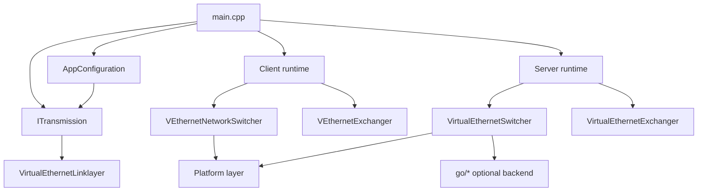

---

## Full Module Dependency Map

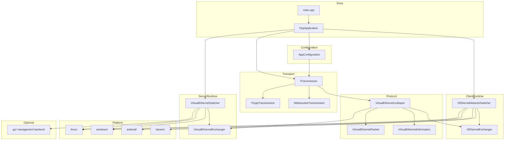

---

## Concurrency Model

OPENPPP2 uses Boost.Asio `io_context` as the event loop backbone, combined with Boost.Coroutine for async-synchronous hybrid programming.

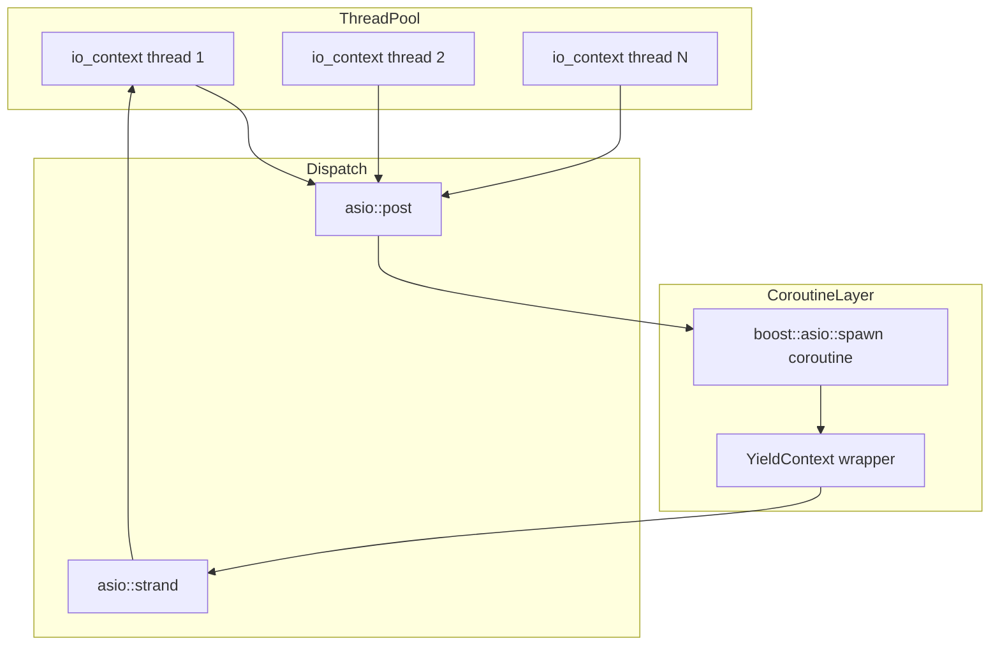

Key concurrency rules:
- Cross-thread object lifetime is managed via `std::shared_ptr` and `std::weak_ptr`.
- Cross-thread state flags use `std::atomic<bool>` with `compare_exchange_strong`.
- IO thread must never be blocked; blocking work is posted via `asio::post`.
- Coroutines yield at every async boundary using `YieldContext`.

---

## Shared Core Vs Host Consequences

The most important split is this:

| Area | Responsibility |
|---|---|
| Shared core | Configuration, transport, handshake, framing, link-layer actions |
| Host consequences | Adapter creation, route changes, DNS changes, firewall behavior, platform-specific IPv6 and socket handling |

Shared core logic can be reused. Host consequences cannot be assumed to match across operating systems.

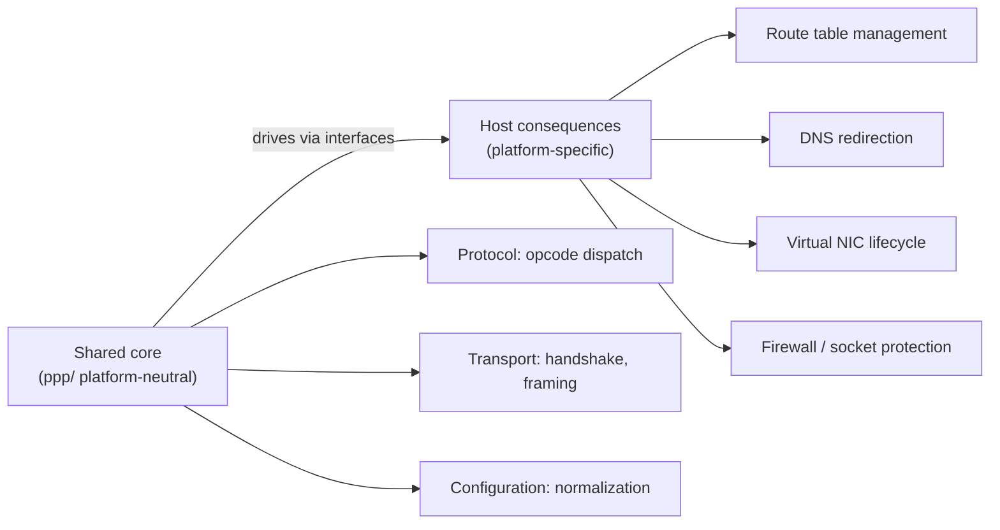

---

## Shared Core

The shared core owns tunnel semantics:

- `AppConfiguration` decides runtime shape
- `ITransmission` owns carrier, handshake, framing, and protected I/O
- `VirtualEthernetLinklayer` owns tunnel action vocabulary
- client and server exchangers own session-level behavior

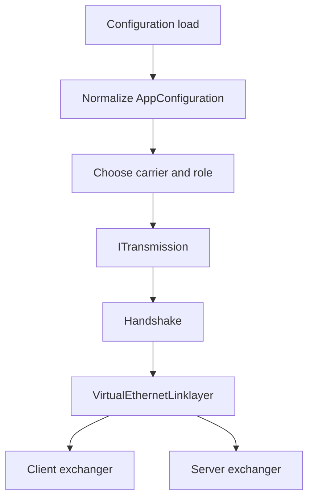

---

## Host Consequences

The platform layer owns local operating-system side effects:

- virtual interface setup
- route table changes
- DNS changes
- socket protection
- platform-specific IPv6 behavior

These are not implementation details that can be hand-waved away. They are part of the observable runtime behavior.

### Platform Interface Points

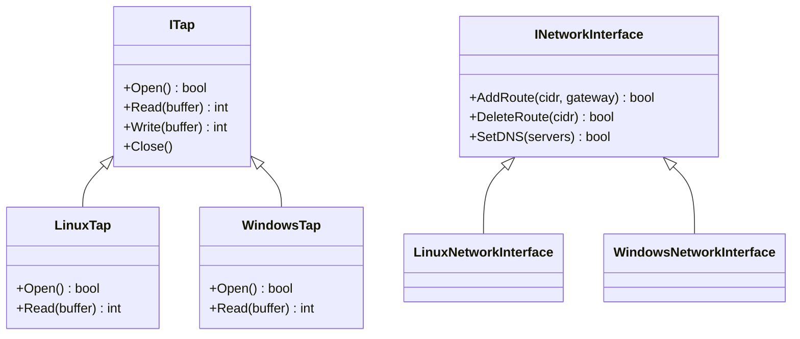

---

## Runtime Entry

`main.cpp` is the C++ entry point and process coordinator. Its flow is:

1. parse arguments
2. load configuration
3. normalize configuration
4. choose role
5. prepare host environment
6. start client or server runtime
7. run the maintenance tick loop
8. report status
9. cleanly shut down

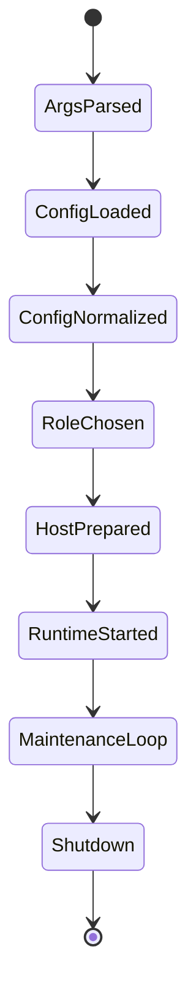

---

## Object Ownership

| Level | Owner |
|---|---|
| Process | `PppApplication` |
| Environment | `VEthernetNetworkSwitcher` or `VirtualEthernetSwitcher` |
| Session | `VEthernetExchanger` or `VirtualEthernetExchanger` |
| Connection | `ITransmission` |

### Ownership Transfer

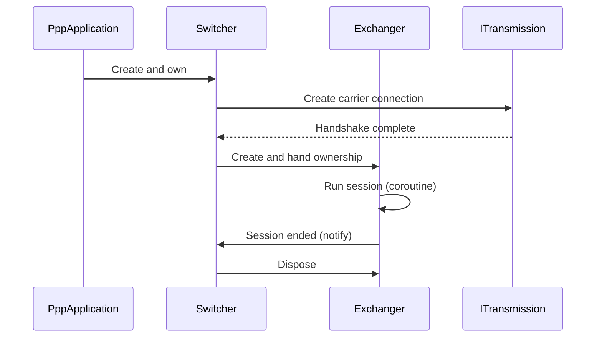

---

## Role Asymmetry

The client and server are not symmetric:

- client: host integration, routing, DNS, proxy, mapping, optional static and mux behavior
- server: listener setup, session switching, forwarding, mapping, IPv6, optional backend integration

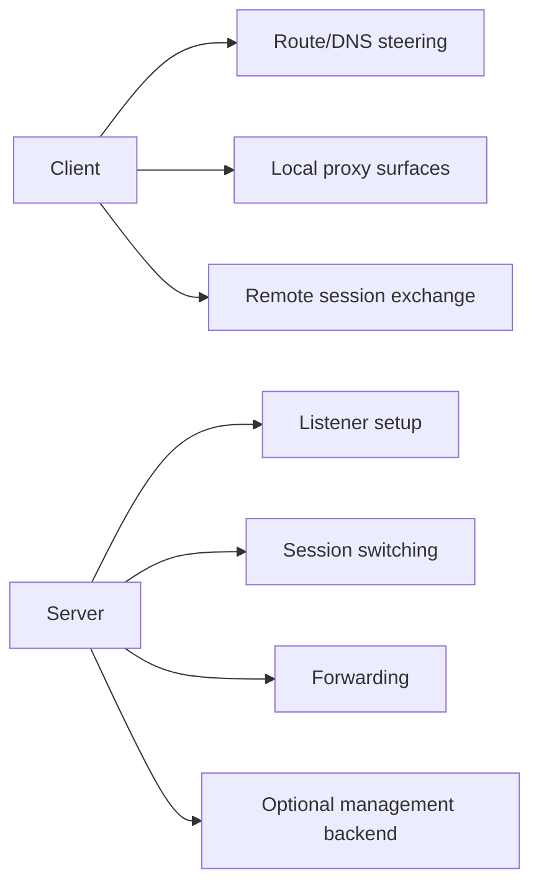

### Opcode Direction Asymmetry

| Opcode | Client initiates | Server initiates |
|--------|-----------------|-----------------|
| `SYN` | Yes | No |
| `SYNOK` | No | Yes |
| `PSH` | Both | Both |
| `FIN` | Both | Both |
| `SENDTO` | Yes | Yes (response) |
| `INFO` | No | Yes |
| `KEEPALIVED` | Yes (echo) | Yes (ack) |
| `FRP_ENTRY` | Yes | No |
| `FRP_CONNECT` | No | Yes |
| `MUX` | Yes | No |
| `MUXON` | No | Yes |

---

## Configuration As Architecture

`AppConfiguration` is architectural, not just parsing code. It determines which transports are enabled, which listeners are opened, what key material is used, and how client/server policy is shaped.

### AppConfiguration Key Fields

| Field | Effect |
|-------|--------|
| `mode` | `client` or `server` |
| `key.kf`, `key.kx`, `key.kl`, `key.kh` | Session cipher key parameters |
| `ip`, `mask`, `gw` | Client virtual network assignment |
| `dns.redirect` | Whether DNS is redirected through tunnel |
| `server.node` | Server address and port |
| `server.protocol` | `tcp`, `websocket`, `websocket-ssl` |
| `tcp.turbo` | TCP performance tuning |
| `udp.static.*` | Static UDP path configuration |

---

## Transmission Versus Protocol

| Layer | Owns |
|---|---|
| Transmission | Carrier selection, handshake, frame protection, cipher state |
| Protocol | Session meaning, opcode meaning, tunnel semantics |

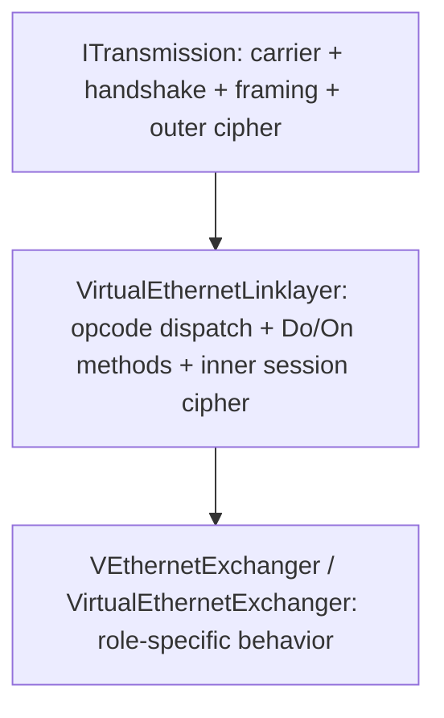

---

## Data Flow: Client To Server

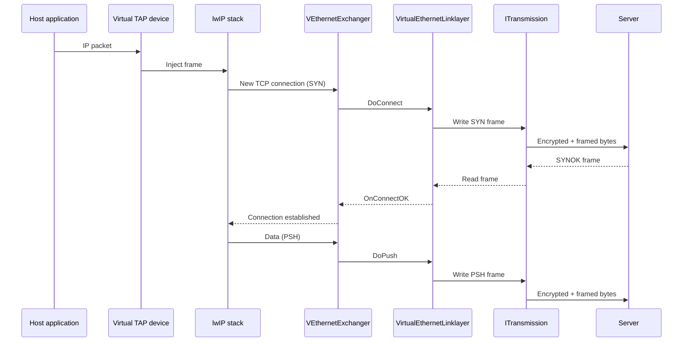

---

## Data Flow: Server To Internet

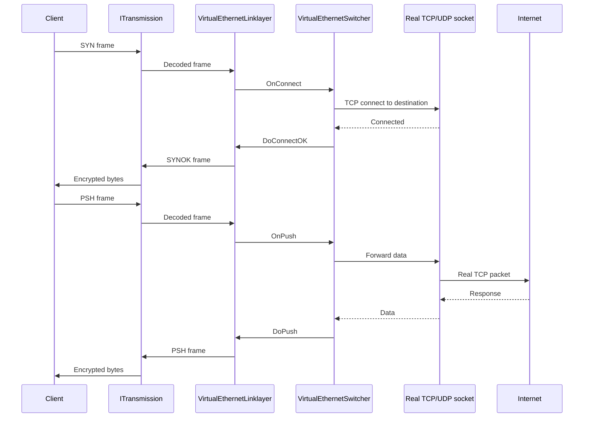

---

## Error Code Reference

Architecture-level error codes from `ppp/diagnostics/Error.h`:

| ErrorCode | Description |
|-----------|-------------|
| `ConfigurationInvalid` | AppConfiguration normalization failed |
| `RoleConflict` | Both client and server role requested |
| `TransmissionHandshakeFailed` | ITransmission handshake did not complete |
| `SessionEstablishFailed` | Link-layer INFO exchange failed |
| `PlatformSetupFailed` | Host adapter / route / DNS setup failed |
| `BackendConnectionFailed` | Optional backend unreachable (non-fatal) |
| `ShutdownTimeout` | Graceful shutdown exceeded time limit |

---

## Related Documents

- [`CLIENT_ARCHITECTURE.md`](CLIENT_ARCHITECTURE.md)
- [`SERVER_ARCHITECTURE.md`](SERVER_ARCHITECTURE.md)
- [`TUNNEL_DESIGN.md`](TUNNEL_DESIGN.md)
- [`STARTUP_AND_LIFECYCLE.md`](STARTUP_AND_LIFECYCLE.md)
- [`ENGINEERING_CONCEPTS.md`](ENGINEERING_CONCEPTS.md)
- [`CONCURRENCY_MODEL.md`](CONCURRENCY_MODEL.md)
- [`PLATFORMS.md`](PLATFORMS.md)
