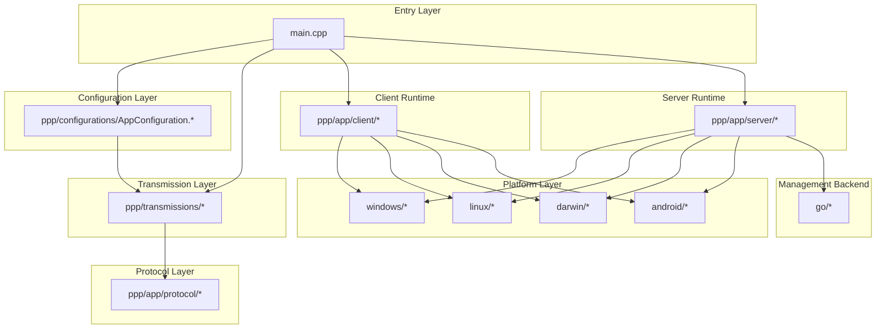
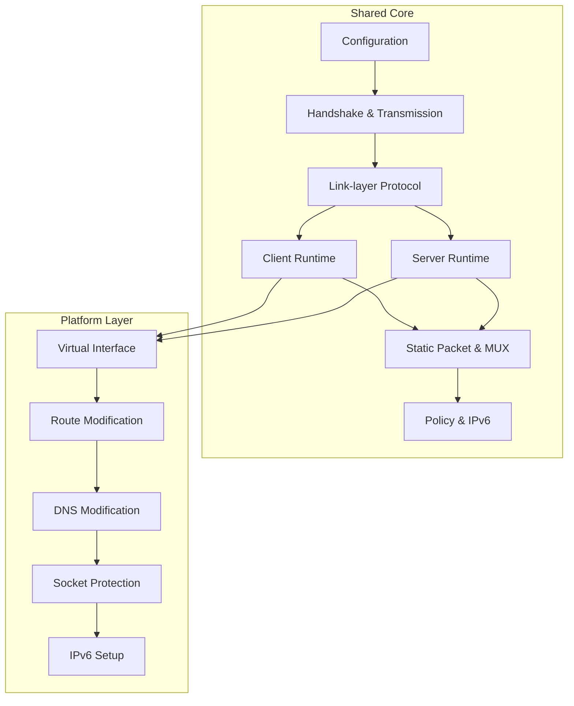
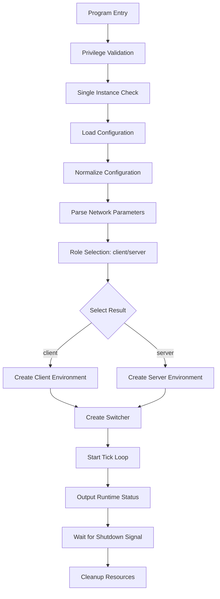
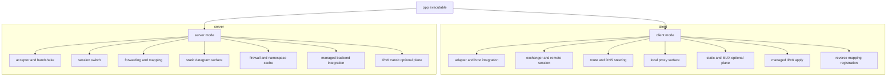
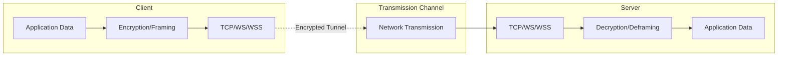
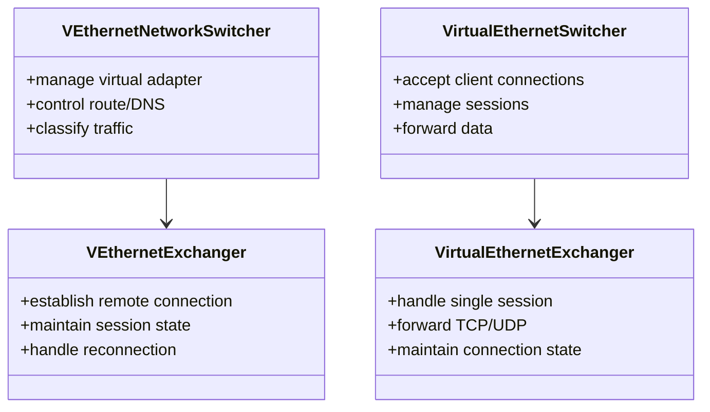
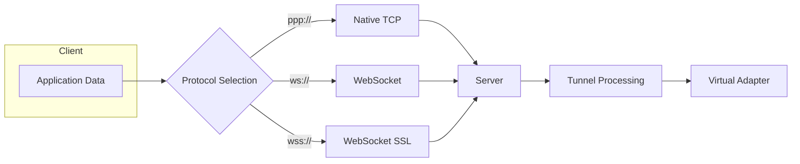
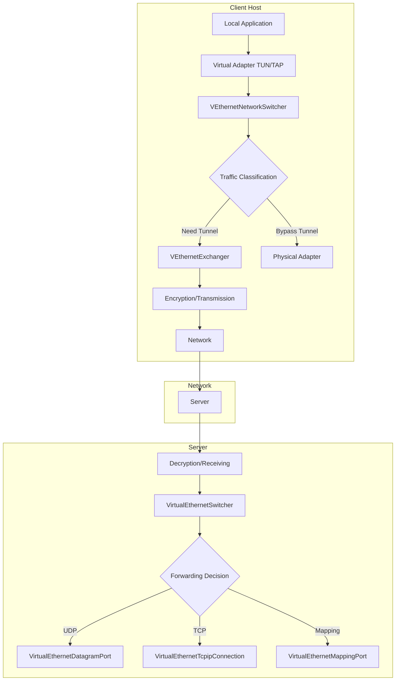
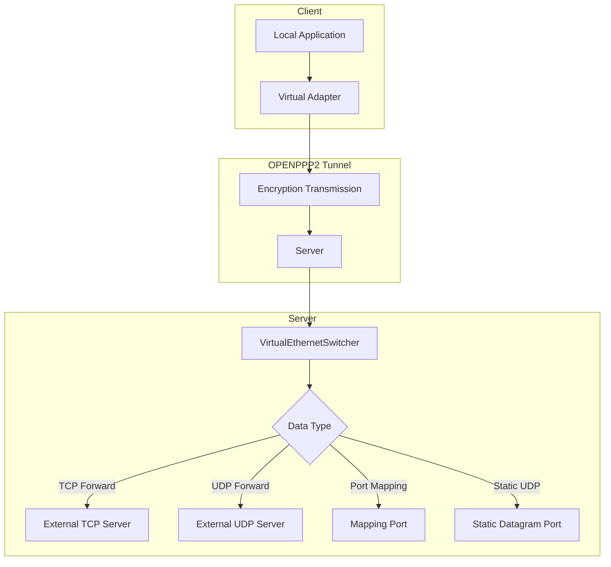
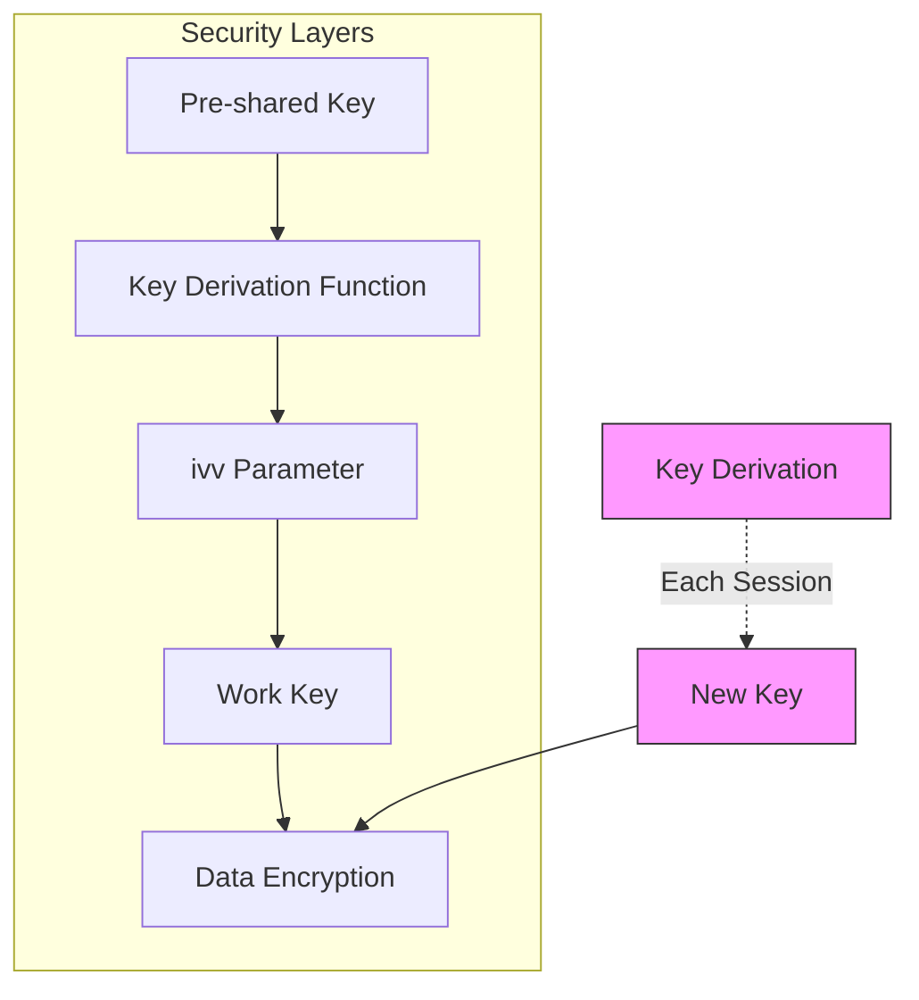

# System Architecture

[中文版本](ARCHITECTURE_CN.md)

## Scope

This document serves as the top-level architecture map for OPENPPP2, providing readers with a comprehensive view of the system architecture. It is intentionally positioned after the deeper technical documents on transport, client, server, routing, platforms, deployment, and operations because its purpose differs from those documents. This document does not attempt to restate every mechanism in detail; rather, it aims to help readers understand how the entire system is layered, how main subsystems relate to each other, what boundaries are most important, and how to navigate the source code correctly without oversimplifying it as "a VPN".

OPENPPP2 is positioned as a virtual Ethernet infrastructure product, which is fundamentally different from most endpoint VPN products. It is not merely an encrypted tunnel but a comprehensive network infrastructure runtime that encompasses virtual interface integration, in-tunnel control and forwarding logic, routing and DNS steering, reverse service mapping, optional static packet and MUX paths, platform-specific host network changes, and an optional external management backend.

## Core Source Code Structure

This document is primarily based on the following code structure:

## The Shortest Accurate Description

OPENPPP2 is a cross-platform network runtime built around the following structure:

| Component | Description |
|-----------|-------------|
| **ppp executable** | C++ main program with client and server modes |
| **Shared core** | Protected transport and tunnel protocol core, including protocol processing, encryption, and framing |
| **Client runtime** | Virtual interface integration, route/DNS control, proxy services |
| **Server runtime** | Connection acceptance, session management, forwarding and mapping |
| **Platform integration** | Host network changes for Windows, Linux, macOS, Android |
| **Management backend** | Optional Go-based management server |

From an architectural perspective, OPENPPP2 cannot be simply described as a VPN client, VPN server, proxy, or custom transport. The source code shows it contains all these concepts at different layers, making it a comprehensive network infrastructure runtime.

## The Most Important Architectural Division

The most important architectural division in the entire repository is the separation between **shared protocol and runtime core** and **platform integration layer**.

### Shared Core (Tunnel Semantics)

The shared core owns tunnel semantics, responsible for network protocol processing and forwarding, including:

| Module | Description | Key Source Files |
|--------|-------------|------------------|
| Configuration normalization | Normalize JSON config and CLI args to runtime model | `AppConfiguration.*` |
| Handshake and transmission | Establish protected connections, perform key exchange | `ITransmission.*` |
| Link-layer actions | In-tunnel control signaling and data forwarding protocol | `VirtualEthernetLinklayer.*` |
| Client runtime | Virtual adapter management, route/DNS control, proxy services | `VEthernetNetworkSwitcher.*` |
| Server runtime | Connection acceptance, session switching, forwarding/mapping | `VirtualEthernetSwitcher.*` |
| Static packet and MUX | UDP static path and multiplexing logic | `VirtualEthernetDatagramPort*`, `vmux*` |
| Policy envelope | Management backend policy distribution and IPv6 allocation | `VirtualEthernetInformation.*` |

### Platform Layer (Host Consequences)

The platform layer owns host consequences, responsible for interacting with the local operating system:

| Module | Description | Key Source Files |
|--------|-------------|------------------|
| Virtual interface creation | Create or attach virtual network adapter | `windows/tap.*`, `linux/tun.*` |
| Route modification | Modify system routing table | Platform-specific route code |
| DNS modification | Modify system DNS configuration | Platform-specific DNS code |
| Socket protection | Prevent traffic recursion into tunnel | `protect` and `bypass` logic |
| IPv6 setup | Platform-specific IPv6 interface configuration | Platform-specific IPv6 code |

This division is crucial as it explains why OPENPPP2 is cross-platform on one hand, yet highly platform-dependent in many places.

## Runtime Entry and Lifecycle

`main.cpp` is the architectural root of the entire C++ side. The system does not scatter the main lifecycle across many binaries or semi-independent launchers, but uses a unified entry point to complete top-level orchestration.

### Startup Pipeline

At startup, `main.cpp` is responsible for the following steps:

### Main Runtime Objects

OPENPPP2 runtime objects are organized by lifecycle and responsibility:

| Object Level | Responsible For | Key Types |
|--------------|-----------------|-----------|
| Process level | Process lifecycle management | `PppApplication` |
| Environment level | Virtual adapter/listener lifecycle | `*Switcher` |
| Session level | Remote connection lifecycle | `*Exchanger` |
| Connection level | Transmission connection lifecycle | `ITransmission` |

This layered structure keeps the code clear with well-defined responsibility boundaries.

## One Binary, Two Main Roles, Multiple Optional Planes

The C++ main binary has two main roles: **client mode** and **server mode**. However, each role itself is not a single behavior but a combination of multiple planes.

### Client Planes

The client mode may include the following planes:

| Plane | Description | Enable Condition |
|-------|-------------|------------------|
| Adapter and host integration | Virtual adapter creation and management | Enabled by default |
| Exchanger and remote session | Connection and session with server | Enabled by default |
| Route and DNS steering | Route control and DNS policy | Enabled by default |
| Local proxy surface | HTTP/SOCKS proxy services | Configurable |
| Static and MUX optional plane | UDP static path or multiplexing | Configurable |
| Managed IPv6 apply | Receive and apply server IPv6 config | Configurable |
| Reverse mapping registration | Register reverse mapping with server | Configurable |

### Server Planes

The server mode may include the following planes:

| Plane | Description | Enable Condition |
|-------|-------------|------------------|
| Acceptor and handshake | Accept and process client connections | Enabled by default |
| Session switch | Session management and switching | Enabled by default |
| Forwarding and mapping | Data forwarding and port mapping | Enabled by default |
| Static datagram surface | UDP static path service | Configurable |
| Firewall and namespace cache | Firewall rules and namespace cache | Configurable |
| Managed backend integration | Management backend connection | Configurable |
| IPv6 transit optional plane | IPv6 forwarding and neighbor proxy | Configurable |

## Configuration Object as Architecture Component

`AppConfiguration` is not just a configuration file parser but a very important architecture component in the entire system. It defines:

- The configuration vocabulary for the entire runtime
- Default runtime behavior when not specified
- How text configuration is normalized to operational intent

This is important because many systems treat configuration as supplementary content. In OPENPPP2, configuration itself is part of the architecture. It not only selects values but also selects major runtime behaviors:

| Config Item | Affected Behavior |
|-------------|------------------|
| `server.listen.*` | Which listeners to open |
| `server.backend` | Whether management backend is needed |
| `ipv6.mode` | IPv6 mode: none, NAT66, GUA |
| `static.*` | Whether to enable static mode |
| `mux.*` | Whether to enable multiplexing |
| `dns.*` | DNS redirection and caching |
| `key.*` | Encryption key and algorithm selection |

## Protected Transmission Layer vs. Tunnel Action Layer

One very important conceptual boundary in the entire repository is the separation between **protected transmission** and **tunnel action protocol**.

### Protected Transmission Layer

The protected transmission layer, located primarily in `ppp/transmissions/`, handles:

| Function | Description |
|----------|-------------|
| Carrier transport selection | TCP, WebSocket, WSS, etc. |
| Handshake sequencing | Handshake sequence and key exchange |
| Key derivation | Work key reconstruction based on `ivv` |
| Framing and encryption | Data encryption encapsulation and decapsulation |
| Read/write pipeline | Asynchronous IO operations |

### Tunnel Action Layer

The tunnel action protocol, located primarily in `ppp/app/protocol/VirtualEthernetLinklayer.*`, handles:

| Function | Description |
|----------|-------------|
| Session information | INFO message delivery |
| Keepalive | KEEPALIVED messages |
| Virtual subnet forwarding | LAN, NAT messages |
| UDP relay | SENDTO, ECHO messages |
| TCP relay | SYN, SYNOK, PSH, FIN messages |
| Reverse mapping | MAPPING messages |
| Static path negotiation | STATIC messages |

This separation allows OPENPPP2 to flexibly support multiple transport carriers while maintaining unified tunnel control semantics.

## Core Types and Their Relationships

### Client Core Types

| Type | Responsibility | Key Files |
|------|---------------|-----------|
| `VEthernetNetworkSwitcher` | Host network environment management | `VEthernetNetworkSwitcher.*` |
| `VEthernetExchanger` | Remote session management | `VEthernetExchanger.*` |
| `VEthernetNetworkTcpipStack` | TCP/IP protocol stack | `VEthernetNetworkTcpipStack.*` |
| `VEthernetNetworkTcpipConnection` | TCP connection management | `VEthernetNetworkTcpipConnection.*` |
| `VEthernetDatagramPort` | UDP datagram port | `VEthernetDatagramPort.*` |
| `VEthernetHttpProxySwitcher` | HTTP proxy | `VEthernetHttpProxySwitcher.*` |
| `VEthernetSocksProxySwitcher` | SOCKS proxy | `VEthernetSocksProxySwitcher.*` |

### Server Core Types

| Type | Responsibility | Key Files |
|------|---------------|-----------|
| `VirtualEthernetSwitcher` | Server environment management | `VirtualEthernetSwitcher.*` |
| `VirtualEthernetExchanger` | Session exchange management | `VirtualEthernetExchanger.*` |
| `VirtualEthernetNetworkTcpipConnection` | TCP connection management | `VirtualEthernetNetworkTcpipConnection.*` |
| `VirtualEthernetManagedServer` | Managed server | `VirtualEthernetManagedServer.*` |
| `VirtualEthernetDatagramPort` | UDP port management | `VirtualEthernetDatagramPort.*` |
| `VirtualEthernetDatagramPortStatic` | Static UDP port | `VirtualEthernetDatagramPortStatic.*` |
| `VirtualEthernetNamespaceCache` | Namespace cache | `VirtualEthernetNamespaceCache.*` |
| `VirtualEthernetMappingPort` | Mapping port | `VirtualEthernetMappingPort.*` |

## Connection Protocols and Data Planes

OPENPPP2 supports multiple connection protocols, forming different data planes:

### Native TCP Direct (ppp://)

| Attribute | Description |
|-----------|-------------|
| Protocol prefix | `ppp://` |
| Transport | Native TCP direct |
| Use case | Low latency, high throughput direct connection |
| Port | Default 20000 |

### WebSocket Plain (ws://)

| Attribute | Description |
|-----------|-------------|
| Protocol prefix | `ws://` |
| Transport | WebSocket plain |
| Use case | CDN forwarding, HTTP proxy environment |
| Port | Default 80 |

### WebSocket SSL (wss://)

| Attribute | Description |
|-----------|-------------|
| Protocol prefix | `wss://` |
| Transport | SSL encrypted WebSocket |
| Use case | CDN forwarding, HTTPS proxy environment |
| Port | Default 443 |

## Data Flow Architecture

### Client Data Flow

### Server Data Flow

## Security Architecture Boundaries

OPENPPP2's security model is multi-layered, requiring clear trust boundaries:

### Trust Boundaries

| Boundary | Location | Trusted Content |
|----------|----------|-----------------|
| Client host | Local runtime environment | Operating system, network stack, route configuration |
| Server host | Server runtime environment | Operating system, network stack, firewall |
| Transport network | Between client and server | Network operator, ISP, cloud provider |
| Management backend | Optional component | Policy distribution, identity verification |
| Configuration file | Local storage | Keys, certificates, backend credentials |

### Security Features (Without PFS Claim)

OPENPPP2 implements **Forward Security Assurance (FP)** through connection-level work key derivation, but it must be clarified:

- **Not PFS**: The system does not implement traditional Perfect Forward Secrecy (PFS)
- **FP Mechanism**: Each session uses dynamically derived keys; even if a key is obtained, historical traffic cannot be decrypted
- **Key Exchange**: Work keys are derived from pre-shared keys and session-specific `ivv` parameters
- **Key Rotation**: Keys can be re-negotiated during the session through handshake

## Platform Differentiation

OPENPPP2 has implementation differences across different platforms:

### Virtual Adapter Implementation

| Platform | Interface Type | Driver Method |
|----------|---------------|---------------|
| Windows | TAP | Windows TUN/TAP driver |
| Linux | TUN | tun/tap kernel module |
| macOS | utun | utun interface |
| Android | TUN | VPN Service API |

### Network Feature Support

| Feature | Windows | Linux | macOS | Android |
|---------|---------|-------|-------|---------|
| Route table modification | ✅ | ✅ | ✅ | ✅ |
| DNS modification | ✅ | ✅ | ✅ | ✅ |
| Promiscuous mode | N/A | ✅ | ✅ | N/A |
| RAW socket | ✅ | ✅ | ✅ | ✅ |
| IPv6 | ✅ | ✅ | ✅ | ✅ |

## Essential Differences from Traditional VPNs

OPENPPP2 is fundamentally different from traditional VPN products:

| Feature | Traditional VPN | OPENPPP2 |
|---------|-----------------|----------|
| Architecture positioning | Endpoint secure connection | Virtual Ethernet infrastructure |
| Network model | Point-to-point tunnel | Virtual switch/router |
| Function scope | Encrypted channel | Complete network stack (routing/DNS/proxy/mapping) |
| Extensibility | Limited | Supports static, MUX, IPv6 |
| Platform integration | Plugin form | Kernel-level integration |
| Management | Centralized | Distributed + optional management backend |

## Source Code Navigation Recommendations

For readers who want to deeply study OPENPPP2 source code, the recommended order is:

1. **Start from entry**: `main.cpp` to understand the overall flow
2. **Configuration model**: `AppConfiguration.*` to understand the configuration system
3. **Transmission layer**: `ITransmission.*` to understand encryption and transmission
4. **Client**: `VEthernetNetworkSwitcher.*` + `VEthernetExchanger.*`
5. **Server**: `VirtualEthernetSwitcher.*` + `VirtualEthernetExchanger.*`
6. **Platform code**: Select corresponding platform directory as needed

## Summary

OPENPPP2 is a complex multi-layer system whose architectural core lies in:

1. **Unified entry**: One binary supports client/server roles
2. **Core and platform separation**: Shared core handles protocol logic, platform layer handles OS integration
3. **Multi-layer planes**: Each role consists of multiple optional planes
4. **Configuration as architecture**: Configuration object is an architecture component
5. **Protocol layering**: Protected transmission separated from tunnel action
6. **FP, not PFS**: Implements Forward Security Assurance but not traditional PFS

Understanding these architectural principles is crucial for correctly using and extending OPENPPP2.

## Related Documents

| Document | Description |
|----------|-------------|
| [STARTUP_AND_LIFECYCLE.md](STARTUP_AND_LIFECYCLE.md) | Startup, Process Ownership, and Lifecycle Control |
| [CLIENT_ARCHITECTURE.md](CLIENT_ARCHITECTURE.md) | Client Runtime Architecture |
| [SERVER_ARCHITECTURE.md](SERVER_ARCHITECTURE.md) | Server Runtime Architecture |
| [TRANSMISSION.md](TRANSMISSION.md) | Transmission Layer and Protected Tunnel Model |
| [SECURITY.md](SECURITY.md) | Security Model and Defensive Interpretation |
| [CONFIGURATION.md](CONFIGURATION.md) | Configuration Model and Parameter Dictionary |
