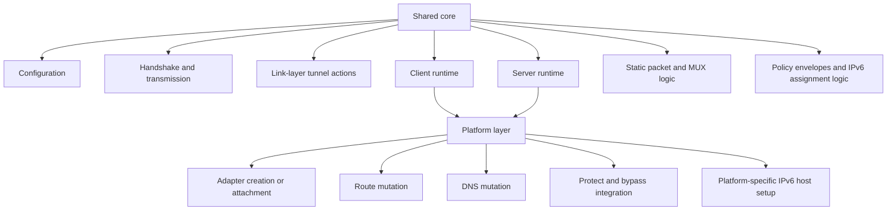
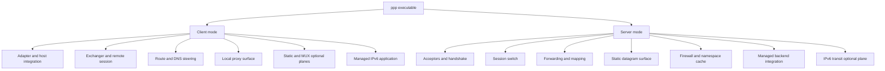
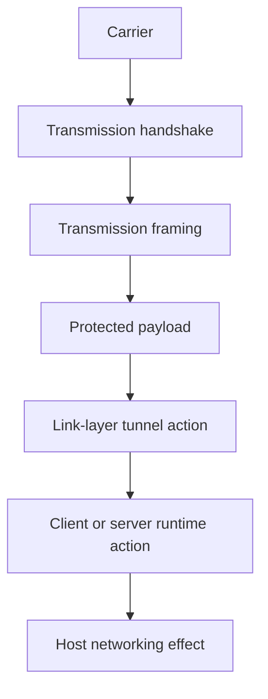
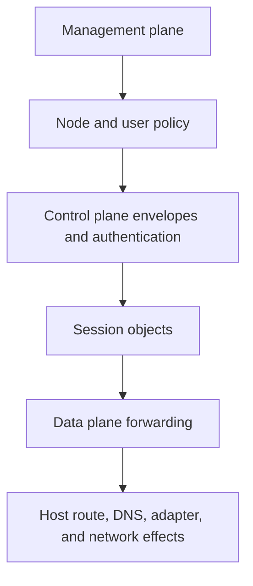

# Architecture

[中文版本](ARCHITECTURE_CN.md)

## Scope

This document is the top-level architecture map for OPENPPP2. It is intentionally written after the deeper documents on transport, client runtime, server runtime, routing, platforms, deployment, and operations, because its job is different from theirs.

This document does not try to restate every mechanism in full detail. Its job is to explain how the whole system is partitioned, how the main subsystems relate to one another, what the important boundaries are, and how a reader should navigate the source tree without flattening the entire project into one vague idea of a VPN.

The architecture described here is based on the actual code structure, especially:

- `main.cpp`
- `ppp/configurations/AppConfiguration.*`
- `ppp/transmissions/*`
- `ppp/app/protocol/*`
- `ppp/app/client/*`
- `ppp/app/server/*`
- `windows/*`
- `linux/*`
- `darwin/*`
- `android/*`
- `go/*`

## The Shortest Accurate Description

OPENPPP2 is a cross-platform network runtime built around:

- one C++ executable named `ppp`
- one shared protected-transport and tunnel protocol core
- one client runtime
- one server runtime
- one platform integration layer per host family
- one optional Go management backend

It is not best described as only a VPN client, only a VPN server, only a proxy, or only a custom transport. The code shows that it is a composed system containing all of those ideas in different layers.

If a single sentence is required, the least misleading sentence is this:

OPENPPP2 is a network infrastructure runtime that combines protected transport, virtual adapter integration, tunnel-side control and forwarding logic, route and DNS steering, reverse service mapping, optional static packet and MUX paths, platform-specific host mutation, and an optional external management backend.

## The Main Architectural Split

The most important architectural split in the repository is between:

- shared protocol and runtime core
- platform integration layer

The shared core owns tunnel semantics.

The platform layer owns host consequences.

Tunnel semantics include:

- configuration normalization
- handshake
- framing
- ciphertext state construction
- tunnel control actions
- session objects
- NAT, mapping, static packet, MUX, and IPv6 assignment logic

Host consequences include:

- creating or attaching the virtual adapter
- mutating route tables
- mutating DNS behavior
- protecting sockets from recursion
- performing platform-specific IPv6 interface and transit setup

This split matters because it explains why the project is both cross-platform and deeply platform-specific at the same time.

## The Runtime Starts From One Entry Point

`main.cpp` is the architectural root of the C++ side.

That matters more than it may seem. The system does not scatter primary lifecycle across many binaries or many semi-independent launchers. The top-level program flow is centralized in one place.

At startup, `main.cpp` is responsible for:

- loading configuration
- selecting role
- parsing host-specific runtime flags
- preparing client or server environment
- creating the corresponding switcher object
- arming the periodic tick loop
- printing operational state
- coordinating shutdown and restart

Architecturally, this means OPENPPP2 is not a loose federation of tools. It is a single orchestrated runtime with role-specific branches.

## One Binary, Two Main Roles, Several Optional Planes

The C++ executable has two primary roles:

- client mode
- server mode

But each role is not a single behavior. Each role is a composition of optional planes.

Client role may include:

- virtual adapter integration
- route steering
- DNS steering
- local HTTP proxy
- local SOCKS proxy
- static packet path participation
- MUX sub-link participation
- reverse mapping registration
- managed IPv6 apply and rollback

Server role may include:

- multiple stream listeners
- static datagram listener
- firewall policy
- namespace cache
- reverse mapping exposure
- optional managed backend connectivity
- optional IPv6 transit and neighbor proxy state

So the binary role is only the first cut. The second cut is which optional planes are actually enabled.

## The Configuration Object Is An Architectural Component, Not Just A File Parser

`AppConfiguration` is one of the central architectural components.

It defines:

- the vocabulary of the whole runtime
- the default behaviors the runtime will assume
- the normalization and validation rules that convert text config into operational intent

This is important because many systems document configuration as a secondary concern. In OPENPPP2, configuration is part of the architecture itself. It does not merely select values. It selects major runtime behavior:

- which transport listeners exist
- whether WS/WSS are active
- whether mappings exist
- whether IPv6 mode is none, NAT66, or GUA
- whether static mode or MUX exists
- whether DNS redirect and cache exist
- whether a management backend is in the design at all

That is why the configuration document and the architecture document must be read together.

## The Protected Transmission Layer Is Distinct From The Tunnel Action Layer

One of the most important conceptual boundaries in the repository is between:

- protected transmission
- tunnel action protocol

The protected transmission layer lives mainly in `ppp/transmissions/`.

Its concerns are:

- carrier transport choice such as TCP, WS, WSS
- handshake sequencing
- framing family selection
- protocol and transport cipher state
- payload transforms and protected packet boundaries

The tunnel action layer lives mainly in `ppp/app/protocol/`.

Its concerns are:

- what a packet means to the overlay
- whether a message is NAT, SENDTO, ECHO, INFO, CONNECT, static, MUX, or mapping-related
- how client and server runtime objects react to those actions

This separation is crucial. The transport layer is not the whole protocol. The tunnel action layer is not the same thing as the carrier. A reader who collapses both into one idea of “the protocol” will miss most of the design.

## The Tunnel Action Layer Is The Common Language Between Client And Server

`VirtualEthernetLinklayer`, `VirtualEthernetInformation`, `VirtualEthernetPacket`, and related protocol types define the common language used by both sides of the tunnel.

That language includes actions for:

- information exchange
- keepalive
- NAT and LAN handling
- TCP connect, push, connect-ok, disconnect
- UDP sendto style forwarding
- static packet handling
- MUX setup and child connections
- FRP-like mapping registration and forwarding

But the language is shared only at the vocabulary level. Legality is still role-specific. Both client and server contain explicit defensive rejection paths for actions that should never arrive from that direction.

Architecturally, this means OPENPPP2 uses one shared message vocabulary but not one symmetric peer model. The client and server are not equal peers in behavior, even when they recognize the same message names.

## The Client Architecture Boundary

The client has one especially important internal split:

- `VEthernetNetworkSwitcher`
- `VEthernetExchanger`

The switcher owns local host networking meaning.

The exchanger owns remote session meaning.

This is not just a naming preference. It is one of the cleanest design decisions in the project.

The switcher owns:

- the virtual adapter
- the underlying NIC relationship
- route tables and bypass policy
- DNS rules and DNS redirection behavior
- local proxy surfaces
- local packet admission and emission
- managed IPv6 application to the host

The exchanger owns:

- transmission open and reconnect loop
- handshake to the server
- keepalive and liveness behavior
- static path negotiation
- MUX plane behavior
- mapping registration
- datagram state keyed by source endpoint

Architecturally, this means the client is not "socket code plus some local routes." It is a host-edge runtime composed from a host-facing half and a remote-session-facing half.

## The Server Architecture Boundary

The server has a similar but not identical split:

- `VirtualEthernetSwitcher`
- `VirtualEthernetExchanger`

The switcher is node-wide.

The exchanger is per-session.

The switcher owns:

- listeners
- accepted connection classification
- session map
- connection map
- firewall policy
- namespace cache
- optional managed backend client
- optional static datagram socket
- optional IPv6 transit state
- logger and node-wide statistics

The exchanger owns:

- one client session
- per-session forwarding state
- per-session mapping ports
- per-session datagram ports
- per-session MUX and static allocation state
- action handlers for messages from that client

Architecturally, the server is a session switch, not merely a packet forwarder. Its top-level object routes accepted connections into either:

- main session establishment
- auxiliary connection handling

That split is one of the key reasons the code reads more like a network node than like a simple daemon.

## Data Plane, Control Plane, And Management Plane

The repository becomes easier to reason about when split into three planes.

### Data Plane

This is where actual forwarded traffic moves.

Examples:

- TUN/TAP packet I/O
- NAT packet forwarding
- TCP relay payload flow
- UDP datagram payload flow
- static packet payload flow
- IPv6 transit payload flow

### Control Plane

This is where sessions are established and maintained.

Examples:

- handshake
- information envelope exchange
- keepalive
- mapping registration
- MUX connection setup
- requested IPv6 configuration and assigned IPv6 response

### Management Plane

This is optional and externalized.

Examples:

- Go backend
- Redis and MySQL state
- node authentication and policy lookup

The control plane exists even without the management plane. The management plane is an optional dependency layered above it.

## The Platform Layer Is Not A Thin Portability Wrapper

The platform directories are not a decorative portability shell. They are where host-network reality lives.

Windows provides:

- Wintun or TAP integration
- WMI-backed adapter configuration
- native route and DNS mutation helpers
- Windows-specific proxy and desktop client integration

Linux provides:

- tun integration
- route and DNS mutation helpers
- socket protect support
- the richest server-side IPv6 transit implementation

Darwin provides:

- utun integration
- route socket usage
- Darwin-specific IPv6 apply and restore logic

Android provides:

- shared-library embedding
- external VPN TUN fd attachment
- JNI-based protect integration

This is why the project can be honestly called cross-platform without pretending the host behavior is uniform.

## The Optional Go Backend Is Architecturally Separate

The Go service under `go/` is not a peer replacement for the C++ runtime. It is an optional management subsystem.

It owns concerns such as:

- persistent node metadata
- user policy and quota state
- Redis coordination
- MySQL persistence
- WebSocket and HTTP management endpoints

The C++ server owns the data plane even when the backend is enabled.

This distinction is architecturally important because it prevents a common misunderstanding. OPENPPP2 is not one monolith split across C++ and Go. It is a C++ data-plane runtime that can optionally depend on a Go management plane.

## Architectural Reading Order

For a new reader, the most effective reading order is this.

1. `main.cpp`
2. `ppp/configurations/AppConfiguration.*`
3. `ppp/transmissions/*`
4. `ppp/app/protocol/*`
5. `ppp/app/client/*`
6. `ppp/app/server/*`
7. platform tree for the target OS
8. `go/*` only if managed deployment matters

This order mirrors the architecture from outside to inside, then from shared core to role-specific runtime, then from runtime to host-specific realization, then finally to optional management.

## The Most Important Boundaries To Preserve When Modifying The Code

Several boundaries are worth preserving because they are carrying real architectural weight.

Do not collapse transport concerns into tunnel action concerns.

Do not move host route and DNS mutation into the exchanger/session objects.

Do not treat client and server as symmetric peers just because they share a message vocabulary.

Do not describe Linux-specific IPv6 server data-plane behavior as if it were uniformly implemented on every platform.

Do not confuse the Go backend with the primary data plane.

These boundaries are already visible in the code. The architecture is stronger when the documentation states them plainly.

## Architectural Conclusion

OPENPPP2 is architecturally interesting because it does not solve only one problem.

It solves, in one system:

- protected multi-carrier transport
- a role-aware tunnel action protocol
- client-side host integration for route, DNS, adapter, and proxy behavior
- server-side session switching, forwarding, and publishing behavior
- optional static and multiplexed auxiliary data paths
- optional managed policy integration
- platform-specific networking realization

That is why the repository is larger and denser than a small VPN tool, but also why it supports more operational shapes than a single-purpose tunnel daemon.

## Related Documents

- [`ENGINEERING_CONCEPTS.md`](ENGINEERING_CONCEPTS.md)
- [`TRANSMISSION.md`](TRANSMISSION.md)
- [`HANDSHAKE_SEQUENCE.md`](HANDSHAKE_SEQUENCE.md)
- [`PACKET_FORMATS.md`](PACKET_FORMATS.md)
- [`CLIENT_ARCHITECTURE.md`](CLIENT_ARCHITECTURE.md)
- [`SERVER_ARCHITECTURE.md`](SERVER_ARCHITECTURE.md)
- [`ROUTING_AND_DNS.md`](ROUTING_AND_DNS.md)
- [`PLATFORMS.md`](PLATFORMS.md)
- [`DEPLOYMENT.md`](DEPLOYMENT.md)
- [`OPERATIONS.md`](OPERATIONS.md)
- [`MANAGEMENT_BACKEND.md`](MANAGEMENT_BACKEND.md)
