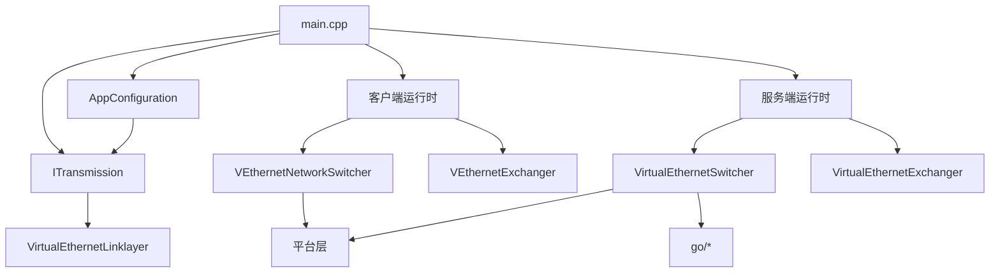

# 系统架构

[English Version](ARCHITECTURE.md)

## 范围

本文是 OPENPPP2 的顶层架构地图，说明仓库如何分层、共享核心和宿主后果如何分开。

锚点：

- `main.cpp`
- `ppp/configurations/AppConfiguration.*`
- `ppp/transmissions/*`
- `ppp/app/protocol/*`
- `ppp/app/client/*`
- `ppp/app/server/*`
- 平台目录

## 核心思想

OPENPPP2 是一套虚拟以太网基础设施运行时。它由共享协议核心和宿主特化后果组成。

## 核心布局

## 共享核心与宿主后果

最重要的分割是：

| 区域 | 责任 |
|---|---|
| 共享核心 | 配置、传输、握手、帧化、链路动作 |
| 宿主后果 | 适配器、路由、DNS、防火墙、平台 IPv6 与 socket 行为 |

共享核心可以复用。宿主后果不能假定跨系统一致。

## 共享核心

共享核心负责 tunnel semantics：

- `AppConfiguration` 决定运行形态
- `ITransmission` 负责承载、握手、帧保护和密钥状态
- `VirtualEthernetLinklayer` 负责隧道动作词汇
- client/server exchanger 负责会话级行为

## 宿主后果

平台层负责本地操作系统上的实际副作用：

- 虚拟网卡
- 路由表变更
- DNS 变更
- socket 保护
- 平台特化 IPv6

## 运行时入口

`main.cpp` 是 C++ 入口与进程协调器。流程是：

1. 解析参数
2. 加载配置
3. 规范化配置
4. 选择角色
5. 准备宿主环境
6. 启动 client 或 server
7. 运行维护 tick loop
8. 输出状态
9. 清理退出

## 对象所有权

| 层级 | 所有者 |
|---|---|
| 进程 | `PppApplication` |
| 环境 | `VEthernetNetworkSwitcher` 或 `VirtualEthernetSwitcher` |
| 会话 | `VEthernetExchanger` 或 `VirtualEthernetExchanger` |
| 连接 | `ITransmission` |

## 角色非对称

client 和 server 不是对称的：

- client：宿主集成、路由、DNS、代理、映射、可选 static 和 mux
- server：监听、会话交换、转发、映射、IPv6、可选后端集成

## 配置即架构

`AppConfiguration` 是架构组件，不只是解析器。它决定哪些传输启用、哪些监听器打开、密钥怎么用，以及 client/server 策略如何落地。

## 传输层与协议层

| 层 | 负责什么 |
|---|---|
| Transmission | 承载选择、握手、帧保护、密钥状态 |
| Protocol | 会话语义、opcode 语义、隧道动作语义 |

## 相关文档

- `CLIENT_ARCHITECTURE_CN.md`
- `SERVER_ARCHITECTURE_CN.md`
- `TUNNEL_DESIGN_CN.md`
- `STARTUP_AND_LIFECYCLE_CN.md`
