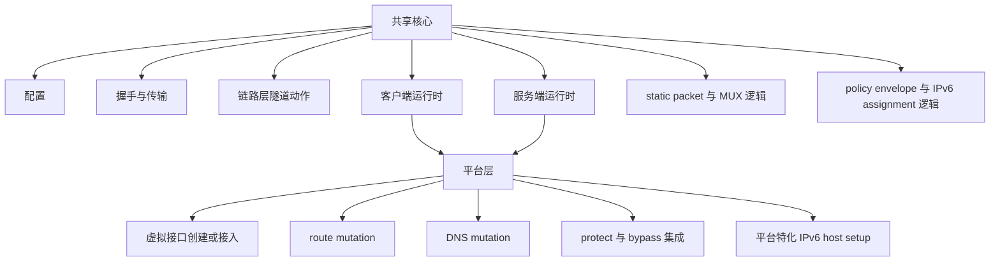
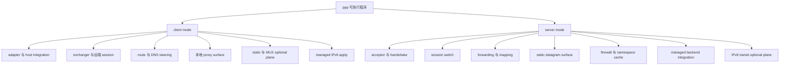
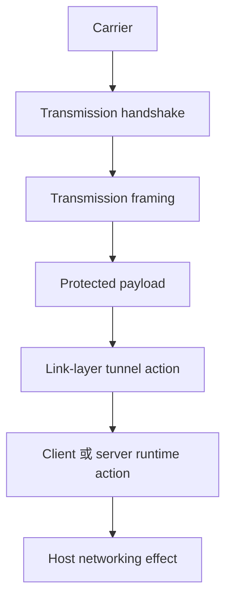
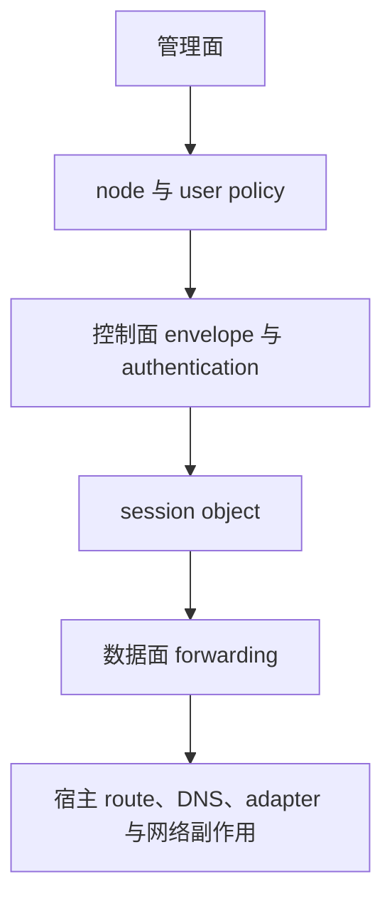

# 系统架构

[English Version](ARCHITECTURE.md)

## 范围

本文是 OPENPPP2 的顶层架构地图。它之所以放在 transport、client、server、routing、platform、deployment、operations 等深度文档之后来重写，是因为它的任务和那些文档不同。

本文不试图把每一个机制再详细重讲一遍。它的任务是解释：整个系统是如何分层的，主要子系统之间如何关联，哪些边界最重要，以及如果不想把整个工程粗暴理解成“一个 VPN”，应该如何导航源码。

本文主要基于以下代码结构：

- `main.cpp`
- `ppp/configurations/AppConfiguration.*`
- `ppp/transmissions/*`
- `ppp/app/protocol/*`
- `ppp/app/client/*`
- `ppp/app/server/*`
- `windows/*`
- `linux/*`
- `darwin/*`
- `android/*`
- `go/*`

## 最短但尽量准确的描述

OPENPPP2 是一套跨平台网络运行时，围绕以下结构构建：

- 一个名为 `ppp` 的 C++ 主可执行程序
- 一套共享的 protected transport 与 tunnel protocol core
- 一套 client runtime
- 一套 server runtime
- 每个平台各自的 host integration layer
- 一个可选的 Go management backend

它不能只被描述成 VPN client、VPN server、proxy 或 custom transport 中的某一种。源码表明，它在不同层里同时包含了这些概念。

如果必须用一句话概括，最不容易误导的表达是：

OPENPPP2 是一套网络基础设施运行时，组合了 protected transport、虚拟接口集成、隧道内控制与转发逻辑、route 与 DNS steering、reverse service mapping、可选 static packet 与 MUX 路径、平台特化宿主网络变更，以及可选外部管理后端。

## 最重要的架构分割

整个仓库里，最重要的架构分割是：

- 共享协议与运行时核心
- 平台集成层

共享核心拥有 tunnel semantics。

平台层拥有 host consequences。

tunnel semantics 包括：

- 配置规范化
- handshake
- framing
- ciphertext state 构造
- tunnel control actions
- session object
- NAT、mapping、static packet、MUX、IPv6 assignment 逻辑

host consequences 包括：

- 创建或接入虚拟接口
- 修改 route table
- 修改 DNS 行为
- protect socket，避免 recursion
- 执行平台特化 IPv6 interface 与 transit 设置

这个分割非常重要，因为它解释了为什么这个项目一方面是 cross-platform 的，另一方面又在很多地方高度依赖平台实现。

## 运行时从一个统一入口开始

`main.cpp` 是整个 C++ 侧的架构根。

这件事比看起来更重要。系统并没有把主要生命周期拆散到许多二进制或许多半独立启动器里，而是集中在一个统一入口里完成顶层 orchestration。

在启动时，`main.cpp` 负责：

- 加载配置
- 选择角色
- 解析宿主相关运行时参数
- 准备 client 或 server 环境
- 创建对应 switcher 对象
- 启动周期性 tick loop
- 输出运行状态
- 协调 shutdown 与 restart

从架构上说，这意味着 OPENPPP2 不是一堆松散工具的集合，而是一个统一 orchestrated runtime，在内部再按 role 分支。

## 一个二进制、两个主角色、若干可选平面

C++ 主二进制有两个主角色：

- client mode
- server mode

但每个角色本身都不是单一行为，而是多个 plane 的组合。

client 可能包含：

- 虚拟接口集成
- route steering
- DNS steering
- 本地 HTTP proxy
- 本地 SOCKS proxy
- static packet path 参与
- MUX 子链路参与
- reverse mapping 注册
- managed IPv6 apply 与 rollback

server 可能包含：

- 多种 stream listener
- static datagram listener
- firewall policy
- namespace cache
- reverse mapping exposure
- 可选 managed backend connectivity
- 可选 IPv6 transit 与 neighbor proxy

所以，角色只是第一层切分；第二层切分是当前到底启用了哪些 plane。

## 配置对象本身就是架构组件

`AppConfiguration` 不是一个普通“配置文件解析器”，而是整个系统中非常核心的架构组件。

它定义了：

- 整个 runtime 的配置词汇表
- runtime 在未指定时的默认行为
- 文本配置如何被规范化为可运行的 operational intent

这很重要，因为很多系统把配置文档当成附属内容。而在 OPENPPP2 中，配置本身就是架构的一部分。它不仅仅选择数值，也选择重大运行时行为：

- 开哪些 listener
- WS/WSS 是否存在
- mapping 是否存在
- IPv6 mode 是 none、NAT66 还是 GUA
- static mode 和 MUX 是否存在
- DNS redirect 与 cache 是否存在
- 是否需要 management backend

这也是为什么配置文档和架构文档必须配套阅读。

## Protected Transmission 层与 Tunnel Action 层是分开的

整个仓库里，一个非常重要的概念边界是：

- protected transmission
- tunnel action protocol

protected transmission 主要位于 `ppp/transmissions/`。

它关心：

- carrier transport 选择，如 TCP、WS、WSS
- handshake sequencing
- framing family
- protocol/transport cipher state
- payload transform 与 protected packet boundary

tunnel action layer 主要位于 `ppp/app/protocol/`。

它关心：

- 一个 packet 对 overlay 来说意味着什么
- 一个消息到底是 NAT、SENDTO、ECHO、INFO、CONNECT、static、MUX 还是 mapping 相关动作
- client/server 运行时对象该如何响应这些动作

这个边界非常关键。transport layer 不是整个协议，tunnel action layer 也不等同于 carrier。若把二者笼统压成一个“协议”，会误读大量设计。

## Tunnel Action Layer 是 client 与 server 的共同语言

`VirtualEthernetLinklayer`、`VirtualEthernetInformation`、`VirtualEthernetPacket` 等协议类型定义了 client 与 server 共用的一套消息语言。

这套语言包括：

- information exchange
- keepalive
- NAT 与 LAN 处理
- TCP connect、push、connect-ok、disconnect
- UDP sendto 风格转发
- static packet 处理
- MUX 建立与子连接
- FRP-like mapping 注册与转发

但“共用语言”只表示 vocabulary 共享，不表示双方行为完全对称。client 和 server 都包含明确的 defensive reject path，会拒绝那些不应从该方向打来的动作。

从架构上说，这意味着 OPENPPP2 使用的是**共享消息词汇，但非对称角色模型**。client 和 server 并不是两个完全等价的 peer，即使它们识别相同的消息名。

## Client 架构边界

client 内部有一个特别重要的边界：

- `VEthernetNetworkSwitcher`
- `VEthernetExchanger`

switcher 拥有本地主机网络语义。

exchanger 拥有远端 session 语义。

这不是命名偏好，而是整个项目中最清晰的设计决策之一。

switcher 拥有：

- 虚拟接口
- 底层 NIC 关系
- route table 与 bypass policy
- DNS rule 与 DNS redirection 行为
- 本地 proxy surface
- 本地 packet 的 admission 与 emission
- managed IPv6 下发到宿主系统的 apply 行为

exchanger 拥有：

- transmission open 与 reconnect loop
- 到 server 的 handshake
- keepalive 与 liveness
- static path negotiation
- MUX plane 行为
- mapping 注册
- 以 source endpoint 为键的 datagram 状态

从架构上说，client 不是“socket code 加一些 route”，而是由 host-facing 一半和 remote-session-facing 一半组成的宿主边缘运行时。

## Server 架构边界

server 内部也有类似但不完全相同的分割：

- `VirtualEthernetSwitcher`
- `VirtualEthernetExchanger`

switcher 是 node-wide 的。

exchanger 是 per-session 的。

switcher 拥有：

- listener
- accepted connection 分类
- session map
- connection map
- firewall policy
- namespace cache
- 可选 managed backend client
- 可选 static datagram socket
- 可选 IPv6 transit state
- logger 与 node-wide statistics

exchanger 拥有：

- 一个 client session
- per-session forwarding state
- per-session mapping port
- per-session datagram port
- per-session MUX 与 static allocation state
- 来自该 client 的 action handler

从架构上说，server 是一个 session switch，而不只是 packet forwarder。它的顶层对象会把 accepted connection 分成：

- main session establishment
- auxiliary connection handling

这也是为什么这套代码读起来更像 network node，而不是一个简单 daemon。

## 数据面、控制面与管理面

如果把整个仓库再进一步抽象，最有帮助的做法是分成三种 plane。

### 数据面

真正承载转发流量的地方。

例如：

- TUN/TAP packet I/O
- NAT packet forwarding
- TCP relay payload flow
- UDP datagram payload flow
- static packet payload flow
- IPv6 transit payload flow

### 控制面

建立与维持 session 的地方。

例如：

- handshake
- information envelope exchange
- keepalive
- mapping registration
- MUX connection setup
- requested IPv6 configuration 与 assigned IPv6 response

### 管理面

这是可选且外置的一层。

例如：

- Go backend
- Redis 与 MySQL state
- node authentication 与 policy lookup

控制面即使没有管理面也存在；管理面是附着在其上的可选外部依赖。

## 平台层不是一个薄薄的可移植性外壳

平台目录并不是装饰性的 portability shell，而是真正承载 host-network reality 的地方。

Windows 提供：

- Wintun 或 TAP 集成
- 基于 WMI 的 adapter 配置
- 原生 route 与 DNS helper
- Windows 专用 proxy 与桌面 client 集成

Linux 提供：

- tun 集成
- route 与 DNS helper
- socket protect 支持
- 当前最完整的 server-side IPv6 transit 实现

Darwin 提供：

- utun 集成
- route socket 使用
- Darwin 专用 IPv6 apply/restore 逻辑

Android 提供：

- shared-library embedding
- 外部 VPN TUN fd 接入
- 基于 JNI 的 protect 集成

正因为平台层是真实的，项目才能一边诚实地说自己是跨平台的，一边又不假装各平台行为完全一致。

## 可选 Go Backend 在架构上是独立的一层

`go/` 下的 Go 服务并不是 C++ runtime 的“对等替代品”，而是一个可选 management subsystem。

它拥有的关注点包括：

- 持久化 node metadata
- user policy 与 quota state
- Redis 协调
- MySQL 持久化
- WebSocket 与 HTTP 管理接口

即使 backend 开启，C++ server 依然拥有 data plane。

这个区分在架构上非常重要，因为它能避免一个常见误解：OPENPPP2 不是一个被拆成 C++ 和 Go 两半的单体系统，而是一个 **C++ data-plane runtime + 可选 Go management plane** 的组合。

## 建议的架构阅读顺序

对于新读者，最有效的阅读顺序是：

1. `main.cpp`
2. `ppp/configurations/AppConfiguration.*`
3. `ppp/transmissions/*`
4. `ppp/app/protocol/*`
5. `ppp/app/client/*`
6. `ppp/app/server/*`
7. 目标平台对应的目录
8. 仅当 managed deployment 重要时，再看 `go/*`

这个顺序对应的是：从外到内，从 shared core 到 role-specific runtime，再到 host-specific realization，最后才到 optional management。

## 修改代码时最值得保留的架构边界

有几条边界值得尽量保留，因为它们在代码中承载了真实架构重量。

不要把 transport concern 和 tunnel action concern 混在一起。

不要把 host route/DNS mutation 下沉进 exchanger/session object。

不要因为 client 与 server 共享消息词汇，就把它们当作对称 peer。

不要把 Linux-specific 的 server IPv6 data-plane 行为写成“所有平台都一样”。

不要把 Go backend 和 primary data plane 混为一谈。

这些边界已经在代码里存在。文档若明确说出来，架构就更不容易被误读。

## 架构结论

OPENPPP2 在架构上有意思，正是因为它并不只解决一个问题。

它在同一个系统里同时处理了：

- protected multi-carrier transport
- role-aware tunnel action protocol
- client-side host integration，包括 route、DNS、adapter、proxy
- server-side session switching、forwarding、publishing
- 可选 static 与 multiplexed 辅助路径
- 可选 managed policy integration
- 平台特化宿主网络实现

这就是为什么它比“小型 VPN 工具”更大、更密，也正因为如此，它支持的运行形态和部署形态远超单一用途的 tunnel daemon。

## 相关文档

- [`ENGINEERING_CONCEPTS_CN.md`](ENGINEERING_CONCEPTS_CN.md)
- [`TRANSMISSION_CN.md`](TRANSMISSION_CN.md)
- [`HANDSHAKE_SEQUENCE_CN.md`](HANDSHAKE_SEQUENCE_CN.md)
- [`PACKET_FORMATS_CN.md`](PACKET_FORMATS_CN.md)
- [`CLIENT_ARCHITECTURE_CN.md`](CLIENT_ARCHITECTURE_CN.md)
- [`SERVER_ARCHITECTURE_CN.md`](SERVER_ARCHITECTURE_CN.md)
- [`ROUTING_AND_DNS_CN.md`](ROUTING_AND_DNS_CN.md)
- [`PLATFORMS_CN.md`](PLATFORMS_CN.md)
- [`DEPLOYMENT_CN.md`](DEPLOYMENT_CN.md)
- [`OPERATIONS_CN.md`](OPERATIONS_CN.md)
- [`MANAGEMENT_BACKEND_CN.md`](MANAGEMENT_BACKEND_CN.md)
