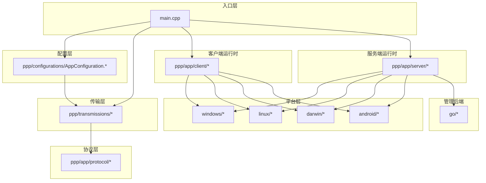
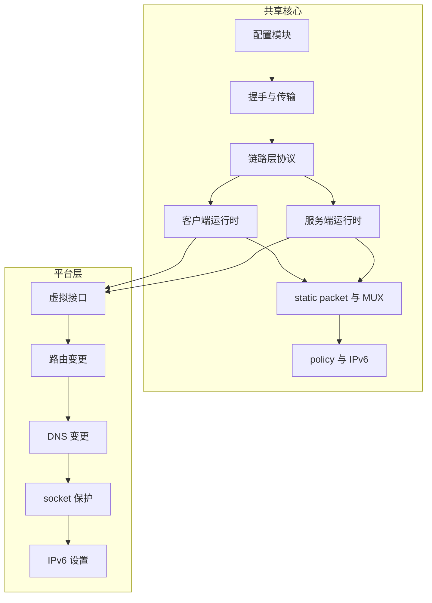
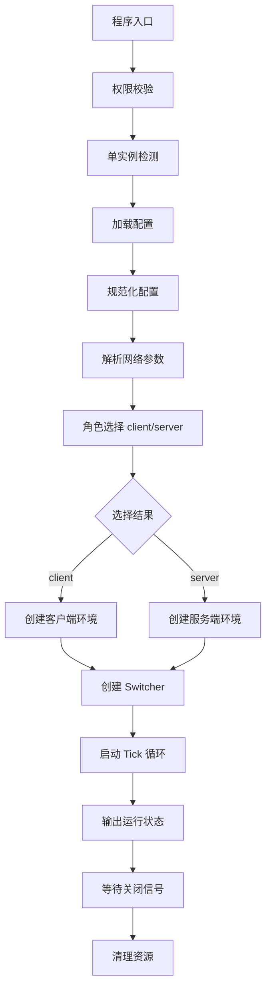
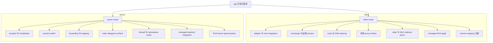
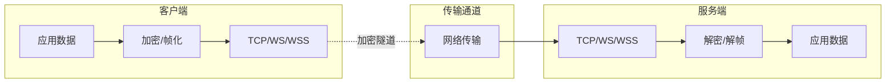
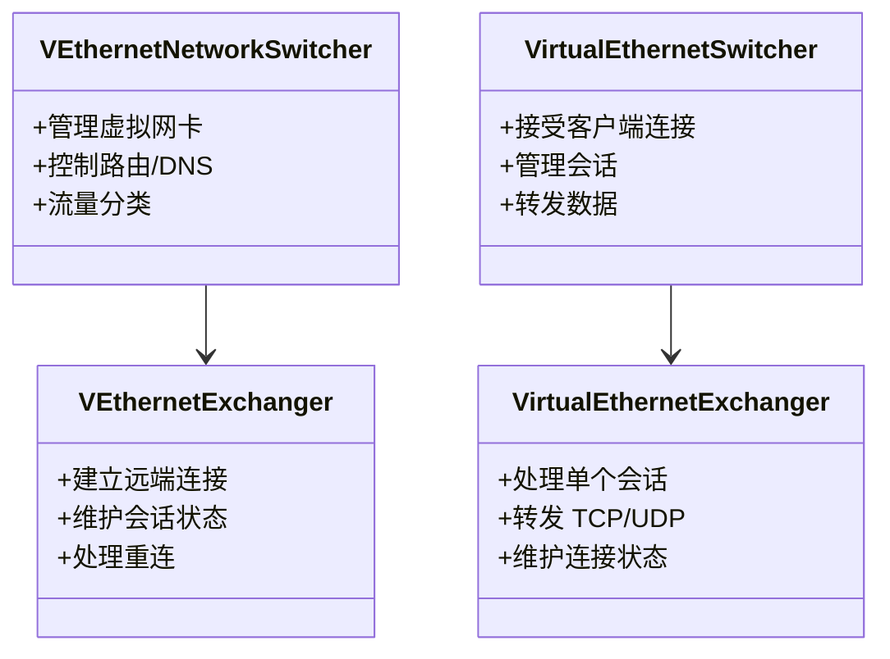
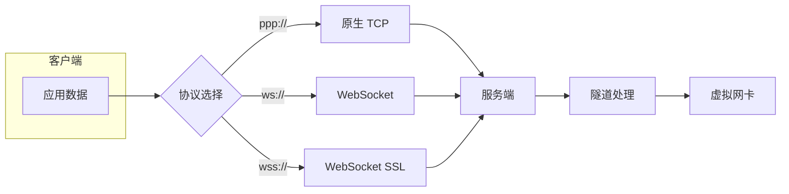
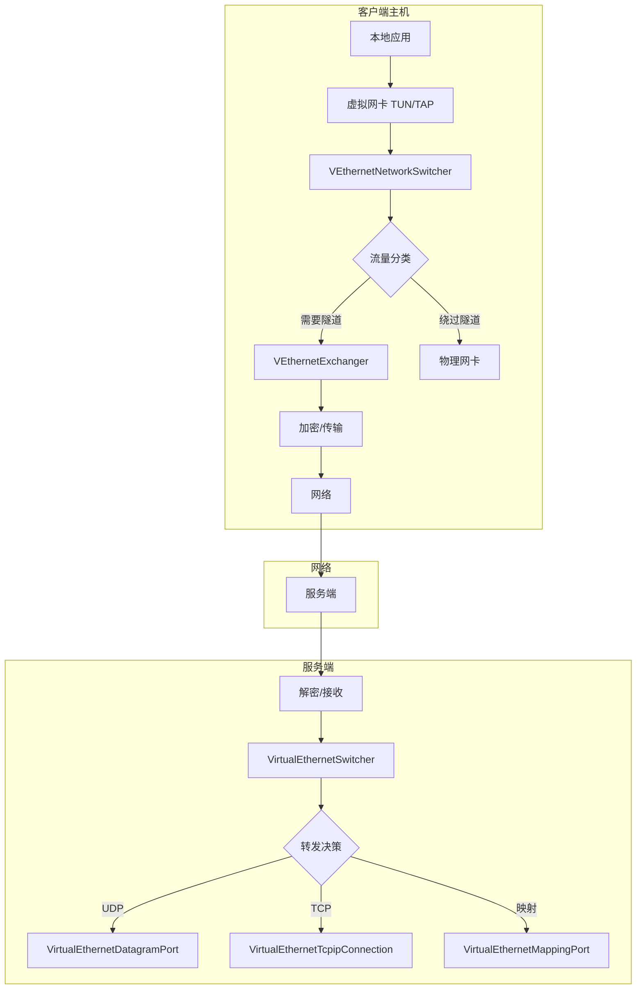
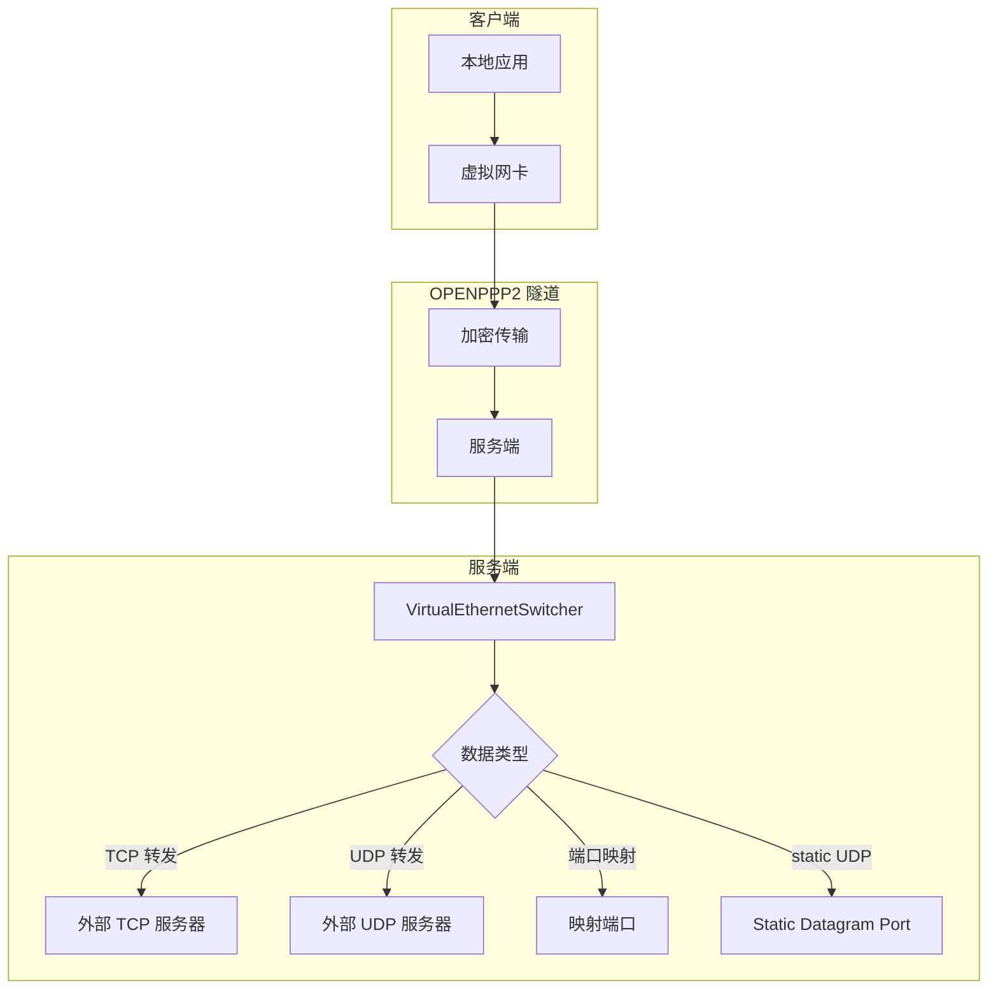
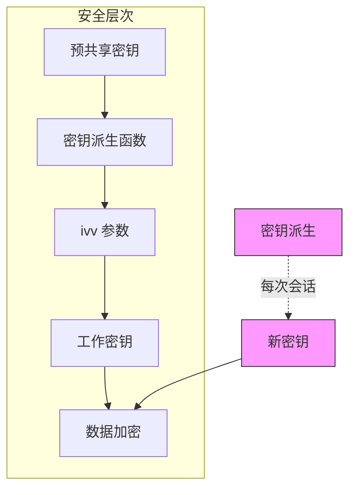

# 系统架构

[English Version](ARCHITECTURE.md)

## 文档范围

本文档是 OPENPPP2 的顶层架构地图，旨在为读者提供一个全面的系统架构视图。它之所以放在 transport、client、server、routing、platform、deployment、operations 等深度技术文档之后，是因为它的任务与那些文档不同。本文不试图把每一个机制再详细重讲一遍，而是帮助读者理解：整个系统是如何分层的，主要子系统之间如何关联，哪些边界最重要，以及如何正确导航源码而不将其简单理解为“一个 VPN”。

OPENPPP2 定位为虚拟以太网基础设施产品，这与大多数终端 VPN 产品有本质区别。它不仅仅提供加密隧道，而是构建了一套完整的网络基础设施运行时，涵盖虚拟接口集成、隧道内控制与转发逻辑、路由与 DNS  steering、反向服务映射、可选 static packet 与 MUX 路径、平台特化宿主网络变更，以及可选外部管理后端。

## 核心源码结构

本文档主要基于以下代码结构进行描述：

## 最短但尽量准确的描述

OPENPPP2 是一套跨平台网络运行时，围绕以下结构构建：

| 组件 | 说明 |
|------|------|
| **ppp 可执行程序** | C++ 主程序，提供 client 和 server 两种运行模式 |
| **共享核心** | protected transport 与 tunnel protocol core，包含协议处理、加密、帧化 |
| **客户端运行时** | 虚拟接口集成、路由控制、DNS  steering、代理服务 |
| **服务端运行时** | 连接接受、会话管理、转发与映射、策略消费 |
| **平台集成层** | Windows、Linux、macOS、Android 各自的宿主网络变更 |
| **管理后端** | 可选的 Go 语言实现的管理后台 |

从架构层面看，OPENPPP2 不能被简单描述为 VPN client、VPN server、proxy 或 custom transport 中的某一种。源码表明，它在不同层里同时包含了这些概念，是一个综合性的网络基础设施运行时。

## 最重要的架构分割

整个仓库里，最重要的架构分割是 **共享协议与运行时核心** 和 **平台集成层** 的分离。

### 共享核心（tunnel semantics）

共享核心拥有 tunnel semantics，负责网络协议的处理和转发，主要包括：

| 功能模块 | 说明 | 关键源码 |
|----------|------|----------|
| 配置规范化 | 将 JSON 配置和命令行参数规范化为运行时模型 | `AppConfiguration.*` |
| 握手与传输 | 建立受保护的传输连接，完成密钥交换 | `ITransmission.*` |
| 链路层动作 | 隧道内的控制信令与数据转发协议 | `VirtualEthernetLinklayer.*` |
| 客户端运行时 | 虚拟网卡管理、路由 DNS 控制、代理服务 | `VEthernetNetworkSwitcher.*` |
| 服务端运行时 | 连接接受、会话交换、转发映射 | `VirtualEthernetSwitcher.*` |
| static packet 与 MUX | UDP static 路径和多路复用逻辑 | `VirtualEthernetDatagramPort*`, `vmux*` |
| policy envelope | 管理后端策略下发与 IPv6 分配 | `VirtualEthernetInformation.*` |

### 平台层（host consequences）

平台层拥有 host consequences，负责与本地操作系统交互，主要包括：

| 功能模块 | 说明 | 关键源码 |
|----------|------|----------|
| 虚拟接口创建 | 创建或接入虚拟网卡 | `windows/tap.*`, `linux/tun.*` |
| 路由变更 | 修改系统路由表 | 各平台路由操作代码 |
| DNS 变更 | 修改系统 DNS 配置 | 各平台 DNS 操作代码 |
| socket 保护 | 避免流量递归进入隧道 | `protect` 与 `bypass` 逻辑 |
| IPv6 设置 | 平台特化 IPv6 接口配置 | 各平台 IPv6 代码 |

这个分割非常重要，它解释了为什么 OPENPPP2 一方面是跨平台的，另一方面在很多地方高度依赖平台实现。

## 运行时入口与生命周期

`main.cpp` 是整个 C++ 侧的架构根。系统没有把主要生命周期拆散到许多二进制或半独立启动器里，而是集中在一个统一入口完成顶层 orchestration。

### 启动流水线

在启动时，`main.cpp` 负责以下步骤：

### 主要运行时对象

OPENPPP2 的运行时对象按照生命周期和职责划分：

| 对象层级 | 负责内容 | 关键类型 |
|----------|----------|----------|
| 进程级 | 进程生命周期管理 | `PppApplication` |
| 环境级 | 虚拟网卡/监听器生命周期 | `*Switcher` |
| 会话级 | 远端连接生命周期 | `*Exchanger` |
| 连接级 | 传输连接生命周期 | `ITransmission` |

这种分层使得代码结构清晰，职责边界明确。

## 一个二进制、两个主角色、若干可选平面

C++ 主二进制有两个主角色：**client mode** 和 **server mode**。但每个角色本身都不是单一行为，而是多个 plane 的组合。

### 客户端平面

client 模式可能包含以下平面：

| 平面 | 说明 | 启用条件 |
|------|------|----------|
| adapter 与 host integration | 虚拟网卡创建与管理 | 默认启用 |
| exchanger 与远端 session | 与服务端的连接与会话 | 默认启用 |
| route 与 DNS steering | 路由控制和 DNS 策略 | 默认启用 |
| 本地 proxy surface | HTTP/SOCKS 代理服务 | 配置启用 |
| static 与 MUX optional plane | UDP static 路径或多路复用 | 配置启用 |
| managed IPv6 apply | 接收并应用服务端 IPv6 配置 | 配置启用 |
| reverse mapping 注册 | 向服务端注册反向映射 | 配置启用 |

### 服务端平面

server 模式可能包含以下平面：

| 平面 | 说明 | 启用条件 |
|------|------|----------|
| acceptor 与 handshake | 接受并处理客户端连接 | 默认启用 |
| session switch | 会话管理与交换 | 默认启用 |
| forwarding 与 mapping | 数据转发与端口映射 | 默认启用 |
| static datagram surface | UDP static 路径服务 | 配置启用 |
| firewall 与 namespace cache | 防火墙规则与命名空间缓存 | 配置启用 |
| managed backend integration | 管理后端连接 | 配置启用 |
| IPv6 transit optional plane | IPv6 转发与邻居代理 | 配置启用 |

## 配置对象作为架构组件

`AppConfiguration` 不仅仅是配置文件解析器，而是整个系统中非常核心的架构组件。它定义了：

- 整个 runtime 的配置词汇表
- runtime 在未指定时的默认行为
- 文本配置如何被规范化为可运行的 operational intent

这很重要，因为很多系统把配置文档当成附属内容。而在 OPENPPP2 中，配置本身就是架构的一部分。它不仅仅选择数值，也选择重大运行时行为：

| 配置项 | 影响的行为 |
|--------|------------|
| `server.listen.*` | 开哪些 listener |
| `server.backend` | 是否需要管理后端 |
| `ipv6.mode` | IPv6 模式：none、NAT66、GUA |
| `static.*` | 是否启用 static 模式 |
| `mux.*` | 是否启用多路复用 |
| `dns.*` | DNS 重定向与缓存 |
| `key.*` | 加密密钥与算法选择 |

## Protected Transmission 层与 Tunnel Action 层

整个仓库里，一个非常重要的概念边界是 **protected transmission** 和 **tunnel action protocol** 的分离。

### Protected Transmission 层

protected transmission 主要位于 `ppp/transmissions/`，关心：

| 功能 | 说明 |
|------|------|
| carrier transport 选择 | TCP、WebSocket、WSS 等 |
| handshake sequencing | 握手顺序和密钥交换 |
| 密钥派生 | 基于 `ivv` 的工作密钥重建 |
| 帧化与加密 | 数据的加密封装和解封装 |
| 读写流水线 | 异步 IO 操作 |

### Tunnel Action 层

tunnel action protocol 主要位于 `ppp/app/protocol/VirtualEthernetLinklayer.*`，关心：

| 功能 | 说明 |
|------|------|
| 会话信息 | INFO 消息传递 |
| 保活 | KEEPALIVED 消息 |
| 虚拟子网转发 | LAN、NAT 消息 |
| UDP 中继 | SENDTO、ECHO 消息 |
| TCP 中继 | SYN、SYNOK、PSH、FIN 消息 |
| 反向映射 | MAPPING 消息 |
| static 路径协商 | STATIC 消息 |

这两种协议的分离使得 OPENPPP2 能够灵活支持多种传输载体，同时保持统一的隧道控制语义。

## 核心类型及其关系

### 客户端核心类型

| 类型 | 职责 | 关键文件 |
|------|------|----------|
| `VEthernetNetworkSwitcher` | 宿主机网络环境管理 | `VEthernetNetworkSwitcher.*` |
| `VEthernetExchanger` | 远端会话管理 | `VEthernetExchanger.*` |
| `VEthernetNetworkTcpipStack` | TCP/IP 协议栈 | `VEthernetNetworkTcpipStack.*` |
| `VEthernetNetworkTcpipConnection` | TCP 连接管理 | `VEthernetNetworkTcpipConnection.*` |
| `VEthernetDatagramPort` | UDP 数据报端口 | `VEthernetDatagramPort.*` |
| `VEthernetHttpProxySwitcher` | HTTP 代理 | `VEthernetHttpProxySwitcher.*` |
| `VEthernetSocksProxySwitcher` | SOCKS 代理 | `VEthernetSocksProxySwitcher.*` |

### 服务端核心类型

| 类型 | 职责 | 关键文件 |
|------|------|----------|
| `VirtualEthernetSwitcher` | 服务端环境管理 | `VirtualEthernetSwitcher.*` |
| `VirtualEthernetExchanger` | 会话交换管理 | `VirtualEthernetExchanger.*` |
| `VirtualEthernetNetworkTcpipConnection` | TCP 连接管理 | `VirtualEthernetNetworkTcpipConnection.*` |
| `VirtualEthernetManagedServer` | 管理服务端 | `VirtualEthernetManagedServer.*` |
| `VirtualEthernetDatagramPort` | UDP 端口管理 | `VirtualEthernetDatagramPort.*` |
| `VirtualEthernetDatagramPortStatic` | static UDP 端口 | `VirtualEthernetDatagramPortStatic.*` |
| `VirtualEthernetNamespaceCache` | 命名空间缓存 | `VirtualEthernetNamespaceCache.*` |
| `VirtualEthernetMappingPort` | 映射端口 | `VirtualEthernetMappingPort.*` |

## 连接协议与数据平面

OPENPPP2 支持多种连接协议，形成不同的数据平面：

### 原生 TCP 直连（ppp://）

| 特性 | 说明 |
|------|------|
| 协议前缀 | `ppp://` |
| 传输方式 | 原生 TCP 直连 |
| 适用场景 | 低延迟、高吞吐量直接连接 |
| 端口 | 默认 20000 |

### WebSocket 明文（ws://）

| 特性 | 说明 |
|------|------|
| 协议前缀 | `ws://` |
| 传输方式 | WebSocket 明文 |
| 适用场景 | CDN 转发、HTTP 代理环境 |
| 端口 | 默认 80 |

### WebSocket SSL（wss://）

| 特性 | 说明 |
|------|------|
| 协议前缀 | `wss://` |
| 传输方式 | SSL 加密 WebSocket |
| 适用场景 | CDN 转发、HTTPS 代理环境 |
| 端口 | 默认 443 |

## 数据流向架构

### 客户端数据流向

### 服务端数据流向

## 安全架构边界

OPENPPP2 的安全模型是多层组成的，需要明确信任边界：

### 信任边界

| 边界 | 位置 | 信任内容 |
|------|------|----------|
| 客户端主机 | 本地运行环境 | 操作系统、网络栈、路由配置 |
| 服务端主机 | 服务端运行环境 | 操作系统、网络栈、防火墙 |
| 传输网络 | 客户端与服务端之间 | 网络运营商、ISP、云服务商 |
| 管理后端 | 可选组件 | 策略下发、身份验证 |
| 配置文件 | 本地存储 | 密钥、证书、后端凭证 |

### 安全特性（不含 PFS 声明）

OPENPPP2 实现了连接级工作密钥派生的 **前向安全保证（Forward Security Assurance, FP）**，但需要明确：

- **不是 PFS**：系统没有实现传统意义上的 Perfect Forward Secrecy（PFS）
- **FP 机制**：每次会话使用动态派生的密钥，即使密钥被获取，也无法解密历史流量
- **密钥交换**：基于预共享密钥和会话特定的 `ivv` 参数派生工作密钥
- **密钥轮换**：会话期间可通过握手重新协商密钥

## 平台差异化

OPENPPP2 在不同平台上存在实现差异，主要体现在：

### 虚拟网卡实现

| 平台 | 接口类型 | 驱动方式 |
|------|----------|----------|
| Windows | TAP | Windows TUN/TAP driver |
| Linux | TUN | tun/tap kernel module |
| macOS | utun | utun interface |
| Android | TUN | VPN Service API |

### 网络特性支持

| 特性 | Windows | Linux | macOS | Android |
|------|---------|-------|-------|---------|
| 路由表修改 | ✅ | ✅ | ✅ | ✅ |
| DNS 修改 | ✅ | ✅ | ✅ | ✅ |
| 混杂模式 | N/A | ✅ | ✅ | N/A |
| RAW socket | ✅ | ✅ | ✅ | ✅ |
| IPv6 | ✅ | ✅ | ✅ | ✅ |

## 与传统 VPN 的本质区别

OPENPPP2 与传统 VPN 产品有本质区别：

| 特性 | 传统 VPN | OPENPPP2 |
|------|----------|----------|
| 架构定位 | 终端安全连接 | 虚拟以太网基础设施 |
| 网络模型 | 点对点隧道 | 虚拟交换机/路由器 |
| 功能范围 | 加密通道 | 完整网络栈（路由/DNS/代理/映射） |
| 扩展性 | 有限 | 支持 static、MUX、IPv6 |
| 平台集成 | 插件形式 | 内核级集成 |
| 管理方式 | 集中式 | 分布式+可选管理后端 |

## 源码导航建议

对于想深入阅读 OPENPPP2 源码的读者，建议按以下顺序：

1. **从入口开始**：`main.cpp` 理解整体流程
2. **配置模型**：`AppConfiguration.*` 理解配置系统
3. **传输层**：`ITransmission.*` 理解加密和传输
4. **客户端**：`VEthernetNetworkSwitcher.*` + `VEthernetExchanger.*`
5. **服务端**：`VirtualEthernetSwitcher.*` + `VirtualEthernetExchanger.*`
6. **平台代码**：根据需要选择对应平台目录

## 总结

OPENPPP2 是一个复杂的多层系统，其架构核心在于：

1. **统一入口**：一个二进制支持 client/server 两种角色
2. **核心与平台分离**：共享核心处理协议逻辑，平台层处理 OS 集成
3. **多层平面**：每个角色由多个可选平面组成
4. **配置即架构**：配置对象本身就是架构组件
5. **协议分层**：protected transmission 与 tunnel action 分离
6. **FP 而非 PFS**：实现了前向安全保证但不是传统 PFS

理解这些架构原则对于正确使用和扩展 OPENPPP2 至关重要。

## 相关文档

| 文档 | 说明 |
|------|------|
| [STARTUP_AND_LIFECYCLE_CN.md](STARTUP_AND_LIFECYCLE_CN.md) | 启动、进程所有权与生命周期控制 |
| [CLIENT_ARCHITECTURE_CN.md](CLIENT_ARCHITECTURE_CN.md) | 客户端运行时架构 |
| [SERVER_ARCHITECTURE_CN.md](SERVER_ARCHITECTURE_CN.md) | 服务端运行时架构 |
| [TRANSMISSION_CN.md](TRANSMISSION_CN.md) | 传输层与受保护隧道模型 |
| [SECURITY_CN.md](SECURITY_CN.md) | 安全模型与防御性解读 |
| [CONFIGURATION_CN.md](CONFIGURATION_CN.md) | 配置模型与参数字典 |
