# 系统架构

[English Version](ARCHITECTURE.md)

## 范围

本文是 OPENPPP2 的顶层架构地图，说明仓库如何分层、共享核心和宿主后果如何分开。

本文基于 `main.cpp`、`ppp/configurations/AppConfiguration.*`、`ppp/transmissions/*`、`ppp/app/protocol/*`、`ppp/app/client/*`、`ppp/app/server/*` 和各平台目录来说明系统边界。

---

## 核心思想

OPENPPP2 是一套虚拟以太网基础设施运行时。它由共享协议核心和宿主特化后果组成。

共享核心使用同一套隧道动作词汇（`VirtualEthernetLinklayer`）、同一套受保护传输抽象（`ITransmission`），以及同一套配置模型（`AppConfiguration`）。宿主后果——路由变更、DNS 变更、适配器生命周期、防火墙行为、socket 保护——被委托给平台相关的实现，共享核心通过良好定义的接口驱动它们。

---

## 核心布局

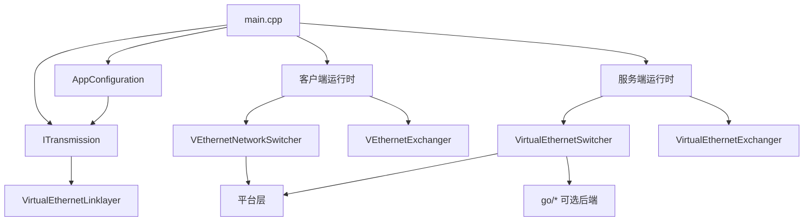

---

## 完整模块依赖图

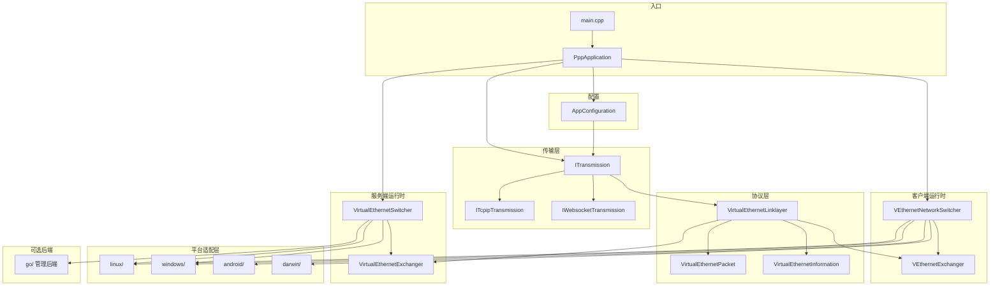

---

## 并发模型

OPENPPP2 使用 Boost.Asio `io_context` 作为事件循环核心，结合 Boost.Coroutine 实现异步-同步混合编程范式。

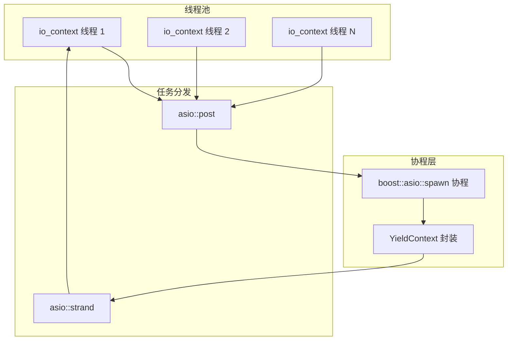

核心并发规则：
- 跨线程对象生命周期通过 `std::shared_ptr` 和 `std::weak_ptr` 管理。
- 跨线程状态标志使用 `std::atomic<bool>` 和 `compare_exchange_strong`。
- IO 线程严禁阻塞；阻塞操作通过 `asio::post` 投递。
- 协程在每个异步边界通过 `YieldContext` 挂起。

---

## 共享核心与宿主后果

最重要的分割是：

| 区域 | 责任 |
|---|---|
| 共享核心 | 配置、传输、握手、帧化、链路动作 |
| 宿主后果 | 适配器、路由、DNS、防火墙、平台 IPv6 与 socket 行为 |

共享核心可以复用。宿主后果不能假定跨系统一致。

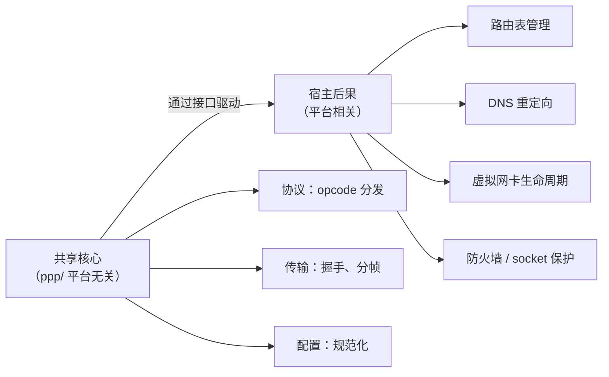

---

## 共享核心

共享核心负责 tunnel semantics：

- `AppConfiguration` 决定运行形态
- `ITransmission` 负责承载、握手、帧保护和密钥状态
- `VirtualEthernetLinklayer` 负责隧道动作词汇
- client/server exchanger 负责会话级行为

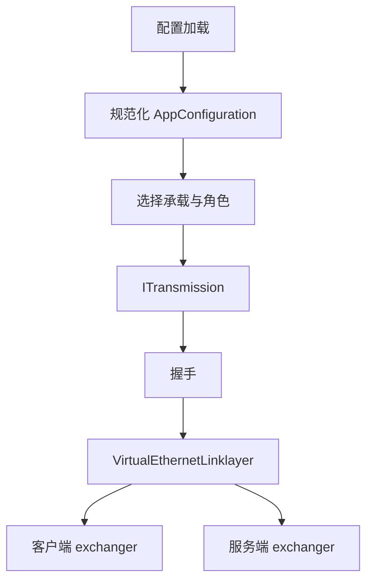

---

## 宿主后果

平台层负责本地操作系统上的实际副作用：

- 虚拟网卡
- 路由表变更
- DNS 变更
- socket 保护
- 平台特化 IPv6

这些都不是"辅助代码"，而是可观测的运行时行为。

### 平台接口切入点

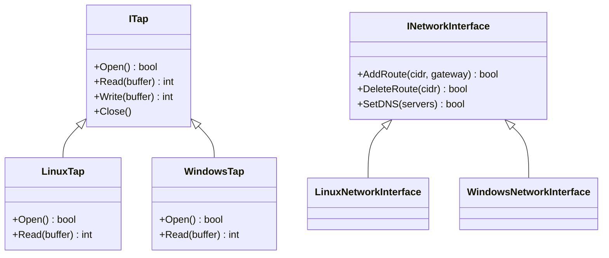

---

## 运行时入口

`main.cpp` 是 C++ 入口与进程协调器。流程是：

1. 解析参数
2. 加载配置
3. 规范化配置
4. 选择角色
5. 准备宿主环境
6. 启动 client 或 server
7. 运行维护 tick loop
8. 输出状态
9. 清理退出

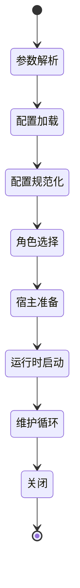

---

## 对象所有权

| 层级 | 所有者 |
|---|---|
| 进程 | `PppApplication` |
| 环境 | `VEthernetNetworkSwitcher` 或 `VirtualEthernetSwitcher` |
| 会话 | `VEthernetExchanger` 或 `VirtualEthernetExchanger` |
| 连接 | `ITransmission` |

### 所有权转移时序

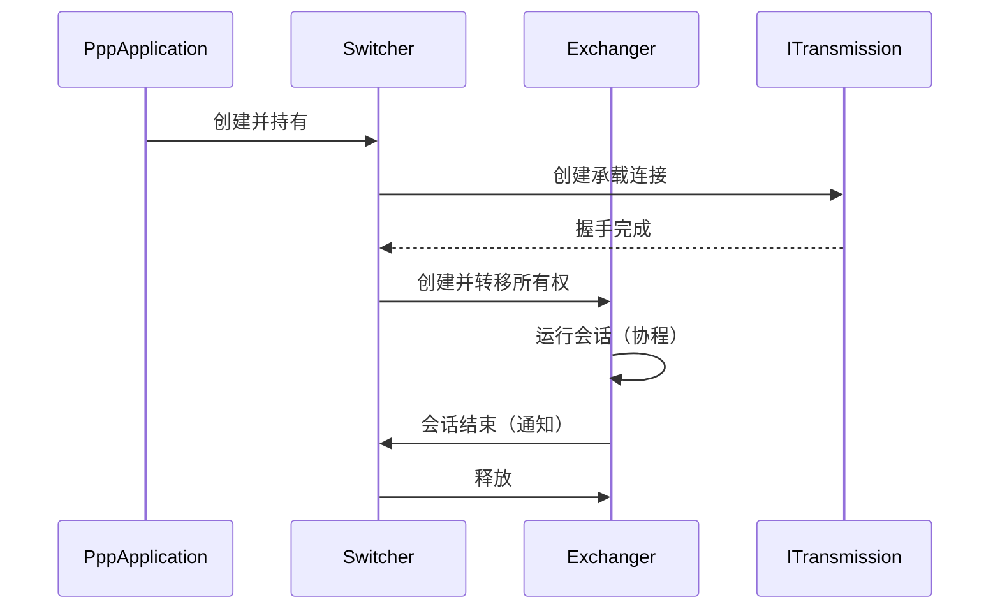

---

## 角色非对称

client 和 server 不是对称的：

- client：宿主集成、路由、DNS、代理、映射、可选 static 和 mux
- server：监听、会话交换、转发、映射、IPv6、可选后端集成

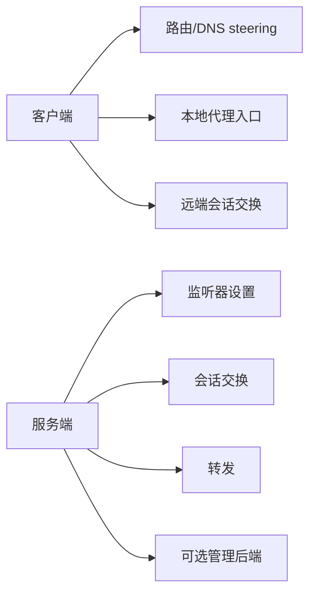

### 操作码方向非对称

| 操作码 | 客户端发起 | 服务端发起 |
|--------|-----------|-----------|
| `SYN` | 是 | 否 |
| `SYNOK` | 否 | 是 |
| `PSH` | 双向 | 双向 |
| `FIN` | 双向 | 双向 |
| `SENDTO` | 是 | 是（响应） |
| `INFO` | 否 | 是 |
| `KEEPALIVED` | 是（echo） | 是（ack） |
| `FRP_ENTRY` | 是 | 否 |
| `FRP_CONNECT` | 否 | 是 |
| `MUX` | 是 | 否 |
| `MUXON` | 否 | 是 |

---

## 配置即架构

`AppConfiguration` 是架构组件，不只是解析器。它决定哪些传输启用、哪些监听器打开、密钥怎么用，以及 client/server 策略如何落地。

### AppConfiguration 关键字段

| 字段 | 效果 |
|------|------|
| `mode` | `client` 或 `server` |
| `key.kf`、`key.kx`、`key.kl`、`key.kh` | 会话密钥参数 |
| `ip`、`mask`、`gw` | 客户端虚拟网络分配 |
| `dns.redirect` | DNS 是否重定向到隧道 |
| `server.node` | 服务器地址和端口 |
| `server.protocol` | `tcp`、`websocket`、`websocket-ssl` |
| `tcp.turbo` | TCP 性能调优 |
| `udp.static.*` | Static UDP 路径配置 |

---

## 传输层与协议层

| 层 | 负责什么 |
|---|---|
| Transmission | 承载选择、握手、帧保护、密钥状态 |
| Protocol | 会话语义、opcode 语义、隧道动作语义 |

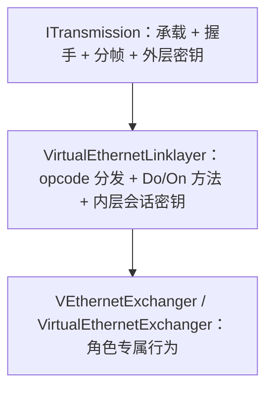

---

## 数据流：客户端到服务端

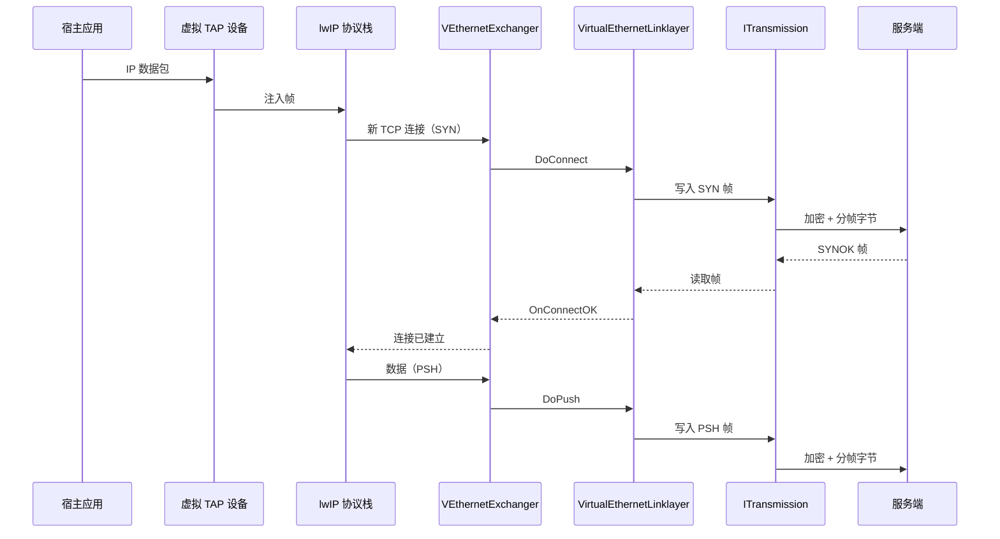

---

## 数据流：服务端到互联网

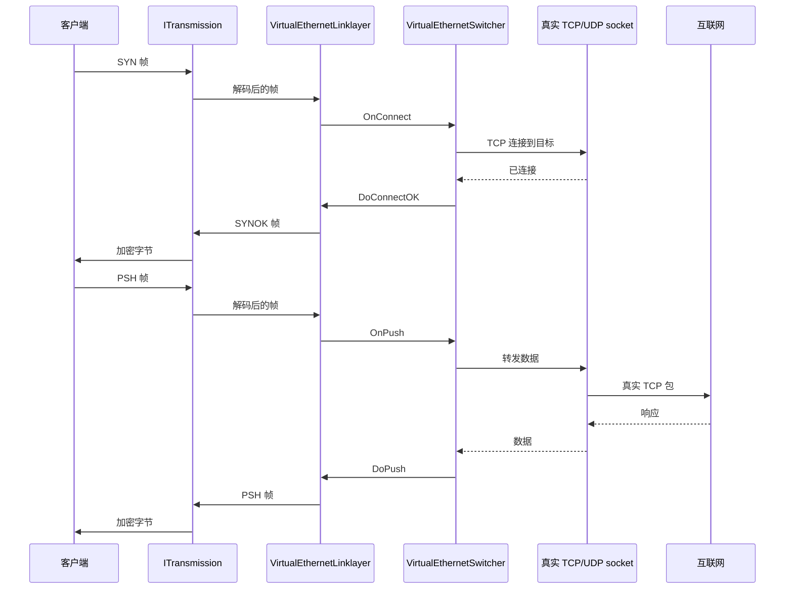

---

## 错误码参考

架构层面的错误码（来自 `ppp/diagnostics/Error.h`）：

| ErrorCode | 说明 |
|-----------|------|
| `ConfigurationInvalid` | AppConfiguration 归一化失败 |
| `RoleConflict` | 同时请求了 client 和 server 角色 |
| `TransmissionHandshakeFailed` | ITransmission 握手未完成 |
| `SessionEstablishFailed` | 链路层 INFO 交换失败 |
| `PlatformSetupFailed` | 宿主适配器 / 路由 / DNS 设置失败 |
| `BackendConnectionFailed` | 可选后端不可达（非致命） |
| `ShutdownTimeout` | 优雅关闭超时 |

---

## 相关文档

- [`CLIENT_ARCHITECTURE_CN.md`](CLIENT_ARCHITECTURE_CN.md)
- [`SERVER_ARCHITECTURE_CN.md`](SERVER_ARCHITECTURE_CN.md)
- [`TUNNEL_DESIGN_CN.md`](TUNNEL_DESIGN_CN.md)
- [`STARTUP_AND_LIFECYCLE_CN.md`](STARTUP_AND_LIFECYCLE_CN.md)
- [`ENGINEERING_CONCEPTS_CN.md`](ENGINEERING_CONCEPTS_CN.md)
- [`CONCURRENCY_MODEL_CN.md`](CONCURRENCY_MODEL_CN.md)
- [`PLATFORMS_CN.md`](PLATFORMS_CN.md)
