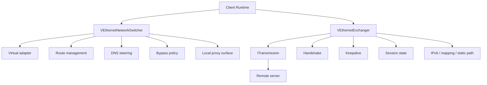
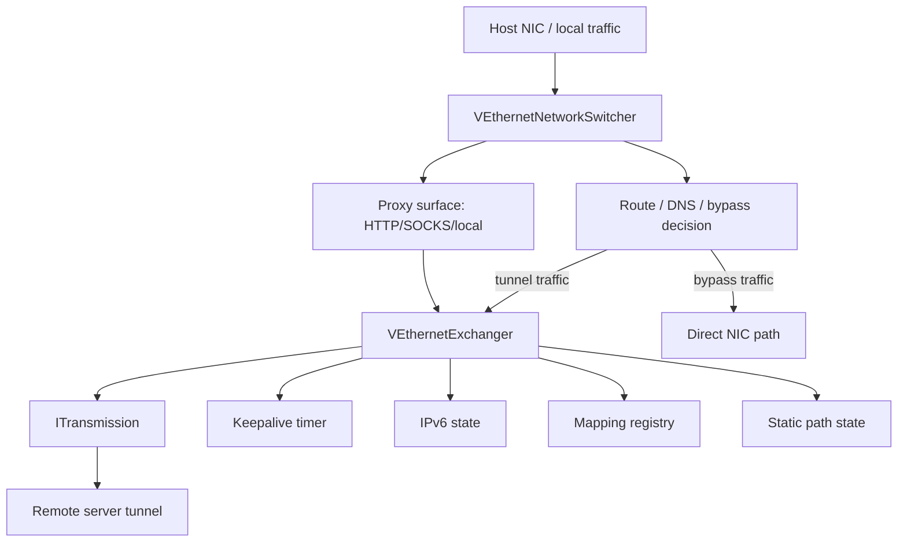
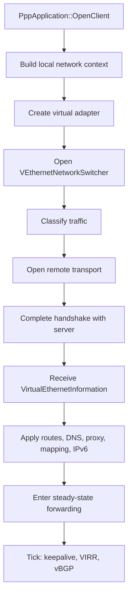
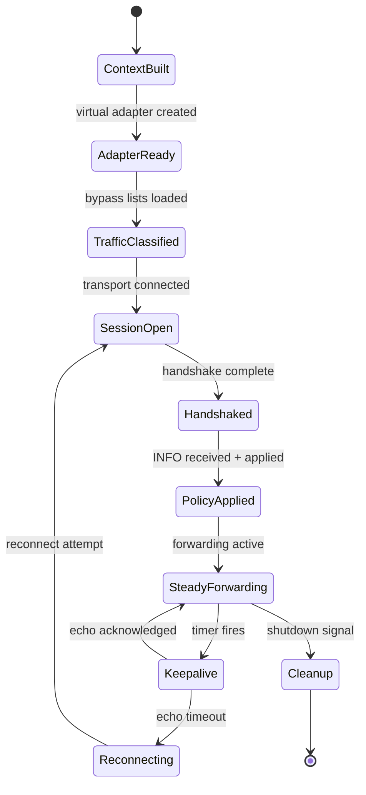
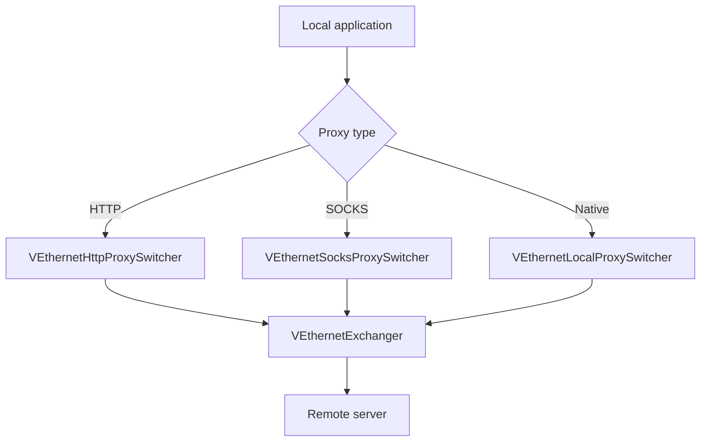
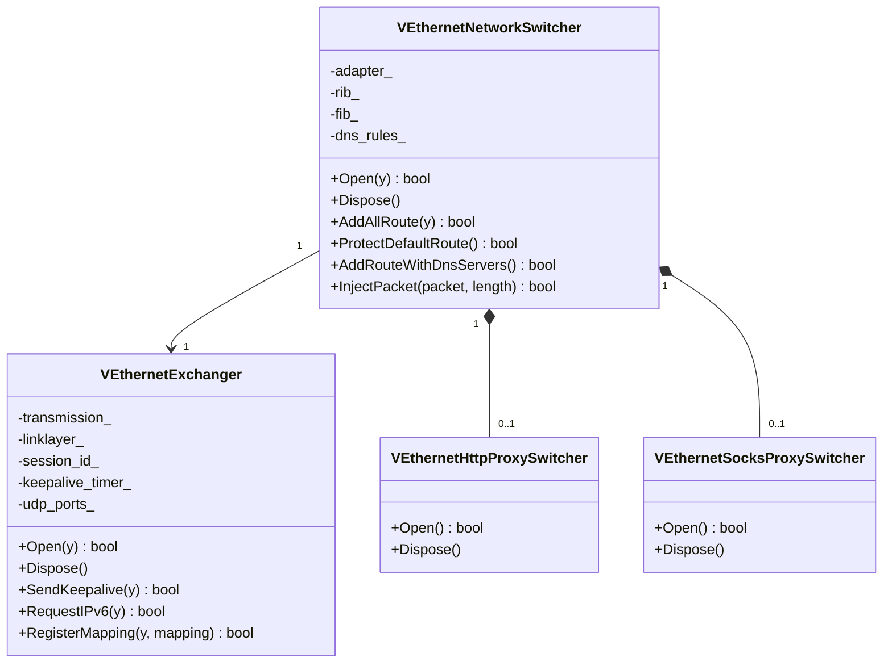
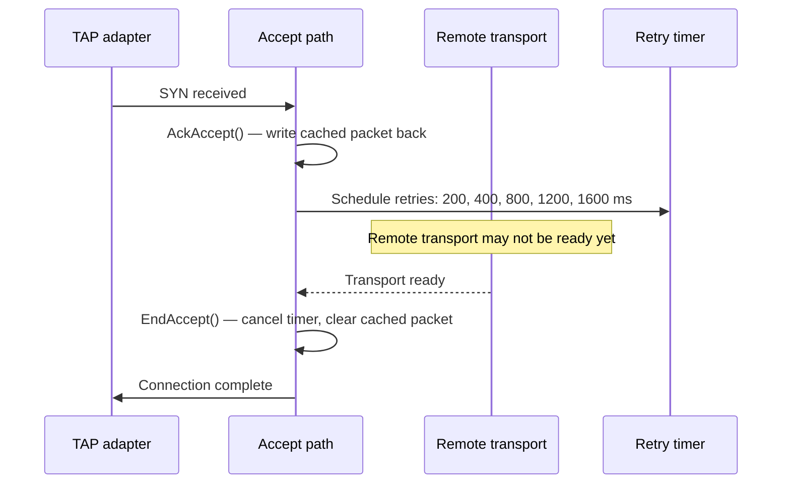
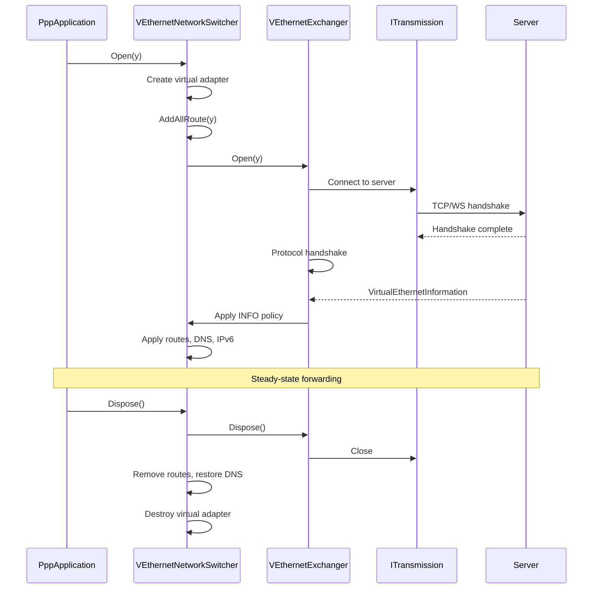

# Client Architecture

[中文版本](CLIENT_ARCHITECTURE_CN.md)

## Scope

This document describes the real client runtime in `ppp/app/client/`.
It is not a generic VPN description. It is the host-side edge node for the overlay network.

---

## Runtime Position

The client has two major jobs:

- Shape local host networking
- Maintain the remote tunnel session

Those jobs are intentionally separated into different objects.



---

## Code Anchors

| Object | Role | Source |
|--------|------|--------|
| `VEthernetNetworkSwitcher` | Virtual adapter, routes, DNS, bypass, local traffic classification, proxy surface | `ppp/app/client/VEthernetNetworkSwitcher.*` |
| `VEthernetExchanger` | Remote session, handshake, keepalive, key state, static path, IPv6, mapping | `ppp/app/client/VEthernetExchanger.*` |
| `VEthernetLocalProxySwitcher` | Local proxy entry point | `ppp/app/client/proxys/VEthernetLocalProxySwitcher.*` |
| `VEthernetHttpProxySwitcher` | HTTP proxy entry | `ppp/app/client/proxys/VEthernetHttpProxySwitcher.*` |
| `VEthernetSocksProxySwitcher` | SOCKS proxy entry | `ppp/app/client/proxys/VEthernetSocksProxySwitcher.*` |

---

## Client Topology



---

## Core Split

The two central types are `VEthernetNetworkSwitcher` and `VEthernetExchanger`.

That split is the key architectural boundary.

| Type | Responsibility |
|------|----------------|
| `VEthernetNetworkSwitcher` | Virtual adapter, routes, DNS, bypass, local classification, proxy surface |
| `VEthernetExchanger` | Remote session, handshake, keepalive, key state, static path, IPv6, mapping |

### Why The Boundary Matters

If routing/DNS/bypass and remote session logic were merged into one object, the client would mix local network side effects with control-plane concerns. The result would be unmaintainable.

The boundary also enables independent evolution:
- Transport protocol changes only affect `VEthernetExchanger`.
- Routing and DNS policy changes only affect `VEthernetNetworkSwitcher`.

---

## Client Startup Flow



### Session State Machine



---

## `VEthernetNetworkSwitcher` Deep Dive

This object owns the host-network side.

### What It Holds

| Field | Description |
|-------|-------------|
| `adapter_` | Virtual NIC reference |
| `gateway_` | Physical gateway address |
| `rib_` | Route information base |
| `fib_` | Forwarding information base |
| `ribs_` | IP-list sources |
| `vbgp_` | vBGP remote route sources |
| `dns_rules_` | DNS steering rules |
| `dns_serverss_` | DNS server route assignments |
| `proxy_` | Local proxy switcher reference |
| `ipv6_state_` | IPv6 application state |

### Key Methods

```cpp
/**
 * @brief Open the network switcher and prepare the host environment.
 * @param y  Yield context for async operations.
 * @return   true if all subsystems opened successfully.
 * @note     Creates virtual adapter, applies routes, DNS, and bypass lists.
 */
bool Open(YieldContext& y) noexcept;

/**
 * @brief Close the switcher and roll back all host side effects.
 * @note  Removes routes, restores DNS, destroys virtual adapter.
 */
void Dispose() noexcept;

/**
 * @brief Add all configured routes from all sources.
 * @param y  Yield context for async IP-list loading.
 * @return   true if all routes were successfully applied.
 */
bool AddAllRoute(YieldContext& y) noexcept;

/**
 * @brief Protect the default route from being overwritten by the tunnel.
 * @return true if default route was successfully protected.
 */
bool ProtectDefaultRoute() noexcept;

/**
 * @brief Add direct-path routes for all configured DNS servers.
 * @return true if all DNS server routes were added.
 * @note  DNS servers are given direct routes to ensure they remain
 *        reachable even when the default route is redirected.
 */
bool AddRouteWithDnsServers() noexcept;

/**
 * @brief Reinject a packet received from the server into the virtual adapter.
 * @param packet  Packet data received from remote.
 * @param length  Packet length.
 * @return        true if packet was successfully injected.
 */
bool InjectPacket(const Byte* packet, int length) noexcept;
```

Source: `ppp/app/client/VEthernetNetworkSwitcher.h`

### Why It Is Host-Side

It performs local side effects: virtual adapter setup, route updates, and DNS changes are all machine-local behavior. These must be undone on cleanup, and they must be isolated from remote session state.

---

## `VEthernetExchanger` Deep Dive

This object owns the remote-session side.

### What It Holds

| Field | Description |
|-------|-------------|
| `transmission_` | Active `ITransmission` to server |
| `linklayer_` | `VirtualEthernetLinklayer` action handler |
| `session_id_` | `Int128` session identifier |
| `keepalive_timer_` | Keepalive echo timer |
| `udp_ports_` | Active UDP datagram port map |
| `mappings_` | FRP reverse mapping registry |
| `ipv6_lease_` | IPv6 address lease (if assigned) |
| `static_path_` | Static path state |
| `traffic_in_` | Inbound bytes counter |
| `traffic_out_` | Outbound bytes counter |

### Key Methods

```cpp
/**
 * @brief Open the exchanger and establish the remote session.
 * @param y  Yield context for the handshake coroutine.
 * @return   true if session was established and is forwarding.
 */
bool Open(YieldContext& y) noexcept;

/**
 * @brief Close the exchanger and release the remote session.
 */
void Dispose() noexcept;

/**
 * @brief Send a keepalive echo to the server.
 * @param y  Yield context.
 * @return   true if echo was sent.
 * @note     If the server does not respond within the timeout,
 *           the session is considered dead and triggers reconnect.
 */
bool SendKeepalive(YieldContext& y) noexcept;

/**
 * @brief Request an IPv6 address from the server.
 * @param y  Yield context.
 * @return   true if IPv6 assignment was received and applied.
 */
bool RequestIPv6(YieldContext& y) noexcept;

/**
 * @brief Register a reverse mapping with the server.
 * @param y         Yield context.
 * @param mapping   The FRP mapping to register.
 * @return          true if mapping was accepted.
 */
bool RegisterMapping(YieldContext& y, const FrpMapping& mapping) noexcept;
```

Source: `ppp/app/client/VEthernetExchanger.h`

### Why It Is Session-Side

This object manages a single remote session: how it connects, how it handshakes, and how it remains alive. It does not touch local routing or DNS.

---

## Local Proxy Surface

The client exposes local proxy entry points through:



Proxy entry points accept local connections and route them into the tunnel exchanger.

---

## Host Integration

The client is a host integration layer, not just a dialer.



---

## Common Event Couplings

| Event | Switcher action | Exchanger action |
|-------|----------------|-----------------|
| Startup | Create adapter, add routes, configure DNS | Open remote transport, complete handshake |
| Handshake success | Apply returned INFO policy | Persist session state |
| Remote policy change | Update local reachability, DNS rules | Re-register mappings |
| Keepalive timeout | N/A | Trigger reconnect |
| VIRR refresh | Update bypass routes | N/A |
| IPv6 assigned | Apply IPv6 to virtual adapter | Store IPv6 lease |
| Shutdown | Clear local side effects, remove routes, restore DNS | Release remote session |

---

## `VEthernetExchanger` Behavior Details

The exchanger creates TCP or WebSocket transports depending on the parsed remote URI:

| URI scheme | Transport type |
|-----------|---------------|
| `ppp://host:port/` | Raw TCP |
| `ppp://ws/host:port/` | WebSocket |
| `ppp://wss/host:port/` | TLS WebSocket |

Special paths handled by the exchanger:

| Path | Description |
|------|-------------|
| Static echo | Alternative delivery path using static UDP |
| IPv6 request/response | IPv6 address assignment flow |
| Mux startup/update | Multiplexing negotiation |
| UDP datagram ports | Per-destination UDP relay state |
| Connection cipher selection | Per-connection cipher negotiation |

---

## `VEthernetNetworkSwitcher` Behavior Details

The switcher also manages:

| Responsibility | Description |
|----------------|-------------|
| Proxy surface registration | Registers local HTTP/SOCKS proxy listeners |
| Local packet classification | Classifies packets as bypass or tunnel |
| Bypass list loading | Loads and applies IP bypass lists |
| IPv6 application state | Applies IPv6 address assignments from server |
| Tunnel-adjacent host mutation | Adjusts host network for tunnel operation |

---

## Virtual TCP Accept Recovery

The TAP-side TCP accept path has a retry loop for cached SYN/ACK packets.



Retry schedule: 200ms, 400ms, 800ms, 1200ms, 1600ms while accept state is pending.

`EndAccept()` cancels the retry timer as soon as the connection completes.
`Finalize()` performs the same cleanup as a safety fallback.

If the remote transport is not established yet, the SYN path stays pending. The peer's TCP retransmission is expected to retry. The design avoids sending an artificial RST during this transient window.

---

## Client Lifecycle Ownership



---

## What the Client Is Not

| Incorrect description | Correct description |
|-----------------------|---------------------|
| Just a dialer | A host-side control and data orchestration node |
| Just a route editor | A full host integration layer with session management |
| A symmetric peer to the server | A client-only edge node with local network side effects |
| A simple tunnel endpoint | A hybrid of host networking layer and overlay session manager |

---

## Error Code Reference

Client-related `ppp::diagnostics::ErrorCode` values:

| ErrorCode | Description |
|-----------|-------------|
| `AdapterOpenFailed` | Virtual adapter could not be created |
| `RouteAddFailed` | Route could not be added to OS routing table |
| `DnsConfigFailed` | DNS configuration failed |
| `DefaultRouteProtectionFailed` | Default route protection failed |
| `HandshakeFailed` | Server handshake failed |
| `HandshakeTimeout` | Server handshake timed out |
| `KeepaliveTimeout` | Keepalive echo not acknowledged |
| `SessionExpired` | Session rejected due to expiration |
| `QuotaExceeded` | Session rejected due to quota |
| `IPv6AssignmentFailed` | Server could not assign IPv6 address |
| `StaticPathNegotiationFailed` | Static path negotiation failed |
| `MuxNegotiationFailed` | MUX negotiation failed |

---

## Related Documents

- [`ARCHITECTURE.md`](ARCHITECTURE.md)
- [`SERVER_ARCHITECTURE.md`](SERVER_ARCHITECTURE.md)
- [`TUNNEL_DESIGN.md`](TUNNEL_DESIGN.md)
- [`ROUTING_AND_DNS.md`](ROUTING_AND_DNS.md)
- [`LINKLAYER_PROTOCOL.md`](LINKLAYER_PROTOCOL.md)
- [`TRANSMISSION.md`](TRANSMISSION.md)
- [`HANDSHAKE_SEQUENCE.md`](HANDSHAKE_SEQUENCE.md)
- [`PLATFORMS.md`](PLATFORMS.md)
