# Client Architecture

[中文版本](CLIENT_ARCHITECTURE_CN.md)

## Scope

This document, based on the C++ implementation under `ppp/app/client/`, explains in detail the architecture design of the OPENPPP2 client runtime. This is not an idealized description treating it as an abstract "VPN client". It describes what actually exists in the code: object boundaries, control paths, data paths, reconnection mechanisms, host integration behavior, and what protocol directions the client actively rejects.

The OPENPPP2 client is not merely a "dialer". At runtime, it plays the role of the overlay network edge node on the host side. This is an important component of the virtual Ethernet infrastructure product, fundamentally different from traditional VPN clients.

## Runtime Position

From code facts, the client is never just a "dialer". At runtime, it plays the role of the overlay network edge node on the host side.

### Core Responsibilities

| Responsibility | Description | Corresponding Component |
|----------------|-------------|-------------------------|
| Hold and drive local virtual adapter | Create and manage TUN/TAP virtual interface | `VEthernetNetworkSwitcher` |
| Manage host route and DNS state | Modify system routing table and DNS configuration | `VEthernetNetworkSwitcher` |
| Determine which traffic enters tunnel | Traffic classification and bypass policy | `VEthernetNetworkSwitcher` |
| Maintain long-lived session with server | Keep persistent connection to server | `VEthernetExchanger` |
| Expose local HTTP and SOCKS proxies | Provide local proxy services | `VEthernetHttpProxySwitcher`, `VEthernetSocksProxySwitcher` |
| Register reverse mapping | Register port mapping with server | `VEthernetExchanger` |
| Apply IPv6 from server | Apply server-assigned IPv6 addresses | `VEthernetExchanger` |
| Switch to static datagram path when needed | Support UDP static path | `VEthernetDatagramPort` |

Therefore, the real form of this client is not as simple as "one socket + one encrypted tunnel", but a combination of "host network integration layer + remote session layer".

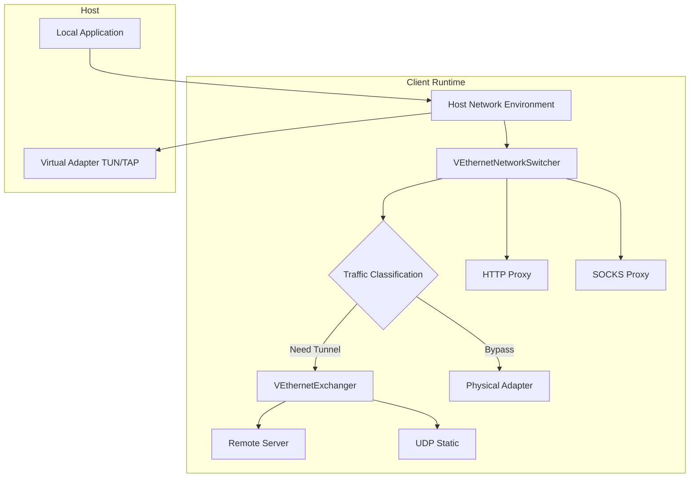

## Core Split

The most core types in the client constitute the entire runtime:

### Core Type List

| Type | Responsibility | Source Location |
|------|---------------|------------------|
| `VEthernetNetworkSwitcher` | Host network environment management | `VEthernetNetworkSwitcher.*` |
| `VEthernetExchanger` | Remote session relationship management | `VEthernetExchanger.*` |
| `VEthernetNetworkTcpipStack` | TCP/IP protocol stack | `VEthernetNetworkTcpipStack.*` |
| `VEthernetNetworkTcpipConnection` | TCP connection management | `VEthernetNetworkTcpipConnection.*` |
| `VEthernetDatagramPort` | UDP datagram port | `VEthernetDatagramPort.*` |
| `VEthernetHttpProxySwitcher` | HTTP proxy | `VEthernetHttpProxySwitcher.*` |
| `VEthernetSocksProxySwitcher` | SOCKS proxy | `VEthernetSocksProxySwitcher.*` |

The most important boundary here is the split between `VEthernetNetworkSwitcher` and `VEthernetExchanger`.

### Responsibilities of Switcher vs Exchanger

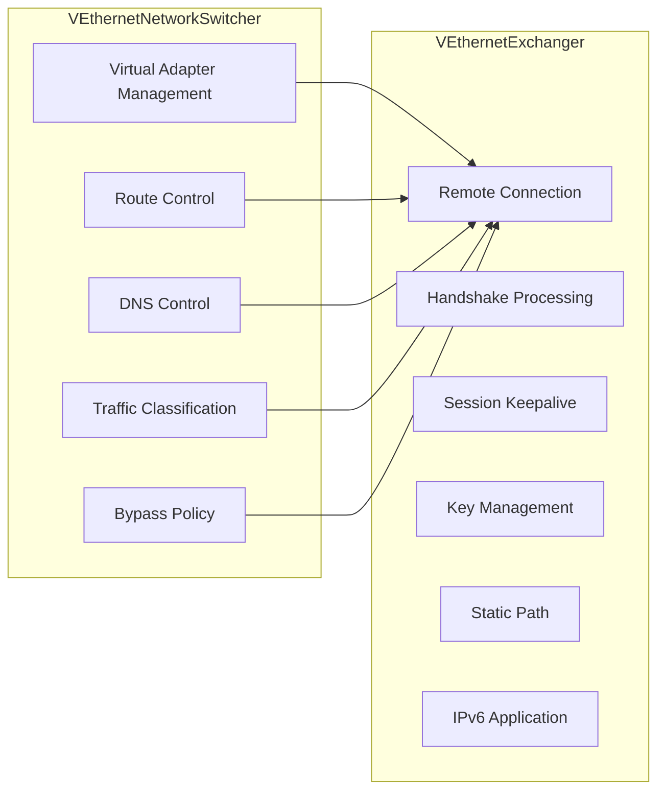

**VEthernetNetworkSwitcher** is responsible for the host network environment. It works on `ITap`, knows which is the underlying physical adapter and which is the virtual adapter, is responsible for loading bypass and route-list, writing routes to the operating system, DNS behavior, classifying packets received from TUN or TAP, and reinjecting data returned from the server into the local network environment.

**VEthernetExchanger** is responsible for the remote session relationship. It opens the real transport layer connection, performs client-side handshake, maintains keepalive, creates datagram ports, registers mappings, maintains static mode state, maintains MUX, receives server information envelopes and feeds changes back to the switcher.

This split makes:
- Network layer policy (route, DNS, bypass) separated from transport layer logic (connection, session, keys)
- Easy to test and maintain independently
- Support for flexible extension mechanisms

## VEthernetNetworkSwitcher Details

### Function Overview

`VEthernetNetworkSwitcher` is the core of client network environment management, responsible for:

| Function | Description |
|----------|-------------|
| Virtual adapter creation | Create TUN/TAP interface, configure IP address |
| Route management | Add and delete routing table entries |
| DNS configuration | Modify system DNS server |
| Traffic classification | Decide which traffic goes through tunnel and which bypasses |
| Proxy services | Start and manage HTTP/SOCKS proxies |
| Data forwarding | Forward local traffic to tunnel |

### Virtual Adapter Configuration

| Parameter | Description | Default Value |
|-----------|-------------|---------------|
| `--tun` | Virtual adapter name | Platform dependent |
| `--tun-ip` | Virtual adapter IP address | 10.0.0.2 |
| `--tun-gw` | Virtual adapter gateway | 10.0.0.1 |
| `--tun-mask` | Subnet mask | 30 bits |
| `--tun-host` | Whether as preferred network | yes |

### Platform Differences

| Platform | Interface Type | Driver Method | Default Name |
|-----------|---------------|---------------|--------------|
| Windows | TAP | Windows TUN/TAP driver | PPP |
| Linux | TUN | tun/tap kernel module | ppp |
| macOS | utun | utun interface | utun0 |
| Android | TUN | VPN Service API | tun0 |

### Traffic Classification Logic

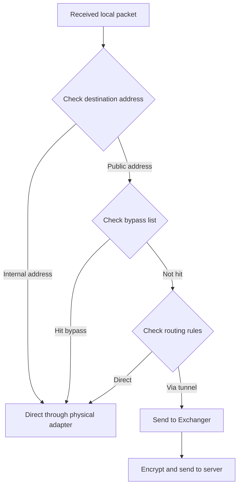

### Bypass Mechanism

The bypass mechanism allows specific traffic to bypass the tunnel, common uses:

| Bypass Type | Description | Configuration Method |
|-------------|-------------|---------------------|
| IP bypass | Specified IP or IP range direct | `--bypass` parameter |
| Domain bypass | Specified domain direct | DNS rules file |
| Process bypass | Specified process traffic direct | Platform-specific implementation |

## VEthernetExchanger Details

### Function Overview

`VEthernetExchanger` is the session management layer between client and server, responsible for:

| Function | Description |
|----------|-------------|
| Establish connection | Establish transport layer connection with server |
| Handshake processing | Complete client-side handshake and key exchange |
| Session keepalive | Maintain long-lived connection keepalive |
| Key management | Manage session keys |
| Static path | Manage UDP static data path |
| IPv6 management | Apply server-sent IPv6 configuration |
| Port mapping | Register reverse mapping with server |

### Connection Establishment Flow

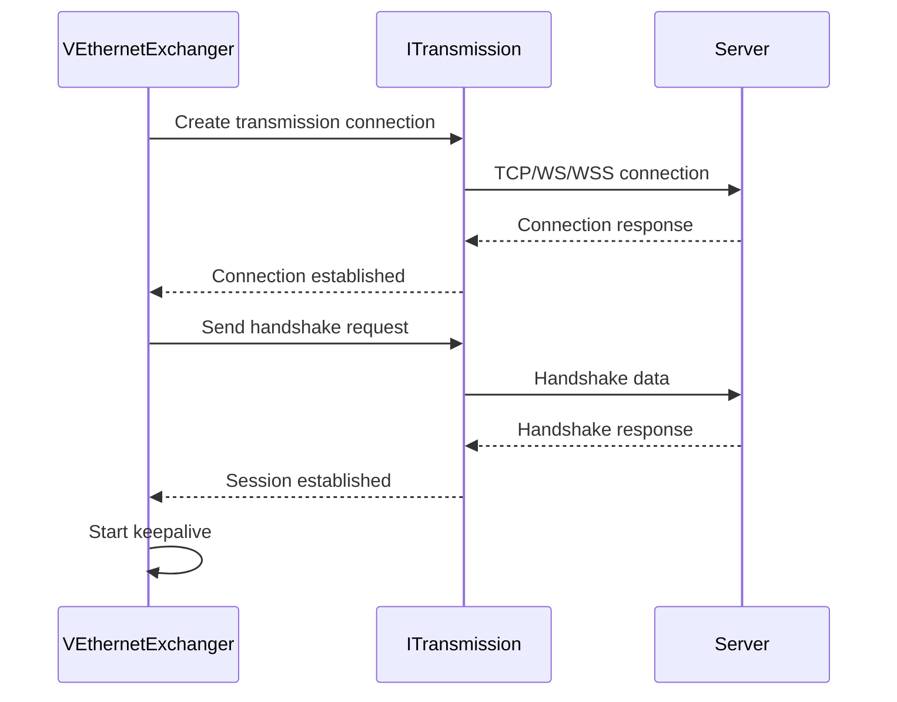

### Keepalive Mechanism

| Parameter | Description | Default Value |
|-----------|-------------|---------------|
| `keep-alived` | Keepalive interval range | [1, 20] seconds |
| `inactive.timeout` | Idle timeout | 60 seconds |

### Key Exchange

The client uses pre-shared keys with `ivv` parameter to derive session keys:

| Parameter | Description |
|-----------|-------------|
| `protocol-key` | Protocol layer encryption key |
| `transport-key` | Transport layer encryption key |
| `ivv` | Dynamically generated per session |

### Static Path

When static mode is enabled, `VEthernetExchanger` creates `VEthernetDatagramPort` for UDP data transmission:

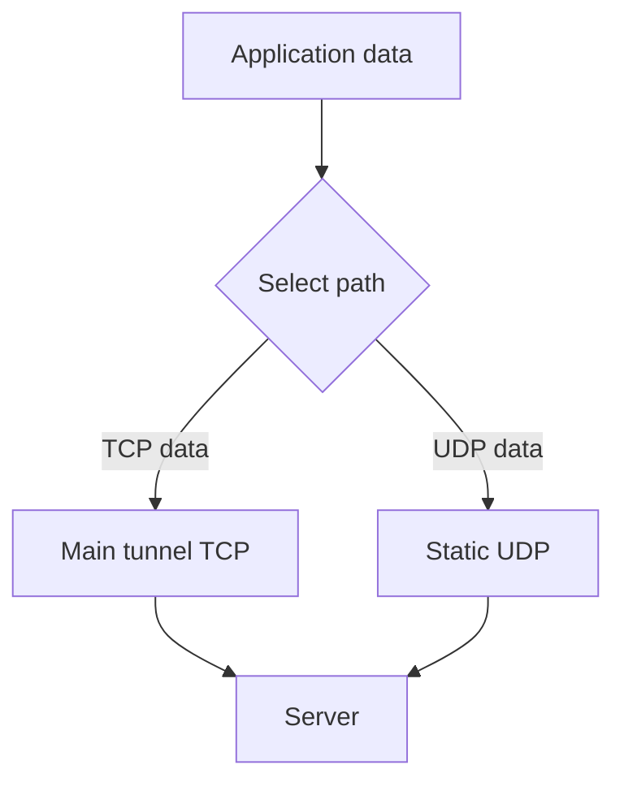

| Parameter | Description |
|-----------|-------------|
| `--tun-static` | Enable static mode |
| `static.keep-alived` | Static keepalive interval |
| `static.dns` | Enable static DNS |
| `static.quic` | Enable QUIC support |
| `static.icmp` | Enable ICMP support |

## VEthernetNetworkTcpipStack Details

### TCP/IP Protocol Stack

`VEthernetNetworkTcpipStack` implements the client's TCP/IP protocol stack, handling TCP data within the tunnel:

| Function | Description |
|----------|-------------|
| TCP connection management | Handle TCP connection establishment and maintenance |
| Data buffering | Manage send and receive buffers |
| Flow control | Implement TCP flow control |
| Congestion control | Implement congestion avoidance algorithms |

### Connection Handling Flow

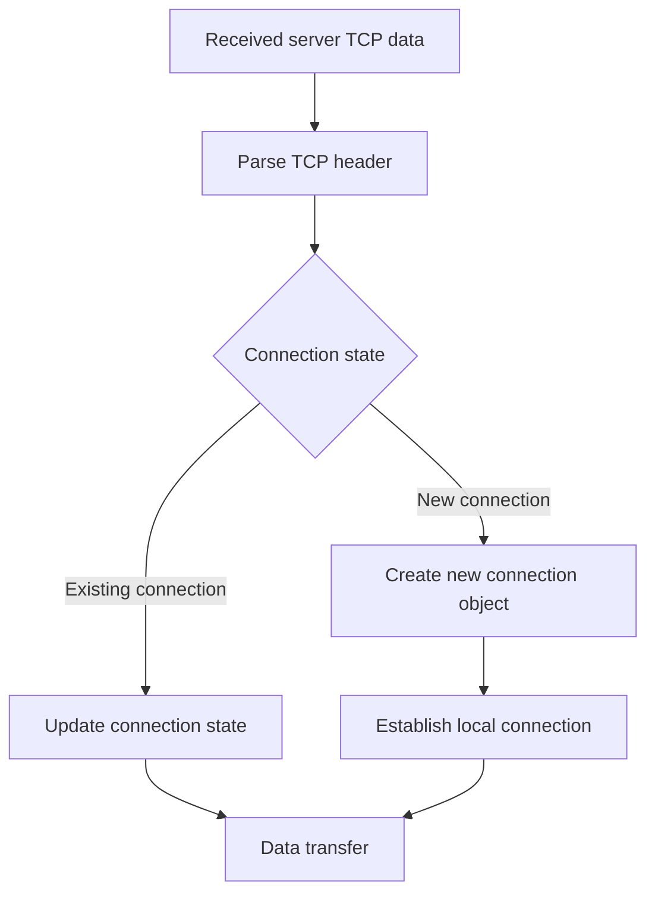

## HTTP and SOCKS Proxies

### HTTP Proxy

`VEthernetHttpProxySwitcher` provides HTTP proxy service:

| Parameter | Description |
|-----------|-------------|
| `http-proxy.bind` | Bind address |
| `http-proxy.port` | Port |

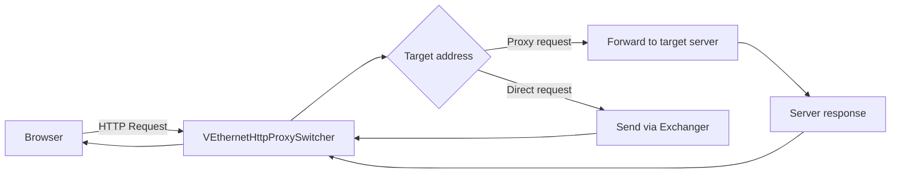

### SOCKS Proxy

`VEthernetSocksProxySwitcher` provides SOCKS proxy service:

| Parameter | Description |
|-----------|-------------|
| `socks-proxy.bind` | Bind address |
| `socks-proxy.port` | Port |
| `socks-proxy.username` | Authentication username |
| `socks-proxy.password` | Authentication password |

### Proxy Authentication

| Method | Supported | Description |
|--------|-----------|-------------|
| No auth | ✅ | No authentication required |
| Basic auth | ✅ | Username/password |
| GSSAPI | ❌ | Not supported |

## Port Mapping (Reverse Mapping)

### Function Description

The client can register port mapping with the server to expose local services to the public network:

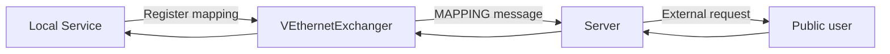

### Configuration Parameters

| Parameter | Description |
|-----------|-------------|
| `mappings[].local-ip` | Local IP |
| `mappings[].local-port` | Local port |
| `mappings[].protocol` | Protocol type |
| `mappings[].remote-port` | Remote port |

### Use Cases

| Use Case | Description |
|----------|-------------|
| Expose local web service | Map local port 80 to public network |
| Remote desktop | Map local port 3389 to public network |
| Game server | Map local game port to public network |

## IPv6 Support

### IPv6 Modes

| Mode | Description |
|------|-------------|
| none | No IPv6 assigned |
| NAT66 | NAT66 mode |
| GUA | Global Unicast Address |

### IPv6 Configuration Flow

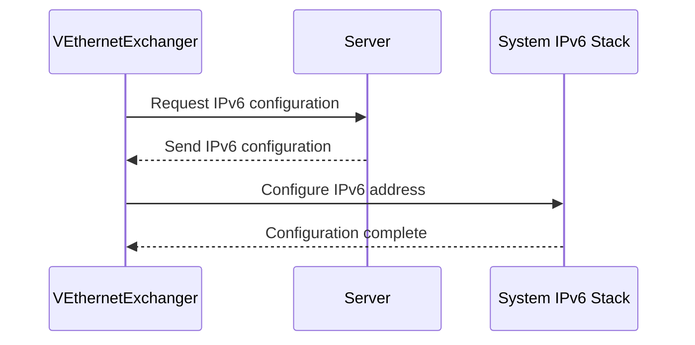

### IPv6 Address Types

| Type | Description | Example |
|------|-------------|---------|
| GUA | Global Unicast Address | 2001:db8::1 |
| ULA | Unique Local Address | fd00::/8 |
| Link-local | Link-Local Address | fe80::/10 |

## MUX Multiplexing

### Function Description

MUX allows multiplexing multiple data streams over a single connection:

| Parameter | Description |
|-----------|-------------|
| `mux.connect.timeout` | Connection timeout |
| `mux.inactive.timeout` | Idle timeout |
| `mux.congestions` | Congestion window size |
| `mux.keep-alived` | Keepalive interval |

### MUX Data Flow

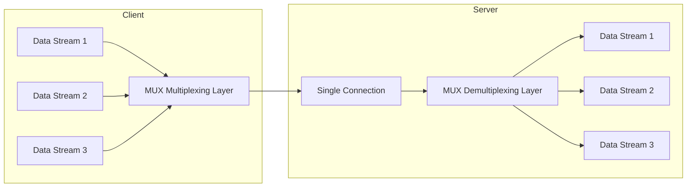

## Route and DNS Control

### Routing Policy

The client supports flexible routing policies:

| Policy | Description | Configuration |
|--------|-------------|---------------|
| Global route | All traffic via tunnel | Default |
| Policy route | Route by rules | `--bypass` |
| Smart route | Domestic direct, foreign via tunnel | `--vbgp` |

### DNS Policy

| Policy | Description |
|--------|-------------|
| Tunnel DNS | All DNS queries through tunnel |
| Split DNS | Split by domain name |
| Direct DNS | Query local DNS directly |

### DNS Rules File Format

```
# Format: domain [direct|tunnel]
example.com direct
google.com tunnel
* tunnel
```

## Reconnection Mechanism

### Reconnection Strategy

When the connection is disconnected, the client automatically reconnects:

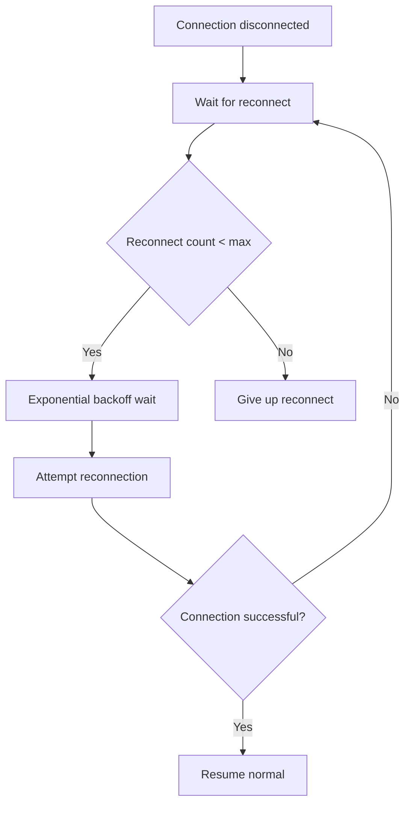

| Parameter | Description |
|-----------|-------------|
| `reconnections.timeout` | Reconnection timeout |
| `link-restart` | Link restart count |

### Exponential Backoff

Reconnection uses exponential backoff strategy:

| Reconnection Count | Wait Time |
|--------------------|-----------|
| 1 | 1 second |
| 2 | 2 seconds |
| 3 | 4 seconds |
| 4 | 8 seconds |
| ... | Max 60 seconds |

## Complete Data Flow Diagram

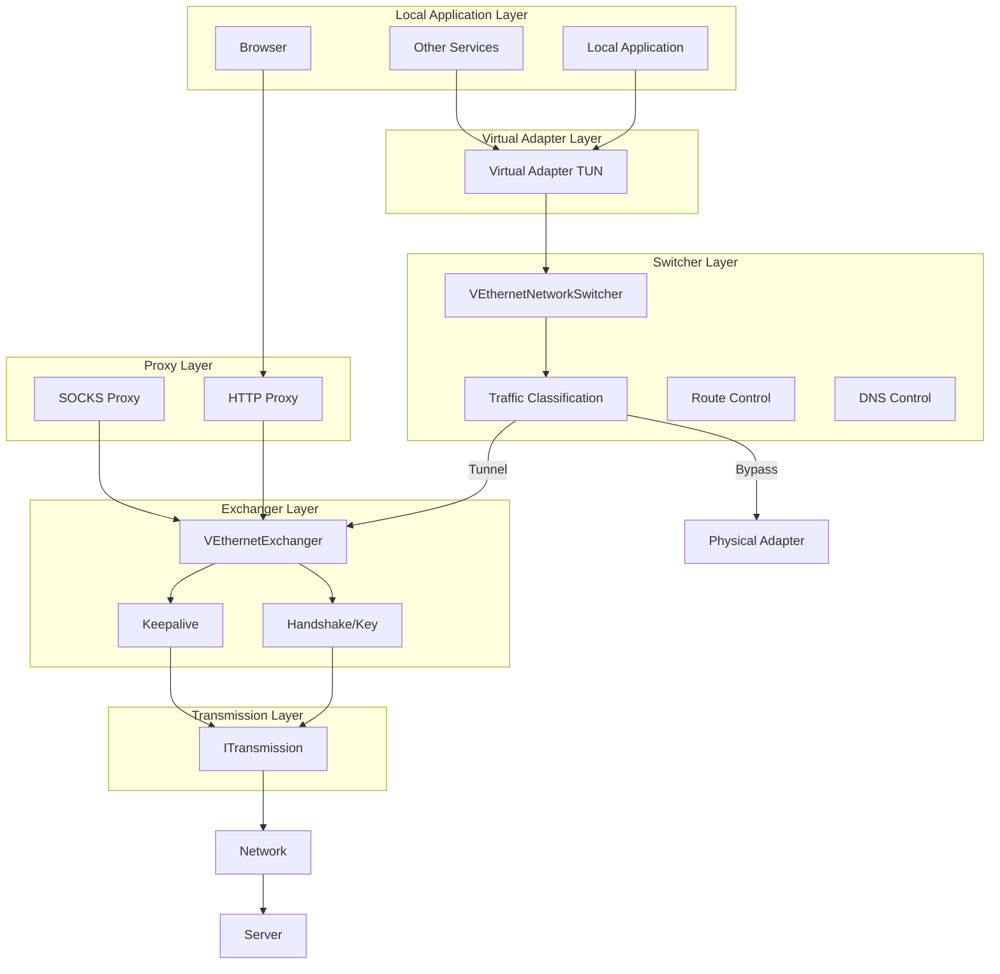

## Error Handling

### Common Errors and Handling

| Error Type | Cause | Handling |
|------------|-------|----------|
| Connection timeout | Network unreachable | Reconnect |
| Handshake failure | Key error | Report error |
| Virtual adapter error | Insufficient permissions | Attempt recreation |
| DNS resolution failure | DNS server issue | Use backup DNS |
| Proxy service error | Port in use | Try backup port |

### Log Levels

| Level | Description |
|-------|-------------|
| ERROR | Error messages |
| WARN | Warning messages |
| INFO | General information |
| DEBUG | Debug information |

## Performance Optimization

### Performance Parameters

| Parameter | Description | Recommended Value |
|-----------|-------------|-------------------|
| `concurrent` | Concurrent thread count | CPU core count |
| `--tun-ssmt` | SSMT thread count | 4 or CPU core count |
| `tcp.turbo` | TCP acceleration | Enable |
| `tcp.fast-open` | TCP Fast Open | Enable |

### Optimization Suggestions

1. **Network optimization**: Enable TCP Turbo and Fast Open
2. **Memory optimization**: Configure vmem size
3. **Concurrency optimization**: Adjust concurrency based on CPU cores
4. **MUX optimization**: Enable MUX in high-latency scenarios

## Summary

The OPENPPP2 client is a complex network system with core architectural features:

1. **Switcher/Exchanger separation**: Network environment management separated from session management
2. **Multi-plane support**: Simultaneously supports TCP tunnel, UDP static, HTTP/SOCKS proxies
3. **Flexible route and DNS control**: Supports multiple bypass strategies
4. **Complete reconnection mechanism**: Automatic reconnection with exponential backoff
5. **IPv6 support**: Supports multiple IPv6 modes
6. **MUX multiplexing**: Supports connection multiplexing

Understanding these architectural features is crucial for correctly using and debugging the client.

## Related Documents

| Document | Description |
|----------|-------------|
| [ARCHITECTURE.md](ARCHITECTURE.md) | System Architecture Overview |
| [SERVER_ARCHITECTURE.md](SERVER_ARCHITECTURE.md) | Server Runtime Architecture |
| [TRANSMISSION.md](TRANSMISSION.md) | Transmission Layer and Protected Tunnel Model |
| [ROUTING_AND_DNS.md](ROUTING_AND_DNS.md) | Route and DNS Control |
| [PLATFORMS.md](PLATFORMS.md) | Platform Support and Differences |
