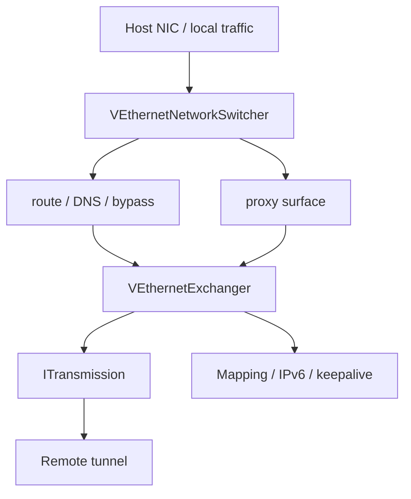
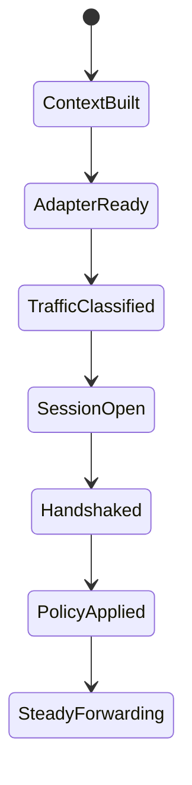

# Client Architecture

[中文版本](CLIENT_ARCHITECTURE_CN.md)

## Scope

This document describes the real client runtime in `ppp/app/client/`. It is not a generic VPN description. It is the host-side edge node for the overlay network.

## Runtime Position

The client has two major jobs:

- shape local host networking
- maintain the remote tunnel session

Those jobs are intentionally separated into different objects.

## Code Anchors

The client runtime is split into network shaping and session exchange:

| Object | Role |
|---|---|
| `VEthernetNetworkSwitcher` | virtual adapter, routes, DNS, bypass, local traffic classification, proxy surface |
| `VEthernetExchanger` | remote session, handshake, keepalive, key state, static path, IPv6, mapping |
| `VEthernetLocalProxySwitcher` / `VEthernetHttpProxySwitcher` / `VEthernetSocksProxySwitcher` | local proxy entry points |

## Client Topology

## Core Split

The two central types are:

- `VEthernetNetworkSwitcher`
- `VEthernetExchanger`

That split is the key architectural boundary.

| Type | Responsibility |
|---|---|
| `VEthernetNetworkSwitcher` | Virtual adapter, routes, DNS, bypass, local classification, proxy surface |
| `VEthernetExchanger` | Remote session, handshake, keepalive, key state, static path, IPv6, mapping |

### Why the Boundary Matters

If routing/DNS/bypass and remote session logic were merged into one object, the client would mix local network side effects with control-plane concerns and become much harder to maintain.

## Client Flow

1. Build local network context
2. Create the virtual adapter environment
3. Classify traffic
4. Open the remote transport session
5. Complete handshake
6. Exchange session information
7. Apply routing, DNS, proxy, mapping, and optional IPv6 state
8. Enter steady-state forwarding

## `VEthernetNetworkSwitcher`

This object owns the host-network side:

- adapter creation
- route changes
- DNS changes
- traffic classification
- bypass policy
- reinjection of data returned from the server

It sits on the host side and decides what goes to the tunnel and what stays local.

### Why it is host-side

It performs local side effects: virtual adapter setup, route updates, and DNS changes are all machine-local behavior.

## `VEthernetExchanger`

This object owns the remote-session side:

- transport connection establishment
- client-side handshake
- session keepalive
- key management
- static path state
- mapping registration
- IPv6 application

### Why it is session-side

This object manages a single remote session: how it connects, how it handshakes, and how it remains alive.

## Host Integration

The client is also responsible for local proxy surfaces and platform-specific virtual adapter behavior. That makes it a host integration layer, not just a dialer.

## Common Couplings

| Event | Switcher action | Exchanger action |
|---|---|---|
| startup | create adapter / route / DNS | open remote connection |
| handshake success | apply returned policy | persist session state |
| remote policy change | update local reachability | re-register mapping |
| shutdown | clear local side effects | release remote session |

## `VEthernetExchanger` Behavior Notes

The exchanger creates TCP or WebSocket based transports depending on configuration and the parsed remote URI.

It also carries special paths for:

- static echo
- IPv6 request and response handling
- mux startup and update
- UDP datagram ports
- connection-specific cipher selection

## `VEthernetNetworkSwitcher` Behavior Notes

The switcher owns routing and DNS steering, but it also manages:

- proxy surface registration
- local packet classification
- bypass lists
- IPv6 application state
- tunnel-adjacent host mutation

## What the Client Is Not

It is not only a dialer.

It is not only a route editor.

It is not a symmetric peer to the server.

It is a host-side control and data orchestration node.

## Related Documents

- `ARCHITECTURE.md`
- `SERVER_ARCHITECTURE.md`
- `TUNNEL_DESIGN.md`
