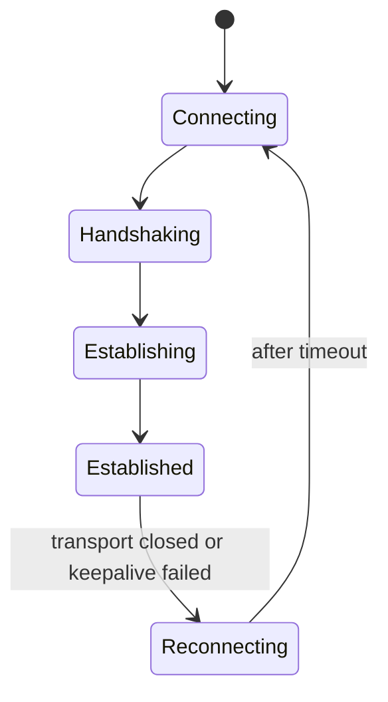
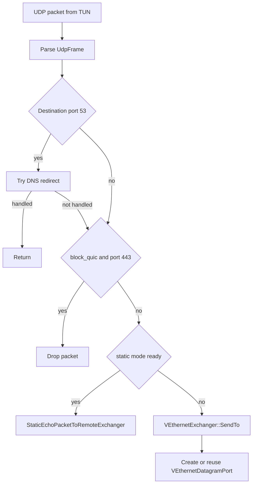
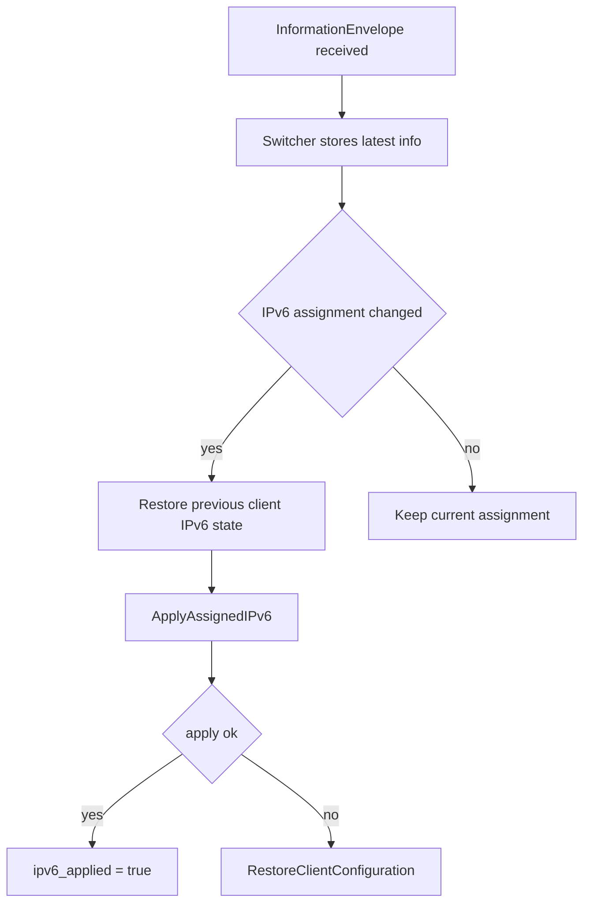
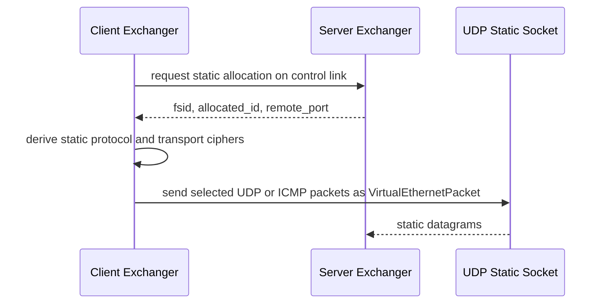
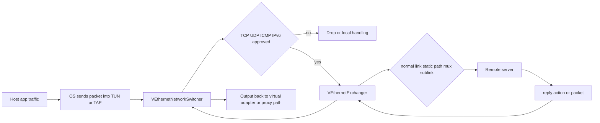

# Client Architecture

[中文版本](CLIENT_ARCHITECTURE_CN.md)

This document explains the client runtime as implemented in the C++ code under `ppp/app/client/`. It is intentionally implementation-driven. It does not describe an idealized VPN client. It describes what the client actually does, what objects own which responsibilities, how packets and control messages move through the runtime, and where the code applies defensive constraints.

The most important source files for this document are:

- `ppp/app/client/VEthernetNetworkSwitcher.cpp`
- `ppp/app/client/VEthernetExchanger.cpp`
- `ppp/app/client/VEthernetNetworkTcpipStack.cpp`
- `ppp/app/client/VEthernetNetworkTcpipConnection.cpp`
- `ppp/app/client/VEthernetDatagramPort.cpp`
- `ppp/app/client/proxys/*`

## Runtime Position

The client is not only a tunnel dialer. In code, it is the overlay edge on the host side. It owns the local virtual adapter, manipulates route and DNS state, decides which packets should enter the tunnel, manages a long-lived control relationship to the server, optionally exposes HTTP and SOCKS proxies, registers reverse mappings, and applies server-managed IPv6 state.

That matters because the client architecture only makes sense when read as a composition of two different roles:

- host integration role
- remote session role

The code expresses that split through two central types.

## Core Split

The main client types are:

- `VEthernetNetworkSwitcher`
- `VEthernetExchanger`
- `VEthernetNetworkTcpipStack`
- `VEthernetNetworkTcpipConnection`
- `VEthernetDatagramPort`
- `VEthernetHttpProxySwitcher`
- `VEthernetSocksProxySwitcher`

The boundary is important.

`VEthernetNetworkSwitcher` owns the local networking environment. It sits on top of `ITap`, knows about the underlying physical NIC, loads bypass and route lists, installs or restores OS routing state, handles DNS steering, applies IPv6 configuration, and decides how packets from the local virtual adapter should be processed.

`VEthernetExchanger` owns the remote relationship. It opens the actual transmission, performs the client side of session establishment, maintains keepalive behavior, registers mapping ports, manages datagram state, negotiates static mode, negotiates MUX, and translates switcher decisions into link-layer actions.

This is a clean separation. Route tables and DNS policy outlive any one successful transport connection. The remote session must be reconnectable without redefining the entire host-side network configuration model.

## Startup Graph

At startup the client path is assembled from `main.cpp`, then from `VEthernetNetworkSwitcher::Open(...)`, and then from `VEthernetExchanger::Open()`.

The object graph looks like this.

```mermaid
flowchart TD
    A[main.cpp client mode] --> B[Create ITap]
    B --> C[Construct VEthernetNetworkSwitcher]
    C --> D[Inject runtime flags and preferences]
    D --> E[Load bypass lists and route lists]
    E --> F[Load DNS rules]
    F --> G[VEthernetNetworkSwitcher::Open(tap)]
    G --> H[Resolve underlying NIC]
    G --> I[Open VEthernet base]
    G --> J[Resolve TUN or TAP NIC]
    G --> K[Create QoS]
    G --> L[Create VEthernetExchanger]
    L --> M[VEthernetExchanger::Open()]
    G --> N[Open local HTTP proxy if configured]
    G --> O[Open local SOCKS proxy if configured]
    G --> P[Prepare aggregator if static mode requires it]
    G --> Q[Load route tables into FIB]
    G --> R[Install OS routes and DNS behavior]
```

## Open Sequence In Detail

`VEthernetNetworkSwitcher::Open(...)` is the place where the client turns from configuration into runtime.

The function does all of the following in order.

First, on desktop platforms it resolves the underlying physical interface. The code treats this interface as the carrier that must remain healthy while the overlay is active. If a preferred NIC or preferred next-hop gateway is configured, it is applied here. The method also calls `FixUnderlyingNgw()` to repair a physical gateway route early, because the rest of the overlay logic assumes the machine can still reach the server through the real network.

Second, it opens the inherited `VEthernet` base on top of the already-created `ITap`. This establishes the local packet ingress and egress base. It then resolves the virtual adapter interface object itself, because later route and DNS operations need the OS-visible adapter identity rather than only the `ITap` abstraction.

Third, it allocates runtime helpers such as statistics and QoS. On Linux, it may also construct a `ProtectorNetwork` instance when protect mode is enabled. That protector exists to avoid route loop and self-capture problems when the client sends its own carrier traffic.

Fourth, it constructs the `VEthernetExchanger`, opens it immediately, then constructs and optionally starts local proxy switchers. The local proxies are not bolt-on utilities. They are opened during the same startup path as the tunnel itself and are treated as part of the client runtime.

Fifth, if static UDP mode with aggregation is enabled, it creates the aggregator object. This shows that static mode is not only a transport toggle. It has its own data-path helpers on the client.

Sixth, it loads route-list and bypass-list content into the client routing structures. The code builds a route information table and then a forwarding information table when the data is usable.

Finally, when hosted network behavior is enabled, it installs OS-level routes and DNS changes. Windows and Unix diverge here. Windows additionally flushes the resolver cache and can remove default routes from the physical NIC. Unix writes DNS settings through platform helpers. In both cases the client ends by running default-route protection logic.

## Why The Switcher Owns Host Networking

The switcher is the correct owner for host integration because host state changes are larger than a single link attempt.

The switcher owns:

- `underlying_ni_`
- `tun_ni_`
- route installation and cleanup
- bypass and route-list loading
- DNS rule loading
- DNS server reconfiguration
- packet injection back into the TUN or TAP device
- IPv6 apply and restore behavior
- optional platform helpers such as Windows paper-airplane integration

The exchanger does not own those things because reconnecting the transmission should not require reconstructing the entire host routing model.

## Client Session Lifecycle

`VEthernetExchanger::Open()` is small because it simply schedules the actual work. The session lifecycle lives in `VEthernetExchanger::Loopback(...)`.

That loop repeatedly performs:

1. move to connecting state
2. open a transmission
3. perform `HandshakeServer(y, GetId(), true)`
4. announce local LAN context through `EchoLanToRemoteExchanger(...)`
5. move to established state
6. send requested IPv6 configuration
7. register all configured mapping ports
8. allocate static mode if available
9. run the main link-layer loop through `Run(...)`
10. clean static state
11. unregister mappings
12. dispose transmission and sleep until reconnect timeout expires

The loop is explicit. The client is designed to reconnect repeatedly without reconstructing the entire switcher.



## Control Plane Versus Host Plane

The client runtime is easiest to understand when split into two loops.

The host plane is driven by packet callbacks from the local virtual adapter. That path starts in the switcher.

The control plane is driven by the remote transmission and its link-layer action handlers. That path is owned by the exchanger.

The switcher decides which local packets deserve tunnel treatment. The exchanger serializes those decisions into control actions such as `NAT`, `SENDTO`, `ECHO`, static packet output, mapping registration, and MUX sub-link creation.

## IPv4 Packet Admission From The Adapter

`VEthernetNetworkSwitcher::OnPacketInput(ip_hdr* ...)` is selective by design.

The function requires all of the following before it forwards a packet into the exchanger via `Nat(...)`:

- the packet came from a virtual-network path
- the IP protocol is TCP, UDP, or ICMP
- an exchanger exists
- a tap exists
- destination is not the adapter's own IPv4 address
- source equals the adapter IPv4 address
- destination is not the gateway address
- destination is in the expected subnet unless it is broadcast

This is not a generic raw packet pump. The client forwards only traffic that fits the overlay model the switcher expects.

## IPv6 Packet Admission From The Adapter

The IPv6 path is stricter than the IPv4 path.

`VEthernetNetworkSwitcher::OnPacketInput(Byte* ...)` first calls `IsApprovedIPv6Packet(...)`. The approval logic checks:

- IPv6 has already been successfully applied on the client
- assigned mode is `Nat66` or `Gua`
- assigned prefix length is exactly `128`
- assigned address is a real IPv6 address
- packet source address exactly matches the assigned address

If any of those checks fail, the packet is rejected and the debug log records why. This is one of the clearest examples of the client acting as an identity-enforcing overlay edge rather than as a transparent tunnel. The client is not allowed to emit arbitrary source IPv6 addresses after assignment. It must use the address the server assigned and the switcher applied.

## UDP Path

The UDP path starts in `VEthernetNetworkSwitcher::OnUdpPacketInput(...)`.

The code parses the UDP frame, extracts the payload, then applies a decision chain.

First, if the destination port is DNS, the switcher attempts DNS redirection logic through `RedirectDnsServer(...)`. DNS is handled specially because DNS policy is part of overlay steering, not just packet forwarding.

Second, if `block_quic_` is enabled and the destination port is 443 over UDP, the client drops the packet immediately. This is a coarse path, but it is deliberate and visible in code.

Third, if static mode is enabled, the switcher checks whether this packet category should go through static echo. DNS and QUIC can be individually routed to static mode depending on configuration, and a broader fallback path exists for other UDP traffic once static allocation is ready.

Fourth, if the packet does not take the DNS redirect path and does not take the static path, the switcher converts source and destination into UDP endpoints and calls `VEthernetExchanger::SendTo(...)`.

That method ensures a `VEthernetDatagramPort` exists for the source endpoint and then forwards the datagram through the remote link-layer action path.



## Datagram Ownership

`VEthernetDatagramPort` exists because UDP needs per-source-endpoint state. The client does not only emit disconnected UDP sends. It maintains reusable local socket state keyed by the source endpoint so that responses can be correlated and delivered back either to the datagram object or directly into the switcher output path.

On the return path, `VEthernetExchanger::OnSendTo(...)` calls `ReceiveFromDestination(...)`. If a datagram port exists for the source endpoint, the datagram object receives the payload. If not, the switcher can still emit the packet through `DatagramOutput(...)`. This makes the client resilient to asymmetric return paths where local source state may already have been released.

## ICMP Path

`VEthernetNetworkSwitcher::OnIcmpPacketInput(...)` contains more logic than a minimal tunnel would.

The client checks for a valid exchanger, valid tap, valid parsed ICMP frame, and non-zero TTL. It then distinguishes at least three classes of behavior:

- traffic to the local gateway
- packets with TTL about to expire
- packets that should be sent to the server as echo or forwarded work

The helper methods `ER(...)`, `TE(...)`, and `ERORTE(...)` show that the client can synthesize error and reply behavior instead of only passing ICMP transparently. That is useful operationally. A virtual network edge that can generate meaningful ICMP responses is easier to debug and behaves more like a real routed edge.

## TCP Path

TCP is handled through dedicated classes rather than through the simpler UDP path. The reason is visible in the type structure.

`VEthernetNetworkTcpipStack` manages connection creation based on endpoint pairs.

`VEthernetNetworkTcpipConnection` owns the connection runtime, including loopback execution and interaction with the remote side. TCP needs explicit connect, payload push, close, and sometimes MUX participation. That does not fit the simpler packet-and-endpoint model used for UDP.

So the architecture separates:

- packet-level switcher decisions
- datagram-level UDP state
- connection-level TCP state

This separation is one reason the client runtime is readable despite serving many networking roles.

## Information Envelope And Runtime Reconfiguration

The server can push a `VirtualEthernetInformation` or `InformationEnvelope` to the client. The client-side entry point is `VEthernetExchanger::OnInformation(...)`.

That handler posts work back into the client context, stores the latest information object, logs the raw extended JSON and parsed IPv6 fields, and then calls `switcher_->OnInformation(...)`.

`VEthernetNetworkSwitcher::OnInformation(...)` is where policy turns into local configuration. The switcher stores the information, may restore previously applied IPv6 configuration, may apply new IPv6 assignment, may update QoS according to `BandwidthQoS`, and may dispose the transmission if the information is no longer valid.

This is an important architectural point. The client does not treat server information as passive metadata. It treats it as live runtime configuration.

## IPv6 Apply And Restore

`VEthernetNetworkSwitcher::ApplyAssignedIPv6(...)` is a cross-platform host integration path. It is one of the most infrastructure-heavy client functions.

The method applies a server-provided IPv6 assignment to the host runtime, including:

- assigned address
- assigned gateway
- assigned route prefix
- DNS servers

The code is careful about failure handling. If application fails, it calls restore helpers to roll host state back. If the server later provides changed assignment data, the switcher restores old state before applying new state.

The effect is that IPv6 assignment is treated as a managed lease on the client, not as a one-time string passed through the tunnel.



## Local Proxies

The client may expose local HTTP and SOCKS proxy listeners. Those are created in the switcher open path and use the exchanger as the remote forwarding authority.

This has two architectural consequences.

First, applications do not need to speak through the TUN or TAP device to use the overlay. The client can also act as a local proxy gateway.

Second, the proxy listeners are part of the same failure domain as the tunnel runtime. They are not separate processes with their own independent transport stacks. They depend on the same exchanger and its session state.

## Reverse Mapping Registration

During session establishment, the client calls `RegisterAllMappingPorts()` after the main link is up and before entering the normal run loop. On reconnect teardown it calls `UnregisterAllMappingPorts()`.

This means reverse mapping is session-bound. The client does not register a service once and forget it. Mapping exposure is attached to the current remote relationship.

Architecturally, this is sensible because mapping ports depend on the server's current session identity and control plane.

## Static Mode On The Client

Static mode is negotiated from the main session but uses a separate datagram-oriented data path.

When the client reaches the established state, it calls `StaticEchoAllocatedToRemoteExchanger(y)`. When the server responds with `OnStatic(... fsid, session_id, remote_port ...)`, the client either clears preallocated state or stores the returned static identifiers and derives static protocol and transport ciphers through `VirtualEthernetPacket::Ciphertext(...)`.

After allocation, selected UDP, DNS, QUIC, and ICMP traffic may use the static path rather than the normal stream-oriented link-layer path.

This is not just an optimization bit. It is a second client-side forwarding mode with its own readiness state, packet format, and cipher derivation.



## MUX On The Client

MUX is maintained by `VEthernetExchanger::DoMuxEvents()`.

The code shows the client creating a `vmux::vmux_net` only when:

- `mux_` count is non-zero
- network state is established
- no valid existing `vmux_net` is already healthy

The client selects a scheduler, creates the `vmux_net`, binds configuration and allocator state, and later connects additional link-layer connections through `ConnectTransmission(...)`. Those extra transmissions use `HandshakeServer(y, GetId(), false)`, which is different from the main session establishment path. That is the code-level evidence that MUX-related sub-links are additional connections tied to an existing session identity rather than new primary sessions.

The client also tears MUX down when VLAN or connection-count expectations change or when the MUX object stops updating successfully.

## Periodic Maintenance

The switcher and exchanger are both maintained by periodic updates from higher-level runtime ticking.

`VEthernetExchanger::Update()` performs:

- echo keepalive sending
- MUX maintenance
- link-layer keepalive validation
- datagram expiration updates
- mapping expiration updates

This is a key design choice. Maintenance logic stays close to the session object that owns the relevant state, rather than being centralized into one global monolithic timer routine.

## Defensive Reject Paths

Some of the strongest architecture signals come from the methods that immediately reject inbound actions.

On the client side, the following methods return `false` with comments that describe the event as a suspected malicious attack:

- `OnPush(...)`
- `OnConnect(...)`
- `OnConnectOK(...)`
- `OnDisconnect(...)`
- `OnStatic(...)` without allocation arguments

This shows that the protocol vocabulary is broader than the legal action set for a given endpoint role. The client shares the same link-layer action space as the server, but it only accepts the directions that make sense for a client endpoint. Illegal directions are treated as hostile, not merely ignored.

That is good defensive design because it turns ambiguous protocol misuse into hard failure.

## Packet Flow Summary

The client data plane can be summarized as follows.



## Architectural Consequences

Several consequences fall directly out of the code structure.

First, the client is stateful at more than one layer. There is host state, transmission state, datagram state, TCP connection state, mapping state, static state, and IPv6 assignment state.

Second, the client is policy-aware. DNS, bypass lists, route lists, preferred NIC and gateway selection, QUIC blocking, and IPv6 identity enforcement are all policy decisions embedded in runtime code.

Third, the client is intentionally not fully symmetric with the server even though they share major protocol types. The reject paths prove that role legality matters.

Fourth, reconnectability is central to the design. The exchanger is built to repeatedly reconnect while the switcher retains broader host integration state.

## Reading Order

If you want to keep reading the source after this document, the most useful order is:

1. `VEthernetNetworkSwitcher::Open(...)`
2. `VEthernetExchanger::Loopback(...)`
3. `VEthernetNetworkSwitcher::OnPacketInput(...)`
4. `VEthernetNetworkSwitcher::OnUdpPacketInput(...)`
5. `VEthernetNetworkSwitcher::OnIcmpPacketInput(...)`
6. `VEthernetExchanger::OnInformation(...)`
7. `VEthernetNetworkSwitcher::ApplyAssignedIPv6(...)`
8. `VEthernetExchanger::DoMuxEvents()`
9. `VEthernetExchanger::SendTo(...)` and `ReceiveFromDestination(...)`
10. the proxy switcher classes in `ppp/app/client/proxys/`

## Bottom Line

The client architecture is best understood as a host-integrated overlay edge node.

It is not only responsible for connecting to a server. It is responsible for translating local packets, local sockets, local routes, local DNS policy, local proxy traffic, and local IPv6 state into a managed overlay relationship and then maintaining that relationship across reconnects. The switcher and exchanger split is the core architectural decision that makes that runtime manageable.
