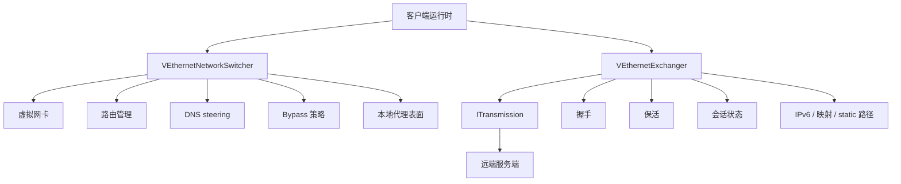
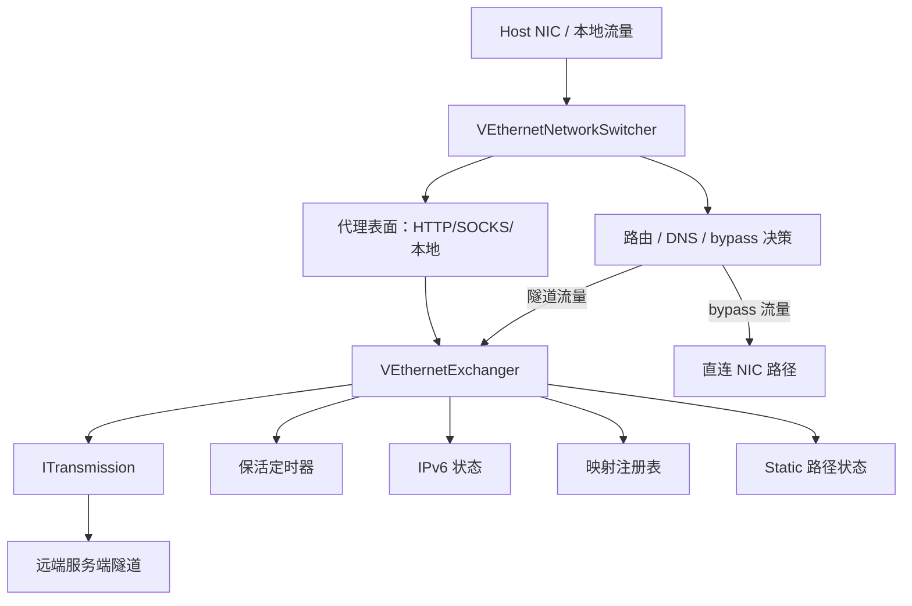
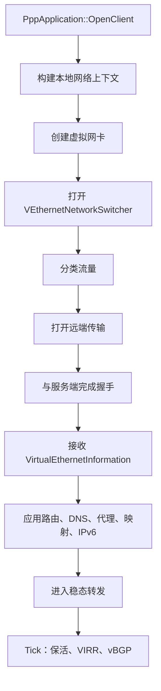
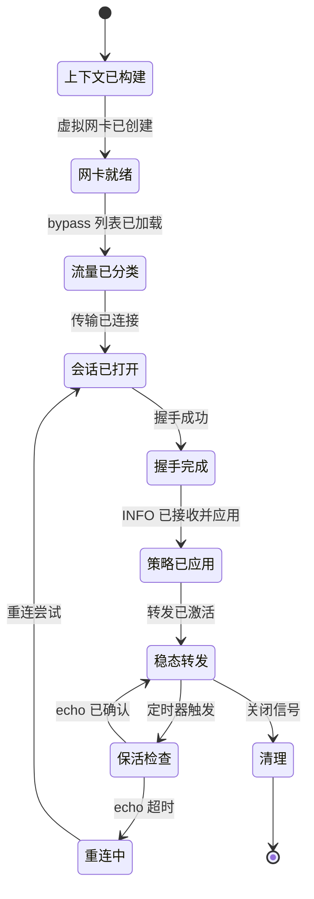
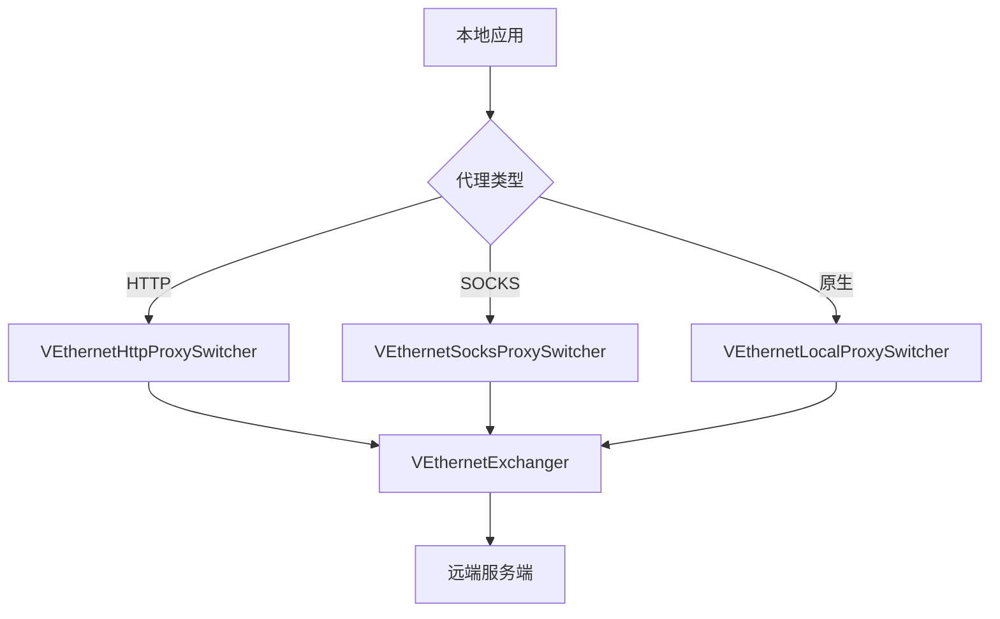
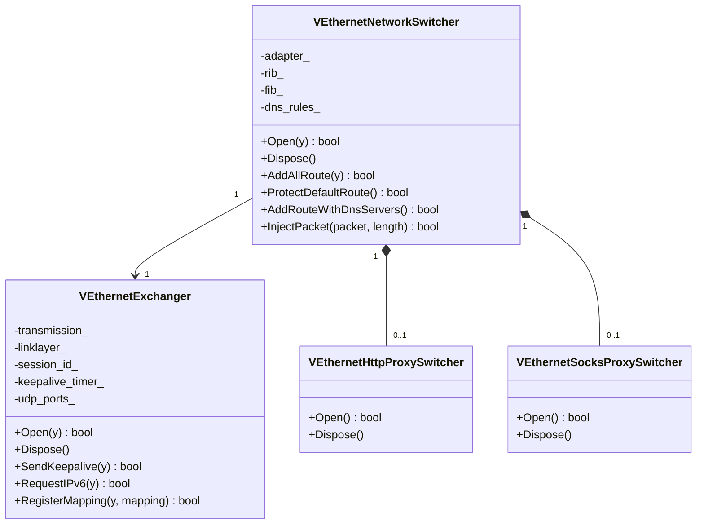
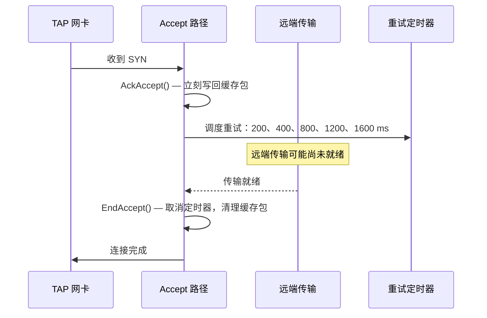
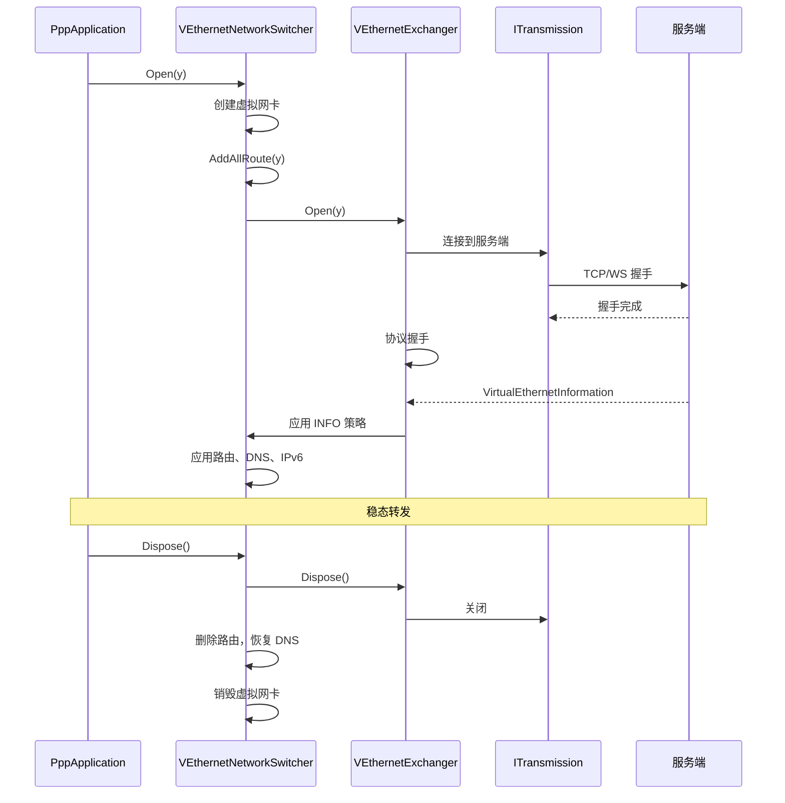

# 客户端架构

[English Version](CLIENT_ARCHITECTURE.md)

## 范围

本文描述 `ppp/app/client/` 里的真实客户端运行时，不是通用 VPN 介绍。它是覆盖网络在宿主机侧的边缘节点。

---

## 运行时定位

客户端主要做两件事：

- 整形本地宿主网络
- 维护远端隧道会话

这两件事被明确拆成不同对象。



---

## 代码锚点

| 对象 | 作用 | 源文件 |
|------|------|--------|
| `VEthernetNetworkSwitcher` | 虚拟网卡、路由、DNS、bypass、本地流量分类、代理表面 | `ppp/app/client/VEthernetNetworkSwitcher.*` |
| `VEthernetExchanger` | 远端会话、握手、保活、密钥状态、static 路径、IPv6、映射 | `ppp/app/client/VEthernetExchanger.*` |
| `VEthernetLocalProxySwitcher` | 本地代理入口 | `ppp/app/client/proxys/VEthernetLocalProxySwitcher.*` |
| `VEthernetHttpProxySwitcher` | HTTP 代理入口 | `ppp/app/client/proxys/VEthernetHttpProxySwitcher.*` |
| `VEthernetSocksProxySwitcher` | SOCKS 代理入口 | `ppp/app/client/proxys/VEthernetSocksProxySwitcher.*` |

---

## 客户端拓扑图



---

## 核心拆分

两个核心类型是 `VEthernetNetworkSwitcher` 和 `VEthernetExchanger`。

这是最重要的架构边界。

| 类型 | 负责什么 |
|------|---------|
| `VEthernetNetworkSwitcher` | 虚拟网卡、路由、DNS、bypass、本地流量分类、代理表面 |
| `VEthernetExchanger` | 远端会话、握手、保活、密钥状态、static 路径、IPv6、映射 |

### 边界为何重要

如果把路由/DNS/bypass 和远端会话混到一个对象里，客户端就会同时承担本地网络副作用和控制面职责，代码会很快失去可维护性。

这条边界还允许独立演进：
- 传输协议变更只影响 `VEthernetExchanger`。
- 路由和 DNS 策略变更只影响 `VEthernetNetworkSwitcher`。

---

## 客户端启动流程



### 会话状态机



---

## `VEthernetNetworkSwitcher` 深度剖析

这个对象负责宿主机网络侧。

### 持有什么

| 字段 | 说明 |
|------|------|
| `adapter_` | 虚拟 NIC 引用 |
| `gateway_` | 物理网关地址 |
| `rib_` | 路由信息表 |
| `fib_` | 转发信息表 |
| `ribs_` | IP-list 来源 |
| `vbgp_` | vBGP 远程路由来源 |
| `dns_rules_` | DNS steering 规则 |
| `dns_serverss_` | DNS 服务器路由分配 |
| `proxy_` | 本地代理 switcher 引用 |
| `ipv6_state_` | IPv6 应用状态 |

### 关键方法

```cpp
/**
 * @brief 打开 network switcher 并准备宿主机环境。
 * @param y  异步操作的 yield 上下文。
 * @return   所有子系统成功打开时返回 true。
 * @note     创建虚拟网卡，应用路由、DNS 和 bypass 列表。
 */
bool Open(YieldContext& y) noexcept;

/**
 * @brief 关闭 switcher 并回滚所有宿主侧副作用。
 * @note  删除路由，恢复 DNS，销毁虚拟网卡。
 */
void Dispose() noexcept;

/**
 * @brief 从所有已配置来源添加所有路由。
 * @param y  异步 IP-list 加载的 yield 上下文。
 * @return   所有路由成功应用时返回 true。
 */
bool AddAllRoute(YieldContext& y) noexcept;

/**
 * @brief 保护默认路由不被隧道覆写。
 * @return 默认路由保护成功时返回 true。
 */
bool ProtectDefaultRoute() noexcept;

/**
 * @brief 为所有已配置 DNS 服务器添加直连路由。
 * @return 所有 DNS 服务器路由添加成功时返回 true。
 * @note  DNS 服务器有独立直连路由，确保在默认路由被重定向后仍然可达。
 */
bool AddRouteWithDnsServers() noexcept;

/**
 * @brief 将从服务端接收到的数据包重新注入虚拟网卡。
 * @param packet  从远端接收的数据包数据。
 * @param length  数据包长度。
 * @return        注入成功时返回 true。
 */
bool InjectPacket(const Byte* packet, int length) noexcept;
```

源文件：`ppp/app/client/VEthernetNetworkSwitcher.h`

### 它为什么属于 host-side

它做的是宿主机本地副作用：虚拟网卡、路由和 DNS 都是本机行为，不是远端会话行为。这些副作用必须在清理时撤销，并且必须与远端会话状态隔离。

---

## `VEthernetExchanger` 深度剖析

这个对象负责远端会话侧。

### 持有什么

| 字段 | 说明 |
|------|------|
| `transmission_` | 到服务端的活跃 `ITransmission` |
| `linklayer_` | `VirtualEthernetLinklayer` 动作处理器 |
| `session_id_` | `Int128` 会话标识符 |
| `keepalive_timer_` | 保活 echo 定时器 |
| `udp_ports_` | 活跃 UDP datagram port 映射 |
| `mappings_` | FRP 反向映射注册表 |
| `ipv6_lease_` | IPv6 地址租约（如已分配） |
| `static_path_` | Static 路径状态 |
| `traffic_in_` | 入流量字节计数器 |
| `traffic_out_` | 出流量字节计数器 |

### 关键方法

```cpp
/**
 * @brief 打开 exchanger 并建立远端会话。
 * @param y  握手协程的 yield 上下文。
 * @return   会话建立并开始转发时返回 true。
 */
bool Open(YieldContext& y) noexcept;

/**
 * @brief 关闭 exchanger 并释放远端会话。
 */
void Dispose() noexcept;

/**
 * @brief 向服务端发送保活 echo。
 * @param y  Yield 上下文。
 * @return   echo 发送成功时返回 true。
 * @note     如果服务端未在超时内响应，会话被认为死亡并触发重连。
 */
bool SendKeepalive(YieldContext& y) noexcept;

/**
 * @brief 向服务端请求 IPv6 地址。
 * @param y  Yield 上下文。
 * @return   收到并应用 IPv6 分配时返回 true。
 */
bool RequestIPv6(YieldContext& y) noexcept;

/**
 * @brief 向服务端注册反向映射。
 * @param y         Yield 上下文。
 * @param mapping   要注册的 FRP 映射。
 * @return          映射被接受时返回 true。
 */
bool RegisterMapping(YieldContext& y, const FrpMapping& mapping) noexcept;
```

源文件：`ppp/app/client/VEthernetExchanger.h`

### 它为什么属于 session-side

这个对象处理的是"单条远端会话如何存活、如何握手、如何维持状态"。它不负责本地路由和 DNS 整形。

---

## 本地代理表面

客户端通过以下入口暴露本地代理：



代理入口接受本地连接并把它们路由进隧道 exchanger。

---

## 宿主集成



---

## 常见联动

| 事件 | Switcher 动作 | Exchanger 动作 |
|------|-------------|--------------|
| 启动 | 创建网卡、添加路由、配置 DNS | 打开远端传输、完成握手 |
| 握手成功 | 应用返回的 INFO 策略 | 保存会话状态 |
| 远端策略变化 | 更新本地可达性、DNS 规则 | 重新注册映射 |
| 保活超时 | 无 | 触发重连 |
| VIRR 刷新 | 更新 bypass 路由 | 无 |
| IPv6 已分配 | 将 IPv6 应用到虚拟网卡 | 存储 IPv6 租约 |
| 关闭 | 清理本地副作用、删除路由、恢复 DNS | 释放远端会话 |

---

## `VEthernetExchanger` 实现要点

exchanger 根据解析到的远端 URI 创建不同传输类型：

| URI 格式 | 传输类型 |
|---------|---------|
| `ppp://host:port/` | 原始 TCP |
| `ppp://ws/host:port/` | WebSocket |
| `ppp://wss/host:port/` | TLS WebSocket |

exchanger 处理的特殊路径：

| 路径 | 说明 |
|------|------|
| Static echo | 使用 static UDP 的替代投递路径 |
| IPv6 请求/响应 | IPv6 地址分配流程 |
| Mux 启动/更新 | 多路复用协商 |
| UDP datagram ports | 每目标的 UDP 中继状态 |
| 连接密码选择 | 每连接密码协商 |

---

## `VEthernetNetworkSwitcher` 实现要点

switcher 还承担：

| 职责 | 说明 |
|------|------|
| 代理表面注册 | 注册本地 HTTP/SOCKS 代理监听器 |
| 本地包分类 | 把包分类为 bypass 或隧道 |
| Bypass 列表加载 | 加载并应用 IP bypass 列表 |
| IPv6 应用状态 | 应用来自服务端的 IPv6 地址分配 |
| 隧道相邻宿主变更 | 为隧道运行调整宿主网络 |

---

## 虚拟 TCP 接受恢复

TAP 侧的 TCP accept 路径有一条缓存 SYN/ACK 的重试链路。



重试计划：accept 状态仍 pending 时，按 200ms、400ms、800ms、1200ms、1600ms 重试。

`EndAccept()` 在连接完成后立即取消重试定时器。
`Finalize()` 作为安全兜底执行相同清理。

如果远端传输还没建立好，SYN 路径会保持 pending，等待对端 TCP 重传再次触发。该设计不会在这种短暂未就绪窗口里伪造 RST。

---

## 客户端生命周期所有权



---

## 客户端不是什么

| 错误描述 | 正确描述 |
|---------|---------|
| 只是一个拨号器 | 宿主侧控制与数据编排节点 |
| 只是一个路由编辑器 | 带会话管理的完整宿主集成层 |
| 服务端的对称对端 | 带本地网络副作用的客户端专用边缘节点 |
| 简单隧道端点 | 宿主网络层与 overlay 会话管理器的混合体 |

---

## 错误码参考

客户端相关的 `ppp::diagnostics::ErrorCode` 值（节选自 `ErrorCodes.def`）：

| ErrorCode | 说明 |
|-----------|------|
| `TunnelOpenFailed` | 虚拟网卡或 TAP 设备创建失败 |
| `TunnelListenFailed` | TAP 读循环无法启动 |
| `NetworkInterfaceUnavailable` | 指定网卡不存在 |
| `RouteAddFailed` | 无法向 OS 路由表添加路由 |
| `SessionHandshakeFailed` | 服务端握手未完成 |
| `KeepaliveTimeout` | 保活 echo 未得到确认 |
| `SessionQuotaExceeded` | 会话因配额被拒绝 |
| `IPv6ServerPrepareFailed` | IPv6 环境准备失败 |

---

## 相关文档

- [`ARCHITECTURE_CN.md`](ARCHITECTURE_CN.md)
- [`SERVER_ARCHITECTURE_CN.md`](SERVER_ARCHITECTURE_CN.md)
- [`TUNNEL_DESIGN_CN.md`](TUNNEL_DESIGN_CN.md)
- [`ROUTING_AND_DNS_CN.md`](ROUTING_AND_DNS_CN.md)
- [`LINKLAYER_PROTOCOL_CN.md`](LINKLAYER_PROTOCOL_CN.md)
- [`TRANSMISSION_CN.md`](TRANSMISSION_CN.md)
- [`HANDSHAKE_SEQUENCE_CN.md`](HANDSHAKE_SEQUENCE_CN.md)
- [`PLATFORMS_CN.md`](PLATFORMS_CN.md)
