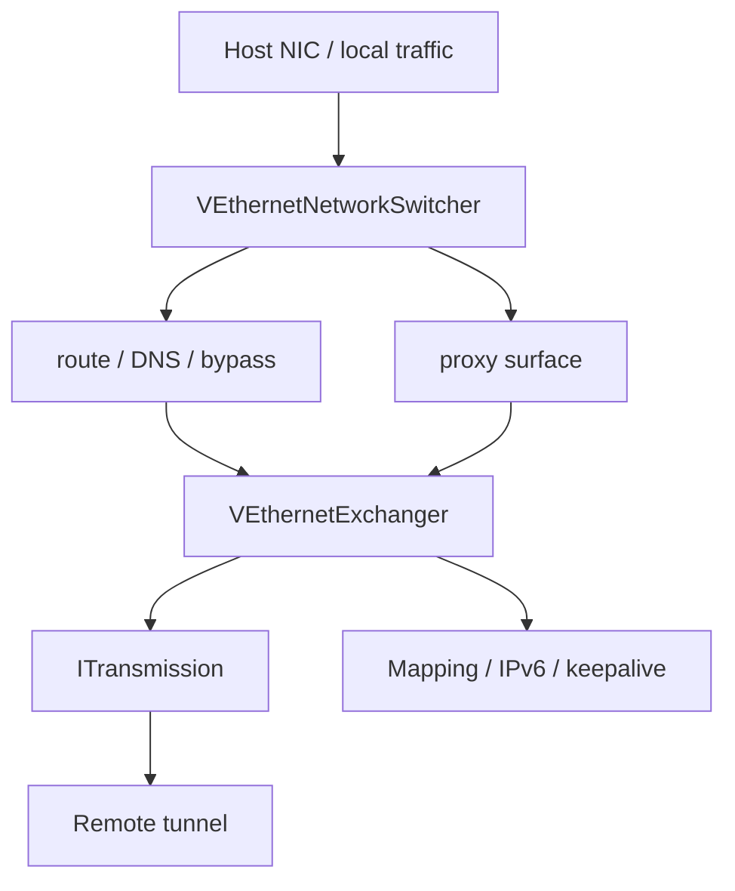
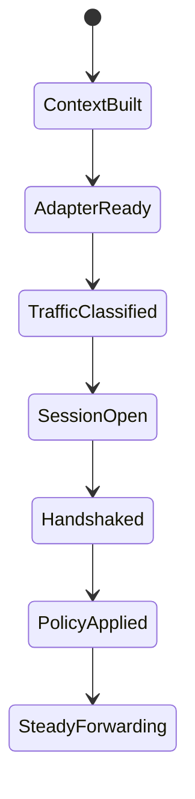

# 客户端架构

[English Version](CLIENT_ARCHITECTURE.md)

## 范围

本文描述 `ppp/app/client/` 里的真实客户端运行时，不是通用 VPN 介绍。它是覆盖网络在宿主机侧的边缘节点。

## 运行时定位

客户端主要做两件事：

- 整形本地宿主网络
- 维护远端隧道会话

这两件事被明确拆成不同对象。

## 代码锚点

客户端运行时并不是一个单对象系统，它由网络整形与会话交换两部分组成：

| 对象 | 作用 |
|---|---|
| `VEthernetNetworkSwitcher` | 虚拟网卡、路由、DNS、bypass、本地流量分类、代理表面 |
| `VEthernetExchanger` | 远端会话、握手、保活、密钥状态、static 路径、IPv6、映射 |
| `VEthernetLocalProxySwitcher` / `VEthernetHttpProxySwitcher` / `VEthernetSocksProxySwitcher` | 本地代理入口 |

## 客户端拓扑图

## 核心拆分

两个核心类型是：

- `VEthernetNetworkSwitcher`
- `VEthernetExchanger`

这是最重要的架构边界。

| 类型 | 负责什么 |
|---|---|
| `VEthernetNetworkSwitcher` | 虚拟网卡、路由、DNS、bypass、本地流量分类、代理表面 |
| `VEthernetExchanger` | 远端会话、握手、保活、密钥状态、static 路径、IPv6、映射 |

### 边界为何重要

如果把路由/DNS/bypass 和远端会话混到一个对象里，客户端就会同时承担本地网络副作用和控制面职责，代码会很快失去可维护性。

## 客户端流程

1. 构建本地网络上下文
2. 创建虚拟网卡环境
3. 分类流量
4. 打开远端传输会话
5. 完成握手
6. 交换会话信息
7. 应用路由、DNS、代理、映射和可选 IPv6 状态
8. 进入稳态转发

## `VEthernetNetworkSwitcher`

这个对象负责宿主机网络侧：

- 创建虚拟网卡
- 修改路由
- 修改 DNS
- 流量分类
- bypass 策略
- 把服务端返回的数据重新注入本地网络

它决定哪些流量进入隧道，哪些留在本地。

### 它为什么属于 host-side

它做的是宿主机本地副作用：虚拟网卡、路由和 DNS 都是本机行为，不是远端会话行为。

## `VEthernetExchanger`

这个对象负责远端会话侧：

- 建立传输连接
- 完成客户端握手
- 维持会话保活
- 管理密钥
- 维护 static 路径状态
- 注册映射
- 应用 IPv6

### 它为什么属于 session-side

这个对象处理的是“单条远端会话如何存活、如何握手、如何维持状态”。它不负责本地网络整形本身。

## 宿主集成

客户端也负责本地代理表面和平台相关虚拟网卡行为。因此它是宿主集成层，而不是单纯的拨号器。

## 常见联动

| 事件 | switcher 动作 | exchanger 动作 |
|---|---|---|
| 启动 | 创建 adapter / route / DNS | 打开远端连接 |
| 握手成功 | 应用返回策略 | 保存会话状态 |
| 远端策略变化 | 更新本地可达性 | 重新注册映射 |
| 退出 | 清理本地副作用 | 释放远端会话 |

## `VEthernetExchanger` 的实现要点

从源码可以确认，这个对象在建立连接时会根据协议类型选择 TCP、WebSocket 或 SSL WebSocket 传输；它还会负责：

- 请求 IPv6 配置
- 维护 datagram ports
- 处理 mux 生命周期
- 处理 static echo
- 组织 keepalive

## `VEthernetNetworkSwitcher` 的实现要点

从头文件可以直接看出，它还承担：

- 路由表管理
- DNS 规则加载
- 保护网络与本机网络的分离
- TAP / VNetstack 侧输入输出
- IPv6 应用与恢复

## 虚拟 TCP 接受恢复

TAP 侧的 TCP accept 路径有一条缓存 SYN/ACK 的重试链路。当客户端侧 accept 流程进入 `AckAccept()` 时，会先把缓存包立刻写回虚拟网卡，然后在 accept 状态仍然未完成时，按 `200`、`400`、`800`、`1200`、`1600` 毫秒继续重试。

`EndAccept()` 在连接完成后会取消重试定时器并清理缓存包状态。`Finalize()` 也会做同样的兜底清理，避免缓存的 SYN/ACK 缓冲和定时器在关闭时泄漏。

如果远端传输还没建立好，SYN 路径会保持 pending，等待对端 TCP 重传再次触发流程。这个设计不会在这种短暂未就绪窗口里伪造一个 RST。

## 边界

route/DNS/bypass 留在 switcher 中，远端连接和握手留在 exchanger 中。这条边界是客户端设计的核心。

## 相关文档

- `ARCHITECTURE_CN.md`
- `SERVER_ARCHITECTURE_CN.md`
- `TUNNEL_DESIGN_CN.md`
