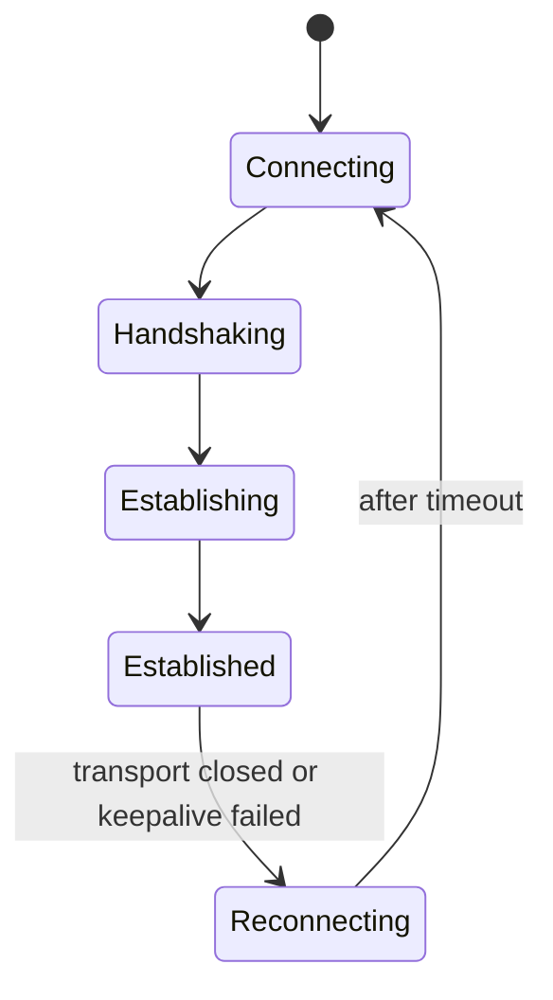
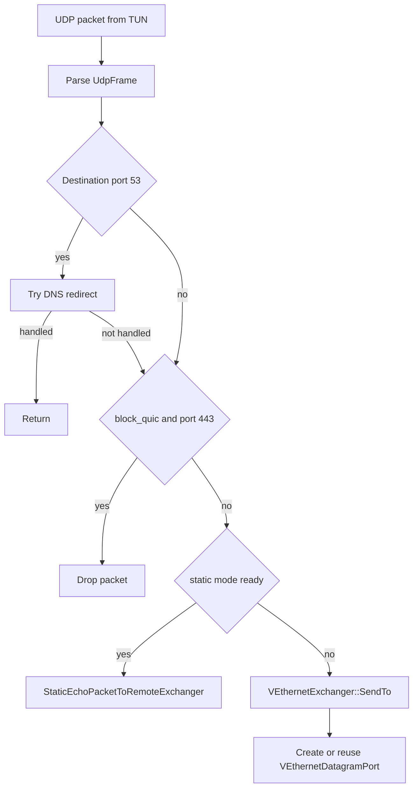
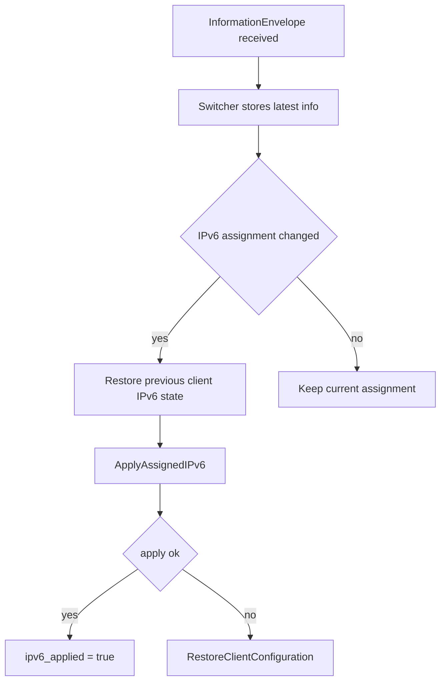
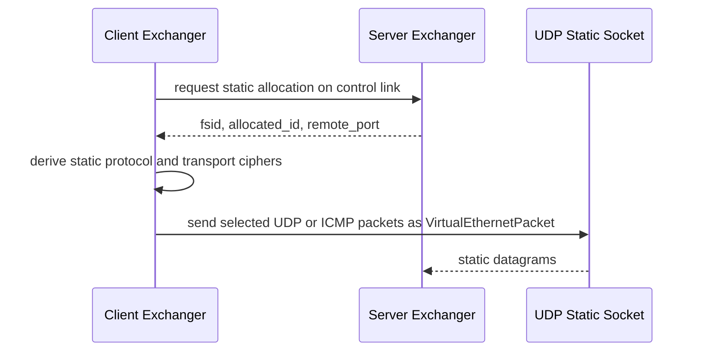
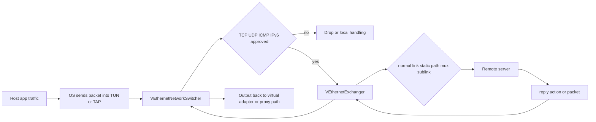

# 客户端架构

[English Version](CLIENT_ARCHITECTURE.md)

本文档基于 `ppp/app/client/` 下的 C++ 实现，解释 OPENPPP2 客户端运行时到底是如何组织的。这里不写理想化描述，不把它当成一个抽象意义上的“VPN 客户端”。这里只描述代码里真实存在的对象边界、控制路径、数据路径、重连机制、宿主机集成行为，以及客户端主动拒绝哪些不合法的协议方向。

本文档主要依据以下源码文件：

- `ppp/app/client/VEthernetNetworkSwitcher.cpp`
- `ppp/app/client/VEthernetExchanger.cpp`
- `ppp/app/client/VEthernetNetworkTcpipStack.cpp`
- `ppp/app/client/VEthernetNetworkTcpipConnection.cpp`
- `ppp/app/client/VEthernetDatagramPort.cpp`
- `ppp/app/client/proxys/*`

## 运行时定位

从代码事实看，客户端绝不只是一个“拨号端”。它在运行时扮演的是宿主机侧覆盖网络边缘节点。

它要负责：

- 持有并驱动本地虚拟网卡
- 管理宿主机路由与 DNS 状态
- 判断哪些流量应进入隧道
- 维持与服务端的长连接会话关系
- 暴露本地 HTTP 和 SOCKS 代理
- 注册反向 mapping
- 按服务端下发结果应用 IPv6
- 在需要时切换到 static 数据报路径

所以这个客户端的真实形态，不是“一个套接字 + 一个加密隧道”这么简单，而是“宿主网络集成层 + 远端会话层”的组合。

## 核心拆分

客户端最核心的几个类型是：

- `VEthernetNetworkSwitcher`
- `VEthernetExchanger`
- `VEthernetNetworkTcpipStack`
- `VEthernetNetworkTcpipConnection`
- `VEthernetDatagramPort`
- `VEthernetHttpProxySwitcher`
- `VEthernetSocksProxySwitcher`

这里最重要的边界，是 `VEthernetNetworkSwitcher` 和 `VEthernetExchanger` 的拆分。

`VEthernetNetworkSwitcher` 负责宿主机网络环境。它工作在 `ITap` 之上，知道底层物理网卡是谁，知道虚拟网卡是谁，负责加载 bypass 和 route-list，负责把路由写进操作系统，负责 DNS 行为，负责把从 TUN 或 TAP 收到的包分类处理，也负责把服务端回来的数据重新注入本地网络环境。

`VEthernetExchanger` 负责远端会话关系。它打开真正的传输层连接，做客户端侧握手，维持 keepalive，创建 datagram port，注册 mapping，维护 static 模式状态，维护 MUX，接收服务端信息信封并把变化回送给 switcher。

这种拆分非常关键。因为宿主机路由和 DNS 策略的生命周期，通常比某一次具体的 TCP 或 WebSocket 连接更长。会话可以断开重连，但宿主机集成模型不能因此被打散。

## 启动对象图

客户端从 `main.cpp` 进入，之后主路径落到 `VEthernetNetworkSwitcher::Open(...)` 和 `VEthernetExchanger::Open()`。

整体对象装配图可以概括为：

```mermaid
flowchart TD
    A[main.cpp client mode] --> B[Create ITap]
    B --> C[Construct VEthernetNetworkSwitcher]
    C --> D[Inject runtime flags and preferences]
    D --> E[Load bypass lists and route lists]
    E --> F[Load DNS rules]
    F --> G[VEthernetNetworkSwitcher::Open(tap)]
    G --> H[Resolve underlying NIC]
    G --> I[Open VEthernet base]
    G --> J[Resolve TUN or TAP NIC]
    G --> K[Create QoS]
    G --> L[Create VEthernetExchanger]
    L --> M[VEthernetExchanger::Open()]
    G --> N[Open local HTTP proxy if configured]
    G --> O[Open local SOCKS proxy if configured]
    G --> P[Prepare aggregator if static mode requires it]
    G --> Q[Load route tables into FIB]
    G --> R[Install OS routes and DNS behavior]
```

## Open 阶段到底做了什么

`VEthernetNetworkSwitcher::Open(...)` 是客户端把“配置”变成“运行时”的核心函数。

这个函数的实际职责非常重。

第一步，在桌面平台上解析当前承载 VPN 的底层物理网卡。代码会找到 underlying NIC，并在有 preferred NIC 或 preferred gateway 配置时把偏好应用进去。随后调用 `FixUnderlyingNgw()`，尽早修补物理网卡默认网关相关路由，因为后续整个 overlay 都假设宿主机仍然能通过真实网络到达远端服务端。

第二步，调用 `VEthernet::Open(tap)` 打开虚拟以太网基础层。这一步之后，switcher 才真正具备对虚拟网卡收发包的所有权。随后代码继续解析虚拟网卡在操作系统里的接口对象，因为后面的路由与 DNS 修改并不能只依赖 `ITap` 抽象。

第三步，创建统计对象和 QoS 对象。Linux 上如果启用了 protect mode，还可能额外创建 `ProtectorNetwork`。这个对象的目的不是“增强功能”，而是避免客户端自己的承载流量被错误吸进 VPN 造成环路。

第四步，构造 `VEthernetExchanger` 并立即 `Open()`。也在这个阶段创建本地 HTTP 代理与 SOCKS 代理 switcher。这里能看出代理能力并不是后挂的附属组件，而是客户端主运行时的一部分。

第五步，如果启用了 static UDP 模式且配置要求 aggregator，则在这里准备聚合器对象。这说明 static 模式不是一个简单开关，而是客户端上单独的一条数据路径。

第六步，把 bypass 和 route-list 加载进客户端路由结构里，构造 route information table，再在可用时构造 forwarding information table。

最后，在 hosted network 模式下，把路由和 DNS 真正写进操作系统。Windows 和 Unix 分支行为不同。Windows 还会额外刷新系统 DNS 缓存，并尝试删除物理网卡默认路由。Unix 则通过平台辅助逻辑写 DNS 配置。两边最后都会进入默认路由保护逻辑。

## 为什么宿主网络一定要归 Switcher 管

从职责边界看，宿主机集成只能由 switcher 管理。

它实际持有或直接驱动：

- `underlying_ni_`
- `tun_ni_`
- 路由安装与回收
- bypass 与 route-list 加载
- DNS 规则与 DNS 服务器行为
- 报文重新注入 TUN 或 TAP
- IPv6 应用与恢复
- 平台辅助逻辑，例如 Windows 的 paper-airplane 控制器

这些事情如果放到 exchanger，会导致会话重连与宿主机状态搅在一起。当前这种结构保证了 transmission 可以重连，而宿主网络模型继续保留。

## 客户端会话生命周期

`VEthernetExchanger::Open()` 本身很薄，它只是把真正逻辑投递到协程环境中。核心生命周期在 `VEthernetExchanger::Loopback(...)`。

这个循环明确做了下面这些动作：

1. 切换到 connecting 状态
2. 打开 transmission
3. 执行 `HandshakeServer(y, GetId(), true)`
4. 通过 `EchoLanToRemoteExchanger(...)` 把本地 LAN 上下文告诉服务端
5. 切换到 established 状态
6. 发送请求的 IPv6 配置
7. 注册全部 mapping
8. 申请 static 模式分配
9. 进入 `Run(...)` 主循环
10. 清理 static 状态
11. 注销 mapping
12. 释放 transmission 并等待重连超时后重试

所以客户端不是“连接成功后就完了”。它是围绕一个显式的重连生命周期构建的。



## 宿主平面与控制平面

理解客户端最好的方式，是把它拆成两个循环。

宿主平面由虚拟网卡回调驱动，入口主要在 switcher。

控制平面由远端 transmission 的链路层动作驱动，主要由 exchanger 响应。

switcher 负责决定哪些本地流量值得进入 overlay。exchanger 负责把这些决定编码成链路层动作，例如 `NAT`、`SENDTO`、`ECHO`、static packet、mapping 注册、MUX 子连接等。

## 来自虚拟网卡的 IPv4 报文准入

`VEthernetNetworkSwitcher::OnPacketInput(ip_hdr* ...)` 很有选择性，不是随便来个 IPv4 包都送进 tunnel。

进入 `exchanger->Nat(...)` 之前，它要求：

- 这个包来自 virtual network 路径
- 协议必须是 TCP、UDP 或 ICMP
- 当前存在 exchanger
- 当前存在 tap
- 目标地址不能是虚拟网卡自己的 IPv4
- 源地址必须等于虚拟网卡 IPv4
- 目标地址不能是 gateway
- 除广播外，目标地址必须落在预期子网里

这说明客户端转发的是“符合 overlay 语义的包”，而不是一个毫无限制的原始报文泵。

## 来自虚拟网卡的 IPv6 报文准入

IPv6 路径比 IPv4 更严格。

`VEthernetNetworkSwitcher::OnPacketInput(Byte* ...)` 一开始就调用 `IsApprovedIPv6Packet(...)`。而这个检查的条件非常明确：

- 客户端已经成功应用过 IPv6
- 分配模式必须是 `Nat66` 或 `Gua`
- 分配前缀长度必须正好是 `128`
- 分配地址必须是合法 IPv6
- 报文源地址必须严格等于已分配地址

任一条件不满足，就拒绝该包，并写 debug log 说明原因。

这是一个非常重要的架构信号。客户端并不是拿到 IPv6 后就当作透明通道使用，而是在本地边缘上强制执行“源地址身份必须等于受管分配地址”的约束。

## UDP 路径

UDP 入口在 `VEthernetNetworkSwitcher::OnUdpPacketInput(...)`。

这段逻辑的决策链是：

第一，如果目标端口是 DNS，则优先尝试 `RedirectDnsServer(...)`。DNS 被特殊处理，不是因为它是 UDP，而是因为在整个 overlay 模型里，DNS 本身就是一类流量分流与策略控制能力。

第二，如果启用了 `block_quic_`，并且目标端口是 UDP 443，则直接丢弃。代码注释明确说明这是一个简单直接的 QUIC 阻断路径，用于避免不必要的远端 UDP 负担。

第三，如果启用了 static 模式，则根据配置决定 DNS、QUIC 或更泛化的 UDP 流量是否走 static echo 路径。只有 static 已完成分配，相关流量才会进入 `StaticEchoPacketToRemoteExchanger(...)`。

第四，如果不走 DNS redirect，不走 QUIC drop，不走 static 路径，则把源和目标转成 UDP endpoint，交给 `VEthernetExchanger::SendTo(...)`。



## DatagramPort 为什么存在

`VEthernetDatagramPort` 的存在说明客户端 UDP 不是简单的“发一下就完”。

客户端需要按源 endpoint 持有状态。这样它才能：

- 复用本地 UDP socket
- 让回包能重新映射回正确的源语义
- 在 datagram 对象已经释放时仍能直接把包交回 switcher 输出

服务端回来的 UDP 数据在 `VEthernetExchanger::OnSendTo(...)` 中进入 `ReceiveFromDestination(...)`。如果源 endpoint 对应的 datagram port 还在，就交给 datagram 对象；如果已经不存在，但包仍有效，也可以让 switcher 用 `DatagramOutput(...)` 直接回注本地网络。

因此客户端 UDP 架构既有状态，又允许部分无状态回落。

## ICMP 路径

`VEthernetNetworkSwitcher::OnIcmpPacketInput(...)` 的复杂度明显高于很多简化 VPN 实现。

它会检查 exchanger、tap、allocator、ICMP frame、TTL 等条件，然后区分：

- 发往 gateway 的报文
- TTL 已经接近耗尽的报文
- 需要正常送入远端或本地回显逻辑的报文

辅助函数 `ER(...)`、`TE(...)`、`ERORTE(...)` 表明客户端可以合成 ICMP 相关应答或错误，而不是只做透明透传。

这对运维排障很重要。一个 overlay 边缘如果不能给出合理 ICMP 反馈，实际使用时会非常难诊断。

## TCP 路径

TCP 没有复用 UDP 的简单模型，而是单独拆成：

- `VEthernetNetworkTcpipStack`
- `VEthernetNetworkTcpipConnection`

原因很直接。TCP 需要处理连接建立、流式 payload、关闭语义、连接生命周期，以及在某些情况下参与 MUX。这些行为都不适合用单纯的数据报 endpoint 模型来表达。

因此整个客户端运行时形成了三层不同粒度：

- switcher 负责报文层决策
- datagram port 负责 UDP 源端点级状态
- tcpip connection 负责 TCP 连接级状态

这是客户端在复杂度上还能维持可读性的关键原因之一。

## Information Envelope 与运行时重配置

服务端可以给客户端下发 `VirtualEthernetInformation` 或 `InformationEnvelope`。客户端入口在 `VEthernetExchanger::OnInformation(...)`。

这个处理器会把任务投递回客户端 io context，保存最新的信息对象，记录原始 extended JSON 和解析后的 IPv6 字段，然后调用 `switcher_->OnInformation(...)`。

真正把服务端信息变成本地动作的地方，是 `VEthernetNetworkSwitcher::OnInformation(...)`。这里会：

- 保存最新信息
- 在 IPv6 变化时先恢复旧配置
- 尝试应用新 IPv6 分配
- 按 `BandwidthQoS` 调整 QoS
- 如果信息不再有效，则主动释放 transmission

这说明客户端并不把服务端信息当成“展示型元数据”，而是把它当成实时运行配置。

## IPv6 应用与恢复

`VEthernetNetworkSwitcher::ApplyAssignedIPv6(...)` 是客户端里最“基础设施化”的函数之一。

它会把服务端给出的 IPv6 分配真正应用到本地环境，包括：

- 地址
- 网关
- 路由前缀
- DNS 服务器

而且失败处理非常谨慎。应用失败时会调用 restore 逻辑回滚宿主机状态。如果服务端后来下发了不同的 IPv6 assignment，switcher 会先恢复旧状态，再应用新状态。

这意味着客户端把 IPv6 当成一份受管租约，而不是一段穿过 tunnel 的静态文本。



## 本地代理

客户端可以开启本地 HTTP 代理和 SOCKS 代理。它们在 switcher 的 `Open(...)` 阶段创建并打开，远端转发则依赖 exchanger。

这带来两个架构结论。

第一，本地应用并不一定要直接走虚拟网卡，也可以通过代理接入 overlay。

第二，本地代理与 tunnel 并不属于两个互相独立的运行时。它们共享同一套 exchanger 和会话状态，因此也共享同一故障域。

## 反向 Mapping 注册

在会话建立完成后，客户端会调用 `RegisterAllMappingPorts()`。连接结束时又会调用 `UnregisterAllMappingPorts()`。

这说明反向 mapping 是会话绑定的，不是“注册一次永久生效”。客户端暴露出去的服务入口，依赖当前会话身份与控制面关系。

从架构上看，这是合理的，因为 mapping 本身就是 tunnel 控制面的一部分。

## 客户端上的 Static 模式

static 模式虽然由主会话协商，但真正承载数据时走的是单独的数据报路径。

客户端在 established 状态里调用 `StaticEchoAllocatedToRemoteExchanger(y)`。服务端回到 `OnStatic(... fsid, session_id, remote_port ...)` 后，客户端要么清理预分配资源，要么保存 static 所需标识，并调用 `VirtualEthernetPacket::Ciphertext(...)` 派生 static 用的 protocol 和 transport cipher。

之后，配置允许的 UDP、DNS、QUIC、ICMP 都可能切到 static 路径，而不再走常规流式传输链路。

因此 static 模式不是一个小优化，而是客户端里一套独立的第二数据平面。



## 客户端上的 MUX

MUX 维护逻辑集中在 `VEthernetExchanger::DoMuxEvents()`。

代码表明，只有在以下条件成立时客户端才会创建 `vmux::vmux_net`：

- `mux_` 连接数不是 0
- 当前网络状态已经 established
- 现有 `vmux_net` 不存在或者已经不健康

之后客户端会选择 scheduler，创建 `vmux_net`，注入配置和 allocator，并在需要时通过 `ConnectTransmission(...)` 建立额外传输连接。这些额外连接用的是 `HandshakeServer(y, GetId(), false)`，而不是主会话建立时的那条路径。这正是代码层面证明：MUX 子连接是附属于既有 session identity 的额外连接，而不是新的主会话。

同时，一旦 VLAN、连接数或者健康状态不再匹配，客户端也会主动拆掉 MUX。

## 周期维护

客户端运行时不是一个“连上就放着不管”的系统。`VEthernetExchanger::Update()` 定期执行：

- echo keepalive 发送
- MUX 维护
- 链路 keepalive 检查
- datagram 超时更新
- mapping 超时更新

这是很好的结构化设计。会话对象负责维护它自己拥有的资源，而不是把所有周期逻辑塞进一个全局定时器函数里。

## 防御性拒绝路径

客户端架构最值得注意的地方之一，是它明确拒绝某些入站动作。

以下方法在客户端侧会直接 `return false`，并且注释里明确写着 suspected malicious attack：

- `OnPush(...)`
- `OnConnect(...)`
- `OnConnectOK(...)`
- `OnDisconnect(...)`
- `OnStatic(...)` 无参数版本

这说明虽然客户端与服务端共享一套链路层动作词汇，但并不是每个动作在任意方向上都合法。客户端只接受那些符合自己角色的方向。方向不合法，不是被当成无害噪音，而是被当成潜在攻击。

这是一个非常重要的安全边界。

## 数据路径总览

客户端的数据平面可以概括为：



## 架构层面的直接结论

从源码结构可以直接得到几个结论。

第一，客户端在多个层面上都是强状态化的。它同时维护宿主机状态、传输状态、datagram 状态、TCP 连接状态、mapping 状态、static 状态、IPv6 assignment 状态。

第二，客户端是强策略感知的。DNS、bypass、route-list、preferred NIC、preferred gateway、QUIC block、IPv6 源地址约束，这些都不是外部附加策略，而是直接写进了运行时代码。

第三，客户端与服务端虽然协议词汇共享，但行为并不完全对称。那些拒绝路径已经足以证明角色合法性是协议的一部分。

第四，重连是设计中心，不是补丁逻辑。exchanger 天生就是要在不重建整个 switcher 的前提下反复断线重连。

## 建议源码阅读顺序

如果要继续沿着源码往下读，最有效的顺序是：

1. `VEthernetNetworkSwitcher::Open(...)`
2. `VEthernetExchanger::Loopback(...)`
3. `VEthernetNetworkSwitcher::OnPacketInput(...)`
4. `VEthernetNetworkSwitcher::OnUdpPacketInput(...)`
5. `VEthernetNetworkSwitcher::OnIcmpPacketInput(...)`
6. `VEthernetExchanger::OnInformation(...)`
7. `VEthernetNetworkSwitcher::ApplyAssignedIPv6(...)`
8. `VEthernetExchanger::DoMuxEvents()`
9. `VEthernetExchanger::SendTo(...)` 与 `ReceiveFromDestination(...)`
10. `ppp/app/client/proxys/` 下各代理类

## 结论

客户端架构最准确的理解方式，是把它看成“宿主机集成的 overlay 边缘节点”。

它不是只负责连上服务端。它负责把本地报文、本地 socket、本地路由、本地 DNS 策略、本地代理流量、本地 IPv6 状态，统一翻译成一个可重连、可管控、可分流、可附带 static 和 MUX 子路径的远端覆盖网络关系。而 `switcher + exchanger` 这一核心拆分，正是让这个复杂运行时仍然可理解、可维护的关键设计。
