# 客户端架构

[English Version](CLIENT_ARCHITECTURE.md)

## 文档范围

本文档基于 `ppp/app/client/` 下的 C++ 实现，详细解释 OPENPPP2 客户端运行时的架构设计。这里不写理想化描述，不把它当成一个抽象意义上的"VPN 客户端"。这里只描述代码里真实存在的对象边界、控制路径、数据路径、重连机制、宿主机集成行为，以及客户端主动拒绝哪些不合法的协议方向。

OPENPPP2 客户端不仅仅是一个"拨号端"，它在运行时扮演的是宿主机侧覆盖网络边缘节点。这是一个虚拟以太网基础设施产品的重要组成部分，与传统 VPN 客户端有本质区别。

## 运行时定位

从代码事实看，客户端绝不只是一个"拨号端"。它在运行时扮演的是宿主机侧覆盖网络边缘节点。

### 核心职责

| 职责 | 说明 | 对应组件 |
|------|------|----------|
| 持有并驱动本地虚拟网卡 | 创建和管理 TUN/TAP 虚拟接口 | `VEthernetNetworkSwitcher` |
| 管理宿主机路由与 DNS 状态 | 修改系统路由表和 DNS 配置 | `VEthernetNetworkSwitcher` |
| 判断哪些流量应进入隧道 | 流量分类和 bypass 策略 | `VEthernetNetworkSwitcher` |
| 维持与服务端的长连接会话关系 | 保持与服务器的持久连接 | `VEthernetExchanger` |
| 暴露本地 HTTP 和 SOCKS 代理 | 提供本地代理服务 | `VEthernetHttpProxySwitcher`, `VEthernetSocksProxySwitcher` |
| 注册反向 mapping | 向服务端注册端口映射 | `VEthernetExchanger` |
| 按服务端下发结果应用 IPv6 | 应用服务端分配的 IPv6 地址 | `VEthernetExchanger` |
| 在需要时切换到 static 数据报路径 | 支持 UDP static 路径 | `VEthernetDatagramPort` |

所以这个客户端的真实形态，不是"一个套接字 + 一个加密隧道"这么简单，而是"宿主网络集成层 + 远端会话层"的组合。

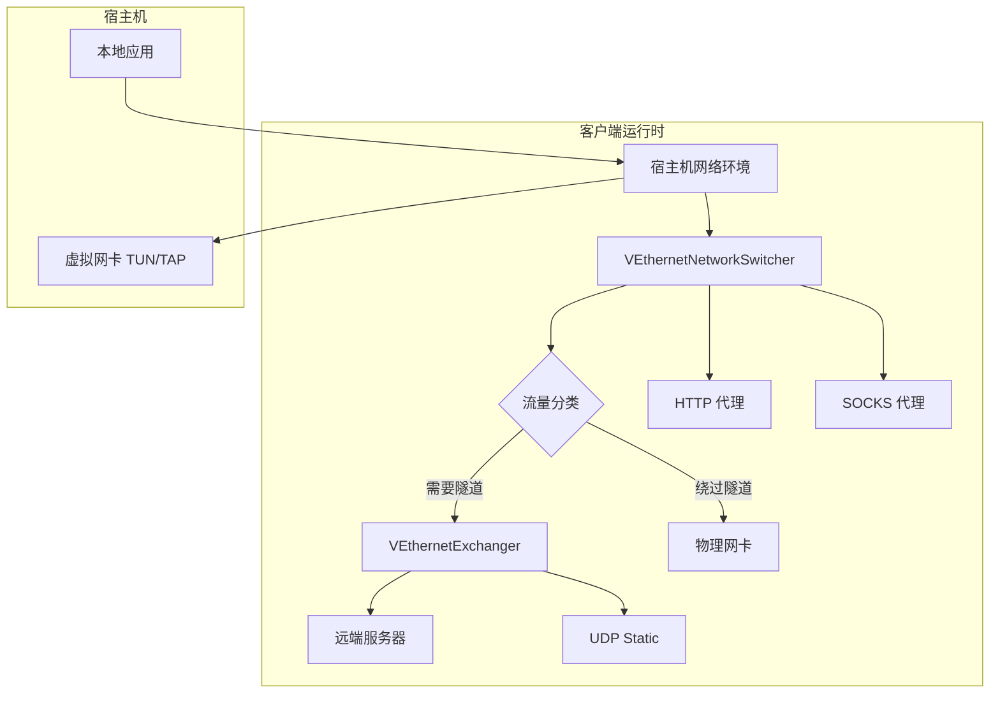

## 核心拆分

客户端最核心的几个类型构成了整个运行时：

### 核心类型列表

| 类型 | 职责 | 源码位置 |
|------|------|----------|
| `VEthernetNetworkSwitcher` | 宿主机网络环境管理 | `VEthernetNetworkSwitcher.*` |
| `VEthernetExchanger` | 远端会话关系管理 | `VEthernetExchanger.*` |
| `VEthernetNetworkTcpipStack` | TCP/IP 协议栈 | `VEthernetNetworkTcpipStack.*` |
| `VEthernetNetworkTcpipConnection` | TCP 连接管理 | `VEthernetNetworkTcpipConnection.*` |
| `VEthernetDatagramPort` | UDP 数据报端口 | `VEthernetDatagramPort.*` |
| `VEthernetHttpProxySwitcher` | HTTP 代理 | `VEthernetHttpProxySwitcher.*` |
| `VEthernetSocksProxySwitcher` | SOCKS 代理 | `VEthernetSocksProxySwitcher.*` |

这里最重要的边界，是 `VEthernetNetworkSwitcher` 和 `VEthernetExchanger` 的拆分。

### Switcher 与 Exchanger 的职责分离

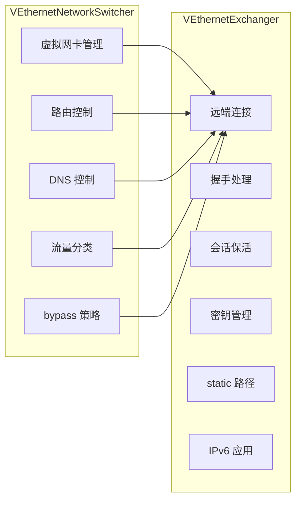

**VEthernetNetworkSwitcher** 负责宿主机网络环境。它工作在 `ITap` 之上，知道底层物理网卡是谁，知道虚拟网卡是谁，负责加载 bypass 和 route-list，负责把路由写进操作系统，负责 DNS 行为，负责把从 TUN 或 TAP 收到的包分类处理，也负责把服务端回来的数据重新注入本地网络环境。

**VEthernetExchanger** 负责远端会话关系。它打开真正的传输层连接，做客户端侧握手，维持 keepalive，创建 datagram port，注册 mapping，维护 static 模式状态，维护 MUX，接收服务端信息信封并把变化回送给 switcher。

这种拆分使得：
- 网络层策略（路由、DNS、bypass）与传输层逻辑（连接、会话、密钥）分离
- 便于独立测试和维护
- 支持灵活的扩展机制

## VEthernetNetworkSwitcher 详解

### 功能概述

`VEthernetNetworkSwitcher` 是客户端网络环境管理的核心，负责：

| 功能 | 说明 |
|------|------|
| 虚拟网卡创建 | 创建 TUN/TAP 接口，配置 IP 地址 |
| 路由管理 | 添加、删除路由表项 |
| DNS 配置 | 修改系统 DNS 服务器 |
| 流量分类 | 决定哪些流量走隧道，哪些 bypass |
| 代理服务 | 启动和管理 HTTP/SOCKS 代理 |
| 数据转发 | 将本地流量转发到隧道 |

### 虚拟网卡配置

| 参数 | 说明 | 默认值 |
|------|------|--------|
| `--tun` | 虚拟网卡名称 | 平台相关 |
| `--tun-ip` | 虚拟网卡 IP 地址 | 10.0.0.2 |
| `--tun-gw` | 虚拟网卡网关 | 10.0.0.1 |
| `--tun-mask` | 子网掩码 | 30 位 |
| `--tun-host` | 是否作为首选网络 | yes |

### 平台差异

| 平台 | 接口类型 | 驱动方式 | 默认名称 |
|------|----------|----------|----------|
| Windows | TAP | Windows TUN/TAP driver | PPP |
| Linux | TUN | tun/tap kernel module | ppp |
| macOS | utun | utun interface | utun0 |
| Android | TUN | VPN Service API | tun0 |

### 流量分类逻辑

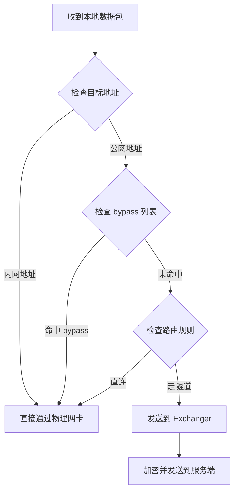

### bypass 机制

bypass 机制允许特定流量绕过隧道，常见用途：

| bypass 类型 | 说明 | 配置方式 |
|-------------|------|----------|
| IP bypass | 指定 IP 或 IP 段直连 | `--bypass` 参数 |
| 域名 bypass | 指定域名直连 | DNS 规则文件 |
| 进程 bypass | 指定进程流量直连 | 平台特定实现 |

## VEthernetExchanger 详解

### 功能概述

`VEthernetExchanger` 是客户端与服务端之间的会话管理层，负责：

| 功能 | 说明 |
|------|------|
| 建立连接 | 建立与服务器的传输层连接 |
| 握手处理 | 完成客户端侧握手和密钥交换 |
| 会话保活 | 维持长连接的 keepalive |
| 密钥管理 | 管理会话密钥 |
| static 路径 | 管理 UDP static 数据路径 |
| IPv6 管理 | 应用服务端下发的 IPv6 配置 |
| 端口映射 | 向服务端注册反向映射 |

### 连接建立流程

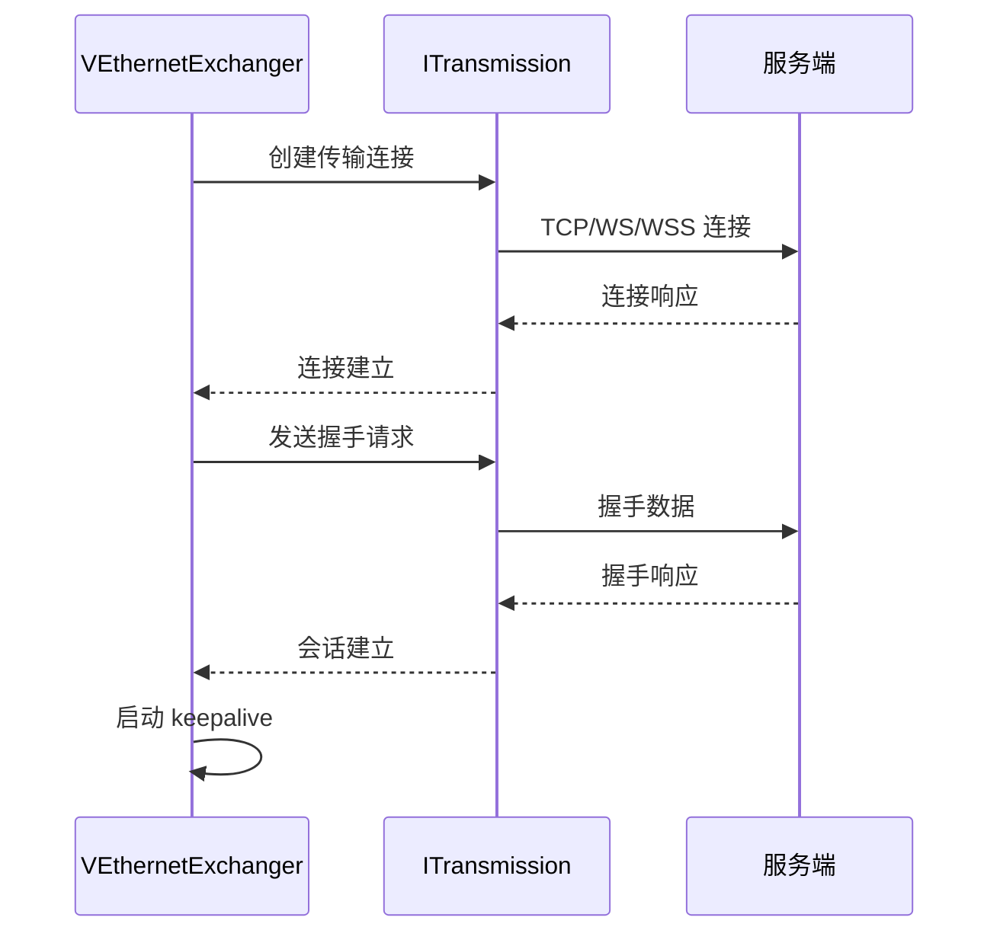

### keepalive 机制

| 参数 | 说明 | 默认值 |
|------|------|--------|
| `keep-alived` | keepalive 间隔范围 | [1, 20] 秒 |
| `inactive.timeout` | 空闲超时 | 60 秒 |

### 密钥交换

客户端使用预共享密钥与 `ivv` 参数派生会话密钥：

| 参数 | 说明 |
|------|------|
| `protocol-key` | 协议层加密密钥 |
| `transport-key` | 传输层加密密钥 |
| `ivv` | 每次会话动态生成 |

### static 路径

当启用 static 模式时，`VEthernetExchanger` 会创建 `VEthernetDatagramPort` 用于 UDP 数据传输：

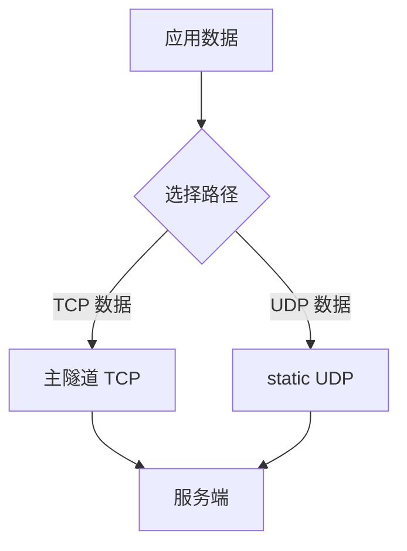

| 参数 | 说明 |
|------|------|
| `--tun-static` | 启用 static 模式 |
| `static.keep-alived` | static 保活间隔 |
| `static.dns` | 启用 static DNS |
| `static.quic` | 启用 QUIC 支持 |
| `static.icmp` | 启用 ICMP 支持 |

## VEthernetNetworkTcpipStack 详解

### TCP/IP 协议栈

`VEthernetNetworkTcpipStack` 实现了客户端的 TCP/IP 协议栈，处理隧道内的 TCP 数据：

| 功能 | 说明 |
|------|------|
| TCP 连接管理 | 处理 TCP 连接的建立和维护 |
| 数据缓冲 | 管理发送和接收缓冲区 |
| 流量控制 | 实现 TCP 流量控制 |
| 拥塞控制 | 实现拥塞避免算法 |

### 连接处理流程

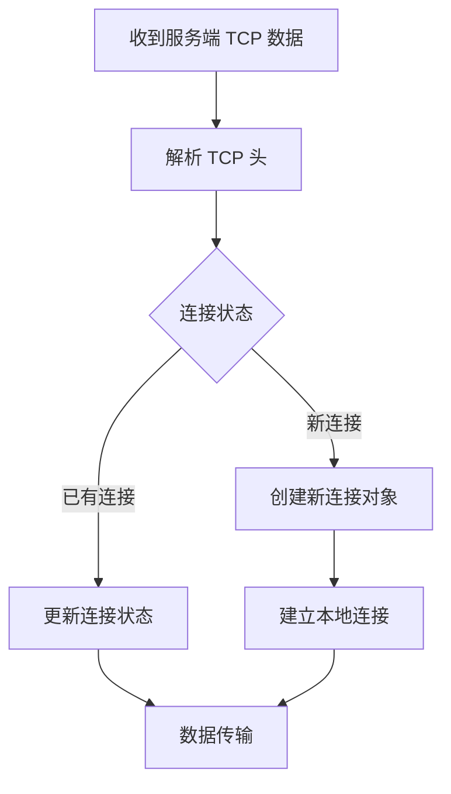

## HTTP 和 SOCKS 代理

### HTTP 代理

`VEthernetHttpProxySwitcher` 提供 HTTP 代理服务：

| 参数 | 说明 |
|------|------|
| `http-proxy.bind` | 绑定地址 |
| `http-proxy.port` | 端口 |

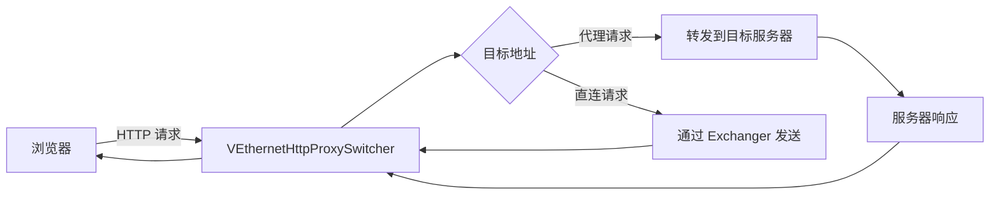

### SOCKS 代理

`VEthernetSocksProxySwitcher` 提供 SOCKS 代理服务：

| 参数 | 说明 |
|------|------|
| `socks-proxy.bind` | 绑定地址 |
| `socks-proxy.port` | 端口 |
| `socks-proxy.username` | 认证用户名 |
| `socks-proxy.password` | 认证密码 |

### 代理认证

| 方法 | 支持 | 说明 |
|------|------|------|
| 无认证 | ✅ | 不需要认证 |
| 基本认证 | ✅ | 用户名/密码 |
| GSSAPI | ❌ | 不支持 |

## 端口映射（Reverse Mapping）

### 功能说明

客户端可以向服务端注册端口映射，将本地服务暴露到公网：

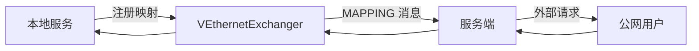

### 配置参数

| 参数 | 说明 |
|------|------|
| `mappings[].local-ip` | 本地 IP |
| `mappings[].local-port` | 本地端口 |
| `mappings[].protocol` | 协议类型 |
| `mappings[].remote-port` | 远程端口 |

### 使用场景

| 场景 | 说明 |
|------|------|
| 暴露本地 Web 服务 | 将本地 80 端口映射到公网 |
| 远程桌面 | 将本地 3389 端口映射到公网 |
| 游戏服务器 | 将本地游戏端口映射到公网 |

## IPv6 支持

### IPv6 模式

| 模式 | 说明 |
|------|------|
| none | 不分配 IPv6 |
| NAT66 | NAT66 模式 |
| GUA | 全局单播地址 |

### IPv6 配置流程

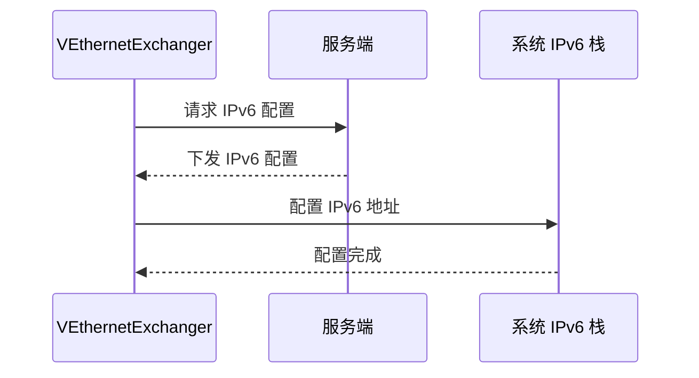

### IPv6 地址格式

| 类型 | 说明 | 示例 |
|------|------|------|
| GUA | 全局单播地址 | 2001:db8::1 |
| ULA | 唯一本地地址 | fd00::/8 |
| Link-local | 链路本地地址 | fe80::/10 |

## MUX 多路复用

### 功能说明

MUX 允许在单个连接上复用多个数据流：

| 参数 | 说明 |
|------|------|
| `mux.connect.timeout` | 连接超时 |
| `mux.inactive.timeout` | 空闲超时 |
| `mux.congestions` | 拥塞窗口大小 |
| `mux.keep-alived` | keepalive 间隔 |

### MUX 数据流

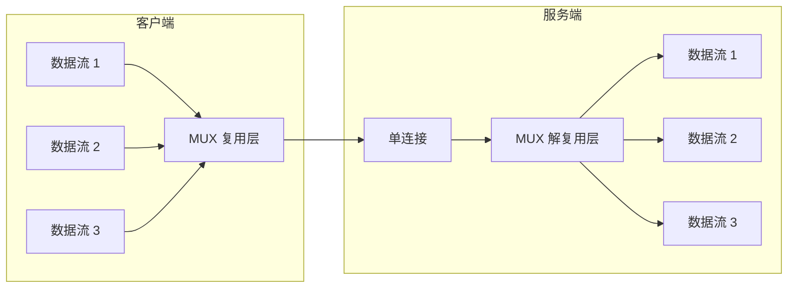

## 路由与 DNS 控制

### 路由策略

客户端支持灵活的路由策略：

| 策略 | 说明 | 配置 |
|------|------|------|
| 全局路由 | 所有流量通过隧道 | 默认 |
| 策略路由 | 按规则路由 | `--bypass` |
| 智能路由 | 国内直连国外走隧道 | `--vbgp` |

### DNS 策略

| 策略 | 说明 |
|------|------|
| 隧道 DNS | 所有 DNS 查询通过隧道 |
| 分流 DNS | 按域名分流 |
| 直连 DNS | 直接查询本地 DNS |

### DNS 规则文件格式

```
# 格式：域名 [direct|tunnel]
example.com direct
google.com tunnel
* tunnel
```

## 重连机制

### 重连策略

当连接断开时，客户端会自动重连：

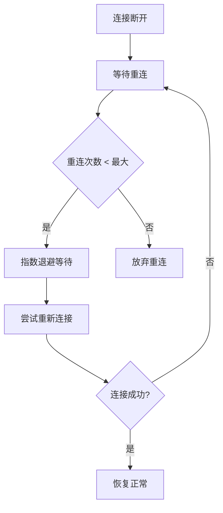

| 参数 | 说明 |
|------|------|
| `reconnections.timeout` | 重连超时时间 |
| `link-restart` | 链路重连次数 |

### 指数退避

重连使用指数退避策略：

| 重连次数 | 等待时间 |
|----------|----------|
| 1 | 1 秒 |
| 2 | 2 秒 |
| 3 | 4 秒 |
| 4 | 8 秒 |
| ... | 最大 60 秒 |

## 数据流向完整图

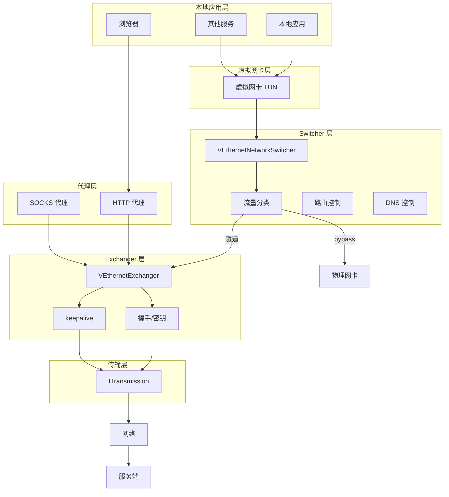

## 错误处理

### 常见错误及处理

| 错误类型 | 原因 | 处理方式 |
|----------|------|----------|
| 连接超时 | 网络不可达 | 重连 |
| 握手失败 | 密钥错误 | 报告错误 |
| 虚拟网卡错误 | 权限不足 | 尝试重新创建 |
| DNS 解析失败 | DNS 服务器问题 | 使用备用 DNS |
| 代理服务错误 | 端口被占用 | 尝试备用端口 |

### 日志级别

| 级别 | 说明 |
|------|------|
| ERROR | 错误信息 |
| WARN | 警告信息 |
| INFO | 一般信息 |
| DEBUG | 调试信息 |

## 性能优化

### 性能参数

| 参数 | 说明 | 推荐值 |
|------|------|--------|
| `concurrent` | 并发线程数 | CPU 核心数 |
| `--tun-ssmt` | SSMT 线程数 | 4 或 CPU 核心数 |
| `tcp.turbo` | TCP 加速 | 启用 |
| `tcp.fast-open` | TCP Fast Open | 启用 |

### 优化建议

1. **网络优化**：启用 TCP Turbo 和 Fast Open
2. **内存优化**：配置 vmem 大小
3. **并发优化**：根据 CPU 核心数调整并发数
4. **MUX 优化**：在高延迟场景启用 MUX

## 总结

OPENPPP2 客户端是一个复杂的网络系统，核心架构特点包括：

1. **Switcher/Exchanger 分离**：网络环境管理与会话管理分离
2. **多平面支持**：同时支持 TCP 隧道、UDP static、HTTP/SOCKS 代理
3. **灵活的路由和 DNS 控制**：支持多种 bypass 策略
4. **完整的重连机制**：自动重连和指数退避
5. **IPv6 支持**：支持多种 IPv6 模式
6. **MUX 多路复用**：支持连接复用

理解这些架构特点对于正确使用和调试客户端至关重要。

## 相关文档

| 文档 | 说明 |
|------|------|
| [ARCHITECTURE_CN.md](ARCHITECTURE_CN.md) | 系统架构总览 |
| [SERVER_ARCHITECTURE_CN.md](SERVER_ARCHITECTURE_CN.md) | 服务端运行时架构 |
| [TRANSMISSION_CN.md](TRANSMISSION_CN.md) | 传输层与受保护隧道模型 |
| [ROUTING_AND_DNS_CN.md](ROUTING_AND_DNS_CN.md) | 路由与 DNS 控制 |
| [PLATFORMS_CN.md](PLATFORMS_CN.md) | 平台支持与差异 |
