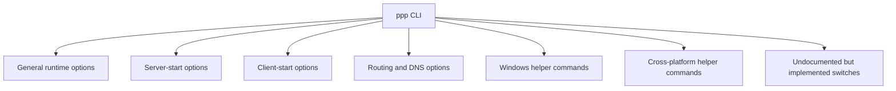

# CLI Reference

[中文版本](CLI_REFERENCE_CN.md)

## Scope

This document explains the command-line surface of `ppp` in a code-grounded way. It is based primarily on:

- `main.cpp::PrintHelpInformation()`
- `main.cpp::GetNetworkInterface()`
- `main.cpp::IsModeClientOrServer()`
- Windows helper command handlers in `main.cpp`

This is important because the help output and the parser are close to each other but not perfectly identical. The authoritative source is the parser and the runtime behavior, not the terminal banner text alone.

This document therefore distinguishes four things clearly:

- options printed in the help output
- options parsed directly in code
- defaults that come from runtime logic rather than literal help text
- helper commands that perform a system action and then exit

## How To Read This Document

Do not read the CLI as if it were a flat list of switches. OPENPPP2 exposes several different classes of command-line behavior:

- process startup shaping
- client-local network shaping
- server-local policy shaping
- route and DNS helper inputs
- platform-specific helper commands

These are not interchangeable. Some options define how the `ppp` process runs. Some influence how the client adapter and route environment are created. Some are one-shot administrative commands and do not start the long-running tunnel process at all.

## Invocation Form

The executable form is:

```text
ppp [OPTIONS]
```

The runtime requires administrative privileges.

If the process is started without sufficient privilege, `main.cpp` rejects it immediately.

The runtime also prevents duplicate execution of the same role against the same configuration path by creating a repeat-run lock.

## CLI Roles In The Whole System

The command line is not the only configuration source. OPENPPP2 combines:

- JSON configuration in `appsettings.json` or another supplied file
- command-line arguments

The JSON file defines the persistent model of the system. The command line is used to:

- pick the runtime role
- override local interface and route behavior
- supply operational helper inputs
- run one-shot utility commands

That means the CLI is a control surface layered on top of the configuration model, not a complete replacement for it.

## Role Selection

The most important CLI decision is the role.

`ppp` defaults to server mode if no role is explicitly supplied.

The main parser checks these keys for mode selection:

- `--mode`
- `--m`
- `-mode`
- `-m`

The help text only presents `--mode`, but the code accepts the other aliases.

If the resulting mode string begins with `c`, the runtime treats the process as client mode. Otherwise it remains in server mode.

That means `client` is explicit, but `server` is also the implicit fallback.

## Command Classes

The full CLI surface is easier to understand if organized as a hierarchy.



## General Runtime Options

These options apply to overall process behavior, regardless of whether the process later acts as client or server.

### `--rt=[yes|no]`

Meaning:

- enables real-time mode according to the help text

Important note:

- this option appears in the help output, but the deeper runtime implications should be interpreted in the rest of the scheduling and platform behavior, not from the help sentence alone

### `--mode=[client|server]`

Meaning:

- selects whether the process runs as tunnel client or tunnel server

Default:

- `server`

Operational consequence:

- this changes the entire startup branch in `PppApplication`
- client mode builds a virtual adapter and client switcher
- server mode opens listeners and the server session switch

### `--config=<path>`

Meaning:

- path to the JSON configuration file

Default:

- `./appsettings.json`

Operational consequence:

- this determines which persistent configuration model is loaded before most runtime decisions are made

### `--dns=<ip-list>`

Meaning:

- override DNS server list for runtime network behavior

Help default:

- `8.8.8.8,8.8.4.4`

Operational consequence:

- the parser populates `NetworkInterface::DnsAddresses`
- if the resulting list is non-empty, it rewrites the asynchronous DNS server list used by the runtime

### `--tun-flash=[yes|no]`

Meaning:

- enables the advanced QoS or flash type-of-service behavior shown in help

Code path:

- this is applied very early through `Socket::SetDefaultFlashTypeOfService(...)`

Default:

- `no`

### `--auto-restart=<seconds>`

Meaning:

- configures process-level auto-restart interval

Default:

- `0`, meaning disabled

Operational consequence:

- stored into global runtime state after argument preparation
- belongs to lifecycle behavior rather than packet behavior

### `--link-restart=<count>`

Meaning:

- configures link restart attempts

Default:

- `0`

Operational consequence:

- influences reconnection tolerance rather than initial configuration loading

### `--block-quic=[yes|no]`

Meaning:

- disable QUIC support where the client-side platform logic implements that behavior

Default:

- `no`

Operational consequence:

- on Windows, client-side helper logic can use this to toggle support for experimental QUIC-related behavior in the system-proxy-related code path

## Server Startup Options

Server-specific startup options are much fewer at the CLI surface because most server behavior lives in the JSON configuration.

### `--firewall-rules=<file>`

Meaning:

- path to a firewall-rules file used when the server opens

Parser default:

- `./firewall-rules.txt`

Operational consequence:

- passed into `VirtualEthernetSwitcher::Open(...)`
- belongs to server admission and policy enforcement rather than transport handshake logic

Practical interpretation:

- if server mode is selected, and the deployment requires explicit firewall gating, this file is part of the security boundary

## Client Startup Options

Client CLI behavior is much richer because the client has to create and shape a local network environment.

### `--lwip=[yes|no]`

Meaning:

- selects the client-side network stack behavior

Important nuance:

- the default is platform-sensitive
- on Windows the runtime checks Wintun availability and uses that to shape the default
- on non-Windows platforms the default path is different

Why this matters:

- this is not a cosmetic option; it changes how the client networking stack is realized locally

### `--vbgp=[yes|no]`

Meaning:

- enables the virtual-BGP-style route loading helper behavior

Runtime default:

- if not explicitly set, runtime logic later treats it as enabled

Why this matters:

- operators who rely on route files and route steering should understand that silence here does not mean “off”

### `--nic=<interface>`

Meaning:

- preferred physical network interface

Default:

- auto-select

Why this matters:

- in multi-homed systems, choosing the wrong egress or preferred local interface can change route behavior materially

### `--ngw=<ip>`

Meaning:

- preferred gateway

Default:

- auto-detect

Why this matters:

- this directly affects how the client interprets local network reachability and route injection behavior

### `--tun=<name>`

Meaning:

- virtual adapter name

Default:

- `NetworkInterface::GetDefaultTun()`

Why this matters:

- adapter naming affects local operator observability and, on some platforms, practical coexistence with other tunnel software

### `--tun-ip=<ip>`

Meaning:

- client virtual IPv4 address

Default:

- `10.0.0.2`

Important nuance:

- the code later normalizes this through `Ipep::FixedIPAddress(...)` together with gateway and subnet mask

### `--tun-ipv6=<ip>`

Meaning:

- requested client IPv6 address

Default behavior:

- empty or server-assigned flow unless explicitly provided

Why this matters:

- client-side IPv6 should only be used when the server-side IPv6 service is intentionally configured

### `--tun-gw=<ip>`

Meaning:

- virtual adapter gateway

Default:

- `10.0.0.1`

### `--tun-mask=<bits>`

Meaning:

- subnet mask bits according to the help text

Displayed default:

- `30`

Implementation nuance:

- the parser runs this through address helper logic, so the operator should think of this as part of the local tunnel subnet shaping, not merely a raw string literal

### `--tun-vnet=[yes|no]`

Meaning:

- enable subnet forwarding

Default:

- `yes`

Why this matters:

- this influences whether the client behaves more like a host tunnel or a more forwarding-aware edge node

### `--tun-host=[yes|no]`

Meaning:

- prefer host network

Default:

- `yes`

Why this matters:

- this affects local route preference and how overlay behavior coexists with the host network

### `--tun-static=[yes|no]`

Meaning:

- enable the static packet path

Default:

- `no`

Why this matters:

- this is not a cosmetic acceleration toggle
- it selects a materially different data-path style described in `VirtualEthernetPacket.cpp`

### `--tun-mux=<connections>`

Meaning:

- number of mux sub-links or mux connections to create

Default:

- `0`, meaning disabled

Why this matters:

- MUX is an additional connection model, not merely a throughput checkbox

### `--tun-mux-acceleration=<mode>`

Meaning:

- mux acceleration mode

Default:

- `0`

Implementation nuance:

- the parser clamps the value to a supported range and resets to `0` when the supplied value exceeds the project maximum

## Linux And macOS Client Options

### `--tun-promisc=[yes|no]`

Meaning:

- enable promiscuous behavior on the virtual Ethernet path

Default:

- `yes`

Why this matters:

- this option changes how the client-side virtual interface participates in the local network environment
- it should be chosen according to the deployment model, not by habit

## Linux-Specific Client Options

Linux has the richest platform-specific CLI surface because Linux networking integration in OPENPPP2 is deeper and more varied.

### `--tun-ssmt=<N>[/<mode>]`

Meaning:

- configure worker count and optional mode

Help interpretation:

- `mq` means multiqueue behavior, where one Linux tun queue can be opened per worker

Default:

- `0/st`

Why this matters:

- this directly changes how the Linux-side tun I/O path is parallelized

### `--tun-route=[yes|no]`

Meaning:

- enable route compatibility mode

Default:

- `no`

Code path:

- when enabled, this switches `TapLinux::CompatibleRoute(true)`

Why this matters:

- this is not a generic feature toggle but a Linux route-behavior compatibility switch

### `--tun-protect=[yes|no]`

Meaning:

- enable route protection behavior

Default:

- `yes`

Why this matters:

- on Linux this belongs to the project’s core safety and survivability story and should not be disabled casually

### `--bypass-nic=<interface>`

Meaning:

- choose the interface bound to bypass route-file behavior

Default:

- auto-select

Why this matters:

- multi-interface Linux deployments can route very differently depending on the bypass interface choice

## macOS-Specific Client Option

### `--tun-ssmt=<threads>`

Meaning:

- SSMT thread optimization count on macOS

Default:

- `0`

Why this matters:

- although the macOS platform surface is smaller than Linux, this still influences local tun-side concurrency behavior

## Windows-Specific Client Option

### `--tun-lease-time-in-seconds=<sec>`

Meaning:

- DHCP-style lease time used by the Windows virtual adapter behavior

Default:

- `7200`

Parser nuance:

- values less than `1` are reset to `7200`

Why this matters:

- this belongs to the Windows adapter-lifecycle model rather than the cross-platform protocol model

## Routing And DNS Options

These options are among the most operationally sensitive because they determine what enters the overlay and what remains local.

### `--bypass=<file1|file2>`

Meaning:

- load one or more bypass IP list files

Parser default:

- `./ip.txt`

Implementation nuance:

- the parser rewrites and resolves the path and then loads it into the `NetworkInterface` bypass set

Why this matters:

- a bypass file is not a convenience hint; it is part of policy

### `--bypass-ngw=<ip>`

Meaning:

- gateway used for bypass routes

Default:

- auto-detect

### `--virr=[file/country]`

Meaning:

- pull and periodically refresh APNIC-style country IP list data into a route file workflow

Displayed default:

- `./ip.txt/CN`

Why this matters:

- this option is part of the project’s route-list automation story and should be treated as policy input, not merely a downloader switch

### `--dns-rules=<file>`

Meaning:

- DNS rules file

Parser default:

- `./dns-rules.txt`

Why this matters:

- DNS rules are part of traffic steering and leak control

## Windows Helper Commands

These commands do not primarily start the long-running tunnel runtime. They perform a system operation and then exit.

### `--system-network-reset`

Meaning:

- reset the Windows network environment

Operational behavior:

- handled in a dedicated Windows helper path and returns `OK` or `FAIL`

### `--system-network-optimization`

Meaning:

- apply a Windows system-network optimization routine

Operational behavior:

- also handled before normal runtime startup and exits after performing the action

### `--system-network-preferred-ipv4`

Meaning:

- set IPv4 as preferred protocol through the Windows helper path

### `--system-network-preferred-ipv6`

Meaning:

- set IPv6 as preferred protocol through the Windows helper path

### `--no-lsp <program>`

Meaning:

- instruct the Windows helper code to exclude a specific program path from the LSP loading path

Why this matters:

- this exists because certain programs, including environments such as WSL-related workflows, can be disrupted by the wrong LSP behavior

## Cross-Platform Utility Commands

### `--help`

Meaning:

- print the runtime help banner and exit

Practical note:

- this is the user-facing summary, but it is not the entire truth of the parser surface

### `--pull-iplist [file/country]`

Meaning:

- download a country IP list from APNIC and exit

Displayed default:

- `./ip.txt/CN`

Why this matters:

- this is both a utility command and a route-policy preparation aid

## Implemented But Not Fully Advertised In Help

The codebase includes behavior that is parsed even when it is not fully represented in the formatted help table.

### `--set-http-proxy`

This switch is accepted by the Windows parser path.

If client mode is active and the switch is set, the client later calls `SetHttpProxyToSystemEnv()`.

Why this matters:

- operators should know this is real runtime behavior even though the main help banner does not present it in the same way as the printed options

### Mode aliases

The role parser accepts:

- `--m`
- `-mode`
- `-m`

The help text only presents `--mode`.

## Defaults: What To Trust

When there is tension between a help-table phrase and a code path, trust the code path.

The most important default nuances are:

- `server` is the real default role
- `--lwip` default differs by platform and Windows adapter path
- `--vbgp` behaves as enabled by default if not explicitly turned off
- `--tun-lease-time-in-seconds` is corrected upward on Windows when a bad value is supplied
- several route and DNS file paths have parser defaults even if operators usually think of them as “external assets”

## Safe Operational Reading Of The CLI

The safest way to operate this CLI is:

1. choose role first
2. choose configuration file second
3. decide whether this run is a long-running tunnel process or a one-shot helper command
4. only then add interface, route, DNS, static, mux, or platform-specific shaping options

That order reduces accidental misuse.

## Example Patterns

### Minimal server start

```bash
ppp --mode=server --config=./appsettings.json
```

### Server start with explicit firewall rules

```bash
ppp --mode=server --config=./appsettings.json --firewall-rules=./firewall-rules.txt
```

### Minimal client start

```bash
ppp --mode=client --config=./appsettings.json
```

### Client start with explicit local adapter shaping

```bash
ppp --mode=client --config=./appsettings.json --tun=openppp2 --tun-ip=10.0.0.2 --tun-gw=10.0.0.1 --tun-mask=30
```

### Client start with route and DNS policy inputs

```bash
ppp --mode=client --config=./appsettings.json --bypass=./ip.txt --dns-rules=./dns-rules.txt --vbgp=yes
```

### Linux client start with route protection and multiqueue tuning

```bash
ppp --mode=client --config=./appsettings.json --tun-ssmt=4/mq --tun-protect=yes --bypass-nic=eth0
```

### Windows helper command example

```powershell
ppp --system-network-reset
```

## Final Guidance

OPENPPP2 has a large CLI surface because it is not only a packet tunnel. It is a client/server infrastructure runtime with local network integration, route and DNS control, static mode, mux, mapping, and platform-specific behavior.

That means the right mindset for this CLI is not “memorize all switches.” The right mindset is:

- understand which layer you are changing
- know whether the switch affects startup, policy, interface realization, or platform maintenance
- treat route and DNS options as policy inputs
- treat platform helper commands as privileged system operations

## Related Documents

- [`USER_MANUAL.md`](USER_MANUAL.md)
- [`CONFIGURATION.md`](CONFIGURATION.md)
- [`OPERATIONS.md`](OPERATIONS.md)
- [`PLATFORMS.md`](PLATFORMS.md)
