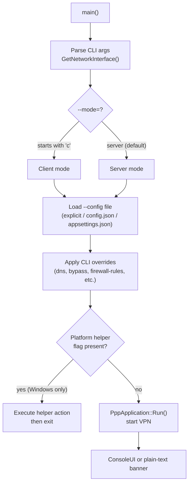
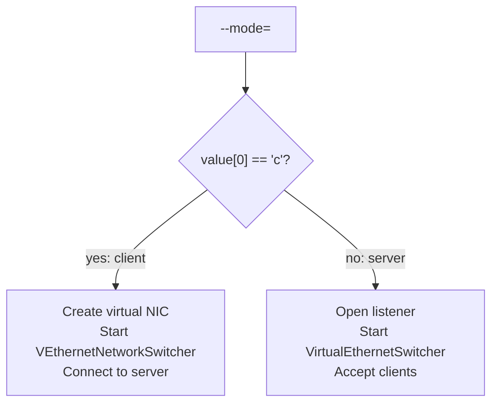

# CLI Reference

[中文版本](CLI_REFERENCE_CN.md)

## Position

This document explains the real `ppp` command line, not just the help banner. The CLI is
a startup-time shaping layer, not the whole configuration model. Most behavioral tuning
is done in `appsettings.json`; the CLI flags are overrides and platform helper actions
applied before the config file is fully parsed.

Source anchors:

- `main.cpp::PrintHelpInformation()` — help text generation
- `main.cpp::GetNetworkInterface()` — CLI parsing and `NetworkInterface` population
- `main.cpp::IsModeClientOrServer()` — mode detection

---

## High-Level Startup Flow



---

## CLI Argument Groups

The CLI surface splits into:

1. Role selection
2. Configuration file
3. Runtime shaping
4. Client network shaping
5. Routing and DNS inputs
6. Server policy inputs
7. Platform helper commands (Windows only)
8. Utility commands

---

## Role Selection

### `--mode=[client|server]`

- **Default:** `server`
- **Aliases:** `--m`, `-mode`, `-m`
- Any value beginning with `c` (case-insensitive) selects client mode.

This choice changes the entire startup branch:

- **client mode** creates/uses the virtual adapter path (`VEthernetNetworkSwitcher`,
  `VEthernetExchanger`, virtual TUN/TAP NIC)
- **server mode** opens the server-side listener/switcher path
  (`VirtualEthernetSwitcher`, `VirtualEthernetExchanger`)



**Examples:**

```bash
ppp --mode=server --config=./server.json
ppp --mode=client --config=./client.json
ppp -m=client -c=./client.json
```

---

## Configuration File

### `--config=<path>`

Aliases: `-c`, `--c`, `-config`, `--config`

Lookup order when not specified or specified path not found:

1. Explicit CLI path (if provided)
2. `./config.json`
3. `./appsettings.json`

Use an explicit path in production to avoid accidentally picking up a wrong configuration
from the working directory.

**Examples:**

```bash
ppp --mode=server --config=/etc/ppp/server.json
ppp --mode=client -c=/home/user/.config/client.json
```

---

## Runtime Shaping

### `--rt=[yes|no]`

Sets process-level real-time scheduling preference. When `yes`, the process attempts to
elevate its scheduling priority. Useful on low-latency servers.

### `--dns=<ip-list>`

Overrides the local DNS list for the current run. Accepts a comma-separated or
semicolon-separated list of IP addresses. Writes to `NetworkInterface::DnsAddresses`; it
does not replace DNS rules or server-side DNS logic.

**Example:**

```bash
ppp --mode=client -c=./client.json --dns=8.8.8.8,1.1.1.1
```

### `--tun-flash=[yes|no]`

Sets the default flash/TOS tendency early in startup. Controls whether the virtual
adapter marks packets with expedited forwarding DSCP bits.

### `--auto-restart=<seconds>`

Process-level restart timer. When the specified number of seconds elapses, the process
initiates a graceful restart via `ShutdownApplication(true)`. `0` disables the timer.

**Example:**

```bash
ppp --mode=client -c=./client.json --auto-restart=3600
```

### `--link-restart=<count>`

Restarts the process after the VPN link has reconnected more than `count` times. Useful
for detecting stale state and forcing a clean restart.

---

## Server Inputs

### `--block-quic=[yes|no]`

When `yes`, blocks QUIC-related UDP traffic for the current run. QUIC traffic uses
high-numbered UDP ports; blocking it forces HTTPS connections through TCP, which may
improve tunnel performance in some configurations.

### `--firewall-rules=<file>`

Specifies the firewall rules file. The file contains IP ranges and port rules that
the server applies to forwarded traffic. Default: `./firewall-rules.txt`.

**Example:**

```bash
ppp --mode=server -c=./server.json --firewall-rules=/etc/ppp/firewall.txt
```

---

## Client Inputs

### `--lwip=[yes|no]`

Selects the client network stack behavior. When `yes`, uses the lwIP TCP/IP stack for
virtual NIC packet processing. When `no`, uses the host network stack path.

### `--vbgp=[yes|no]`

Enables vBGP (virtual BGP) route updates. When enabled, the client periodically pulls
updated routing tables from the server. Refresh cadence is controlled by
`vbgp.update-interval` in the configuration file.

### `--nic=<interface>`

Physical interface hint. Tells the client which physical NIC to use as the egress
interface for VPN tunnel traffic. Used on multi-homed hosts.

**Example:**

```bash
ppp --mode=client -c=./client.json --nic=eth0
```

### `--ngw=<ip>`

Physical gateway hint. Specifies the next-hop gateway for the physical NIC. Used when
the default route needs to be preserved alongside the VPN route.

### `--tun=<name>`

Virtual adapter name. Overrides the TUN/TAP interface name assigned by the OS.

**Examples:**

```bash
# Linux
ppp --mode=client -c=./client.json --tun=ppp0

# Windows
ppp --mode=client -c=./client.json --tun="PPP Adapter"
```

### `--tun-ip=<ip>`

IPv4 address to assign to the virtual adapter.

### `--tun-ipv6=<ip>`

IPv6 address to assign to the virtual adapter.

### `--tun-gw=<ip>`

Gateway address for the virtual adapter. This is the server-side gateway address
assigned to the TUN interface.

### `--tun-mask=<bits>`

Network prefix length (CIDR notation number) for the virtual adapter's IPv4 subnet.
For example, `24` means a `/24` subnet mask (`255.255.255.0`).

### `--tun-vnet=[yes|no]`

Controls subnet-forwarding behavior. When `yes`, traffic for the entire virtual subnet
is routed through the tunnel, enabling LAN-to-LAN connectivity.

### `--tun-host=[yes|no]`

Controls whether host-network behavior is preferred. When `yes` (default), the virtual
adapter's gateway is used as the default route, routing all host traffic through the VPN.

### `--tun-static=[yes|no]`

Enables static tunnel mode. When `yes`, uses `PACKET_HEADER` static packet format
instead of the normal transmission packet format. See `PACKET_FORMATS.md`.

### `--tun-mux=<connections>`

MUX connection count. Sets the number of parallel multiplexed underlying connections.
`0` disables MUX. When MUX is enabled, the `nmux` flag in the handshake will reflect
the mux state.

**Example:**

```bash
ppp --mode=client -c=./client.json --tun-mux=4
```

### `--tun-mux-acceleration=<mode>`

MUX acceleration mode. Controls how the multiplexed connections distribute traffic.
Valid values depend on the build configuration.

### `--tun-promisc=[yes|no]`

Promiscuous mode on Linux and macOS. When `yes`, the virtual NIC accepts all frames
regardless of destination MAC address. Required for certain bridge configurations.

### `--tun-ssmt=<threads>` or `--tun-ssmt=<N>[/<mode>]`

SSMT (server-side multi-threading) tuning. On Linux, the `mq` mode opens one TUN queue
per worker thread, enabling parallel packet processing across CPU cores. On macOS, only
the thread-count form is documented.

**Examples:**

```bash
# Linux: 4 worker threads with multi-queue
ppp --mode=client -c=./client.json --tun-ssmt=4/mq

# macOS: 4 worker threads
ppp --mode=client -c=./client.json --tun-ssmt=4
```

### `--tun-route=[yes|no]`

Linux route-compatibility toggle. Controls whether the client modifies the system
routing table to add routes for the VPN subnet.

### `--tun-protect=[yes|no]`

Linux route-protection toggle. When `yes`, the client adds a host route for the VPN
server's IP address through the physical gateway, preventing routing loops.

### `--tun-lease-time-in-seconds=<sec>`

Windows DHCP lease time for the virtual adapter. Controls how long the virtual NIC
holds its DHCP lease before renewal. Only applies on Windows.

---

## Routing Inputs

### `--bypass=<file1|file2>`

Bypass IP list file. IP addresses and ranges listed in this file are routed through the
physical NIC (bypassing the VPN tunnel) instead of through the virtual adapter. Multiple
files can be separated by `|`. Default: `./ip.txt`.

**Example:**

```bash
ppp --mode=client -c=./client.json --bypass=./cn.txt|./local.txt
```

### `--bypass-nic=<interface>`

Interface used for bypass list processing on Linux. When bypass routes are added, they
use this interface as their egress.

### `--bypass-ngw=<ip>`

Gateway used for bypass list processing. Bypass routes will have this IP as their
next-hop.

### `--virr=[file/country]`

Enables IP-list refresh behavior (VIRR: Virtual IP Route Refresh). The argument is
either a file path or a country code. When enabled, the client periodically re-downloads
and re-applies the bypass IP list. Refresh cadence is controlled by
`virr.update-interval` and `virr.retry-interval` in the configuration file.

**Example:**

```bash
ppp --mode=client -c=./client.json --virr=CN
```

### `--dns-rules=<file>`

DNS rules file. The file specifies domain patterns and their target DNS servers or
forwarding behavior. Default: `./dns-rules.txt`.

**Example:**

```bash
ppp --mode=client -c=./client.json --dns-rules=/etc/ppp/dns-rules.txt
```

---

## Platform Helpers (Windows Only)

These are helper actions that modify system network configuration. They are not tunnel
start options; they execute the specified action and then exit.

| Flag | Action |
|------|--------|
| `--system-network-reset` | Resets Windows network stack to defaults |
| `--system-network-optimization` | Applies recommended TCP/UDP tuning parameters |
| `--system-network-preferred-ipv4` | Sets IPv4 as preferred over IPv6 in Windows binding order |
| `--system-network-preferred-ipv6` | Sets IPv6 as preferred over IPv4 in Windows binding order |
| `--no-lsp <program>` | Launches `<program>` with LSP (Layered Service Provider) bypass |

**Examples:**

```cmd
ppp --system-network-reset
ppp --system-network-optimization
ppp --system-network-preferred-ipv4
ppp --no-lsp "C:\Program Files\MyApp\app.exe"
```

---

## Utility Commands

### `--help`

Prints the help output listing all CLI flags with brief descriptions and exits. The
help output is generated by `main.cpp::PrintHelpInformation()`.

### `--pull-iplist [file/country]`

Downloads an IP list (bypass list) for the specified country code or from the specified
URL/file, writes it to the target file, and exits after the action completes. Useful for
pre-populating the bypass list before starting the tunnel.

**Example:**

```bash
ppp --pull-iplist CN
ppp --pull-iplist ./cn.txt
```

---

## Console UI Commands And Layout

The runtime Console UI is a dedicated interactive surface, separate from startup CLI
flags. It is only active when stdout is connected to a terminal.

Source anchors:

- `ppp/app/ConsoleUI.cpp::ExecuteCommand(...)` — command dispatch
- `ppp/app/ConsoleUI.cpp::RenderFrame(...)` — frame rendering
- `ppp/diagnostics/ErrorHandler.cpp::GetLastErrorCodeSnapshot(...)` — status error snapshot

### Built-In Console Commands

| Command | Action |
|---------|--------|
| `openppp2 help` | Print available command list |
| `openppp2 restart` | Graceful restart via `ShutdownApplication(true)` |
| `openppp2 reload` | Same action as restart |
| `openppp2 exit` | Process shutdown via `ShutdownApplication(false)` |
| `openppp2 info` | Pull and print a full runtime environment snapshot |
| `openppp2 clear` | Clear cmd output ring buffer and reset scroll |
| *(any other input)* | Execute as shell command, capture output to cmd section |

Notes:

- Bare commands such as `help`, `restart`, `exit`, `clear`, and `status` are treated as system shell commands.
- Built-in handling requires the `openppp2` namespace prefix.

### Keyboard Controls

| Key | Action |
|-----|--------|
| `Up` / `Down` | Command history navigation |
| `Left` / `Right` | Move cursor in editor line |
| `Home` | Scroll info section to top |
| `End` | Scroll info section to bottom |
| `Backspace` / `Delete` | Erase character before / at cursor |
| `PageUp` / `PageDown` | Scroll cmd output section up / down |
| `Ctrl+A` | Move cursor to beginning of line |
| `Ctrl+E` | Move cursor to end of line |
| `Enter` | Execute command |

### Layout

The TUI frame is divided into:

1. **Header** (10 fixed rows): top border, hint lines, ASCII art, spacer, separator
2. **Info section** (dynamic, ~60% of middle area): scrollable VPN status lines, `Home`/`End`
3. **Cmd section** (dynamic, ~40% of middle area): scrollable command output, `PageUp`/`PageDown`
4. **Input line** (1 row): editor with white-background caret
5. **Status bar** (1 row): latest diagnostics error snapshot

See `TUI_DESIGN.md` for the complete layout specification.

### Status Bar Semantics

The status bar shows a single diagnostics line generated from the process-wide error
snapshot:

- `[INFO] 0 Success: Success` when `ErrorCode::Success` is active.
- `[%LEVEL%] <numeric_id> <CodeName>: <message> (<age>)` for the most recent non-success
  error, where `<age>` is derived from `GetLastErrorTimestamp()` and rendered as `Ns ago`.

VPN state and throughput are still updated internally for command/info output, but they are
not rendered in the bottom status bar.

---

## Defaults Worth Remembering

| Flag | Default |
|------|---------|
| `--mode` | `server` |
| `--config` | `./config.json` then `./appsettings.json` |
| `--dns` | Falls back to preferred DNS pair from config if parsing fails |
| `--bypass` | `./ip.txt` |
| `--dns-rules` | `./dns-rules.txt` |
| `--firewall-rules` | `./firewall-rules.txt` |
| `--tun-host` | `yes` |
| `--rt` | `yes` |
| `--tun-mux` | `0` (disabled) |

---

## Typical Usage Examples

### Server

```bash
# Minimal server start
ppp --mode=server --config=/etc/ppp/server.json

# Server with custom firewall rules and real-time scheduling
ppp --mode=server --config=/etc/ppp/server.json \
    --firewall-rules=/etc/ppp/firewall.txt \
    --rt=yes
```

### Client (Linux)

```bash
# Basic client
ppp --mode=client --config=/etc/ppp/client.json

# Client with bypass list, MUX, and DNS override
ppp --mode=client --config=/etc/ppp/client.json \
    --bypass=./cn.txt \
    --tun-mux=4 \
    --dns=8.8.8.8,8.8.4.4 \
    --tun-ssmt=4/mq

# Client with route protection and auto-restart every hour
ppp --mode=client --config=/etc/ppp/client.json \
    --tun-protect=yes \
    --auto-restart=3600
```

### Client (Windows)

```cmd
rem Optimize network stack first (run once as administrator)
ppp --system-network-optimization

rem Start client
ppp --mode=client --config=C:\ppp\client.json --tun-lease-time-in-seconds=86400
```

### Utility

```bash
# Download Chinese IP bypass list and exit
ppp --pull-iplist CN

# Show help
ppp --help
```

---

## Error Code Reference

CLI-related error codes (from `ppp/diagnostics/Error.h`):

| ErrorCode | Description |
|-----------|-------------|
| `ConfigFileNotFound` | Config file not found at any lookup path |
| `ConfigFileMalformed` | Config file JSON parsing failed or is malformed |
| `AppInvalidCommandLine` | CLI option or `--mode` value not recognized |
| `DnsAddressInvalid` | DNS address value contained an invalid IP address |
| `FileNotFound` | Referenced file path not found |
| `ConfigDnsRuleLoadFailed` | DNS rules file failed to load |
| `FirewallLoadFileFullPathEmpty` | Firewall rules file path was empty or invalid for loading |
| `NetworkInterfaceUnavailable` | `--nic` specified interface not found |
| `NetworkGatewayInvalid` | `--ngw` or `--bypass-ngw` value invalid |
| `NetworkAddressInvalid` | `--tun-ip`, `--tun-ipv6`, or `--tun-gw` value invalid |

---

## Related Documents

- [`CONFIGURATION.md`](CONFIGURATION.md) — Full `appsettings.json` schema
- [`TRANSMISSION.md`](TRANSMISSION.md) — Transport layer details
- [`ARCHITECTURE.md`](ARCHITECTURE.md) — System architecture overview
- [`ERROR_HANDLING_API.md`](ERROR_HANDLING_API.md) — Error code system
- [`TUI_DESIGN.md`](TUI_DESIGN.md) — Console UI layout and behavior
