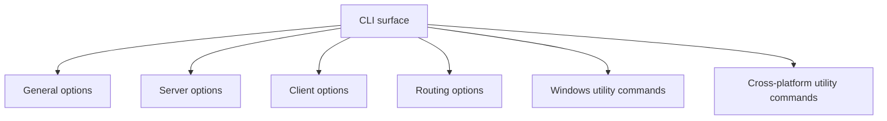

# CLI Reference

[中文版本](CLI_REFERENCE_CN.md)

## Scope

This document is derived from `main.cpp::PrintHelpInformation()`, `GetNetworkInterface()`, and the utility command handlers.

It separates:

- switches shown in help output
- parser defaults taken from code
- platform-specific switches
- implemented helper switches not fully surfaced in help text

## Execution Form

```text
ppp [OPTIONS]
```

Default role:

- `server`

Privilege requirement:

- administrator or root

## Option Map



## General Options

| Option | Meaning | Code default |
| --- | --- | --- |
| `--rt=[yes|no]` | Enable real-time mode | `yes` in help |
| `--mode=[client|server]` | Select runtime role | `server` |
| `--config=<path>` | Configuration file path | `./appsettings.json` |
| `--dns=<ip-list>` | Override DNS server list | `8.8.8.8,8.8.4.4` in help |
| `--tun-flash=[yes|no]` | Set default flash type of service / advanced QoS behavior | `no` |
| `--auto-restart=<seconds>` | Process-level auto restart interval | `0` |
| `--link-restart=<count>` | Link restart attempt count | `0` |
| `--block-quic=[yes|no]` | Disable QUIC support in client-side handling where supported | `no` |

## Server-Specific Options

| Option | Meaning | Code default |
| --- | --- | --- |
| `--firewall-rules=<file>` | Firewall rules file for server open/run path | `./firewall-rules.txt` in parser |

## Client-Specific Options

| Option | Meaning | Code default |
| --- | --- | --- |
| `--lwip=[yes|no]` | Client stack selection | platform-dependent |
| `--vbgp=[yes|no]` | Virtual BGP-style route loading helper | `yes` at runtime if not set |
| `--nic=<interface>` | Preferred physical NIC | auto-select |
| `--ngw=<ip>` | Preferred gateway | auto-detect |
| `--tun=<name>` | Virtual adapter name | `NetworkInterface::GetDefaultTun()` |
| `--tun-ip=<ip>` | Virtual adapter IPv4 | `10.0.0.2` |
| `--tun-ipv6=<ip>` | Requested IPv6 on client side | empty / server-assigned behavior |
| `--tun-gw=<ip>` | Virtual gateway | `10.0.0.1` |
| `--tun-mask=<bits>` | Virtual subnet mask | `30` |
| `--tun-vnet=[yes|no]` | Enable subnet forwarding | `yes` |
| `--tun-host=[yes|no]` | Prefer host network | `yes` |
| `--tun-static=[yes|no]` | Enable static packet path | `no` |
| `--tun-mux=<connections>` | MUX sub-link count | `0` |
| `--tun-mux-acceleration=<mode>` | MUX acceleration mode | `0` |

## Linux And macOS Client Options

| Option | Meaning | Code default |
| --- | --- | --- |
| `--tun-promisc=[yes|no]` | Promiscuous mode on virtual Ethernet path | `yes` |

## Linux-Specific Client Options

| Option | Meaning | Code default |
| --- | --- | --- |
| `--tun-ssmt=<N>[/<mode>]` | Worker count; `mq` enables one tun queue per worker | `0/st` |
| `--tun-route=[yes|no]` | Enable route compatibility mode | `no` |
| `--tun-protect=[yes|no]` | Enable route protection service | `yes` |
| `--bypass-nic=<interface>` | NIC used for bypass route files | auto-select |

## macOS-Specific Client Option

| Option | Meaning | Code default |
| --- | --- | --- |
| `--tun-ssmt=<threads>` | SSMT thread optimization count | `0` |

## Windows-Specific Client Option

| Option | Meaning | Code default |
| --- | --- | --- |
| `--tun-lease-time-in-seconds=<sec>` | DHCP-style lease time for virtual adapter behavior | `7200` |

## Routing Options

| Option | Meaning | Code default |
| --- | --- | --- |
| `--bypass=<file1|file2>` | Load one or more bypass IP list files | `./ip.txt` |
| `--bypass-ngw=<ip>` | Gateway for bypass list routes | auto-detect |
| `--virr=[file/country]` | Pull and refresh APNIC-style IP list into a route file | `./ip.txt/CN` |
| `--dns-rules=<file>` | DNS rules file | `./dns-rules.txt` |

## Windows Utility Commands

These commands perform helper operations and then exit.

| Command | Meaning |
| --- | --- |
| `--system-network-reset` | Reset Windows network stack |
| `--system-network-optimization` | Apply Windows network optimization routine |
| `--system-network-preferred-ipv4` | Prefer IPv4 |
| `--system-network-preferred-ipv6` | Prefer IPv6 |
| `--no-lsp <program>` | Exclude a program from LSP loading path |

## Cross-Platform Utility Commands

| Command | Meaning | Default |
| --- | --- | --- |
| `--help` | Print runtime help | none |
| `--pull-iplist [file/country]` | Download APNIC country IP list and exit | `./ip.txt/CN` |

## Implemented But Not Fully Advertised In Help

### `--set-http-proxy`

Windows parser code accepts `--set-http-proxy` and later calls `client->SetHttpProxyToSystemEnv()` when client mode is active.

This is implemented in the runtime path, but it is not printed in the main help tables.

### Alias handling for mode

`IsModeClientOrServer()` also checks:

- `--m`
- `-mode`
- `-m`

The help text only presents `--mode`.

## Notes On Defaults

- Help-table defaults and parser defaults are mostly aligned, but the parser is the authoritative source.
- `--lwip` is special on Windows: its default depends on whether Wintun is available.
- `--vbgp` is treated as enabled by default at runtime if not set.
- `--tun-mask=<bits>` is shown as prefix bits in help, while the parser also normalizes through address helpers internally.

## Examples

### Minimal server

```bash
ppp --mode=server --config=./appsettings.json
```

### Minimal client

```bash
ppp --mode=client --config=./appsettings.json
```

### Client with split-routing helpers

```bash
ppp --mode=client --config=./appsettings.json --bypass=./ip.txt --dns-rules=./dns-rules.txt --vbgp=yes
```

### Windows helper command

```powershell
ppp --system-network-reset
```

## Related Documents

- [`USER_MANUAL.md`](USER_MANUAL.md)
- [`CONFIGURATION.md`](CONFIGURATION.md)
- [`OPERATIONS.md`](OPERATIONS.md)
