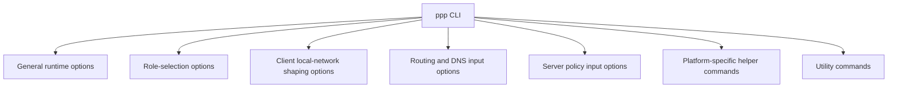
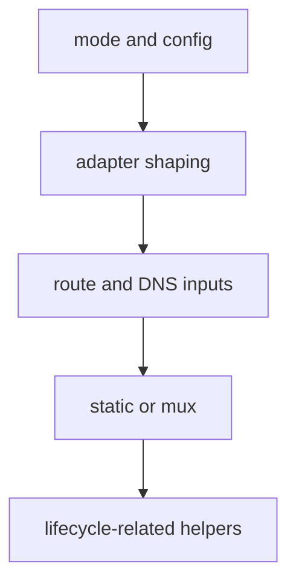

# CLI Reference

[中文版本](CLI_REFERENCE_CN.md)

## Document Position

This document is a user-facing and operator-facing reference for the `ppp` command-line interface. It does not simply restate the help output. Instead, it places command-line parsing logic, runtime defaults, role-branch behavior, local host-network shaping effects, and platform-specific helper commands into one explanation so that a user can understand what each option actually means in the real system.

The main implementation anchors are:

- `main.cpp::PrintHelpInformation()`
- `main.cpp::GetNetworkInterface()`
- `main.cpp::IsModeClientOrServer()`
- helper command branches in `main.cpp`
- `VEthernetNetworkSwitcher.cpp`
- `VEthernetExchanger.cpp`

One principle matters throughout this document: `ppp --help` tells you what the help banner says. It does not fully tell you how the runtime parses the option, where the default actually comes from, or which runtime layer a given switch influences. The real authority is the parser and the later runtime behavior.

## First Correct Understanding: The CLI Is Not The Entire Configuration Model

OPENPPP2 is not a pure CLI tool. Its long-lived behavior is still defined primarily by the JSON configuration model. The command line is better understood as:

- a role selector
- a host-network shaping override layer
- a startup-time auxiliary input layer
- a one-shot system action surface

That means users should not treat the CLI as a complete replacement for configuration files. The better model is:

- JSON defines long-lived node identity
- CLI shapes how the current host run is realized

## Invocation Form

The minimal executable form is:

```text
ppp [OPTIONS]
```

It requires administrative privilege. Without that privilege, `main.cpp` refuses to continue.

It also creates duplicate-run protection based on:

- current role
- current configuration path

So users should not start the same role against the same configuration path repeatedly and expect that to be a normal testing pattern.

## How To Read The Whole CLI Surface

Do not read the `ppp` CLI as one flat list of switches. The better approach is to divide it into several classes.



These classes are not interchangeable:

- some determine whether the process is client or server
- some determine how the virtual adapter and local route environment are realized
- some determine how DNS, bypass lists, and route inputs are loaded
- some do not start a long-running tunnel process at all and only perform a one-shot system action

## Role Selection Options

Role selection is the most important decision in the CLI.

### `--mode=[client|server]`

This is the most visible role parameter in the help output.

#### Meaning

- run the process as `client` or `server`

#### Default

- `server`

#### Why The Default Is `server`

The real parsing logic in `IsModeClientOrServer()` does this:

- obtain the mode value from the accepted keys
- if it begins with `c`, enter client mode
- otherwise stay in server mode

That means “not supplied” becomes server mode, and only an explicit client-like value moves the program into client mode.

#### Aliases

The parser also accepts these aliases:

- `--m`
- `-mode`
- `-m`

The help output does not expand them fully, but the code does accept them.

#### Practical Impact

Once the role is decided, the entire startup branch changes:

- the client branch creates or attaches the virtual adapter and opens `VEthernetNetworkSwitcher`
- the server branch opens `VirtualEthernetSwitcher` and listener state

### Examples

Minimal server:

```bash
ppp --mode=server --config=./server.json
```

Minimal client:

```bash
ppp --mode=client --config=./client.json
```

## Configuration File Option

### `--config=<path>`

#### Meaning

- path to the JSON configuration file

#### Real Lookup Behavior

The runtime first uses the CLI-supplied path if present. If not, it continues trying:

- `./config.json`
- `./appsettings.json`

#### Recommended Use

In production or in formal testing, it is strongly recommended to always specify the path explicitly. For example:

```bash
ppp --mode=server --config=/etc/openppp2/server.json
```

It is not good practice to depend on startup correctness merely because the current directory happens to contain `appsettings.json`.

#### Actual Impact

This option determines:

- which persistent configuration model is loaded
- which path participates in duplicate-run identification
- which file becomes the basis for all later normalization and defaults

## General Runtime Options

These options influence overall process behavior rather than only a small local client or server concern.

### `--rt=[yes|no]`

#### Meaning

- described by the help output as a real-time mode switch

#### How Users Should Read It

From the help text it looks like a process-level runtime preference. Users should not treat it as a protocol feature. It is better understood as a process scheduling or runtime behavior preference.

#### When To Consider It

- after the base behavior is already stable
- when the environment truly requires changes to process runtime posture

#### When Not To Touch It Yet

- before basic client/server behavior is already understood

### `--dns=<ip-list>`

#### Meaning

- override the DNS server list used by the current run

#### Example Input

```bash
ppp --mode=client --config=./client.json --dns=1.1.1.1,8.8.8.8
```

#### Real Meaning

This is not “send a remote DNS preference to the tunnel server.” It is part of the local runtime network input. The code writes it into `NetworkInterface::DnsAddresses`, and the later environment-preparation logic uses it.

#### Appropriate Use Cases

- temporarily override the default DNS list
- test current route and DNS steering behavior
- avoid rewriting JSON just to change startup-time resolver input once

#### Common Misunderstanding

- assuming this replaces all DNS rule, redirect, and server-side namespace-cache logic

It does not. DNS rules, DNS redirect, and server-side namespace cache are still separate behaviors.

### `--tun-flash=[yes|no]`

#### Meaning

- control default flash type-of-service or advanced QoS tendency

#### Real Code Path

It is applied very early during argument-environment preparation through `Socket::SetDefaultFlashTypeOfService(...)`.

#### How Users Should Read It

This belongs to process network I/O shaping, not to tunnel policy or client/server business semantics.

#### When To Consider It

- after the base tunnel is stable
- when the environment is known to be sensitive to QoS or TOS behavior

### `--auto-restart=<seconds>`

#### Meaning

- set a process-level automatic restart interval

#### Default

- `0`, meaning disabled

#### Real Runtime Effect

This option does not affect the initial session establishment path. It enters top-level tick logic, and when uptime reaches the threshold, the whole process is restarted.

#### Appropriate Use Cases

- when a deployment intentionally wants periodic full-process renewal
- when long-lived nodes are expected to re-enter a clean state on a timer

#### Inappropriate Use Cases

- when the base runtime is not yet stable enough to interpret restart behavior correctly

### `--link-restart=<count>`

#### Meaning

- set a reconnection-count threshold after which the process escalates recovery to a full restart

#### Default

- `0`

#### Real Runtime Effect

Once a client has reached established state, if later reconnection churn crosses the configured threshold, top-level lifecycle logic may restart the whole process.

#### Appropriate Use Case

- when repeated link-level recovery should eventually become process-level recovery

#### Usage Advice

Do not read it as “smaller is always more stable.” It defines a tolerance boundary, not link quality by itself.

### `--block-quic=[yes|no]`

#### Meaning

- block client-side QUIC-related traffic or behavior where supported by platform logic

#### Default

- `no`

#### Real Impact

It influences both client-side UDP 443 handling and, on Windows, can interact with system-proxy or browser-related behavior.

#### Appropriate Use Cases

- when QUIC should not bypass the intended proxy or tunnel model
- when the operator wants to reduce path ambiguity caused by QUIC-capable applications or browsers

## Server-Specific Options

The server-side CLI surface is small because much server behavior is defined in JSON configuration rather than at startup-time CLI level.

### `--firewall-rules=<file>`

#### Meaning

- path to the firewall rules file used when the server opens

#### Default

- if not supplied, parsing logic falls back to `./firewall-rules.txt`

#### Real Impact

The path is passed into `VirtualEthernetSwitcher::Open(...)`, so it belongs to the server's admission and policy surface rather than to the transport handshake surface.

#### Appropriate Use Cases

- the server needs explicit port, domain, or segment gating
- the server is being operated as a public or semi-public publication edge rather than as a minimal tunnel concentrator

#### Example

```bash
ppp --mode=server --config=./server.json --firewall-rules=./firewall-rules.txt
```

#### Usage Advice

- treat this file as a policy asset
- keep it under change control instead of hand-editing it ad hoc on target hosts

## Client Local-Network Shaping Options

Client-side options are the richest part of the CLI because the client must really construct a local overlay edge on the host.

### `--lwip=[yes|no]`

#### Meaning

- select the client-side local stack realization path

#### Important Detail

The default is platform-sensitive. On Windows it is also influenced by Wintun availability.

#### How Users Should Read It

This is not a cosmetic setting. It changes how the local client networking stack path is realized.

#### Usage Advice

- unless you already know why the current platform requires manual override, accept the default first
- when comparing environments, explicitly record whether this option was forced

### `--vbgp=[yes|no]`

#### Meaning

- enable vBGP-style route input behavior

#### Important Detail

If not explicitly disabled, the later runtime tends to proceed as if it is enabled. Users should not assume “not supplied” means “disabled.”

#### Appropriate Use Cases

- route files or online route inputs are part of the deployment
- route datasets are expected to participate in refresh logic

### `--nic=<interface>`

#### Meaning

- choose the preferred physical interface

#### Appropriate Use Cases

- multi-NIC hosts
- multi-uplink environments
- cases where automatic interface choice is frequently wrong

#### Usage Advice

Once you force it, you should also understand:

- which path the remote server will remain reachable over
- whether bypass and default route behavior should follow that choice

### `--ngw=<ip>`

#### Meaning

- choose the preferred gateway

#### Appropriate Use Cases

- automatic gateway discovery is unstable
- the host has several competing default routes
- the operator wants startup to shape the host around one explicit gateway reference

### `--tun=<name>`

#### Meaning

- set the virtual adapter name

#### Appropriate Use Cases

- easier observability on the host
- coexistence with multiple tunnel products or multiple logical overlay contexts

### `--tun-ip=<ip>`

#### Meaning

- set the client virtual IPv4 address

#### Default

- parsing falls back to `10.0.0.2`

#### Usage Advice

- if there is no special topology need, let defaults or JSON define this
- only override it when overlay IPv4 planning is deliberate and explicit

### `--tun-ipv6=<ip>`

#### Meaning

- provide the requested client IPv6 input

#### How Users Should Read It

It does not force the client to receive that exact IPv6 result. The final result still depends on:

- whether the server offers IPv6 service
- whether the server accepts the request
- whether the host platform can apply the assigned state successfully

### `--tun-gw=<ip>`

#### Meaning

- set the virtual IPv4 gateway

#### Default

- parsing falls back to `10.0.0.1`

#### Usage Advice

- always think about it together with `--tun-ip` and `--tun-mask`
- do not change it in isolation

### `--tun-mask=<bits>`

#### Meaning

- set the virtual subnet mask width

#### Default

- the practical combined behavior corresponds to `/30`

#### Usage Advice

- it is normalized together with address and gateway behavior
- do not treat it as a purely cosmetic string

### `--tun-vnet=[yes|no]`

#### Meaning

- enable or disable virtual-subnet forwarding tendency

#### Default

- `yes`

#### How Users Should Read It

It changes whether the client behaves more like a single-host access point or like a subnet-capable forwarding edge.

### `--tun-host=[yes|no]`

#### Meaning

- control whether host-network preference behavior remains enabled

#### Default

- `yes`

#### How Users Should Read It

This affects how route installation, default-path protection, and host/overlay coexistence are shaped. It is not merely descriptive.

### `--tun-static=[yes|no]`

#### Meaning

- enable static packet path behavior

#### Default

- `no`

#### Usage Advice

Only enable it when the deployment really intends to use the static packet model. Do not treat it as a generally superior setting.

### `--tun-mux=<connections>`

#### Meaning

- set the number of MUX subconnections

#### Default

- `0`

#### Usage Advice

- stabilize the main session first
- then introduce MUX gradually
- higher values are not automatically better

### `--tun-mux-acceleration=<mode>`

#### Meaning

- choose the MUX acceleration mode

#### Important Detail

- values above the supported range are normalized back to `0`

#### Usage Advice

- start from `0`
- only then explore acceleration modes after the base MUX plane is understood

## Linux And macOS Related Client Options

### `--tun-promisc=[yes|no]`

#### Platforms

- Linux
- macOS

#### Meaning

- control whether the virtual interface is used in promiscuous mode

#### Default

- parser-side defaults on these platform branches lean toward `yes`

#### Usage Advice

- only override if the operational implications of promiscuous behavior are already understood on that host

### `--tun-ssmt=<N>[/<mode>]`

#### Platform

- Linux

#### Meaning

- set SSMT thread count and optional mode

#### Parsing Detail

- the Linux help output shows `--tun-ssmt=<N>[/<mode>]`
- parser logic splits thread count and optional mode internally

#### Usage Advice

- only relevant when doing real Linux edge-performance tuning

### `--tun-route=[yes|no]`

#### Platform

- Linux

#### Meaning

- adjust Linux route compatibility behavior

#### Usage Advice

- read it as a Linux compatibility surface, not as a universal optimization knob

### `--tun-protect=[yes|no]`

#### Platform

- Linux

#### Meaning

- control protect-network behavior

#### Default

- `yes`

#### How Users Should Read It

This is not merely a generic “security hardening” checkbox. It belongs to the host-network logic that prevents critical local sockets or control paths from being pulled back into the overlay incorrectly.

### `--bypass-nic=<interface>`

#### Platform

- Linux

#### Meaning

- choose the interface associated with bypass behavior

#### Appropriate Use Case

- multi-NIC Linux systems with multiple egress and explicit route-control intent

## Windows-Related Options

Windows exposes not only tunnel behavior but also several helper-style system commands and preference-shaping actions.

### `--tun-lease-time-in-seconds=<sec>`

#### Meaning

- control Windows-side lease behavior related to the virtual interface

#### Important Detail

- if the supplied value is smaller than `1`, runtime logic normalizes it to `7200`

#### Usage Advice

- only change it when the Windows-side host behavior is intentionally being shaped

### `--system-network-reset`

#### Meaning

- perform a system network reset style helper action

#### How Users Should Read It

This belongs to the helper-command surface rather than to long-running tunnel mode. It is closer to a one-shot administrative action.

### `--system-network-optimization`

#### Meaning

- trigger a Windows network optimization helper path

### `--system-network-preferred-ipv4`

#### Meaning

- shape system preference toward IPv4

### `--system-network-preferred-ipv6`

#### Meaning

- shape system preference toward IPv6

### `--no-lsp <program>`

#### Meaning

- enter Windows helper logic related to LSP-associated behavior

### `--set-http-proxy`

#### Important Note

The code contains this path even though the help output does not fully expose the full related syntax. Users should therefore know that Windows does carry a system HTTP proxy command and runtime surface.

## Routing And DNS Input Options

This category is one of the most important from the user perspective because it defines traffic boundaries.

### `--bypass=<file>`

#### Meaning

- path to the bypass list file

#### Default

- if not supplied, parsing falls back to `./ip.txt`

#### Usage Advice

- treat it as route policy input
- keep it under change control

### `--bypass-ngw=<ip>`

#### Meaning

- set the next-hop gateway associated with bypass behavior

#### Default

- `0.0.0.0`

### `--virr=[file/country]`

#### Meaning

- automatically fetch and apply a country IP list

#### Real Impact

- this is not a passive parse-only input
- it participates in later update logic driven by the tick lifecycle

#### Usage Advice

- enable it only when the operator is comfortable controlling update source and change timing

### `--dns-rules=<file>`

#### Meaning

- path to the DNS rules file

#### Default

- `./dns-rules.txt`

#### Usage Advice

- this file has major influence over DNS steering behavior
- do not modify it casually without tracking changes

## Utility Commands

### `--help`

#### Meaning

- print help information and exit

#### Appropriate Use Case

- quick confirmation of the help-surface option set

### `--pull-iplist [file/country]`

#### Meaning

- download a country or source IP list

#### How Users Should Read It

This is a utility command, not part of the long-running tunnel session model. It is an operations helper.

## How Options Should Be Combined Correctly

The key to understanding the CLI is not memorizing each switch in isolation. It is knowing which switches belong together.

### Combination One: Minimal Server Set

```bash
ppp --mode=server --config=./server.json
```

Only if policy gating is needed, add:

```bash
ppp --mode=server --config=./server.json --firewall-rules=./firewall-rules.txt
```

### Combination Two: Minimal Client Set

```bash
ppp --mode=client --config=./client.json
```

### Combination Three: Explicit Adapter Shaping Set

```bash
ppp --mode=client --config=./client.json --nic=eth0 --ngw=192.168.1.1 --tun=ppp0 --tun-ip=10.0.0.2 --tun-gw=10.0.0.1 --tun-mask=30
```

### Combination Four: Route And DNS Steering Set

```bash
ppp --mode=client --config=./client.json --dns=1.1.1.1,8.8.8.8 --bypass=./ip.txt --dns-rules=./dns-rules.txt
```

### Combination Five: Multi-Uplink Linux Client Set

```bash
ppp --mode=client --config=./client.json --nic=eth0 --ngw=192.168.1.1 --bypass=./ip.txt --bypass-nic=eth1 --bypass-ngw=192.168.2.1 --tun-protect=yes
```

## Recommended Parameter Introduction Order

The safest way to use `ppp` is not to turn on everything at once. Introduce CLI layers in the following order.

### Step One

Only decide:

- `--mode`
- `--config`

### Step Two

If this is a client, then shape:

- `--nic`
- `--ngw`
- `--tun`
- `--tun-ip`
- `--tun-gw`
- `--tun-mask`

### Step Three

Only then add:

- `--dns`
- `--bypass`
- `--dns-rules`

### Step Four

Only after that consider:

- `--tun-static`
- `--tun-mux`
- `--tun-mux-acceleration`
- `--block-quic`
- `--auto-restart`
- `--link-restart`



## Common Misunderstandings

### Misunderstanding One: The CLI Can Fully Replace JSON

No. The CLI is best for startup overrides and host shaping. JSON remains the long-lived model.

### Misunderstanding Two: More Switches Always Means A Better Result

No. More switches mean more variables. Troubleshooting usually starts by reducing the parameter set, not expanding it.

### Misunderstanding Three: The Help Text Fully Describes Real Behavior

No. The help text is only the first layer. Real behavior also depends on:

- parser defaults
- normalization logic
- later runtime paths

### Misunderstanding Four: Platform Options Only Affect Display Or Cosmetic Host State

No. Many platform options influence real route, DNS, protect, and helper behaviors.

## Most Useful Command Templates

### Template One: Minimal Server

```bash
ppp --mode=server --config=./server.json
```

### Template Two: Minimal Client

```bash
ppp --mode=client --config=./client.json
```

### Template Three: Client With Custom DNS

```bash
ppp --mode=client --config=./client.json --dns=1.1.1.1,8.8.8.8
```

### Template Four: Client With Explicit Route Inputs

```bash
ppp --mode=client --config=./client.json --bypass=./ip.txt --dns-rules=./dns-rules.txt --vbgp=yes
```

### Template Five: Windows Helper Action

```powershell
ppp --system-network-reset
```

or:

```powershell
ppp --system-network-preferred-ipv4
```

These should be treated as system-maintenance actions rather than as long-running tunnel commands.

## Where To Read Next

If you want the full configuration model after understanding the CLI surface, continue with:

- [`CONFIGURATION.md`](CONFIGURATION.md)

If you want to understand why the client mutates routes, DNS, and proxy behavior, continue with:

- [`CLIENT_ARCHITECTURE.md`](CLIENT_ARCHITECTURE.md)

If you want to understand why the server opens listeners, mappings, IPv6 behavior, and backend cooperation, continue with:

- [`SERVER_ARCHITECTURE.md`](SERVER_ARCHITECTURE.md)

If you want to understand why route and DNS inputs are so central, continue with:

- [`ROUTING_AND_DNS.md`](ROUTING_AND_DNS.md)

If you want the broader user-facing usage model, continue with:

- [`USER_MANUAL.md`](USER_MANUAL.md)
