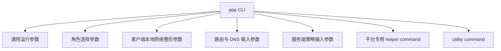
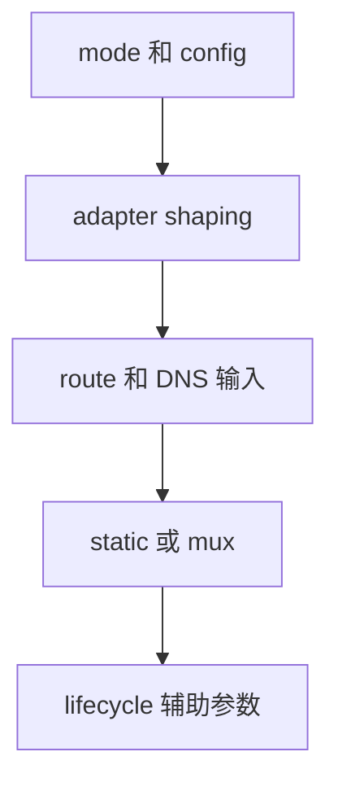

# 命令行参考

[English Version](CLI_REFERENCE.md)

## 文档定位

本文是一份面向使用者和运维者的 `ppp` 命令行接口文档。它不是简单把帮助输出重抄一遍，而是把命令行解析逻辑、运行时默认值、角色分支行为、本地网络整形效果和平台特化 helper command 放到同一张说明图里，告诉你每个参数在真实系统里到底意味着什么。

本文主要依据：

- `main.cpp::PrintHelpInformation()`
- `main.cpp::GetNetworkInterface()`
- `main.cpp::IsModeClientOrServer()`
- `main.cpp` 中的 helper command 处理分支
- `VEthernetNetworkSwitcher.cpp`
- `VEthernetExchanger.cpp`

本文特别强调一个原则：`ppp --help` 只能告诉你“帮助输出写了什么”，而不能完整告诉你“运行时到底会怎么解析、默认值到底从哪里来、某个参数到底会影响哪一层”。真正有决定意义的是解析代码和后续运行逻辑。

## 先建立一个正确认识：CLI 不是全部配置

OPENPPP2 不是一个纯 CLI 软件。它长期行为的核心仍然来自 JSON 配置文件。命令行在系统中的作用更接近：

- 角色选择器
- 本地网络整形覆盖器
- 启动时辅助输入
- 一次性系统动作入口

这意味着，使用者不应把 CLI 当成配置文件的完全替代品。更准确的做法是：

- 用 JSON 定义节点长期身份
- 用 CLI 调整当前宿主机上的落地方式

## 调用形式

最基本的调用形式是：

```text
ppp [OPTIONS]
```

它要求当前进程具备管理员权限。没有权限，`main.cpp` 会拒绝继续运行。

另外，它还会基于：

- 当前角色
- 当前配置路径

建立重复运行保护。因此，使用者不能把同一角色、同一路径配置的进程重复拉起，当成一种正常测试方式。

## 如何阅读整个 CLI

阅读 `ppp` 的命令行界面时，不要把它理解成一张平铺的参数清单。更好的理解方式是把它拆成几类。



这几类参数不是同一个层面：

- 有的决定进程是 client 还是 server
- 有的决定本地虚拟网卡和 route 如何落地
- 有的决定 DNS、bypass 和 route file 如何输入
- 有的根本不会进入长期隧道运行，而只是做一次系统动作后退出

## 角色选择参数

角色选择是整个 CLI 里最重要的决策。

### `--mode=[client|server]`

这是帮助文本中最明确展示的角色参数。

#### 作用

- 指定进程运行成 `client` 或 `server`

#### 默认值

- `server`

#### 为什么默认是 `server`

因为 `IsModeClientOrServer()` 里实际逻辑是：

- 取出 mode 相关参数值
- 如果该值以 `c` 开头，则进入 client
- 否则保留在 server

因此，“不写”就是 server，“写成 client”才会进入 client。

#### 别名

真实解析代码还接受这些别名：

- `--m`
- `-mode`
- `-m`

帮助文本里没有完整展开这些别名，但代码确实支持。

#### 实际影响

这个参数一旦确定，后面整个启动分支都会不同：

- client 分支会创建或接入虚拟网卡、打开 `VEthernetNetworkSwitcher`
- server 分支会打开 `VirtualEthernetSwitcher` 和监听器

### 示例

最小 server：

```bash
ppp --mode=server --config=./server.json
```

最小 client：

```bash
ppp --mode=client --config=./client.json
```

## 配置文件参数

### `--config=<path>`

#### 作用

- 指定 JSON 配置文件路径

#### 真实查找行为

代码会优先取命令行中传入的配置路径；如果没有，就继续尝试：

- `./config.json`
- `./appsettings.json`

#### 推荐使用方式

生产或正式测试中，建议始终显式指定配置路径。例如：

```bash
ppp --mode=server --config=/etc/openppp2/server.json
```

不建议把启动正确性建立在“当前目录刚好有个 `appsettings.json`”之上。

#### 实际影响

该参数会决定：

- 读取哪份长期配置模型
- 进程防重复运行锁使用哪条路径参与标识
- 后续所有默认值和配置规范化以哪份文件为基础

## 通用运行参数

这组参数会影响整个进程，而不是仅影响 client 或 server 的某一小部分行为。

### `--rt=[yes|no]`

#### 作用

- 帮助输出将其描述为 real-time mode

#### 使用者应该如何理解

从帮助文本上看，它像一个“进程运行模式偏好”开关。使用时，不应把它理解成协议层功能，而应把它理解成运行调度层或进程行为层的偏好开关。

#### 什么时候考虑它

- 你已经稳定运行基础功能后
- 你明确知道当前环境需要对进程实时性做调整时

#### 什么时候先不要碰它

- 你还没搞清楚 client/server 基础会话是否稳定时

### `--dns=<ip-list>`

#### 作用

- 覆盖本次运行使用的 DNS 服务器列表

#### 输入形式

典型形式如下：

```bash
ppp --mode=client --config=./client.json --dns=1.1.1.1,8.8.8.8
```

#### 真实意义

它不是“给 tunnel server 传个远端 DNS 建议”，而是本地运行时网络输入的一部分。代码会把它写入 `NetworkInterface::DnsAddresses`，再由后续网络环境准备阶段使用。

#### 适用场景

- 你想暂时覆盖默认 DNS
- 你想测试当前 route/DNS 分流策略下的解析行为
- 你不想立刻改动 JSON，只想做一次启动级覆盖

#### 常见误区

- 误以为这个参数会替代全部 DNS 规则和 DNS redirect 逻辑

它不会。DNS rule、DNS redirect、server-side namespace cache 等逻辑仍然各自存在。

### `--tun-flash=[yes|no]`

#### 作用

- 控制默认 flash type-of-service 或高级 QoS 倾向

#### 真实代码位置

它很早就在参数环境准备阶段通过 `Socket::SetDefaultFlashTypeOfService(...)` 生效。

#### 使用者如何理解

这个参数属于“进程网络 I/O 倾向整形”，而不是 tunnel policy 或 client/server 业务逻辑。

#### 什么时候考虑使用

- 你已经验证基础隧道稳定
- 当前网络环境对 QoS/TOS 类行为确实敏感

### `--auto-restart=<seconds>`

#### 作用

- 设置进程级自动重启周期

#### 默认值

- `0`，表示关闭

#### 真实运行效果

该参数不会影响初始会话建立，而是会进入顶层 tick 逻辑。一旦程序运行时间达到阈值，就会触发整进程 restart。

#### 适用场景

- 需要固定时间刷新运行态
- 需要在长时间运行环境中定期重入干净状态

#### 不适用场景

- 你还没搞清楚基础稳定性时

### `--link-restart=<count>`

#### 作用

- 设定可容忍的重连次数上限

#### 默认值

- `0`

#### 真实运行效果

在 client 已进入 established 状态后，如果后续重连次数达到阈值，顶层生命周期会选择重启整个进程。

#### 适用场景

- 你希望把“过度抖动”从链路级恢复提升为进程级恢复

#### 使用建议

不要把它当作“越小越稳定”。它本质上是在定义容忍区间，而不是提升连接质量本身。

### `--block-quic=[yes|no]`

#### 作用

- 阻止客户端侧 QUIC 相关流量或系统行为

#### 默认值

- `no`

#### 真实影响

它既影响客户端 UDP 443 处理路径，也可能在 Windows 上与系统代理、浏览器相关逻辑发生交叉。

#### 适用场景

- 你明确希望让基于 QUIC 的流量不要绕开既有的代理或隧道模型
- 你希望降低浏览器或某些应用使用 QUIC 带来的路径不确定性

## 服务端专用参数

服务端命令行参数并不多，因为很多服务端行为主要由 JSON 配置长期定义。

### `--firewall-rules=<file>`

#### 作用

- 指定服务端启动时加载的 firewall rules 文件

#### 默认值

- 若未显式指定，解析逻辑会回退到 `./firewall-rules.txt`

#### 真实影响

该路径会被传入 `VirtualEthernetSwitcher::Open(...)`，因此它属于 server 的接纳面和策略面，而不是 transport handshake 的一部分。

#### 适用场景

- 服务端需要显式端口、域名、分段访问控制
- 你把 server 当成公网服务发布边缘，而不是最小 tunnel concentrator

#### 示例

```bash
ppp --mode=server --config=./server.json --firewall-rules=./firewall-rules.txt
```

#### 使用建议

- 这个文件应纳入版本管理
- 不建议让运维临时在目标机上手写一版然后忘记备份

## 客户端本地网络整形参数

客户端参数是整个 CLI 中最丰富的一部分，因为 client 必须在本机真正构造一个 overlay 接入环境。

### `--lwip=[yes|no]`

#### 作用

- 选择客户端本地协议栈实现方式

#### 重要细节

这个参数的默认值不是所有平台都一样。Windows 下，默认值还会受 Wintun 可用性影响。

#### 使用者如何理解

这不是一个视觉开关，而是会影响本地网络栈实现路径的核心参数。

#### 建议

- 除非你明确知道当前平台和当前部署需要手动覆盖，否则先接受默认值
- 如果你在比对两个环境，请明确记录这个参数是否显式设置过

### `--vbgp=[yes|no]`

#### 作用

- 启用 vBGP 风格的 route input 行为

#### 重要细节

如果没有显式关闭，运行时后续逻辑倾向于按启用处理。也就是说，不要把“没写”误判成“默认关闭”。

#### 适用场景

- 你确实依赖 route file 或在线 route source
- 你希望 route input 能进入自动更新或定期刷新逻辑

### `--nic=<interface>`

#### 作用

- 指定首选物理网卡

#### 适用场景

- 多网卡主机
- 多出口环境
- 宿主机自动选择经常不符合预期

#### 使用建议

当你启用它时，就应该同时明确：

- 当前 server 的可达地址从哪张卡走
- bypass 和默认出口该不该跟着变

### `--ngw=<ip>`

#### 作用

- 指定首选网关

#### 适用场景

- 自动获取 gateway 不稳定
- 机器上存在多条默认路由
- 你希望 client 在启动时强制以某个 gateway 为宿主出口参考

### `--tun=<name>`

#### 作用

- 指定虚拟网卡名称

#### 适用场景

- 你希望在宿主机上更容易观察和运维该接口
- 你有多个 tunnel 软件并存，需要避免命名混乱

### `--tun-ip=<ip>`

#### 作用

- 指定客户端虚拟 IPv4 地址

#### 默认值

- 解析逻辑中回退到 `10.0.0.2`

#### 使用建议

- 如果不是特殊拓扑，优先让默认值或配置文件定义它
- 只有在你明确设计了本地 overlay 地址规划时再覆盖

### `--tun-ipv6=<ip>`

#### 作用

- 提供客户端请求的 IPv6 地址输入

#### 使用者应该如何理解

它不是“强制客户端一定获得该 IPv6”。最终仍要看：

- server 是否启用了 IPv6 服务
- server 是否接受该请求
- 当前平台是否能把 assignment 正确 apply 到宿主机

### `--tun-gw=<ip>`

#### 作用

- 指定虚拟网关 IPv4 地址

#### 默认值

- 回退到 `10.0.0.1`

#### 使用建议

- 和 `--tun-ip`、`--tun-mask` 作为一组一起思考
- 不要孤立改其中一个

### `--tun-mask=<bits>`

#### 作用

- 指定虚拟子网掩码位数

#### 默认值

- 帮助与解析合起来，最终默认行为相当于 `/30`

#### 使用建议

- 它会和地址、网关一起被规范化
- 不要把它理解成一个只显示给用户看的字符串参数

### `--tun-vnet=[yes|no]`

#### 作用

- 决定是否启用虚拟子网转发倾向

#### 默认值

- `yes`

#### 使用者如何理解

它会改变 client 更像“单机接入端”还是更像“具备子网 forwarding 能力的边缘节点”。

### `--tun-host=[yes|no]`

#### 作用

- 决定是否优先宿主网络行为

#### 默认值

- `yes`

#### 使用者如何理解

它不是一个纯描述性开关，而是会影响 route 安装、默认路径保护和 overlay 与宿主网络的共存方式。

### `--tun-static=[yes|no]`

#### 作用

- 启用 static packet path

#### 默认值

- `no`

#### 使用建议

只有在你明确需要 `VirtualEthernetPacket` 这条路径时才开启。不要把它当成“更高级”的默认选项。

### `--tun-mux=<connections>`

#### 作用

- 指定 MUX 子连接数量

#### 默认值

- `0`

#### 使用建议

- 先稳定主会话，再逐步引入 MUX
- 数量不是越大越好，而是要与网络特征匹配

### `--tun-mux-acceleration=<mode>`

#### 作用

- 指定 MUX 加速模式

#### 重要细节

- 该值若超出实现允许范围，会被回正为 `0`

#### 使用建议

- 先用 `0` 验证功能正确，再考虑模式变化

## Linux 和 macOS 相关客户端参数

### `--tun-promisc=[yes|no]`

#### 平台

- Linux
- macOS

#### 作用

- 控制是否以混杂模式使用虚拟接口

#### 默认值

- 解析逻辑在平台分支中默认偏向 `yes`

#### 使用建议

- 仅在你明确理解当前平台上混杂模式的副作用时覆盖

### `--tun-ssmt=<N>[/<mode>]`

#### 平台

- Linux

#### 作用

- 设置 SSMT 线程和可选模式

#### 解析细节

- Linux 上帮助文本展示为 `--tun-ssmt=<N>[/<mode>]`
- 解析器会分别处理线程数和模式

#### 使用建议

- 只有当你真的在 Linux 上做高负载网络边缘调优时再深入使用

### `--tun-route=[yes|no]`

#### 平台

- Linux

#### 作用

- 调整 route 兼容路径

#### 使用建议

- 把它看成 Linux 兼容性辅助选项，而不是通用优化选项

### `--tun-protect=[yes|no]`

#### 平台

- Linux

#### 作用

- 控制 protect network 行为

#### 默认值

- `yes`

#### 使用者如何理解

这不是“安全增强勾选框”，而是防止控制连接和本地关键 socket 被错误导回 overlay 的宿主网络保护逻辑。

### `--bypass-nic=<interface>`

#### 平台

- Linux

#### 作用

- 指定 bypass 列表使用的接口

#### 使用场景

- 多网卡、多出口、多策略路由的 Linux 环境

## Windows 相关参数

Windows CLI 除了 tunnel 本身，还暴露了一些系统 helper command 和偏好整形命令。

### `--tun-lease-time-in-seconds=<sec>`

#### 作用

- 设置 Windows 虚拟接口相关租约时间

#### 重要细节

- 若值小于 `1`，运行时会回正到 `7200`

#### 使用建议

- 只有当你确实需要控制 Windows 这条宿主行为时再改

### `--system-network-reset`

#### 作用

- 执行一次系统网络 reset 类动作

#### 使用者如何理解

它属于 helper command，而不是 tunnel 长期运行参数。它更接近一次性系统整形入口。

### `--system-network-optimization`

#### 作用

- 触发 Windows 网络优化相关 helper 路径

### `--system-network-preferred-ipv4`

#### 作用

- 调整系统网络偏好，让 IPv4 更优先

### `--system-network-preferred-ipv6`

#### 作用

- 调整系统网络偏好，让 IPv6 更优先

### `--no-lsp <program>`

#### 作用

- 进入 Windows 特化 helper 行为，用于与 LSP 相关路径协同

### `--set-http-proxy`

#### 重要说明

代码中存在该实现路径，但帮助文本并没有完整展示这组参数。使用者应知道：Windows 上确实存在与系统 HTTP proxy 相关的 CLI/运行时路径。

## 路由与 DNS 输入参数

这一组参数是使用层非常核心的一组，因为它们决定了流量边界。

### `--bypass=<file>`

#### 作用

- 指定 bypass 列表文件

#### 默认值

- 若未显式提供，会回退到 `./ip.txt`

#### 使用建议

- 视为 route policy 资产，而不是临时文本
- 应纳入版本管理

### `--bypass-ngw=<ip>`

#### 作用

- 指定 bypass 相关 next-hop gateway

#### 默认值

- `0.0.0.0`

### `--virr=[file/country]`

#### 作用

- 自动拉取并使用国家 IP 列表

#### 真实影响

- 这不是静态解析行为，而是会进入后续 tick 更新逻辑

#### 使用建议

- 只有你能控制更新来源和变更策略时再开启

### `--dns-rules=<file>`

#### 作用

- 指定 DNS 规则文件

#### 默认值

- `./dns-rules.txt`

#### 使用建议

- 该文件对 DNS steering 的影响非常大
- 不建议随手修改而不记录版本

## utility 命令

### `--help`

#### 作用

- 输出帮助信息并退出

#### 适用场景

- 你需要快速确认帮助文本层面的参数表

### `--pull-iplist [file/country]`

#### 作用

- 下载国家或指定来源的 IP 列表

#### 使用者如何理解

它是 utility command，不是长期 tunnel process 的一部分。更接近一个运维辅助命令。

## 参数之间的正确组合方式

理解 `ppp` CLI 的关键，不是把单个参数死记硬背，而是知道哪些参数应成组使用。

### 组合一：最小 server 组

```bash
ppp --mode=server --config=./server.json
```

只有在需要 firewall gating 时，再叠加：

```bash
ppp --mode=server --config=./server.json --firewall-rules=./firewall-rules.txt
```

### 组合二：最小 client 组

```bash
ppp --mode=client --config=./client.json
```

### 组合三：显式 adapter shaping 组

```bash
ppp --mode=client --config=./client.json --nic=eth0 --ngw=192.168.1.1 --tun=ppp0 --tun-ip=10.0.0.2 --tun-gw=10.0.0.1 --tun-mask=30
```

### 组合四：route 与 DNS steering 组

```bash
ppp --mode=client --config=./client.json --dns=1.1.1.1,8.8.8.8 --bypass=./ip.txt --dns-rules=./dns-rules.txt
```

### 组合五：多出口 Linux client 组

```bash
ppp --mode=client --config=./client.json --nic=eth0 --ngw=192.168.1.1 --bypass=./ip.txt --bypass-nic=eth1 --bypass-ngw=192.168.2.1 --tun-protect=yes
```

## 参数使用顺序建议

建议的使用顺序不是“把所有参数都打开”，而是按以下顺序逐步引入。

### 第一步

只确定：

- `--mode`
- `--config`

### 第二步

如果是 client，再确定：

- `--nic`
- `--ngw`
- `--tun`
- `--tun-ip`
- `--tun-gw`
- `--tun-mask`

### 第三步

再引入：

- `--dns`
- `--bypass`
- `--dns-rules`

### 第四步

最后才考虑：

- `--tun-static`
- `--tun-mux`
- `--tun-mux-acceleration`
- `--block-quic`
- `--auto-restart`
- `--link-restart`



## 常见误区

### 误区一：CLI 能完全替代 JSON

不能。CLI 更适合启动覆盖和本地整形；JSON 才是长期模型。

### 误区二：多写几个参数总能让它更稳定

不对。参数越多，变量越多。排障时应先缩回到最小集合。

### 误区三：看到帮助文本就等于理解了真实行为

不对。帮助文本只是入口，真实行为要看：

- 解析器默认值
- 规范化逻辑
- 后续运行路径

### 误区四：平台参数只影响本地显示

不对。很多平台参数会真实影响 route、DNS、protect、system helper 行为。

## 使用者最常用的命令模板

### 模板一：最小 server

```bash
ppp --mode=server --config=./server.json
```

### 模板二：最小 client

```bash
ppp --mode=client --config=./client.json
```

### 模板三：带自定义 DNS 的 client

```bash
ppp --mode=client --config=./client.json --dns=1.1.1.1,8.8.8.8
```

### 模板四：带自定义 route 输入的 client

```bash
ppp --mode=client --config=./client.json --bypass=./ip.txt --dns-rules=./dns-rules.txt --vbgp=yes
```

### 模板五：Windows 上的系统 helper 动作

```powershell
ppp --system-network-reset
```

或：

```powershell
ppp --system-network-preferred-ipv4
```

这类命令应被当成系统维护动作，而不是 tunnel 长期运行命令。

## 从本文继续往下读什么

如果你已经理解 CLI 在整个系统中的角色，下一步推荐按需要继续：

如果你想看完整配置模型，请读：

- [`CONFIGURATION_CN.md`](CONFIGURATION_CN.md)

如果你想理解 client 为什么会改 route、DNS、proxy，请读：

- [`CLIENT_ARCHITECTURE_CN.md`](CLIENT_ARCHITECTURE_CN.md)

如果你想理解 server 为什么会接 listener、mapping、IPv6、backend，请读：

- [`SERVER_ARCHITECTURE_CN.md`](SERVER_ARCHITECTURE_CN.md)

如果你想理解 route 和 DNS 输入为什么如此关键，请读：

- [`ROUTING_AND_DNS_CN.md`](ROUTING_AND_DNS_CN.md)

如果你想从使用角度继续理解整套系统，请回到：

- [`USER_MANUAL_CN.md`](USER_MANUAL_CN.md)
