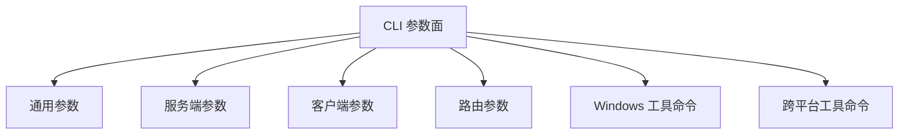

# 命令行参考

[English Version](CLI_REFERENCE.md)

## 范围

本文档基于 `main.cpp::PrintHelpInformation()`、`GetNetworkInterface()` 以及相关 utility command 处理逻辑整理。

它明确区分：

- 帮助输出中已经展示的开关
- 代码解析中的真实默认值
- 平台专用开关
- 已经实现但未完整出现在帮助文本里的辅助开关

## 执行形式

```text
ppp [OPTIONS]
```

默认角色：

- `server`

权限要求：

- administrator 或 root

## 参数地图



## 通用参数

| 参数 | 含义 | 代码默认值 |
| --- | --- | --- |
| `--rt=[yes|no]` | 是否启用实时模式 | 帮助中为 `yes` |
| `--mode=[client|server]` | 选择运行角色 | `server` |
| `--config=<path>` | 配置文件路径 | `./appsettings.json` |
| `--dns=<ip-list>` | 覆盖 DNS 列表 | 帮助中为 `8.8.8.8,8.8.4.4` |
| `--tun-flash=[yes|no]` | 设置默认 flash type of service / 高级 QoS 行为 | `no` |
| `--auto-restart=<seconds>` | 进程级自动重启间隔 | `0` |
| `--link-restart=<count>` | 链路重连次数 | `0` |
| `--block-quic=[yes|no]` | 在支持的平台上关闭客户端侧 QUIC 支持 | `no` |

## 服务端参数

| 参数 | 含义 | 代码默认值 |
| --- | --- | --- |
| `--firewall-rules=<file>` | 服务端打开时加载的防火墙规则文件 | 解析默认值为 `./firewall-rules.txt` |

## 客户端参数

| 参数 | 含义 | 代码默认值 |
| --- | --- | --- |
| `--lwip=[yes|no]` | 客户端协议栈选择 | 平台相关 |
| `--vbgp=[yes|no]` | vBGP 风格路由加载辅助 | 运行时默认 `yes` |
| `--nic=<interface>` | 首选物理网卡 | 自动选择 |
| `--ngw=<ip>` | 首选网关 | 自动探测 |
| `--tun=<name>` | 虚拟网卡名称 | `NetworkInterface::GetDefaultTun()` |
| `--tun-ip=<ip>` | 虚拟网卡 IPv4 地址 | `10.0.0.2` |
| `--tun-ipv6=<ip>` | 请求的客户端 IPv6 地址 | 默认空，由服务端分配逻辑决定 |
| `--tun-gw=<ip>` | 虚拟网关 | `10.0.0.1` |
| `--tun-mask=<bits>` | 虚拟子网掩码 | `30` |
| `--tun-vnet=[yes|no]` | 是否启用子网转发 | `yes` |
| `--tun-host=[yes|no]` | 是否优先宿主网络 | `yes` |
| `--tun-static=[yes|no]` | 是否启用 static 分组路径 | `no` |
| `--tun-mux=<connections>` | MUX 子链路数量 | `0` |
| `--tun-mux-acceleration=<mode>` | MUX 加速模式 | `0` |

## Linux 与 macOS 客户端参数

| 参数 | 含义 | 代码默认值 |
| --- | --- | --- |
| `--tun-promisc=[yes|no]` | 虚拟以太网路径是否使用混杂模式 | `yes` |

## Linux 专用客户端参数

| 参数 | 含义 | 代码默认值 |
| --- | --- | --- |
| `--tun-ssmt=<N>[/<mode>]` | worker 数量；`mq` 表示每个 worker 打开一个 tun queue | `0/st` |
| `--tun-route=[yes|no]` | 是否启用 route compatibility 模式 | `no` |
| `--tun-protect=[yes|no]` | 是否启用 route protect 服务 | `yes` |
| `--bypass-nic=<interface>` | bypass 路由文件绑定的网卡 | 自动选择 |

## macOS 专用客户端参数

| 参数 | 含义 | 代码默认值 |
| --- | --- | --- |
| `--tun-ssmt=<threads>` | SSMT 线程优化数量 | `0` |

## Windows 专用客户端参数

| 参数 | 含义 | 代码默认值 |
| --- | --- | --- |
| `--tun-lease-time-in-seconds=<sec>` | 虚拟网卡 DHCP 风格 lease time | `7200` |

## 路由参数

| 参数 | 含义 | 代码默认值 |
| --- | --- | --- |
| `--bypass=<file1|file2>` | 加载一个或多个 bypass IP 列表 | `./ip.txt` |
| `--bypass-ngw=<ip>` | bypass 路由所用网关 | 自动探测 |
| `--virr=[file/country]` | 拉取并刷新 APNIC 风格 IP 列表 | `./ip.txt/CN` |
| `--dns-rules=<file>` | DNS 规则文件 | `./dns-rules.txt` |

## Windows 工具命令

这些命令执行一次辅助操作后就退出。

| 命令 | 含义 |
| --- | --- |
| `--system-network-reset` | 重置 Windows 网络栈 |
| `--system-network-optimization` | 执行 Windows 网络优化流程 |
| `--system-network-preferred-ipv4` | 将 IPv4 设为优先协议 |
| `--system-network-preferred-ipv6` | 将 IPv6 设为优先协议 |
| `--no-lsp <program>` | 让指定程序不走 LSP 加载路径 |

## 跨平台工具命令

| 命令 | 含义 | 默认值 |
| --- | --- | --- |
| `--help` | 打印帮助信息 | none |
| `--pull-iplist [file/country]` | 下载 APNIC 国家 IP 列表并退出 | `./ip.txt/CN` |

## 已实现但未完整出现在帮助中的参数

### `--set-http-proxy`

Windows 解析路径支持 `--set-http-proxy`，在客户端模式下会进一步调用 `client->SetHttpProxyToSystemEnv()`。

这条能力在运行时中是存在的，但没有完整列在主帮助表里。

### mode 的别名

`IsModeClientOrServer()` 还会检查：

- `--m`
- `-mode`
- `-m`

帮助文本里只展示了 `--mode`。

## 关于默认值的说明

- 帮助表中的默认值与解析默认值大致一致，但应以解析代码为准。
- Windows 下的 `--lwip` 是特殊项，它会受 Wintun 是否可用影响。
- `--vbgp` 在未设置时会按启用处理。
- 帮助把 `--tun-mask=<bits>`` 表述成前缀位数，而解析路径内部还会经过地址规范化逻辑。

## 示例

### 最小服务端

```bash
ppp --mode=server --config=./appsettings.json
```

### 最小客户端

```bash
ppp --mode=client --config=./appsettings.json
```

### 带分流辅助的客户端

```bash
ppp --mode=client --config=./appsettings.json --bypass=./ip.txt --dns-rules=./dns-rules.txt --vbgp=yes
```

### Windows 工具命令

```powershell
ppp --system-network-reset
```

## 相关文档

- [`USER_MANUAL_CN.md`](USER_MANUAL_CN.md)
- [`CONFIGURATION_CN.md`](CONFIGURATION_CN.md)
- [`OPERATIONS_CN.md`](OPERATIONS_CN.md)
