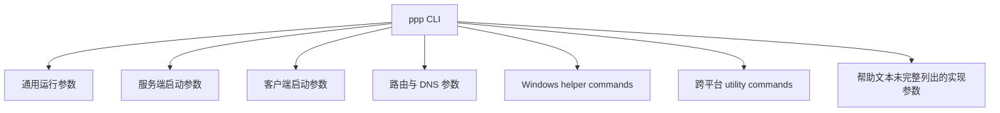

# 命令行参考

[English Version](CLI_REFERENCE.md)

## 文档范围

本文从代码事实出发解释 `ppp` 的命令行界面。主要依据：

- `main.cpp::PrintHelpInformation()`
- `main.cpp::GetNetworkInterface()`
- `main.cpp::IsModeClientOrServer()`
- `main.cpp` 中的 Windows helper command 处理路径

这样做很重要，因为帮助输出和真实解析逻辑虽然大体一致，但并不是完全逐字逐项相同。真正具有决定意义的是解析代码和最终运行行为，而不是终端里那块 help banner 本身。

因此，本文会明确区分四类内容：

- 帮助输出里已经展示的开关
- 解析代码中直接支持的开关
- 由运行时逻辑决定的默认值
- 执行一次系统动作后就退出的 helper commands

## 如何阅读本文

不要把 OPENPPP2 的 CLI 当成一张扁平参数表去背。它实际上包含多类不同性质的命令行行为：

- 进程启动整形
- 客户端本地网络整形
- 服务端本地策略整形
- 路由与 DNS 辅助输入
- 平台专用 helper command

这些东西不是一个层面。某些参数定义 `ppp` 进程的启动方式，某些参数会决定客户端虚拟网卡和本地路由环境如何创建，某些参数则根本不会启动长期运行的 tunnel process，而只是做一次系统级操作后退出。

## 调用形式

可执行形式是：

```text
ppp [OPTIONS]
```

运行要求管理员权限。

如果当前用户权限不足，`main.cpp` 会立即拒绝执行。

另外，运行时还会基于角色和配置路径创建防重复运行锁，因此不能把同一角色、同一配置路径对应的进程反复重入启动。

## CLI 在整个系统中的位置

OPENPPP2 不是纯命令行软件，它同时依赖：

- JSON 配置文件，例如 `appsettings.json`
- 命令行参数

JSON 文件定义的是持久化的系统模型。命令行主要用于：

- 选择运行角色
- 覆盖本地接口和路由行为
- 提供运维辅助输入
- 执行一次性 utility command

所以命令行是叠加在配置模型之上的控制面，不是完整替代品。

## 角色选择

命令行里最重要的决策是角色。

如果没有显式指定模式，`ppp` 默认是 server 模式。

真正的角色解析会检查以下 key：

- `--mode`
- `--m`
- `-mode`
- `-m`

帮助文本只展示 `--mode`，但代码实际接受上述别名。

如果最终得到的模式字符串以 `c` 开头，则视为 client 模式；否则保留在 server 模式。

也就是说：

- `client` 必须显式进入
- `server` 既可以显式指定，也可以由缺省逻辑自动落入

## 命令行类别

把整个 CLI 按层组织后会更容易理解。



## 通用运行参数

这组参数属于整个进程层，而不只属于 client 或 server 一侧。

### `--rt=[yes|no]`

含义：

- 按帮助文本的表述，它用于启用 real-time mode

说明：

- 这个参数出现在帮助里，但其更深层实际影响要结合线程调度和平台行为去理解，不能只看帮助中的一行描述

### `--mode=[client|server]`

含义：

- 选择当前进程运行成 tunnel client 还是 tunnel server

默认值：

- `server`

实际影响：

- 它会改变 `PppApplication` 的整个启动分支
- client 模式会创建虚拟网卡和客户端 switcher
- server 模式会打开监听器和服务端 session switch

### `--config=<path>`

含义：

- 指定 JSON 配置文件路径

默认值：

- `./appsettings.json`

实际影响：

- 决定系统启动时读取哪一份持久化配置模型

### `--dns=<ip-list>`

含义：

- 覆盖运行时使用的 DNS 服务器列表

帮助展示默认值：

- `8.8.8.8,8.8.4.4`

实际影响：

- 解析后写入 `NetworkInterface::DnsAddresses`
- 如果结果非空，运行时会重写异步 DNS 服务器列表

### `--tun-flash=[yes|no]`

含义：

- 启用帮助文本中所说的高级 QoS 或 flash type-of-service 行为

代码路径：

- 很早就通过 `Socket::SetDefaultFlashTypeOfService(...)` 生效

默认值：

- `no`

### `--auto-restart=<seconds>`

含义：

- 设置进程级自动重启间隔

默认值：

- `0`，表示关闭

实际影响：

- 会被写入全局运行时状态，用于生命周期层而不是传输层

### `--link-restart=<count>`

含义：

- 配置链路重启次数

默认值：

- `0`

实际影响：

- 它影响的是重连容忍和链路恢复逻辑，而不是初始配置加载

### `--block-quic=[yes|no]`

含义：

- 在支持的平台上关闭客户端侧 QUIC 相关支持

默认值：

- `no`

实际影响：

- 在 Windows 上，这会进入客户端侧与系统代理相关的行为路径

## 服务端启动参数

服务端 CLI 表面相对较少，因为大量服务端能力主要在 JSON 配置中定义。

### `--firewall-rules=<file>`

含义：

- 指定服务端打开时加载的 firewall rules 文件

解析默认值：

- `./firewall-rules.txt`

实际影响：

- 会被传入 `VirtualEthernetSwitcher::Open(...)`
- 它属于服务端接纳与策略执行边界，而不是传输握手边界

运维解读：

- 如果当前部署依赖显式 firewall gating，那么这个文件本身就是安全边界的一部分

## 客户端启动参数

客户端侧参数要丰富得多，因为客户端必须把 overlay 隧道落地到本机网络环境里。

### `--lwip=[yes|no]`

含义：

- 选择客户端本地协议栈行为

重要细节：

- 默认值带平台条件
- Windows 下会根据 Wintun 是否可用来整形默认值
- 非 Windows 平台走的是另一套默认路径

为什么重要：

- 这不是“显示效果”类参数，而是会实际改变客户端网络栈实现方式

### `--vbgp=[yes|no]`

含义：

- 启用 vBGP 风格的 route loading 辅助行为

运行时默认：

- 如果没有显式关闭，后续逻辑会按启用处理

为什么重要：

- 依赖 route file 和 route steering 的部署不能把“没写”误认为“默认关闭”

### `--nic=<interface>`

含义：

- 指定首选物理网卡

默认值：

- 自动选择

为什么重要：

- 在多网卡、多出口环境下，选错接口会直接改变路由行为

### `--ngw=<ip>`

含义：

- 指定首选网关

默认值：

- 自动探测

为什么重要：

- 它会直接影响客户端对本地网络可达性和路由注入的理解

### `--tun=<name>`

含义：

- 虚拟网卡名称

默认值：

- `NetworkInterface::GetDefaultTun()`

为什么重要：

- 网卡命名会影响本机上的可观测性，也会影响与其他 tunnel 软件并存时的管理体验

### `--tun-ip=<ip>`

含义：

- 客户端虚拟 IPv4 地址

默认值：

- `10.0.0.2`

重要细节：

- 后续会与 gateway 和 subnet 一起经过 `Ipep::FixedIPAddress(...)` 规范化

### `--tun-ipv6=<ip>`

含义：

- 请求的客户端 IPv6 地址

默认行为：

- 如果没有显式给出，则由服务端分配逻辑决定

为什么重要：

- 只有服务端 IPv6 服务明确配置时，这个参数才应被认真使用

### `--tun-gw=<ip>`

含义：

- 虚拟网关

默认值：

- `10.0.0.1`

### `--tun-mask=<bits>`

含义：

- 按帮助文本，它表示 subnet mask bits

显示默认值：

- `30`

实现细节：

- 解析时还会经过地址辅助逻辑规范化，所以应把它理解成 tunnel subnet shaping 的一部分，而不是孤立字符串

### `--tun-vnet=[yes|no]`

含义：

- 是否启用子网转发

默认值：

- `yes`

为什么重要：

- 这会影响客户端更像“主机型接入端”还是更像“具备转发能力的边缘节点”

### `--tun-host=[yes|no]`

含义：

- 是否优先宿主网络

默认值：

- `yes`

为什么重要：

- 它会影响本地路由优先级以及 overlay 与宿主网络的共存方式

### `--tun-static=[yes|no]`

含义：

- 是否启用 static packet path

默认值：

- `no`

为什么重要：

- 这不是一个简单的“加速勾选框”
- 它会切换到 `VirtualEthernetPacket.cpp` 描述的另一种数据路径风格

### `--tun-mux=<connections>`

含义：

- 指定 mux 子链路数量

默认值：

- `0`，表示关闭

为什么重要：

- MUX 是附加连接模型，不只是吞吐优化开关

### `--tun-mux-acceleration=<mode>`

含义：

- 指定 mux acceleration mode

默认值：

- `0`

实现细节：

- 解析路径会把超范围值纠正回支持范围，超过上限时退回 `0`

## Linux 与 macOS 客户端参数

### `--tun-promisc=[yes|no]`

含义：

- 是否在虚拟以太网路径上启用混杂模式

默认值：

- `yes`

为什么重要：

- 它改变的是虚拟接口如何参与本地网络环境，不应该因为“默认是 yes”就不加思考地接受

## Linux 专用客户端参数

Linux 的 CLI 曲面最丰富，因为 Linux 平台的网络集成深度最高。

### `--tun-ssmt=<N>[/<mode>]`

含义：

- 配置 worker 数量和可选模式

帮助解读：

- `mq` 表示 multiqueue，每个 worker 可以打开一个 tun queue

默认值：

- `0/st`

为什么重要：

- 它会直接改变 Linux 侧 tun I/O 的并行组织方式

### `--tun-route=[yes|no]`

含义：

- 启用 route compatibility mode

默认值：

- `no`

代码路径：

- 开启后会切换 `TapLinux::CompatibleRoute(true)`

为什么重要：

- 这不是普通功能勾选，而是 Linux 路由行为兼容性开关

### `--tun-protect=[yes|no]`

含义：

- 是否启用 route protection

默认值：

- `yes`

为什么重要：

- 在 Linux 上，它属于工程核心安全与生存能力的一部分，不应轻易关闭

### `--bypass-nic=<interface>`

含义：

- 指定 bypass route file 绑定的网卡

默认值：

- 自动选择

为什么重要：

- 多接口 Linux 部署中，bypass interface 的选择会直接改变路由走向

## macOS 专用客户端参数

### `--tun-ssmt=<threads>`

含义：

- macOS 下的 SSMT thread optimization 数量

默认值：

- `0`

为什么重要：

- 虽然 macOS 的平台特性面小于 Linux，但它仍然会影响本地 tun 路径的并发行为

## Windows 专用客户端参数

### `--tun-lease-time-in-seconds=<sec>`

含义：

- Windows 虚拟网卡 DHCP 风格 lease time

默认值：

- `7200`

解析细节：

- 如果输入值小于 `1`，代码会自动恢复到 `7200`

为什么重要：

- 这属于 Windows 网卡生命周期模型，而不是跨平台协议模型的一部分

## 路由与 DNS 参数

这组参数是最敏感的一组运维参数之一，因为它决定了什么流量会进入 overlay，什么流量仍然留在本地。

### `--bypass=<file1|file2>`

含义：

- 加载一个或多个 bypass IP list 文件

解析默认值：

- `./ip.txt`

实现细节：

- 解析器会对路径做 rewrite 和 full-path 解析，再装入 `NetworkInterface` 的 bypass 集合

为什么重要：

- bypass 文件不是“提示信息”，而是真正的策略输入

### `--bypass-ngw=<ip>`

含义：

- bypass 路由所使用的网关

默认值：

- 自动探测

### `--virr=[file/country]`

含义：

- 拉取并定期刷新 APNIC 风格的国家 IP 列表，进入 route-file 工作流

显示默认值：

- `./ip.txt/CN`

为什么重要：

- 它既是 utility command 的一部分，也是 route-policy 自动化的一部分

### `--dns-rules=<file>`

含义：

- 指定 DNS rules 文件

解析默认值：

- `./dns-rules.txt`

为什么重要：

- DNS rules 本身就是流量分流和泄漏控制的一部分

## Windows helper commands

这组命令的主要作用不是启动长期运行的 tunnel runtime，而是执行一次系统级操作后退出。

### `--system-network-reset`

含义：

- 重置 Windows 网络环境

行为：

- 走专门的 Windows helper 路径，执行后输出 `OK` 或 `FAIL`

### `--system-network-optimization`

含义：

- 执行 Windows network optimization 例程

行为：

- 在正常 runtime 启动前单独执行并退出

### `--system-network-preferred-ipv4`

含义：

- 把 IPv4 设为优先协议

### `--system-network-preferred-ipv6`

含义：

- 把 IPv6 设为优先协议

### `--no-lsp <program>`

含义：

- 让指定程序不进入 LSP 加载路径

为什么重要：

- 某些程序，包括 WSL 相关场景，会被错误的 LSP 行为影响，因此这不是装饰性功能

## 跨平台 utility commands

### `--help`

含义：

- 打印帮助信息并退出

实践提醒：

- 这是一份用户可见摘要，但不是 parser surface 的全部真相

### `--pull-iplist [file/country]`

含义：

- 下载 APNIC 国家 IP 列表并退出

显示默认值：

- `./ip.txt/CN`

为什么重要：

- 它既是 utility command，也是 route policy 准备工具

## 已实现但帮助里未完整展示的参数

代码里存在一些真实支持的行为，但它们没有完整地体现在 help table 里。

### `--set-http-proxy`

Windows 解析路径支持这个参数。

如果当前处于 client 模式并且设置了它，客户端后续会调用 `SetHttpProxyToSystemEnv()`。

为什么重要：

- 即使帮助横幅没有完整列出它，它也是真实的运行时行为，运维人员必须知道

### mode 别名

模式解析器还接受：

- `--m`
- `-mode`
- `-m`

帮助文本只展示 `--mode`。

## 默认值到底该相信谁

当帮助文本与解析代码之间存在轻微张力时，应以解析代码为准。

最重要的默认值细节包括：

- 真正的默认角色是 `server`
- `--lwip` 默认值带平台条件，Windows 还受 Wintun 路径影响
- `--vbgp` 在未显式关闭时按启用处理
- Windows 下 `--tun-lease-time-in-seconds` 遇到非法值会自动回正
- 多个 route 和 DNS 文件路径虽然常被认为是“外部资产”，但在解析器里其实有默认值

## 如何更安全地使用这套 CLI

最稳妥的操作顺序是：

1. 先确定角色
2. 再确定配置文件
3. 再决定这次运行是长期 tunnel process 还是一次性 helper command
4. 最后才加本地接口、路由、DNS、static、mux 或平台专用整形参数

这样可以降低误操作概率。

## 示例模式

### 最小服务端启动

```bash
ppp --mode=server --config=./appsettings.json
```

### 带 firewall rules 的服务端启动

```bash
ppp --mode=server --config=./appsettings.json --firewall-rules=./firewall-rules.txt
```

### 最小客户端启动

```bash
ppp --mode=client --config=./appsettings.json
```

### 显式整形本地虚拟网卡的客户端启动

```bash
ppp --mode=client --config=./appsettings.json --tun=openppp2 --tun-ip=10.0.0.2 --tun-gw=10.0.0.1 --tun-mask=30
```

### 带 route 与 DNS 策略输入的客户端启动

```bash
ppp --mode=client --config=./appsettings.json --bypass=./ip.txt --dns-rules=./dns-rules.txt --vbgp=yes
```

### 带 Linux route protect 与 multiqueue 调整的客户端启动

```bash
ppp --mode=client --config=./appsettings.json --tun-ssmt=4/mq --tun-protect=yes --bypass-nic=eth0
```

### Windows helper command 示例

```powershell
ppp --system-network-reset
```

## 最后说明

OPENPPP2 的 CLI 曲面之所以大，是因为它不是一个只转发字节的 tunnel 程序，而是一套带本地网络集成、route 与 DNS 控制、static mode、mux、mapping 以及平台特化行为的 client/server 基础设施运行时。

因此，正确的 CLI 心态不是“死记所有参数”，而是：

- 先理解你在改的是哪一层
- 分清这个参数影响的是 startup、policy、interface 还是 platform maintenance
- 把 route 与 DNS 参数视为策略输入
- 把平台 helper command 视为特权系统操作

## 相关文档

- [`USER_MANUAL_CN.md`](USER_MANUAL_CN.md)
- [`CONFIGURATION_CN.md`](CONFIGURATION_CN.md)
- [`OPERATIONS_CN.md`](OPERATIONS_CN.md)
- [`PLATFORMS_CN.md`](PLATFORMS_CN.md)
