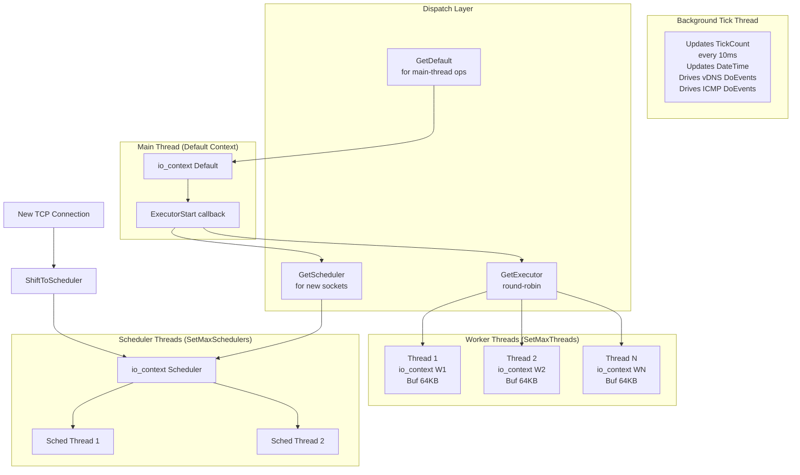
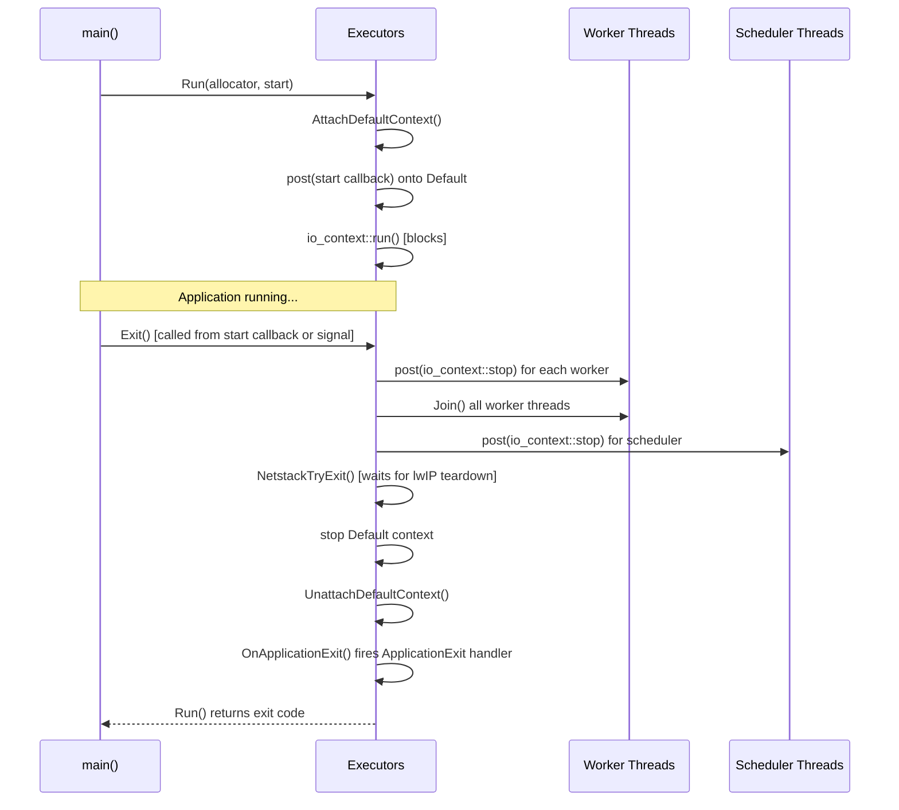
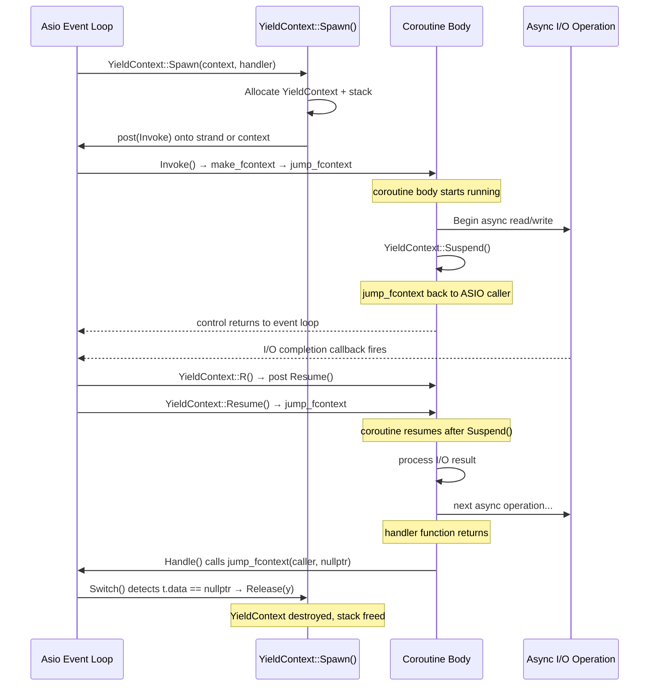
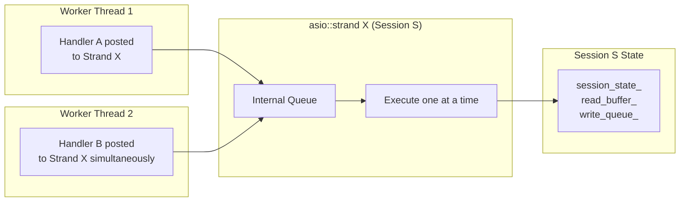
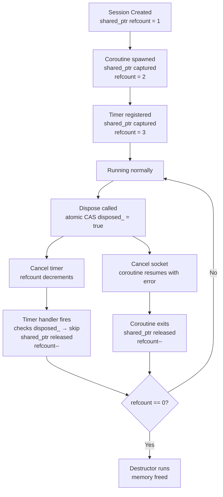
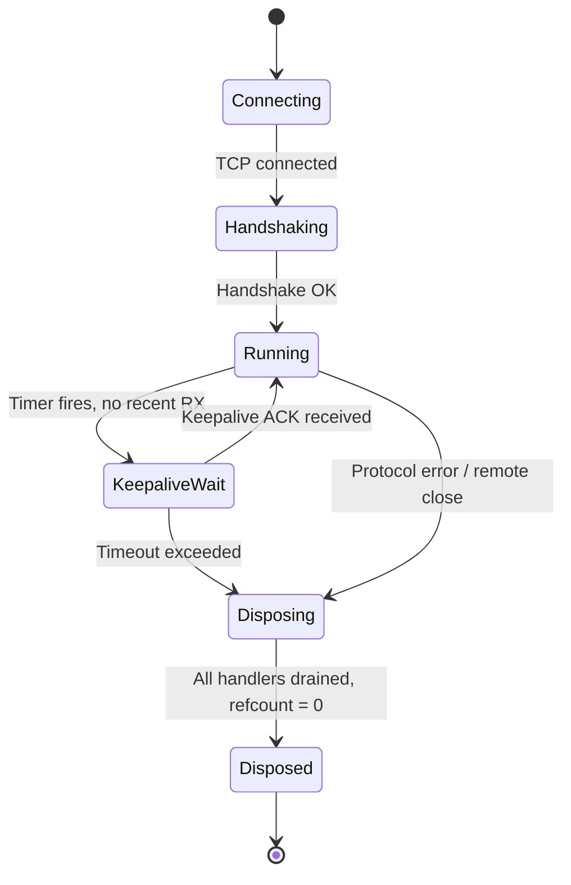
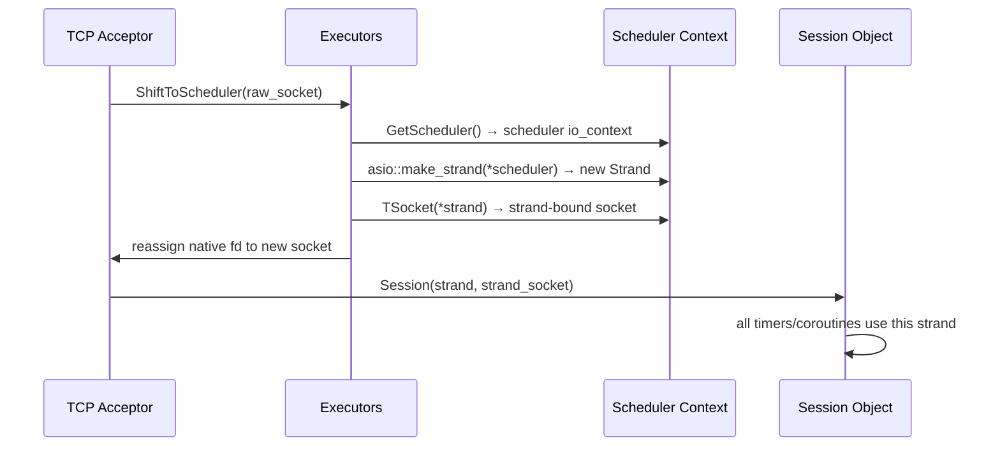
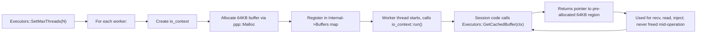
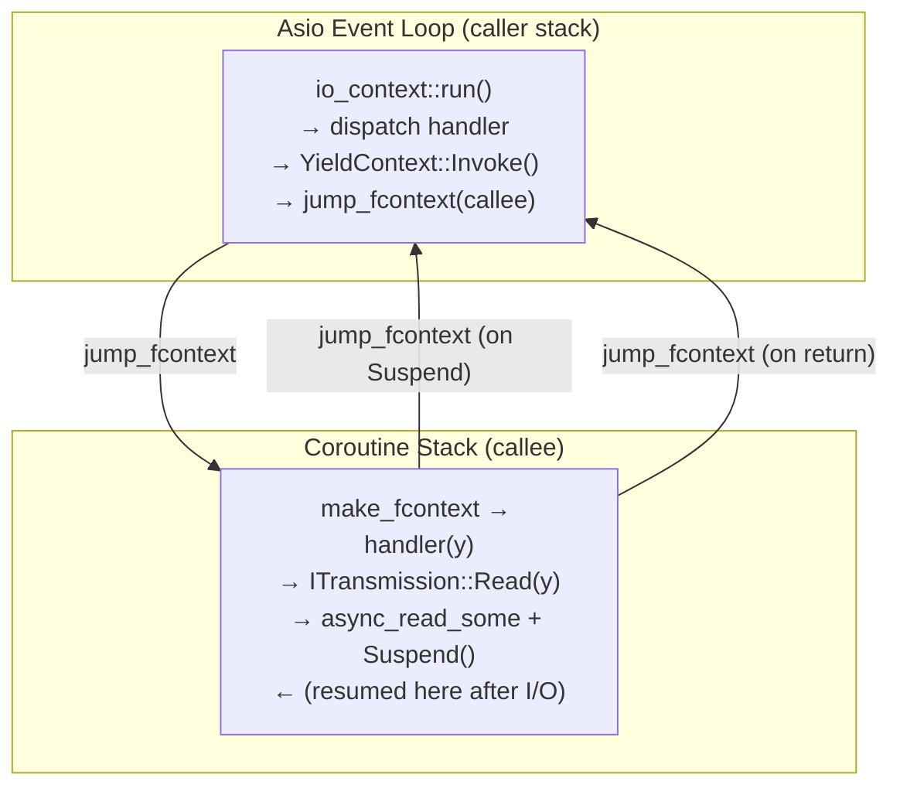
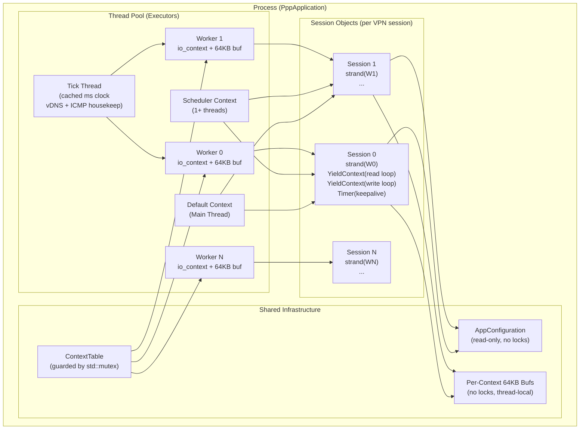

# Concurrency Model

[中文版本](CONCURRENCY_MODEL_CN.md)

This document describes the complete multi-threading and concurrency architecture of OPENPPP2. It is written for developers who are new to the codebase and need to understand how the event loop, thread pool, coroutine system, and synchronization primitives fit together before touching any concurrent code.

---

## 1. Overview

OPENPPP2 is a long-running network infrastructure process that must remain stable and responsive across thousands of concurrent sessions. To achieve this, it combines three complementary concurrency mechanisms:

- **Boost.Asio `io_context`** as the central event loop and I/O reactor
- **Stackful coroutines via `YieldContext`** to express sequential logic without blocking threads
- **`asio::strand`** to serialize handler execution within a session without any explicit mutex

Together these form what the project calls an **Event-Driven State Machine (EDSM)** architecture. Every VPN session, every connection, and every protocol state transition is modeled as a state machine whose transitions are driven by Asio events and whose sequential logic is expressed through coroutines that yield at every async boundary.

### Why Not Threads-Per-Session?

A naive approach assigns one OS thread per connection. This breaks down at thousands of sessions because each thread carries a stack (typically 1–8 MB), context-switch overhead, and scheduler pressure. OPENPPP2 instead runs a small fixed thread pool where every thread drives one `io_context`. The number of OS threads is bounded by the physical CPU core count, not by the session count.

### Why Not Callbacks Only?

Pure callback-based async code (the classic "callback hell") forces sequential protocol logic to be split across many small functions, making it extremely hard to reason about error paths and resource lifetimes. The `YieldContext` coroutine wrapper allows sequential-looking code that compiles to callback chains transparently.

### Why Not `std::coroutine` / C++20 Coroutines?

The project is locked to **C++17**. All coroutine machinery is implemented using Boost.Context (`boost::context::detail::fcontext_t`) for explicit stack management and `jump_fcontext` for context switching — no C++20 language features are used anywhere.

### EDSM Design Philosophy

Every session object is simultaneously:

1. A **state machine** — it holds an explicit lifecycle state (connecting, handshaking, running, closing, disposed)
2. A **coroutine host** — it spawns one or more `YieldContext` coroutines to drive I/O
3. A **strand owner** — all handlers touching the session's state are serialized through one `asio::strand`

This triple structure means that a developer can write the handshake logic as a straight-line coroutine (`read header → validate → send reply → enter data loop`) while the runtime guarantees that:

- No two handlers ever execute concurrently for the same session
- The session object is kept alive by `shared_ptr` reference counting for as long as any handler references it
- Disposal is idempotent: atomic flags prevent double-free and double-dispose

---

## 2. Thread Pool Architecture

### `Executors` Class

The `ppp::threading::Executors` class (`ppp/threading/Executors.h`, `ppp/threading/Executors.cpp`) is the process-wide singleton that manages all `io_context` instances and the threads that drive them. It exposes no constructor — all interaction is through static methods.

Internally, `Executors` maintains a `ExecutorsInternal` struct (defined only in `Executors.cpp`) that holds:

| Field | Type | Purpose |
|---|---|---|
| `Default` | `shared_ptr<io_context>` | The main-thread context created by `Run()` |
| `Scheduler` | `shared_ptr<io_context>` | Optional high-priority context for socket-level I/O (created by `SetMaxSchedulers`) |
| `ContextFifo` | `list<ContextPtr>` | Round-robin queue of worker contexts |
| `ContextTable` | `unordered_map<thread_id, ContextPtr>` | Maps each worker thread ID to its context |
| `Threads` | `unordered_map<io_context*, ThreadPtr>` | Maps context pointer to managing `Thread` object |
| `Buffers` | `unordered_map<io_context*, ByteArrayPtr>` | Per-context reusable packet buffer (one 64 KB buffer per thread) |
| `TickCount` | `atomic<uint64_t>` | Cached millisecond tick count, updated every 10 ms by a dedicated tick thread |

### Context Categories

There are three distinct categories of `io_context` in a running process:

**Default context** — created by `Executors::Run()`, runs on the calling (main) thread. The application entry callback is posted here. This is the context that the process blocks on until shutdown.

**Worker contexts** — created by `Executors::SetMaxThreads()`, each running on its own `Thread` at `ThreadPriority::Highest`. These handle the majority of session I/O. The count is typically set to `processor_count - 1` to leave headroom for the main thread and scheduler threads.

**Scheduler context** — created by `Executors::SetMaxSchedulers()`, running on one or more high-priority threads. When a new TCP connection is accepted, `Executors::ShiftToScheduler()` migrates the raw socket from the acceptor thread to the scheduler context and wraps it in a new `asio::strand`. This separation isolates the fast-path socket setup from general session work.

### Round-Robin Dispatch

When session code calls `Executors::GetExecutor()` to obtain a context for a new object, the implementation uses a simple FIFO rotation:

```cpp
// From Executors.cpp — Executors::GetExecutor()
ExecutorLinkedList::iterator tail = fifo.begin();
context = std::move(*tail);
fifo.erase(tail);
fifo.emplace_back(context);   // rotate to back
```

When only one worker context exists, the rotation is skipped and that single context is returned directly. When no worker contexts exist at all (single-threaded configuration), the default context is returned as fallback.

### Thread Pool Topology



### Per-Thread Cached Buffer

Each `io_context` (and the thread that drives it) has exactly one pre-allocated 64 KB byte buffer registered in `Internal->Buffers`. Session code retrieves this via `Executors::GetCachedBuffer(context)`. Because each context is driven by a single OS thread, the buffer is accessed exclusively within that thread's event handlers — no synchronization is needed. This is a deliberate design choice: the shared buffer saves thousands of heap allocations per second on high-traffic nodes.

### Startup and Shutdown Sequence



---

## 3. Coroutine Model

### `YieldContext` Design

`ppp::coroutines::YieldContext` (`ppp/coroutines/YieldContext.h`, `ppp/coroutines/YieldContext.cpp`) is a stackful coroutine wrapper built directly on `boost::context::detail::fcontext_t` and `jump_fcontext`. It deliberately does **not** use `boost::asio::spawn` or `boost::coroutines2::coroutine` — this gives full control over stack allocation, lifetime, and scheduling.

Each `YieldContext` object owns:

| Member | Purpose |
|---|---|
| `stack_` | Allocated coroutine stack memory (`shared_ptr<Byte>`, default `PPP_COROUTINE_STACK_SIZE` bytes) |
| `callee_` | `atomic<fcontext_t>` — the coroutine's own saved register state |
| `caller_` | `atomic<fcontext_t>` — the Asio event-loop's saved register state |
| `s_` | `atomic<int>` — four-state machine flag |
| `strand_` | Optional `asio::strand*` for serialized resume posting |
| `context_` | Reference to the owning `io_context` |

### Four-State Machine

The internal state `s_` drives suspension and resumption:

```
STATUS_RESUMED    = 0   (coroutine is running)
STATUS_SUSPENDING = 1   (Suspend() in progress, about to jump to caller)
STATUS_SUSPEND    = 2   (fully suspended, waiting for Resume())
STATUS_RESUMING   = -1  (Resume() in progress, about to jump to callee)
```

All transitions use `compare_exchange_strong` to prevent race conditions between the coroutine body and the Asio event handler that calls `Resume()`.

### Spawn, Suspend, Resume Flow



### Synchronous vs Asynchronous Mode

A key pattern throughout the codebase is the `nullof<YieldContext>()` sentinel. Many functions accept a `YieldContext*` (or `YieldContext&`) parameter. The caller controls the execution model by what it passes:

- **Pass a valid `YieldContext&`**: the function operates in coroutine mode. It initiates async I/O, calls `y.Suspend()`, and the caller unblocks only when the operation completes and `Resume()` is called.
- **Pass `nullof<YieldContext>()`** (i.e., a non-null pointer to address zero, yielding `operator bool() == false`): the function operates in blocking/thread-based mode. It initiates async I/O, uses an `Executors::Awaitable` to block the calling OS thread until completion.

This pattern lets a single implementation serve both coroutine callers (the common path) and thread-blocking callers (used by background worker threads that cannot yield). It is **not** undefined behavior — the `nullof` pointer is never dereferenced; it is only compared against `NULLPTR` to select a branch.

### Stack Allocation Strategy

Stacks are allocated via `BufferswapAllocator` when one is provided, or through `ppp::Malloc` otherwise. The default stack size is `PPP_COROUTINE_STACK_SIZE` (defined in `stdafx.h`). The stack pointer passed to `make_fcontext` is the **top** of the stack region (`stack + stack_size`), consistent with x86/ARM calling conventions where stacks grow downward.

---

## 4. Strand-Based Serialization

### What Is a Strand?

`boost::asio::strand<io_context::executor_type>` is a lightweight Asio primitive that guarantees: **at most one handler posted through the strand will execute at any time**. When two handlers are queued simultaneously, the second is deferred until the first completes. No mutex is involved — the strand is implemented as a queue inside Asio's executor machinery.

### Per-Session Strand Pattern

Every session object in OPENPPP2 holds one `StrandPtr` (a `shared_ptr<asio::strand<...>>`). All async operations — socket reads, socket writes, timer callbacks, and cross-thread notifications — are dispatched through this strand. The result is that:

1. Session state is never accessed by two threads concurrently
2. No `std::mutex` is needed inside a session object for state that is only touched from its own strand
3. Coroutines spawned with `YieldContext::Spawn(..., strand, handler)` will have their `Resume()` posted back through the same strand, maintaining the serialization guarantee across yield points

### ShiftToScheduler and Strand Creation

When a new TCP socket arrives, `Executors::ShiftToScheduler()` is called. This function:

1. Calls `GetScheduler()` to obtain the scheduler `io_context`
2. Creates a new `asio::strand` on that context: `make_shared_object<Strand>(asio::make_strand(*scheduler))`
3. Creates a new socket bound to that strand: `make_shared_object<TSocket>(*strand)`
4. Releases the native file descriptor from the old socket and assigns it to the new socket

From this point, all I/O on the migrated socket runs through the scheduler context's thread pool, serialized by the session's strand.

### Strand Serialization Flow



Handler A and Handler B might be submitted from different OS threads, but the strand ensures they never overlap. The session state is effectively single-threaded even though it lives in a multi-threaded pool.

### When Not to Use a Strand

Strands add a small queuing overhead. For global state that is rarely mutated and accessed from many contexts simultaneously (e.g., the `ContextTable` inside `ExecutorsInternal`), a plain `std::mutex` with a brief critical section is used instead. The rule is: **per-object serialization uses strand; global table mutations use mutex**.

---

## 5. Cross-Thread Lifecycle Management

### The Disposal Problem

In a system with many sessions sharing pointers across async callbacks, the fundamental danger is: a callback fires after the session it references has already been destroyed. OPENPPP2 uses three layered defenses:

**Layer 1 — `shared_ptr` reference counting**: every session object inherits from `std::enable_shared_from_this<T>`. All posted handlers capture a `shared_ptr` (or `weak_ptr`) to the session. As long as any handler is enqueued, the session stays alive.

**Layer 2 — `weak_ptr` for optional references**: when a subsystem holds a reference to a session but should not prevent its destruction, it holds a `weak_ptr` and calls `lock()` before use. If the session is already gone, `lock()` returns null and the subsystem skips the operation cleanly.

**Layer 3 — Atomic dispose flag**: even when `shared_ptr` keeps the object alive, the session might have been logically disposed. An `atomic<bool>` `disposed_` flag is set once during `Dispose()`. All entry points check this flag first via `compare_exchange_strong` with `memory_order_acq_rel`:

```cpp
// Canonical dispose pattern used throughout the codebase
bool expected = false;
if (!disposed_.compare_exchange_strong(expected, true,
        std::memory_order_acq_rel, std::memory_order_relaxed))
{
    return;   // already disposed by another thread — idempotent exit
}
// perform actual teardown...
```

`memory_order_acq_rel` on the CAS ensures:
- The **acquire** side: the thread that wins the CAS sees all prior writes from any thread that previously wrote to the object
- The **release** side: all writes performed by this thread before the CAS are visible to any thread that later observes the flag as `true`

### Object Lifetime Diagram



### Deadlock Avoidance Rules

The combination of coroutines, strands, and mutexes creates deadlock risk. The project follows these hard rules:

1. **Never hold a `std::mutex` across a `YieldContext::Suspend()` call.** The coroutine yields control back to the event loop while holding the lock; if any event handler tries to acquire the same mutex (even on the same thread), a deadlock occurs.

2. **Never call `Awaitable::Await()` from within an `io_context` thread.** `Await()` blocks the calling OS thread. If the completion that signals `Await()` is supposed to run on the same `io_context`, the loop can never process it.

3. **Never post blocking operations to an `io_context` thread.** All blocking I/O, DNS resolution, and file access must happen on dedicated threads, with results communicated back via `asio::post`.

4. **Lock order**: when multiple mutexes must be held simultaneously, acquire them in a consistent global order (declared in `ExecutorsInternal`). In practice the codebase avoids holding more than one mutex at a time.

---

## 6. SpinLock Usage

### `SpinLock` vs `std::mutex`

OPENPPP2 provides two custom spin-lock types in `ppp/threading/SpinLock.h`:

| Type | Recursive | Use Case |
|---|---|---|
| `SpinLock` | No | Non-reentrant critical sections that complete in nanoseconds |
| `RecursiveSpinLock` | Yes | Call sites that may re-enter the same lock from the same thread |

Both implement the STL `Lockable` concept (`lock()` / `unlock()`), so they work with `std::lock_guard` and `std::unique_lock`.

### When to Use SpinLock

A `SpinLock` is appropriate when:

1. The critical section is extremely short — typically a few memory reads/writes with no function calls
2. Lock contention is rare — the spin rarely loops more than once
3. Blocking is unacceptable — a `std::mutex` yields the thread, which may be costly if the lock is held for only a few nanoseconds

`SpinLock` is **not** appropriate when:

- The critical section calls any I/O function, `malloc`, or any system call
- The critical section can block waiting for an external event
- The lock may be held for more than a few microseconds

For `ExecutorsInternal::Lock`, which guards the global context tables, a `std::mutex` is used because:
- The tables are accessed rarely (on session creation/destruction)
- The critical section includes hash map operations (non-trivial cost)
- Spinning on a map operation would waste CPU

### `RecursiveSpinLock` Internals

`RecursiveSpinLock` wraps a plain `SpinLock` and adds:

- `volatile int64_t tid_` — the OS thread ID of the current lock owner (0 when unowned)
- `atomic<int> reentries_` — the current recursion depth

On `TryEnter()`, if the calling thread's ID matches `tid_`, the recursion count is incremented and the call returns immediately without contending. On `Leave()`, the recursion count is decremented; only when it reaches zero is the underlying `SpinLock` released and `tid_` cleared.

### TryEnter with Timeout

Both lock types support `TryEnter(int loop, int timeout)`:

- `loop < 0` means infinite retry (equivalent to `Enter()`)
- `timeout < 0` means no wall-clock timeout
- When both limits are positive, the spin exits on whichever condition triggers first

This allows callers to implement non-blocking "try once" patterns (`TryEnter()` with no arguments, returns `false` on failure) alongside timed-wait patterns for diagnostics.

---

## 7. Timer and Keepalive

### Boost.Asio `deadline_timer` Usage

Timers in OPENPPP2 are managed through Boost.Asio's `boost::asio::deadline_timer` (and in some paths, `boost::asio::steady_timer`). Timers are always created on a specific `io_context` or strand. The canonical pattern is:

```cpp
// Create timer on the session's context
auto timer = make_shared_object<boost::asio::deadline_timer>(context);

// Schedule expiry
timer->expires_from_now(boost::posix_time::seconds(30));
timer->async_wait(
    [self = shared_from_this(), timer](const boost::system::error_code& ec) noexcept
    {
        if (ec || self->disposed_)
        {
            return;   // cancelled or session already gone
        }
        self->OnKeepaliveTimeout();
    });
```

Key points:
- The lambda captures `shared_from_this()` to keep the session alive until the timer fires
- `boost::system::error_code::value() == boost::asio::error::operation_aborted` indicates cancellation via `timer->cancel()`
- All timer handlers check `disposed_` at entry before touching session state

### Cached Tick Count

Rather than calling the system clock on every timer decision, `Executors::GetTickCount()` returns a cached millisecond count maintained by the background tick thread (updated every 10 ms). This reduces system-call overhead for high-frequency keepalive checks across many sessions.

The tick thread also drives two periodic tasks:
- `ppp::net::asio::vdns::UpdateAsync()` — refreshes virtual DNS entries once per second
- `ppp::net::asio::InternetControlMessageProtocol_DoEvents()` — processes pending ICMP state

### Keepalive in VirtualEthernetLinklayer

The `VirtualEthernetLinklayer` class (not reproduced in full here, but representative of all session types) maintains two timestamps: last-receive time and last-send time. A periodic timer fires roughly every second and checks whether either timestamp has exceeded the configured `kAliveTimeout`. If so:

1. If no data has been sent recently, a keepalive ping is dispatched
2. If no data has been received beyond a hard deadline, the session is disposed

This ensures that dead connections (where the remote peer has silently disappeared) are reclaimed promptly, freeing resources for new sessions.

### Timer and Session Lifetime Interaction



All state transitions are driven by Asio event handlers serialized through the session strand. No transition can occur while another is in progress, eliminating the need for state-machine mutexes.

---

## 8. Summary: Concurrency Rules for New Developers

Before writing any code that touches session state or is posted to an `io_context`, internalize these rules:

| Rule | Reason |
|---|---|
| Never block an `io_context` thread | Blocking one thread starves all sessions on that context |
| Always capture `shared_from_this()` in async lambdas | Prevents use-after-free when session is disposed before callback fires |
| Always check `disposed_` at the start of every handler | Prevents operating on a logically dead session |
| Use `compare_exchange_strong(memory_order_acq_rel)` for lifecycle flags | Provides correct acquire/release semantics across threads |
| Never hold a mutex across `Suspend()` | Deadlock: the event loop cannot run while the mutex is held |
| Post all cross-thread work via `asio::post` or through a strand | Raw thread synchronization objects must not be created in session paths |
| Use `SpinLock` only for nanosecond-scale critical sections | Spinning wastes CPU for anything longer |
| One 64 KB buffer per `io_context` thread — do not share across contexts | The buffer is thread-local by design; accessing it from another context is a data race |

---

## Related Documents

- [`ARCHITECTURE.md`](ARCHITECTURE.md) — system-level architecture overview
- [`STARTUP_AND_LIFECYCLE.md`](STARTUP_AND_LIFECYCLE.md) — process startup and shutdown flow
- [`ENGINEERING_CONCEPTS.md`](ENGINEERING_CONCEPTS.md) — foundational engineering principles
- [`TRANSMISSION.md`](TRANSMISSION.md) — transport carrier and handshake
- [`LINKLAYER_PROTOCOL.md`](LINKLAYER_PROTOCOL.md) — tunnel action vocabulary

---

## 9. Awaitable — Blocking Caller Bridge

### 9.1 Purpose

While coroutines are the dominant execution model, some code paths run on dedicated OS threads (not `io_context` threads) and need to block synchronously waiting for an async result. `Executors::Awaitable<T>` provides this bridge.

### 9.2 Awaitable API

```cpp
// Create an Awaitable signal
auto awaitable = make_shared_object<Executors::Awaitable>();

// On the io_context thread — signal completion (no arguments)
awaitable->Processed();

// On the caller OS thread — block until Processed() is called
bool completed = awaitable->Await();
```

`Await()` uses a `std::condition_variable` to block. `Processed()` sets an internal flag and notifies the condition. Once signalled, `Await()` returns `true`. If the Awaitable is destroyed before `Processed()` is called, `Await()` returns `false`.

**Note**: `Awaitable` is a binary signal primitive, not a typed result carrier. It does not carry a return value — it only communicates "work done" vs "not done". If you need to pass a result back, capture it in a shared variable before calling `Processed()`.

### 9.3 When Awaitable is Appropriate

| Caller type | Appropriate mechanism |
|-------------|----------------------|
| `io_context` coroutine | `YieldContext::Suspend()` / `Resume()` |
| Dedicated worker OS thread | `Executors::Awaitable::Await()` |
| Unit test or synchronous API call | `Executors::Awaitable::Await()` |

**Never** call `Awaitable::Await()` from within an `io_context` thread — it will deadlock if the completion handler also runs on that context.

### 9.4 `nullof<YieldContext>()` Pattern in Depth

The `nullof<YieldContext>()` pattern is used to select between coroutine-mode and thread-blocking-mode at a single call site. Consider:

```cpp
// Function supports both callers:
bool SomeLinklayerOperation(YieldContext* y, int param) noexcept
{
    if (y && *y)
    {
        // Coroutine mode: async I/O, yield to event loop
        return DoAsyncVariant(y, param);
    }
    else
    {
        // Thread-blocking mode: use Awaitable
        auto aw = make_shared_object<Executors::Awaitable>();
        asio::post(*context_, [aw, param]() {
            DoAsyncVariant(nullptr, param);
            aw->Processed();
        });
        aw->Await();
    }
}
```

`nullof<YieldContext>()` is defined in `ppp/stdafx.h` as a constexpr that returns `*(T*)NULLPTR` — a reference at the null pointer address. Callees compare `&y == nullof<YieldContext>()` to detect this sentinel (the address is 0). When they detect it, they switch to a thread-blocking code path instead of a coroutine-async path. This allows one implementation to serve both coroutine callers and thread-blocking callers. It is **not** undefined behavior — the reference is never dereferenced; only its address is compared.

---

## 10. Thread Naming and Priority

### 10.1 Thread Naming

Every worker thread and scheduler thread created by `Executors` is named using the platform-native API:

| Platform | API | Example name |
|----------|-----|-------------|
| Linux | `pthread_setname_np()` | `"ppp-worker-0"` |
| Windows | `SetThreadDescription()` | `L"ppp-worker-0"` |
| Android | `pthread_setname_np()` | `"ppp-worker-0"` |
| macOS | `pthread_setname_np()` | `"ppp-worker-0"` |

If naming fails, `RuntimeThreadNameFailed` (proposed/design item, not in current `ErrorCodes.def`; nearest existing: `StdAfxSetThreadNameEmptyName`) is set but execution continues — thread naming is advisory only.

### 10.2 Thread Priority

Worker and scheduler threads are started at `ThreadPriority::Highest` (platform-mapped to `THREAD_PRIORITY_HIGHEST` on Windows, `SCHED_OTHER` with high nice value on Linux, `QOS_CLASS_USER_INTERACTIVE` on macOS/iOS). This ensures that network I/O is not starved by low-priority background tasks.

The background tick thread runs at default priority — it only updates cached timestamps and drives vDNS/ICMP housekeeping, so latency is not critical.

---

## 11. Asio Executor Composition and `make_strand`

### 11.1 Executor Types Used

OPENPPP2 uses three Asio executor types across the codebase:

| Type | Description |
|------|-------------|
| `io_context::executor_type` | Raw executor from an `io_context` |
| `asio::strand<io_context::executor_type>` | Serializing wrapper around the raw executor |
| `asio::io_context&` (implicit) | Direct context reference for timer construction |

All session objects hold a `StrandPtr` (a `shared_ptr<asio::strand<io_context::executor_type>>`) created via `asio::make_strand(*io_context_ptr)`. Timers and sockets within a session bind to this strand.

### 11.2 Strand Creation Lifecycle



### 11.3 Posting Cross-Strand Work

When code running on one strand needs to trigger work on a different strand (e.g., a session notifying a global router), it uses `asio::post`:

```cpp
// From session strand: post work onto a different strand or context
asio::post(*target_strand_or_context,
    [self = shared_from_this(), data = std::move(data)]() noexcept
    {
        self->ProcessCrossStrandData(data);
    });
```

This is always safe: `asio::post` is thread-safe and does not require the caller to be on any particular thread.

---

## 12. Memory Model for Packet Buffers

### 12.1 Per-Context 64 KB Buffer

The 64 KB buffer per `io_context` (stored in `Executors::Buffers`) is the single most important memory optimization in the hot path. Every UDP receive, TAP frame read, and ITransmission read cycle reuses this buffer rather than allocating a new one.

The buffer lifetime is tied to the `io_context` lifecycle:



When `Executors::Exit()` is called, `ContextFifo`, `ContextTable`, `Buffers`, and `Threads` are all cleared. `shared_ptr` destruction frees the buffers via `ppp::Mfree`.

### 12.2 IPFrame and UdpFrame Heap Allocation

While the 64 KB receive buffer avoids per-packet allocations for raw byte reads, parsed protocol objects (`IPFrame`, `UdpFrame`, `IcmpFrame`) are allocated on the heap via `ppp::Malloc` (which routes through jemalloc when `JEMALLOC` is defined). These objects are wrapped in `shared_ptr` and freed when the last holder (typically the linklayer serializer) drops its reference.

This two-tier approach balances hot-path efficiency (no allocation for the raw read buffer) against correctness (heap allocation for structured objects that may outlive the raw buffer).

### 12.3 jemalloc Integration

When the `JEMALLOC` preprocessor macro is defined (set by CMake when building with jemalloc support):

- `ppp::Malloc(size)` calls `je_malloc(size)`
- `ppp::Mfree(ptr)` calls `je_free(ptr)`
- `ppp::allocator<T>` routes all STL container allocations through jemalloc

On Android, jemalloc is already embedded in the system libc — no additional jemalloc layer is added. On Linux and Windows, jemalloc is linked statically from the third-party library directory (`THIRD_PARTY_LIBRARY_DIR/jemalloc/lib/libjemalloc.a`).

---

## 13. Detailed `YieldContext` State Transitions

### 13.1 State Machine Table

| From State | Event | To State | Action |
|------------|-------|----------|--------|
| `RESUMED(0)` | `Suspend()` called by coroutine | `SUSPENDING(1)` | CAS from 0 → 1 |
| `SUSPENDING(1)` | No `Resume()` raced | `SUSPEND(2)` | `jump_fcontext` to caller |
| `SUSPENDING(1)` | `Resume()` raced | `RESUMED(0)` | CAS detects race; skip jump |
| `SUSPEND(2)` | `Resume()` called | `RESUMING(-1)` | CAS from 2 → -1 |
| `RESUMING(-1)` | Re-entered via `jump_fcontext` | `RESUMED(0)` | CAS from -1 → 0 |

The race between `Suspend()` and `Resume()` is correctly handled: if `Resume()` fires before the coroutine fully suspends (the `SUSPENDING` window), the CAS in `Suspend()` detects that state is no longer `SUSPENDING` and skips the context switch, keeping the coroutine running. This eliminates a lost-wakeup race without any mutex.

### 13.2 Stack Frame Diagram



The two stacks are completely independent memory regions. The coroutine stack is allocated from the heap (via `ppp::Malloc`) at a fixed size; the caller stack is the normal OS thread stack. `jump_fcontext` saves/restores all callee-saved registers in a single call.

---

## 14. Practical Debugging Guide for Concurrency Issues

### 14.1 Deadlock Identification

If the process hangs and all `io_context` threads are blocked, the most common causes are:

1. **Mutex held across `Suspend()`**: Use a debugger to examine each worker thread's stack. If you see `SpinLock::Enter()` or `std::mutex::lock()` below `YieldContext::Suspend()` in the call stack, that is the root cause.
2. **`Awaitable::Await()` on io_context thread**: Look for `std::condition_variable::wait()` on a thread that is also the owner of an `io_context`. This will never complete if the signaller runs on the same context.
3. **Circular strand dependency**: Rare but possible if strand A posts to strand B and strand B synchronously waits for strand A to complete.

### 14.2 Use-After-Free Detection

Symptoms: crash or data corruption in a handler that fires after session teardown.

Diagnosis:
1. Confirm whether the handler captures `shared_from_this()`. If it captures a raw pointer or a `weak_ptr` without calling `lock()`, the session may be destroyed before the handler runs.
2. Check whether `disposed_` is tested at handler entry.
3. Use AddressSanitizer (`-fsanitize=address`) on a debug build to catch the exact access.

### 14.3 Performance Bottlenecks

High CPU on a single worker thread despite multiple worker contexts:

- Check `Executors::GetExecutor()` rotation. If all sessions are created on the same `io_context` (e.g., a server that never calls `ShiftToScheduler`), all work concentrates on one thread.
- Verify `SetMaxSchedulers()` is called. Without a scheduler context, new connection setup runs on the default context.
- Profile with `perf` (Linux) or VTune (Windows). Common hot spots: `jump_fcontext`, `malloc/free`, OpenSSL `EVP_EncryptUpdate`.

### 14.4 Coroutine Leak Detection

A coroutine leak occurs when a `YieldContext` is suspended and `Resume()` is never called, preventing the coroutine stack from being freed.

Detection: track `YieldContext` construction and destruction counts. If construction count exceeds destruction count indefinitely, there is a leak.

Common cause: an async operation (timer, socket) is cancelled but the completion handler is never delivered. Boost.Asio guarantees that cancellation always delivers a handler with `operation_aborted` — ensure that the cancelled operations' handlers call `Resume()` unconditionally (the coroutine checks the error code after resumption).

---

## 15. Concurrency Architecture Diagram (Full System)


