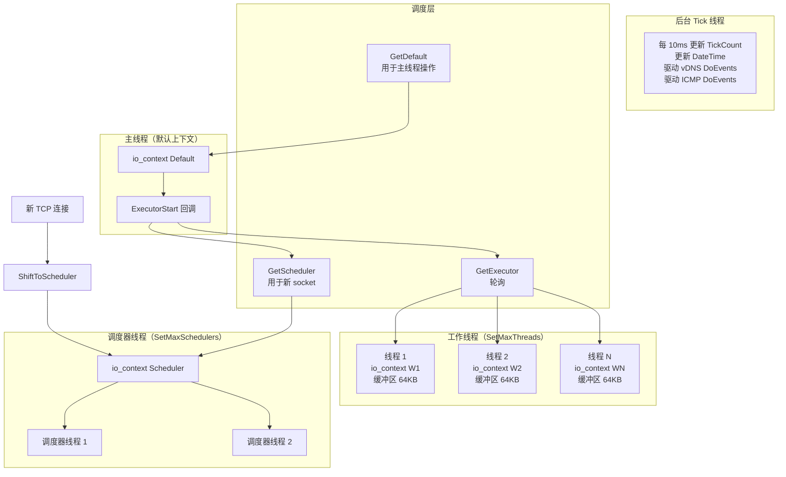
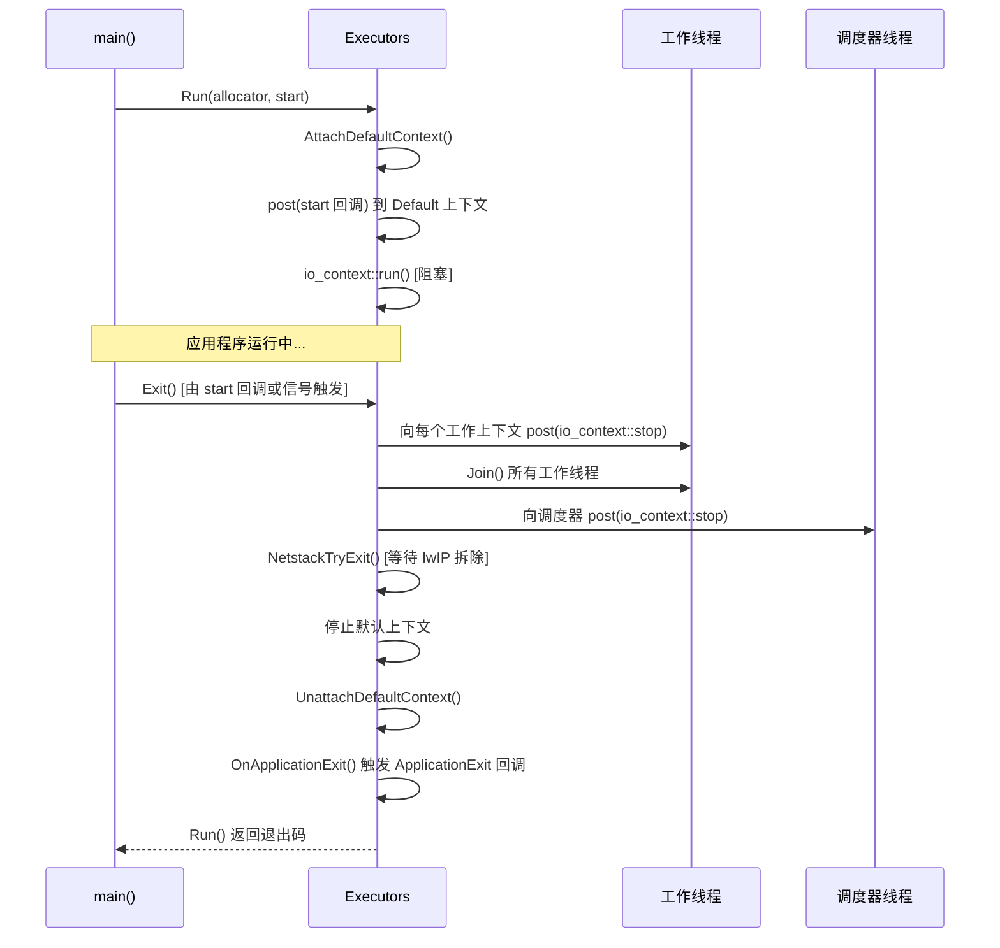
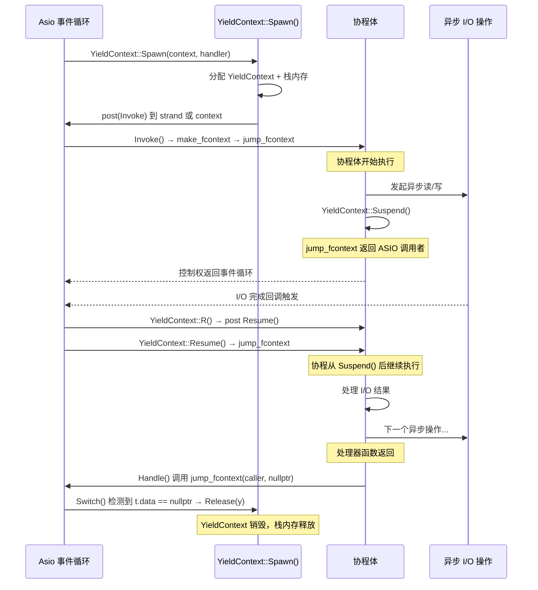
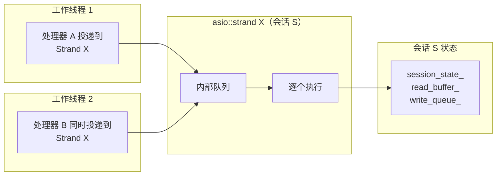
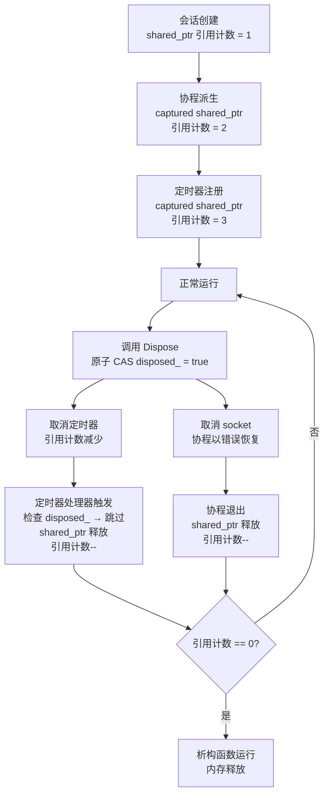
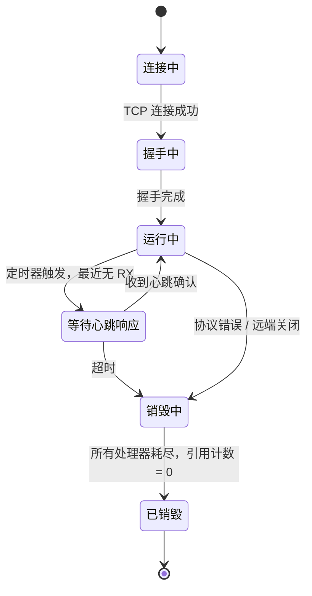
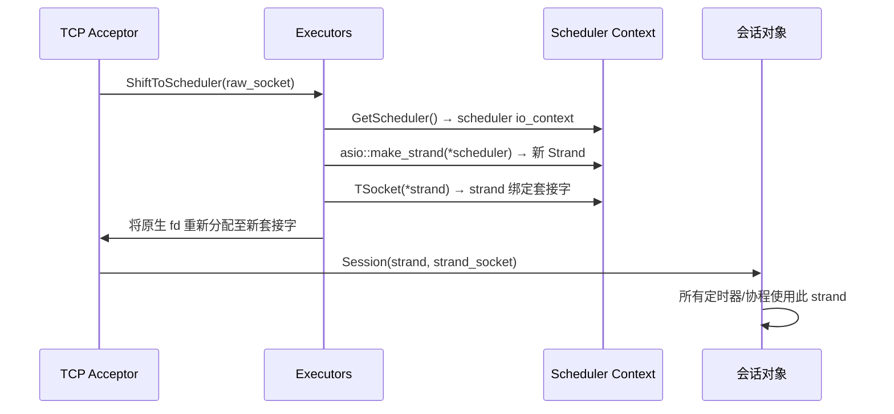
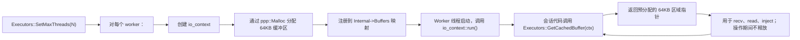
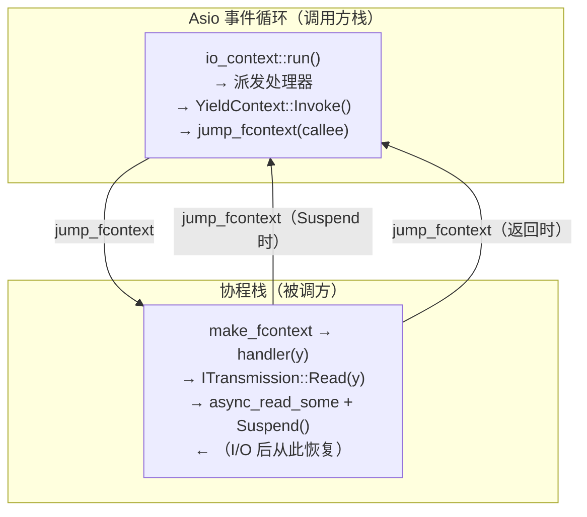
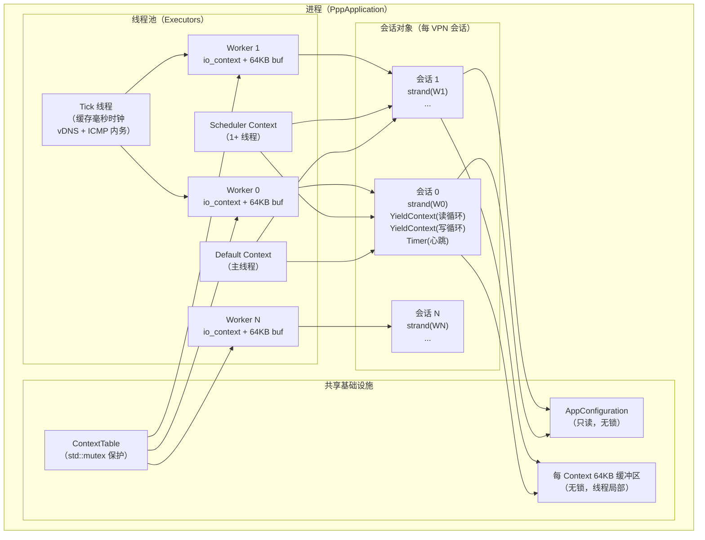

# 并发模型

[English Version](CONCURRENCY_MODEL.md)

本文档详细描述 OPENPPP2 的多线程与并发架构。面向初次接触本代码库的开发者，帮助读者在修改任何并发相关代码之前，彻底理解事件循环、线程池、协程系统和同步原语是如何协同工作的。

---

## 1. 概述

OPENPPP2 是一个长期运行的网络基础设施进程，需要在数千个并发会话中保持稳定和响应。为此，它结合了三种互补的并发机制：

- **Boost.Asio `io_context`** 作为核心事件循环和 I/O 反应器
- **通过 `YieldContext` 实现的有栈协程**，以顺序方式表达逻辑而不阻塞线程
- **`asio::strand`** 在会话内部串行化处理器执行，无需任何显式互斥锁

这三者共同构成了项目所称的**事件驱动状态机（EDSM）**架构。每个 VPN 会话、每个连接、每个协议状态迁移，都被建模为一个状态机——其状态转换由 Asio 事件驱动，其顺序逻辑则通过在每个异步边界让出控制权的协程来表达。

### 为什么不使用线程-每会话模型？

朴素方案是每个连接分配一个 OS 线程。在数千个会话的规模下，这行不通：每个线程占用栈内存（通常 1–8 MB）、产生上下文切换开销和调度器压力。OPENPPP2 采用小型固定线程池，每个线程驱动一个 `io_context`。OS 线程数量由物理 CPU 核数决定，而不是会话数量。

### 为什么不单纯使用回调？

纯回调式异步代码（经典的"回调地狱"）迫使顺序协议逻辑被拆散到许多小函数中，极难推理错误路径和资源生命周期。`YieldContext` 协程封装允许编写看起来是顺序的代码，但在底层透明地编译为回调链。

### 为什么不使用 C++20 协程？

本项目严格锁定在 **C++17**。所有协程机制使用 Boost.Context（`boost::context::detail::fcontext_t`）进行显式栈管理，使用 `jump_fcontext` 进行上下文切换——代码中没有使用任何 C++20 语言特性。

### EDSM 设计哲学

每个会话对象同时具备三重身份：

1. **状态机** — 持有明确的生命周期状态（连接中、握手中、运行中、关闭中、已销毁）
2. **协程宿主** — 派生一个或多个 `YieldContext` 协程来驱动 I/O
3. **strand 所有者** — 所有涉及会话状态的处理器都通过同一个 `asio::strand` 串行化

这种三重结构意味着，开发者可以将握手逻辑写成直线式协程（`读取头部 → 验证 → 发送响应 → 进入数据循环`），同时运行时保证：

- 同一会话的两个处理器永远不会并发执行
- 会话对象通过 `shared_ptr` 引用计数在任何处理器引用它时保持存活
- 销毁是幂等的：原子标志防止双重释放和双重销毁

---

## 2. 线程池架构

### `Executors` 类

`ppp::threading::Executors` 类（`ppp/threading/Executors.h`，`ppp/threading/Executors.cpp`）是管理所有 `io_context` 实例及驱动它们的线程的进程级单例。它没有公有构造函数——所有交互通过静态方法完成。

内部，`Executors` 维护一个 `ExecutorsInternal` 结构体（仅在 `Executors.cpp` 中定义），包含：

| 字段 | 类型 | 用途 |
|---|---|---|
| `Default` | `shared_ptr<io_context>` | 由 `Run()` 创建的主线程上下文 |
| `Scheduler` | `shared_ptr<io_context>` | 可选的高优先级上下文，用于 socket 级 I/O（由 `SetMaxSchedulers` 创建） |
| `ContextFifo` | `list<ContextPtr>` | 工作上下文的轮询队列 |
| `ContextTable` | `unordered_map<thread_id, ContextPtr>` | 将每个工作线程 ID 映射到其上下文 |
| `Threads` | `unordered_map<io_context*, ThreadPtr>` | 将上下文指针映射到管理它的 `Thread` 对象 |
| `Buffers` | `unordered_map<io_context*, ByteArrayPtr>` | 每个上下文对应一个可复用的数据包缓冲区（每线程一个 64 KB 缓冲区） |
| `TickCount` | `atomic<uint64_t>` | 缓存的毫秒级 tick 计数，由专用 tick 线程每 10 ms 更新一次 |

### 上下文分类

运行中的进程有三类不同的 `io_context`：

**默认上下文（Default context）** — 由 `Executors::Run()` 创建，在调用线程（主线程）上运行。应用程序入口回调被投递到此处。进程阻塞在这个上下文的事件循环上直到关闭。

**工作上下文（Worker contexts）** — 由 `Executors::SetMaxThreads()` 创建，每个都运行在独立的 `Thread`（优先级 `ThreadPriority::Highest`）上。处理绝大多数会话 I/O。数量通常设置为 `处理器核数 - 1`，为主线程和调度器线程保留余量。

**调度器上下文（Scheduler context）** — 由 `Executors::SetMaxSchedulers()` 创建，运行在一个或多个高优先级线程上。当新 TCP 连接到达时，`Executors::ShiftToScheduler()` 将原始 socket 从接受者线程迁移到调度器上下文，并用新的 `asio::strand` 包装它。这种分离将快速路径的 socket 建立与一般会话工作相互隔离。

### 轮询调度

当会话代码调用 `Executors::GetExecutor()` 为新对象获取上下文时，实现使用简单的 FIFO 轮转：

```cpp
// 来自 Executors.cpp — Executors::GetExecutor()
ExecutorLinkedList::iterator tail = fifo.begin();
context = std::move(*tail);
fifo.erase(tail);
fifo.emplace_back(context);   // 旋转到队尾
```

当只有一个工作上下文时，跳过轮转，直接返回该上下文。完全没有工作上下文时（单线程配置），返回默认上下文作为兜底。

### 线程池拓扑图



### 每线程缓存缓冲区

每个 `io_context`（及其驱动线程）在 `Internal->Buffers` 中注册了一个预分配的 64 KB 字节缓冲区。会话代码通过 `Executors::GetCachedBuffer(context)` 获取这个缓冲区。由于每个上下文由单个 OS 线程驱动，缓冲区完全在该线程的事件处理器内访问——无需同步。这是有意为之的设计：共享缓冲区在高流量节点上每秒可节省数千次堆分配。

### 启动与关闭时序



---

## 3. 协程模型

### `YieldContext` 设计

`ppp::coroutines::YieldContext`（`ppp/coroutines/YieldContext.h`，`ppp/coroutines/YieldContext.cpp`）是直接基于 `boost::context::detail::fcontext_t` 和 `jump_fcontext` 构建的有栈协程封装。它刻意**不**使用 `boost::asio::spawn` 或 `boost::coroutines2::coroutine`——这赋予了对栈分配、生命周期和调度的完全控制。

每个 `YieldContext` 对象拥有：

| 成员 | 用途 |
|---|---|
| `stack_` | 分配的协程栈内存（`shared_ptr<Byte>`，默认 `PPP_COROUTINE_STACK_SIZE` 字节） |
| `callee_` | `atomic<fcontext_t>` — 协程自身保存的寄存器状态 |
| `caller_` | `atomic<fcontext_t>` — Asio 事件循环保存的寄存器状态 |
| `s_` | `atomic<int>` — 四状态机标志 |
| `strand_` | 可选的 `asio::strand*`，用于串行化 resume 投递 |
| `context_` | 所属 `io_context` 的引用 |

### 四状态机

内部状态 `s_` 驱动挂起和恢复：

```
STATUS_RESUMED    = 0   （协程正在运行）
STATUS_SUSPENDING = 1   （Suspend() 进行中，即将跳回调用者）
STATUS_SUSPEND    = 2   （完全挂起，等待 Resume()）
STATUS_RESUMING   = -1  （Resume() 进行中，即将跳入协程）
```

所有转换都使用 `compare_exchange_strong`，防止协程体与调用 `Resume()` 的 Asio 事件处理器之间的竞争条件。

### 派生、挂起、恢复流程



### 同步模式 vs 异步模式

贯穿代码库的一个关键模式是 `nullof<YieldContext>()` 哨兵。许多函数接受 `YieldContext*`（或 `YieldContext&`）参数。调用者通过传入什么来控制执行模型：

- **传入有效的 `YieldContext&`**：函数在协程模式下运行。它发起异步 I/O，调用 `y.Suspend()`，只有在操作完成且 `Resume()` 被调用后，调用者才会解除阻塞。
- **传入 `nullof<YieldContext>()`**（即指向零地址的非空指针，使 `operator bool() == false`）：函数在阻塞/线程模式下运行。它发起异步 I/O，使用 `Executors::Awaitable` 阻塞调用线程直到完成。

这种模式让单一实现同时服务于协程调用者（常规路径）和线程阻塞调用者（用于不能让步的后台工作线程）。这**不是**未定义行为——`nullof` 指针永远不会被解引用，只是与 `NULLPTR` 比较来选择代码分支。

### 栈分配策略

栈通过 `BufferswapAllocator`（如果提供）或 `ppp::Malloc` 分配。默认栈大小为 `PPP_COROUTINE_STACK_SIZE`（在 `stdafx.h` 中定义）。传递给 `make_fcontext` 的栈指针是栈区域的**顶部**（`stack + stack_size`），与 x86/ARM 调用惯例一致（栈向下增长）。

---

## 4. 基于 Strand 的串行化

### 什么是 Strand？

`boost::asio::strand<io_context::executor_type>` 是一个轻量级的 Asio 原语，保证：**通过同一 strand 投递的处理器在任何时刻最多只有一个在执行**。当两个处理器同时排队时，第二个会被推迟到第一个完成后。这里不涉及互斥锁——strand 实现为 Asio 执行器机制内部的一个队列。

### 每会话 Strand 模式

OPENPPP2 中的每个会话对象都持有一个 `StrandPtr`（即 `shared_ptr<asio::strand<...>>`）。所有异步操作——socket 读写、定时器回调、跨线程通知——都通过这个 strand 调度。结果是：

1. 会话状态永远不会被两个线程并发访问
2. 会话对象内部不需要 `std::mutex` 来保护只从自身 strand 访问的状态
3. 通过 `YieldContext::Spawn(..., strand, handler)` 派生的协程，其 `Resume()` 也会通过同一 strand 投递，在让出点之间保持串行化保证

### ShiftToScheduler 与 Strand 创建

当新 TCP socket 到达时，调用 `Executors::ShiftToScheduler()`。该函数：

1. 调用 `GetScheduler()` 获取调度器 `io_context`
2. 在该上下文上创建新的 `asio::strand`：`make_shared_object<Strand>(asio::make_strand(*scheduler))`
3. 创建绑定到该 strand 的新 socket：`make_shared_object<TSocket>(*strand)`
4. 从旧 socket 释放原生文件描述符并将其分配给新 socket

从此刻起，迁移后 socket 的所有 I/O 都运行在调度器上下文的线程池上，并通过会话 strand 串行化。

### Strand 串行化流程



处理器 A 和处理器 B 可能从不同 OS 线程提交，但 strand 确保它们永远不会重叠。即使会话生活在多线程池中，其状态也具有事实上的单线程访问特性。

### 何时不使用 Strand

Strand 增加了轻微的排队开销。对于很少被修改但被许多上下文同时访问的全局状态（例如 `ExecutorsInternal` 内的 `ContextTable`），改用带有短暂临界区的普通 `std::mutex`。规则是：**对象级串行化使用 strand；全局表修改使用 mutex**。

---

## 5. 跨线程生命周期管理

### 销毁问题

在多个会话跨异步回调共享指针的系统中，根本风险是：回调在它引用的会话已经销毁之后才触发。OPENPPP2 使用三层叠加的防御：

**第一层 — `shared_ptr` 引用计数**：每个会话对象继承自 `std::enable_shared_from_this<T>`。所有已投递的处理器都捕获一个 `shared_ptr`（或 `weak_ptr`）到会话。只要有处理器排队，会话就保持存活。

**第二层 — `weak_ptr` 用于可选引用**：当某个子系统持有会话引用但不应阻止其销毁时，它持有 `weak_ptr`，使用前调用 `lock()`。如果会话已经消失，`lock()` 返回空值，子系统干净地跳过该操作。

**第三层 — 原子销毁标志**：即使 `shared_ptr` 保持对象存活，会话也可能在逻辑上已经被销毁。`atomic<bool>` `disposed_` 标志在 `Dispose()` 期间被设置一次。所有入口点首先通过 `compare_exchange_strong` 检查此标志，使用 `memory_order_acq_rel`：

```cpp
// 整个代码库中使用的标准销毁模式
bool expected = false;
if (!disposed_.compare_exchange_strong(expected, true,
        std::memory_order_acq_rel, std::memory_order_relaxed))
{
    return;   // 已被另一线程销毁 — 幂等退出
}
// 执行实际的清理工作...
```

CAS 上的 `memory_order_acq_rel` 保证：
- **acquire 端**：赢得 CAS 的线程能看到之前任何写入该对象的线程的所有写操作
- **release 端**：该线程在 CAS 之前的所有写操作，对后续观察到标志为 `true` 的任何线程可见

### 对象生命周期图



### 死锁避免规则

协程、strand 和互斥锁的组合产生了死锁风险。项目遵循以下硬性规则：

1. **永远不要在 `YieldContext::Suspend()` 调用期间持有 `std::mutex`。** 协程在持锁期间将控制权让回事件循环；如果任何事件处理器试图获取同一互斥锁（即使在同一线程上），就会发生死锁。

2. **永远不要在 `io_context` 线程内调用 `Awaitable::Await()`。** `Await()` 阻塞调用的 OS 线程。如果应该信号 `Await()` 的完成事件要在同一 `io_context` 上运行，事件循环将永远无法处理它。

3. **永远不要向 `io_context` 线程投递阻塞操作。** 所有阻塞 I/O、DNS 解析和文件访问都必须在专用线程上发生，通过 `asio::post` 将结果传回。

4. **锁顺序**：当必须同时持有多个互斥锁时，以一致的全局顺序获取它们。在实践中，代码库避免同时持有多个互斥锁。

---

## 6. SpinLock 使用

### `SpinLock` vs `std::mutex`

OPENPPP2 在 `ppp/threading/SpinLock.h` 中提供了两种自定义自旋锁类型：

| 类型 | 可重入 | 使用场景 |
|---|---|---|
| `SpinLock` | 否 | 在纳秒级完成的非重入临界区 |
| `RecursiveSpinLock` | 是 | 可能从同一线程重新进入同一锁的调用点 |

两者都实现了 STL `Lockable` 概念（`lock()` / `unlock()`），可与 `std::lock_guard` 和 `std::unique_lock` 配合使用。

### 何时使用 SpinLock

`SpinLock` 适用于：

1. 临界区极短——通常只有几次内存读写，没有函数调用
2. 锁竞争罕见——自旋循环很少超过一次
3. 阻塞不可接受——`std::mutex` 会放弃线程，如果锁只持有几纳秒，这代价很高

以下情况**不**适合使用 `SpinLock`：

- 临界区调用任何 I/O 函数、`malloc` 或任何系统调用
- 临界区可能阻塞等待外部事件
- 锁可能持有超过几微秒

对于 `ExecutorsInternal::Lock`（保护全局上下文表），使用 `std::mutex`，因为：
- 表访问很少（仅在会话创建/销毁时）
- 临界区包含哈希表操作（非忽略的开销）
- 在映射操作上自旋会浪费 CPU

### `RecursiveSpinLock` 内部实现

`RecursiveSpinLock` 包装了一个普通 `SpinLock`，并添加：

- `volatile int64_t tid_` — 当前锁所有者的 OS 线程 ID（未持有时为 0）
- `atomic<int> reentries_` — 当前递归深度

调用 `TryEnter()` 时，如果调用线程的 ID 与 `tid_` 匹配，递归计数递增并立即返回，不产生竞争。调用 `Leave()` 时，递归计数递减；只有当它降至零时，底层 `SpinLock` 才被释放，`tid_` 被清零。

### 带超时的 TryEnter

两种锁类型都支持 `TryEnter(int loop, int timeout)`：

- `loop < 0` 表示无限重试（等价于 `Enter()`）
- `timeout < 0` 表示无时钟超时
- 当两个限制都为正数时，自旋在任一条件先触发时退出

这允许调用者实现非阻塞"仅尝试一次"模式（`TryEnter()` 无参数，失败时返回 `false`）以及用于诊断的定时等待模式。

---

## 7. 定时器与心跳保活

### Boost.Asio `deadline_timer` 使用

OPENPPP2 中的定时器通过 Boost.Asio 的 `boost::asio::deadline_timer`（在某些路径中为 `boost::asio::steady_timer`）管理。定时器始终在特定的 `io_context` 或 strand 上创建。标准模式是：

```cpp
// 在会话上下文上创建定时器
auto timer = make_shared_object<boost::asio::deadline_timer>(context);

// 设置过期时间
timer->expires_from_now(boost::posix_time::seconds(30));
timer->async_wait(
    [self = shared_from_this(), timer](const boost::system::error_code& ec) noexcept
    {
        if (ec || self->disposed_)
        {
            return;   // 已取消或会话已经消失
        }
        self->OnKeepaliveTimeout();
    });
```

关键点：
- lambda 捕获 `shared_from_this()` 以确保定时器触发前会话保持存活
- `boost::system::error_code::value() == boost::asio::error::operation_aborted` 表示通过 `timer->cancel()` 取消
- 所有定时器处理器在入口处检查 `disposed_`，然后再访问会话状态

### 缓存的 Tick 计数

与其在每次定时器决策时调用系统时钟，`Executors::GetTickCount()` 返回由后台 tick 线程维护的缓存毫秒计数（每 10 ms 更新一次）。这减少了在许多会话上进行高频心跳检查时的系统调用开销。

tick 线程还驱动两个周期性任务：
- `ppp::net::asio::vdns::UpdateAsync()` — 每秒刷新虚拟 DNS 条目
- `ppp::net::asio::InternetControlMessageProtocol_DoEvents()` — 处理挂起的 ICMP 状态

### VirtualEthernetLinklayer 中的心跳保活

`VirtualEthernetLinklayer` 类（这里不完整展示，但代表所有会话类型）维护两个时间戳：最后接收时间和最后发送时间。一个周期性定时器大约每秒触发一次，检查任一时间戳是否超过了配置的 `kAliveTimeout`。如果超过：

1. 如果最近没有发送数据，则发送心跳 ping
2. 如果超过硬截止时间还没有收到数据，则销毁会话

这确保了已断开的连接（远端无声地消失）能被及时回收，为新会话释放资源。

### 定时器与会话生命周期交互



所有状态转换均由通过会话 strand 串行化的 Asio 事件处理器驱动。在一个转换进行期间，不可能发生另一个转换，从而消除了对状态机互斥锁的需求。

---

## 8. 新开发者并发规则速查

在编写任何涉及会话状态或投递到 `io_context` 的代码之前，请内化以下规则：

| 规则 | 原因 |
|---|---|
| 永远不要阻塞 `io_context` 线程 | 阻塞一个线程会饿死该上下文上的所有会话 |
| 在异步 lambda 中始终捕获 `shared_from_this()` | 防止回调触发时会话已被销毁导致的 use-after-free |
| 在每个处理器入口处始终检查 `disposed_` | 防止对逻辑上已死亡的会话进行操作 |
| 对生命周期标志使用 `compare_exchange_strong(memory_order_acq_rel)` | 提供跨线程正确的 acquire/release 语义 |
| 永远不要在 `Suspend()` 期间持有互斥锁 | 死锁：持锁期间事件循环无法运行 |
| 所有跨线程工作通过 `asio::post` 或 strand 投递 | 会话路径中不得创建原始线程同步对象 |
| `SpinLock` 仅用于纳秒级临界区 | 对更长的操作自旋会浪费 CPU |
| 每个 `io_context` 线程一个 64 KB 缓冲区 — 不跨上下文共享 | 缓冲区按设计是线程局部的；从另一上下文访问是数据竞争 |

---

## 相关文档

- [`ARCHITECTURE.md`](ARCHITECTURE.md) — 系统级架构概述（英文）
- [`ARCHITECTURE_CN.md`](ARCHITECTURE_CN.md) — 系统级架构概述（中文）
- [`STARTUP_AND_LIFECYCLE_CN.md`](STARTUP_AND_LIFECYCLE_CN.md) — 进程启动和关闭流程
- [`ENGINEERING_CONCEPTS_CN.md`](ENGINEERING_CONCEPTS_CN.md) — 基础工程原则
- [`TRANSMISSION_CN.md`](TRANSMISSION_CN.md) — 传输载体和握手
- [`LINKLAYER_PROTOCOL_CN.md`](LINKLAYER_PROTOCOL_CN.md) — 隧道动作词汇表

---

## 9. Awaitable — 阻塞调用方桥接

### 9.1 用途

虽然协程是主要执行模型，但某些代码路径运行于专用 OS 线程（非 `io_context` 线程）上，需要同步阻塞等待异步结果。`Executors::Awaitable<T>` 提供了这一桥接机制。

### 9.2 Awaitable API

```cpp
// 由异步操作生产
auto awaitable = Executors::NewAwaitable<bool>();

// 在 io_context 线程上——标记完成
awaitable->Complete(result_value);

// 在调用方 OS 线程上——阻塞直至 Complete() 被调用
bool result = awaitable->Await();
```

`Await()` 使用 `std::condition_variable` 进行阻塞。`Complete()` 存储值并通知条件变量。一旦收到通知，`Await()` 返回，Awaitable 被消费。

### 9.3 Awaitable 的适用场景

| 调用方类型 | 适用机制 |
|-----------|---------|
| `io_context` 协程 | `YieldContext::Suspend()` / `Resume()` |
| 专用 worker OS 线程 | `Executors::Awaitable<T>::Await()` |
| 单元测试或同步 API 调用 | `Executors::Awaitable<T>::Await()` |

**切勿**在 `io_context` 线程内调用 `Awaitable::Await()`——若信号来自同一上下文，则会永久死锁。

### 9.4 `nullof<YieldContext>()` 模式深度解析

`nullof<YieldContext>()` 模式用于在单个调用点选择协程模式与线程阻塞模式。示例：

```cpp
// 同时支持两种调用方的函数：
bool SomeLinklayerOperation(YieldContext* y, int param) noexcept
{
    if (y && *y)
    {
        // 协程模式：异步 I/O，让出事件循环
        return DoAsyncVariant(y, param);
    }
    else
    {
        // 线程阻塞模式：使用 Awaitable
        auto aw = Executors::NewAwaitable<bool>();
        asio::post(*context_, [aw, param]() {
            aw->Complete(DoAsyncVariant(nullptr, param));
        });
        return aw->Await();
    }
}
```

`nullof<YieldContext>()` 在 `ppp/coroutines/YieldContext.h` 中定义为 constexpr，返回一个零初始化静态变量的地址——始终非空，但 `operator bool()` 返回 `false`。这允许协程调用方在不额外分配堆内存的情况下，跳过阻塞分支。

---

## 10. 线程命名与优先级

### 10.1 线程命名

`Executors` 创建的每个 worker 线程和 scheduler 线程都通过平台原生 API 命名：

| 平台 | API | 示例名称 |
|------|-----|---------|
| Linux | `pthread_setname_np()` | `"ppp-worker-0"` |
| Windows | `SetThreadDescription()` | `L"ppp-worker-0"` |
| Android | `pthread_setname_np()` | `"ppp-worker-0"` |
| macOS | `pthread_setname_np()` | `"ppp-worker-0"` |

若命名失败，会设置 `RuntimeThreadNameFailed`，但执行继续——线程命名仅作为提示信息。

### 10.2 线程优先级

Worker 和 scheduler 线程以 `ThreadPriority::Highest` 启动（Windows 映射至 `THREAD_PRIORITY_HIGHEST`，Linux 映射至带高 nice 值的 `SCHED_OTHER`，macOS/iOS 映射至 `QOS_CLASS_USER_INTERACTIVE`）。这确保网络 I/O 不会被低优先级后台任务饿死。

后台 tick 线程以默认优先级运行——它只更新缓存时间戳并驱动 vDNS/ICMP 内务处理，对延迟不敏感。

---

## 11. Asio Executor 组合与 `make_strand`

### 11.1 使用的 Executor 类型

OPENPPP2 在代码库中使用三种 Asio executor 类型：

| 类型 | 描述 |
|------|------|
| `io_context::executor_type` | 来自 `io_context` 的原始 executor |
| `asio::strand<io_context::executor_type>` | 对原始 executor 的串行化封装 |
| `asio::io_context&`（隐式）| 定时器构造时的直接上下文引用 |

所有会话对象持有一个 `StrandPtr`（`shared_ptr<asio::strand<io_context::executor_type>>`），通过 `asio::make_strand(*io_context_ptr)` 创建。会话内的定时器和套接字均绑定到此 strand。

### 11.2 Strand 创建生命周期



### 11.3 跨 Strand 投递工作

当运行在某个 strand 上的代码需要触发另一个 strand 上的工作时（例如会话通知全局路由器），使用 `asio::post`：

```cpp
// 从会话 strand：将工作投递至不同 strand 或上下文
asio::post(*target_strand_or_context,
    [self = shared_from_this(), data = std::move(data)]() noexcept
    {
        self->ProcessCrossStrandData(data);
    });
```

这始终安全：`asio::post` 是线程安全的，不要求调用方处于任何特定线程上。

---

## 12. 数据包缓冲区的内存模型

### 12.1 每 Context 64 KB 缓冲区

每个 `io_context`（存储在 `Executors::Buffers` 中）的 64 KB 缓冲区是热路径中最重要的内存优化手段。每次 UDP 接收、TAP 帧读取和 ITransmission 读循环都复用此缓冲区，而不是新分配。

缓冲区生命周期与 `io_context` 生命周期绑定：



调用 `Executors::Exit()` 时，`ContextFifo`、`ContextTable`、`Buffers` 和 `Threads` 全部清空。`shared_ptr` 析构通过 `ppp::Mfree` 释放缓冲区。

### 12.2 IPFrame 和 UdpFrame 堆分配

虽然 64 KB 接收缓冲区避免了原始字节读取的逐包分配，但解析后的协议对象（`IPFrame`、`UdpFrame`、`IcmpFrame`）通过 `ppp::Malloc`（在定义了 `JEMALLOC` 宏时路由至 jemalloc）在堆上分配。这些对象被 `shared_ptr` 封装，当最后持有者（通常是链路层序列化器）释放引用时被销毁。

这种两级方法平衡了热路径效率（原始读取缓冲区无需分配）与正确性（可能比原始缓冲区存活更长的结构化对象使用堆分配）。

### 12.3 jemalloc 集成

当 `JEMALLOC` 预处理器宏定义时（由 CMake 在启用 jemalloc 支持时设置）：

- `ppp::Malloc(size)` 调用 `je_malloc(size)`
- `ppp::Mfree(ptr)` 调用 `je_free(ptr)`
- `ppp::allocator<T>` 将所有 STL 容器分配路由至 jemalloc

Android 系统 libc 已内置 jemalloc，无需额外 jemalloc 层。Linux 和 Windows 通过三方库目录静态链接（`THIRD_PARTY_LIBRARY_DIR/jemalloc/lib/libjemalloc.a`）。

---

## 13. YieldContext 状态迁移详解

### 13.1 状态机表

| 起始状态 | 事件 | 目标状态 | 动作 |
|----------|------|----------|------|
| `RESUMED(0)` | 协程调用 `Suspend()` | `SUSPENDING(1)` | CAS 从 0 → 1 |
| `SUSPENDING(1)` | 无 `Resume()` 竞争 | `SUSPEND(2)` | `jump_fcontext` 跳回调用方 |
| `SUSPENDING(1)` | `Resume()` 发生竞争 | `RESUMED(0)` | CAS 检测到竞争；跳过跳转 |
| `SUSPEND(2)` | `Resume()` 被调用 | `RESUMING(-1)` | CAS 从 2 → -1 |
| `RESUMING(-1)` | 通过 `jump_fcontext` 重新进入 | `RESUMED(0)` | CAS 从 -1 → 0 |

`Suspend()` 与 `Resume()` 之间的竞争被正确处理：若 `Resume()` 在协程完全挂起之前触发（`SUSPENDING` 窗口），`Suspend()` 中的 CAS 检测到状态不再是 `SUSPENDING`，跳过上下文切换，保持协程运行。这无需任何互斥锁即消除了丢失唤醒竞争。

### 13.2 栈帧示意图



两个栈是完全独立的内存区域。协程栈从堆分配（通过 `ppp::Malloc`），大小固定；调用方栈是普通 OS 线程栈。`jump_fcontext` 在单次调用中保存/恢复所有被调方保存的寄存器。

---

## 14. 并发问题实用调试指南

### 14.1 死锁识别

若进程挂起且所有 `io_context` 线程均被阻塞，最常见的原因：

1. **在 `Suspend()` 期间持有互斥锁**：用调试器检查每个 worker 线程的调用栈。若在调用栈的 `YieldContext::Suspend()` 下方看到 `SpinLock::Enter()` 或 `std::mutex::lock()`，即为根本原因。
2. **在 io_context 线程上调用 `Awaitable::Await()`**：查找在同时拥有 `io_context` 的线程上出现的 `std::condition_variable::wait()`。若信号发送方运行在同一上下文上，永远不会完成。
3. **循环 strand 依赖**：较罕见，但若 strand A 投递工作至 strand B 且 strand B 同步等待 strand A 完成，则可能发生。

### 14.2 悬空引用检测

症状：处理器在会话拆除后触发时崩溃或数据损坏。

诊断：
1. 确认处理器是否捕获了 `shared_from_this()`。若捕获了裸指针或未调用 `lock()` 的 `weak_ptr`，会话可能在处理器运行前已被销毁。
2. 检查处理器入口是否测试了 `disposed_`。
3. 在调试版本上使用 AddressSanitizer（`-fsanitize=address`）捕获确切的访问位置。

### 14.3 性能瓶颈

单个 worker 线程 CPU 高，尽管存在多个 worker 上下文：

- 检查 `Executors::GetExecutor()` 轮转。若所有会话创建在同一 `io_context`（例如从不调用 `ShiftToScheduler` 的服务端），所有工作集中在一个线程上。
- 验证是否调用了 `SetMaxSchedulers()`。没有 scheduler 上下文，新连接建立在默认上下文上运行。
- 使用 `perf`（Linux）或 VTune（Windows）进行分析。常见热点：`jump_fcontext`、`malloc/free`、OpenSSL `EVP_EncryptUpdate`。

### 14.4 协程泄漏检测

协程泄漏发生在 `YieldContext` 被挂起而 `Resume()` 永远不被调用时，导致协程栈无法释放。

检测：跟踪 `YieldContext` 的构造和析构计数。若构造计数无限超过析构计数，则存在泄漏。

常见原因：异步操作（定时器、套接字）被取消但完成处理器从未被投递。Boost.Asio 保证取消始终以携带 `operation_aborted` 的处理器投递——确保被取消操作的处理器无条件调用 `Resume()`（协程在恢复后检查错误码）。

---

## 15. 并发架构全局图


