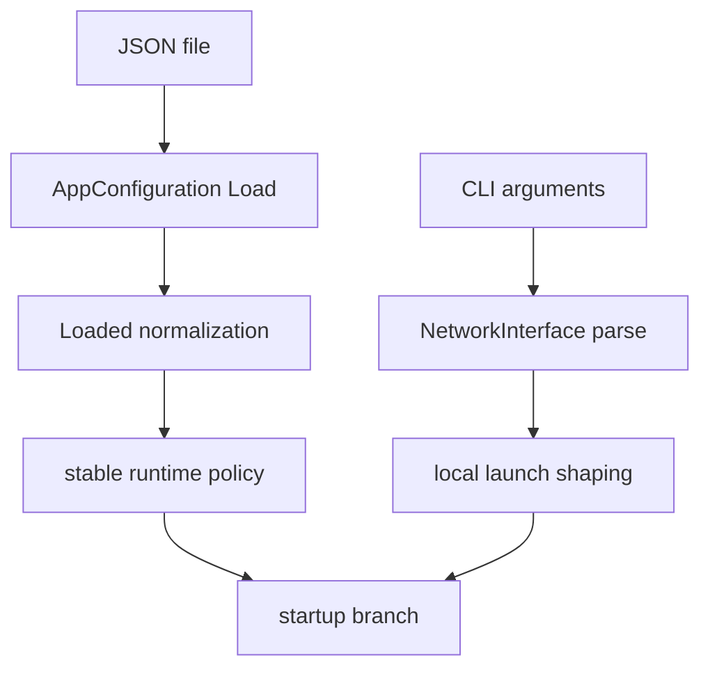
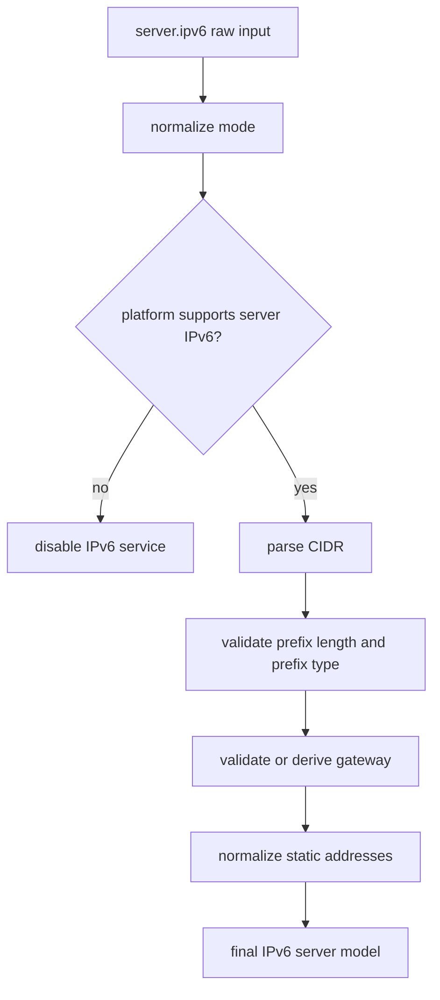

# Configuration Model, Normalization, And Runtime Shaping

[中文版本](CONFIGURATION_CN.md)

## Scope

This document explains how OPENPPP2 loads, normalizes, and uses configuration. It is not only a field list. The purpose is to show how configuration behaves as a runtime model in code, what gets defaulted, what gets clamped, what gets disabled when invalid, and how JSON configuration interacts with command-line shaping.

The core implementation is centered on:

- `ppp/configurations/AppConfiguration.h`
- `ppp/configurations/AppConfiguration.cpp`
- `main.cpp::LoadConfiguration(...)`
- `main.cpp::PreparedArgumentEnvironment(...)`
- `main.cpp::GetNetworkInterface(...)`

This matters because OPENPPP2 does not treat configuration as a passive blob. The loader actively reshapes configuration into something the runtime can trust more than raw input.

## Why Configuration Is So Important In OPENPPP2

In many smaller tunnel tools, configuration is little more than a collection of endpoint strings, keys, and a handful of toggles. In OPENPPP2, the configuration object is much more central.

It defines or strongly influences:

- transport and listener behavior
- handshake and framing behavior
- cipher selection and key material
- route and DNS steering
- static packet mode behavior
- mux behavior
- server-side policy and IPv6 service
- client-side mappings, proxies, and route-file policy
- virtual memory buffer allocator behavior

This is one reason the project behaves more like an infrastructure runtime than like a narrowly scoped proxy executable. The configuration model is effectively the durable contract between operator intent and runtime behavior.

## The Two-Stage Configuration Story

OPENPPP2 has two major configuration stages.

### Stage 1: JSON model loading

The JSON file is loaded into `AppConfiguration`.

### Stage 2: runtime shaping

Command-line arguments then shape local runtime state through `NetworkInterface` and other startup logic.

This separation is crucial. JSON defines durable node intent. CLI defines how this specific launch should shape local environment details.

## Loader Entry And Search Paths

`main.cpp::LoadConfiguration(...)` searches for configuration in this order:

1. any command-line path supplied through config aliases
2. `./config.json`
3. `./appsettings.json`

The parser accepts multiple CLI aliases for configuration path selection:

- `-c`
- `--c`
- `-config`
- `--config`

Once a candidate path is found, the loader:

- rewrites the path
- resolves it to a full path
- checks readability
- constructs `AppConfiguration`
- calls `configuration->Load(configuration_path)`

That means configuration loading is intentionally resilient to a few operator path styles while still normalizing them into an absolute path for the runtime.

## The `Clear()` Baseline

Every load starts from `AppConfiguration::Clear()`.

This is important because it shows that the project always has a known baseline model before it merges JSON into it.

The baseline includes:

- processor-count-derived concurrency
- empty public and interface IP hints
- UDP DNS defaults
- TCP connect and inactive timeout defaults
- mux timeout defaults
- WebSocket disabled by default
- key defaults such as `kf`, `kh`, `kl`, `kx`, `sb`
- default protocol and transport key names
- server defaults such as `subnet`, `mapping`, and IPv6 disabled
- client defaults such as generated GUID-like sentinel, zero bandwidth, and default proxy ports

This matters because the absence of a JSON field rarely means “there is no behavior.” It usually means “fall back to a baseline behavior from `Clear()`.”

## Default Key And Framing Baseline

Some of the most important defaults are in the `key` block.

The baseline loader sets:

- `kf = 154543927`
- `kh = 12`
- `kl = 10`
- `kx = 128`
- `sb = 0`
- `protocol = PPP_DEFAULT_KEY_PROTOCOL`
- `protocol-key = BOOST_BEAST_VERSION_STRING`
- `transport = PPP_DEFAULT_KEY_TRANSPORT`
- `transport-key = BOOST_BEAST_VERSION_STRING`
- `masked = true`
- `plaintext = true`
- `delta-encode = true`
- `shuffle-data = true`

The default of `plaintext = true` often surprises readers if they only skim the project. But this makes sense when read with the transport code. The project explicitly supports base94 and plaintext-oriented early-session framing behavior, and the full runtime model is more nuanced than “always post-handshake binary encrypted records from byte one.”

## Trimming And String Normalization

`AppConfiguration.cpp` contains `LRTrim(...)` helpers which normalize many strings after loading.

These functions trim:

- address hints
- backend URLs and keys
- log path
- IPv6 strings
- client GUID and server strings
- proxy bind strings and credentials
- WebSocket host and path
- cipher names and key strings
- SSL certificate paths and ciphersuite text

This is not glamorous logic, but it is one of the reasons the runtime is more predictable than a raw JSON-to-struct system. Many future failures are reduced simply by ensuring the strings are normalized before deeper validation begins.

## Mapping Loading Is Not Blind Copying

`LoadAllMappings(...)` is a good example of the configuration model being actively validated.

For each client mapping entry, the loader checks:

- whether the protocol is TCP or UDP
- whether local and remote ports are valid
- whether local and remote IP strings exist
- whether those IP strings parse successfully
- whether the addresses are valid and non-multicast

It also deduplicates mappings by storing them through endpoint-keyed maps before moving them into the final `client.mappings` vector.

This tells us something important about the configuration philosophy of the project: invalid entries are not treated as sacred user intention. The loader will ignore what it cannot normalize into a coherent runtime rule.

## The Purpose Of `Loaded()`

After raw JSON ingestion, `AppConfiguration::Loaded()` performs the real normalization pass.

This function is one of the most important configuration functions in the project because it transforms raw loaded values into a runtime-safe configuration model.

Its work can be grouped into several classes.

### 1. Numeric defaulting and clamping

The loader corrects:

- `concurrent`
- `server.node`
- `server.ipv6.prefix_length`
- DNS timeout and TTL
- TCP backlog, connect timeout, connect jitter, inactive timeout
- mux connect timeout, inactive timeout, congestion window configuration
- static aggreglator value
- keepalive arrays

This makes the runtime much less sensitive to malformed or under-specified numeric input.

### 2. String normalization

The trim pass runs before later parsing, reducing accidental whitespace-based invalidation or silent mismatch.

### 3. Port sanitization

Port fields across TCP, WS, WSS, proxy listeners, and UDP are checked to ensure they fall into valid ranges. Invalid ports are zeroed to `IPEndPoint::MinPort`, effectively disabling the corresponding listener or local service path.

### 4. Address sanitization

Several IP-like strings are parsed and normalized:

- `ip.public`
- `ip.interface`
- client HTTP proxy bind address
- client SOCKS proxy bind address

If parsing fails or the resulting address is invalid in project terms, the string is cleared.

This means invalid address text does not remain as a latent string bug waiting to explode later.

## IPv6 Configuration Is Heavily Normalized

The IPv6 block deserves special attention because it is one of the richest examples of active configuration shaping in the project.

The normalization logic includes:

- mode normalization through `NormalizeIPv6Mode(...)`
- disabling IPv6 entirely if the platform does not support the server data plane
- parsing the configured CIDR string into prefix plus prefix length
- providing a default NAT66 prefix if NAT66 mode is enabled but no prefix is supplied
- rejecting prefix lengths `<= 0` or `>= 128`
- validating that GUA mode actually uses a global-unicast prefix
- validating the configured gateway and clearing it if it falls outside the prefix
- computing a first-host gateway automatically if a valid gateway is not explicitly supplied
- validating static addresses against the prefix
- rejecting static addresses that collide with the effective gateway
- deduplicating normalized static IPv6 addresses

This is far more than a field list. The runtime is actively turning IPv6 configuration into a coherent, enforceable service model.

## Why IPv6 Can Be Disabled Even When Configured

This is a subtle but important operator point.

A user may configure IPv6, but the loader can still disable it if:

- the current platform does not support the server-side IPv6 data plane
- the prefix is invalid
- GUA mode does not actually use a global-unicast prefix
- the prefix length is outside the valid operating range

This means “configured” does not automatically mean “accepted.” The configuration layer in OPENPPP2 behaves more like an admission system than a passive parser.

## Cipher Selection Normalization

The loader explicitly validates whether the configured protocol and transport cipher names are supported.

If not:

- `config.key.protocol` is reset to `PPP_DEFAULT_KEY_PROTOCOL`
- `config.key.transport` is reset to `PPP_DEFAULT_KEY_TRANSPORT`

It also ensures that empty key strings are replaced with defaults.

This is important because the transmission layer assumes these fields correspond to real supported cipher implementations. Rather than letting an invalid cipher name survive until runtime I/O fails later, the configuration loader repairs the configuration upfront.

## WebSocket Configuration Is Also Admission-Controlled

The WebSocket block is another place where configuration is actively accepted or denied.

The loader checks:

- whether `websocket.host` is a domain address
- whether `websocket.path` exists and begins with `/`
- whether the SSL certificate triplet verifies successfully for WSS

If host or path are invalid:

- both WS and WSS listeners are disabled

If the certificate material is invalid:

- WSS listener is disabled

Then, depending on which listeners remain enabled, the loader clears related fields:

- if WSS is disabled, certificate files and password are cleared
- if WS is disabled, host, path, and HTTP decoration fields are cleared

This means the WebSocket block behaves almost like a little self-normalizing subsystem rather than a dumb JSON object.

## DNS Redirect Normalization

The loader validates `udp.dns.redirect` by parsing it as an endpoint-like value.

If parsing fails, or if the destination is neither a valid IP nor a valid domain according to project rules, the redirect string is cleared.

That means DNS redirect behavior is enabled only when the configured target survives a structured validation pass.

## Virtual Memory Buffer Configuration

The `vmem` block controls whether a `BufferswapAllocator` backed by virtual-memory workspace is created.

The normalization rule is simple but important:

- if path is empty or size is less than one, virtual-memory workspace is disabled by clearing both path and size

Then in `main.cpp::LoadConfiguration(...)`, allocator creation occurs only if:

- on Windows: `vmem.size > 0`
- on non-Windows: both `vmem.path` and `vmem.size` are present

The allocator size is then expanded into bytes with a minimum threshold.

This means `vmem` is not purely declarative. It directly influences the buffer allocation strategy used later by transport and packet code.

## `kf`, `kh`, `kl`, `kx`, And `sb` Are Not Left Untouched

The loader corrects several key-behavior values.

- `kh` is clamped into `0..16`
- `kl` is clamped into `0..16`
- `kx` is clamped to at least zero
- `sb` is clamped into the legal skateboarding range derived from buffer constants

Then the loader computes two LCG modulus values:

- `LCGMOD_TYPE_TRANSMISSION`
- `LCGMOD_TYPE_STATIC`

These later drive header-length and packet-format mapping behavior in the transmission and static packet code.

This is one of the best examples of the configuration system not just storing numbers, but preparing derived state that the runtime depends on heavily.

## Defaulting Versus Disabling

When reading the configuration code, it helps to distinguish two different normalization strategies.

### Defaulting

Used when an absent or invalid value should fall back to a safe or conventional baseline.

Examples:

- TCP backlog
- timeouts
- default key strings
- NAT66 default prefix when mode is enabled but CIDR is absent

### Disabling

Used when an invalid configuration should turn the feature off rather than guess.

Examples:

- invalid WS host or path disables WS and WSS listeners
- invalid WSS certificates disable WSS
- unsupported platform IPv6 server path disables IPv6 server mode
- invalid ports are zeroed to effectively disable listeners

This distinction is important for operators because it affects debugging expectations. Some bad inputs are repaired. Some bad inputs cause the feature to disappear.

## Client Block: What It Really Means

The `client` block is not only “where the remote server address lives.” It is actually a packed description of the client-side environment and behavior.

It includes:

- client identity through `guid`
- server address and optional upstream proxy behavior
- bandwidth shaping hints
- reconnection timeout behavior
- local HTTP proxy bind and port
- local SOCKS proxy bind, port, and credentials
- mapping declarations
- route-file declarations
- Windows-specific paper-airplane behavior

That means the client block is partly transport, partly identity, partly local service exposure, and partly route policy input.

## Server Block: What It Really Means

The `server` block is the declarative shell around server-side node behavior.

It includes:

- node identity or node number
- local log path
- subnet forwarding capability
- whether mappings are allowed
- backend URL and backend key
- IPv6 server behavior

A good mental model is that the server block defines how much of the server behaves as a pure tunnel acceptor and how much behaves as a policy node with external backend cooperation and IPv6 service features.

## WebSocket Block: More Than A Port List

The WebSocket block often gets underestimated. It actually describes an HTTP-facing edge personality for the node.

It includes:

- WS and WSS listen ports
- required host name
- required path
- TLS certificate files and ciphersuite behavior
- request and response header decoration
- HTTP error response content

That means the WebSocket block is not merely “open a WebSocket server.” It is how OPENPPP2 adapts itself to HTTP-facing edge infrastructure.

## UDP Block: More Than Datagram Enablement

The UDP block covers several distinct concepts:

- UDP listener behavior
- UDP inactivity behavior
- DNS helper behavior
- static UDP path behavior

The static subsection includes:

- keepalive range
- whether DNS, QUIC, and ICMP behaviors participate
- aggligator behavior
- static upstream server list

This means the UDP block is really a family of related but not identical concerns.

## MUX Block

The `mux` block is small, but it shapes a feature that should not be underestimated.

It controls:

- mux connect timeout
- mux inactivity timeout
- congestion behavior
- mux keepalive window

Because MUX is an additional logical-channel structure rather than just a boolean, these values can materially influence how stable and aggressive mux behavior is in real deployments.

## `ip.public` And `ip.interface`

These two fields are easy to gloss over, but they are useful deployment hints rather than core protocol mechanics.

They are normalized as addresses where possible and cleared when invalid.

In practice, these fields are part of deployment identity and address-hinting behavior, not part of the protected transmission logic.

## Command-Line Overrides Are Not Random

The CLI does not override everything. It focuses heavily on local launch shaping.

Typical override areas include:

- role selection
- config path selection
- local DNS list
- preferred NIC and gateway
- TUN name and addresses
- static and mux enablement
- bypass files and DNS rules
- firewall-rules file

This supports a useful operational pattern:

- stable node identity and policy in JSON
- deployment-specific local shaping through CLI

## Minimal Viable Configuration: Server

A truly minimal usable server configuration still needs several coherent elements.

At minimum, think in terms of:

- one active carrier listener path such as TCP, UDP, WS, or WSS
- a coherent `key` block
- a meaningful `server.node`
- any required backend integration or firewall policy

Even if the file is syntactically valid, the runtime is not operationally useful unless those elements form a consistent server role.

## Minimal Viable Configuration: Client

At minimum, the client side needs:

- a stable `client.guid`
- a usable `client.server` target
- local tunnel address behavior via JSON or CLI
- any route or DNS policy inputs needed for the actual deployment style

Again, this is a good example of why OPENPPP2 should be documented as infrastructure software. Minimal syntax validity is not the same thing as minimal deployability.

## Secret Handling

Several configuration items should be treated as secrets or sensitive operational material.

These include:

- `protocol-key`
- `transport-key`
- `server.backend-key`
- proxy credentials in `client.server-proxy`
- TLS private-key password
- backend database credentials when the Go backend is in use

Configuration guidance should therefore always distinguish:

- example values for demonstration
- real production secret material

## Practical Operator Recommendations

The most robust operator habits for OPENPPP2 are:

1. keep one configuration per role and per environment
2. do not mix test secrets with production secrets
3. validate WebSocket host, path, and certificate material together
4. validate IPv6 mode, prefix, and gateway as a set, not as isolated fields
5. treat route files and DNS rules as policy artifacts
6. let the configuration loader’s disable behavior guide debugging when a feature silently vanishes

## Reading Guidance For Developers

If you want to understand the configuration subsystem deeply, read the code in this order:

1. `AppConfiguration::Clear()`
2. string trimming helpers
3. mapping loader helpers
4. `AppConfiguration::Loaded()`
5. `AppConfiguration::Load(const string&)`
6. `main.cpp::LoadConfiguration(...)`
7. `main.cpp::PreparedArgumentEnvironment(...)`
8. `main.cpp::GetNetworkInterface(...)`

That order lets you see:

- raw defaults
- normalization
- derived-state computation
- runtime-local shaping

## Final Interpretation

The configuration model of OPENPPP2 should be understood as an active normalization layer between operator intent and runtime behavior. It is not a passive struct dump.

It does all of the following:

- fills defaults
- trims and canonicalizes strings
- validates addresses and ports
- rejects or disables invalid feature blocks
- computes derived framing constants
- normalizes IPv6 service state
- prepares the runtime to start with coherent policy instead of raw JSON text

That is exactly the kind of behavior expected from infrastructure software that wants to remain debuggable and operable under complex deployment conditions.

## Related Documents

- [`USER_MANUAL.md`](USER_MANUAL.md)
- [`CLI_REFERENCE.md`](CLI_REFERENCE.md)
- [`TRANSMISSION.md`](TRANSMISSION.md)
- [`SECURITY.md`](SECURITY.md)
- [`DEPLOYMENT.md`](DEPLOYMENT.md)
