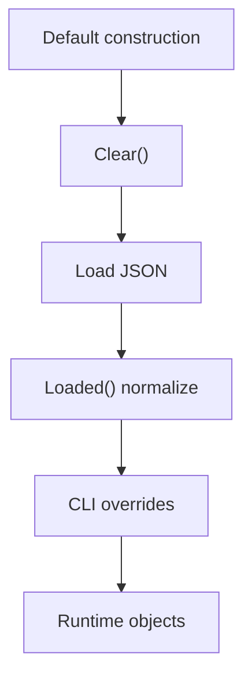
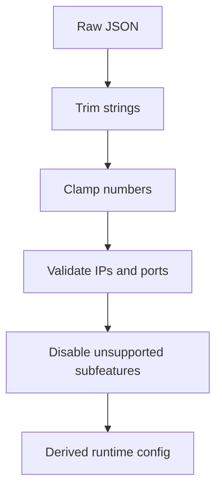
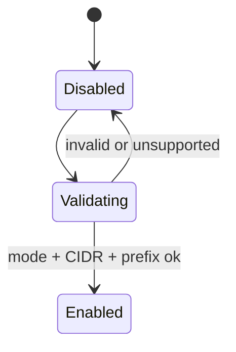
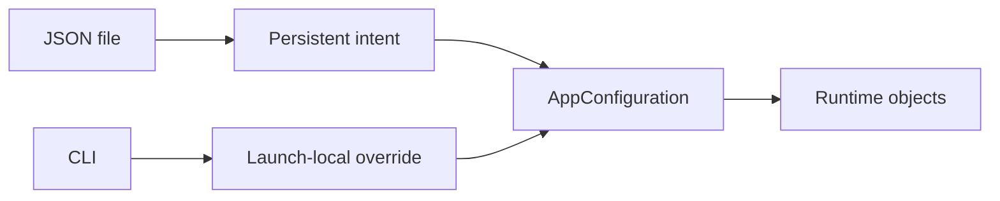

# Configuration Model

[中文版本](CONFIGURATION_CN.md)

## Position

This is the canonical guide to `AppConfiguration` and the launch-time shaping around it. OPENPPP2 does not treat configuration as plain JSON. It uses a staged admission flow:

1. `Clear()` builds safe defaults.
2. `Load(...)` merges JSON.
3. `Loaded()` repairs, clamps, clears, and derives runtime values.
4. `main.cpp` applies per-run CLI overrides for host-specific behavior.

Anchors:

- `ppp/configurations/AppConfiguration.h`
- `ppp/configurations/AppConfiguration.cpp`
- `main.cpp::LoadConfiguration(...)`
- `main.cpp::GetNetworkInterface(...)`
- `main.cpp::PreparedArgumentEnvironment(...)`

## Why This Layer Matters

Configuration in OPENPPP2 is not just a bag of scalars. It is a policy object that decides:

- which transport carriers exist
- which runtime branches are enabled
- which platform-side effects will happen
- which values are considered safe enough to keep
- which values must be normalized or discarded

That makes configuration a control surface for the entire repository.

## Staged Admission Flow

## Configuration Shape

`AppConfiguration` is organized around these blocks:

- `concurrent`
- `cdn`
- `ip`
- `udp`
- `tcp`
- `mux`
- `websocket`
- `key`
- `vmem`
- `server`
- `client`
- `virr`
- `vbgp`

Each block corresponds to a specific code region or runtime concern. The structure is not arbitrary.

## Defaults From `Clear()`

Important defaults from `Clear()` include:

- `concurrent = Thread::GetProcessorCount()`.
- `cdn[*] = IPEndPoint::MinPort`.
- UDP DNS timeout, TTL, cache, and redirect defaults.
- TCP and MUX timeout defaults.
- WebSocket listeners off by default.
- key material defaults such as `kf`, `kh`, `kl`, `kx`, `sb`.
- `server.subnet = true`.
- `server.mapping = true`.
- server IPv6 disabled by default.
- client GUID sentinel value.
- client bandwidth limit `0`.
- Windows-only `paper_airplane.tcp = true`.
- `virr.update-interval = 86400`.
- `virr.retry-interval = 300`.
- `vbgp.update-interval = 3600`.

These defaults are important because they describe the repository's safe boot posture.

## Meaning Of The Main Blocks

### `concurrent`

This is the process-level concurrency hint. It influences how the runtime expects to use CPU resources.

### `cdn`

These are listen-related defaults for some service channels.

### `ip`

Holds public and interface IP strings used by the launcher.

### `udp`

Contains UDP timeout policy, DNS policy, listener port, and static UDP policy.

### `tcp`

Contains TCP timeouts, connect policy, listen port, backlog, and fast open settings.

### `mux`

Controls multiplexing timeouts and keepalive behavior.

### `websocket`

Groups WebSocket listen settings, TLS settings, host/path, and HTTP header customization.

### `key`

Defines protocol identity and packet transformation policy.

### `vmem`

Defines memory-backed virtual file behavior.

### `server`

Defines server-side node identity, logging, backend, and IPv6 behavior.

### `client`

Defines client-side identity, server target, proxy surfaces, route mappings, and restart behavior.

### `virr`

Controls automatic IP-list refresh cadence.

### `vbgp`

Controls periodic vBGP route refresh cadence.

## Normalization Rules From `Loaded()`

`Loaded()` does the real shaping work. Notable rules:

- `concurrent < 1` resets to CPU count.
- `server.node` is clamped to `>= 0`.
- `server.ipv6.prefix_length` is clamped to the IPv6 prefix range.
- non-positive timeouts fall back to defaults.
- invalid ports become `IPEndPoint::MinPort`.
- negative keepalive counts become `0`.
- string fields are trimmed before use.
- empty client GUID falls back to the sentinel GUID.
- invalid IP strings are cleared.
- unsupported key protocol or transport names fall back to defaults.
- WebSocket serving is disabled when host/path or certificates are invalid.
- `vmem` is cleared if path is empty or size is below `1`.
- `server.ipv6.static_addresses` is filtered to valid, unique, in-prefix IPv6 entries.
- `virr.update-interval` and `vbgp.update-interval` are clamped to at least `1`.
- `virr.retry-interval` is clamped to at least `1`.

## Derived State Is Important

`Loaded()` is not just input validation. It derives runtime-ready state.

Examples:

- If the websocket host/path pair is unusable, the subsystem is turned off.
- If IPv6 mode is unsupported by the platform, related fields are cleared.
- If the client GUID is empty, a deterministic fallback is inserted.
- If static addresses are invalid, they are removed rather than preserved.

This is why `AppConfiguration` is more like a configuration compiler than a passive struct.

## IPv6 Server Behavior

IPv6 server mode is not just a boolean. `Loaded()` validates mode, CIDR, prefix length, gateway, and static address map.

If server IPv6 support is unavailable, the IPv6 server settings are disabled and related fields are cleared. If the configured prefix is invalid, the IPv6 server feature is disabled.

## WebSocket Behavior

WebSocket serving depends on a valid host name and path. If those are not valid, both listeners are disabled. If `wss` is disabled, certificate-related fields are cleared.

The important point is that transport policy is not considered valid just because the user typed a string. The runtime checks that the string combination is coherent.

## Client Routing Data

`client.mappings` is rebuilt from validated mapping entries. The loader accepts either one mapping object or an array of mappings. Invalid endpoints, invalid IPs, and multicast addresses are rejected.

That means mapping configuration is converted into a normalized runtime table, not copied verbatim.

## CLI And JSON

JSON config is durable node intent. CLI values are launch-local overrides.

- `--mode` chooses client or server.
- `--dns` populates local DNS input for the current run.
- `--nic`, `--ngw`, `--tun-*`, `--bypass*`, and `--dns-rules` shape the current host environment.

## Key Material And Mode

The `key` block deserves special attention because it controls more than encryption names.

It carries:

- `kf`, `kh`, `kl`, `kx`, `sb`.
- protocol identity string.
- transport identity string.
- protocol key string.
- transport key string.
- `masked`, `plaintext`, `delta_encode`, `shuffle_data`.

These fields influence the packet transform pipeline directly.

## Runtime Shape And Configuration

The configuration decides the shape of the runtime:

- whether a client proxy exists.
- whether a server backend exists.
- whether IPv6 is enabled.
- whether static mode and subnet mode are active.
- whether TCP/WebSocket listeners are present.
- which routes and DNS servers are protected.

## What To Watch For When Reading The Code

1. A field might be present in JSON but removed in `Loaded()`.
2. A missing field may intentionally fall back to a safe default.
3. A platform-specific branch may clear or ignore fields that are otherwise valid on another OS.
4. The runtime may treat a field as policy input rather than a direct command.

## Practical Rule

Use JSON for persistent node shape. Use CLI for host-specific startup shape. Do not expect CLI to replace the configuration model.

## Deep Structure Notes

The config object is also a bridge between layers:

- transport settings feed `ITransmission`
- key and framing settings feed packet transforms
- server settings feed listener and management setup
- client settings feed host shaping and proxy behavior
- host-local overrides feed `main.cpp`

This is why the configuration file should be thought of as a node contract, not as a dump of knobs.

## Related Documents

- `README.md`
- `CLI_REFERENCE.md`
- `TRANSMISSION.md`
- `ARCHITECTURE.md`

## Main Conclusion

`AppConfiguration` is a policy compiler for the runtime. It converts untrusted or incomplete input into a constrained, platform-aware, runtime-ready shape.
