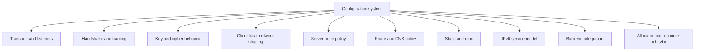
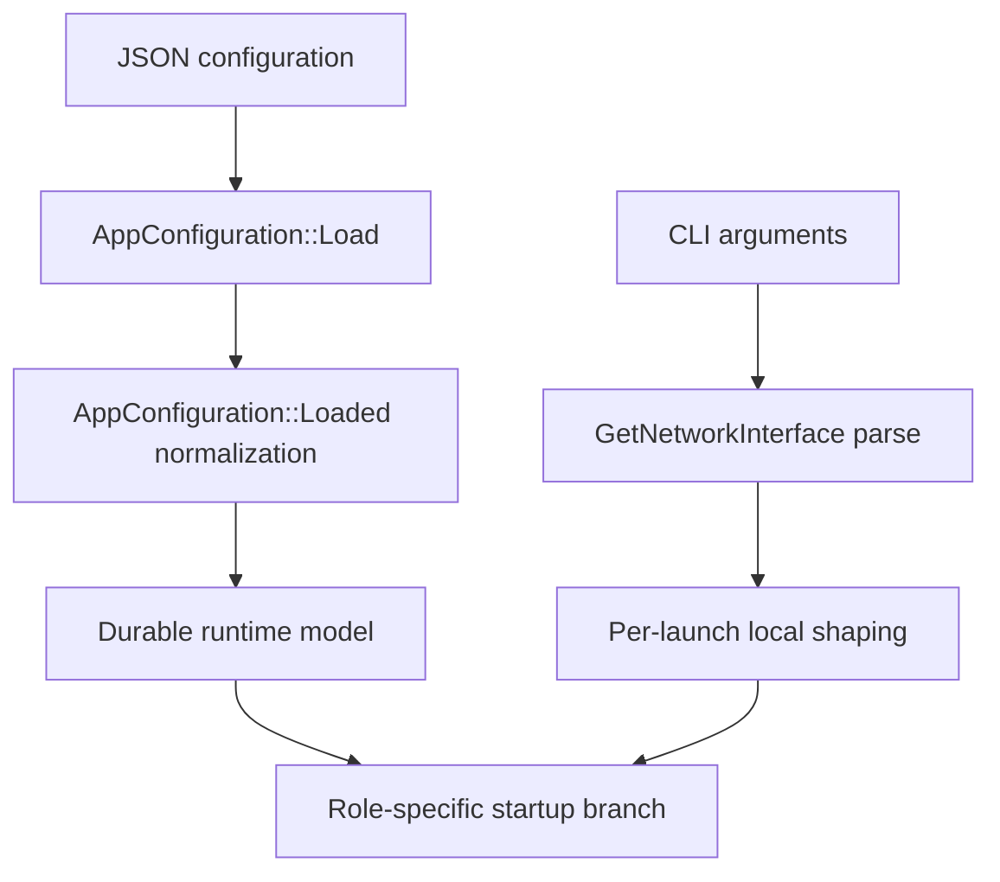
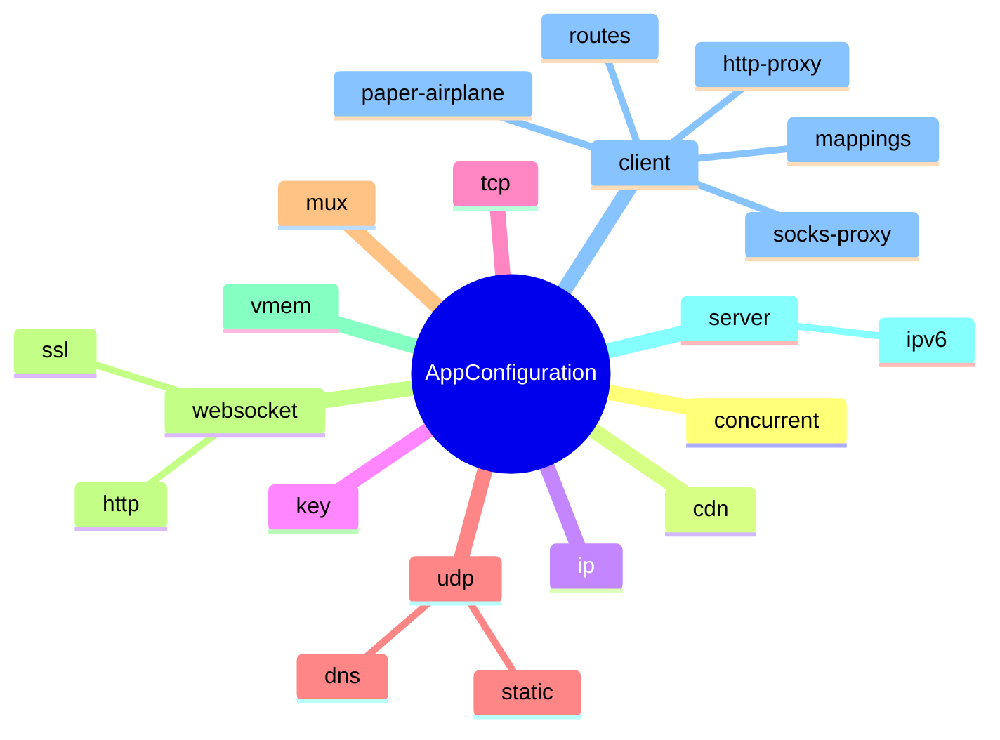

# Configuration Model, Parameter Dictionary, Normalization Rules, And Runtime Shaping

[中文版本](CONFIGURATION_CN.md)

## Document Position

This document is the master configuration guide for OPENPPP2. It is not merely a field list, and it is not satisfied by showing one example `appsettings.json` and stopping there. Its purpose is to explain the whole configuration system as a real engineering subsystem, so that readers understand:

- what configuration means in this system
- how configuration objects move from JSON into runtime state
- which fields are only raw input and which fields are defaulted, clamped, disabled, or cleared
- how JSON configuration and command-line parameters work together
- how different configuration blocks correspond to client, server, transport, routing, DNS, static mode, MUX, IPv6, and backend planes
- which parameters are cross-platform and which have strong platform-dependent behavior
- how the runtime reacts to bad configuration: repair, fallback, disablement, or rejection

The main implementation anchors are:

- `ppp/configurations/AppConfiguration.h`
- `ppp/configurations/AppConfiguration.cpp`
- `main.cpp::LoadConfiguration(...)`
- `main.cpp::PreparedArgumentEnvironment(...)`
- `main.cpp::GetNetworkInterface(...)`
- `ppp/transmissions/ITransmission.cpp`
- `ppp/app/client/VEthernetNetworkSwitcher.cpp`
- `ppp/app/server/VirtualEthernetSwitcher.cpp`

If one sentence must summarize the central conclusion of this document, it is this: **OPENPPP2 configuration is not just JSON parsing. It is a configuration admission and shaping system that actively repairs, clamps, defaults, or disables values before runtime depends on them.**

## Why Configuration Is So Central In OPENPPP2

Many smaller VPN, proxy, or tunnel tools use configuration mainly for:

- one remote endpoint
- one authentication block
- a handful of booleans

OPENPPP2 is fundamentally broader. Its configuration model directly controls or strongly influences:

- transport and listeners
- handshake and framing behavior
- key material and cipher selection
- client-side adapter, route, and DNS behavior
- server-side admission, mapping, IPv6, and backend behavior
- static packet path
- MUX plane
- local proxies
- route files, vBGP-style route inputs, and DNS rules
- virtual memory and buffer allocator behavior

That is one reason OPENPPP2 behaves more like an infrastructure runtime than like a small tunnel executable.



## The Two-Stage Configuration Story

One of the most useful ways to understand configuration in OPENPPP2 is to split it into two stages instead of mixing JSON and CLI together.

### Stage One: JSON Configuration Loading And Normalization

This stage is handled by `AppConfiguration`. It:

- constructs a full baseline model with defaults
- merges JSON values into it
- runs `Loaded()` normalization

### Stage Two: Launch-Time Local Shaping Through CLI

This stage is handled mainly by `GetNetworkInterface(...)` and surrounding startup logic in `main.cpp`. It:

- parses `--mode`
- parses `--config`
- parses `--dns`
- parses NIC, gateway, virtual adapter, route, DNS-rule, and local network shaping inputs
- applies them to this particular launch

### The Correct Relationship Between The Two Stages

- JSON defines durable node intent and durable capability model
- CLI defines the host-specific realization details of the current run



## Configuration Search Paths And Entry

`main.cpp::LoadConfiguration(...)` searches for configuration in this order:

1. an explicitly supplied configuration path
2. `./config.json`
3. `./appsettings.json`

The parser accepts these aliases for configuration path selection:

- `-c`
- `--c`
- `-config`
- `--config`

This means:

- `--config` is the most visible form
- but the code preserves several alias forms for compatibility and convenience

### Recommended Operational Practice

Even though the code can search multiple default locations, production and formal testing should almost always use an explicit path:

```bash
ppp --mode=server --config=/etc/openppp2/server.json
```

Depending on the current working directory to contain the right `appsettings.json` is not a good long-term operating model.

## `Clear()`: The Baseline World Before JSON Is Merged

`AppConfiguration::Clear()` establishes the baseline for the entire configuration system. Before any JSON values are merged, the runtime creates a full default model.

This matters because it means: **missing fields do not usually mean missing behavior. They usually mean fallback to `Clear()` defaults.**

### Large Default Categories Set By `Clear()`

The baseline includes:

- processor-count-derived concurrency
- baseline TCP, UDP, and MUX timeouts
- WebSocket listeners disabled by default
- baseline key block values
- `server.subnet = true`
- `server.mapping = true`
- server IPv6 disabled by default
- a sentinel client GUID
- zero bandwidth limit by default
- on Windows, `paper_airplane.tcp = true`

### What `Clear()` Really Means

It is not just “construct an empty object.” It constructs a known-safe model that can be merged and normalized in a predictable way.

## High-Level Parameter Map

Structurally, `AppConfiguration` is organized around these major blocks:

- `concurrent`
- `cdn`
- `ip`
- `udp`
- `tcp`
- `mux`
- `websocket`
- `key`
- `vmem`
- `server`
- `client`



## Top-Level Parameters

### `concurrent`

This sets global runtime concurrency intent.

#### Default

- `Thread::GetProcessorCount()`

#### Normalization

- values `< 1` are corrected back to the processor count

#### Recommended Interpretation

It is not merely a “thread count” knob. It is a top-level concurrency scale hint used by the runtime.

#### Parameter Table

| Parameter | Type | Default | Normalization | Scope | Platform Difference |
|---|---|---|---|---|---|
| `concurrent` | `int` | processor count | `<1` resets to processor count | global execution scale | no explicit platform split |

### `cdn`

This stores two CDN-related port hints.

#### Default

- both entries start at `IPEndPoint::MinPort`

#### Normalization

- invalid ports are reset back to `MinPort`

#### Recommended Interpretation

This is an auxiliary input for server listener classification and CDN-like ingress handling, not a fully separate subsystem by itself.

| Parameter | Type | Default | Normalization | Scope |
|---|---|---|---|---|
| `cdn[0]` | `int` | `MinPort` | invalid ports zeroed | server ingress classification |
| `cdn[1]` | `int` | `MinPort` | invalid ports zeroed | server ingress classification |

## The `ip` Block

The `ip` block provides public-address and local-interface hints.

### Fields

| Field | Type | Intended Role | Meaning | Normalization |
|---|---|---|---|---|
| `ip.public` | `string` | server | public address hint | invalid address cleared, valid address rewritten canonically |
| `ip.interface` | `string` | server | local listening-interface hint | invalid address cleared, valid address rewritten canonically |

### Usage Advice

- these are best read as node address hints, not as magic directives that override all listener binding behavior
- if set, the address string must be genuinely valid

## The `key` Block

The `key` block is one of the most important configuration groups because it shapes transport protection, framing behavior, NOP disturbance, and parts of static packet derivation.

### Baseline Defaults

| Field | Type | `Clear()` Default | Normalization | Main Layer |
|---|---|---|---|---|
| `kf` | `int` | `154543927` | preserved | transmission and static derivation |
| `kh` | `int` | `12` | clamped to `0..16` | handshake NOP upper bound |
| `kl` | `int` | `10` | clamped to `0..16` | handshake NOP lower bound |
| `kx` | `int` | `128` | `<0` resets to `0` | framing/disturbance factor |
| `sb` | `int` | `0` | clamped to legal skateboarding range | buffer skateboarding |
| `protocol` | `string` | `PPP_DEFAULT_KEY_PROTOCOL` | unsupported values reset to default | protocol cipher |
| `protocol-key` | `string` | `BOOST_BEAST_VERSION_STRING` | empty value reset to default | protocol key |
| `transport` | `string` | `PPP_DEFAULT_KEY_TRANSPORT` | unsupported values reset to default | transport cipher |
| `transport-key` | `string` | `BOOST_BEAST_VERSION_STRING` | empty value reset to default | transport key |
| `masked` | `bool` | `true` | preserved | masking behavior |
| `plaintext` | `bool` | `true` | preserved | plaintext/base94-related path behavior |
| `delta-encode` | `bool` | `true` | preserved | delta encoding |
| `shuffle-data` | `bool` | `true` | preserved | data shuffle |

### Why `plaintext = true` Does Not Mean “No Protection”

If this field is read in isolation, it is easy to misunderstand. But when read alongside `ITransmission.cpp`, it is better understood as a switch that permits plaintext-oriented and base94-oriented framing families in certain phases or configurations. It does not, by itself, imply that the system is wholly unprotected.

### Derived Behavior And Validation

`Loaded()` additionally:

- checks `Ciphertext::Support(config.key.protocol)`
- checks `Ciphertext::Support(config.key.transport)`
- repairs unsupported cipher names
- fills empty key strings
- computes `_lcgmods` derived values

So the `key` block is not only stored. It is actively transformed into a safer runtime model for later transmission code.

## The `tcp` Block

The `tcp` block defines native TCP carrier behavior.

### Parameter Table

| Field | Type | Default | Normalization | Intended Roles | Meaning |
|---|---|---|---|---|---|
| `tcp.inactive.timeout` | `int` | `PPP_TCP_INACTIVE_TIMEOUT` | `<1` resets to default | client/server | TCP idle timeout |
| `tcp.connect.timeout` | `int` | `PPP_TCP_CONNECT_TIMEOUT` | `<1` resets to default | client/server | connect timeout |
| `tcp.connect.nexcept` | `int` | `PPP_TCP_CONNECT_NEXCEPT` | `<0` resets to default | client/server | connect jitter extension |
| `tcp.listen.port` | `int` | `MinPort` | invalid ports zeroed | server | TCP listener port |
| `tcp.cwnd` | `int` | `0` | preserved | client/server | send-window hint |
| `tcp.rwnd` | `int` | `0` | preserved | client/server | receive-window hint |
| `tcp.turbo` | `bool` | `false` | preserved | client/server | TCP turbo behavior |
| `tcp.backlog` | `int` | `PPP_LISTEN_BACKLOG` | `<1` resets to default | server | backlog |
| `tcp.fast-open` | `bool` | `false` | preserved | client/server | TCP Fast Open |

### Usage Advice

- for initial deployment, do not rush to tune `cwnd` and `rwnd`
- if the listener port is invalid, the runtime does not keep it as a maybe-working value; it zeroes it and disables the listener path
- `tcp.turbo` and `fast-open` should be treated as performance-layer options to revisit only after base reachability is stable

## The `udp` Block

The `udp` block does not mean merely “enable UDP.” It simultaneously controls:

- ordinary UDP data plane behavior
- DNS helper behavior
- static packet path behavior

### Top-Level UDP Table

| Field | Type | Default | Normalization | Intended Roles | Meaning |
|---|---|---|---|---|---|
| `udp.cwnd` | `int` | `0` | preserved | client/server | UDP send-window hint |
| `udp.rwnd` | `int` | `0` | preserved | client/server | UDP receive-window hint |
| `udp.inactive.timeout` | `int` | `PPP_UDP_INACTIVE_TIMEOUT` | `<1` resets to default | client/server | UDP idle timeout |
| `udp.listen.port` | `int` | `MinPort` | invalid ports zeroed | server | UDP listener port |

### The `udp.dns` Sub-Block

| Field | Type | Default | Normalization | Intended Roles | Meaning |
|---|---|---|---|---|---|
| `udp.dns.timeout` | `int` | `PPP_DEFAULT_DNS_TIMEOUT` | `<1` resets to default | client/server | DNS query timeout |
| `udp.dns.ttl` | `int` | `PPP_DEFAULT_DNS_TTL` | `<0` corrected upward | client/server | DNS TTL |
| `udp.dns.cache` | `bool` | `true` | preserved | client/server | DNS cache switch |
| `udp.dns.turbo` | `bool` | `false` | preserved | client/server | DNS turbo behavior |
| `udp.dns.redirect` | `string` | empty | cleared if invalid endpoint/domain | server | DNS redirect target |

### The `udp.static` Sub-Block

| Field | Type | Default | Normalization | Intended Roles | Meaning |
|---|---|---|---|---|---|
| `udp.static.keep-alived[0]` | `int` | `PPP_UDP_KEEP_ALIVED_MIN_TIMEOUT` | `<0` corrected upward | client | minimum keepalive interval |
| `udp.static.keep-alived[1]` | `int` | `PPP_UDP_KEEP_ALIVED_MAX_TIMEOUT` | `<0` corrected upward | client | maximum keepalive interval |
| `udp.static.dns` | `bool` | `true` | preserved | client | whether static path allows DNS |
| `udp.static.quic` | `bool` | `true` | preserved | client | whether static path allows QUIC |
| `udp.static.icmp` | `bool` | `true` | preserved | client | whether static path allows ICMP |
| `udp.static.aggligator` | `int` | `0` | `<0` resets to `0` | client | aggregator link count |
| `udp.static.servers` | `set<string>` | empty | preserved plus parse-time cleaning | client | static upstream server list |

### Important Practical Note

- the defaults inside `udp.static` are intentionally permissive, but that does not mean static mode is automatically active
- `udp.dns.redirect` is cleared if invalid; it is not allowed to survive as a broken string input

## The `mux` Block

The `mux` block defines the auxiliary subconnection plane, not the main session itself.

### Parameter Table

| Field | Type | Default | Normalization | Intended Roles | Meaning |
|---|---|---|---|---|---|
| `mux.connect.timeout` | `int` | `PPP_MUX_CONNECT_TIMEOUT` | `<1` resets to default | client/server | mux connect timeout |
| `mux.inactive.timeout` | `int` | `PPP_MUX_INACTIVE_TIMEOUT` | `<1` resets to default | client/server | mux idle timeout |
| `mux.congestions` | `int` | `PPP_MUX_DEFAULT_CONGESTIONS` | negative or too-small values reset to default | client/server | max congestion window |
| `mux.keep-alived[0]` | `int` | `PPP_TCP_CONNECT_TIMEOUT` | `<0` corrected upward | client/server | minimum mux keepalive |
| `mux.keep-alived[1]` | `int` | `PPP_MUX_CONNECT_TIMEOUT` | `<0` corrected upward | client/server | maximum mux keepalive |

### Usage Advice

- MUX is not a replacement for the base session
- do not begin by tuning MUX aggressively before the underlying session is understood

## The `websocket` Block

The `websocket` block defines the WS/WSS-facing ingress personality of the node. In practice it behaves almost like a small subsystem of its own.

### Top-Level Fields

| Field | Type | Default | Normalization | Intended Roles | Meaning |
|---|---|---|---|---|---|
| `websocket.host` | `string` | empty | invalid domain disables WS/WSS and clears related fields | server | WebSocket host |
| `websocket.path` | `string` | empty | empty or non-`/` path disables WS/WSS | server | WebSocket path |
| `websocket.listen.ws` | `int` | `MinPort` | invalid port zeroed | server | WS listener port |
| `websocket.listen.wss` | `int` | `MinPort` | invalid port zeroed | server | WSS listener port |

### The `websocket.ssl` Sub-Block

| Field | Type | Default | Normalization | Meaning |
|---|---|---|---|---|
| `certificate-file` | `string` | empty | cleared if WSS is invalid | certificate file |
| `certificate-key-file` | `string` | empty | cleared if WSS is invalid | private key file |
| `certificate-chain-file` | `string` | empty | cleared if WSS is invalid | chain file |
| `certificate-key-password` | `string` | empty | cleared if WSS is invalid | private key password |
| `ciphersuites` | `string` | `GetDefaultCipherSuites()` | empty value resets to default | TLS suite selection |
| `verify-peer` | `bool` | `true` | preserved | peer verification |

### The `websocket.http` Sub-Block

| Field | Type | Default | Normalization | Meaning |
|---|---|---|---|---|
| `http.error` | `string` | empty | cleared if WS is disabled | HTTP error body |
| `http.request` | `map<string,string>` | empty | cleared if WS is disabled | client request-header decoration |
| `http.response` | `map<string,string>` | empty | cleared if WS is disabled | server response-header decoration |

### Admission-Control Rules

`Loaded()` applies this sequence:

1. validate `host` as a domain name
2. validate `path` as a non-empty slash-prefixed path
3. if either is invalid, disable both WS and WSS
4. if the WSS certificate set fails verification, disable WSS only
5. if WSS is disabled, clear certificate-related fields
6. if WS is disabled, clear `host`, `path`, and `http.*`

That means WebSocket configuration is not “whatever the file said.” It must pass a structural admission pass.

## The `vmem` Block

The `vmem` block controls `BufferswapAllocator` behavior.

### Parameter Table

| Field | Type | Default | Normalization | Platform Difference | Meaning |
|---|---|---|---|---|---|
| `vmem.size` | `int64` | `0` unless supplied | `<1` disables the whole block | all | size |
| `vmem.path` | `string` | empty | empty path disables the whole block | Windows and non-Windows differ later | storage path |

### Actual Allocator Creation Behavior

In `main.cpp::LoadConfiguration(...)`:

- on Windows, allocator creation depends mainly on `size > 0`
- on non-Windows, both `path` and `size` must be valid

### Usage Advice

- if allocator behavior is not yet understood, leave `vmem` disabled first
- when enabling it, define path, capacity, and platform expectations explicitly

## The `server` Block

The `server` block defines node identity and server capability posture.

### Top-Level Server Fields

| Field | Type | Default | Normalization | Meaning |
|---|---|---|---|---|
| `server.log` | `string` | empty | rewritten to full path | log path |
| `server.node` | `int` | `0` | `<0` corrected to `0` | node identifier |
| `server.subnet` | `bool` | `true` | preserved | subnet forwarding enabled |
| `server.mapping` | `bool` | `true` | preserved | mappings enabled |
| `server.backend` | `string` | empty | trimmed | managed backend URL |
| `server.backend-key` | `string` | empty | trimmed | backend authentication key |

### The `server.ipv6` Sub-Block

| Field | Type | Default | Normalization | Meaning |
|---|---|---|---|---|
| `mode` | `string/enum` | `None` | normalized through `NormalizeIPv6Mode(...)` | IPv6 mode |
| `cidr` | `string` | empty | parsed as CIDR | prefix input |
| `prefix-length` | `int` | `128` | clamped to `0..128`, may disable service if invalid | prefix width |
| `gateway` | `string` | empty | must sit inside prefix or be cleared/derived | IPv6 gateway |
| `dns1` | `string` | empty | trimmed and validated | IPv6 DNS1 |
| `dns2` | `string` | empty | trimmed and validated | IPv6 DNS2 |
| `lease-time` | `int` | `300` | corrected upward from invalid values | lease time |
| `static-addresses` | `map<string,string>` | empty | GUID, address, prefix-match, and dedupe validation | static bindings |

### IPv6 Mode Enumeration

| Value | Meaning | Current Code Support | Notes |
|---|---|---|---|
| empty or unset | None | supported | no server-side IPv6 service |
| `nat66` | NAT66 | supported | default ULA `/64` may be derived |
| `gua` | Global Unicast Assignment | supported | requires a genuine GUA prefix |

### Key IPv6 Admission Rules

| Rule | Behavior | Result |
|---|---|---|
| 1 | current platform lacks server IPv6 data plane support | IPv6 service disabled |
| 2 | `nat66` with no prefix | default `fd42:4242:4242::/64` derived |
| 3 | `gua` but prefix is not global-unicast | IPv6 service disabled |
| 4 | invalid prefix length | IPv6 service disabled |
| 5 | gateway outside prefix | gateway cleared or re-derived |
| 6 | static address outside prefix or colliding with gateway | static entry discarded |

## The `client` Block

The `client` block is a composite model of client identity, attachment, local services, mapping behavior, and routing inputs.

### Top-Level Client Fields

| Field | Type | Default | Normalization | Meaning |
|---|---|---|---|---|
| `client.guid` | `string` | all-ones sentinel GUID | empty value reset to sentinel | client identity |
| `client.server` | `string` | empty | trimmed | remote server address |
| `client.server-proxy` | `string` | empty | trimmed | upstream proxy used to reach the server |
| `client.bandwidth` | `int64` | `0` | preserved | bandwidth hint or limit |
| `client.reconnections.timeout` | `int` | `PPP_TCP_CONNECT_TIMEOUT` | `<1` resets to default | reconnect wait time |

### The `client.http-proxy` Sub-Block

| Field | Type | Default | Normalization | Meaning |
|---|---|---|---|---|
| `bind` | `string` | empty | invalid address cleared | bind address |
| `port` | `int` | `PPP_DEFAULT_HTTP_PROXY_PORT` | invalid port zeroed | local HTTP proxy port |

### The `client.socks-proxy` Sub-Block

| Field | Type | Default | Normalization | Meaning |
|---|---|---|---|---|
| `bind` | `string` | empty | invalid address cleared | bind address |
| `port` | `int` | `PPP_DEFAULT_SOCKS_PROXY_PORT` | invalid port zeroed | local SOCKS port |
| `username` | `string` | empty | trimmed | SOCKS username |
| `password` | `string` | empty | trimmed | SOCKS password |

### Windows-Only `paper-airplane`

| Field | Type | Default | Platform | Meaning |
|---|---|---|---|---|
| `client.paper-airplane.tcp` | `bool` | `true` | Windows | PaperAirplane TCP behavior |

### `client.mappings`

| Field | Type | Required | Normalization | Meaning |
|---|---|---|---|---|
| `local-ip` | `string` | yes | invalid values discard the whole entry | local service address |
| `local-port` | `int` | yes | invalid values discard the whole entry | local service port |
| `protocol` | `string` | yes | anything other than `udp` becomes TCP semantics | protocol |
| `remote-ip` | `string` | yes | invalid values discard the whole entry | externally visible address |
| `remote-port` | `int` | yes | invalid values discard the whole entry | externally visible port |

### `client.routes`

| Field | Type | Platform Difference | Meaning |
|---|---|---|---|
| `name` | `string` | general | route rule name |
| `nic` | `string` | especially relevant on Linux | interface selection |
| `ngw` | `string` | general | gateway selection |
| `path` | `string` | general | local route file |
| `vbgp` | `string` | general | online route source |

### `LoadAllMappings(...)` Admission Behavior

For each mapping, the loader checks:

- protocol legality
- local and remote port ranges
- local and remote IP parsing
- non-multicast requirement
- address validity

It also deduplicates mappings using endpoint-keyed maps. In other words: **mappings are not blindly accepted just because they appear in JSON.**

## Trimming And String Normalization

The load path performs significant `LTrim` and `RTrim` normalization. This is not glamorous, but it is part of why the runtime is predictable.

### Typical Fields That Are Trimmed

| Category | Example Fields |
|---|---|
| address hints | `ip.public`, `ip.interface` |
| backend | `server.backend`, `server.backend-key` |
| IPv6 | `server.ipv6.cidr`, `gateway`, `dns1`, `dns2` |
| client identity and reachability | `client.guid`, `client.server`, `client.server-proxy` |
| proxies | `client.http-proxy.bind`, `client.socks-proxy.*` |
| WebSocket | `host`, `path`, certificate paths, cipher suites |
| key data | `protocol`, `protocol-key`, `transport`, `transport-key` |

### Practical Meaning For Operators

This makes it much less likely that leading or trailing whitespace from copy-paste accidents becomes a hidden runtime problem.

## Port Normalization Summary

The following ports are all actively validated and zeroed when invalid:

| Field | Role Or Plane |
|---|---|
| `tcp.listen.port` | native TCP listener |
| `websocket.listen.ws` | WS listener |
| `websocket.listen.wss` | WSS listener |
| `client.http-proxy.port` | client local HTTP proxy |
| `client.socks-proxy.port` | client local SOCKS proxy |
| `udp.listen.port` | UDP listener |
| `cdn[0]`, `cdn[1]` | CDN ingress hints |

This means an invalid port does not survive as a maybe-working configuration. The runtime removes the corresponding service surface.

## Configuration Repair Versus Configuration Disablement

One of the most important ways to read `Loaded()` is to distinguish two normalization strategies.

### Strategy One: Repair And Fall Back To Defaults

Used when a value is wrong but can safely return to a baseline.

Examples:

- `concurrent < 1`
- TCP backlog too small
- invalid timeout values
- unsupported cipher names
- empty key strings

### Strategy Two: Disable The Feature

Used when the configuration does not form a coherent feature model and guessing would be riskier than turning it off.

Examples:

- invalid WebSocket host/path disables WS/WSS
- invalid WSS certificate disables WSS
- no server IPv6 data-plane support on the platform disables IPv6 service
- invalid listener ports zero the listener path

This distinction is critical during troubleshooting because some bad input is silently repaired while other bad input removes entire features.

## Platform Difference Notes

### Windows

Windows has one explicit additional configuration field:

- `client.paper-airplane.tcp`

It defaults to `true` in `Clear()` on Windows builds.

That shows that the configuration model is not perfectly flattened across all platforms. The project permits platform-native long-lived fields where the runtime actually needs them.

### Linux

On Linux, many local host-network shaping decisions are expressed through CLI more than through `AppConfiguration` itself. But server IPv6 data-plane support still affects configuration admission directly. In practice, the same JSON file can produce different effective runtime results on Linux and non-Linux platforms.

### Non-Linux Server IPv6 Behavior

`SupportsServerIPv6DataPlane()` currently makes the platform distinction explicit:

- Linux returns `true`
- other platforms return `false`

For server IPv6, this is not a small performance difference. It is a question of whether the feature can enter the final effective runtime model at all.

## Recommended Configuration Practices

### Practice One: Separate Configuration By Role

Do not keep a permanently mixed client/server file and expect CLI to cleanly sort out all intent.

Recommended:

- `server.json`
- `client.json`
- `backend.json`

### Practice Two: Treat Route And DNS Inputs As Configuration Assets

For example:

- `ip.txt`
- `dns-rules.txt`
- route list files
- `virr` input sources

They should not be loose temporary files. They should be versioned and owned.

### Practice Three: Stabilize Basic Configuration Before Tuning Advanced Blocks

Recommended order:

1. define the carrier and listener surface
2. define route and DNS behavior
3. then decide local proxies and mappings
4. only then decide static mode, MUX, IPv6, and backend integration

## The Three Most Common Outcomes Of Bad Configuration

### Outcome One: Automatic Fallback To Defaults

Examples include timeout values, backlog values, and unsupported cipher names.

### Outcome Two: Field Clearing

Examples include invalid addresses, invalid DNS redirect targets, and broken WebSocket certificate state.

### Outcome Three: Whole-Feature Disablement

Examples include:

- WS/WSS entirely disabled
- WSS disabled
- IPv6 service entirely disabled

## Minimal Skeleton Examples

### Minimal Server Configuration Skeleton

```json
{
  "tcp": {
    "listen": { "port": 20000 }
  },
  "server": {
    "subnet": true,
    "mapping": true,
    "backend": "",
    "backend-key": ""
  }
}
```

### Minimal Client Configuration Skeleton

```json
{
  "client": {
    "guid": "{F4569208-BB45-4DEB-B115-0FEA1D91B85B}",
    "server": "ppp://127.0.0.1:20000/",
    "server-proxy": "",
    "bandwidth": 0,
    "reconnections": { "timeout": 5 }
  }
}
```

### WebSocket-Oriented Server Skeleton

```json
{
  "websocket": {
    "host": "vpn.example.com",
    "path": "/tun",
    "listen": {
      "ws": 20080,
      "wss": 20443
    },
    "ssl": {
      "certificate-file": "server.pem",
      "certificate-key-file": "server.key",
      "certificate-chain-file": "chain.pem",
      "certificate-key-password": "secret"
    }
  }
}
```

## Related Documents

- [`CLI_REFERENCE.md`](CLI_REFERENCE.md)
- [`USER_MANUAL.md`](USER_MANUAL.md)
- [`TRANSMISSION.md`](TRANSMISSION.md)
- [`SECURITY.md`](SECURITY.md)
- [`CLIENT_ARCHITECTURE.md`](CLIENT_ARCHITECTURE.md)
- [`SERVER_ARCHITECTURE.md`](SERVER_ARCHITECTURE.md)
- [`DEPLOYMENT.md`](DEPLOYMENT.md)
