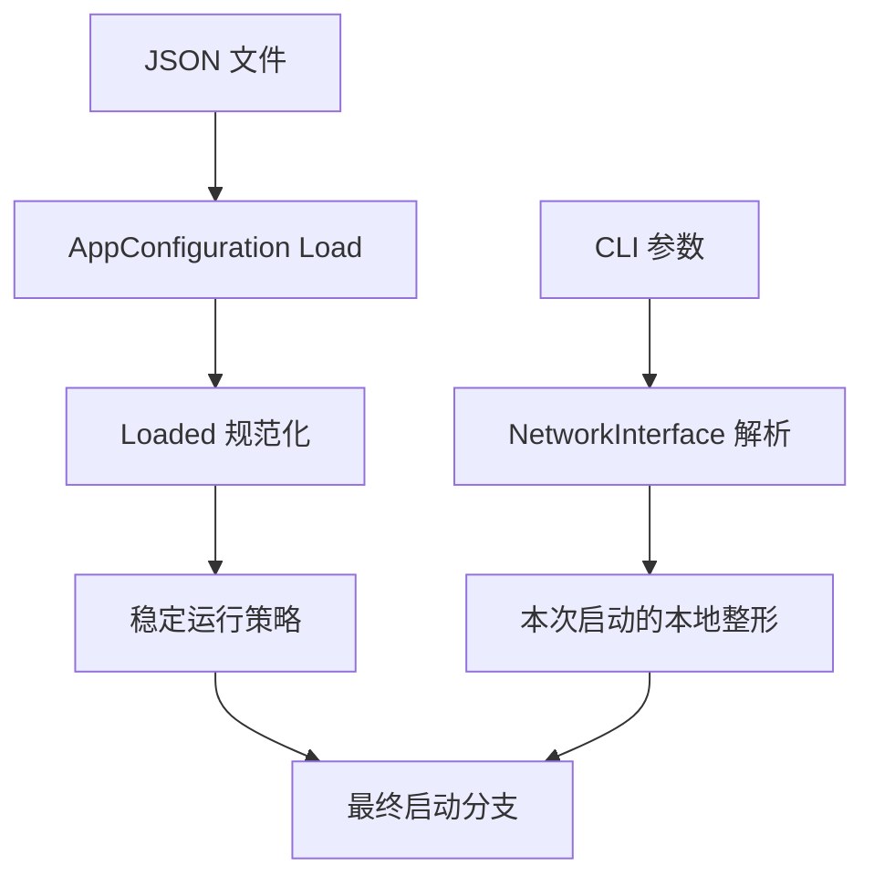
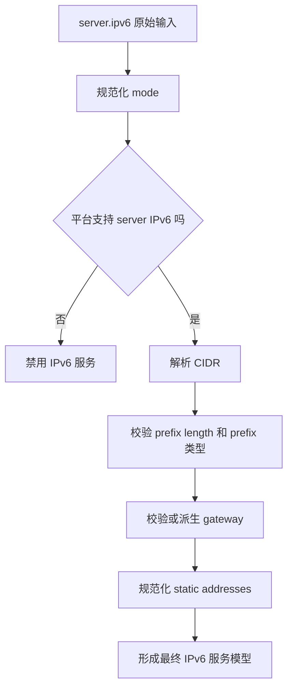

# 配置模型、规范化与运行时整形

[English Version](CONFIGURATION.md)

## 文档范围

本文解释 OPENPPP2 如何加载、规范化并使用配置。它不只是字段清单，而是要说明：配置在代码里到底如何工作，哪些值会被补默认值，哪些值会被裁剪，哪些值非法时会导致功能被禁用，以及 JSON 配置与命令行整形之间到底是什么关系。

核心实现集中在：

- `ppp/configurations/AppConfiguration.h`
- `ppp/configurations/AppConfiguration.cpp`
- `main.cpp::LoadConfiguration(...)`
- `main.cpp::PreparedArgumentEnvironment(...)`
- `main.cpp::GetNetworkInterface(...)`

这很重要，因为 OPENPPP2 并不是把配置当成一个被动 blob。加载器会主动把原始输入修整成更适合运行时使用的模型。

## 为什么配置在 OPENPPP2 里这么重要

许多更小的隧道工具里，配置不过是端点、密钥和少量开关的集合。但在 OPENPPP2 中，配置远比这更核心。

它直接定义或强烈影响：

- 传输与监听行为
- 握手与帧化行为
- cipher 选择和 key 材料
- route 与 DNS 分流
- static packet mode 行为
- mux 行为
- 服务端策略与 IPv6 服务
- 客户端 mappings、proxies 与 route-file 策略
- 虚拟内存 buffer allocator 行为

这也是为什么这个项目更像基础设施运行时，而不是一个窄功能代理工具。配置对象本身就是“运维意图”和“运行时行为”之间的核心契约。

## 配置的两阶段故事

OPENPPP2 的配置过程可以分成两个阶段。

### 第一阶段：JSON 模型加载

JSON 文件被装载进 `AppConfiguration`。

### 第二阶段：运行时整形

随后 CLI 会通过 `NetworkInterface` 等结构继续整形本次启动的本地运行状态。

这个分层非常关键。JSON 定义节点的长期意图，CLI 则决定本次启动的本地环境细节。

## 配置入口与搜索路径

`main.cpp::LoadConfiguration(...)` 会按以下顺序寻找配置：

1. 命令行显式指定的配置路径
2. `./config.json`
3. `./appsettings.json`

解析器接受多个 CLI 配置别名：

- `-c`
- `--c`
- `-config`
- `--config`

一旦拿到候选路径，加载器会：

- rewrite path
- 转成 full path
- 检查可读性
- 构造 `AppConfiguration`
- 调用 `configuration->Load(configuration_path)`

这说明配置加载对于不同的运维习惯是有一定容忍度的，但最终都会被归一化成运行时内部使用的绝对路径。

## `Clear()` 里的基线模型

每次加载前都会先调用 `AppConfiguration::Clear()`。

这一点非常重要，因为它说明：在任何 JSON 覆盖发生之前，系统总有一套已知的基线模型。

这套基线包括：

- 基于 CPU 核数的并发度
- 空的公网与接口地址提示
- UDP DNS 默认值
- TCP connect 与 inactive timeout 默认值
- mux timeout 默认值
- 默认关闭的 WebSocket 监听
- `kf`、`kh`、`kl`、`kx`、`sb` 等 key 默认值
- protocol 与 transport key 的默认算法与默认 key 字符串
- 默认启用的 `masked`、`plaintext`、`delta-encode`、`shuffle-data`
- server 默认启用 subnet 和 mapping，但默认关闭 IPv6 服务
- client 默认 GUID 哨兵值、默认 proxy 端口、默认零带宽限制

因此，配置中缺少字段通常不代表“没有行为”，更常代表“回退到 `Clear()` 里的基线行为”。

## key 块的默认基线

`key` 块里的默认值尤其关键。

代码基线是：

- `kf = 154543927`
- `kh = 12`
- `kl = 10`
- `kx = 128`
- `sb = 0`
- `protocol = PPP_DEFAULT_KEY_PROTOCOL`
- `protocol-key = BOOST_BEAST_VERSION_STRING`
- `transport = PPP_DEFAULT_KEY_TRANSPORT`
- `transport-key = BOOST_BEAST_VERSION_STRING`
- `masked = true`
- `plaintext = true`
- `delta-encode = true`
- `shuffle-data = true`

很多读者第一次看到 `plaintext = true` 会困惑，但只要把它和 `ITransmission.cpp` 里的 base94 路径一起看，就会明白这不是“完全没有保护”，而是项目对早期帧族和 plaintext 路径有明确设计，不是简单的“从第一个字节开始就只剩一种二进制密文记录层”。

## 字符串裁剪与规范化

`AppConfiguration.cpp` 里的 `LRTrim(...)` 是非常有代表性的“工程纪律”代码。

它会裁剪的字符串包括：

- 地址提示字段
- backend URL 与 backend key
- log path
- IPv6 字符串
- client GUID 与 server 字段
- proxy bind 字符串与凭据
- WebSocket host 和 path
- cipher 名称与 key 文本
- SSL 证书路径与 ciphersuites 文本

这类逻辑看起来不“高端”，但它显著提高了配置模型的可预测性。很多后续难排查的问题，其实在这里就被消掉了。

## mapping 加载不是盲拷贝

`LoadAllMappings(...)` 是配置模型“主动校验”的典型例子。

对于每个 mapping 条目，加载器会检查：

- 协议是否是 TCP 或 UDP
- 本地端口和远端端口是否合法
- 本地 IP 和远端 IP 是否存在
- IP 字符串是否能成功解析
- 地址是否有效且非 multicast

之后它还会利用 endpoint-keyed map 做去重，最后再放进 `client.mappings`。

这说明 OPENPPP2 的配置哲学不是“用户写什么都原样保留”，而是“只有能被规范化成可执行规则的内容，才进入最终运行模型”。

## `Loaded()` 的真正意义

在原始 JSON 装载之后，`AppConfiguration::Loaded()` 才是真正的规范化核心。

这个函数非常重要，因为它把原始值转成运行时能更放心使用的配置模型。

它做的工作大致可以分成几类。

### 1. 数值默认化与裁剪

它会修正：

- `concurrent`
- `server.node`
- `server.ipv6.prefix_length`
- DNS timeout 与 TTL
- TCP backlog、connect timeout、connect jitter、inactive timeout
- mux connect timeout、inactive timeout、congestions
- static aggligator
- keepalive 数组

这样做的结果是：运行时对“格式正确但语义有问题”的数字输入更有抵抗力。

### 2. 字符串规范化

trim pass 在更深层解析前执行，减少空白字符引起的后续问题。

### 3. 端口清洗

TCP、WS、WSS、proxy listener、UDP 等端口都会被检查，非法值会被重置为 `IPEndPoint::MinPort`，也就是等效于禁用对应监听。

### 4. 地址清洗

多个 IP 类字符串会被解析并重写：

- `ip.public`
- `ip.interface`
- client HTTP proxy bind
- client SOCKS proxy bind

如果解析失败或项目判定地址无效，则直接清空。

也就是说，非法地址不会以字符串垃圾状态继续潜伏到后续运行阶段。

## IPv6 配置是高强度规范化的典型

IPv6 块是整个配置系统中最明显的“主动整形”示例之一。

这里的规范化逻辑包括：

- 通过 `NormalizeIPv6Mode(...)` 规范化 mode
- 如果当前平台不支持服务端 IPv6 数据面，则直接禁用 IPv6
- 把 CIDR 解析成 prefix 和 prefix_length
- NAT66 模式下，如果 prefix 缺失，则自动给出默认 ULA 前缀
- 拒绝 `<= 0` 或 `>= 128` 的 prefix_length
- 在 GUA 模式下要求 prefix 必须真的是 global unicast
- 检查 gateway 是否落在 prefix 内，不合法就清空
- 若未给出合法 gateway，则尝试自动选择首个 host 地址
- 检查 static address 是否属于 prefix
- 拒绝与 gateway 冲突的 static address
- 对 static address 做去重与规范化

这远远不是一个字段清单，而是一整套“把 IPv6 配置变成可执行服务模型”的逻辑。

## 为什么 IPv6 即使配置了也可能被关闭

这是运维很容易误解的点。

用户可能写了 IPv6 配置，但加载器仍可能关掉它，原因包括：

- 当前平台不支持服务端 IPv6 数据面
- prefix 非法
- GUA mode 却没有使用 global-unicast 前缀
- prefix_length 不在允许范围内

这意味着“写进配置”不自动等于“最终生效”。在 OPENPPP2 里，配置层本身就带有 admission control 性质。

## cipher 选择也会被规范化

加载器会显式检查配置中的 protocol 和 transport cipher 名称是否被支持。

如果不支持：

- `config.key.protocol` 会回退到 `PPP_DEFAULT_KEY_PROTOCOL`
- `config.key.transport` 会回退到 `PPP_DEFAULT_KEY_TRANSPORT`

同时，空的 key 字符串也会被替换成默认值。

这很重要，因为传输层后续会基于这些字段直接构造 `Ciphertext`。与其让非法 cipher 名字留到真正收发时才炸，不如在配置阶段就把它修回支持集。

## WebSocket 配置也带 admission control

WebSocket 块是另一个“不是字段清单，而是子系统”的例子。

加载器会检查：

- `websocket.host` 是否是域名地址
- `websocket.path` 是否存在且以 `/` 开头
- WSS 所需证书材料是否能通过验证

如果 host 或 path 非法：

- WS 和 WSS 都会被关掉

如果证书非法：

- WSS 会被关掉

随后根据剩余 listener 状态继续清理相关字段：

- 若 WSS 关闭，则证书文件和密码被清空
- 若 WS 关闭，则 host、path、HTTP decoration 等字段被清空

这说明 WebSocket 块在代码里像一个会“自我裁剪”的子系统，而不是一个被动 JSON 对象。

## DNS redirect 的规范化

加载器会把 `udp.dns.redirect` 作为 endpoint 风格字符串进行校验。

如果解析失败，或者目标既不是合法 IP 也不是合法 domain，则 redirect 字符串会被清空。

也就是说，DNS redirect 只有在通过结构校验后才会生效。

## vmem 与 buffer allocator

`vmem` 块控制是否创建基于虚拟内存工作区的 `BufferswapAllocator`。

规范化规则很简单但很重要：

- 如果 path 为空，或 size 小于 1，则 vmem 被禁用，path 和 size 都会被清空

之后在 `main.cpp::LoadConfiguration(...)` 中，allocator 只会在以下条件下创建：

- Windows：`vmem.size > 0`
- 非 Windows：`vmem.path` 和 `vmem.size` 同时存在

然后 size 会按 MB 转成字节，并带一个最小阈值。

这说明 `vmem` 不是纯描述性字段，而是会直接影响传输和包处理中的 buffer allocation 策略。

## `kf`、`kh`、`kl`、`kx`、`sb` 不会原样放行

加载器会修正多个 key 行为参数：

- `kh` 被夹到 `0..16`
- `kl` 被夹到 `0..16`
- `kx` 至少为零
- `sb` 被夹到合法的 skateboarding 范围

随后还会计算两个 LCG modulus：

- `LCGMOD_TYPE_TRANSMISSION`
- `LCGMOD_TYPE_STATIC`

后续 transmission 和 static packet 的 header-length 映射，都依赖这两个派生值。

这是非常典型的例子：配置系统不是只存数字，而是提前准备了后续帧化代码所需要的派生状态。

## 补默认值 与 禁用功能 是两种不同策略

读配置代码时，一个很有用的理解方法是区分两种规范化策略。

### 补默认值

适用于“值缺失或不合理，但可以安全回退到基线”的情况。

例子：

- TCP backlog
- connect timeout
- 默认 key 字符串
- NAT66 在缺少 prefix 时使用默认 ULA 前缀

### 禁用功能

适用于“配置不成立时，不应继续猜测”的情况。

例子：

- WebSocket host 或 path 非法，会直接关掉 WS/WSS
- WSS 证书非法，会关掉 WSS
- 当前平台不支持服务端 IPv6 时，会禁用 IPv6 server mode
- 非法监听端口会被归零，等效关闭监听

这对运维排障很重要，因为有些坏输入会被修复，有些坏输入则会让功能直接消失。

## client 块真正意味着什么

`client` 块不仅仅是“远端 server 地址在哪”。它其实是一个复合型客户端运行模型，里面包含：

- `guid` 定义客户端身份
- `server` 和 `server-proxy` 定义远端接入路径
- `bandwidth` 给出带宽限制提示
- `reconnections.timeout` 定义重连行为
- `http-proxy` 和 `socks-proxy` 定义本地代理服务
- `mappings` 定义客户端要向外暴露的本地服务
- `routes` 定义路由文件与 vBGP 风格来源
- Windows 下还带 `paper-airplane.tcp`

因此，client 块同时涉及：身份、传输、局部服务暴露、路由策略，本质上是一个“客户端环境模型”。

## server 块真正意味着什么

`server` 块则是服务端节点行为的声明外壳。它包括：

- 节点身份编号
- log path
- 是否允许 subnet forwarding
- 是否允许 mapping
- backend URL 与 key
- IPv6 server 行为

一个很好的理解方式是：server 块定义了“这个 server 只是 tunnel acceptor，还是一个带更复杂策略和服务能力的 overlay policy node”。

## WebSocket 块并不只是端口列表

很多人会低估 `websocket` 块，它其实是在给节点定义一种“HTTP-facing edge personality”。

它包括：

- WS/WSS 监听端口
- host
- path
- TLS 证书与 ciphersuite
- 请求头、响应头修饰
- HTTP error 响应

也就是说，WebSocket 块不是单纯“打开一个 WebSocket server”，而是在描述 OPENPPP2 如何接入 HTTP 风格边缘基础设施。

## UDP 块并不只是“开 UDP”

`udp` 块同时覆盖了几类东西：

- UDP listener 行为
- UDP inactivity 行为
- DNS helper 行为
- static UDP path 行为

其中 static 子块包括：

- keepalive 范围
- DNS、QUIC、ICMP 相关行为开关
- aggligator
- static upstream server 列表

因此，UDP 块实际上是一个相关但不单一的功能家族。

## mux 块

`mux` 块字段不多，但不应被低估。它控制：

- mux connect timeout
- mux inactive timeout
- congestion 行为
- mux keepalive 区间

由于 MUX 是额外的逻辑通道结构，而不是单纯布尔开关，这些值会实实在在影响部署中的稳定性和激进程度。

## `ip.public` 与 `ip.interface`

这两个字段很容易被忽略。它们更接近部署提示和地址提示，而不是核心协议本身。

它们会在可能的情况下被解析并规范化，解析失败则清空。

所以它们属于 deployment identity 与 address hinting，而不属于 transmission 或 handshake 核心。

## 命令行覆盖不是随意覆盖

CLI 并不是所有字段都能改，它主要聚焦本地启动整形。

典型覆盖区域包括：

- role 选择
- 配置文件路径
- 本地 DNS 列表
- preferred NIC 与 gateway
- TUN 名称与地址
- static 与 mux 开关
- bypass 文件与 DNS rules
- firewall-rules 文件

这支撑了一种很稳妥的运维模式：

- JSON 里放稳定节点意图与策略
- CLI 里放本次部署需要的本地整形

## 最小可用配置：server

一个真正可用的最小 server 配置至少要具备几样东西：

- 至少有一条有效 carrier listener，例如 TCP、UDP、WS 或 WSS
- 一个自洽的 `key` 块
- 一个有意义的 `server.node`
- 必要时还要有 backend 或 firewall policy

即便 JSON 语法正确，如果这些关键元素没有形成完整 server 角色，系统仍然谈不上可用。

## 最小可用配置：client

client 最少也需要：

- 一个稳定的 `client.guid`
- 一个可用的 `client.server`
- 通过 JSON 或 CLI 指定本地隧道地址行为
- 与部署模型匹配的 route / DNS 策略输入

这再次说明 OPENPPP2 必须按基础设施软件来文档化。语法层的“最小可解析”不等于运维层的“最小可部署”。

## 敏感信息处理

以下配置项至少应被视为敏感信息：

- `protocol-key`
- `transport-key`
- `server.backend-key`
- `client.server-proxy` 中的凭据
- TLS 私钥密码
- 使用 Go backend 时的数据库凭据

因此所有配置指导都应明确区分：

- 样例值
- 真实生产秘密材料

## 面向运维的实践建议

对于 OPENPPP2，最稳妥的配置实践是：

1. 每个角色、每个环境单独维护配置
2. 不要把测试密钥与生产密钥混在一起
3. WebSocket 的 host、path、certificate 要成组验证
4. IPv6 的 mode、prefix、gateway 要成组验证
5. route file 与 DNS rules 要按策略资产管理
6. 当功能“莫名其妙消失”时，优先检查是否在 Loaded() 阶段被禁用

## 面向开发者的阅读顺序

如果你想真正读懂这个配置子系统，建议按这个顺序读源码：

1. `AppConfiguration::Clear()`
2. 字符串裁剪辅助函数
3. mapping loader
4. `AppConfiguration::Loaded()`
5. `AppConfiguration::Load(const string&)`
6. `main.cpp::LoadConfiguration(...)`
7. `main.cpp::PreparedArgumentEnvironment(...)`
8. `main.cpp::GetNetworkInterface(...)`

按这个顺序读，你会很清楚地看到：

- 原始默认值
- 规范化逻辑
- 派生状态计算
- 运行时本地整形

## 最终理解

OPENPPP2 的配置模型，应该被理解成“运维意图”和“运行时行为”之间的一层主动规范化层，而不是被动 struct dump。

它会：

- 补默认值
- 裁剪并规范化字符串
- 校验地址和端口
- 对非法功能块执行禁用
- 计算后续帧化依赖的派生常量
- 规范化 IPv6 服务状态
- 把原始 JSON 文本修整成更适合运行时执行的模型

这正是复杂基础设施软件为了保持可运维、可排障、可预测而应该做的事情。

## 相关文档

- [`USER_MANUAL_CN.md`](USER_MANUAL_CN.md)
- [`CLI_REFERENCE_CN.md`](CLI_REFERENCE_CN.md)
- [`TRANSMISSION_CN.md`](TRANSMISSION_CN.md)
- [`SECURITY_CN.md`](SECURITY_CN.md)
- [`DEPLOYMENT_CN.md`](DEPLOYMENT_CN.md)
