# 配置模型、参数字典、规范化规则与运行时整形

[English Version](CONFIGURATION.md)

## 文档定位

本文是 OPENPPP2 的配置总说明书。它不是只列字段名的“配置索引页”，也不是只给一个 `appsettings.json` 示例就结束的说明。它的目标是把 OPENPPP2 的整个配置系统作为一个真实的工程子系统来解释清楚，让读者真正理解：

- 配置文件在这套系统里是什么地位
- 配置对象如何从 JSON 变成运行时模型
- 哪些字段只是原始输入哪些字段会被规范化、裁剪、禁用或补默认值
- JSON 配置与命令行参数到底如何协同
- 各配置块如何对应 client、server、transport、routing、DNS、static、MUX、IPv6、backend 等不同平面
- 哪些参数是跨平台的，哪些参数具有明显的平台差异
- 配置写错时系统会如何反应：修正、回退、禁用，还是完全忽略

本文主要锚定以下源码：

- `ppp/configurations/AppConfiguration.h`
- `ppp/configurations/AppConfiguration.cpp`
- `main.cpp::LoadConfiguration(...)`
- `main.cpp::PreparedArgumentEnvironment(...)`
- `main.cpp::GetNetworkInterface(...)`
- `ppp/transmissions/ITransmission.cpp`
- `ppp/app/client/VEthernetNetworkSwitcher.cpp`
- `ppp/app/server/VirtualEthernetSwitcher.cpp`

如果只用一句话概括本文的核心结论，那就是：**OPENPPP2 的配置不是“把 JSON 读到内存里”这么简单，而是一套会主动修正、裁剪、补默认值并决定后续运行结构的配置 admission 与 shaping 系统。**

## 为什么配置在 OPENPPP2 中如此重要

很多较小的 VPN、代理或隧道类工具，其配置模型主要围绕：

- 一个远端地址
- 一组认证信息
- 若干布尔开关

但 OPENPPP2 的配置系统远不止于此。它直接控制或强烈影响：

- 传输层与监听层
- 握手与帧化层
- 密钥材料与 cipher 选择
- client 侧虚拟网卡和本地路由/DNS 行为
- server 侧接入、mapping、IPv6、backend 行为
- static packet path
- MUX plane
- 本地代理
- route 文件、vBGP 风格输入、DNS 规则
- vmem 与 buffer allocator

这也是为什么 OPENPPP2 更像网络基础设施运行时，而不是“只有一个配置文件的小工具”。

```mermaid
flowchart TD
    A[配置系统] --> B[传输与监听]
    A --> C[握手与帧化]
    A --> D[密钥与加密行为]
    A --> E[client 本地网络整形]
    A --> F[server 节点策略]
    A --> G[route 与 DNS 策略]
    A --> H[static 与 mux]
    A --> I[IPv6 服务模型]
    A --> J[backend 集成]
    A --> K[buffer allocator 与资源行为]
    
    B --> B1[TCP listener]
    B --> B2[UDP listener]
    B --> B3[WebSocket listener]
    B --> B4[MUX plane]
    
    C --> C1[传输层头部]
    C --> C2[payload 加密]
    C --> C3[NOP 扰动]
    C --> C4[frame 族选择]
    
    D --> D1[cipher 选择]
    D --> D2[密钥派生]
    D --> D3[协议层 key]
    D --> D4[传输层 key]
    
    E --> E1[虚拟网卡]
    E --> E2[路由注入]
    E --> E3[DNS 劫持]
    E --> E4[代理服务]
    
    F --> F1[subnet 转发]
    F --> F2[mapping 映射]
    F --> F3[IPv6 服务]
    F --> F4[backend 集成]
    
    G --> G1[静态路由]
    G --> G2[域名规则]
    G --> G3[旁路策略]
    G --> G4[在线路由源]
    
    H --> H1[static packet]
    H --> H2[MUX 复用]
    H --> H3[QUIC 通道]
    H --> H4[ICMP 通道]
```

## 配置的两阶段故事

理解 OPENPPP2 配置系统，最重要的切入点之一，是把它分成两个阶段，而不是把 JSON 和 CLI 混在一起看。

### 第一阶���：JSON 配置加载与规范化

这一阶段由 `AppConfiguration` 负责。它会：

- 先构造一份带完整默认值的基线模型
- 再把 JSON 内容合并进去
- 最后进行 `Loaded()` 规范化

在这一阶段中，配置经历了完整的三次处理：

1. **Clear()** - 建立带完整默认值的基线世界
2. **Load(JSON)** - 将 JSON 内容合并进基线
3. **Loaded()** - 规范化、修正、派生运行模型

### 第二阶段：本次启动的 CLI 本地整形

这一阶段由 `main.cpp` 中的 `GetNetworkInterface(...)` 和相关启动逻辑负责。它会：

- 解析 `--mode`
- 解析 `--config`
- 解析 `--dns`
- 解析网卡、网关、虚拟接口、route、DNS rule 等本地覆盖输入
- 把这些覆盖应用在“当前这次启动”上

CLI 参数覆盖是**瞬时的、临时的、仅对本次启动生效**的，而 JSON 配置是**持久的、跨启动的、节点级别的**。

### 正确理解这两阶段的关系

- JSON 负责节点长期身份与长期能力模型
- CLI 负责本次启动的本地运行细节与临时覆盖

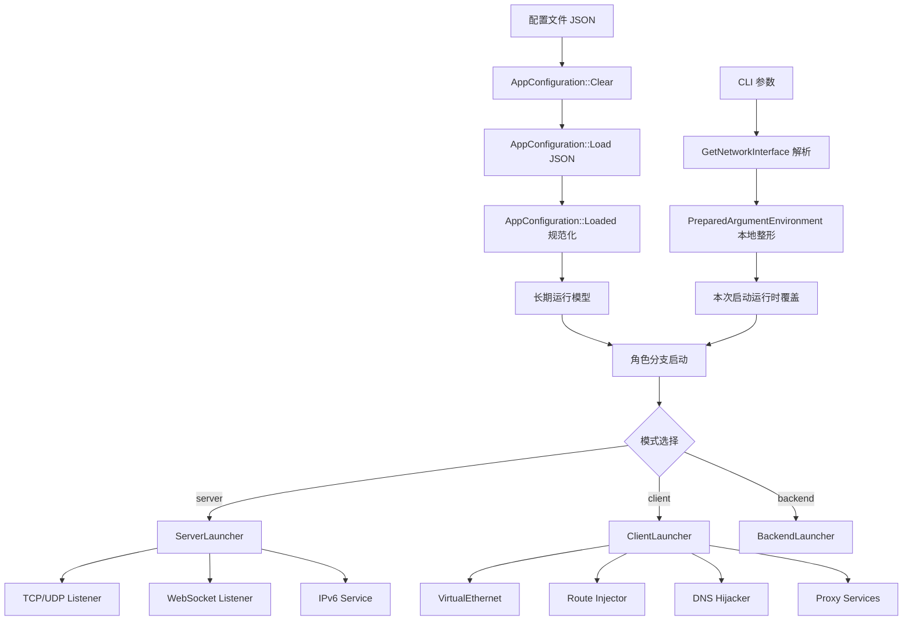

## 配置搜索路径与入口

`main.cpp::LoadConfiguration(...)` 会按顺序寻找配置：

1. 命令行显式指定的路径
2. `./config.json`
3. `./appsettings.json`

它实际接受的配置参数别名包括：

- `-c`
- `--c`
- `-config`
- `--config`

这意味着：

- 帮助文本里最常见的是 `--config`
- 但历史兼容和实现层面允许更多写法

### 推荐运维方式

虽然代码会自动尝试多个路径，但建议长期使用时始终显式传入配置路径：

```bash
ppp --mode=server --config=/etc/openppp2/server.json
```

不推荐依赖“当前工作目录刚好有一份 `appsettings.json`”。

## `Clear()`：一切配置加载之前的基线世界

`AppConfiguration::Clear()` 是整个配置系统的基线。所有 JSON 合并前，系统都会先建立一份完整默认模型。

这件事非常重要，因为它意味着：**配置中缺少字段，并不代表没有行为，而往往代表回退到 Clear 中定义的默认行为。**

### `Clear()` 的大类默认值

它会给出：

- 基于 CPU 核数的并发度
- TCP/UDP/MUX 的基线 timeout
- WebSocket 默认关闭的 listener
- key 块的基线值
- server 默认启用 `subnet` 与 `mapping`
- server 默认关闭 IPv6 服务
- client 的 GUID 哨兵值
- client 零带宽限制
- Windows 平台下 `paper_airplane.tcp = true`

### `Clear()` 的实际意义

它不是“构造个空对象”而已，而是构造一个**可被安全合并和安全规范化**的初始运行模型。

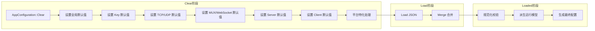

## 参数总览图

从结构上看，`AppConfiguration` 大致分成这些主配置块：

- `concurrent`
- `cdn`
- `ip`
- `udp`
- `tcp`
- `mux`
- `websocket`
- `key`
- `vmem`
- `server`
- `client`

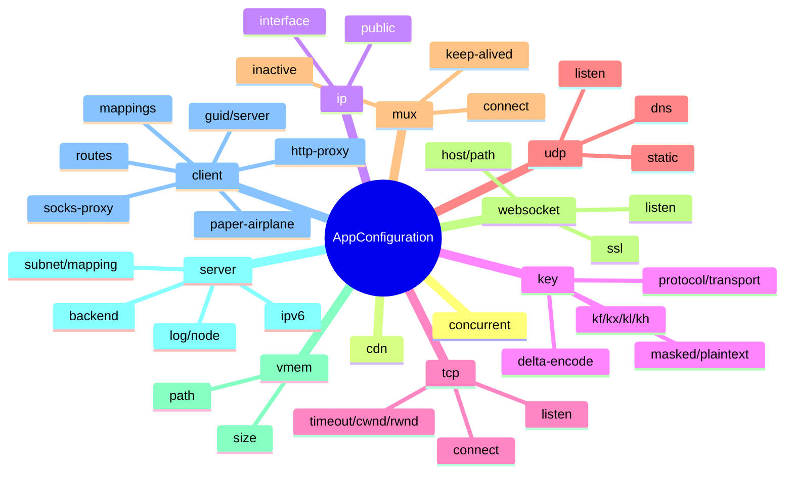

## 顶层参数

### `concurrent`

表示运行时并发度配置。

#### 默认值

- `Thread::GetProcessorCount()`

#### 规范化行为

- 若 `< 1`，则回正到 CPU 核数

#### 推荐理解

它不是简单“线程数”开关，而是整个运行时默认并发规模的上限提示。

虽然设置更高值不会直接报错，但实际上并发度还会受限于：

- 系统可用文件描述符数量
- 平台线程模型
- listener backlog
- 内存容量

#### 参数表

| 参数名 | 类型 | 默认值 | 规范化行为 | 影响范围 | 平台差异 |
|---|---|---|---|---|---|
| `concurrent` | `int` | CPU 核数 | `<1` 回正为 CPU 核数 | 全局执行器、并发规模 | 无显式平台差异 |

#### 跨平台行为分析

| 平台 | 默认值来源 | 实际并发特征 |
|---|---|---|
| Windows | `GetProcessorCount()` | 返回逻辑处理器数量 |
| Linux | `GetProcessorCount()` | 返回可用处理器数量（可能被 cgroup 限制） |
| macOS | `GetProcessorCount()` | 返回物理核心数 |
| Android | `GetProcessorCount()` | 返回可用核心数 |

#### 实际影响范围详解

`concurrent` 参数影响：

1. **主事件循环并发** - `ppp::core:: executor` 的工作线程数
2. **MUX 连接池上限** - `mux.congestions` 的实际有效值会参考此值
3. **acceptor 并发** - server 侧同时 accept 的能力
4. **内存分配策略** - buffer pool 的预分配规模

### `cdn`

表示两组 CDN 端口提示数组。

#### 默认值

- 两个元素都初始化为 `IPEndPoint::MinPort`

#### 规范化行为

- 非法端口会被重置为 `MinPort`

#### 推荐理解

它是 server 监听分类与 CDN 风格入口的辅助输入，而不是一个完整独立子系统。

CDN 功能实际上是**服务端入口分类机制**。当配置了 CDN 端口时：

- Server 会将这些端口与主 listener 区分对待
- 用于实现 CDN 源站分离部署
- 允许实现多入口负载分发

#### 参数表

| 参数名 | 类型 | 默认值 | 规范化行为 | 影响范围 | 平台差异 |
|---|---|---|---|---|---|
| `cdn[0]` | `int` | `MinPort` | 非法端口归零 | 服务端接入分类 | 无 |
| `cdn[1]` | `int` | `MinPort` | 非法端口归零 | 服务端接入分类 | 无 |

#### 配置示例

```json
{
  "cdn": [80, 443]
}
```

这表示 server 将监听了两个 CDN 入口端口：

- 80 - CDN HTTP 入口
- 443 - CDN HTTPS 入口

## `ip` 配置块

`ip` 主要提供公网地址与本地接口地址提示。

### 参数表

| 字段 | 类型 | 适用角色 | 说明 | 规范化行为 | 跨平台性 |
|---|---|---|---|---|---|
| `ip.public` | `string` | server | 公网地址提示 | 非法地址清空，合法地址转标准字符串 | 跨平台 |
| `ip.interface` | `string` | server | 本地监听接���地���提示 | 非法地址清空，合法地址转标准字符串 | 跨平台 |

### 详细说明

#### `ip.public`

这是**公网地址提示**，供外部发现机制使用。

当 server 启动时：

- 如果配置了 `ip.public`，该地址会作为节点标识的一部分
- 供对端发现和连接使用
- 影响 `server.node` 的可达性通告

**规范化规则**：

- 非 IPv4/IPv6 格式 → 清空
- 保留地址（如 `0.0.0.0`）→ 清空
- 多播地址 → 清空
- 合法地址 → 保持原值

#### `ip.interface`

这是**本地绑定地址提示**。

当 server 创建 listener 时：

- 如果配置了具体 IP，会绑定到指定地址
- 如果为空，则绑定到 `INADDR_ANY`（`0.0.0.0`）

**规范化规则**：

- 非 IPv4/IPv6 格式 → 清空
- 本地回环（`127.x.x.x`）→ 允许，用于测试
- 非法地址 → 清空

### 使用建议

- 它们更像“节点地址提示”而不是必须字段
- 若填写，必须保证地址文本合法
- 不要把它们当成会自动改变所有 listener 绑定方式的魔法字段

### IP 配置流程图

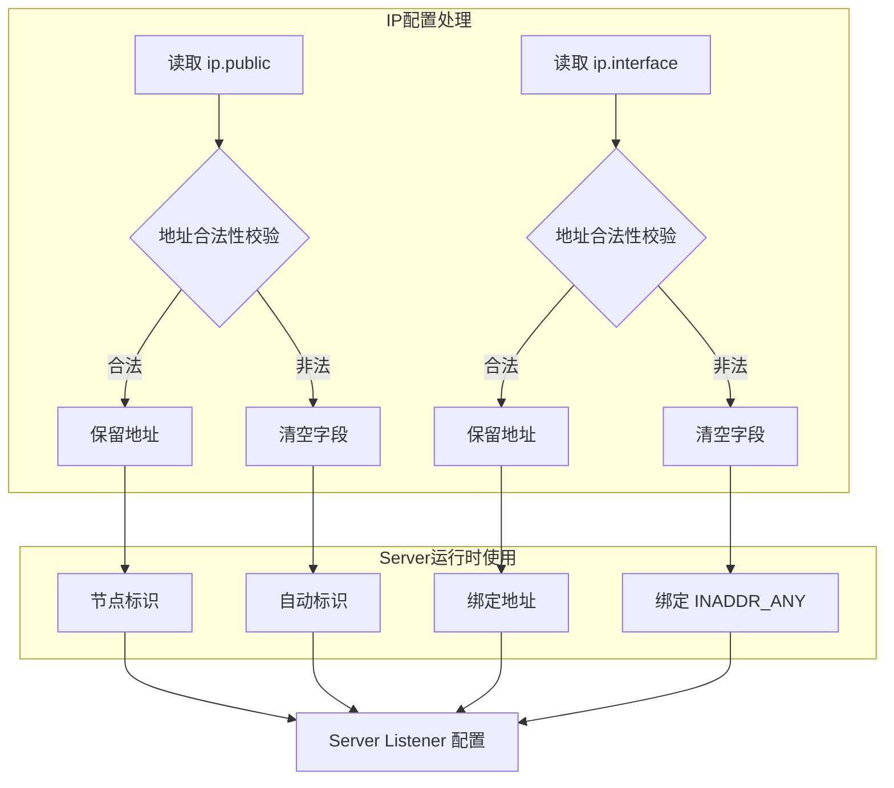

## `key` 配置块

`key` 是整个传输保护和帧化行为中最重要的一组配置之一。它同时影响：

- transmission 层头部保护
- payload 层保护
- NOP 扰动
- frame 族行为
- static packet path 的部分派生行为

### 基线默认值

| 字段 | 类型 | `Clear()` 默认值 | 规范化行为 | 作用层 | 跨平台性 |
|---|---|---|---|---|---|
| `kf` | `int` | `154543927` | 保留原值 | transmission/static 派生 | 跨平台 |
| `kh` | `int` | `12` | 限制到 `0..16` | 握手期 NOP 扰动上界 | 跨平台 |
| `kl` | `int` | `10` | 限制到 `0..16` | 握手期 NOP 扰动下界 | 跨平台 |
| `kx` | `int` | `128` | `<0` 回正为 `0` | 帧与扰动相关因子 | 跨平台 |
| `sb` | `int` | `0` | 限制到合法 skateboarding 范围 | buffer skateboarding | 跨平台 |
| `protocol` | `string` | `PPP_DEFAULT_KEY_PROTOCOL` | 不支持则回默认算法 | 协议层 cipher | 跨平台 |
| `protocol-key` | `string` | `BOOST_BEAST_VERSION_STRING` | 空值回默认 | 协议层 key | 跨平台 |
| `transport` | `string` | `PPP_DEFAULT_KEY_TRANSPORT` | 不支持则回默认算法 | 传输层 cipher | 跨平台 |
| `transport-key` | `string` | `BOOST_BEAST_VERSION_STRING` | 空值回默认 | 传输层 key | 跨平台 |
| `masked` | `bool` | `true` | 原样 | 数据掩码与随机扰动 | 跨平台 |
| `plaintext` | `bool` | `true` | 原样 | plaintext/base94 相关路径 | 跨平台 |
| `delta-encode` | `bool` | `true` | 原样 | 增量编码 | 跨平台 |
| `shuffle-data` | `bool` | `true` | 原样 | 数据洗牌 | 跨平台 |

### 详细字段说明

#### `kf` - 密钥因子

- **作用**：全局密钥派生因子
- **类型**：32位整数
- **有效范围**：`0 - 4294967295`
- **影响**：
  - 参与 transmission 层密钥派生
  - 影响静态数据流的混淆因子

**推荐理解**：除非有特殊需求，否则不建议修改此值。

#### `kh` / `kl` - 握手扰动边界

- `kh` - 握手期 NOP 扰动上界
- `kl` - 握手期 NOP 扰动下界

这两个值共同定义了握手阶段的随机扰动范围。

**规范化规则**：

- 超出 `0..16` 范围 → 限制到边界值
- `kh < kl` 时 → 自动交换为 `kh = kl`

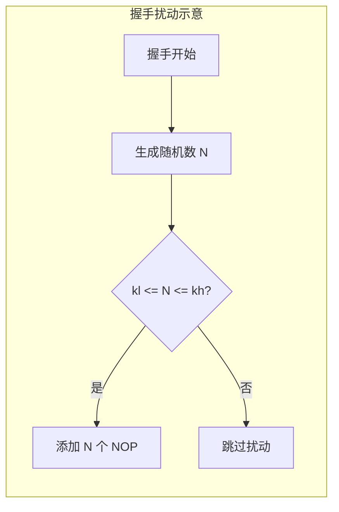

#### `kx` - 帧扰动因子

- **作用**：控制帧级别的扰动频率
- **类型**：32位整数
- **有效范围**：非负整数
- **默认值**：`128`

**规范化**：`<0` 时回正为 `0`

#### `sb` - Buffer Skateboarding

- **作用**：控制 buffer 的"滑板"行为
- **类型**：整数
- **有效范围**：`0 - 7`

这是一个**高级参数**，用于控制内存分配的"滑行"策略：

- `0` - 禁用滑行
- `1-7` - 启用不同级别的滑行

#### `protocol` / `transport` - 加密算法

```
protocol: 协议层加密算法
transport: 传输层加密算法
```

**支持的 cipher 列表**（以实际 `Ciphertext::Support()` 返回为准）：

| 算法标识 | 说明 | 密钥长度 |
|---|---|---|
| `aes-128-gcm` | AES-128-GCM | 128 位 |
| `aes-256-gcm` | AES-256-GCM | 256 位 |
| `chacha20-poly1305` | ChaCha20-Poly1305 | 256 位 |
| `sm4-gcm` | SM4-GCM（国密） | 128 位 |

**规范化规则**：

- 不支持的算法 → 回退到默认算法
- 空值 → 使用 `PPP_DEFAULT_KEY_PROTOCOL`

#### `protocol-key` / `transport-key` - 密钥字符串

- `protocol-key` - 协议层密钥
- `transport-key` - 传输层密钥

**规范化规则**：

- 空值 → 回退到 `BOOST_BEAST_VERSION_STRING` 作为默认密钥
- 包含非法字符 → 裁剪

#### `masked` / `plaintext` / `delta-encode` / `shuffle-data`

这些是**数据处理开关**：

| 参数 | 默认值 | 说明 |
|---|---|---|
| `masked` | `true` | 启用数据掩码与随机扰动 |
| `plaintext` | `true` | 允许 plaintext/base94 帧 |
| `delta-encode` | `true` | 启用增量编码 |
| `shuffle-data` | `true` | 启用数据洗牌 |

### 为什么 `plaintext = true` 不意味着“完全没有保护”

如果只看字段名，很多人会误解 `plaintext`。但结合 `ITransmission.cpp` 来看，它更多是决定：

- 在未 handshake 或配置要求时，是否走 base94/plaintext frame 路径
- 是否允许明文可打印帧族存在

它不等于“整个系统完全不做任何保护”。真正结论应结合 `TRANSMISSION_CN.md` 与 `SECURITY_CN.md` 一起理解。

### 规范化与派生行为

`Loaded()` 中会进一步：

- 检查 `Ciphertext::Support(config.key.protocol)`
- 检查 `Ciphertext::Support(config.key.transport)`
- 修正不支持算法
- 补空 key 字符串
- 计算 `_lcgmods` 两组派生值

这意味着 `key` 块并不是只保存文本，而是会在加载阶段就被转化成更适合 transmission 层使用的运行模型。

### Key 配置流程图

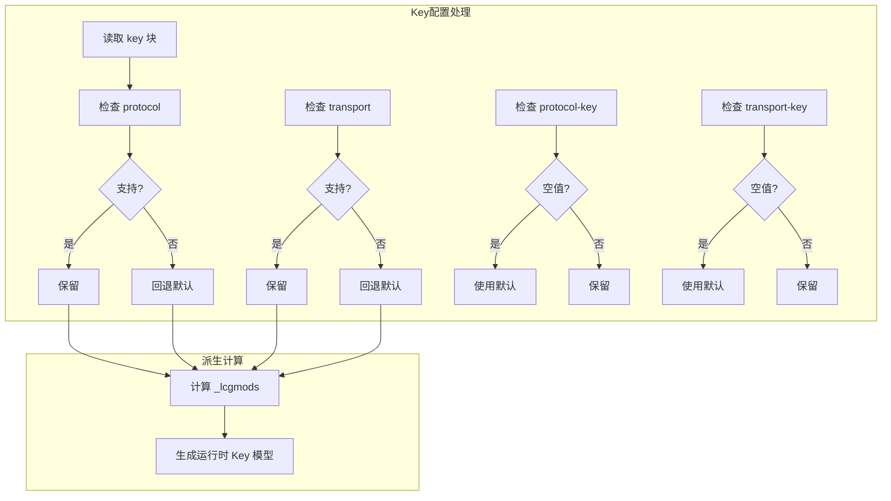

## `tcp` 配置块

`tcp` 定义原生 TCP carrier 的 listener、connect 与 stream 行为。

### 参数表

| 字段 | 类型 | 默认值 | 规范化行为 | 适用角色 | 说明 | 跨平台性 |
|---|---|---|---|---|---|---|
| `tcp.inactive.timeout` | `int` | `PPP_TCP_INACTIVE_TIMEOUT` | `<1` 回默认 | client/server | TCP 连接空闲超时 | 跨平台 |
| `tcp.connect.timeout` | `int` | `PPP_TCP_CONNECT_TIMEOUT` | `<1` 回默认 | client/server | 建链超时 | 跨平台 |
| `tcp.connect.nexcept` | `int` | `PPP_TCP_CONNECT_NEXCEPT` | `<0` 回默认 | client/server | 建链抖动扩展 | 跨平台 |
| `tcp.listen.port` | `int` | `MinPort` | 非法端口归零 | server | TCP listener 端口 | 跨平台 |
| `tcp.cwnd` | `int` | `0` | 原样保留 | client/server | 发送窗口提示 | 跨平台 |
| `tcp.rwnd` | `int` | `0` | 原样保留 | client/server | 接收窗口提示 | 跨平台 |
| `tcp.turbo` | `bool` | `false` | 原样保留 | client/server | TCP Turbo 行为 | 跨平台 |
| `tcp.backlog` | `int` | `PPP_LISTEN_BACKLOG` | `<1` 回默认 | server | backlog | 跨平台 |
| `tcp.fast-open` | `bool` | `false` | 原样保留 | client/server | TFO 行为 | 跨平台 |

### 详细字段说明

#### `tcp.inactive.timeout` - TCP 空闲超时

- **作用**：TCP 连接空闲多长时间后断开
- **默认值**：`PPP_TCP_INACTIVE_TIMEOUT`（通常 300 秒）
- **规范化**：`<1` 时回退到默认值

#### `tcp.connect.timeout` - TCP 连接超时

- **作用**：建立 TCP 连接的超时时间
- **默认值**：`PPP_TCP_CONNECT_TIMEOUT`（通常 30 秒）
- **规范化**：`<1` 时回退到默认值

#### `tcp.connect.nexcept` - TCP 连接抖动扩展

- **作用**：连接重试时的抖动范围扩展
- **默认值**：`PPP_TCP_CONNECT_NEXCEPT`（通常 5）
- **规范化**：`<0` 时回退到默认值

此参数影响连接失败后的重试延迟计算。

#### `tcp.listen.port` - TCP 监听端口

- **作用**：server TCP listener 监听的端口
- **默认值**：`MinPort`（即 1）
- **规范化**：非法端口归零（等于禁用）

**重要**：当端口被归零时，等效于**关闭 TCP listener**。

#### `tcp.cwnd` / `tcp.rwnd` - 窗口提示

- `tcp.cwnd` - 发送窗口提示
- `tcp.rwnd` - 接收窗口提示

这两个参数是**提示值**，用于控制 TCP 窗口：

- `0` 表示使用系统默认值
- 非零值表示建议的窗口���小

#### `tcp.turbo` - TCP Turbo 模式

- **作用**：启用 TCP Turbo 优化
- **默认值**：`false`

Turbo 模式包括：

- 增大初始窗口
- 减少确认延迟
- 启用 early retransmit

#### `tcp.backlog` - 连接队列长度

- **作用**：server listen 的待 accept 队列长度
- **默认值**：`PPP_LISTEN_BACKLOG`（通常 511）
- **规范化**：`<1` 时回退到默认值

#### `tcp.fast-open` - TCP Fast Open

- **作用**：启用 TCP Fast Open (TFO)
- **默认值**：`false`
- **平台差异**：
  - Windows 10+ 支持
  - Linux 3.7+ 支持
  - macOS 10.11+ 支持

### 使用建议

- 对于初次部署，尽量不要过早手改 `cwnd`、`rwnd`
- 若监听端口非法，系统会直接将其置零，等效于关闭 listener
- `tcp.turbo` 与 `fast-open` 都属于性能/特性选项，应在基础可达性确认后再调

### TCP 配置流程图

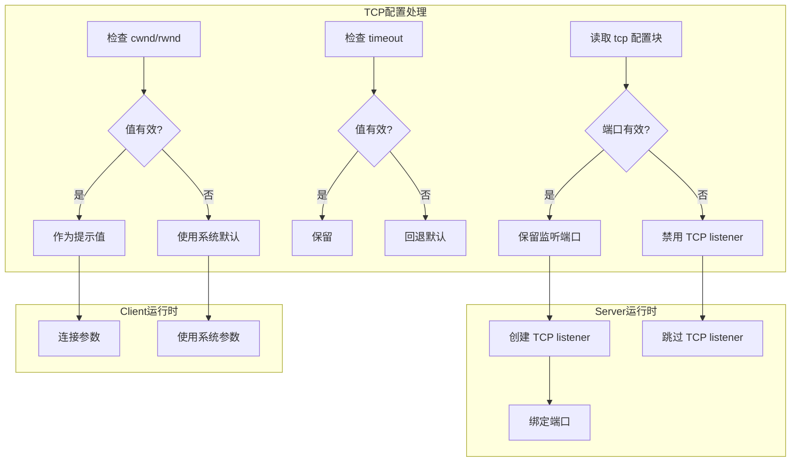

## `udp` 配置块

`udp` 并不只是“开 UDP 监听”。它同时控制：

- 普通 UDP 数据面
- DNS helper 行为
- static packet path

### 顶层字段表

| 字段 | 类型 | 默认值 | 规范化行为 | 适用角色 | 说明 | 跨平台性 |
|---|---|---|---|---|---|---|
| `udp.cwnd` | `int` | `0` | 原样 | client/server | UDP 发送窗口提示 | 跨平台 |
| `udp.rwnd` | `int` | `0` | 原样 | client/server | UDP 接收窗口提示 | 跨平台 |
| `udp.inactive.timeout` | `int` | `PPP_UDP_INACTIVE_TIMEOUT` | `<1` 回默认 | client/server | UDP 空闲超时 | 跨平台 |
| `udp.listen.port` | `int` | `MinPort` | 非法端口归零 | server | UDP listener | 跨平台 |

### `udp.dns` 子块

| 字段 | 类型 | 默认值 | 规范化行为 | 适用角色 | 说明 | 跨平台性 |
|---|---|---|---|---|---|---|
| `udp.dns.timeout` | `int` | `PPP_DEFAULT_DNS_TIMEOUT` | `<1` 回默认 | client/server | DNS 查询超时 | 跨平台 |
| `udp.dns.ttl` | `int` | `PPP_DEFAULT_DNS_TTL` | `<0` 回 `0` 以上 | client/server | DNS TTL | 跨平台 |
| `udp.dns.cache` | `bool` | `true` | 原样 | client/server | DNS cache 开关 | 跨平台 |
| `udp.dns.turbo` | `bool` | `false` | 原样 | client/server | DNS Turbo 行为 | 跨平台 |
| `udp.dns.redirect` | `string` | `""` | 非法 endpoint/domain 清空 | server | DNS redirect 目标 | 跨平台 |

### `udp.static` 子块

| 字段 | 类型 | 默认值 | 规范化行为 | 适用角色 | 说明 | 跨平台性 |
|---|---|---|---|---|---|
| `udp.static.keep-alived[0]` | `int` | `PPP_UDP_KEEP_ALIVED_MIN_TIMEOUT` | `<0` 回正 | client | 最小保活间隔 | 跨平台 |
| `udp.static.keep-alived[1]` | `int` | `PPP_UDP_KEEP_ALIVED_MAX_TIMEOUT` | `<0` 回正 | client | 最大保活间隔 | 跨平台 |
| `udp.static.dns` | `bool` | `true` | 原样 | client | static path 是否允许 DNS | 跨平台 |
| `udp.static.quic` | `bool` | `true` | 原样 | client | static path 是否允许 QUIC | 跨平台 |
| `udp.static.icmp` | `bool` | `true` | 原样 | client | static path 是否允许 ICMP | 跨平台 |
| `udp.static.aggligator` | `int` | `0` | `<0` 回 `0` | client | 聚合器连接数 | 跨平台 |
| `udp.static.servers` | `set<string>` | 空 | 原样 + 解析期清洗 | client | static upstream server 列表 | 跨平台 |

### 详细字段说明

#### UDP 监听端口

- **字段**：`udp.listen.port`
- **规范化**：非法端口归零（禁用）

当端口被归零时，等效于**关闭 UDP listener**。

#### DNS Helper

`udp.dns` 子块控制 **DNS 辅助行为**：

| 参数 | 说明 | 使用场景 |
|---|---|---|
| `timeout` | DNS 查询超时 | client DNS 解析 |
| `ttl` | DNS 缓存 TTL | client DNS 缓存 |
| `cache` | DNS 缓存开关 | client 本地缓存 |
| `turbo` | DNS Turbo | 快速解析 |
| `redirect` | DNS 重定向 | server 端 DNS 欺骗 |

#### Static Packet Path

`udp.static` 控制 **static packet 路径**：

| 参数 | 说明 | 影响 |
|---|---|---|
| `keep-alived` | 保活间隔 | static 连接保活 |
| `dns` | DNS over static | 允许 DNS 代理 |
| `quic` | QUIC 通道 | 允许 QUIC 代理 |
| `icmp` | ICMP 通道 | 允许 ICMP 代理 |
| `aggligator` | 聚合连接数 | 聚合多个 static 连接 |
| `servers` | upstream 列表 | static 代理目标 |

### 重要说明

- `udp.static` 的默认值已经足够积极，不要因为"它默认打开了一些子项"就误以为 static path 必然被启用。真正启用还取决于 client 本地 static mode 以及 server 侧对应路径。
- `udp.dns.redirect` 非法时会直接失效，不会保留成脏字符串。

### UDP 配置流程图

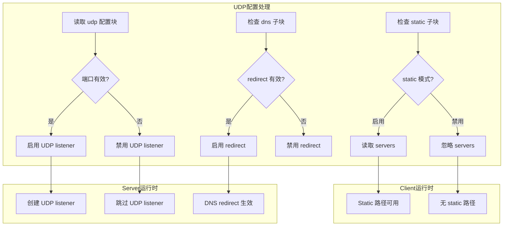

## `mux` 配置块

`mux` 定义的是附加子链路平面的行为，而不是主会话本身。

### 参数表

| 字段 | 类型 | 默认值 | 规范化行为 | 适用角色 | 说明 | 跨平台性 |
|---|---|---|---|---|---|---|
| `mux.connect.timeout` | `int` | `PPP_MUX_CONNECT_TIMEOUT` | `<1` 回默认 | client/server | mux 连接建立超时 | 跨平台 |
| `mux.inactive.timeout` | `int` | `PPP_MUX_INACTIVE_TIMEOUT` | `<1` 回默认 | client/server | mux 空闲超时 | 跨平台 |
| `mux.congestions` | `int` | `PPP_MUX_DEFAULT_CONGESTIONS` | `<0` 或低于最小值回默认 | client/server | 最大拥塞窗口 | 跨平台 |
| `mux.keep-alived[0]` | `int` | `PPP_TCP_CONNECT_TIMEOUT` | `<0` 回正 | client/server | mux 最小保活 | 跨平台 |
| `mux.keep-alived[1]` | `int` | `PPP_MUX_CONNECT_TIMEOUT` | `<0` 回正 | client/server | mux 最大保活 | 跨平台 |

### 详细字段说明

#### MUX 的本质

MUX (Multiplexing) 是 **附加子链路平面**，它：

- 不替代主会话
- 提供额外的连接复用能力
- 通过独立的 channel 实现多路复用

#### 参数详解

| 参数 | 说明 | 建议值 |
|---|---|---|
| `connect.timeout` | MUX 建立超时 | 30 秒 |
| `inactive.timeout` | MUX 空闲超时 | 300 秒 |
| `congestions` | 拥塞窗口 | 参考 `concurrent` |
| `keep-alived` | 保活间隔 | [30, 300] 秒 |

### 使用建议

- MUX 不是主会话替代，而是附加平面
- 不建议在基础会话未稳定时就大幅调 MUX 参数
- `congestions` 的实际值会受 `concurrent` 上限约束

### MUX 配置流程图

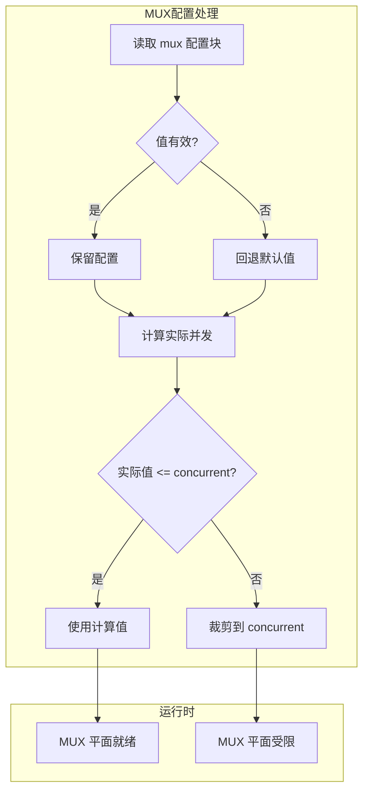

## `websocket` 配置块

`websocket` 块用于定义 WS/WSS carrier 入口。它实际上是一个“HTTP-facing edge personality”子系统。

### 顶层字段表

| 字段 | 类型 | 默认值 | 规范化行为 | 适用角色 | 说明 | 跨平台性 |
|---|---|---|---|---|---|
| `websocket.host` | `string` | 空 | 非法 domain 则关闭 WS/WSS 并清空 | server | WebSocket Host | 跨平台 |
| `websocket.path` | `string` | 空 | 若为空或不以 `/` 开头则关闭 WS/WSS | server | WebSocket Path | 跨平台 |
| `websocket.listen.ws` | `int` | `MinPort` | 非法端口归零 | server | WS 监听端口 | 跨平台 |
| `websocket.listen.wss` | `int` | `MinPort` | 非法端口归零 | server | WSS 监听端口 | 跨平台 |

### `websocket.ssl` 子块

| 字段 | 类型 | 默认值 | 规范化行为 | 说明 | 跨平台性 |
|---|---|---|---|---|
| `certificate-file` | `string` | 空 | 若 WSS 无效则清空 | 跨平台 |
| `certificate-key-file` | `string` | 空 | 若 WSS 无效则清空 | 跨平台 |
| `certificate-chain-file` | `string` | 空 | 若 WSS 无效则清空 | 跨平台 |
| `certificate-key-password` | `string` | 空 | 若 WSS 无效则清空 | 跨平台 |
| `ciphersuites` | `string` | `GetDefaultCipherSuites()` | 空值回默认 | 跨平台 |
| `verify-peer` | `bool` | `true` | 原样 | 跨平台 |

### `websocket.http` 子块

| 字段 | 类型 | 默认值 | 规范化行为 | 说明 | 跨平台性 |
|---|---|---|---|---|---|
| `http.error` | `string` | 空 | 若 WS 关闭则清空 | 跨平台 |
| `http.request` | `map<string,string>` | 空 | 若 WS 关闭则清空 | 跨平台 |
| `http.response` | `map<string,string>` | 空 | 若 WS 关闭则清空 | 跨平台 |

### 详细字段说明

#### WebSocket 监听配置

| 参数 | 说明 | 规范化 |
|---|---|---|
| `host` | WebSocket 主机名 | 非法域名 → 关闭 WS/WSS |
| `path` | WebSocket 路径 | 空/不以 `/` 开头 → 关闭 |
| `listen.ws` | WS 端口 | 非法端口 → 禁用 |
| `listen.wss` | WSS 端口 | 非法端口 → 禁用 |

#### SSL/TLS 配置

| 参数 | 说明 | 必需性 |
|---|---|---|
| `certificate-file` | 证书文件 | WSS 必需 |
| `certificate-key-file` | 私钥文件 | WSS 必需 |
| `certificate-chain-file` | 证书链 | 可选 |
| `certificate-key-password` | 私钥口令 | 加密私钥时必需 |
| `ciphersuites` | TLS 套件 | 可选 |
| `verify-peer` | 对端校验 | 可选，默认开启 |

#### HTTP 头修饰

| 参数 | 说明 | 用途 |
|---|---|---|
| `http.error` | 错误响应体 | 自定义 HTTP 错误页面 |
| `http.request` | 请求头修饰 | 修改上行请求头 |
| `http.response` | 响应头修饰 | 修改下行响应头 |

### admission control 规则

`Loaded()` 中会做这些动作：

1. 检查 `host` 是否是 domain
2. 检查 `path` 是否存在且以 `/` 开头
3. 若失败，直接关闭 WS/WSS
4. 若 WSS 证书校验失败，只关闭 WSS
5. 若 WSS 关闭，清空证书相关字段
6. 若 WS 关闭，清空 `host/path/http.*`

这意味着：WebSocket 配置不是“写了就用”，而是要先通过一轮结构合法性检查。

### WebSocket 配置流程图

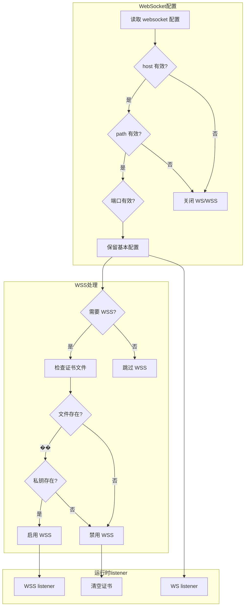

## `vmem` 配置块

`vmem` 用于控制 `BufferswapAllocator` 相关行为。

### 参数表

| 字段 | 类型 | 默认值 | 规范化行为 | 平台差异 | 说明 |
|---|---|---|---|---|---|
| `vmem.size` | `int64` | `0` 或由 JSON 覆盖 | `<1` 则整体禁用 | 全平台 | vmem 大小 |
| `vmem.path` | `string` | 空 | 空值则整体禁用 | Windows/非 Windows 行为不同 | 存储路径 |

### 详细字段说明

#### `vmem.size`

- **作用**：虚拟内存大小
- **类型**：int64
- **默认值**：`0`（禁用）
- **规范化**：`<1` 则禁用 vmem

#### `vmem.path`

- **作用**：虚拟内存文件路径
- **类型**：string
- **默认值**：空

### 平台差异

| 平台 | `size` 要求 | `path` 要求 | 说明 |
|---|---|---|---|
| Windows | `> 0` | 可选 | 仅 `size > 0` 即可创建 |
| Linux | `> 0` | 必须 | `size` 和 `path` 都必需 |
| macOS | `> 0` | 必须 | `size` 和 `path` 都必需 |
| Android | `> 0` | 必须 | `size` 和 `path` 都必需 |

### 实际创建行为

在 `main.cpp::LoadConfiguration(...)` 中：

- Windows 上，若 `size > 0`，会尝试创建 allocator
- 非 Windows 上，要求 `path` 与 `size` 都有效

### 使用建议

- 如果不了解 allocator 行为，先不启用 `vmem`
- 启用时应明确磁盘路径、容量与平台行为

### vmem 配置流程图

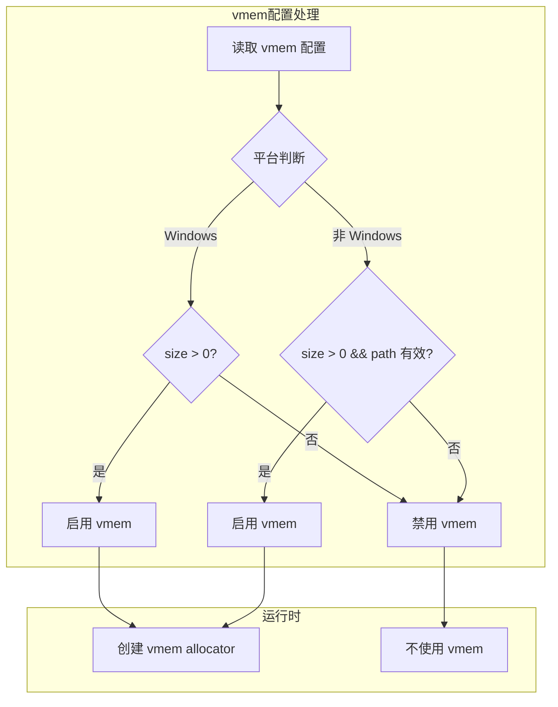

## `server` 配置块

`server` 块定义服务端节点身份与服务能力。

### 顶层字段表

| 字段 | 类型 | 默认值 | 规范化行为 | 说明 | 跨平台性 |
|---|---|---|---|---|---|
| `server.log` | `string` | 空 | rewrite/fullpath | 日志路径 | 跨平台 |
| `server.node` | `int` | `0` | `<0` 回正为 `0` | 节点编号 | 跨平台 |
| `server.subnet` | `bool` | `true` | 原样 | 是否启用 subnet forwarding | 跨平台 |
| `server.mapping` | `bool` | `true` | 原样 | 是否允许 mapping | 跨平台 |
| `server.backend` | `string` | 空 | trim | managed backend URL | 跨平台 |
| `server.backend-key` | `string` | 空 | trim | backend 认证 key | 跨平台 |

### `server.ipv6` 子块

| 字段 | 类型 | 默认值 | 规范化行为 | 说明 | 跨平台性 |
|---|---|---|---|---|---|
| `mode` | `string/enum` | `None` | 通过 `NormalizeIPv6Mode(...)` 规范化 | IPv6 模式 | 平台相关 |
| `cidr` | `string` | 空 | 解析 CIDR | 前缀输入 | 跨平台 |
| `prefix-length` | `int` | `128` | 限制到 `0..128`，不合法时禁用服务 | 前缀长度 | 跨平台 |
| `gateway` | `string` | 空 | 必须位于 prefix 中，否则清空或派生 | 网关 | 跨平台 |
| `dns1` | `string` | 空 | trim + 地址校验 | IPv6 DNS1 | 跨平台 |
| `dns2` | `string` | 空 | trim + 地址校验 | IPv6 DNS2 | 跨平台 |
| `lease-time` | `int` | `300` | `<0` 回正 | lease 时间 | 跨平台 |
| `static-addresses` | `map<string,string>` | 空 | 校验 GUID、地址、前缀匹配、去重 | 静态绑定 | 跨平台 |

### 详细字段说明

#### Server 顶层参数

| 参数 | 说明 | 使用场景 |
|---|---|---|
| `log` | 日志文件路径 | 部署运维 |
| `node` | 节点编号 | 多节点部署 |
| `subnet` | subnet 转发 | 默认启用 |
| `mapping` | mapping 映射 | 默认启用 |
| `backend` | 外部管理后端 | 运维集成 |
| `backend-key` | 后端认证 | 运维集成 |

#### IPv6 模式枚举

| 值 | 含义 | 当前代码支持情况 | 说明 |
|---|---|---|---|
| `""` 或空 | None | 支持 | 不启用服务端 IPv6 |
| `nat66` | NAT66 | 支持 | 缺省 prefix 时可自动给 ULA `/64` |
| `gua` | Global Unicast Assignment | 支持 | 要求前缀是真正的 GUA |

#### IPv6 详细配置

配置 IPv6 服务时，需要理解以下概念：

1. **NAT66** - IPv6-to-IPv6 Network Address Translation
2. **GUA** - Global Unicast Assignment，公共 IPv6 地址分配
3. **ULA** - Unique Local Address，唯一本地地址（如 `fd42::/8`）

### 服务端 IPv6 的关键规范化规则

| 规则编号 | 行为 | 结果 |
|---|---|---|
| 1 | 当前平台不支持 server IPv6 data plane | 整个 IPv6 服务被禁用 |
| 2 | `nat66` 未提供 prefix | 自动使用 `fd42:4242:4242::/64` |
| 3 | `gua` 但 prefix 不是 global-unicast | 整个 IPv6 服务被禁用 |
| 4 | `prefix-length <= 0` 或 `>= 128` | 整个 IPv6 服务被禁用 |
| 5 | gateway 不在 prefix 中 | gateway 被清空或重新派生 |
| 6 | static address 不在 prefix 中或与 gateway 冲突 | 该静态项被忽略 |

### Server 配置流程图

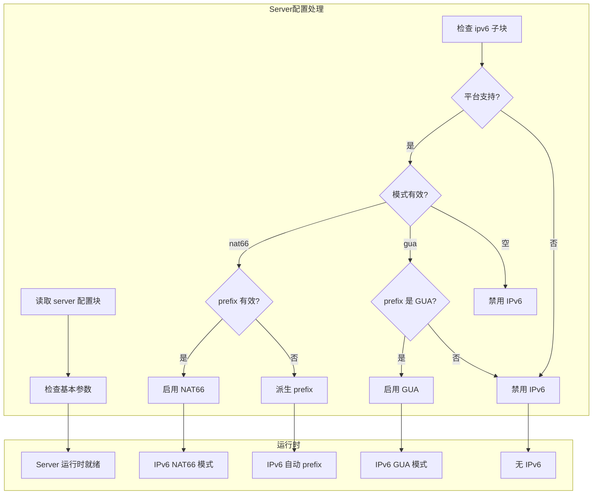

## `client` 配置块

`client` 块是一个复合型客户端环境模型，不只是远端地址。

### 顶层字段表

| 字段 | 类型 | 默认值 | 规范化行为 | 说明 | 跨平台性 |
|---|---|---|---|---|---|
| `client.guid` | `string` | all-ones sentinel GUID | 空值回哨兵 | 客户端身份 | 跨平台 |
| `client.server` | `string` | 空 | trim | 远端 server 地址 | 跨平台 |
| `client.server-proxy` | `string` | 空 | trim | server 上游代理 | 跨平台 |
| `client.bandwidth` | `int64` | `0` | 原样 | 带宽限制提示 | 跨平台 |
| `client.reconnections.timeout` | `int` | `PPP_TCP_CONNECT_TIMEOUT` | `<1` 回默认 | 重连间隔 | 跨平台 |

### `client.http-proxy`

| 字段 | 类型 | 默认值 | 规范化行为 | 说明 | 跨平台性 |
|---|---|---|---|---|---|---|
| `bind` | `string` | 空 | 非法地址清空 | 绑定地址 | 跨平台 |
| `port` | `int` | `PPP_DEFAULT_HTTP_PROXY_PORT` | 非法端口归零 | HTTP proxy 端口 | 跨平台 |

### `client.socks-proxy`

| 字段 | 类型 | 默认值 | 规范化行为 | 说明 | 跨平台性 |
|---|---|---|---|---|---|---|
| `bind` | `string` | 空 | 非法地址清空 | 绑定地址 | 跨平台 |
| `port` | `int` | `PPP_DEFAULT_SOCKS_PROXY_PORT` | 非法端口归零 | SOCKS 端口 | 跨平台 |
| `username` | `string` | 空 | trim | SOCKS 用户名 | 跨平台 |
| `password` | `string` | 空 | trim | SOCKS 密码 | 跨平台 |

### Windows 专用 `paper-airplane`

| 字段 | 类型 | 默认值 | 平台 | 说明 | 跨平台性 |
|---|---|---|---|---|---|
| `client.paper-airplane.tcp` | `bool` | `true` | Windows | PaperAirplane TCP 行为 | 仅 Windows |

### `client.mappings`

| 字段 | 类型 | 必要性 | 规范化行为 | 说明 | 跨平台性 |
|---|---|---|---|---|---|
| `local-ip` | `string` | 必须 | 非法则整项忽略 | 本地服务地址 | 跨平台 |
| `local-port` | `int` | 必须 | 非法则整项忽略 | 本地服务端口 | 跨平台 |
| `protocol` | `string` | 必须 | 非 `udp` 时按 TCP 处理 | 协议 | 跨平台 |
| `remote-ip` | `string` | 必须 | 非法则整项忽略 | 远端可见地址 | 跨平台 |
| `remote-port` | `int` | 必须 | 非法则整项忽略 | 远端端口 | 跨平台 |

### `client.routes`

| 字段 | 类型 | 平台差异 | 说明 | 跨平台性 |
|---|---|---|---|---|
| `name` | `string` | 通用 | 路由规则名 | 跨平台 |
| `nic` | `string` | Linux 更关键 | 指定接口 | 跨平台 |
| `ngw` | `string` | 通用 | 指定网关 | 跨平台 |
| `path` | `string` | 通用 | 本地 route file | 跨平台 |
| `vbgp` | `string` | 通用 | 在线 route source | 跨平台 |

### 详细字段说明

#### Client 核心参数

| 参数 | 说明 | 默认值 |
|---|---|---|
| `guid` | 客户端标识 | 全 1 哨兵 |
| `server` | 远端 server URL | 空 |
| `server-proxy` | 上游代理 | 空 |
| `bandwidth` | 带宽限制 | 0（无限制） |
| `reconnections.timeout` | 重连间隔 | 30 秒 |

#### 本地代理服务

| 服务 | 默认端口 | 说明 |
|---|---|---|
| HTTP Proxy | `PPP_DEFAULT_HTTP_PROXY_PORT` | HTTP 代理 |
| SOCKS Proxy | `PPP_DEFAULT_SOCKS_PROXY_PORT` | SOCKS 代理 |

#### Mappings

Mapping 是 **端口映射** 配置，用于：

- 本地端口转发到远端
- 支持 TCP/UDP 协议

配置示例：

```json
{
  "client": {
    "mappings": [
      {
        "local-ip": "127.0.0.1",
        "local-port": 1080,
        "protocol": "tcp",
        "remote-ip": "10.0.0.1",
        "remote-port": 1080
      }
    ]
  }
}
```

#### Routes

Route 是 **路由规则** 配置：

| 参数 | 说明 | 用途 |
|---|---|---|
| `name` | 路由名称 | 规则标识 |
| `nic` | 网络接口 | 指定出口网卡 |
| `ngw` | 下一跳网关 | 指定网关 |
| `path` | 本地路由文件 | 文件路径 |
| `vbgp` | 在线路由源 | BGP 源 |

### `LoadAllMappings(...)` 的配置 admission 逻辑

对于每个 mapping，加载器会检查：

- 协议是否合法
- local/remote port 是否落在合法范围
- local/remote IP 是否可解析
- 地址是否非 multicast
- 地址是否有效

并且会以 endpoint 为键做去重。也就是说：**mapping 不是写进去就用，而是会先通过结构化 admission。**

### Client 配置流程图

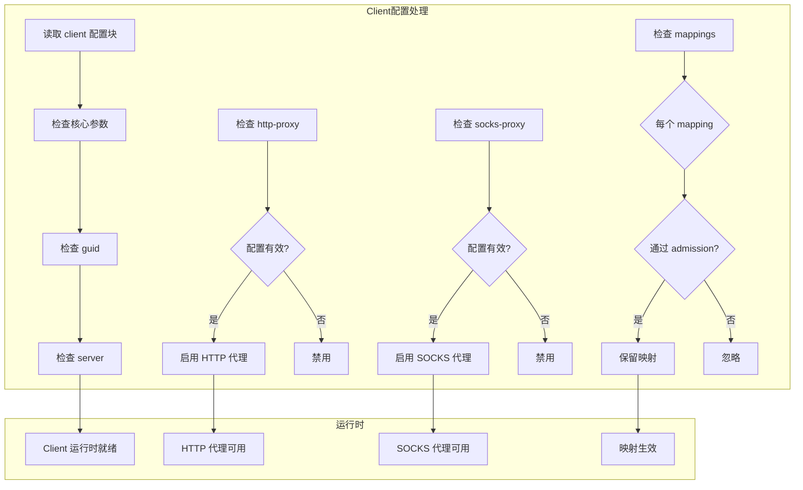

## 字符串裁剪与规范化

加载流程中对字符串做了大量 `LTrim/RTrim`。这部分虽然不显眼，但非常关键。

### 典型会被裁剪的字段

| 类别 | 字段示例 |
|---|---|
| 地址提示 | `ip.public`、`ip.interface` |
| backend | `server.backend`、`server.backend-key` |
| IPv6 | `server.ipv6.cidr`、`gateway`、`dns1`、`dns2` |
| client 身份与连接 | `client.guid`、`client.server`、`client.server-proxy` |
| proxy | `client.http-proxy.bind`、`client.socks-proxy.*` |
| WebSocket | `host`、`path`、证书路径、cipher suites |
| key | `protocol`、`protocol-key`、`transport`、`transport-key` |

### 这对运维的意义

这使得：

- 输入的前后空白不会悄悄影响行为
- 很多因为���制���贴带来的隐性格式问题会被提前吸收

## 端口规范化总表

下列端口最终都会被统一检查，非法时归零：

| 字段 | 角色/平面 |
|---|---|
| `tcp.listen.port` | 原生 TCP listener |
| `websocket.listen.ws` | WS listener |
| `websocket.listen.wss` | WSS listener |
| `client.http-proxy.port` | client 本地 HTTP proxy |
| `client.socks-proxy.port` | client 本地 SOCKS proxy |
| `udp.listen.port` | UDP listener |
| `cdn[0]`、`cdn[1]` | CDN 入口辅助端口 |

这意味着一个错误端口不会保留在运行模型里"碰碰运气"，而会直接导致对应 listener/service 被关闭。

## 配置修复 与 配置禁用，是两类不同策略

这是阅读 `Loaded()` 时最值得掌握的思维方式之一。

### 策略一：修复并回退到默认值

适用场景：值虽然不合理，但仍可以安全地回退到基线。

典型例子：

- `concurrent < 1` → 回正到 CPU 核数
- TCP backlog 太小 → 回退到默认值
- timeout 非法 → 回退到默认值
- cipher 名字不支持 → 回退到默认算法
- key 字符串为空 → 回退到默认密钥

### 策略二：直接禁用功能

适用场景：配置本身不成立，再猜测下去比直接关闭风险更大。

典型例子：

- WebSocket host/path 非法 → 关闭 WS/WSS
- WSS 证书校验失败 → 关闭 WSS
- 当前平台不支持 server IPv6 data plane → 禁用 IPv6 服务
- listener 端口非法 → 归零关闭

这两对排障非常重要，因为有些坏输入会被自动修复，而有些坏输入则会让功能直接消失。

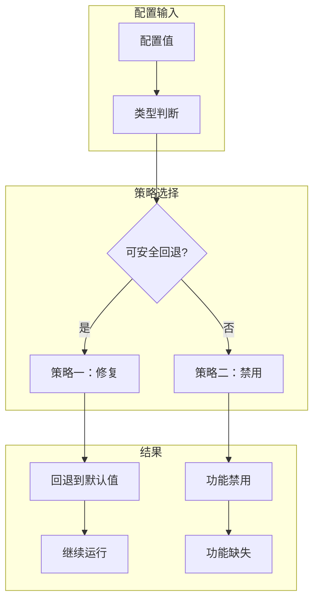

## 平台差异说明

### Windows

Windows 下配置模型有一个显式额外字段：

- `client.paper-airplane.tcp`

它在 `Clear()` 中默认就是 `true`。

这说明配置模型并不是对所有平台完全扁平一致，而是允许平台拥有自己的长期行为字段。

### Linux

Linux 上虽然很多本地网络整形是由 CLI 完成，而不是 `AppConfiguration` 直接持有，但 server IPv6 data plane 支持本身会影响配置 admission 逻辑。也就是说：**同一份 JSON，在 Linux 和非 Linux 上可能得到不同的最终有效模型。**

### 非 Linux 平台的 server IPv6

当前 `SupportsServerIPv6DataPlane()` 直接表明：

- Linux 返回 `true`
- 其他平台返回 `false`

这意味着对于 server IPv6 来说，平台差异不是"性能不同"，而是"是否被允许进入最终运行模型"。

### 平台差异总览表

| 参数/功能 | Windows | Linux | macOS | Android | 说明 |
|---|---|---|---|---|---|
| `client.paper-airplane.tcp` | ✔ | ✘ | ✘ | ✘ | Windows 专有 |
| Server IPv6 | ✘ | ✔ | ✘ | ✘ | 仅 Linux 支持 |
| vmem (仅 size) | ✔ | ✘ | ✘ | ✘ | Windows 可用 path 可选 |
| vmem (需 path) | ✘ | ✔ | ✔ | ✔ | 非 Windows 必需 |

### 跨平台 vs 平台差异参数

**跨平台参数**（所有平台行为一致）：

- 所有 key 加密参数
- TCP/UDP 基本参数
- MUX 参数
- WebSocket 参数
- 绝大多数 server 参数
- 绝大多数 client 参数

**平台差异参数**（不同平台有不同行为）：

- `client.paper-airplane.tcp`（仅 Windows）
- `vmem` 创建方式（见上表）
- Server IPv6 支持（仅 Linux）

## 推荐配置实践

### 实践一：按角色拆配置

不要长期混用 client/server 一个总文件，再靠 CLI 去决定一切。

推荐：

```bash
# server.json
# client.json  
# backend.json
```

### 实践二：把路由和 DNS 文件也看成配置资产

例如：

- `ip.txt`
- `dns-rules.txt`
- route list 文件
- `virr` 输入源

它们不应该是手工散落文件，而应纳入版本管理。

### 实践三：优先保证基础配置闭环，再调高级参数

建议的顺序：

1. 先确定 carrier 和基础 listener
2. 再确定 route 和 DNS
3. 再决定 proxy、mapping
4. 最后再决定 static、MUX、IPv6、backend

## 配置错误时最常见的三种结果

### 结果一：自动回默认值

例如 timeout、backlog、cipher 名称等。

### 结果二：整项被清空

例如非法地址、非法 DNS redirect、无效 WebSocket 证书等。

### 结果三：功能被整体禁用

例如：

- WS/WSS 整体关闭
- WSS 关闭
- IPv6 服务整体关闭

## 最小示例骨架

### 最小 server 配置骨架

```json
{
  "tcp": {
    "listen": { "port": 20000 }
  },
  "server": {
    "subnet": true,
    "mapping": true,
    "backend": "",
    "backend-key": ""
  }
}
```

### 最小 client 配置骨架

```json
{
  "client": {
    "guid": "{F4569208-BB45-4DEB-B115-0FEA1D91B85B}",
    "server": "ppp://127.0.0.1:20000/",
    "server-proxy": "",
    "bandwidth": 0,
    "reconnections": { "timeout": 5 }
  }
}
```

### 带 WebSocket 的 server 骨架

```json
{
  "websocket": {
    "host": "vpn.example.com",
    "path": "/tun",
    "listen": {
      "ws": 20080,
      "wss": 20443
    },
    "ssl": {
      "certificate-file": "server.pem",
      "certificate-key-file": "server.key",
      "certificate-chain-file": "chain.pem",
      "certificate-key-password": "secret"
    }
  }
}
```

### 带 IPv6 的 server 骨架

```json
{
  "server": {
    "ipv6": {
      "mode": "nat66",
      "cidr": "fd42:4242:4242::/64",
      "prefix-length": 64,
      "gateway": "fd42:4242:4242::1",
      "dns1": "fd42:4242:4242::2",
      "dns2": "fd42:4242:4242::3",
      "lease-time": 3600
    }
  }
}
```

### 带完整代理的 client 骨架

```json
{
  "client": {
    "server": "ppp://server.example.com:20000/",
    "http-proxy": {
      "bind": "127.0.0.1",
      "port": 8080
    },
    "socks-proxy": {
      "bind": "127.0.0.1",
      "port": 1080,
      "username": "user",
      "password": "pass"
    },
    "mappings": [
      {
        "local-ip": "127.0.0.1",
        "local-port": 3000,
        "protocol": "tcp",
        "remote-ip": "10.0.0.1",
        "remote-port": 80
      }
    ]
  }
}
```

## 相关文档

- [`CLI_REFERENCE_CN.md`](CLI_REFERENCE_CN.md)
- [`USER_MANUAL_CN.md`](USER_MANUAL_CN.md)
- [`TRANSMISSION_CN.md`](TRANSMISSION_CN.md)
- [`SECURITY_CN.md`](SECURITY_CN.md)
- [`CLIENT_ARCHITECTURE_CN.md`](CLIENT_ARCHITECTURE_CN.md)
- [`SERVER_ARCHITECTURE_CN.md`](SERVER_ARCHITECTURE_CN.md)
- [`DEPLOYMENT_CN.md`](DEPLOYMENT_CN.md)