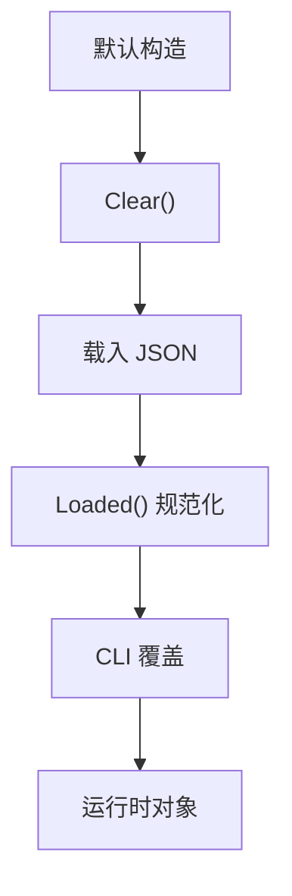
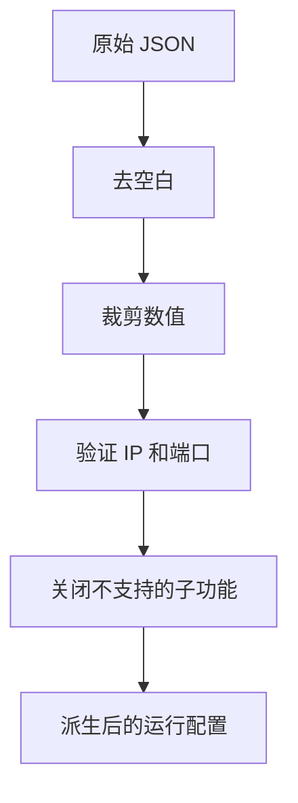
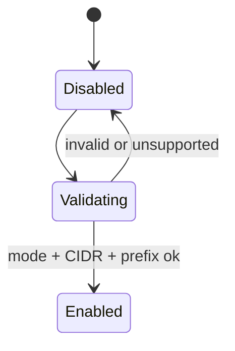
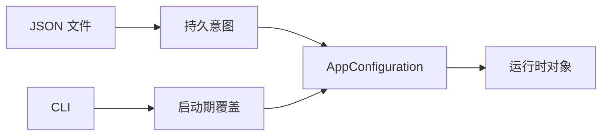

# 配置模型

[English Version](CONFIGURATION.md)

## 定位

本文是 `AppConfiguration` 以及启动期整形逻辑的总说明。OPENPPP2 不把配置当成普通 JSON。它按四步处理：

1. `Clear()` 建立安全默认值。
2. `Load(...)` 合并 JSON。
3. `Loaded()` 修正、裁剪、清理、派生运行值。
4. `main.cpp` 用 CLI 做本次启动的本机覆盖。

锚点：

- `ppp/configurations/AppConfiguration.h`
- `ppp/configurations/AppConfiguration.cpp`
- `main.cpp::LoadConfiguration(...)`
- `main.cpp::GetNetworkInterface(...)`
- `main.cpp::PreparedArgumentEnvironment(...)`

## 为什么这一层重要

OPENPPP2 里的配置不是简单的数值袋。它是一个 policy 对象，决定：

- 哪些传输承载存在
- 哪些运行时分支被启用
- 哪些平台副作用会发生
- 哪些值被视为安全、可以保留
- 哪些值必须被规范化或丢弃

因此配置是整个仓库的控制面。

## 分阶段接收流程

## 配置结构

`AppConfiguration` 主要由这些块组成：

- `concurrent`
- `cdn`
- `ip`
- `udp`
- `tcp`
- `mux`
- `websocket`
- `key`
- `vmem`
- `server`
- `client`
- `virr`
- `vbgp`

每个块都对应某一块代码区域或运行时关注点，这不是随意拼起来的。

## `Clear()` 的默认值

`Clear()` 里的关键默认值包括：

- `concurrent = Thread::GetProcessorCount()`。
- `cdn[*] = IPEndPoint::MinPort`。
- UDP DNS timeout、TTL、cache、redirect 的默认值。
- TCP 和 MUX timeout 默认值。
- WebSocket 监听默认关闭。
- key 字段默认值，如 `kf`、`kh`、`kl`、`kx`、`sb`。
- `server.subnet = true`。
- `server.mapping = true`。
- server IPv6 默认关闭。
- client GUID 哨兵值。
- client 带宽默认 `0`。
- Windows 上 `paper_airplane.tcp = true`。
- `virr.update-interval = 86400`。
- `virr.retry-interval = 300`。
- `vbgp.update-interval = 3600`。

这些默认值描述的是仓库的安全启动姿态。

## 主要块的含义

### `concurrent`

进程级并发提示，影响运行时对 CPU 资源的使用预期。

### `cdn`

某些服务通道的监听相关默认值。

### `ip`

保存启动器使用的 public 和 interface IP 字符串。

### `udp`

包含 UDP timeout 策略、DNS 策略、监听端口和静态 UDP 策略。

### `tcp`

包含 TCP timeout、connect 策略、监听端口、backlog 和 fast open 设置。

### `mux`

控制多路复用的 timeout 和 keepalive 行为。

### `websocket`

组织 WebSocket 监听、TLS、host/path 和 HTTP header 自定义。

### `key`

定义协议身份和包变换策略。

### `vmem`

定义内存型虚拟文件行为。

### `server`

定义 server 侧 node identity、日志、backend 和 IPv6 行为。

### `client`

定义 client 侧身份、服务器目标、代理表面、路由映射和重启行为。

### `virr`

控制自动 IP-list 刷新节奏。

### `vbgp`

控制周期性的 vBGP 路由刷新节奏。

## `Loaded()` 的规范化规则

`Loaded()` 才是真正的整形层。重要规则有：

- `concurrent < 1` 回退为 CPU 核数。
- `server.node` 不能小于 `0`。
- `server.ipv6.prefix_length` 会被限制在合法范围。
- 非正 timeout 会回退到默认值。
- 非法端口会变成 `IPEndPoint::MinPort`。
- 负数 keepalive 会变成 `0`。
- 字符串字段会先去空白。
- 空 GUID 会回退为哨兵值。
- 无效 IP 会被清空。
- 不支持的 key protocol / transport 会回退默认值。
- WebSocket 条件不满足时会直接关掉监听。
- `vmem` 的路径或大小不合法时会整体清空。
- `server.ipv6.static_addresses` 会被过滤成合法、唯一、同前缀的 IPv6 地址。
- `virr.update-interval` 和 `vbgp.update-interval` 至少为 `1`。
- `virr.retry-interval` 至少为 `1`。

## 派生状态很重要

`Loaded()` 不只是输入校验，它还会派生运行时可用状态。

例如：

- websocket 的 host/path 不可用时，子系统会被关掉。
- 如果平台不支持 server IPv6，相关字段会被清空。
- client GUID 为空时会写入确定性的 fallback。
- 静态地址不合法时会被删除，而不是保留。

所以 `AppConfiguration` 更像一个配置编译器，而不是被动结构体。

## IPv6 Server 行为

IPv6 server mode 不是一个简单布尔值。`Loaded()` 会校验 mode、CIDR、prefix length、gateway 和静态地址映射。

如果平台不支持 server IPv6 数据面，相关配置会被禁用并清空。如果前缀不合法，IPv6 服务也会被关闭。

## WebSocket 行为

WebSocket 依赖合法的 host 和 path。条件不满足时，`ws` 和 `wss` 会一起关闭。若 `wss` 关闭，证书字段也会被清空，避免保留无效 TLS 状态。

这里的重点是：传输策略不会因为用户写了个字符串就被视为有效，运行时会检查字符串组合是否自洽。

## client.mappings

`client.mappings` 不是直接照单全收。它会先验证端点、IP、端口和地址类型，再重建成最终列表。它可以接受单个对象或数组形式。

也就是说 mapping 配置会被转换成规范化的运行时表，而不是原样复制。

## CLI 和 JSON

JSON 配置是持久节点意图。CLI 值是本次启动的宿主机覆盖。

- `--mode` 决定 client 还是 server。
- `--dns` 写入本次运行的 DNS 输入。
- `--nic`、`--ngw`、`--tun-*`、`--bypass*`、`--dns-rules` 影响当前宿主机环境。

## key 材料和模式

`key` 块非常重要，因为它不只是加密名称。

它包含：

- `kf`、`kh`、`kl`、`kx`、`sb`。
- protocol identity 字符串。
- transport identity 字符串。
- protocol key 字符串。
- transport key 字符串。
- `masked`、`plaintext`、`delta_encode`、`shuffle_data`。

这些字段会直接影响 packet transform pipeline。

## 运行时形状与配置

配置会决定运行时形状：

- 是否存在 client proxy。
- 是否存在 server backend。
- 是否启用 IPv6。
- static mode 和 subnet mode 是否活动。
- TCP/WebSocket 监听器是否存在。
- 哪些路由和 DNS server 被保护。

## 读源码时要注意什么

1. 一个字段可能在 JSON 中存在，但在 `Loaded()` 里被删掉。
2. 一个缺失字段可能是故意回退到安全默认。
3. 平台分支可能会清空或忽略在别的系统上有效的字段。
4. 运行时可能把字段当作 policy 输入，而不是直接命令。

## 实际建议

持久配置放 JSON，宿主机差异放 CLI。不要指望 CLI 替代整个配置模型。

## 运行时对象映射

可以把配置与运行时对象对应起来理解：

| 配置块 | 影响对象 |
|---|---|
| `tcp` | `ITcpipTransmission`、监听器、连接器 |
| `websocket` | `IWebsocketTransmission`、TLS、HTTP upgrade |
| `key` | `ITransmission`、`VirtualEthernetPacket` |
| `server` | `VirtualEthernetSwitcher`、`VirtualEthernetExchanger` |
| `client` | `VEthernetNetworkSwitcher`、`VEthernetExchanger` |
| `udp` | datagram path、DNS、static UDP |

## 相关文档

- `README_CN.md`
- `CLI_REFERENCE_CN.md`
- `TRANSMISSION_CN.md`
- `ARCHITECTURE_CN.md`

## 主结论

`AppConfiguration` 是运行时的 policy compiler。它把不可信或不完整的输入，转换成受约束、平台感知、可运行的形状。
