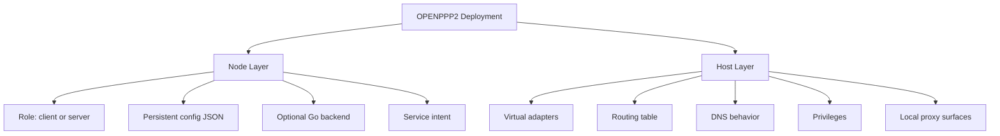
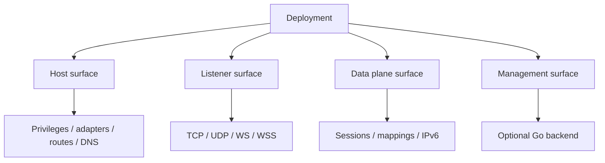
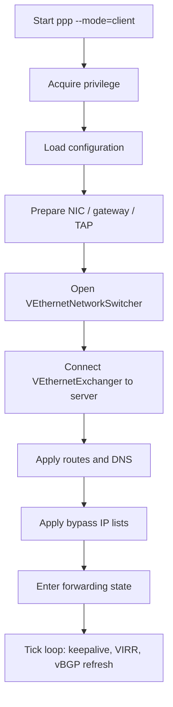
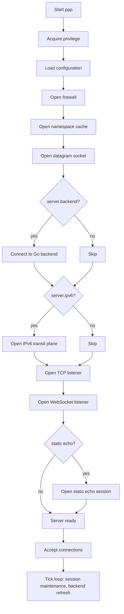
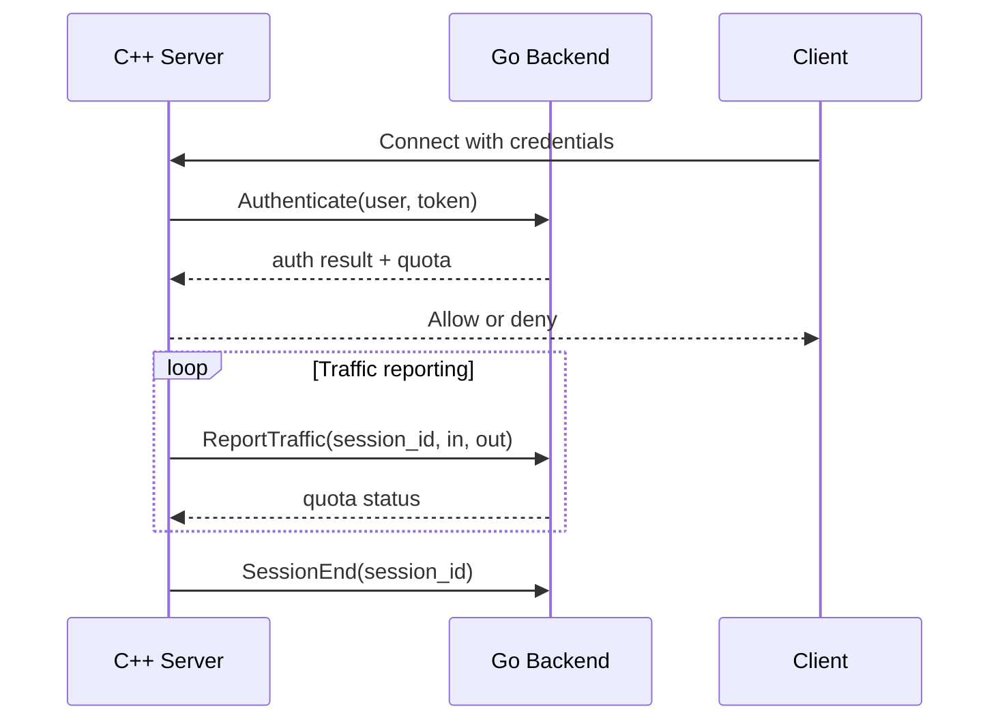
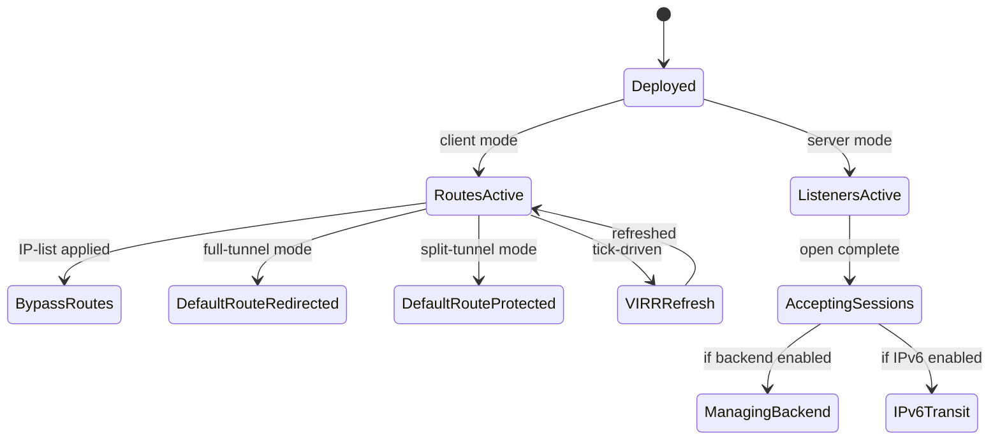
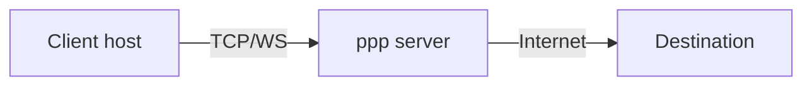
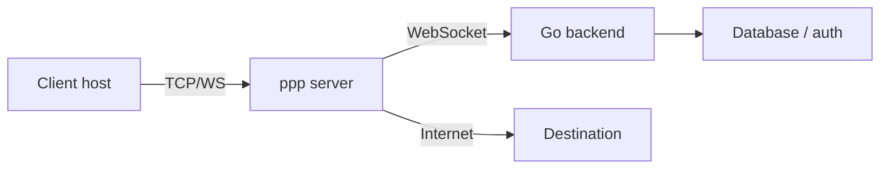
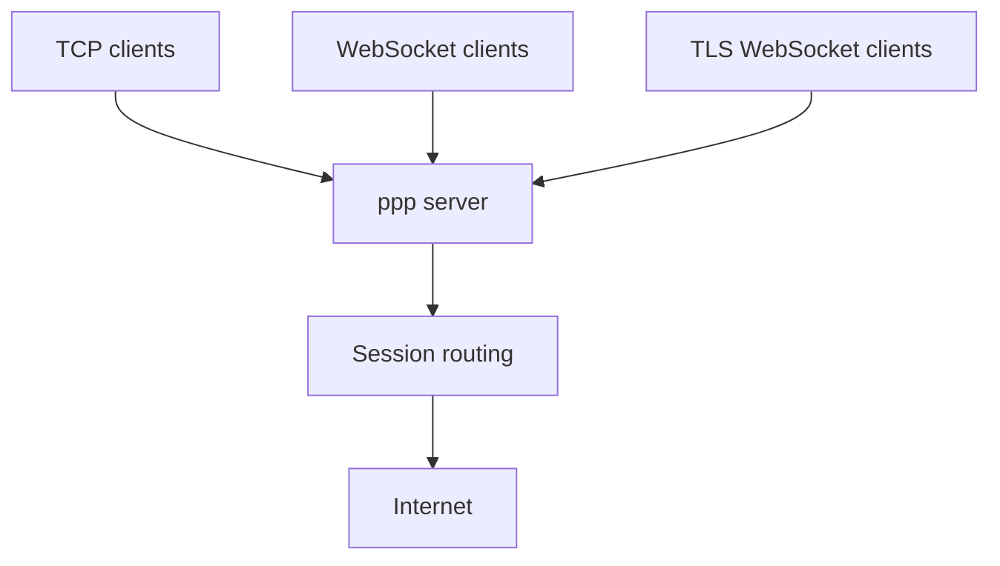

# Deployment Model

[中文版本](DEPLOYMENT_CN.md)

## Scope

This document explains how OPENPPP2 is deployed according to the source tree.
It covers the deployment surfaces, startup order, platform prerequisites, and operational expectations.

---

## Core Facts

- The C++ runtime is a single executable: `ppp`.
- It can run in `client` mode or `server` mode.
- An optional Go backend can be linked by the server through `server.backend`.
- Administrator or root privilege is always required.

---

## Deployment Is Two Layers



| Layer | Meaning |
|-------|---------|
| Node layer | Persistent JSON, role, backend, and service intent |
| Host layer | Adapters, routes, DNS, privileges, local proxy surfaces |

The source tree treats these as related but not identical concerns.

---

## Deployment Surfaces

OPENPPP2 deployment can be read as four surfaces:



| Surface | Components | Notes |
|---------|-----------|-------|
| Host | Privileges, virtual adapters, OS routing, DNS settings | Must be ready before runtime opens |
| Listener | TCP, WebSocket, TLS WebSocket, static UDP | Configured in `tcp.listen/websocket.listen/udp.listen` |
| Data plane | Sessions, NAT mappings, IPv6 transit, static echo | Per-session runtime state |
| Management | Go backend via WebSocket | Optional; extends policy, not packet transport |

---

## Hard Requirements

- Administrator or root privilege is required.
- A real configuration file is required.

`LoadConfiguration(...)` searches in this order:
1. Explicit `-c` / `--config` CLI argument.
2. `./config.json` in the working directory.
3. `./appsettings.json` in the working directory.

Source: `ppp/app/PppApplication.cpp`

---

## Client Deployment

The client deployment creates a virtual adapter, prepares route/DNS/bypass inputs, opens `VEthernetNetworkSwitcher`, and establishes the remote exchanger session.

### Client Startup Sequence



### Client Deployment Checklist

| Step | Requirement |
|------|-------------|
| 1 | Privilege: administrator on Windows, root on Linux/macOS/Android |
| 2 | Configuration file present at known path |
| 3 | `client.guid` set to a valid UUID |
| 4 | `client.server` pointing to an accessible server address |
| 5 | Virtual adapter support available on host |
| 6 | DNS and routing change permissions available |
| 7 | Optional: `client.bypass` IP-list files or URLs accessible |
| 8 | Optional: `client.dns-rules` file accessible |

### Client Platform Notes

| Platform | Adapter Type | Routing Method | DNS Method |
|----------|-------------|----------------|------------|
| Windows | TAP-Windows / WinTUN | IPv4 route API | System DNS override |
| Linux | TUN/TAP | `ip route` / `rtnetlink` | `/etc/resolv.conf` |
| macOS | utun | `route` command | `scutil` |
| Android | VPNService | VPNService routes | VPNService DNS |

---

## Server Deployment

The server deployment opens listeners, firewall, namespace cache, datagram socket, optional managed backend, and optional IPv6 transit plumbing through `VirtualEthernetSwitcher`.

### Server Startup Sequence



### Server Deployment Checklist

| Step | Requirement |
|------|-------------|
| 1 | Privilege: root on Linux, administrator on Windows |
| 2 | Configuration file present |
| 3 | At least one listener enabled (`tcp.listen.port` or `websocket.listen.ws`) |
| 4 | Listener port set to a valid, available value |
| 5 | Firewall config file present if `server.firewall` is set |
| 6 | Go backend reachable if `server.backend` is set |
| 7 | IPv6 capable interface if `server.ipv6` is enabled |

### Server Listener Types

| Listener | Config Key | Protocol | TLS |
|----------|-----------|----------|-----|
| TCP | `tcp.listen.port` | Raw TCP | No |
| WebSocket | `websocket.listen.ws` | HTTP WebSocket | No |
| TLS WebSocket | `websocket.listen.wss` | HTTPS WebSocket | Yes |
| Static UDP | `udp.listen.port` | Raw UDP | No |

---

## Go Backend

The Go backend is optional and is used for managed deployments — not for the core data plane.



Key properties:
- Communication is over WebSocket (`ws://` or `wss://`).
- If backend is unreachable, server falls back to local cache policy.
- Backend extends policy and management; it never touches packet bytes.

Source: `ppp/app/server/VirtualEthernetManagedServer.h`

---

## Privilege Requirements By Platform

| Platform | Requirement | Notes |
|----------|-------------|-------|
| Linux | `root` or `CAP_NET_ADMIN` | TUN/TAP creation requires privilege |
| Windows | Administrator | TAP driver and route modification |
| macOS | `root` | utun creation |
| Android | VPNService permission | Declared in `AndroidManifest.xml` |

---

## Network Prerequisites

| Requirement | Client | Server |
|-------------|--------|--------|
| Virtual adapter support | Required | Not required |
| Open TCP port | Not required | Required |
| DNS modification permission | Required | Not required |
| Route modification permission | Required | Not required |
| IPv6 capable NIC | If IPv6 enabled | If `server.ipv6` enabled |

---

## Operational Expectations After Startup

Deployment is not just the first boot. After startup, these host states are expected to remain true:



Ongoing host-side expectations:

| Expectation | Description |
|-------------|-------------|
| Default routes managed | Client may redirect or protect the default route |
| DNS servers stable | DNS server routes must persist |
| Listeners bound | Server listeners must remain bound |
| Backend reachable | Go backend connection must be maintained |
| IPv6 transit active | IPv6 transit plane must stay operational |

---

## Deployment Topology Examples

### Simple Server + Client



### Server With Go Backend



### Multi-Listener Server



---

## Deployment Failure Classes

| Class | Symptom | Likely Cause |
|-------|---------|-------------|
| Privilege failure | Process exits immediately | Not running as administrator/root |
| Config not found | "configuration not found" error | Wrong path or missing file |
| Adapter open failure | Virtual NIC not created | Driver missing or insufficient privilege |
| Listener bind failure | Port already in use or permission denied | Port conflict or privilege issue |
| Route add failure | Traffic not flowing through tunnel | Route modification not permitted |
| Backend unreachable | Sessions denied or cached policy applied | Backend not started or wrong URL |

---

## Configuration File Reference

Minimum viable server configuration:

```json
{
  "concurrent": 4,
  "key": {
    "kf": 154543927,
    "kx": 128,
    "kl": 10,
    "kh": 12,
    "protocol": "aes-128-cfb",
    "protocol-key": "OpenPPP2-Test-Protocol-Key",
    "transport": "aes-256-cfb",
    "transport-key": "OpenPPP2-Test-Transport-Key"
  },
  "tcp": {
    "listen": { "port": 20000 }
  },
  "udp": {
    "listen": { "port": 20000 }
  },
  "websocket": {
    "path": "/tun"
  },
  "server": {
    "ipv4-pool": {
      "network": "10.0.0.0",
      "mask": "255.255.255.0"
    }
  }
}
```

Minimum viable client configuration:

```json
{
  "concurrent": 2,
  "key": {
    "kf": 154543927,
    "kx": 128,
    "kl": 10,
    "kh": 12,
    "protocol": "aes-128-cfb",
    "protocol-key": "OpenPPP2-Test-Protocol-Key",
    "transport": "aes-256-cfb",
    "transport-key": "OpenPPP2-Test-Transport-Key"
  },
  "client": {
    "guid": "{F4519CF1-7A8A-4B00-89C8-9172A87B96DB}",
    "server": "ppp://192.168.0.1:20000/"
  }
}
```

---

## Error Code Reference

Deployment-related `ppp::diagnostics::ErrorCode` values:

| ErrorCode | Description |
|-----------|-------------|
| `AppPrivilegeRequired` | Process requires administrator/root |
| `ConfigFileNotFound` | Config file not found at any search path |
| `ConfigLoadFailed` | Config file found but failed to parse |
| `NetworkInterfaceOpenFailed` | Virtual adapter could not be opened |
| `SocketBindFailed` | TCP or WebSocket listener failed to bind |
| `FirewallCreateFailed` | Firewall subsystem failed to initialize |
| `VEthernetManagedConnectUrlEmpty` | Go backend WebSocket connection failed |
| `IPv6TransitTapOpenFailed` | IPv6 transit TAP failed to open |
| `AppAlreadyRunning` | Another instance of ppp is already running |

---

## Related Documents

- [`CONFIGURATION.md`](CONFIGURATION.md)
- [`CLI_REFERENCE.md`](CLI_REFERENCE.md)
- [`PLATFORMS.md`](PLATFORMS.md)
- [`ROUTING_AND_DNS.md`](ROUTING_AND_DNS.md)
- [`OPERATIONS.md`](OPERATIONS.md)
- [`MANAGEMENT_BACKEND.md`](MANAGEMENT_BACKEND.md)
- [`SERVER_ARCHITECTURE.md`](SERVER_ARCHITECTURE.md)
- [`CLIENT_ARCHITECTURE.md`](CLIENT_ARCHITECTURE.md)

---

## Main Conclusion

Deployment in OPENPPP2 is not just "run a binary." It is a staged host-plus-node setup where the executable, privileges, adapters, routes, listeners, and optional backend must all line up correctly. A deployment is healthy only when all four surfaces — host, listener, data plane, and management — are configured and operational.
