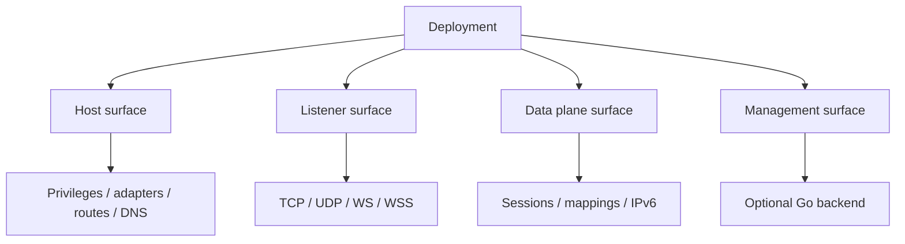

# Deployment Model

[中文版本](DEPLOYMENT_CN.md)

## Scope

This document explains how OPENPPP2 is deployed according to the source tree.

## Main Deployment Facts

- The C++ runtime is a single executable: `ppp`.
- It can run in client mode or server mode.
- An optional Go backend can be linked by the server through `server.backend`.

## Deployment Is Two Layers

Deployment has a node layer and a host layer.

| Layer | Meaning |
|---|---|
| node layer | persistent JSON, role, backend, and service intent |
| host layer | adapters, routes, DNS, privileges, local proxy surfaces |

The source tree treats these as related but not identical concerns.

## Hard Requirements

- administrator/root privilege is required.
- a real configuration file is required.

`LoadConfiguration(...)` searches explicit `-c`/`--config` forms first, then `./config.json`, then `./appsettings.json`.

## Deployment Surfaces

OPENPPP2 deployment can be read as four surfaces:

- host surface: adapters, routes, DNS, privileges.
- listener surface: TCP/UDP/WS/WSS ingress.
- data plane surface: sessions, mappings, static path, IPv6 transit.
- management surface: optional Go backend.

## Client Deployment

The client deployment creates a virtual adapter, prepares route/DNS/bypass inputs, opens `VEthernetNetworkSwitcher`, and then establishes the remote exchanger session.

Practical order:

1. acquire privilege.
2. load configuration.
3. prepare NIC / gateway / TAP.
4. open client switcher.
5. connect exchanger.
6. apply routes and DNS.
7. enter forwarding state.

## Server Deployment

The server deployment opens listeners, firewall, namespace cache, datagram socket, optional managed backend, and optional IPv6 transit plumbing through `VirtualEthernetSwitcher`.

Practical order:

1. acquire privilege.
2. load configuration.
3. open listeners.
4. create session switcher.
5. optionally open managed backend.
6. optionally enable IPv6 transit.
7. accept and route sessions.

## Go Backend

The Go backend is optional and is used for managed deployments, not for the core data plane.

That means the C++ executable can operate without it; the backend extends policy and management rather than defining packet transport.

## Deployment Checklist

1. Configuration file present.
2. Privilege granted.
3. Host interfaces known.
4. Role selected.
5. Listener or adapter dependencies available.
6. Optional backend reachable if enabled.

## Operational Shape

Deployment is not just the first boot. It also includes what host state is expected to remain true after startup:

- default routes may be moved or protected
- DNS servers may be rewritten
- proxy behavior may be altered
- IPv6 transit may need extra host plumbing

## Related Documents

- `CONFIGURATION.md`
- `PLATFORMS.md`
- `OPERATIONS.md`

## Main Conclusion

Deployment in OPENPPP2 is not just “run a binary.” It is a staged host-plus-node setup where the executable, privileges, adapters, routes, listeners, and optional backend must all line up.
