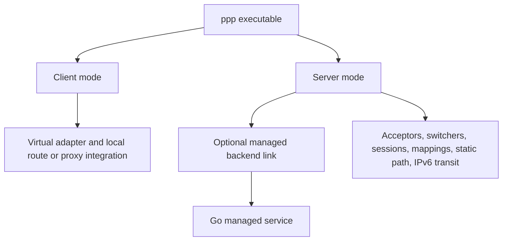
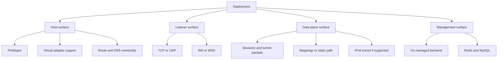
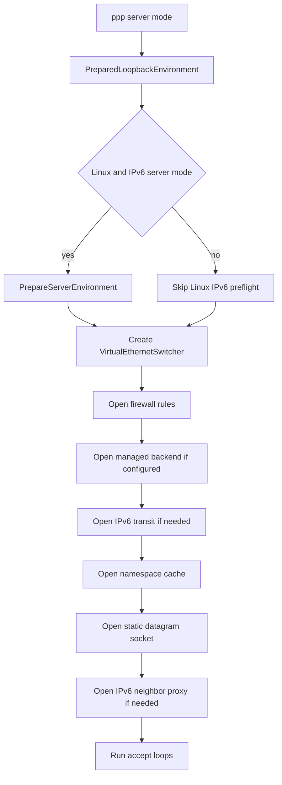

# Deployment Model

[中文版本](DEPLOYMENT_CN.md)

## Scope

This document explains how OPENPPP2 is actually deployed according to the current source tree. It is not a list of vague deployment ideas. It is a runtime-oriented description of what components exist, how they are started, what they require from the host, how client and server roles differ, how the optional Go managed backend fits in, and which deployment assumptions are real versus merely possible in theory.

The relevant implementation anchors are mainly:

- `main.cpp`
- `appsettings.json`
- `ppp/app/client/VEthernetNetworkSwitcher.cpp`
- `ppp/app/server/VirtualEthernetSwitcher.cpp`
- `linux/ppp/ipv6/LINUX_IPv6Auxiliary.cpp`
- root `CMakeLists.txt`
- `build_windows.bat`
- `build-openppp2-by-builds.sh`
- `build-openppp2-by-cross.sh`
- `go/main.go`
- `go/ppp/ManagedServer.go`
- `go/ppp/Configuration.go`
- `go/ppp/Server.go`

## Deployment Is Built Around One Binary And One Optional Backend

The C++ runtime is built around a single executable named `ppp`. That binary can run in either:

- client mode
- server mode

The role is chosen by command line parsing in `main.cpp`, with server mode as the default if `--mode=client` is not supplied.

There is also an optional Go management service under `go/`. It is not part of the transport data plane itself. It is a separate managed-control backend that a C++ server can connect to when `server.backend` is configured.

So the deployment model is not "many binaries with many independent roles." It is closer to this:

- one C++ runtime executable for data plane and local orchestration
- one optional Go service for managed policy and state distribution

## First Deployment Fact: Administrator Or Root Privilege Is Required

`PppApplication::Main(...)` in `main.cpp` explicitly checks `ppp::IsUserAnAdministrator()` and refuses to run if the process lacks administrator or root privilege.

This is one of the most important real deployment constraints in the project. OPENPPP2 is not designed as an unprivileged user-space tunnel process. It expects to:

- create or attach virtual interfaces
- mutate routes
- mutate DNS state
- open listeners on server ports
- in some modes configure firewall or system networking state
- on Linux server, enable IPv6 forwarding and install `ip6tables` rules

Any serious deployment guide must begin with that fact.

## Second Deployment Fact: The Process Must Have A Real Configuration File

`LoadConfiguration(...)` in `main.cpp` looks for configuration in this order:

- explicit `-c` / `--c` / `-config` / `--config`
- `./config.json`
- `./appsettings.json`

The file is not optional in any practical sense. If no readable configuration file is found, startup stops.

The configuration is also not treated as a passive bag of values. `AppConfiguration::Load(...)` and `Loaded()` normalize and constrain many values before runtime begins. So deployment should always think in terms of:

- a checked-in or provisioned configuration file
- role-specific overlays or environment-specific variants
- careful handling of secrets inside that file

## Deployment Surfaces

A useful way to read OPENPPP2 deployment is to split it into four surfaces.

### 1. Host Surface

This is the local operating system and network environment that the process mutates or depends on.

Examples:

- tun/tap or utun availability
- route tools or native route APIs
- DNS resolver ownership
- Windows firewall and adapter APIs
- Linux `ip`, `sysctl`, `ip6tables`
- Android VPN host application and pre-opened TUN fd

### 2. Listener Surface

This is how a server accepts incoming transport sessions.

Examples:

- TCP listener
- UDP listener
- WS listener
- WSS listener
- CDN-style or SNI-related fronting paths where configured

### 3. Data Plane Surface

This is where packets, sessions, mappings, static packets, NAT forwarding, IPv6 forwarding, and MUX connections actually move.

Examples:

- `VirtualEthernetSwitcher`
- `VEthernetNetworkSwitcher`
- static datagram socket
- mapping ports
- IPv6 transit interface on Linux server

### 4. Management Surface

This is optional. It exists only if the server is configured to use a managed backend.

Examples:

- `server.backend`
- `server.backend-key`
- Go managed service WebSocket and HTTP endpoints
- Redis and MySQL dependencies of the Go backend

## Client Deployment

### What Client Startup Actually Does

In `PreparedLoopbackEnvironment(...)`, client mode startup does not stop at "connect to server". It performs a concrete deployment sequence:

1. create a virtual adapter through `ITap::Create(...)`
2. open that adapter
3. instantiate `VEthernetNetworkSwitcher`
4. inject runtime flags such as requested IPv6, SSMT, protect mode, mux, static mode, preferred gateway, preferred NIC
5. load bypass IP lists and configured client route lists
6. load DNS rules
7. open the switcher, which then opens the client exchanger and surrounding client runtime pieces

That means a deployed client node is not simply a socket endpoint. It is a local network mutator plus a tunnel session endpoint.

### What A Client Host Must Provide

Depending on platform, a client deployment needs:

- Windows: Wintun or TAP-Windows compatibility, route and DNS mutation permissions, optionally PaperAirplane/LSP related behavior
- Linux: tun device availability, route tools, optional protect mode support, DNS resolver mutation support
- macOS: utun support and route mutation capability
- Android: an application host that provides a VPN TUN fd and the JNI `protect(int)` bridge

### Client Deployment Shapes

The code supports several practical client-side deployment shapes.

#### Routed Overlay Client

This is the classic client deployment shape.

The client:

- creates a virtual interface
- installs steering routes
- optionally modifies DNS behavior
- forwards selected or default traffic into the overlay

This is the natural shape when the user wants OPENPPP2 to act like a VPN or routed overlay endpoint.

#### Proxy Edge Client

The client runtime can also expose local HTTP or SOCKS proxies. In that shape, local applications may use the proxy endpoint while the client still owns tunnel connectivity underneath.

This is operationally useful when route mutation is undesirable for the whole host or when only selected applications should use the overlay.

#### Static UDP-Oriented Client

If static mode is enabled, the client also becomes a participant in the static packet path using configured UDP servers and keepalive behavior.

This should be treated as a deployment specialization, not merely a feature toggle, because it changes how the client exercises UDP and static packet transport behavior.

#### Android Embedded Client

On Android, the deployment unit is not the native binary alone. The deployment unit is the Android application plus its VPN host integration plus the native library. The C++ runtime is embedded into the host lifecycle.

## Server Deployment

### What Server Startup Actually Does

In `PreparedLoopbackEnvironment(...)`, server mode does the following:

1. on Linux, pre-run `PrepareServerEnvironment(...)` for IPv6 server prerequisites if IPv6 mode needs it
2. instantiate `VirtualEthernetSwitcher`
3. inject preferred NIC
4. call `ethernet->Open(firewall_rules)`
5. call `ethernet->Run()`

`VirtualEthernetSwitcher::Open(...)` in turn performs a more revealing sequence:

- `CreateAllAcceptors()`
- `CreateAlwaysTimeout()`
- `CreateFirewall(firewall_rules)`
- `OpenManagedServerIfNeed()`
- `OpenIPv6TransitIfNeed()`
- `OpenNamespaceCacheIfNeed()`
- `OpenDatagramSocket()`
- `OpenIPv6NeighborProxyIfNeed()`
- `OpenLogger()` if the above succeeded

This is a very strong hint about real server deployment structure. A deployed server node may contain all of these planes at once:

- transport listeners
- firewall policy
- managed-backend connectivity
- static UDP socket
- DNS namespace cache
- IPv6 transit and neighbor-proxy integration on Linux
- session logger

### What A Server Host Must Provide

At minimum, a server host needs:

- privilege to bind listeners and manage network state
- a valid configuration file with listener configuration
- reachable public or internal interfaces depending on topology

If more advanced features are enabled, it additionally needs:

- firewall rules file if local firewall filtering is intended
- Linux IPv6 prerequisites if using NAT66 or GUA server IPv6 mode
- route and interface ownership sufficient to install transit and proxy behavior
- stable time and database/cache connectivity if using the Go backend

### Linux Is The Reference Server Platform For Rich IPv6 Deployment

The source makes this point clearly.

In `LINUX_IPv6Auxiliary.cpp`, `PrepareServerEnvironment(...)` can:

- clean up existing IPv6 server rules
- enable IPv6 forwarding via `sysctl`
- choose the uplink interface
- in GUA mode, adjust `accept_ra`
- build and apply IPv6 forwarding rules
- in NAT66 mode, install `ip6tables` NAT postrouting rules

Then in `VirtualEthernetSwitcher.cpp`, server runtime can:

- create a transit tap
- set transit IPv6 address
- receive IPv6 packets from that transit interface
- map IPv6 destinations to client sessions
- maintain neighbor-proxy entries

This is not merely an optional helper script pattern. It is integrated startup logic. Therefore, if a deployment requires full server-side IPv6 overlay routing, Linux should be treated as the reference deployment platform.

### Static Packet Server Surface

`OpenDatagramSocket()` creates the static packet receive surface. This matters for deployment because enabling static mode is not only a client-side choice. The server host also needs a reachable datagram listener and enough network policy to let that path function.

### Mapping Server Surface

If `server.mapping` is enabled and clients register mapping entries, the server becomes a publishing point for services behind client NAT. That changes the deployment role of the server from "just tunnel concentrator" to "tunnel concentrator plus service exposure gateway."

This should affect firewall design, public interface placement, and monitoring.

## Managed Backend Deployment

### What It Is

The Go service under `go/` is not a replacement for the C++ server. It is an optional management backend that the C++ server can query or authenticate against.

`ManagedServer.go` shows that the backend process:

- loads its own configuration from `os.Args[1]` or `appsettings.json`
- connects to Redis
- connects to MySQL master and slave databases
- auto-migrates server and user tables
- starts a WebSocket server
- exposes HTTP endpoints for server and consumer management

### What It Requires

`Configuration.go` makes several requirements explicit. The managed backend configuration must include:

- Redis addresses and master name
- database master configuration
- concurrency-control configuration
- interface path configuration
- prefixes and path values

Without these, the managed service will not start.

So the management surface deployment implies dependencies that do not exist in the standalone C++ server deployment:

- Redis availability
- MySQL availability
- Go service process management
- network reachability between C++ server and Go backend

### Deployment Meaning

When `server.backend` is configured on the C++ server, the server becomes a hybrid node:

- data plane remains in the C++ runtime
- user or node policy can come from the backend
- the deployment now has an external control-plane dependency

That means high availability and failure modeling should treat backend reachability as part of the service model when managed mode is enabled.

## Configuration And Secret Placement In Deployment

`appsettings.json` shows what a realistic deployment file can contain. It may include:

- transport keys
- WebSocket TLS certificate paths and passwords
- backend key
- server listener ports
- IPv6 prefixes and static bindings
- client upstream server or upstream proxy settings
- local HTTP and SOCKS proxy bind addresses
- mapping definitions

This has two direct deployment implications.

First, the configuration file is both topology and secret material. It should be treated accordingly.

Second, a single example file can contain both client and server blocks, but a real deployment should usually separate role-specific files or rendered templates so that nodes only receive the settings they actually need.

## Deployment Patterns That Match The Source

The old shorthand list of deployment patterns is still valid, but it is more useful to restate them in runtime terms.

### 1. Standalone Client To Standalone Server

This is the simplest deployment:

- one `ppp` server process with configured listeners
- one or more `ppp` client processes with virtual adapter integration

Use this when no managed backend is needed and policy can live in config files.

### 2. Client With Route Steering And DNS Steering

This is the most common deployment for remote-access or split-tunnel use.

The important operational fact is that the client host becomes part of the deployment. Route files, bypass lists, DNS rules, and local DNS ownership are all part of what must be provisioned correctly.

### 3. Server With Static Datagram Surface

Enable this when the static packet path is required. The deployment must include reachable UDP ingress, not just the main TCP or WS surface.

### 4. Server With Reverse Mapping Exposure

Enable this when clients publish internal services through the server. Treat the server as a service-exposure edge, not just a tunnel concentrator.

### 5. Linux Server With IPv6 Overlay Transit

This is the deployment shape for NAT66 or GUA IPv6 service to clients. It should be treated as Linux-specific infrastructure deployment, with kernel forwarding and `ip6tables` expectations built in.

### 6. Managed Service Deployment

This combines:

- C++ `ppp` server nodes
- Go managed backend
- Redis
- MySQL

This is the richest deployment form in the repository, but also the one with the most moving pieces.

### 7. Android Embedded Client Deployment

This is not a standard CLI rollout. The deployment artifact is the Android application package plus the embedded native library plus the Java-side VPN integration.

## Operational Preconditions By Feature

Before enabling a feature in production deployment, verify the corresponding host precondition.

If enabling WSS:

- certificate file paths must be valid
- WSS listener ports must be reachable
- host/path values must be consistent with the ingress layer

If enabling mappings:

- server public exposure policy must allow mapped ports
- clients must have valid local target services
- firewall stance must account for the published surface

If enabling static mode:

- UDP reachability must exist between peers
- keepalive behavior must fit the network environment

If enabling managed backend:

- backend URL and backend key must be valid
- Go service, Redis, and MySQL must all be reachable and healthy

If enabling server IPv6 NAT66 or GUA:

- host platform should be Linux
- IPv6 forwarding and `ip6tables` must be available
- uplink interface selection must be correct
- public or delegated IPv6 design must already make sense outside OPENPPP2 itself

## Packaging And Delivery By Platform

### Windows

The intended Windows build and packaging flow is described in `build_windows.bat`.

Important deployment-adjacent facts:

- the build expects Visual Studio tooling
- vcpkg toolchain discovery is mandatory
- artifacts are produced per architecture and per build type

For deployment, that means Windows delivery is expected to come from a prepared build pipeline, not from ad hoc local compilation on the target host.

### Linux And Unix

The root CMake build is the normal native build path. The `build-openppp2-by-builds.sh` script additionally packages multiple configuration variants into zip files. The cross-build script shows intended multi-architecture Linux delivery.

For deployment, that implies Linux is the most natural platform for building dedicated server artifacts for different architectures.

### Android

Android delivery is a shared-library delivery workflow. The native artifact is only one part of the deployable system; the application host is the actual deployment container.

## Engineering Boundaries To State Explicitly

Several boundaries should be documented plainly in any deployment guide.

OPENPPP2 can be deployed as a client or server from one binary, but client and server hosts have materially different system responsibilities.

The optional Go backend is a management dependency, not a substitute data plane.

The richest server-side IPv6 deployment path is Linux-specific in the current source.

Android deployment is application-hosted, not standalone CLI-hosted.

Privileges are mandatory. This is not a non-privileged tunnel product.

## Recommended Deployment Discipline

Treat deployment as three separate concerns even if the repository can store them together.

First, keep role-specific configs separate:

- client configs
- server configs
- managed-backend configs

Second, keep generated or environment-specific files separate from source-controlled defaults.

Third, do not enable every optional plane at once unless the site actually needs them. A deployment that simultaneously enables:

- mappings
- static mode
- WSS
- managed backend
- IPv6 transit
- local HTTP and SOCKS proxies

is not merely feature-rich. It is operationally complex, and should be introduced in layers.

## Detailed Architecture Considerations

### Understanding The Data Plane Flow

The data plane in OPENPPP2 represents the core forwarding engine that moves packets between the virtual network interface and the transport tunnel. When operating in client mode, packets arriving at the virtual adapter are encrypted and transmitted to the server through the established tunnel. Conversely, encrypted packets received from the server are decrypted and injected back into the local network through the virtual adapter. This bidirectional flow requires careful coordination between multiple components including the packet encoder/decoder, session manager, and the underlying transport mechanism. The efficiency and reliability of this data plane directly impacts the user experience, making it essential to understand how these components interact during normal operation and failure scenarios.

In server mode, the data plane expands to handle multiple concurrent client sessions, each with its own encrypted tunnel. The server must maintain per-session state including encryption keys, sequence numbers, and routing information. The `VirtualEthernetSwitcher` component serves as the central orchestrator, managing acceptors for incoming connections, maintaining the mapping between client sessions and their respective virtual network segments, and coordinating the static packet path when enabled. This multi-session architecture places significant demands on CPU and memory resources, particularly when serving large numbers of simultaneous clients.

### Session Management And Lifecycle

Each tunnel session follows a well-defined lifecycle from establishment through graceful shutdown or unexpected disconnection. Upon initial connection, the client and server perform a handshake involving protocol negotiation, key exchange, and capability advertisement. The successful completion of this handshake results in an active session with associated state. During the active phase, the session handles bidirectional packet flow while maintaining liveness through keepalive mechanisms. When the session terminates, whether intentionally or due to network failure, cleanup procedures release all associated resources including memory allocations, network handles, and any registered mappings.

The session lifecycle has direct implications for deployment reliability. Network interruptions that exceed the configured timeout result in session expiration, requiring clients to re-establish connections. For production deployments, this behavior necessitates proper reconnection logic in client applications or network infrastructure designed to minimize disruptive events. Additionally, the handling of partial states, such as sessions that crash without proper cleanup, requires configuration of appropriate garbage collection intervals to prevent resource leaks.

### Network Namespace And Isolation

On Linux servers, OPENPPP2 can leverage network namespaces to provide enhanced isolation between different routing domains. The namespace cache functionality allows the server to maintain separate network contexts for different client groups, enabling scenarios where clients from distinct organizations or security domains are prevented from directly communicating with each other. This isolation is particularly valuable in managed deployment scenarios where the operator serves multiple tenants from a single infrastructure.

The namespace implementation involves creating isolated network stacks with their own routing tables, firewall rules, and network interfaces. When a client connects, the server assigns it to an appropriate namespace based on authentication credentials or configuration policy. Packets from clients in different namespaces are processed independently, with the namespace boundaries enforced at both the routing and firewall layers. This architecture supports multi-tenant deployments where strong isolation guarantees are required.

### Transport Protocol Considerations

The choice of transport protocol significantly impacts deployment characteristics and operational requirements. TCP-based transport provides reliable, ordered delivery but introduces overhead from the TCP header and may suffer from head-of-line blocking when packet loss occurs. WebSocket (WS) transport adds an additional framing layer on top of TCP, enabling deployment behind HTTP-aware intermediaries such as load balancers and web proxies. WebSocket Secure (WSS) adds TLS encryption, providing transport security and the ability to traverse most corporate firewalls that permit HTTPS traffic.

UDP-based transport, particularly when used with the static packet mode, offers lower latency and better resistance to head-of-line blocking. However, UDP transport requires application-level handling for packet ordering, loss detection, and retransmission. The static packet mode addresses these concerns by implementing a simplified reliability mechanism suitable for scenarios where timely delivery takes precedence over perfect reliability. Understanding these tradeoffs is essential for selecting the appropriate transport configuration for a given deployment scenario.

### Firewall Integration Patterns

OPENPPP2 integrates with platform-specific firewall mechanisms to enforce policy and protect the server infrastructure. On Windows, the server can leverage the Windows Firewall API to create and manage rules that control access to listener ports and virtual adapter interfaces. On Linux, iptables and ip6tables provide the foundation for packet filtering, with OPENPPP2 capable of automatically installing rules for port forwarding, NAT, and connection tracking.

The firewall integration extends beyond simple access control to include advanced scenarios such as traffic shaping and intrusion detection. For deployments requiring fine-grained control, custom firewall rule files can be provided to implement organization-specific policies. However, the complexity of firewall configuration management increases operational burden, and misconfigured rules can result in either overly permissive security postures or unintended service disruptions. Production deployments should establish clear processes for firewall rule changes and maintain documentation of the rationale behind each rule.

### High Availability Considerations

Deployments requiring high availability must address multiple potential failure points including server process crashes, machine failures, network partitions, and backend service unavailability. For the C++ server component, process supervision frameworks such as systemd on Linux or Windows Service Manager provide automatic restart capabilities. At the infrastructure level, redundant server deployments with load balancing enable continued service during individual server outages. The selection between active-active and active-passive configurations depends on requirements for capacity, consistency, and operational complexity.

The managed backend introduces additional HA considerations due to its external dependencies on Redis and MySQL. Redis provides fast state distribution and session caching but supports different replication topologies with varying consistency guarantees. MySQL serves as the authoritative data store for user accounts, configuration, and accounting records, requiring appropriate replication and backup strategies. The deployment architecture must account for backend maintenance windows and failure scenarios, with clear procedures for failover and recovery documented and tested.

### Monitoring And Observability

Effective operational management requires comprehensive monitoring covering server health, session statistics, resource utilization, and security events. OPENPPP2 exports various metrics through its logging system, which can be integrated with popular monitoring platforms through log aggregation and analysis tools. Key metrics include active session counts, packet throughput, latency distributions, error rates, and authentication failures.

Beyond basic metrics, production deployments benefit from distributed tracing capabilities that enable correlation of events across client and server components. Tracing information proves invaluable for diagnosing performance issues and understanding the flow of requests through complex multi-tier deployments. The logging system supports configurable verbosity levels, allowing operators to balance storage requirements against diagnostic needs. Audit logging for security-relevant events such as authentication attempts and configuration changes supports compliance requirements in regulated environments.

## Security Deployment Considerations

### Transport Security

All production deployments should enable TLS encryption for transport security. The WSS listener provides encrypted communication between clients and servers, protecting data confidentiality and integrity against network eavesdropping and tampering. Certificate management becomes a critical operational task, requiring procedures for certificate issuance, renewal, and revocation. The deployment must address certificate validation to prevent man-in-the-middle attacks, including proper configuration of trusted certificate authorities and certificate hostname validation.

For deployments requiring additional security layers, certificate client authentication can be configured to require clients to present valid certificates during the TLS handshake. This provides strong authentication guarantees and eliminates the risk of credential theft through network observation. However, certificate client authentication introduces operational complexity for client provisioning and certificate lifecycle management. The appropriate balance depends on the threat model and operational capabilities of the deployment.

### Secrets Management

The configuration file contains sensitive material including transport keys, backend credentials, and TLS private keys. Production deployments must implement proper secrets management practices to protect this information. This includes filesystem permissions restricting access to authorized administrators and deployment processes, encryption at rest for configuration files stored in backups or version control, and secure transmission when configuration files are provisioned to target hosts.

Environment-specific configuration should be generated from templates during deployment rather than storing multiple variants in version control. Secret injection mechanisms such as environment variables or external secrets services can be integrated with the configuration loading process to minimize the exposure of sensitive values. Regular rotation of secrets including transport keys and backend credentials reduces the impact of potential credential compromise.

### Network Isolation

Beyond transport security, network isolation through firewall rules and network segmentation provides defense in depth. The server should be deployed in a network zone with controlled access, with firewall rules permitting only necessary traffic flows. Listener ports should be restricted to expected client source networks, preventing enumeration and unauthorized access attempts. The managed backend components should be placed in separate network zones with access controls limiting communication to authorized server infrastructure.

For multi-tenant deployments, network namespace isolation ensures that traffic from different tenants does not intersect inappropriately. Combined with encryption and authentication, network isolation provides multiple layers of protection against both external attackers and internal threats from compromised tenant systems.

### Access Control And Authentication

The authentication mechanism determines how clients prove their identity to the server. OPENPPP2 supports multiple authentication methods with different security properties. Token-based authentication uses shared secrets configured in the configuration file, providing simplicity but requiring secure distribution and storage of the token values. Certificate-based authentication offers stronger guarantees through cryptographic key pairs, but requires public key infrastructure for certificate issuance and validation.

The managed backend provides additional authentication capabilities through integration with user databases and external identity providers. This enables scenarios requiring centralized access control, audit trails, and integration with enterprise identity management systems. The choice of authentication mechanism should align with the overall security architecture and operational capabilities of the deployment.

## Performance Optimization

### Resource Allocation

Proper resource allocation ensures consistent performance under load. The server requires sufficient CPU resources to handle encryption, packet processing, and session management for expected client loads. Memory requirements scale with the number of concurrent sessions and the configured buffer sizes. Network bandwidth must accommodate the expected traffic volume plus protocol overhead, with headroom for traffic bursts.

For high-capacity deployments, horizontal scaling through multiple server instances behind load balancers provides additional capacity. The load balancing strategy should consider session persistence requirements to ensure clients maintain consistent paths through the infrastructure. Connection draining during server maintenance prevents disruption to active sessions during deployments and upgrades.

### Protocol Optimization

Protocol parameters can be tuned to optimize performance for specific network conditions and traffic patterns. TCP buffer sizes affect throughput and latency, with larger buffers enabling higher throughput at the cost of increased memory usage and latency variance. Keepalive intervals balance between quick detection of failed connections and the overhead of unnecessary keepalive traffic. The static packet mode parameters including retry counts and timeouts should be tuned for the expected network characteristics.

For latency-sensitive deployments, the UDP-based static packet mode may provide better performance than TCP transport. The tradeoffs between reliability and latency depend on the application requirements. Testing under realistic conditions identifies optimal parameter values before production deployment.

### Monitoring And Capacity Planning

Ongoing monitoring supports capacity planning and early detection of performance degradation. Tracking session counts, throughput, latency percentiles, and resource utilization over time reveals trends that inform capacity expansion decisions. Alerting on threshold violations enables proactive response before user-impacting performance degradation occurs.

Capacity planning should account for expected growth and seasonal traffic patterns. Regular review of utilization trends identifies when additional server capacity or infrastructure upgrades are needed. The monitoring system should capture sufficient historical data to support trend analysis while managing storage requirements.

## Disaster Recovery And Business Continuity

### Backup And Restore

Configuration and state backup protects against data loss from infrastructure failures or operational errors. Configuration files should be backed up as part of the deployment process, with version history enabling rollback to known-good states. The managed backend databases require regular backups with tested restore procedures. Redis state can be recovered from database snapshots or reconstructed from authoritative sources.

Testing backup and restore procedures validates that backups are complete and restorable. Regular restore tests should be performed to ensure that backup media are functional and that personnel are familiar with restoration procedures. Documentation of restore procedures reduces stress and error rates during actual recovery events.

### Failure Scenarios And Procedures

Documented procedures for common failure scenarios enable rapid, consistent recovery. Server process failures typically resolve through automatic restart by the supervisor, with investigation of root cause following service restoration. Network connectivity failures may require investigation of network infrastructure and potential configuration changes to restore connectivity.

More significant incidents such as complete server loss require deployment of replacement infrastructure. Deployment automation through configuration management tools enables rapid provisioning of replacement servers. Runbooks documenting the steps required to recover from various failure scenarios reduce mean time to recovery and prevent errors during incident response.

### Communication Plans

Incident communication plans ensure that stakeholders receive timely, accurate information during outages. Designation of incident commanders and communication responsibilities before incidents occur enables organized response. Regular updates during incidents keep stakeholders informed of progress and expected resolution times. Post-incident reviews identify improvement opportunities and drive process refinement.

## Related Documents

- [`CONFIGURATION.md`](CONFIGURATION.md)
- [`CLI_REFERENCE.md`](CLI_REFERENCE.md)
- [`PLATFORMS.md`](PLATFORMS.md)
- [`CLIENT_ARCHITECTURE.md`](CLIENT_ARCHITECTURE.md)
- [`SERVER_ARCHITECTURE.md`](SERVER_ARCHITECTURE.md)
- [`OPERATIONS.md`](OPERATIONS.md)
- [`MANAGEMENT_BACKEND.md`](MANAGEMENT_BACKEND.md)
