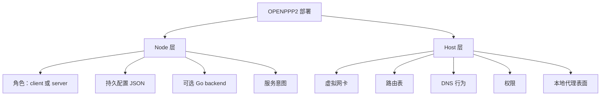
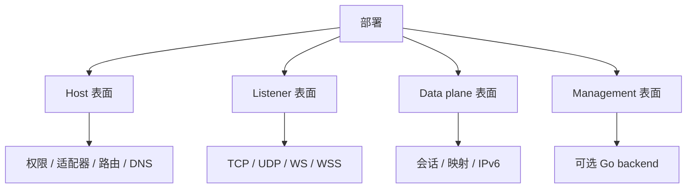
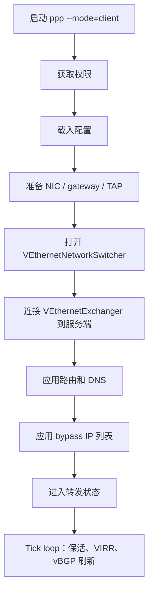
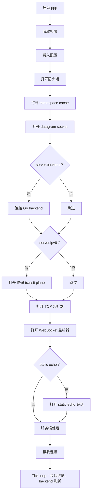
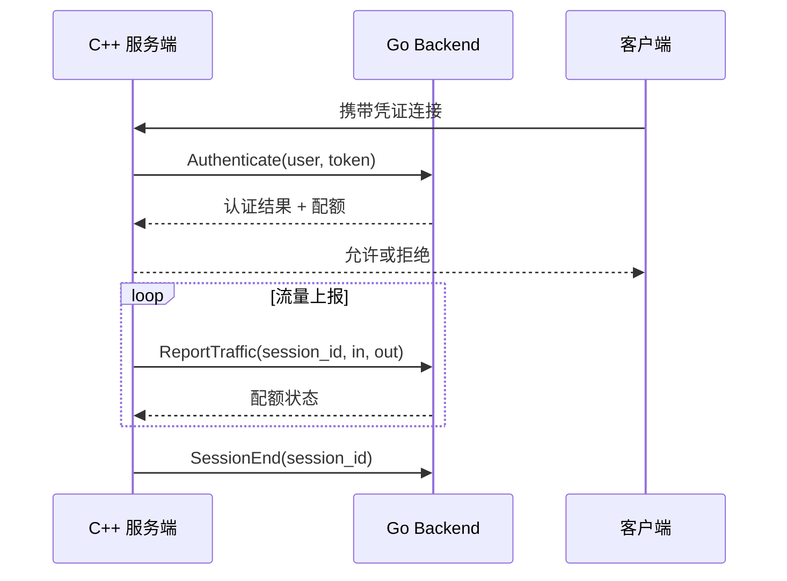
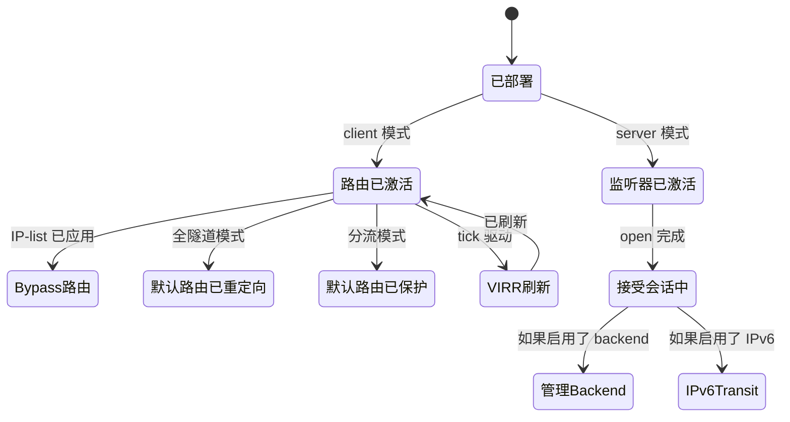
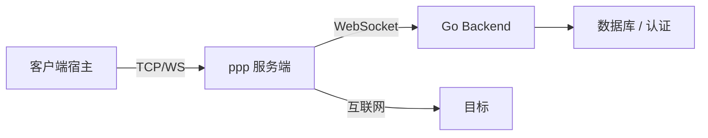
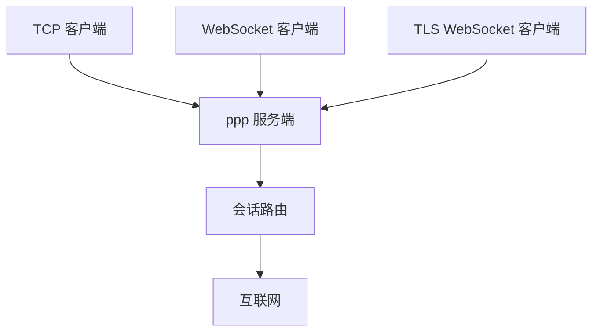

# 部署模型

[English Version](DEPLOYMENT.md)

## 范围

本文解释 OPENPPP2 按源码结构如何部署，涵盖部署表面、启动顺序、平台前置条件和运行预期。

---

## 核心事实

- C++ 运行时是一个单一可执行文件：`ppp`。
- 它可以运行在 `client` 模式或 `server` 模式。
- 服务端可以通过 `server.backend` 接入可选的 Go backend。
- 始终需要管理员/root 权限。

---

## 部署分成两层



| 层 | 含义 |
|----|------|
| Node 层 | 持久 JSON、角色、backend 和服务意图 |
| Host 层 | 适配器、路由、DNS、权限、本地代理表面 |

源码把这两层当作相关但不完全相同的问题。

---

## 部署表面

OPENPPP2 的部署可以看成四个表面：



| 表面 | 组件 | 备注 |
|------|------|------|
| Host | 权限、虚拟网卡、OS 路由、DNS 设置 | 运行时打开前必须就绪 |
| Listener | TCP、WebSocket、TLS WebSocket、static UDP | 在 `tcp.listen/websocket.listen/udp.listen` 中配置 |
| Data plane | 会话、NAT 映射、IPv6 transit、static echo | 每会话运行时状态 |
| Management | 通过 WebSocket 接入 Go backend | 可选；扩展策略，不接触数据包字节 |

---

## 硬性要求

- 需要管理员/root 权限。
- 需要真实的配置文件。

`LoadConfiguration(...)` 按以下顺序搜索：
1. 显式的 `-c` / `--config` CLI 参数。
2. 工作目录下的 `./config.json`。
3. 工作目录下的 `./appsettings.json`。

源文件：`ppp/app/PppApplication.cpp`

---

## 客户端部署

客户端部署会创建虚拟网卡，准备 route / DNS / bypass 输入，打开 `VEthernetNetworkSwitcher`，然后建立远程 exchanger 会话。

### 客户端启动顺序



### 客户端部署检查清单

| 步骤 | 要求 |
|------|------|
| 1 | 权限：Windows 上需要管理员，Linux/macOS/Android 上需要 root |
| 2 | 已知路径上存在配置文件 |
| 3 | `client.guid` 设置为有效 UUID |
| 4 | `client.server` 指向可访问的服务端地址 |
| 5 | 宿主机支持虚拟网卡 |
| 6 | 具备 DNS 和路由修改权限 |
| 7 | 可选：`client.bypass` IP-list 文件或 URL 可访问 |
| 8 | 可选：`client.dns-rules` 文件可访问 |

### 客户端平台说明

| 平台 | 网卡类型 | 路由方式 | DNS 方式 |
|------|---------|---------|---------|
| Windows | TAP-Windows / WinTUN | IPv4 路由 API | 系统 DNS 覆写 |
| Linux | TUN/TAP | `ip route` / `rtnetlink` | `/etc/resolv.conf` |
| macOS | utun | `route` 命令 | `scutil` |
| Android | VPNService | VPNService 路由 | VPNService DNS |

---

## 服务端部署

服务端部署会打开监听器、防火墙、namespace cache、datagram socket、可选 managed backend，以及通过 `VirtualEthernetSwitcher` 提供的可选 IPv6 transit plumbing。

### 服务端启动顺序



### 服务端部署检查清单

| 步骤 | 要求 |
|------|------|
| 1 | 权限：Linux 上 root，Windows 上管理员 |
| 2 | 配置文件存在 |
| 3 | 至少启用一个监听器（`tcp.listen.port` 或 `websocket.listen.ws`） |
| 4 | 监听端口设置为可用端口 |
| 5 | 如果设置了 `server.firewall`，防火墙配置文件存在 |
| 6 | 如果设置了 `server.backend`，Go backend 可达 |
| 7 | 如果启用了 `server.ipv6`，NIC 支持 IPv6 |

### 服务端监听器类型

| 监听器 | 配置键 | 协议 | TLS |
|--------|--------|------|-----|
| TCP | `tcp.listen.port` | 原始 TCP | 否 |
| WebSocket | `websocket.listen.ws` | HTTP WebSocket | 否 |
| TLS WebSocket | `websocket.listen.wss` | HTTPS WebSocket | 是 |
| Static UDP | `udp.listen.port` | 原始 UDP | 否 |

---

## Go Backend

Go backend 是可选的，用于 managed deployment，而不是核心 data plane。



核心特性：
- 通信使用 WebSocket（`ws://` 或 `wss://`）。
- backend 不可达时，服务端回退到本地缓存策略。
- backend 扩展的是策略和管理，永远不接触数据包字节。

源文件：`ppp/app/server/VirtualEthernetManagedServer.h`

---

## 各平台权限要求

| 平台 | 要求 | 备注 |
|------|------|------|
| Linux | `root` 或 `CAP_NET_ADMIN` | TUN/TAP 创建需要权限 |
| Windows | 管理员 | TAP 驱动和路由修改 |
| macOS | `root` | utun 创建 |
| Android | VPNService 权限 | 在 `AndroidManifest.xml` 中声明 |

---

## 网络前置条件

| 要求 | 客户端 | 服务端 |
|------|--------|--------|
| 虚拟网卡支持 | 必须 | 不需要 |
| 开放 TCP 端口 | 不需要 | 必须 |
| DNS 修改权限 | 必须 | 不需要 |
| 路由修改权限 | 必须 | 不需要 |
| IPv6 capable NIC | 如果启用 IPv6 | 如果启用 `server.ipv6` |

---

## 启动后的运维预期

部署成功不代表 host state 不再变化。实际运行中还会持续看到：



持续的宿主侧预期：

| 预期 | 说明 |
|------|------|
| 默认路由受管理 | 客户端可能重定向或保护默认路由 |
| DNS 服务器稳定 | DNS 服务器路由必须持久存在 |
| 监听器保持绑定 | 服务端监听器必须持续绑定 |
| Backend 保持可达 | Go backend 连接必须维持 |
| IPv6 transit 活跃 | IPv6 transit plane 必须保持运行 |

---

## 部署拓扑示例

### 简单服务端 + 客户端


### 带 Go Backend 的服务端



### 多监听器服务端



---

## 部署失败类型

| 类型 | 症状 | 可能原因 |
|------|------|---------|
| 权限失败 | 进程立即退出 | 未以管理员/root 运行 |
| 找不到配置 | "configuration not found" 错误 | 路径错误或文件缺失 |
| 网卡打开失败 | 虚拟 NIC 未创建 | 驱动缺失或权限不足 |
| 监听器绑定失败 | 端口被占用或权限不足 | 端口冲突或权限问题 |
| 路由添加失败 | 流量未经隧道 | 路由修改不被允许 |
| Backend 不可达 | 会话被拒绝或应用缓存策略 | Backend 未启动或 URL 错误 |

---

## 配置文件参考

最简服务端配置：

```json
{
  "concurrent": 4,
  "key": {
    "kf": 154543927,
    "kx": 128,
    "kl": 10,
    "kh": 12,
    "protocol": "aes-128-cfb",
    "protocol-key": "OpenPPP2-Test-Protocol-Key",
    "transport": "aes-256-cfb",
    "transport-key": "OpenPPP2-Test-Transport-Key"
  },
  "tcp": {
    "listen": { "port": 20000 }
  },
  "udp": {
    "listen": { "port": 20000 }
  },
  "websocket": {
    "path": "/tun"
  },
  "server": {
    "ipv4-pool": {
      "network": "10.0.0.0",
      "mask": "255.255.255.0"
    }
  }
}
```

最简客户端配置：

```json
{
  "concurrent": 2,
  "key": {
    "kf": 154543927,
    "kx": 128,
    "kl": 10,
    "kh": 12,
    "protocol": "aes-128-cfb",
    "protocol-key": "OpenPPP2-Test-Protocol-Key",
    "transport": "aes-256-cfb",
    "transport-key": "OpenPPP2-Test-Transport-Key"
  },
  "client": {
    "guid": "{F4519CF1-7A8A-4B00-89C8-9172A87B96DB}",
    "server": "ppp://192.168.0.1:20000/"
  }
}
```

---

## 错误码参考

部署相关的 `ppp::diagnostics::ErrorCode` 值：

| ErrorCode | 说明 |
|-----------|------|
| `AppPrivilegeRequired` | 进程需要管理员/root 权限 |
| `ConfigFileNotFound` | 任何搜索路径都找不到配置文件 |
| `ConfigLoadFailed` | 找到配置文件但解析失败 |
| `NetworkInterfaceOpenFailed` | 虚拟网卡无法打开 |
| `SocketBindFailed` | TCP 或 WebSocket 监听器绑定失败 |
| `FirewallCreateFailed` | 防火墙子系统初始化失败 |
| `VEthernetManagedConnectUrlEmpty` | Go backend WebSocket 连接失败 |
| `IPv6TransitTapOpenFailed` | IPv6 transit TAP 打开失败 |
| `AppAlreadyRunning` | 已有另一个 ppp 实例在运行 |

---

## 相关文档

- [`CONFIGURATION_CN.md`](CONFIGURATION_CN.md)
- [`CLI_REFERENCE_CN.md`](CLI_REFERENCE_CN.md)
- [`PLATFORMS_CN.md`](PLATFORMS_CN.md)
- [`ROUTING_AND_DNS_CN.md`](ROUTING_AND_DNS_CN.md)
- [`OPERATIONS_CN.md`](OPERATIONS_CN.md)
- [`MANAGEMENT_BACKEND_CN.md`](MANAGEMENT_BACKEND_CN.md)
- [`SERVER_ARCHITECTURE_CN.md`](SERVER_ARCHITECTURE_CN.md)
- [`CLIENT_ARCHITECTURE_CN.md`](CLIENT_ARCHITECTURE_CN.md)

---

## 主结论

OPENPPP2 的部署不是"运行一个二进制"这么简单。它是一个分阶段的 host + node setup，必须让可执行文件、权限、网卡、路由、监听器和可选 backend 一起对齐。只有当所有四个表面——host、listener、data plane 和 management——都正确配置并运行时，部署才算健康。
