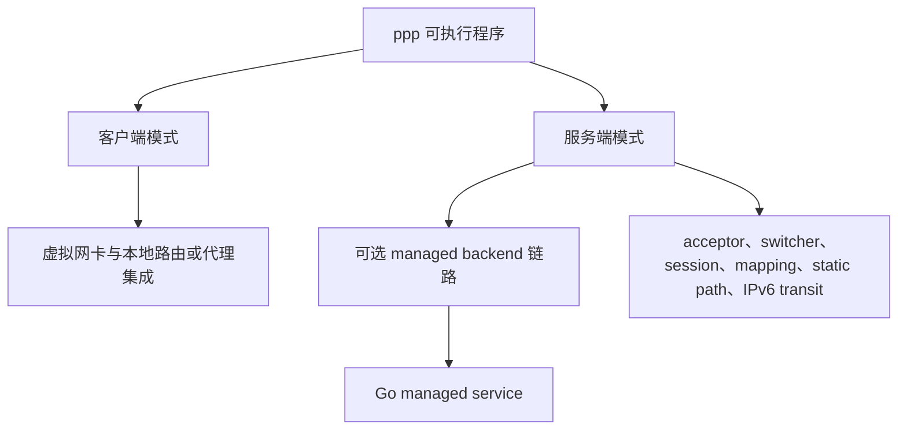
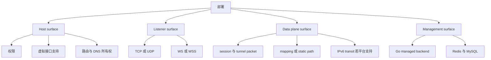
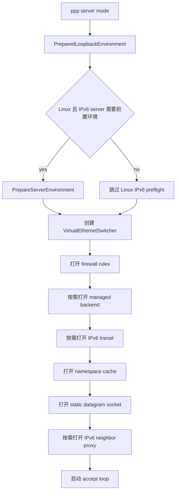

# 部署模型

[English Version](DEPLOYMENT.md)

## 范围

本文基于当前源码解释 OPENPPP2 的真实部署方式。它不是泛泛列举几种“可能的玩法”，而是从运行时视角说明：有哪些组件，如何启动，宿主机需要提供什么，client/server 部署分别意味着什么，可选 Go 管理后端如何接入，以及哪些部署前提是代码中真实存在的，哪些只是理论上能想象出来的。

本文主要依据以下实现入口：

- `main.cpp`
- `appsettings.json`
- `ppp/app/client/VEthernetNetworkSwitcher.cpp`
- `ppp/app/server/VirtualEthernetSwitcher.cpp`
- `linux/ppp/ipv6/LINUX_IPv6Auxiliary.cpp`
- 根目录 `CMakeLists.txt`
- `build_windows.bat`
- `build-openppp2-by-builds.sh`
- `build-openppp2-by-cross.sh`
- `go/main.go`
- `go/ppp/ManagedServer.go`
- `go/ppp/Configuration.go`
- `go/ppp/Server.go`

## 部署核心事实：一个主二进制，加一个可选后端

C++ 运行时围绕单一可执行程序 `ppp` 展开。这个二进制可以运行在两种角色中：

- client mode
- server mode

角色由 `main.cpp` 中的命令行解析决定；如果没有显式传入 `--mode=client`，默认就是 server。

除此之外，仓库里还有一个可选 Go 管理服务，位于 `go/`。它不是 transport data plane 的一部分，而是一个独立的 management backend。只有当 C++ server 配置了 `server.backend` 时，它才进入整体部署模型。

因此，OPENPPP2 不是“很多二进制各自扮演不同角色”的系统，更接近：

- 一个 C++ `ppp` 可执行程序，承担 data plane 与本地 orchestration
- 一个可选 Go 服务，承担 managed policy 与状态分发

## 第一条部署事实：必须具备管理员或 root 权限

`main.cpp` 中的 `PppApplication::Main(...)` 会显式调用 `ppp::IsUserAnAdministrator()` 检查权限；若不是管理员或 root，程序直接拒绝运行。

这是整个项目最重要的真实部署约束之一。OPENPPP2 不是一个设计为普通用户权限运行的“纯用户态隧道程序”。它预期自己能够：

- 创建或接入虚拟接口
- 修改路由
- 修改 DNS 状态
- 打开服务端监听端口
- 在某些模式下修改 firewall 或系统网络环境
- 在 Linux server 上启用 IPv6 forwarding 并安装 `ip6tables` 规则

所以，任何严肃的部署文档都必须把“需要管理员/root 权限”写在前面，而不是放在注意事项角落里。

## 第二条部署事实：必须有真实配置文件

`LoadConfiguration(...)` 在 `main.cpp` 中按以下顺序查找配置：

- 显式 `-c` / `--c` / `-config` / `--config`
- `./config.json`
- `./appsettings.json`

在实践里，配置文件并不是“可有可无”的。没有可读配置文件，启动就会中止。

而且这个配置文件也不是被动地“拿来读一遍”。`AppConfiguration::Load(...)` 与 `Loaded()` 会在真正运行前对大量字段做规范化、纠正和禁用处理。因此部署时应该始终把它看成：

- 一个需要被精心渲染或下发的配置文件
- 一个按环境区分的配置模板体系
- 一个同时承载拓扑信息和敏感信息的对象

## 部署面的拆分

要读懂 OPENPPP2 的部署，最好的方式是把它拆成四个“面”。

### 1. Host Surface

也就是本地宿主网络环境。程序会依赖它，或者直接修改它。

例如：

- tun/tap 或 utun 是否可用
- 是否存在 route tool 或 native route API
- DNS resolver 的所有权在谁手里
- Windows firewall 与 adapter API
- Linux 的 `ip`、`sysctl`、`ip6tables`
- Android 上 app host 是否能提供 TUN fd

### 2. Listener Surface

也就是服务端如何接受连接。

例如：

- TCP listener
- UDP listener
- WS listener
- WSS listener
- 某些带 CDN/SNI 前置语义的入口路径

### 3. Data Plane Surface

也就是 packets、session、mapping、static packet、NAT、IPv6 forwarding、MUX 等真实流动的地方。

例如：

- `VirtualEthernetSwitcher`
- `VEthernetNetworkSwitcher`
- static datagram socket
- mapping ports
- Linux server 上的 IPv6 transit interface

### 4. Management Surface

这是可选面。只有配置了 managed backend 才会存在。

例如：

- `server.backend`
- `server.backend-key`
- Go managed service 的 WebSocket 与 HTTP 接口
- Go 后端依赖的 Redis 与 MySQL

## 客户端部署

### 客户端启动时真实会做什么

在 `PreparedLoopbackEnvironment(...)` 中，client mode 并不是简单“连上 server”就结束，而是会执行一整套本地部署动作：

1. 通过 `ITap::Create(...)` 创建虚拟接口
2. 打开该接口
3. 实例化 `VEthernetNetworkSwitcher`
4. 注入 requested IPv6、SSMT、protect mode、mux、static mode、preferred gateway、preferred NIC 等运行时参数
5. 加载 bypass IP list 与配置中的 client route list
6. 加载 DNS rules
7. `Open(...)` switcher，继而带起 exchanger 与其他客户端运行时结构

这意味着一个已部署的 client 节点，不只是“有个 socket 连到 server”，而是：

- 一个会修改本机网络状态的进程
- 一个会话端点
- 一个本地流量分流与恢复的执行者

### 客户端宿主机必须提供什么

按平台不同，客户端部署前提也不同：

- Windows：Wintun 或 TAP-Windows 兼容性、路由和 DNS 修改权限、某些场景下 PaperAirplane/LSP 行为
- Linux：tun 设备、路由工具、可选 protect 模式、resolver 修改能力
- macOS：utun 支持与 route mutation 能力
- Android：一个能提供 VPN TUN fd 和 JNI `protect(int)` 的 app host

### 客户端部署形态

源码支持几种真实可落地的客户端部署形态。

#### Routed Overlay Client

这是最典型的客户端部署形态。

客户端会：

- 创建虚拟接口
- 安装分流路由
- 按需修改 DNS 行为
- 把选定流量或默认流量送进 overlay

这就是常见的 VPN / routed overlay endpoint 形态。

#### Proxy Edge Client

客户端 runtime 还可以暴露本地 HTTP 或 SOCKS 代理。本地应用通过代理接入，而下面依然由 client 维持隧道连接。

这适用于：

- 不希望整机都改路由
- 只有部分应用要走 overlay

#### Static UDP-Oriented Client

若开启 static mode，client 还会进入 static packet path，配合 UDP server 列表与 keepalive 行为工作。

这不应只被看作一个“功能开关”，而应被视作一种部署特化，因为它改变了 client 使用 UDP 与 static packet 的方式。

#### Android Embedded Client

Android 上，部署单元不是 native 二进制本身，而是：

- Android 应用
- VPN host integration
- native shared library

C++ runtime 被嵌入在 host 生命周期中运行。

## 服务端部署

### 服务端启动时真实会做什么

在 `PreparedLoopbackEnvironment(...)` 中，server mode 会执行：

1. Linux 下若 IPv6 server 需要前置环境，则先调用 `PrepareServerEnvironment(...)`
2. 构造 `VirtualEthernetSwitcher`
3. 注入 preferred NIC
4. 调用 `ethernet->Open(firewall_rules)`
5. 调用 `ethernet->Run()`

而 `VirtualEthernetSwitcher::Open(...)` 本身还会进一步做：

- `CreateAllAcceptors()`
- `CreateAlwaysTimeout()`
- `CreateFirewall(firewall_rules)`
- `OpenManagedServerIfNeed()`
- `OpenIPv6TransitIfNeed()`
- `OpenNamespaceCacheIfNeed()`
- `OpenDatagramSocket()`
- `OpenIPv6NeighborProxyIfNeed()`
- 成功后 `OpenLogger()`

这清楚地说明，一个部署好的 server 节点可能同时承载多个面：

- transport listeners
- firewall policy
- managed-backend link
- static UDP socket
- DNS namespace cache
- Linux 上的 IPv6 transit 与 neighbor proxy
- session logger

### 服务端宿主机必须提供什么

最基本的服务端宿主前提是：

- 有足够权限绑定监听端口和修改网络环境
- 有有效配置文件
- 有可达的接口和地址用于对外或对内提供服务

如果启用更多高级能力，则还需要：

- firewall rules 文件
- Linux IPv6 相关前提，若启用 NAT66/GUA
- 能够安装 transit 路由与 proxy 行为的宿主网络权限
- 若启用 managed backend，则需要稳定时间、数据库和缓存连通性

### Linux 是最完整 IPv6 Server 部署的参考平台

源码对此非常明确。

在 `LINUX_IPv6Auxiliary.cpp` 中，`PrepareServerEnvironment(...)` 可以：

- 清理旧的 IPv6 server 规则
- 用 `sysctl` 开启 IPv6 forwarding
- 解析 uplink interface
- 在 GUA 模式下调整 `accept_ra`
- 生成并应用 IPv6 forwarding rules
- 在 NAT66 模式下安装 `ip6tables` 的 POSTROUTING MASQUERADE 规则

然后在 `VirtualEthernetSwitcher.cpp` 中，server runtime 还会：

- 创建 transit tap
- 给 transit 接口设置 IPv6 地址
- 从 transit 接口接收 IPv6 报文
- 把 IPv6 destination 映射到客户端 session
- 维护 neighbor-proxy entry

这不是旁路脚本，而是主启动链路的一部分。因此，如果部署目标包含“完整的 server-side IPv6 overlay forwarding”，当前源码表明 Linux 应被视为参考部署平台。

### Static Packet 服务端面

`OpenDatagramSocket()` 会打开 static packet 的接收面。这意味着 static mode 不是只在 client 侧勾一个开关就完了；server 宿主也必须具备可达 UDP listener 与相应网络策略。

### Mapping 服务端面

若 `server.mapping` 开启，且客户端注册 mapping，server 的部署角色就不再只是“隧道汇聚点”，而会变成“汇聚点加服务暴露边缘”。

这会直接影响：

- firewall 设计
- public interface 放置
- 端口监控与告警

## Managed Backend 部署

### 它是什么

`go/` 下的 Go 服务不是 C++ server 的替代品，而是一个可选的管理后端。C++ server 可以通过 `server.backend` 与其建立关系，用于管理与策略决策。

`ManagedServer.go` 表明，该后端进程会：

- 从 `os.Args[1]` 或 `appsettings.json` 加载配置
- 连接 Redis
- 连接 MySQL master/slave
- 自动迁移 server 与 user 表
- 启动 WebSocket server
- 暴露 HTTP 接口供 server/consumer 管理

### 它需要什么

`Configuration.go` 明确了配置前提。managed backend 至少要求：

- Redis 地址与 master name
- database master 配置
- concurrency-control 配置
- interfaces 路径配置
- prefixes 与 path

若缺这些，Go backend 本身就启动不了。

因此，一旦进入 managed deployment，整体系统会多出 C++ standalone server 没有的依赖：

- Redis
- MySQL
- Go 服务进程本身
- C++ server 与 Go backend 之间的可达性

### 它在部署上的含义

当 C++ server 配置了 `server.backend` 后，这个 server 节点就成了一个混合节点：

- data plane 仍在 C++ runtime
- user/node policy 可能来自 backend
- backend reachability 成为服务模型的一部分

也就是说，启用 managed mode 后，部署设计与高可用设计必须把 backend 可达性纳入故障模型。

## 配置文件与敏感信息在部署中的位置

`appsettings.json` 显示，一个真实部署文件可能同时包含：

- transport keys
- WebSocket TLS 证书路径和密码
- backend key
- server listener port
- IPv6 prefix 与 static binding
- client upstream server 或 upstream proxy
- 本地 HTTP / SOCKS 代理绑定地址
- mapping 定义

这带来两个直接的部署结论。

第一，配置文件既是 topology description，也是 secret material，不能被当成普通说明文件。

第二，虽然一个示例文件里可以同时放 client 和 server block，但真实部署通常应拆分为：

- client 专用配置
- server 专用配置
- backend 专用配置

避免节点拿到不属于自己的配置和密钥。

## 与源码相符的部署形态

旧版文档里列出的一些部署模式并不是错的，但更有价值的做法是用运行时结构来重述它们。

### 1. Standalone Client 对 Standalone Server

这是最简单的部署方式：

- 一个 `ppp` server 进程，提供 listener
- 一个或多个 `ppp` client 进程，集成虚拟网卡与本地路由

适用于不需要 managed backend，策略完全由配置文件承担的环境。

### 2. 带 Route Steering 与 DNS Steering 的 Client 部署

这是最常见的 remote-access 或 split-tunnel 场景。

关键事实是：client host 本身就是部署的一部分。route file、bypass list、DNS rule、本地 DNS 所有权都需要被正确 provision。

### 3. 带 Static Datagram Surface 的 Server

当需要 static packet path 时使用。部署上必须保证 UDP ingress 可达，而不能只关注主 TCP/WS 面。

### 4. 带 Reverse Mapping Exposure 的 Server

当 client 要把内网服务通过 server 暴露出去时使用。此时 server 应被视作 service-exposure edge，而不是单纯的 tunnel concentrator。

### 5. 带 IPv6 Overlay Transit 的 Linux Server

这是 NAT66 或 GUA IPv6 服务的部署形态。它本质上是 Linux-specific infrastructure deployment，内含 kernel forwarding 与 `ip6tables` 前提。

### 6. Managed Service Deployment

这种部署组合包括：

- C++ `ppp` server 节点
- Go managed backend
- Redis
- MySQL

这是仓库里最完整、最复杂的部署形态之一。

### 7. Android Embedded Client Deployment

这不是普通 CLI rollout。真正的交付物是：

- Android application package
- 内嵌 native library
- Java 侧 VPN host integration

## 按功能分解的部署前提

启用某个功能前，应该先确认对应宿主前提是否成立。

若启用 WSS：

- 证书文件路径必须有效
- WSS listener port 必须可达
- host/path 必须和上层 ingress 一致

若启用 mappings：

- server public exposure policy 必须允许对应端口
- client 本地必须有真实可用的目标服务
- firewall 策略必须考虑这条发布面

若启用 static mode：

- peer 间必须具备 UDP reachability
- keepalive 行为必须适合当前网络环境

若启用 managed backend：

- backend URL 与 backend key 必须有效
- Go service、Redis、MySQL 都必须连通且健康

若启用 server IPv6 NAT66 或 GUA：

- 宿主平台应优先选择 Linux
- 必须存在 IPv6 forwarding 与 `ip6tables`
- uplink interface 选择必须正确
- OPENPPP2 之外的公网或委派 IPv6 设计本身也必须合理

## 各平台构建与交付方式

### Windows

`build_windows.bat` 描述了预期的 Windows build/delivery workflow。

关键部署相关事实：

- 依赖 Visual Studio 工具链
- 依赖 vcpkg toolchain
- 按架构与 build type 产出 artifacts

这意味着 Windows 交付更像一条正式构建流水线产物，而不是在目标主机上临时编译得到的产物。

### Linux / Unix

根 `CMakeLists.txt` 是正常 native build 入口。`build-openppp2-by-builds.sh` 会额外打包多个构建变体。交叉编译脚本则展示了多架构 Linux artifact 的生成意图。

因此，从部署角度看，Linux 是最自然的 server artifact 构建平台。

### Android

Android 是 shared library delivery 模型。native artifact 只是部署系统的一部分，真正的部署容器是宿主 app。

## 必须明确写出的工程边界

有几条边界必须在部署文档里直说。

第一，OPENPPP2 可以用一个二进制运行 client 或 server，但 client host 和 server host 承担的系统责任完全不同。

第二，Go backend 是 management dependency，不是 data plane 替代品。

第三，最完整的 server-side IPv6 deployment path 当前是 Linux-specific。

第四，Android deployment 是 application-hosted，不是 standalone CLI-hosted。

第五，管理员/root 权限是前提，不是可选优化项。

## 推荐的部署纪律

即使仓库允许把很多内容放在一起，也建议把部署分成三个独立关注点。

第一，分离角色配置：

- client configs
- server configs
- backend configs

第二，把 source-controlled default 与 environment-specific generated file 分开。

第三，不要一开始就把所有 plane 全开。一个同时启用以下所有能力的站点：

- mappings
- static mode
- WSS
- managed backend
- IPv6 transit
- 本地 HTTP 与 SOCKS proxy

不只是“功能丰富”，而是“运维复杂度显著上升”。更合理的方式是按层引入。

## 相关文档

- [`CONFIGURATION_CN.md`](CONFIGURATION_CN.md)
- [`CLI_REFERENCE_CN.md`](CLI_REFERENCE_CN.md)
- [`PLATFORMS_CN.md`](PLATFORMS_CN.md)
- [`CLIENT_ARCHITECTURE_CN.md`](CLIENT_ARCHITECTURE_CN.md)
- [`SERVER_ARCHITECTURE_CN.md`](SERVER_ARCHITECTURE_CN.md)
- [`OPERATIONS_CN.md`](OPERATIONS_CN.md)
- [`MANAGEMENT_BACKEND_CN.md`](MANAGEMENT_BACKEND_CN.md)
