# 部署模型

[English Version](DEPLOYMENT.md)

## 范围

本文基于当前源码解释 OPENPPP2 的真实部署方式。它不是泛泛列举几种“可能的玩法”，而是从运行时视角说明：有哪些组件，如何启动，宿主机需要提供什么，client/server 部署分别意味着什么，可选 Go 管理后端如何接入，以及哪些部署前提是代码中真实存在的哪些只是理论上能想象出来的。

本文主要依据以下实现入口：

- `main.cpp`
- `appsettings.json`
- `ppp/app/client/VEthernetNetworkSwitcher.cpp`
- `ppp/app/server/VirtualEthernetSwitcher.cpp`
- `linux/ppp/ipv6/LINUX_IPv6Auxiliary.cpp`
- 根目录 `CMakeLists.txt`
- `build_windows.bat`
- `build-openppp2-by-builds.sh`
- `build-openppp2-by-cross.sh`
- `go/main.go`
- `go/ppp/ManagedServer.go`
- `go/ppp/Configuration.go`
- `go/ppp/Server.go`

## 部署核心事实：一个主二进制，加一个可选后端

C++ 运行时围绕单一可执行程序 `ppp` 展开。这个二进制可以运行在两种角色中：

- client mode
- server mode

角色由 `main.cpp` 中的命令行解析决定；如果没有显式传入 `--mode=client`，默认就是 server。

除此之外，仓库里还有一个可选 Go 管理服务，位于 `go/`。它不是 transport data plane 的一部分，而是一个独立的 management backend。只有当 C++ server 配置了 `server.backend` 时，它才进入整体部署模型。

因此，OPENPPP2 不是“很多二进制各自扮演不同角色”的系统，更接近：

- 一个 C++ `ppp` 可执行程序，承担 data plane 与本地 orchestration
- 一个可选 Go 服务，承担 managed policy 与状态分发

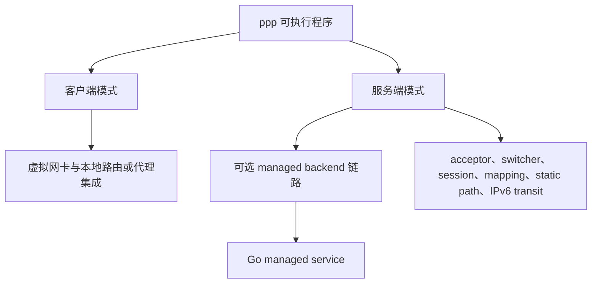

## 第一条部署事实：必须具备管理员或 root 权限

`main.cpp` 中的 `PppApplication::Main(...)` 会显式调用 `ppp::IsUserAnAdministrator()` 检查权限；若不是管理员或 root，程序直接拒绝运行。

这是整个项目最重要的真实部署约束之一。OPENPPP2 不是一个设计为普通用户权限运行的“纯用户态隧道程序”。它预期自己能够：

- 创建或接入虚拟接口
- 修改路由
- 修改 DNS 状态
- 打开服务端监听端口
- 在某些模式下修改 firewall 或系统网络环境
- 在 Linux server 上启用 IPv6 forwarding 并安装 `ip6tables` 规则

所以，任何严肃的部署文档都必须把“需要管理员/root 权限”写在前面，而不是放在注意事项角落里。

## 第二条部署事实：必须有真实配置文件

`LoadConfiguration(...)` 在 `main.cpp` 中按以下顺序查找配置：

- 显式 `-c` / `--c` / `-config` / `--config`
- `./config.json`
- `./appsettings.json`

在实践里，配置文件并不是“可有可无”的。没有可读配置文件，启动就会中止。

而且这个配置文件也不是被动地“拿来读一遍”。`AppConfiguration::Load(...)` 与 `Loaded()` 会在真正运行前对大量字段做规范化、纠正和禁用处理。因此部署时应该始终把它看成：

- 一个需要被精心渲染或下发的配置文件
- 一个按环境区分的配置模板体系
- 一个同时承载拓扑信息和敏感信息的对象

## 部署面的拆分

要读懂 OPENPPP2 的部署，最好的方式是把它拆成四个“面”。

### 1. Host Surface

也就是本地宿主网络环境。程序会依赖它，或者直接修改它。

例如：

- tun/tap 或 utun 是否可用
- 是否存在 route tool 或 native route API
- DNS resolver 的所有权在谁手里
- Windows firewall 与 adapter API
- Linux 的 `ip`、`sysctl`、`ip6tables`
- Android 上 app host 是否能提供 TUN fd

### 2. Listener Surface

也就是服务端如何接受连接。

例如：

- TCP listener
- UDP listener
- WS listener
- WSS listener
- 某些带 CDN/SNI 前置语义的入口路径

### 3. Data Plane Surface

也就是 packets、session、mapping、static packet、NAT、IPv6 forwarding、MUX 等真实流动的地方。

例如：

- `VirtualEthernetSwitcher`
- `VEthernetNetworkSwitcher`
- static datagram socket
- mapping ports
- Linux server 上的 IPv6 transit interface

### 4. Management Surface

这是可选面。只有配置了 managed backend 才会存在。

例如：

- `server.backend`
- `server.backend-key`
- Go managed service 的 WebSocket 与 HTTP 接口
- Go 后端依赖的 Redis 与 MySQL

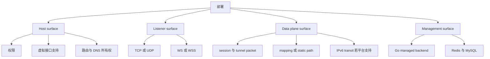

---

# 第一部分：服务端部署详解

## 服务端部署步骤

### 步骤 1：环境准备与依赖检查

在部署 OPENPPP2 服务端之前，必须完成以下环境准备工作：

#### 1.1 操作系统与权限要求

| 项目 | 要求 | 验证方法 |
|------|------|----------|
| 操作系统 | Linux (推荐 CentOS 7+/Ubuntu 18.04+/Debian 10+) 或 Windows Server 2016+ | `uname -a` / `winver` |
| 管理员权限 | Linux 需要 root，Windows 需要管理员 | `id` / `whoami` |
| 磁盘空间 | 至少 2GB 可用空间 | `df -h` |
| 内存 | 至少 512MB 可用内存 | `free -h` |

#### 1.2 网络基础条件

```bash
# Linux 环境检查
ip addr show
ip route show
cat /proc/sys/net/ipv6/conf/all/forwarding  # IPv6 检查

# Windows 环境检查
netsh interface ipv4 show
netsh interface ipv6 show
```

#### 1.3 必需的系统工具

| 工具 | 用途 | 安装命令 (Ubuntu) | 安装命令 (CentOS) |
|------|------|-------------------|-------------------|
| ip | 网络接口管理 | `apt install iproute2` | `yum install iproute` |
| iptables | 防火墙规则 | `apt install iptables` | `yum install iptables` |
| ip6tables | IPv6 防火墙 | `apt install ip6tables` | `yum install ip6tables` |
| sysctl | 内核参数调整 | 内置 | 内置 |
| curl | HTTP 测试 | `apt install curl` | `yum install curl` |

### 步骤 2：配置文件准备

#### 2.1 创建服务端配置文件

服务端配置文件 `server-config.json` 应包含以下核心配置项：

```json
{
  "server": {
    "mode": "server",
    "listener": {
      "tcp": {
        "enabled": true,
        "port": 443,
        "bind": "0.0.0.0"
      },
      "udp": {
        "enabled": true,
        "port": 443
      },
      "ws": {
        "enabled": true,
        "port": 80,
        "path": "/ppp"
      },
      "wss": {
        "enabled": true,
        "port": 443,
        "path": "/ppp",
        "cert": "/etc/ppp/certs/server.crt",
        "key": "/etc/ppp/certs/server.key"
      }
    },
    "firewall": {
      "enabled": true,
      "default-action": "drop",
      "rules-file": "/etc/ppp/firewall.rules"
    },
    "backend": "http://localhost:8080",
    "backend-key": "your-backend-key-here",
    "static": {
      "enabled": true,
      "port": 5000
    },
    "ipv6": {
      "enabled": true,
      "mode": "nat66",
      "uplink": "eth0",
      "prefix": "fd00::/64"
    },
    "mapping": {
      "enabled": false
    }
  },
  "logging": {
    "level": "info",
    "file": "/var/log/ppp/server.log"
  }
}
```

#### 2.2 配置项详细说明

| 配置项 | 类型 | 必填 | 说明 |
|--------|------|------|------|
| `server.listener.tcp.enabled` | boolean | 否 | 启用 TCP 监听，默认 true |
| `server.listener.tcp.port` | number | 是 | TCP 监听端口，推荐 443 |
| `server.listener.udp.enabled` | boolean | 否 | 启用 UDP 监听，用于 static mode |
| `server.listener.udp.port` | number | 是 | UDP 监听端口 |
| `server.listener.wss.enabled` | boolean | 否 | 启用 WSS 监听 |
| `server.firewall.enabled` | boolean | 否 | 启用防火墙规则 |
| `server.firewall.rules-file` | string | 是 | 防火墙规则文件路径 |
| `server.backend` | string | 否 | Go managed backend 地址 |
| `server.backend-key` | string | 否 | backend 认证密钥 |
| `server.static.enabled` | boolean | 否 | 启用 static packet 模式 |
| `server.static.port` | number | 是 | static UDP 端口 |
| `server.ipv6.enabled` | boolean | 否 | 启用 IPv6 支持 |
| `server.ipv6.mode` | string | 是 | IPv6 模式：nat66 或 gua |
| `server.mapping.enabled` | boolean | 否 | 启用端口映射功能 |

### 步骤 3：防火墙规则配置

#### 3.1 基本防火墙规则模板

创建 `/etc/ppp/firewall.rules` 文件：

```
# 允许已建立连接
ACCEPT,ESTABLISHED

# 允许服务端监听端口
ACCEPT,TCP,443
ACCEPT,UDP,443
ACCEPT,TCP,80
ACCEPT,WS,80
ACCEPT,WSS,443

# 允许 static UDP
ACCEPT,UDP,5000

# 允许 IPv6 ICMP
ACCEPT,IPv6,ICMP,128
ACCEPT,IPv6,ICMP,129

# 默认拒绝
DROP,ALL
```

#### 3.2 防火墙规则语法

| 字段 | 说明 | 示例 |
|------|------|------|
| Action | 操作：ACCEPT/DROP/REJECT | ACCEPT |
| Protocol | 协议：TCP/UDP/ICMP/ALL | TCP |
| Port | 端口号 | 443 |
| Direction | 方向：IN/OUT（可选） | IN |
| Source | 源地址（可选） | 10.0.0.0/8 |
| Destination | 目标地址（可选） | 192.168.1.0/24 |

### 步骤 4：证书与密钥准备

#### 4.1 TLS 证书要求

| 项目 | 要求 | 推荐方式 |
|------|------|----------|
| 证书格式 | PEM | OpenSSL 生成或 Let's Encrypt |
| 私钥格式 | PEM | RSA 2048 位或 ECDSA P-256 |
| 证书链 | 完整证书链 | 包含中间证书 |
| 有效期 | 建议 90 天以上 | 使用自动续期 |

#### 4.2 生成自签名证书（测试用）

```bash
# 生成私钥
openssl genrsa -out server.key 2048

# 生成证书
openssl req -new -x509 -key server.key -out server.crt -days 365 \
    -subj "/C=CN/ST=Beijing/L=Beijing/O=OPENPPP2/OU=Server/CN=your-domain.com"

# 设置权限
chmod 600 server.key
chmod 644 server.crt
```

### 步骤 5：服务端启动

#### 5.1 启动命令

```bash
# 前台运行（调试）
sudo ./ppp -c server-config.json

# 后台运行（生产）
sudo ./ppp -c server-config.json -d

# 使用 systemd 服务
sudo systemctl start ppp-server
sudo systemctl enable ppp-server
```

#### 5.2 启动参数

| 参数 | 说明 | 示例 |
|------|------|------|
| `-c` | 配置文件路径 | `-c /etc/ppp/server.json` |
| `-d` | 后台运行 | `-d` |
| `-l` | 日志级别 | `-l debug` |
| `-m` | 运行模式 | `-m server` |

#### 5.3 服务端启动流程图

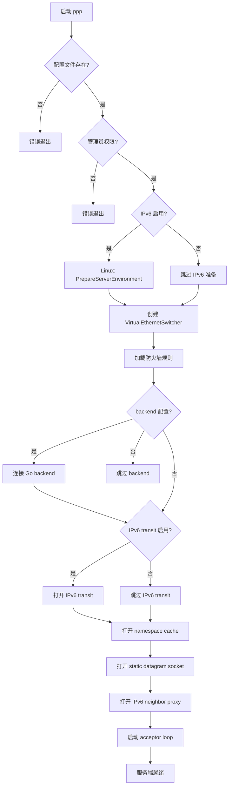

### 步骤 6：IPv6 部署（Linux）

#### 6.1 NAT66 模式部署

当配置 `server.ipv6.mode` 为 `nat66` 时，执行以下步骤：

```bash
# 1. 确认 IPv6 模块加载
modprobe ipv6

# 2. 确认 forwarding 开启
sysctl -w net.ipv6.conf.all.forwarding=1
sysctl -w net.ipv6.conf.default.forwarding=1

# 3. 配置 uplink interface
sysctl -w net.ipv6.conf.eth0.accept_ra=0

# 4. 应用 MASQUERADE 规则
ip6tables -t nat -A POSTROUTING -s fd00::/64 -j MASQUERADE
```

#### 6.2 GUA (Global Unicast Address) 模式部署

当配置 `server.ipv6.mode` 为 `gua` 时：

```bash
# 1. 分配全局 IPv6 前缀
# 需要 upstream IPv6 分配或隧道服务

# 2. 配置路由
ip -6 route add 2000::/3 via <gateway>

# 3. 配置防火墙
ip6tables -A FORWARD -i ppp+ -o <uplink> -j ACCEPT
ip6tables -A FORWARD -i <uplink> -o ppp+ -m state --state ESTABLISHED,RELATED -j ACCEPT
```

#### 6.3 IPv6 部署验证

```bash
# 验证 forwarding
cat /proc/sys/net/ipv6/conf/all/forwarding

# 验证 ip6tables 规则
ip6tables -t nat -L -n -v
ip6tables -L -n -v

# 测试 IPv6 连通性
ping6 -c 4 2001:db8::1
```

### 步骤 7：Static Packet 部署

#### 7.1 配置 static mode

```json
{
  "server": {
    "static": {
      "enabled": true,
      "port": 5000,
      "keepalive": {
        "enabled": true,
        "interval": 25
      }
    }
  }
}
```

#### 7.2 UDP 端口要求

| 项目 | 要求 |
|------|------|
| 端口范围 | 1024-65535 |
| 推荐端口 | 443, 5000, 5001 |
| 防火墙 | 需开放 UDP 入口 |
| MTU | 建议 1400 以下 |

### 步骤 8：服务验证

#### 8.1 端口监听检查

```bash
# Linux
ss -tlnp | grep ppp
netstat -tlnp | grep ppp

# Windows
netstat -ano | findstr LISTENING
```

#### 8.2 服务日志检查

```bash
# 查看实时日志
tail -f /var/log/ppp/server.log

# 查看错误日志
grep -i error /var/log/ppp/server.log

# 查看连接统计
grep -i "connection\|session" /var/log/ppp/server.log
```

---

# 第二部分：客户端部署详解

## 客户端部署步骤

### 步骤 1：环境准备

#### 1.1 操作系统要求

| 操作系统 | 最低版本 | 推荐版本 | 架构 |
|----------|----------|----------|------|
| Windows | 10 1809+ | Windows 11 22H2+ | x64, ARM64 |
| Linux | Ubuntu 18.04+, Debian 10+ | Ubuntu 22.04+ | x64, ARM64 |
| macOS | 10.15+ | 13.0+ | x64, ARM64 |
| Android | 7.0+ | 10.0+ | ARM64 |

#### 1.2 平台依赖

| 平台 | 必需组件 | 验证方法 |
|------|----------|----------|
| Windows | Wintun 或 TAP-Windows | 检查网络适配器 |
| Linux | tun设备, iproute2 | `ls /dev/net/tun` |
| macOS | utun 支持 | `ifconfig -a` |
| Android | VPN Service API | 系统支持检查 |

### 步骤 2：客户端配置文件

#### 2.1 基础配置文件

```json
{
  "client": {
    "mode": "client",
    "server": {
      "address": "your-server.com",
      "port": 443,
      "protocol": "tcp",
      "tls": {
        "enabled": true,
        "verify": true,
        "sni": "your-server.com"
      }
    },
    "virtual": {
      "enabled": true,
      "type": "tun",
      "mtu": 1400,
      "ipv6": {
        "enabled": true,
        "address": "auto"
      }
    },
    "route": {
      "default": false,
      "bypass": [
        "10.0.0.0/8",
        "127.0.0.0/8",
        "172.16.0.0/12"
      ],
      "include": [
        "0.0.0.0/0"
      ]
    },
    "dns": {
      "servers": [
        "8.8.8.8",
        "8.8.4.4"
      ],
      "override": true
    },
    "proxy": {
      "enabled": false,
      "http": {
        "bind": "127.0.0.1",
        "port": 1080
      },
      "socks5": {
        "bind": "127.0.0.1",
        "port": 1081
      }
    },
    "static": {
      "enabled": false,
      "server": "your-server.com",
      "port": 5000
    }
  },
  "logging": {
    "level": "info",
    "file": "client.log"
  }
}
```

#### 2.2 配置项详细说明

| 配置项 | 类型 | 必填 | 说明 |
|--------|------|------|------|
| `client.server.address` | string | 是 | 服务端地址或域名 |
| `client.server.port` | number | 是 | 服务端端口 |
| `client.server.protocol` | string | 是 | 连接协议：tcp/ws/wss |
| `client.server.tls.enabled` | boolean | 否 | 启用 TLS，默认 true |
| `client.virtual.enabled` | boolean | 是 | 启用虚拟网卡 |
| `client.virtual.type` | string | 是 | 虚拟网卡类型：tun/tap |
| `client.virtual.mtu` | number | 否 | MTU 值，默认 1400 |
| `client.route.default` | boolean | 否 | 是否劫持默认路由 |
| `client.route.bypass` | array | 否 | 绕过网段列表 |
| `client.route.include` | array | 否 | 包括网段列表 |
| `client.dns.override` | boolean | 否 | 是否覆盖 DNS |
| `client.proxy.enabled` | boolean | 否 | 启用本地代理 |

### 步骤 3：虚拟网卡配置

#### 3.1 Windows Wintun 安装

```powershell
# 使用 Wintun 适配器
# 1. 下载 Wintun: https://www.wintun.net/
# 2. 安装驱动
# 3. 确认网络连接中出现 "Wintun"

# 验证
Get-NetAdapter | Where-Object {$_.Name -like "*Wintun*"}
```

#### 3.2 Linux TUN 设备

```bash
# 检查设备
ls -la /dev/net/tun

# 加载模块（可选）
modprobe tun

# 创建 tun 设备（可选）
ip tuntap add dev tun0 mode tun
```

#### 3.3 macOS UTUN 设备

```bash
# 检查 utun 设备
ifconfig -a | grep utun

# macOS 自动创建 utun 设备
```

### 步骤 4：路由配置

#### 4.1 绕过路由配置 (Split Tunnel)

```json
{
  "client": {
    "route": {
      "default": false,
      "bypass": [
        "10.0.0.0/8",
        "127.0.0.0/8",
        "172.16.0.0/12",
        "192.168.0.0/16"
      ]
    }
  }
}
```

#### 4.2 全局路由配置

```json
{
  "client": {
    "route": {
      "default": true,
      "include": []
    }
  }
}
```

#### 4.3 指定路由配置

```json
{
  "client": {
    "route": {
      "default": false,
      "include": [
        "10.0.0.0/8",
        "172.16.0.0/12"
      ]
    }
  }
}
```

### 步骤 5：DNS 配置

#### 5.1 DNS 覆盖

```json
{
  "client": {
    "dns": {
      "enabled": true,
      "servers": [
        "8.8.8.8",
        "8.8.4.4",
        "2001:4860:4860::8888"
      ],
      "override": true,
      "rules": [
        {
          "domain": "*.internal.corp",
          "server": "10.0.0.53"
        }
      ]
    }
  }
}
```

#### 5.2 无 DNS 覆盖

```json
{
  "client": {
    "dns": {
      "enabled": false,
      "override": false
    }
  }
}
```

### 步骤 6：本地代理配置

#### 6.1 HTTP 代理配置

```json
{
  "client": {
    "proxy": {
      "enabled": true,
      "http": {
        "bind": "127.0.0.1",
        "port": 1080,
        "auth": {
          "username": "user",
          "password": "pass"
        }
      }
    }
  }
}
```

#### 6.2 SOCKS5 代理配置

```json
{
  "client": {
    "proxy": {
      "enabled": true,
      "socks5": {
        "bind": "127.0.0.1",
        "port": 1081,
        "auth": {
          "username": "user",
          "password": "pass"
        }
      }
    }
  }
}
```

### 步骤 7：客户端启动

#### 7.1 启动命令

```bash
# 前台运行
sudo ./ppp -c client-config.json

# 后台运行
sudo ./ppp -c client-config.json -d

# 指定日志级别
sudo ./ppp -c client-config.json -l debug
```

#### 7.2 启动流程图

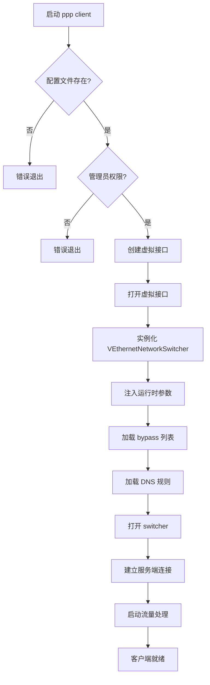

### 步骤 8：客户端验证

#### 8.1 连接验证

```bash
# 检查虚拟网卡
ip addr show tun0
# Windows: ipconfig

# 检查路由
ip route show
# Windows: route print

# 测试连接
curl -v https://your-server.com

# 测试 DNS
nslookup google.com
```

#### 8.2 日志检查

```bash
# 查看连接日志
tail -f client.log | grep -i connection

# 查看错误日志
grep -i error client.log

# 查看统计
grep -i "sent\|received\|byte" client.log
```

---

# 第三部分：平台特定部署

## Windows 部署

### 环境要求

| 项目 | 要求 | 说明 |
|------|------|------|
| 操作系统 | Windows 10 1809+ | 需要管理员权限 |
| 架构 | x64 或 ARM64 | 影响二进制选择 |
| 内存 | 256MB+ 可用 | 运行时需求 |
| 磁盘 | 100MB+ | 二进制大小 |
| Visual C++ Redistributable | 2019+ | 运行时依赖 |

### Windows 特有配置

```json
{
  "windows": {
    "tun": {
      "driver": "wintun",
      "tap": "tap0901"
    },
    "firewall": {
      "enabled": true,
      "mode": "netsh"
    },
    "dns": {
      "override": true,
      "method": "registry"
    }
  }
}
```

### Windows 部署步骤

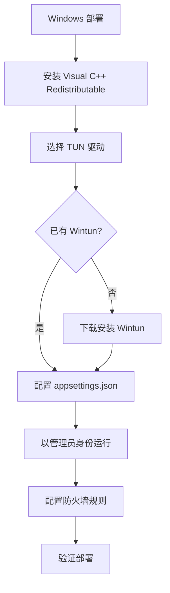

1. 安装 Visual C++ Redistributable 2019
2. 选择虚拟网卡驱动（Wintun 或 TAP-Windows）
3. 如使用 Wintun，从 https://www.wintun.net/ 下载安装
4. 创建配置文件
5. 以管理员身份运行客户端/服务端
6. 配置防火墙规则（如需要）
7. 验证网络连接

### Windows 部署检查表

| 检查项 | 命令 | 预期结果 |
|--------|------|----------|
| 管理员权限 | `whoami /all` | 显示管理员组 |
| Wintun 驱动 | `Get-NetAdapter` | 显示 Wintun 适配器 |
| 端口监听 | `netstat -ano \| findstr 443` | LISTENING 状态 |
| 虚拟网卡 | `ipconfig \| findstr "TAP"` | 显示适配器信息 |

## Linux 部署

### 环境要求

| 项目 | 要求 |
|------|------|
| 操作系统 | Ubuntu 18.04+ / Debian 10+ / CentOS 7+ |
| 内核 | 3.10+ |
| 架构 | x64, ARM64 |
| 权限 | root |
| 工具 | ip, iptables/ip6tables, sysctl |

### Linux 特有配置

```json
{
  "linux": {
    "tun": {
      "device": "/dev/net/tun",
      "owner": "root",
      "group": "netdev"
    },
    "firewall": {
      "enabled": true,
      "backend": "iptables"
    },
    "ipv6": {
      "enabled": true,
      "forwarding": true
    }
  }
}
```

### Linux 部署步骤

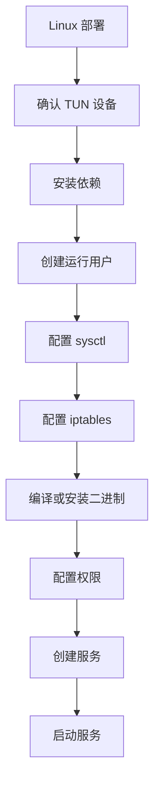

1. 确认 `/dev/net/tun` 存在
2. 安装系统依赖：`apt install iproute2 iptables`
3. 编译或获取 Linux 二进制
4. 配置内核参数：
   ```bash
   sysctl -w net.ipv4.ip_forward=1
   sysctl -w net.ipv6.conf.all.forwarding=1
   ```
5. 配置防火墙规则（根据需要）
6. 创建非 root 运行用户（如需要）
7. 使用 systemd 管理服务
8. 启动并验证

### Linux 部署检查表

| 检查项 | 命令 | 预期结果 |
|--------|------|----------|
| TUN 设备 | `ls -la /dev/net/tun` | 存在且可访问 |
| 权限 | `id` | uid=0 (root) |
| 端口监听 | `ss -tlnp \| grep ppp` | 显示监听端口 |
| iptables | `iptables -L -n` | 显示规则 |

## macOS 部署

### 环境要求

| 项目 | 要求 |
|------|------|
| 操作系统 | macOS 10.15+ |
| 架构 | x64, Apple Silicon |
| 权限 | root (sudo) |
| 工具 | ip, ifconfig |

### macOS 特有配置

```json
{
  "macos": {
    "tun": {
      "device": "/dev/utun",
      "auto-create": true
    },
    "route": {
      "method": "route"
    },
    "dns": {
      "override": true,
      "method": "scutil"
    }
  }
}
```

### macOS 部署步骤

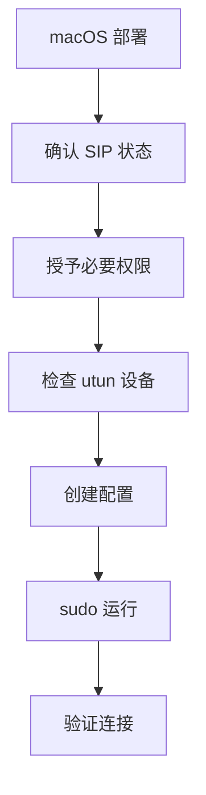

1. 确认 System Integrity Protection (SIP) 状态
2. 准备配置文件
3. 使用 sudo 运行客户端/服务端
4. 允许系统修改网络（如提示）
5. 验证连接

### macOS 部署检查表

| 检查项 | 命令 | 预期结果 |
|--------|------|----------|
| UTUN 设备 | `ifconfig -a \| grep utun` | 显示 utun 设备 |
| 管理员权限 | `sudo -v` | 验证成功 |
| 网络状态 | `netstat -an \| grep 443` | LISTENING |

## Android 部署

### 环境要求

| 项目 | 要求 |
|------|------|
| Android 版本 | 7.0+ (API 24+) |
| 架构 | ARM64, x64 |
| 权限 | VPN 权限 |

### Android 部署架构

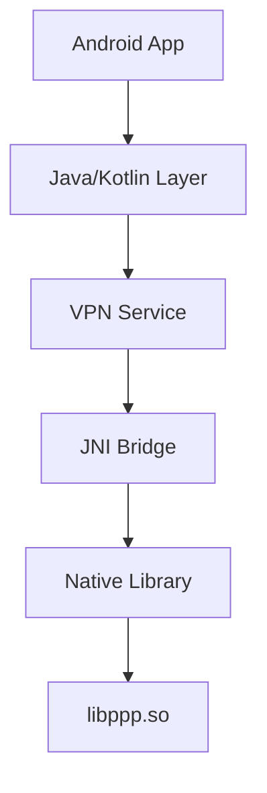

### Android 部署步骤

1. **创建或使用宿主 App**
   - Android 应用需要实现 VPN Service
   - 使用 VpnService.Builder 创建接口

2. **集成 Native Library**
   - 将编译好的 `libppp.so` 集成到 app
   - 在 JNI 层调用 native 方法

3. **实现 protect 方法**
   - 确保隧道流量不走系统 VPN
   - 使用 `protect(int socket)` 方法

4. **配置 AndroidManifest**
   ```xml
   <uses-permission android:name="android.permission.INTERNET"/>
   <uses-permission android:name="android.permission.FOREGROUND"/>
   <service android:name=".PppVpnService"
           android:permission="android.permission.BIND_VPN_SERVICE">
       <intent-filter>
           <action android:name="android.net.VpnService"/>
       </intent-filter>
   </service>
   ```

5. **运行时流程**
   ```java
   // 1. 准备 VPN
   Intent intent = VpnService.prepare(this);
   if (intent != null) {
       startActivityForResult(intent, 0);
   } else {
       // 2. 启动服务
       startService(new Intent(this, PppVpnService.class));
   }
   ```

### Android 部署配置

```json
{
  "android": {
    "vpn": {
      "mtu": 1400,
      "dns": [
        "8.8.8.8",
        "8.8.4.4"
      ]
    },
    "native": {
      "library": "libppp.so",
      "entry": "Java_com_example_ppp_PppNative_start"
    }
  }
}
```

### Android 部署检查表

| 检查项 | 方法 | 预期结果 |
|--------|------|----------|
| VPN 权限 | 用户授权 | 授权成功 |
| TUN fd | VpnService | 有效文件描述符 |
| 网络连接 | ConnectivityManager | 网络可用 |
| 后台运行 | Service | 持续运行 |

---

# 第四部分：网络要求

## 端口要求

### 服务端端口

| 端口 | 协议 | 用途 | 防火墙要求 |
|------|------|------|------------|
| 443 | TCP | 主服务端口 (TCP) | 允许入口 |
| 443 | UDP | 主服务端口 (UDP/static) | 允许入口 |
| 80 | TCP | HTTP/WebSocket | 允许入口 |
| 443 | TCP | WSS | 允许入口 |
| 5000 | UDP | Static packet | 允许入口 |
| 5001 | UDP | Static backup | 允许入口 |

### 客户端端口

| 端口 | 协议 | 用途 | 说明 |
|------|------|------|------|
| 动态 | TCP | outgoing | 连接到服务端 |
| 动态 | UDP | outgoing | static 模式 |
| 1080 | TCP | HTTP 代理 | 本地代理 |
| 1081 | TCP | SOCKS5 代理 | 本地代理 |

### 端口分配表

| 服务类型 | 端口范围 | 推荐端口 | 说明 |
|---------|----------|----------|------|
| TCP 服务 | 1-65535 | 443 | 主服务端口 |
| UDP 服务 | 1-65535 | 443, 5000 | static 模式 |
| WS 服务 | 1-65535 | 80 | 明文 WebSocket |
| WSS 服务 | 1-65535 | 443 | TLS WebSocket |
| HTTP 代理 | 1-65535 | 1080 | 本地 HTTP 代理 |
| SOCKS5 | 1-65535 | 1081 | 本地 SOCKS5 |

## 协议要求

### 支持的协议

| 协议 | 端口 | 加密 | 说明 |
|------|------|------|------|
| TCP | 443 | 可选 TLS | 主协议 |
| UDP | 443/5000 | 可选 | static 模式 |
| WebSocket | 80 | 可选 TLS | WS |
| WebSocket Secure | 443 | TLS | WSS |

### 协议选择指南

| 场景 | 推荐协议 | 原因 |
|------|----------|------|
| 常规使用 | TCP + TLS | 稳定可靠 |
| 低延迟需求 | UDP | 减少延迟 |
| 受限网络 | WSS | 穿透防火墙 |
| 移动网络 | Static UDP | 抗丢包 |

## 网络拓扑要求

### 基本网络要求

| 项目 | 要求 | 说明 |
|------|------|------|
| 带宽 | 1Mbps+ | 最小需求 |
| 延迟 | < 300ms | 最佳体验 |
| 丢包率 | < 5% | 可接受范围 |
| MTU | 1400 | 推荐值 |

### 网络类型兼容性

| 网络类型 | 支持情况 | 说明 |
|----------|----------|------|
| NAT | 完全支持 | 需要端口映射 |
| 防火墙后 | 支持 | 需要开放端口 |
| 代理后 | 部分支持 | 仅支持 HTTP 代理 |
| CGNAT | 不支持 | 需要公网 IP |
| Tor | 不支持 | 不兼容 |

### 出站规则

| 目标 | 规则 |
|------|------|
| 服务端 IP | 允许 TCP/UDP 出站 |
| 特定端口 | 开放服务端端口 |
| DNS | 允许 UDP 53 |

---

# 第五部分：安全考虑

## 认证与授权

### 服务端认证

| 项目 | 要求 | 优先级 |
|------|------|--------|
| TLS 证书 | 有效证书链 | 必须 |
| 证书验证 | 验证过期和颁发者 | 必须 |
| SNI | 匹配证书域名 | 必须 |

### 客户端认证

| 项目 | 要求 | 优先级 |
|------|------|--------|
| 预共享密钥 | 安全存储 | 推荐 |
| 证书认证 | 双向 TLS | 可选 |
| token 认证 | 短期 token | 可选 |

### 密钥管理


## 数据安全

### 传输加密

| 加密级别 | 说明 | 适用场景 |
|----------|------|----------|
| TLS 1.3 | 推荐 | 生产环境 |
| TLS 1.2 | 最低要求 | 兼容环境 |
| 自定义 | 不推荐 | 测试环境 |

### 加密算法

| 算法 | 推荐 | 用途 |
|------|------|------|
| TLS | AES-256-GCM | 传输加密 |
| 签名 | ECDSA P-256 | 证书签名 |
| 哈希 | SHA-256 | 完整性 |

## 访问控制

### 防火墙规则

| 规则类型 | 说明 |
|----------|------|
| 入站白名单 | 仅允许指定来源 |
| 出站限制 | 限制非必要连接 |
| 会话限制 | 限制并发连接数 |

### 连接限制

```json
{
  "security": {
    "connection": {
      "max-per-ip": 10,
      "max-total": 1000,
      "timeout": 300
    },
    "rate": {
      "limit": "100/minute",
      "burst": 20
    }
  }
}
```

## 安全最佳实践

### 部署安全检查表

| 项目 | 操作 | 说明 |
|------|------|------|
| 权限 | 最小权限原则 | 仅授予必要权限 |
| 服务 | 禁用 root 运行 | 使用专用用户 |
| 日志 | 审计日志 | 记录访问行为 |
| 更新 | 定期更新 | 及时打补丁 |
| 备份 | 加密备份 | 保护配置 |
| 监控 | 入侵检测 | 监控异常 |

### 安全配置示例

```json
{
  "security": {
    "tls": {
      "min-version": "1.2",
      "ciphers": [
        "ECDHE-RSA-AES256-GCM-SHA384",
        "ECDHE-RSA-AES128-GCM-SHA256"
      ],
      "verify-client": true
    },
    "firewall": {
      "whitelist": [
        "10.0.0.0/8",
        "192.168.0.0/16"
      ],
      "max-connections": 1000
    },
    "audit": {
      "enabled": true,
      "level": "verbose",
      "retention": 30
    }
  }
}
```

### 常见安全威胁

| 威胁 | 防护措施 |
|------|----------|
| 中间人攻击 | 启用 TLS 验证 |
| 重放攻击 | 使用时间戳/nonce |
| 暴力破解 | 限制连接频率 |
| 数据泄露 | 加密存储 |
| 未授权访问 | 强认证 |

---

# 第六部分：部署流程图

## 完整部署架构图

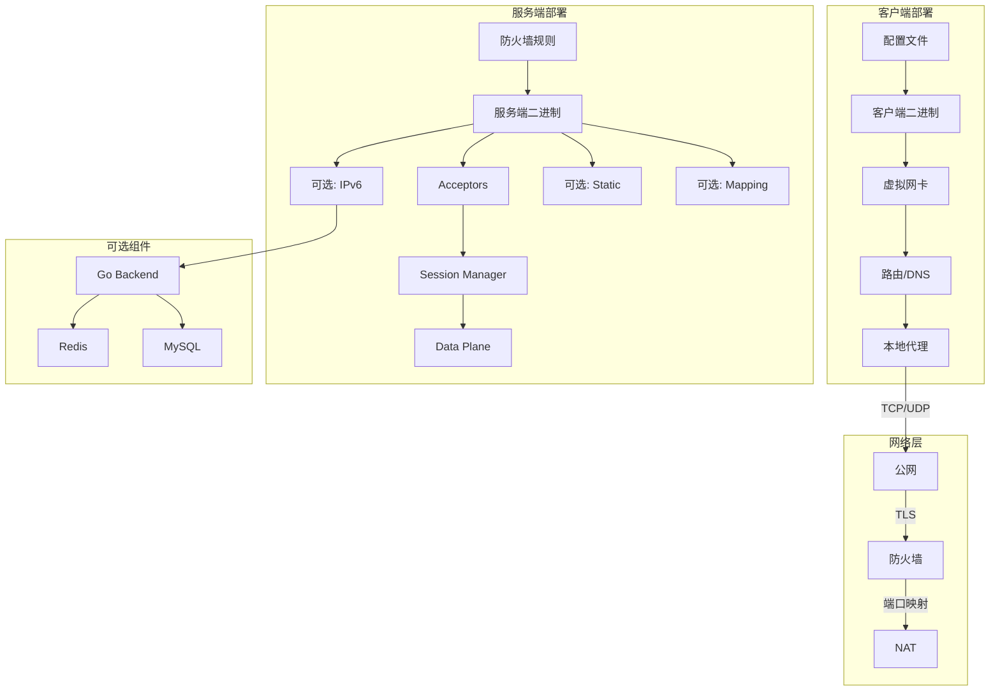

## 客户端连接流程

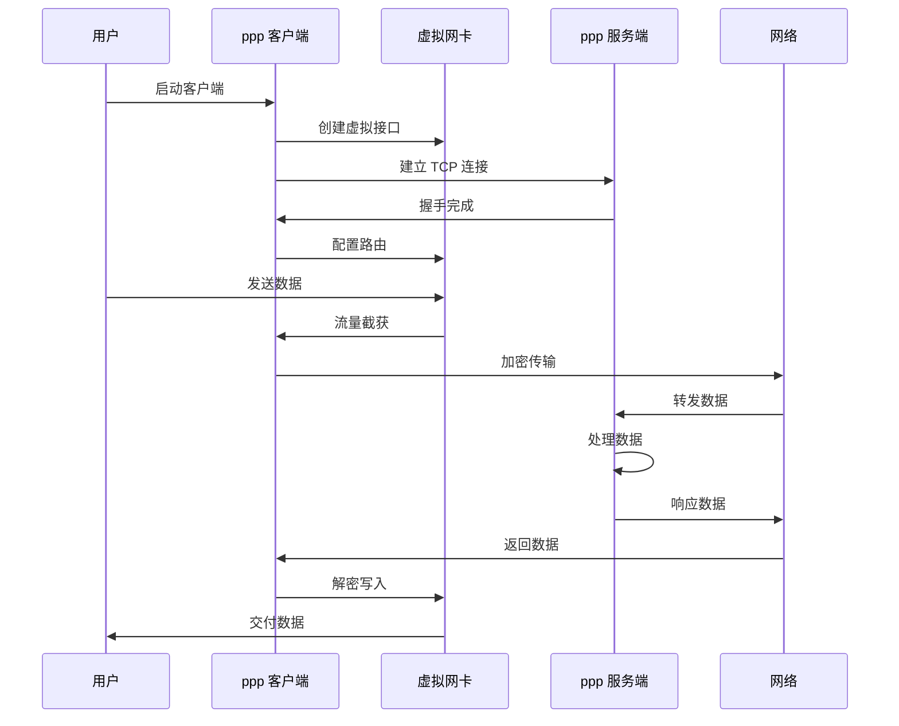

## 服务端请求处理流程

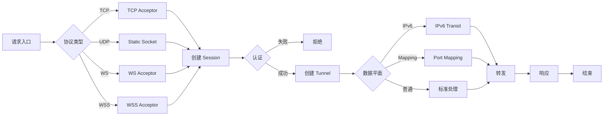

## 混合部署架构

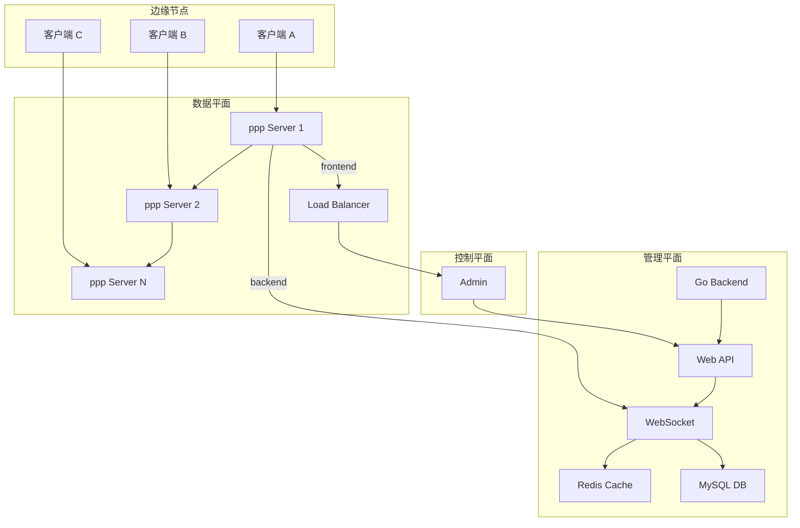

---

# 第七部分：部署配置表

## 服务端配置检查表

| 类别 | 配置项 | 必填 | 默认值 | 说明 |
|------|--------|------|--------|------|
| 服务 | mode | 是 | server | 运行模式 |
| 监听 | listener.tcp.port | 是 | 443 | TCP 端口 |
| 监听 | listener.tcp.enabled | 否 | true | 启用 TCP |
| 监听 | listener.udp.port | 否 | 443 | UDP 端口 |
| 监听 | listener.udp.enabled | 否 | false | 启用 UDP |
| 监听 | listener.ws.port | 否 | 80 | WS 端口 |
| 监听 | listener.wss.port | 否 | 443 | WSS 端口 |
| 监听 | listener.wss.cert | 否 | - | 证书路径 |
| 监听 | listener.wss.key | 否 | - | 私钥路径 |
| 防火墙 | firewall.enabled | 否 | true | 启用防火墙 |
| 防火墙 | firewall.rules-file | 是 | - | 规则文件 |
| IPv6 | ipv6.enabled | 否 | false | 启用 IPv6 |
| IPv6 | ipv6.mode | 否 | nat66 | NAT66/GUA |
| IPv6 | ipv6.uplink | 否 | - | 上联接口 |
| Static | static.enabled | 否 | false | 启用 static |
| Static | static.port | 否 | 5000 | static 端口 |
| Mapping | mapping.enabled | 否 | false | 启用映射 |
| Backend | backend | 否 | - | 后端地址 |
| Backend | backend-key | 否 | - | 后端密钥 |
| 日志 | logging.level | 否 | info | 日志级别 |
| 日志 | logging.file | 否 | server.log | 日志文件 |

## 客户端配置检查表

| 类别 | 配置项 | 必填 | 默认值 | 说明 |
|------|--------|------|--------|------|
| 服务 | mode | 是 | client | 运行模式 |
| 服务端 | server.address | 是 | - | 服务端地址 |
| 服务端 | server.port | 是 | 443 | 服务端端口 |
| 服务端 | server.protocol | 否 | tcp | 连接协议 |
| 服务端 | server.tls.enabled | 否 | true | 启用 TLS |
| 服务端 | server.tls.verify | 否 | true | 验证证书 |
| 服务端 | server.tls.sni | 否 | - | SNI 主机名 |
| 虚拟 | virtual.enabled | 是 | true | 启用虚拟网卡 |
| 虚拟 | virtual.type | 否 | tun | 网卡类型 |
| 虚拟 | virtual.mtu | 否 | 1400 | MTU 值 |
| 虚拟 | virtual.ipv6.enabled | 否 | true | 启用 IPv6 |
| 路由 | route.default | 否 | false | 默认路由 |
| 路由 | route.bypass | 否 | [] | 绕过网段 |
| 路由 | route.include | 否 | [] | 包括网段 |
| DNS | dns.enabled | 否 | true | 启用 DNS |
| DNS | dns.servers | 否 | [] | DNS 服务器 |
| DNS | dns.override | 否 | true | 覆盖 DNS |
| DNS | dns.rules | 否 | [] | DNS 规则 |
| 代理 | proxy.enabled | 否 | false | 启用代理 |
| 代理 | proxy.http.port | 否 | 1080 | HTTP 端口 |
| 代理 | proxy.socks5.port | 否 | 1081 | SOCKS 端口 |
| Static | static.enabled | 否 | false | 启用 static |
| Static | static.server | 否 | - | static 服务器 |
| Static | static.port | 否 | 5000 | static 端口 |
| 日志 | logging.level | 否 | info | 日志级别 |
| 日志 | logging.file | 否 | client.log | 日志文件 |

## 环境差异表

| 功能 | Windows | Linux | macOS | Android |
|------|---------|-------|-------|---------|
| 虚拟网卡 | Wintun/TAP | tun/tap | utun | VPN API |
| 路由修改 | route add | ip route | route | - |
| DNS 修改 | registry | resolv.conf | scutil | VpnService |
| 防火墙 | netsh | iptables | packetfilter | - |
| 以太网 | 支持 | 支持 | 支持 | 不支持 |
| IPv6 | 部分 | 完全 | 完全 | 部分 |
| Static | 支持 | 支持 | 支持 | 支持 |
| 映射 | 支持 | 支持 | 支持 | 支持 |

---

# 第八部分：故障排除

## 常见问题

### 连接问题

| 问题 | 可能原因 | 解决方法 |
|------|----------|----------|
| 无法连接 | 端口未开放 | 检查防火墙 |
| 无法连接 | TLS 错误 | 验证证书 |
| 无法连接 | 网络不通 | 检查路由 |
| 超时 | 延迟过高 | 优化网络 |
| 超时 | 被拦截 | 尝试 WSS |

### 性能问题

| 问题 | 可能原因 | 解决方法 |
|------|----------|----------|
| 速度慢 | 带宽不足 | 升级带宽 |
| 速度慢 | 延迟高 | 选近服务器 |
| 丢包 | MTU 过大 | 减小 MTU |
| CPU 高 | 配置错误 | 检查配置 |

### 安全问题

| 问题 | 可能原因 | 解决方法 |
|------|----------|----------|
| 证书警告 | 自签名 | 替换证书 |
| 认证失败 | 密钥错误 | 检查配置 |
| 泄露 | 未加密 | 启用 TLS |

---

# 第九部分：部署示例

## 示例 1：基础服务端部署

```bash
# 1. 安装依赖
apt update && apt install -y iproute2 iptables

# 2. 创建配置
cat > /etc/ppp/server.json << 'EOF'
{
  "server": {
    "mode": "server",
    "listener": {
      "tcp": {
        "enabled": true,
        "port": 443
      }
    },
    "firewall": {
      "enabled": true,
      "rules-file": "/etc/ppp/firewall.rules"
    }
  }
}
EOF

# 3. 创建防火墙规则
cat > /etc/ppp/firewall.rules << 'EOF'
ACCEPT,ESTABLISHED
ACCEPT,TCP,443
DROP,ALL
EOF

# 4. 启动服务
./ppp -c /etc/ppp/server.json -d
```

## 示例 2：基础客户端部署

```bash
# 1. 创建配置
cat > config.json << 'EOF'
{
  "client": {
    "mode": "client",
    "server": {
      "address": "your-server.com",
      "port": 443
    },
    "virtual": {
      "enabled": true
    },
    "route": {
      "default": false,
      "bypass": [
        "10.0.0.0/8",
        "127.0.0.0/8"
      ]
    }
  }
}
EOF

# 2. 启动客户端
sudo ./ppp -c config.json
```

## 示例 3：高可用部署

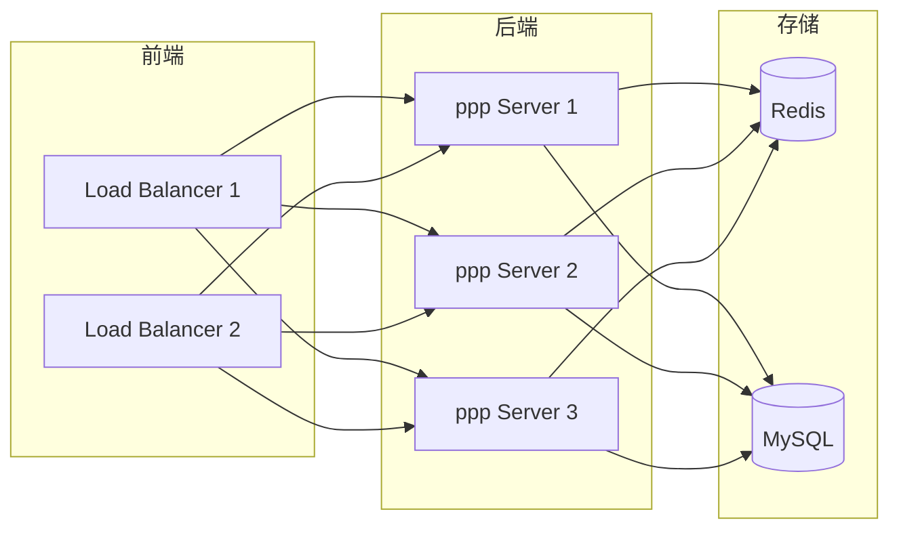

---

# 相关文档

- [`CONFIGURATION_CN.md`](CONFIGURATION_CN.md)
- [`CLI_REFERENCE_CN.md`](CLI_REFERENCE_CN.md)
- [`PLATFORMS_CN.md`](PLATFORMS_CN.md)
- [`CLIENT_ARCHITECTURE_CN.md`](CLIENT_ARCHITECTURE_CN.md)
- [`SERVER_ARCHITECTURE_CN.md`](SERVER_ARCHITECTURE_CN.md)
- [`OPERATIONS_CN.md`](OPERATIONS_CN.md)
- [`MANAGEMENT_BACKEND_CN.md`](MANAGEMENT_BACKEND_CN.md)