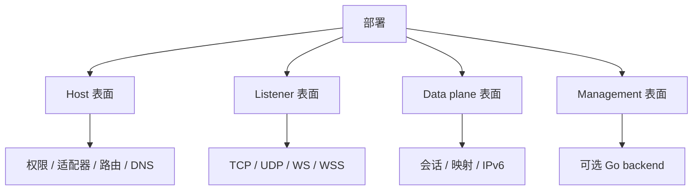

# 部署模型

[English Version](DEPLOYMENT.md)

## 范围

本文解释 OPENPPP2 按源码结构如何部署。

## 主要事实

- C++ 运行时是一个单一可执行文件：`ppp`。
- 它可以运行在 client 模式或 server 模式。
- 服务端可以通过 `server.backend` 接入可选的 Go backend。

## 部署分成两层

部署有 node 层和 host 层。

| 层 | 含义 |
|---|---|
| node 层 | 持久 JSON、角色、backend 和服务意图 |
| host 层 | 适配器、路由、DNS、权限、本地代理表面 |

源码把这两层当作相关但不完全相同的问题。

## 硬性要求

- 需要 administrator/root 权限。
- 需要真实的配置文件。

`LoadConfiguration(...)` 会先找显式的 `-c` / `--config` 形式，然后找 `./config.json`，最后找 `./appsettings.json`。

## 部署表面

OPENPPP2 的部署可以看成四个表面：

- host 表面：适配器、路由、DNS、权限。
- listener 表面：TCP/UDP/WS/WSS 入口。
- data plane 表面：会话、映射、static 路径、IPv6 transit。
- management 表面：可选 Go backend。

## 客户端部署

客户端部署会创建虚拟适配器，准备 route / DNS / bypass 输入，打开 `VEthernetNetworkSwitcher`，然后建立远程 exchanger 会话。

实际顺序：

1. 获取权限。
2. 载入配置。
3. 准备 NIC / gateway / TAP。
4. 打开 client switcher。
5. 连接 exchanger。
6. 应用路由和 DNS。
7. 进入转发状态。

## 服务端部署

服务端部署会打开监听器、防火墙、namespace cache、datagram socket、可选的 managed backend，以及通过 `VirtualEthernetSwitcher` 提供的可选 IPv6 transit plumbing。

实际顺序：

1. 获取权限。
2. 载入配置。
3. 打开监听器。
4. 创建会话 switcher。
5. 可选打开 managed backend。
6. 可选启用 IPv6 transit。
7. 接收并路由会话。

## Go Backend

Go backend 是可选的，用于 managed deployment，而不是核心 data plane。

也就是说，即使没有它，C++ 可执行文件也能工作；backend 扩展的是策略和管理，而不是定义包传输。

## 部署检查清单

1. 配置文件存在。
2. 权限已获得。
3. 宿主接口已知。
4. 角色已选定。
5. 监听器或适配器依赖可用。
6. 如果启用了 backend，则 backend 可达。

## 运维预期

部署成功不代表 host state 不再变化。实际运行中还会持续看到：

- 路由状态变化
- DNS 访问状态变化
- proxy 状态变化
- IPv6 transit 行为变化

## 相关文档

- `CONFIGURATION_CN.md`
- `PLATFORMS_CN.md`
- `OPERATIONS_CN.md`

## 主结论

OPENPPP2 的部署不是“运行一个二进制”这么简单。它是一个分阶段的 host + node setup，必须让可执行文件、权限、适配器、路由、监听器和可选 backend 一起对齐。
