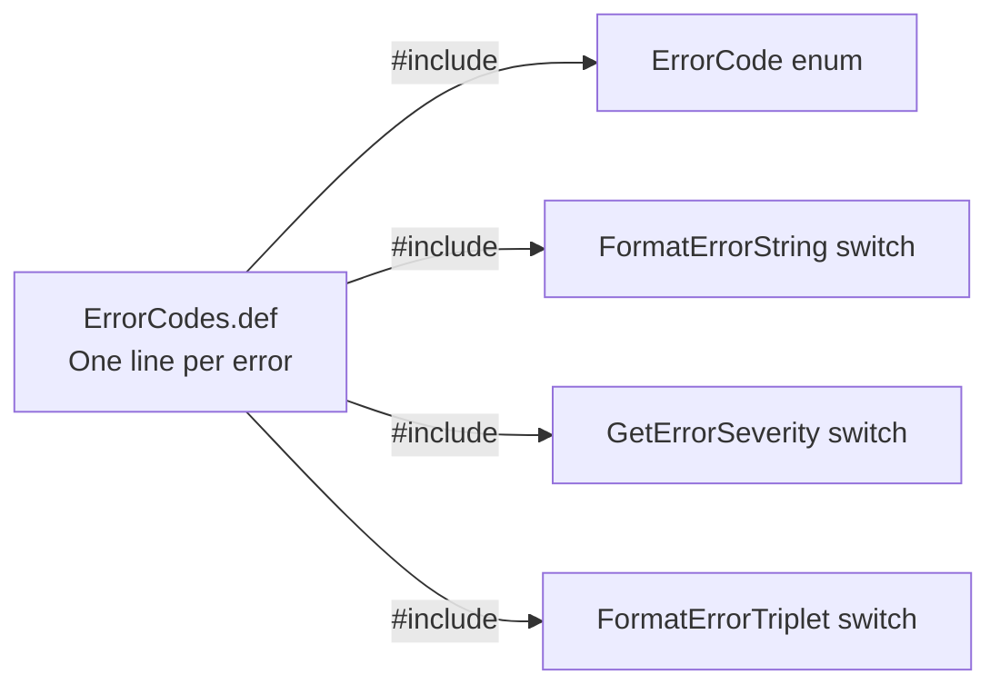
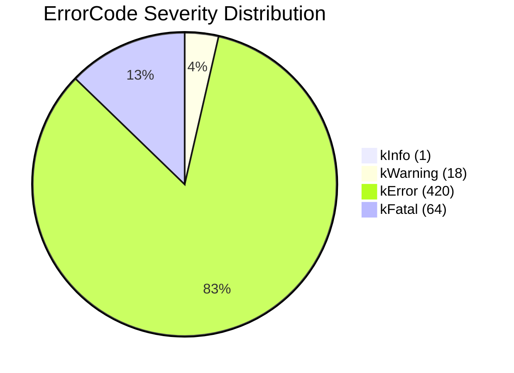
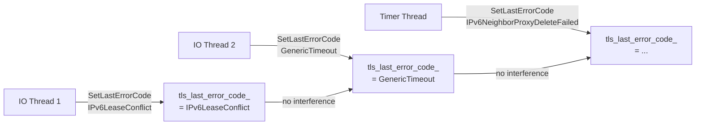
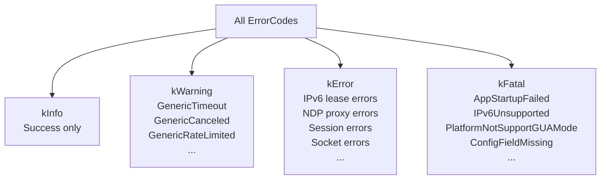
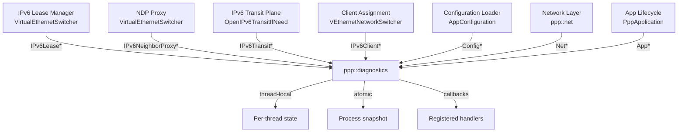

# Diagnostics Error System

> **Subsystem:** `ppp::diagnostics`  
> **Files:**  
> - `ppp/diagnostics/ErrorCodes.def` — X-macro error code definitions (503 lines)  
> - `ppp/diagnostics/Error.h` — Public API, `ErrorCode` enum, `ErrorSeverity` enum  
> - `ppp/diagnostics/Error.cpp` — Free function delegations  
> - `ppp/diagnostics/ErrorHandler.h` — `ErrorHandler` singleton declaration  
> - `ppp/diagnostics/ErrorHandler.cpp` — `ErrorHandler` implementation (133 lines)

---

## Table of Contents

1. [Overview and Design Goals](#1-overview-and-design-goals)
2. [Architecture](#2-architecture)
3. [X-Macro Expansion: ErrorCodes.def](#3-x-macro-expansion-errorcodesdef)
4. [ErrorSeverity Enum](#4-errorseverity-enum)
5. [ErrorCode Enum](#5-errorcode-enum)
6. [ErrorHandler Singleton](#6-errorhandler-singleton)
7. [Thread-Local Error State](#7-thread-local-error-state)
8. [Cross-Thread Atomic Snapshot](#8-cross-thread-atomic-snapshot)
9. [SetLastErrorCode: The Central Operation](#9-setlasterrorcode-the-central-operation)
10. [GetLastErrorCode and GetLastErrorCodeSnapshot](#10-getlasterrorcode-and-getlasterrorccodesnapshot)
11. [FormatErrorTriplet](#11-formaterrortriplet)
12. [RegisterErrorHandler](#12-registererrorhandler)
13. [Consumer Patterns (N5 Rule)](#13-consumer-patterns-n5-rule)
14. [Severity Classification Reference](#14-severity-classification-reference)
15. [Integration with Other Subsystems](#15-integration-with-other-subsystems)
16. [Extending ErrorCodes.def](#16-extending-errorcodesdef)

---

## 1. Overview and Design Goals

The `ppp::diagnostics` error system provides a **structured, thread-safe, allocation-free** mechanism for recording and observing error conditions throughout the openppp2 framework. It replaces ad-hoc logging (which would be inappropriate in a performance-critical network stack) with a disciplined error-code propagation model.

### Design Goals

| Goal | How It Is Achieved |
|---|---|
| **Zero allocation on hot path** | Error codes are `uint32_t`-backed enums; `SetLastErrorCode` stores to `thread_local` and an atomic. No heap. |
| **Thread isolation** | Each thread maintains its own `tls_last_error_code_`. No locking on read or write of per-thread state. |
| **Process-wide observability** | `last_error_code_snapshot_` is a `std::atomic<uint32_t>` visible to all threads. |
| **Single source of truth** | All 503 error codes are defined in one file (`ErrorCodes.def`) using X-macros. |
| **No exceptions for error reporting** | `SetLastErrorCode` is `noexcept`. Error conditions are communicated via return values. |
| **Observer pattern** | Named handlers registered via `RegisterErrorHandler` are called synchronously on error. |
| **Severity awareness** | Each error code carries a `kInfo`/`kWarning`/`kError`/`kFatal` classification. |

---

## 2. Architecture

```mermaid
graph TB
    subgraph ppp/diagnostics
        Def[ErrorCodes.def\nX-macro definitions\n503 error codes]
        Eh[Error.h\nErrorSeverity enum\nErrorCode enum\nfree functions]
        Ec[Error.cpp\ndelegates to ErrorHandler::GetDefault()]
        Ehh[ErrorHandler.h\nErrorHandler class\nsingleton]
        Ehc[ErrorHandler.cpp\nimplementation\nthread-local storage\natomic snapshot\nhandler dispatch]
    end

    subgraph Per-Thread State
        TLS1[Thread 1\ntls_last_error_code_\ntls_last_error_timestamp_]
        TLS2[Thread 2\ntls_last_error_code_\ntls_last_error_timestamp_]
        TLSN[Thread N\ntls_last_error_code_\ntls_last_error_timestamp_]
    end

    subgraph Process-Wide State
        Snap[last_error_code_snapshot_\nstd::atomic<uint32_t>]
        TS[last_error_timestamp_snapshot_\nstd::atomic<uint64_t>]
        Handlers[error_handlers_\nunordered_map<string, function>]
        Mutex[error_handlers_sync_\nstd::mutex]
    end

    Def --> Eh
    Eh --> Ec
    Ec -->|delegates| Ehc
    Ehh --> Ehc
    Ehc --> TLS1
    Ehc --> TLS2
    Ehc --> TLSN
    Ehc --> Snap
    Ehc --> TS
    Ehc --> Handlers
    Mutex -->|serializes registration| Handlers
```

---

## 3. X-Macro Expansion: `ErrorCodes.def`

The entire error code catalog is defined in `ppp/diagnostics/ErrorCodes.def` using a single X-macro pattern:

```cpp
// ErrorCodes.def format:
X(name, text, severity)

// Examples (lines 1–25):
X(Success,                  "Success",               ErrorSeverity::kInfo)
X(GenericUnknown,           "Generic unknown error", ErrorSeverity::kError)
X(GenericTimeout,           "Operation timed out",   ErrorSeverity::kWarning)
X(AppStartupFailed,         "Application startup failed", ErrorSeverity::kFatal)
X(IPv6LeasePoolExhausted,   "The IPv6 lease pool has no remaining addresses available ...",
                                                     ErrorSeverity::kError)
```

The file is included three times in `ErrorHandler.cpp`, each time with a different expansion of `X`:

### Expansion 1: `ErrorCode` Enum Generation (`Error.h`, line 36)

```cpp
enum class ErrorCode : uint32_t {
#define X(name, text, severity) name,
#include <ppp/diagnostics/ErrorCodes.def>
#undef X
};
```

This generates:
```cpp
enum class ErrorCode : uint32_t {
    Success = 0,
    GenericUnknown = 1,
    GenericInvalidArgument = 2,
    // ... 500+ more
};
```

The enum values are assigned sequentially starting from 0, matching their line order in `ErrorCodes.def`. This numeric ID is used in `FormatErrorTriplet` output and in `last_error_code_snapshot_`.

### Expansion 2: `FormatErrorString` (`ErrorHandler.cpp`, line 55)

```cpp
const char* ErrorHandler::FormatErrorString(ErrorCode code) noexcept {
    switch (code) {
#define X(name, text, severity) case ErrorCode::name: return text;
#include <ppp/diagnostics/ErrorCodes.def>
#undef X
    default: return "Unknown error";
    }
}
```

### Expansion 3: `GetErrorSeverity` (`ErrorHandler.cpp`, line 64)

```cpp
ErrorSeverity ErrorHandler::GetErrorSeverity(ErrorCode code) noexcept {
    switch (code) {
#define X(name, text, severity) case ErrorCode::name: return severity;
#include <ppp/diagnostics/ErrorCodes.def>
#undef X
    default: return ErrorSeverity::kError;
    }
}
```

### Expansion 4: `FormatErrorTriplet` (`ErrorHandler.cpp`, line 97)

```cpp
switch (code) {
#define X(name, text, severity) case ErrorCode::name: \
    code_name = #name; code_message = text; break;
#include <ppp/diagnostics/ErrorCodes.def>
#undef X
}
```

### Why X-Macros?

X-macros provide a single authoritative source for all error metadata. The alternatives — separate enums, string tables, and severity arrays — would require maintaining four parallel data structures and are error-prone when adding new codes. With X-macros:

- Adding a new error code requires exactly **one line** in `ErrorCodes.def`.
- All four generated structures update automatically at compile time.
- No runtime initialization is required; all switch tables are compile-time constants.



---

## 4. `ErrorSeverity` Enum

**Location:** `ppp/diagnostics/Error.h`, line 24

```cpp
enum class ErrorSeverity : uint8_t {
    kInfo    = 0, ///< Informational; normal operation with no error condition.
    kWarning = 1, ///< Recoverable; degraded service may continue.
    kError   = 2, ///< Non-recoverable for the affected session or operation.
    kFatal   = 3, ///< Unrecoverable; process must halt or restart.
};
```

### Severity Semantics

| Level | Value | Meaning | Example Codes |
|---|---|---|---|
| `kInfo` | 0 | Normal; not an error. Only `Success` has this level. | `Success` |
| `kWarning` | 1 | Degraded service; operation retried or skipped gracefully. | `GenericTimeout`, `GenericCanceled`, `GenericRateLimited` |
| `kError` | 2 | Operation failed; session may be terminated but process continues. | Most IPv6 and session errors |
| `kFatal` | 3 | Unrecoverable; process should exit and restart. | `AppStartupFailed`, `IPv6Unsupported`, `PlatformNotSupportGUAMode` |

### Severity Distribution (approximate, from ErrorCodes.def)



---

## 5. `ErrorCode` Enum

**Location:** `ppp/diagnostics/Error.h`, line 35

```cpp
enum class ErrorCode : uint32_t {
#define X(name, text, severity) name,
#include <ppp/diagnostics/ErrorCodes.def>
#undef X
};
```

`ErrorCode` is a strongly-typed `uint32_t` enum with 503 values (as of the current `ErrorCodes.def`). The numeric value of each code is its 0-based line number in `ErrorCodes.def`.

### Category Structure of `ErrorCodes.def`

The file is organized into logical sections:

| Line Range | Category | Count |
|---|---|---|
| 1 | `Success` | 1 |
| 2–25 | `Generic*` — platform-neutral base errors | 24 |
| 27–41 | `App*` — application lifecycle errors | 15 |
| 43–60 | `Config*` — configuration parsing errors | 18 |
| ~61–100 | `Net*` / socket errors | ~40 |
| ~101–200 | Session / handshake / authentication | ~100 |
| ~201–310 | IPv6 subsystem | ~110 |
| ~311–460 | TAP, TUN, routing | ~150 |
| ~461–503 | PPP / protocol / misc | ~43 |

---

## 6. `ErrorHandler` Singleton

**Location:** `ppp/diagnostics/ErrorHandler.h`, line 46; `ErrorHandler.cpp`, line 9

```cpp
class ErrorHandler final {
public:
    static ErrorHandler& GetDefault() noexcept;
    // ... methods
private:
    ErrorHandler() noexcept = default;
    ErrorHandler(const ErrorHandler&) = delete;
    ErrorHandler& operator=(const ErrorHandler&) = delete;

    static thread_local ErrorCode  tls_last_error_code_;
    static thread_local uint64_t   tls_last_error_timestamp_;

    std::atomic<uint32_t>          last_error_code_snapshot_{0};
    std::atomic<uint64_t>          last_error_timestamp_snapshot_{0};

    std::mutex                     error_handlers_sync_;
    ppp::unordered_map<ppp::string, ppp::function<void(int err)>> error_handlers_;
};
```

`GetDefault()` returns a Meyers singleton:

```cpp
ErrorHandler& ErrorHandler::GetDefault() noexcept {
    static ErrorHandler default_error_handler;  // line 10
    return default_error_handler;
}
```

This is thread-safe in C++11 and later: static local initialization is guaranteed to occur exactly once, even under concurrent calls.

All free functions in `Error.h` delegate to this singleton:

```cpp
// Error.cpp (approximate):
ErrorCode GetLastErrorCode() noexcept {
    return ErrorHandler::GetDefault().GetLastErrorCode();
}
ErrorCode SetLastErrorCode(ErrorCode code) noexcept {
    return ErrorHandler::GetDefault().SetLastErrorCode(code);
}
// etc.
```

---

## 7. Thread-Local Error State

**Location:** `ErrorHandler.cpp`, lines 6–7

```cpp
thread_local ErrorCode ErrorHandler::tls_last_error_code_ = ErrorCode::Success;
thread_local uint64_t  ErrorHandler::tls_last_error_timestamp_ = 0;
```

Each OS thread has its own independent copy of:
- `tls_last_error_code_` — the most recent error code set by any call on this thread.
- `tls_last_error_timestamp_` — the monotonic tick count from `ppp::threading::Executors::GetTickCount()` when the last error was set.



**Key guarantees:**
- Reading `GetLastErrorCode()` from thread A never observes an error set by thread B.
- No lock is needed to read or write `tls_last_error_code_`.
- The timestamp enables ordering: if two errors are set sequentially on the same thread, the second always has a higher timestamp.

---

## 8. Cross-Thread Atomic Snapshot

**Location:** `ErrorHandler.h`, lines 167–169

```cpp
std::atomic<uint32_t> last_error_code_snapshot_{0};
std::atomic<uint64_t> last_error_timestamp_snapshot_{0};
```

`last_error_code_snapshot_` provides a **last-writer-wins** view of the most recent error across all threads. It is updated atomically inside `SetLastErrorCode` (`.cpp`, lines 30–31):

```cpp
last_error_code_snapshot_.store(
    static_cast<uint32_t>(code), std::memory_order_relaxed);
last_error_timestamp_snapshot_.store(
    tls_last_error_timestamp_, std::memory_order_relaxed);
```

`memory_order_relaxed` is used because:
1. The snapshot is advisory — it provides a best-effort view, not a precise causal ordering.
2. The timestamp is stored in the same write, providing a paired value for staleness assessment.
3. No acquire/release fence is needed; the consumer's use of the snapshot does not need to synchronize with the producer's other memory operations.

```mermaid
sequenceDiagram
    participant T1 as Thread 1 (IO)
    participant T2 as Thread 2 (Timer)
    participant Mon as Monitoring Thread
    participant Snap as last_error_code_snapshot_

    T1->>Snap: store(IPv6LeaseConflict, relaxed) [t=100ms]
    T2->>Snap: store(GenericTimeout, relaxed) [t=105ms]
    Mon->>Snap: load(relaxed) → GenericTimeout [t=110ms]
    Note over Mon: Sees most recent write; may miss T1's write
```

### When to Use the Snapshot

The snapshot is intended for:
- Management API endpoints that report the last system error.
- Health check probes that determine whether the server has recently encountered an error.
- Watchdog threads that escalate `kFatal` errors to trigger a restart.

It is **not** suitable for precise error tracking within a single operation chain. For that, use `GetLastErrorCode()` on the calling thread.

---

## 9. `SetLastErrorCode`: The Central Operation

**Location:** `ErrorHandler.cpp`, lines 27–52

```cpp
ErrorCode ErrorHandler::SetLastErrorCode(ErrorCode code) noexcept {
    // 1. Store into thread-local:
    tls_last_error_code_ = code;

    // 2. Capture timestamp:
    tls_last_error_timestamp_ = ppp::threading::Executors::GetTickCount();

    // 3. Atomic process-wide snapshot update:
    last_error_code_snapshot_.store(
        static_cast<uint32_t>(code), std::memory_order_relaxed);
    last_error_timestamp_snapshot_.store(
        tls_last_error_timestamp_, std::memory_order_relaxed);

    // 4. Snapshot the handler map (lock, copy, unlock):
    ppp::unordered_map<ppp::string, ppp::function<void(int err)>> error_handlers;
    {
        std::lock_guard<std::mutex> scope(error_handlers_sync_);
        error_handlers = error_handlers_;
    }

    // 5. Invoke each handler (outside the lock, catching exceptions):
    int error_value = static_cast<int>(code);
    for (auto&& error_handler : error_handlers) {
        if (NULLPTR == error_handler.second) { continue; }
        try {
            error_handler.second(error_value);
        } catch (...) {
            // Handler exceptions must never propagate; suppress all.
        }
    }

    return code;
}
```

### Critical Implementation Notes

1. **Handler map is copied before invocation** (line 33–37): The map is snapshot-copied under `error_handlers_sync_`, then the lock is released before handlers are called. This ensures:
   - Handlers cannot deadlock by calling `RegisterErrorHandler` (which also acquires the lock).
   - New handler registrations during dispatch do not affect the current dispatch.

2. **Exceptions are swallowed** (line 47–48): A handler that throws must not crash `SetLastErrorCode`. The `try-catch(...)` ensures the function remains `noexcept`-safe.

3. **Handlers are called synchronously**: Invocation happens on the calling thread, inside `SetLastErrorCode`. Handlers must complete quickly and must not call `SetLastErrorCode` recursively (would not deadlock, but could cause infinite recursion if the handler triggers another error).

4. **Return value**: `SetLastErrorCode` returns the same code it received. This enables patterns like:
   ```cpp
   return ppp::diagnostics::SetLastError(ErrorCode::IPv6LeaseConflict, false);
   ```

---

## 10. `GetLastErrorCode` and `GetLastErrorCodeSnapshot`

### `GetLastErrorCode` — Thread-Local Read

```cpp
// ErrorHandler.cpp : 15
ErrorCode ErrorHandler::GetLastErrorCode() noexcept {
    return tls_last_error_code_;
}
```

Returns the most recent error set by any `SetLastErrorCode` call on the **calling thread**. No synchronization needed — purely thread-local.

### `GetLastErrorCodeSnapshot` — Process-Wide Read

```cpp
// ErrorHandler.cpp : 19
ErrorCode ErrorHandler::GetLastErrorCodeSnapshot() noexcept {
    return static_cast<ErrorCode>(
        last_error_code_snapshot_.load(std::memory_order_relaxed));
}
```

Returns the most recent error set across **all threads** (last-writer-wins). Uses `memory_order_relaxed` — no ordering guarantee relative to other memory operations.

### Comparison

| Aspect | `GetLastErrorCode()` | `GetLastErrorCodeSnapshot()` |
|---|---|---|
| Scope | Per-thread | Process-wide |
| Synchronization | None (thread-local) | Atomic load |
| Use case | Within an operation chain | Health check, management API |
| Can be stale? | Never (own thread) | Yes (another thread may have set it since) |

---

## 11. `FormatErrorTriplet`

**Location:** `ErrorHandler.cpp`, lines 89–116

Produces a human-readable diagnostic string of the form:

```
<uint32_id> <CodeName>: <message text>
```

Examples:
```
0 Success: Success
301 IPv6LeasePoolExhausted: The IPv6 lease pool has no remaining addresses available after exhausting all retry attempts.
293 IPv6NeighborProxyEnableFailed: IPv6 neighbor proxy enable failed
```

### Implementation

```cpp
ppp::string ErrorHandler::FormatErrorTriplet(ErrorCode code) noexcept {
    uint32_t    numeric_id   = static_cast<uint32_t>(code);
    const char* code_name    = "Unknown";
    const char* code_message = "Unknown error";

    switch (code) {
#define X(name, text, severity) \
    case ErrorCode::name: code_name = #name; code_message = text; break;
#include <ppp/diagnostics/ErrorCodes.def>
#undef X
    default: break;
    }

    ppp::string result;
    result.reserve(128);
    result += std::to_string(numeric_id).c_str();
    result += ' ';
    result += code_name;
    result += ':';
    result += ' ';
    result += code_message;
    return result;
}
```

**Usage in diagnostics output:**

```cpp
auto triplet = ppp::diagnostics::FormatErrorTriplet(
    ppp::diagnostics::GetLastErrorCode());
// Output: "297 IPv6LeaseConflict: IPv6 lease conflict"
```

---

## 12. `RegisterErrorHandler`

**Location:** `ErrorHandler.cpp`, lines 122–131

```cpp
void ErrorHandler::RegisterErrorHandler(
    const ppp::string& key,
    const ppp::function<void(int err)>& handler) noexcept {

    std::lock_guard<std::mutex> scope(error_handlers_sync_);

    if (NULLPTR == handler) {
        error_handlers_.erase(key);
        return;
    }

    error_handlers_[key] = handler;
}
```

### Registration Semantics

- **Key-based upsert**: Registering with the same `key` replaces the previous handler.
- **Removal**: Passing `NULLPTR` as the handler removes the registration for `key`.
- **Thread safety**: Registration is serialized by `error_handlers_sync_`. However, calling `RegisterErrorHandler` after the multi-thread runtime has started is **not safe** (documented in the header).

### Registration Policy

All handlers **must** be registered before `PppApplication::Run()` starts the IO thread pool:

```cpp
// main.cpp — correct usage:
ppp::diagnostics::RegisterErrorHandler("watchdog", [](int err) {
    if (ppp::diagnostics::IsErrorFatal(
            static_cast<ppp::diagnostics::ErrorCode>(err))) {
        trigger_restart();
    }
});
PppApplication::Run();  // starts threads — no more registration after this
```

---

## 13. Consumer Patterns (N5 Rule)

The **N5 rule** is an informal convention in openppp2: when a function fails, it must follow this five-step protocol:

```
N1. Detect the failure condition.
N2. Call SetLastErrorCode(ErrorCode::SpecificError).
N3. Return the sentinel value (false / -1 / NULLPTR).
N4. Caller checks the sentinel.
N5. Caller may call GetLastErrorCode() for details.
```

### Pattern A: Boolean Return

```cpp
// Caller pattern:
bool ok = OpenIPv6NeighborProxyIfNeed();
if (!ok) {
    auto err = ppp::diagnostics::GetLastErrorCode();
    // err contains IPv6NeighborProxyEnableFailed or similar
    log_error(ppp::diagnostics::FormatErrorTriplet(err));
    return false;
}
```

### Pattern B: SetLastError Template Helpers

`Error.h` provides three template helpers for concise failure returns:

```cpp
// Returns false and sets error code:
return ppp::diagnostics::SetLastError(ErrorCode::IPv6LeaseConflict);

// Returns -1 (or other integral sentinel) and sets error code:
return ppp::diagnostics::SetLastError<int>(ErrorCode::GenericOutOfMemory);

// Returns NULLPTR and sets error code:
return ppp::diagnostics::SetLastError<SomePointer*>(ErrorCode::GenericNotFound);
```

These helpers prevent the common mistake of setting the error code but forgetting to return the sentinel:

```cpp
// Without helper — easy to forget the return:
ppp::diagnostics::SetLastErrorCode(ErrorCode::IPv6LeaseConflict);
return false;  // easy to omit in a complex function

// With helper — atomic:
return ppp::diagnostics::SetLastError(ErrorCode::IPv6LeaseConflict);
```

### Pattern C: Severity-Based Escalation

```cpp
// Watchdog / supervisor pattern:
void OnErrorObserved(int err_int) {
    auto code = static_cast<ppp::diagnostics::ErrorCode>(err_int);
    if (ppp::diagnostics::IsErrorFatal(code)) {
        // Schedule a controlled shutdown and restart.
        ScheduleRestart();
    } elif (ppp::diagnostics::GetErrorSeverity(code) ==
            ppp::diagnostics::ErrorSeverity::kWarning) {
        // Log only; continue operation.
        LogWarning(ppp::diagnostics::FormatErrorTriplet(code));
    }
}
```

---

## 14. Severity Classification Reference

Full classification summary for the major error categories:



### Fatal Codes — Operator Action Required

| Code | Message | Required Action |
|---|---|---|
| `AppStartupFailed` | Application startup failed | Check log; may need root privileges. |
| `AppAlreadyRunning` | Application already running | Remove stale PID file. |
| `AppInvalidCommandLine` | Invalid command-line arguments | Correct the launch command. |
| `AppConfigurationMissing` | Configuration missing | Create `appsettings.json`. |
| `IPv6Unsupported` | IPv6 unsupported on this platform | Switch to NAT66 or disable IPv6. |
| `PlatformNotSupportGUAMode` | GUA mode not supported | Use NAT66 on non-Linux. |
| `GenericNotSupported` | Operation not supported | Check platform compatibility. |

---

## 15. Integration with Other Subsystems

Every major subsystem in openppp2 uses `SetLastErrorCode` as the primary error signaling mechanism:



The `ppp::diagnostics` module is the **only** place where error signaling occurs. It is intentionally separate from logging (which uses `ppp::fmt` and the application logger). This separation means:

1. Error codes can be used in `noexcept` functions without any I/O.
2. Logging can be added on top of error code observation via `RegisterErrorHandler`.
3. Tests can register a handler to assert that specific error codes are raised.

---

## 16. Extending `ErrorCodes.def`

To add a new error code:

1. **Choose the correct section** in `ErrorCodes.def` (group by subsystem).
2. **Add one line** following the X-macro format:
   ```
   X(MyNewError, "Human-readable description of the error", ErrorSeverity::kError)
   ```
3. **Choose severity carefully:**
   - `kFatal` only if the process cannot continue (initialization failure, fatal misconfiguration).
   - `kError` for session-level or operation-level failures.
   - `kWarning` for retryable or degraded-service conditions.
   - `kInfo` is reserved for `Success` only.
4. **Use the new code** in the relevant `.cpp` file:
   ```cpp
   ppp::diagnostics::SetLastErrorCode(
       ppp::diagnostics::ErrorCode::MyNewError);
   return false;
   ```
5. **No other changes needed**: the enum, switch tables, and format functions all update automatically at compile time.

### Code Naming Conventions

| Pattern | Example |
|---|---|
| `<Subsystem><Condition>Failed` | `IPv6TransitTapOpenFailed` |
| `<Subsystem><Resource>Invalid` | `IPv6PrefixInvalid` |
| `<Subsystem><Resource>Exhausted` | `IPv6LeasePoolExhausted` |
| `<Subsystem><Resource>Conflict` | `IPv6AddressConflict` |
| `Generic<Condition>` | `GenericTimeout` |
| `App<Stage>Failed` | `AppStartupFailed` |
| `Config<Field/Stage>Invalid` | `ConfigFieldInvalid` |
