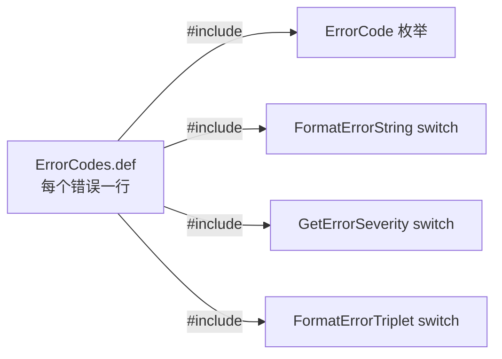
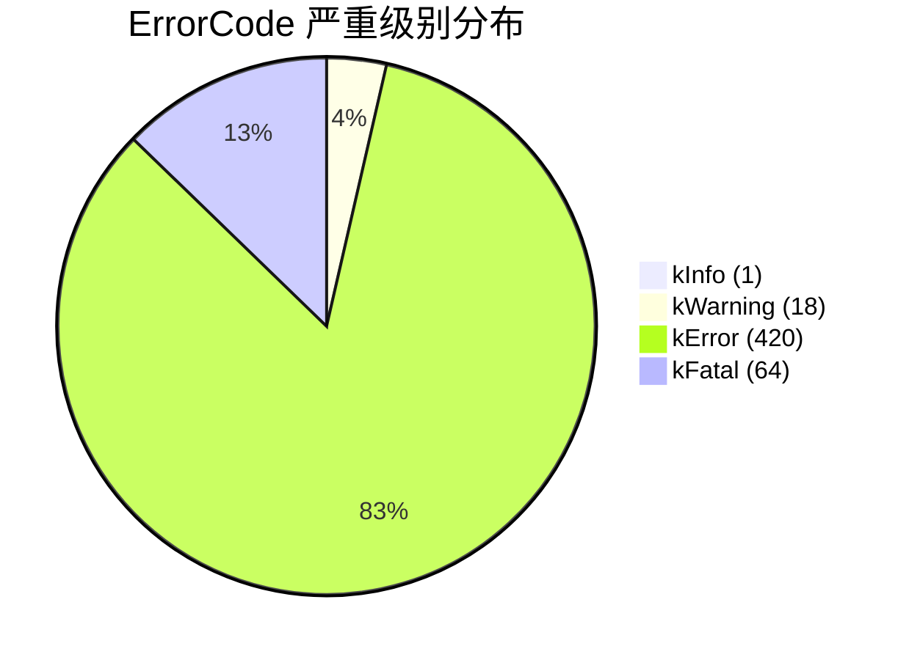
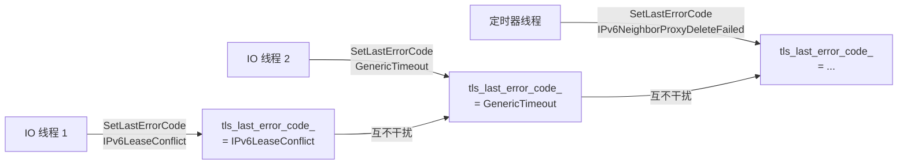
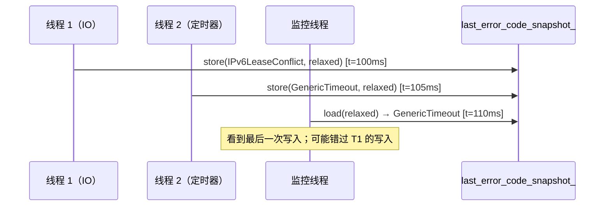
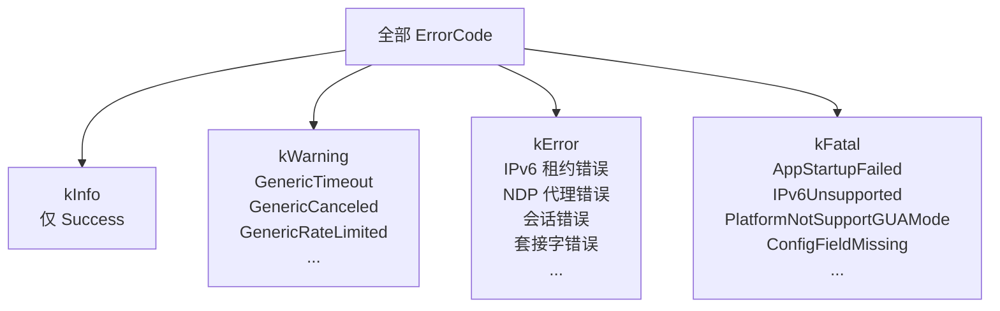
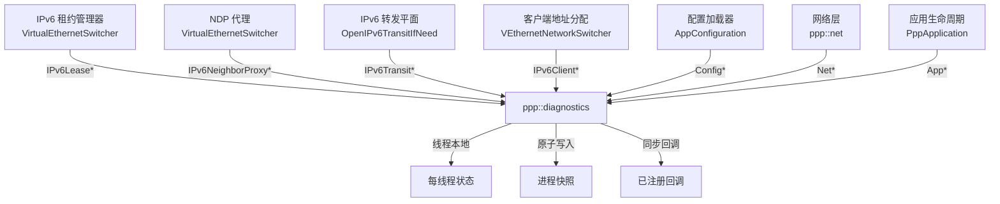

# 诊断错误系统

> **子系统：** `ppp::diagnostics`
> **相关文件：**
> - `ppp/diagnostics/ErrorCodes.def` — X-macro 错误码定义（503 行）
> - `ppp/diagnostics/Error.h` — 公共 API、`ErrorCode` 枚举、`ErrorSeverity` 枚举
> - `ppp/diagnostics/Error.cpp` — 自由函数委托实现
> - `ppp/diagnostics/ErrorHandler.h` — `ErrorHandler` 单例声明
> - `ppp/diagnostics/ErrorHandler.cpp` — `ErrorHandler` 实现（133 行）

---

## 目录

1. [概述与设计目标](#1-概述与设计目标)
2. [架构总览](#2-架构总览)
3. [X-Macro 展开：ErrorCodes.def](#3-x-macro-展开errorcodesdef)
4. [ErrorSeverity 枚举](#4-errorseverity-枚举)
5. [ErrorCode 枚举](#5-errorcode-枚举)
6. [ErrorHandler 单例](#6-errorhandler-单例)
7. [线程本地错误状态](#7-线程本地错误状态)
8. [跨线程原子快照](#8-跨线程原子快照)
9. [SetLastErrorCode：核心操作](#9-setlasterrorcode核心操作)
10. [GetLastErrorCode 与 GetLastErrorCodeSnapshot](#10-getlasterrorcode-与-getlasterrorcodesnapshot)
11. [FormatErrorTriplet](#11-formaterrortriplet)
12. [RegisterErrorHandler](#12-registererrorhandler)
13. [消费模式（N5 规则）](#13-消费模式n5-规则)
14. [严重级别分类参考](#14-严重级别分类参考)
15. [与其他子系统的集成](#15-与其他子系统的集成)
16. [扩展 ErrorCodes.def](#16-扩展-errorcodesdef)

---

## 1. 概述与设计目标

`ppp::diagnostics` 错误系统为整个 openppp2 框架提供了一套**结构化、线程安全、零内存分配**的错误条件记录与观测机制。它用严格的错误码传播模型取代了临时日志（在性能敏感的网络栈中日志记录并不合适）。

### 设计目标

| 目标 | 实现方式 |
|---|---|
| **热路径零分配** | 错误码基于 `uint32_t` 枚举；`SetLastErrorCode` 写入 `thread_local` 及原子变量，无堆分配 |
| **线程隔离** | 每个线程维护独立的 `tls_last_error_code_`，读写无需加锁 |
| **全进程可观测性** | `last_error_code_snapshot_` 是 `std::atomic<uint32_t>`，所有线程均可见 |
| **单一信息源** | 所有 503 个错误码均在 `ErrorCodes.def` 一个文件中以 X-macro 定义 |
| **错误报告不抛异常** | `SetLastErrorCode` 声明为 `noexcept`；错误条件通过返回值传递 |
| **观察者模式** | 通过 `RegisterErrorHandler` 注册具名回调，错误发生时同步调用 |
| **严重级别感知** | 每个错误码携带 `kInfo`/`kWarning`/`kError`/`kFatal` 分级 |

---

## 2. 架构总览

```mermaid
graph TB
    subgraph ppp/diagnostics
        Def[ErrorCodes.def\nX-macro 定义\n503 个错误码]
        Eh[Error.h\nErrorSeverity 枚举\nErrorCode 枚举\n自由函数]
        Ec[Error.cpp\n委托给 ErrorHandler::GetDefault()]
        Ehh[ErrorHandler.h\nErrorHandler 类\n单例]
        Ehc[ErrorHandler.cpp\n实现\n线程本地存储\n原子快照\n回调分发]
    end

    subgraph 每线程状态
        TLS1[线程 1\ntls_last_error_code_\ntls_last_error_timestamp_]
        TLS2[线程 2\ntls_last_error_code_\ntls_last_error_timestamp_]
        TLSN[线程 N\ntls_last_error_code_\ntls_last_error_timestamp_]
    end

    subgraph 全进程状态
        Snap[last_error_code_snapshot_\nstd::atomic<uint32_t>]
        TS[last_error_timestamp_snapshot_\nstd::atomic<uint64_t>]
        Handlers[error_handlers_\nunordered_map<string, function>]
        Mutex[error_handlers_sync_\nstd::mutex]
    end

    Def --> Eh
    Eh --> Ec
    Ec -->|委托| Ehc
    Ehh --> Ehc
    Ehc --> TLS1
    Ehc --> TLS2
    Ehc --> TLSN
    Ehc --> Snap
    Ehc --> TS
    Ehc --> Handlers
    Mutex -->|串行化注册| Handlers
```

---

## 3. X-Macro 展开：`ErrorCodes.def`

所有错误码目录都使用单一 X-macro 模式定义于 `ppp/diagnostics/ErrorCodes.def`：

```cpp
// ErrorCodes.def 格式：
X(名称, 描述文本, 严重级别)

// 示例（第 1–25 行）：
X(Success,                "Success",               ErrorSeverity::kInfo)
X(GenericUnknown,         "Generic unknown error", ErrorSeverity::kError)
X(GenericTimeout,         "Operation timed out",   ErrorSeverity::kWarning)
X(AppStartupFailed,       "Application startup failed", ErrorSeverity::kFatal)
X(IPv6LeasePoolExhausted, "The IPv6 lease pool has no remaining addresses available ...",
                                                   ErrorSeverity::kError)
```

该文件在 `ErrorHandler.cpp` 中被三次 `#include`，每次用不同的 `X` 宏展开：

### 展开 1：生成 `ErrorCode` 枚举（`Error.h` 第 36 行）

```cpp
enum class ErrorCode : uint32_t {
#define X(name, text, severity) name,
#include <ppp/diagnostics/ErrorCodes.def>
#undef X
};
```

生成结果：
```cpp
enum class ErrorCode : uint32_t {
    Success = 0,
    GenericUnknown = 1,
    GenericInvalidArgument = 2,
    // ... 500+ 个枚举值
};
```

枚举值从 0 开始按 `ErrorCodes.def` 中的行序依次递增。该数值用于 `FormatErrorTriplet` 输出和 `last_error_code_snapshot_`。

### 展开 2：`FormatErrorString`（`ErrorHandler.cpp` 第 55 行）

```cpp
const char* ErrorHandler::FormatErrorString(ErrorCode code) noexcept {
    switch (code) {
#define X(name, text, severity) case ErrorCode::name: return text;
#include <ppp/diagnostics/ErrorCodes.def>
#undef X
    default: return "Unknown error";
    }
}
```

### 展开 3：`GetErrorSeverity`（`ErrorHandler.cpp` 第 64 行）

```cpp
ErrorSeverity ErrorHandler::GetErrorSeverity(ErrorCode code) noexcept {
    switch (code) {
#define X(name, text, severity) case ErrorCode::name: return severity;
#include <ppp/diagnostics/ErrorCodes.def>
#undef X
    default: return ErrorSeverity::kError;
    }
}
```

### 展开 4：`FormatErrorTriplet`（`ErrorHandler.cpp` 第 97 行）

```cpp
switch (code) {
#define X(name, text, severity) case ErrorCode::name: \
    code_name = #name; code_message = text; break;
#include <ppp/diagnostics/ErrorCodes.def>
#undef X
}
```

### 为何使用 X-Macro？

X-macro 为所有错误元数据提供了唯一权威来源。若改用分离的枚举、字符串表和严重级别数组，则需维护四份并行数据结构，极易出错。使用 X-macro 后：

- 新增错误码只需在 `ErrorCodes.def` 中增加**一行**。
- 四种生成结构在编译时自动更新，无需任何运行时初始化。



---

## 4. `ErrorSeverity` 枚举

**位置：** `ppp/diagnostics/Error.h` 第 24 行

```cpp
enum class ErrorSeverity : uint8_t {
    kInfo    = 0, ///< 仅供参考；正常运行，无错误条件。
    kWarning = 1, ///< 可恢复；服务降级后可继续运行。
    kError   = 2, ///< 本次操作或会话不可恢复。
    kFatal   = 3, ///< 不可恢复；进程必须停止或重启。
};
```

### 各级别含义

| 级别 | 值 | 含义 | 示例码 |
|---|---|---|---|
| `kInfo` | 0 | 正常；仅 `Success` 使用此级别 | `Success` |
| `kWarning` | 1 | 服务降级；操作可重试或跳过 | `GenericTimeout`、`GenericCanceled`、`GenericRateLimited` |
| `kError` | 2 | 操作失败；会话可能终止，进程继续运行 | 大多数 IPv6 及会话错误 |
| `kFatal` | 3 | 不可恢复；进程应退出并重启 | `AppStartupFailed`、`IPv6Unsupported`、`PlatformNotSupportGUAMode` |

### 严重级别分布（来自 ErrorCodes.def）



---

## 5. `ErrorCode` 枚举

**位置：** `ppp/diagnostics/Error.h` 第 35 行

```cpp
enum class ErrorCode : uint32_t {
#define X(name, text, severity) name,
#include <ppp/diagnostics/ErrorCodes.def>
#undef X
};
```

`ErrorCode` 是以 `uint32_t` 为底层类型的强类型枚举，当前 `ErrorCodes.def` 包含 503 个值。每个错误码的数值即其在 `ErrorCodes.def` 中从 0 开始的行号。

### `ErrorCodes.def` 的分类结构

文件按逻辑分段组织：

| 行号范围 | 分类 | 数量 |
|---|---|---|
| 1 | `Success` | 1 |
| 2–25 | `Generic*` — 平台无关基础错误 | 24 |
| 27–41 | `App*` — 应用生命周期错误 | 15 |
| 43–60 | `Config*` — 配置解析错误 | 18 |
| ~61–100 | `Net*` / 套接字错误 | ~40 |
| ~101–200 | 会话 / 握手 / 认证 | ~100 |
| ~201–310 | IPv6 子系统 | ~110 |
| ~311–460 | TAP、TUN、路由 | ~150 |
| ~461–503 | PPP / 协议 / 杂项 | ~43 |

---

## 6. `ErrorHandler` 单例

**位置：** `ppp/diagnostics/ErrorHandler.h` 第 46 行；`ErrorHandler.cpp` 第 9 行

```cpp
class ErrorHandler final {
public:
    static ErrorHandler& GetDefault() noexcept;
    // ...
private:
    ErrorHandler() noexcept = default;
    ErrorHandler(const ErrorHandler&) = delete;
    ErrorHandler& operator=(const ErrorHandler&) = delete;

    static thread_local ErrorCode  tls_last_error_code_;
    static thread_local uint64_t   tls_last_error_timestamp_;

    std::atomic<uint32_t>          last_error_code_snapshot_{0};
    std::atomic<uint64_t>          last_error_timestamp_snapshot_{0};

    std::mutex                     error_handlers_sync_;
    ppp::unordered_map<ppp::string, ppp::function<void(int err)>> error_handlers_;
};
```

`GetDefault()` 返回一个 Meyers 单例：

```cpp
ErrorHandler& ErrorHandler::GetDefault() noexcept {
    static ErrorHandler default_error_handler;  // 第 10 行
    return default_error_handler;
}
```

C++11 及以后标准保证静态局部变量初始化仅发生一次，即使在并发调用场景下也线程安全。

`Error.h` 中所有自由函数均委托至此单例：

```cpp
// Error.cpp（示意）：
ErrorCode GetLastErrorCode() noexcept {
    return ErrorHandler::GetDefault().GetLastErrorCode();
}
ErrorCode SetLastErrorCode(ErrorCode code) noexcept {
    return ErrorHandler::GetDefault().SetLastErrorCode(code);
}
```

---

## 7. 线程本地错误状态

**位置：** `ErrorHandler.cpp` 第 6–7 行

```cpp
thread_local ErrorCode ErrorHandler::tls_last_error_code_ = ErrorCode::Success;
thread_local uint64_t  ErrorHandler::tls_last_error_timestamp_ = 0;
```

每个操作系统线程独立持有：
- `tls_last_error_code_` — 本线程上最近一次 `SetLastErrorCode` 调用所设置的错误码。
- `tls_last_error_timestamp_` — 设置时通过 `ppp::threading::Executors::GetTickCount()` 获取的单调时间戳。



**核心保证：**
- 在线程 A 中读取 `GetLastErrorCode()` 永远不会看到线程 B 设置的错误。
- 读写 `tls_last_error_code_` 无需任何锁。
- 时间戳确保顺序：同一线程上先后设置的两个错误，第二个的时间戳必然更大。

---

## 8. 跨线程原子快照

**位置：** `ErrorHandler.h` 第 167–169 行

```cpp
std::atomic<uint32_t> last_error_code_snapshot_{0};
std::atomic<uint64_t> last_error_timestamp_snapshot_{0};
```

`last_error_code_snapshot_` 以**最后写入者获胜**的语义，提供全线程范围内最近一次错误的可视视图。在 `SetLastErrorCode` 内部以原子方式更新（`.cpp` 第 30–31 行）：

```cpp
last_error_code_snapshot_.store(
    static_cast<uint32_t>(code), std::memory_order_relaxed);
last_error_timestamp_snapshot_.store(
    tls_last_error_timestamp_, std::memory_order_relaxed);
```

使用 `memory_order_relaxed` 的原因：
1. 快照是建议性的——提供尽力而为的视图，而非精确因果顺序。
2. 时间戳在同一次写入中一并更新，可用于评估快照的时效性。
3. 消费者使用快照时不需要与生产者的其他内存操作同步。



### 快照的适用场景

- 管理 API 端点汇报最近系统错误。
- 健康探针判断服务器近期是否发生错误。
- 看门狗线程针对 `kFatal` 错误触发重启。

快照**不适用于**在单次操作链中精确追踪错误。精确追踪请在调用线程上使用 `GetLastErrorCode()`。

---

## 9. `SetLastErrorCode`：核心操作

**位置：** `ErrorHandler.cpp` 第 27–52 行

```cpp
ErrorCode ErrorHandler::SetLastErrorCode(ErrorCode code) noexcept {
    // 1. 写入线程本地：
    tls_last_error_code_ = code;

    // 2. 记录时间戳：
    tls_last_error_timestamp_ = ppp::threading::Executors::GetTickCount();

    // 3. 原子更新全进程快照：
    last_error_code_snapshot_.store(
        static_cast<uint32_t>(code), std::memory_order_relaxed);
    last_error_timestamp_snapshot_.store(
        tls_last_error_timestamp_, std::memory_order_relaxed);

    // 4. 快照回调表（加锁、复制、释锁）：
    ppp::unordered_map<ppp::string, ppp::function<void(int err)>> error_handlers;
    {
        std::lock_guard<std::mutex> scope(error_handlers_sync_);
        error_handlers = error_handlers_;
    }

    // 5. 在锁外逐一调用回调（捕获所有异常）：
    int error_value = static_cast<int>(code);
    for (auto&& error_handler : error_handlers) {
        if (NULLPTR == error_handler.second) { continue; }
        try {
            error_handler.second(error_value);
        } catch (...) {
            // 回调抛出的异常绝不能向外传播；全部吞掉。
        }
    }

    return code;
}
```

### 关键实现说明

1. **调用前先复制回调表**（第 33–37 行）：在 `error_handlers_sync_` 保护下将 map 快照复制出来，释放锁后再调用回调。这保证了：
   - 回调本身可以安全调用 `RegisterErrorHandler`（也需要获取该锁），不会死锁。
   - 分发过程中新注册的回调不会影响本次分发。

2. **吞掉所有异常**（第 47–48 行）：抛出异常的回调不得使 `SetLastErrorCode` 崩溃。`try-catch(...)` 确保函数语义上是 `noexcept` 安全的。

3. **同步调用**：回调在调用线程上、`SetLastErrorCode` 内部同步执行。回调必须快速完成，且不得递归调用 `SetLastErrorCode`（不会死锁，但若回调本身触发新错误可能导致无限递归）。

4. **返回值**：`SetLastErrorCode` 返回收到的同一错误码，便于如下写法：
   ```cpp
   return ppp::diagnostics::SetLastError(ErrorCode::IPv6LeaseConflict, false);
   ```

---

## 10. `GetLastErrorCode` 与 `GetLastErrorCodeSnapshot`

### `GetLastErrorCode` — 读取线程本地状态

```cpp
// ErrorHandler.cpp : 15
ErrorCode ErrorHandler::GetLastErrorCode() noexcept {
    return tls_last_error_code_;
}
```

返回**调用线程**上最近一次 `SetLastErrorCode` 设置的错误码。无需同步——纯线程本地读取。

### `GetLastErrorCodeSnapshot` — 读取全进程快照

```cpp
// ErrorHandler.cpp : 19
ErrorCode ErrorHandler::GetLastErrorCodeSnapshot() noexcept {
    return static_cast<ErrorCode>(
        last_error_code_snapshot_.load(std::memory_order_relaxed));
}
```

返回**所有线程**中最近一次设置的错误码（最后写入者获胜）。使用 `memory_order_relaxed`——不保证相对于其他内存操作的顺序。

### 对比

| 维度 | `GetLastErrorCode()` | `GetLastErrorCodeSnapshot()` |
|---|---|---|
| 作用域 | 每线程 | 全进程 |
| 同步开销 | 无（线程本地） | 原子加载 |
| 适用场景 | 操作链内部 | 健康检查、管理 API |
| 可能过时？ | 不会（本线程） | 会（其他线程可能已写入更新值） |

---

## 11. `FormatErrorTriplet`

**位置：** `ErrorHandler.cpp` 第 89–116 行

生成如下格式的可读诊断字符串：

```
<uint32_id> <CodeName>: <message text>
```

示例：
```
0 Success: Success
301 IPv6LeasePoolExhausted: The IPv6 lease pool has no remaining addresses available after exhausting all retry attempts.
293 IPv6NeighborProxyEnableFailed: IPv6 neighbor proxy enable failed
```

### 实现

```cpp
ppp::string ErrorHandler::FormatErrorTriplet(ErrorCode code) noexcept {
    uint32_t    numeric_id   = static_cast<uint32_t>(code);
    const char* code_name    = "Unknown";
    const char* code_message = "Unknown error";

    switch (code) {
#define X(name, text, severity) \
    case ErrorCode::name: code_name = #name; code_message = text; break;
#include <ppp/diagnostics/ErrorCodes.def>
#undef X
    default: break;
    }

    ppp::string result;
    result.reserve(128);
    result += std::to_string(numeric_id).c_str();
    result += ' ';
    result += code_name;
    result += ':';
    result += ' ';
    result += code_message;
    return result;
}
```

**诊断输出用法：**

```cpp
auto triplet = ppp::diagnostics::FormatErrorTriplet(
    ppp::diagnostics::GetLastErrorCode());
// 输出："297 IPv6LeaseConflict: IPv6 lease conflict"
```

---

## 12. `RegisterErrorHandler`

**位置：** `ErrorHandler.cpp` 第 122–131 行

```cpp
void ErrorHandler::RegisterErrorHandler(
    const ppp::string& key,
    const ppp::function<void(int err)>& handler) noexcept {

    std::lock_guard<std::mutex> scope(error_handlers_sync_);

    if (NULLPTR == handler) {
        error_handlers_.erase(key);
        return;
    }

    error_handlers_[key] = handler;
}
```

### 注册语义

- **基于 key 的 upsert**：使用相同 `key` 重复注册会覆盖之前的回调。
- **移除**：传入 `NULLPTR` 作为 handler 可移除该 `key` 对应的注册。
- **线程安全**：注册由 `error_handlers_sync_` 串行化。但在多线程运行时启动后调用 `RegisterErrorHandler` **不安全**（头文件中有文档说明）。

### 注册时机规范

所有回调**必须在** `PppApplication::Run()` 启动 IO 线程池之前完成注册：

```cpp
// main.cpp — 正确用法：
ppp::diagnostics::RegisterErrorHandler("watchdog", [](int err) {
    if (ppp::diagnostics::IsErrorFatal(
            static_cast<ppp::diagnostics::ErrorCode>(err))) {
        trigger_restart();
    }
});
PppApplication::Run();  // 启动线程后不得再注册
```

---

## 13. 消费模式（N5 规则）

**N5 规则**是 openppp2 中的非正式约定：函数失败时必须遵循以下五步协议：

```
N1. 检测失败条件。
N2. 调用 SetLastErrorCode(ErrorCode::SpecificError)。
N3. 返回哨兵值（false / -1 / NULLPTR）。
N4. 调用方检查哨兵值。
N5. 调用方可调用 GetLastErrorCode() 获取详情。
```

### 模式 A：布尔返回值

```cpp
// 调用方模式：
bool ok = OpenIPv6NeighborProxyIfNeed();
if (!ok) {
    auto err = ppp::diagnostics::GetLastErrorCode();
    // err 包含 IPv6NeighborProxyEnableFailed 等
    log_error(ppp::diagnostics::FormatErrorTriplet(err));
    return false;
}
```

### 模式 B：SetLastError 模板辅助函数

`Error.h` 提供三个模板辅助函数，便于简洁地返回失败：

```cpp
// 返回 false 并设置错误码：
return ppp::diagnostics::SetLastError(ErrorCode::IPv6LeaseConflict);

// 返回 -1（或其他整型哨兵）并设置错误码：
return ppp::diagnostics::SetLastError<int>(ErrorCode::GenericOutOfMemory);

// 返回 NULLPTR 并设置错误码：
return ppp::diagnostics::SetLastError<SomePointer*>(ErrorCode::GenericNotFound);
```

这些辅助函数防止了常见错误——设置错误码后忘记返回哨兵值：

```cpp
// 不用辅助函数——容易漏掉 return：
ppp::diagnostics::SetLastErrorCode(ErrorCode::IPv6LeaseConflict);
return false;  // 在复杂函数中容易遗漏

// 使用辅助函数——原子操作：
return ppp::diagnostics::SetLastError(ErrorCode::IPv6LeaseConflict);
```

### 模式 C：基于严重级别的升级处理

```cpp
// 看门狗 / 监督者模式：
void OnErrorObserved(int err_int) {
    auto code = static_cast<ppp::diagnostics::ErrorCode>(err_int);
    if (ppp::diagnostics::IsErrorFatal(code)) {
        // 安排受控关机并重启
        ScheduleRestart();
    } elif (ppp::diagnostics::GetErrorSeverity(code) ==
            ppp::diagnostics::ErrorSeverity::kWarning) {
        // 仅记录日志；继续运行
        LogWarning(ppp::diagnostics::FormatErrorTriplet(code));
    }
}
```

---

## 14. 严重级别分类参考

主要错误分类的完整严重级别汇总：



### Fatal 级别码——需要运维介入

| 错误码 | 消息 | 建议操作 |
|---|---|---|
| `AppStartupFailed` | Application startup failed | 检查日志；可能需要 root 权限 |
| `AppAlreadyRunning` | Application already running | 删除过期 PID 文件 |
| `AppInvalidCommandLine` | Invalid command-line arguments | 更正启动命令 |
| `AppConfigurationMissing` | Configuration missing | 创建 `appsettings.json` |
| `IPv6Unsupported` | IPv6 unsupported on this platform | 切换至 NAT66 或禁用 IPv6 |
| `PlatformNotSupportGUAMode` | GUA mode not supported | 在非 Linux 平台使用 NAT66 |
| `GenericNotSupported` | Operation not supported | 检查平台兼容性 |

---

## 15. 与其他子系统的集成

openppp2 中每个主要子系统都通过 `SetLastErrorCode` 作为主要错误信号机制：



`ppp::diagnostics` 是**唯一**进行错误信令的地方，与日志系统（使用 `ppp::fmt` 和应用日志器）刻意分离。这种分离带来以下好处：

1. 错误码可用于 `noexcept` 函数，不产生任何 I/O。
2. 日志可通过 `RegisterErrorHandler` 叠加在错误码观测之上。
3. 测试可注册回调，断言特定错误码是否被触发。

---

## 16. 扩展 `ErrorCodes.def`

新增错误码的步骤：

1. **选择正确的分段**：在 `ErrorCodes.def` 中找到与子系统对应的分组。
2. **添加一行**，遵循 X-macro 格式：
   ```
   X(MyNewError, "Human-readable description of the error", ErrorSeverity::kError)
   ```
3. **谨慎选择严重级别**：
   - `kFatal`：仅用于进程无法继续的情况（初始化失败、致命配置错误）。
   - `kError`：会话级或操作级失败。
   - `kWarning`：可重试或服务降级的情况。
   - `kInfo`：保留给 `Success`。
4. **在对应 `.cpp` 文件中使用新错误码**：
   ```cpp
   ppp::diagnostics::SetLastErrorCode(
       ppp::diagnostics::ErrorCode::MyNewError);
   return false;
   ```
5. **无需其他改动**：枚举、switch 表和格式化函数均在编译时自动更新。

### 错误码命名规范

| 模式 | 示例 |
|---|---|
| `<子系统><条件>Failed` | `IPv6TransitTapOpenFailed` |
| `<子系统><资源>Invalid` | `IPv6PrefixInvalid` |
| `<子系统><资源>Exhausted` | `IPv6LeasePoolExhausted` |
| `<子系统><资源>Conflict` | `IPv6AddressConflict` |
| `Generic<条件>` | `GenericTimeout` |
| `App<阶段>Failed` | `AppStartupFailed` |
| `Config<字段/阶段>Invalid` | `ConfigFieldInvalid` |

---

## 17. C 模块错误桥接（SYSNAT）

部分 Linux 底层组件使用 C 实现，并返回负值 `ERR_*` 整数而不是直接返回 `ErrorCode`（例如 `linux/ppp/tap/openppp2_sysnat.c`）。

为保持诊断体系统一，openppp2 在 `linux/ppp/tap/openppp2_sysnat.h` 提供了 C/C++ 桥接：


桥接规则：

1. C 返回码保持不变，继续用于局部流程控制。
2. 仅在边界层把失败映射到 `ErrorCode`。
3. 仅在返回非零时发布诊断。
4. 除非调用方显式接受，否则不要把“already attached”/“not attached”当作成功。

`VNetstack.cpp` 的 SYSNAT attach/detach/rule 安装路径已按该模式处理。
