# EDSM State Machines

[中文版本](EDSM_STATE_MACHINES_CN.md)

This document describes the Event-Driven State Machine (EDSM) architecture used throughout OPENPPP2, with precise coverage of every state, every transition trigger, and the concurrency model that makes them safe.

---

## 1. EDSM Design Philosophy

### What EDSM Means in This Project

OPENPPP2 is not a traditional request-response server. It is a virtual Ethernet infrastructure that must simultaneously maintain thousands of long-lived sessions, each carrying mixed TCP, UDP, ICMP, and control traffic. The key design commitment is that **no OS thread ever blocks waiting for network I/O**. Every session runs as a Boost.Asio stackful coroutine; when I/O is not ready the coroutine yields, the thread picks up another ready coroutine, and the original coroutine resumes when data arrives.

The term EDSM (Event-Driven State Machine) describes the result: each session object is a state machine whose transitions are driven by protocol events (packet arrival, timer expiry, connection completion), and the event loop — the Boost.Asio `io_context` — serializes those transitions through strands rather than locks.

### Why EDSM Over Traditional Threading

A traditional multi-threaded VPN server assigns one or two OS threads per session. With thousands of sessions, thread context-switch overhead and per-thread stack memory become the primary bottleneck. Locks are required at every shared resource boundary, and deadlock analysis grows combinatorially with thread count.

The EDSM approach inverts this: there are O(CPU cores) OS threads, each running many coroutines. Coroutines have tiny stacks (typically 64 KB, allocated from jemalloc) and switch in nanoseconds rather than microseconds. The strand serializes all operations on one session to a single logical thread at a time, eliminating the need for per-session locks entirely. Cross-session data (the switcher's session map, the firewall table) still requires atomic operations or shared-state locks, but these are coarse-grained and infrequent.

The practical implication for code readers: **if you see a lock inside a per-session handler, treat it as a red flag**. Most per-session state is safe without locks because the strand guarantees serial execution.

### How Boost.Asio `io_context` Implements the Event Loop

Each `io_context` instance maintains a run queue of ready handlers. OS threads call `io_context::run()` in a loop; each call picks one handler from the queue, executes it to completion, and returns to the loop. A strand (`boost::asio::strand`) wraps a subset of handlers so that at most one strand-wrapped handler runs at a time, regardless of how many threads are in the pool. This provides the EDSM guarantee: transitions for session A never interleave with transitions for session A on a different thread, even though the pool is multi-threaded.

`Executors::Spawn` creates a stackful coroutine and posts it to the appropriate strand. `YieldContext` captures the coroutine's resume handle. When an async operation completes, its completion handler resumes the coroutine via the yield context. The coroutine then continues executing until it yields again or returns.

### Relationship Between EDSM Layers

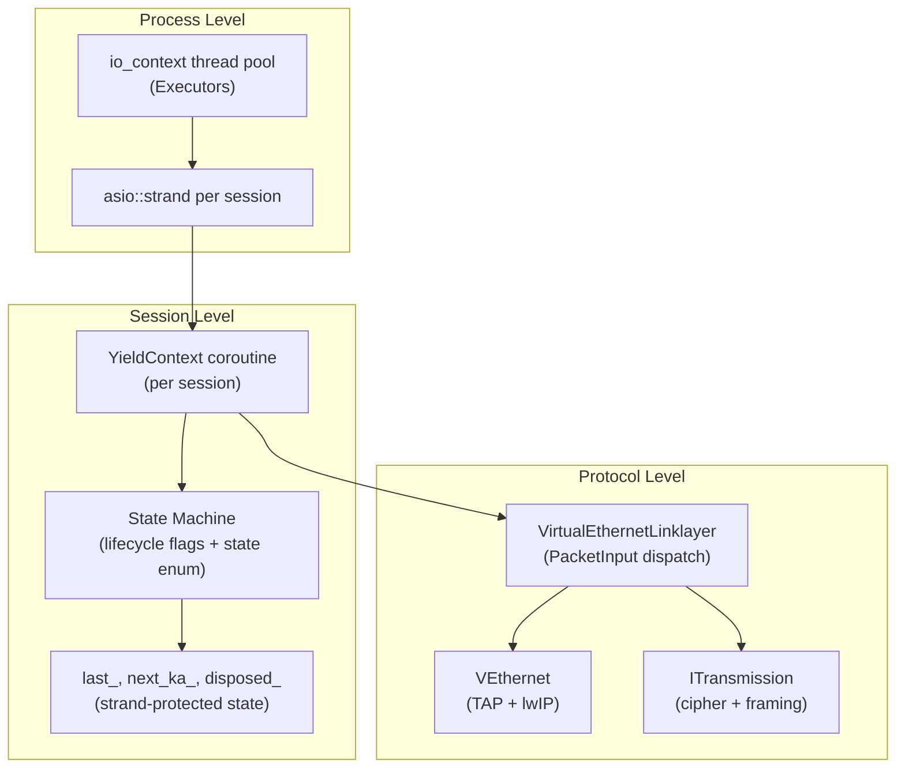

---

## 2. VirtualEthernetLinklayer State Machine

### Overview

`VirtualEthernetLinklayer` (`ppp/app/protocol/VirtualEthernetLinklayer.h`) is the base class for all session objects on both the client and server. It is not itself a full state machine — it is the **protocol codec and dispatcher** that drives the state machines implemented in its derived classes (`VEthernetExchanger` on the client, per-session handlers on the server). Nevertheless, the link layer itself has an implicit lifecycle with well-defined states.

### States

| State | Description |
|-------|-------------|
| `Idle` | Object constructed; no transmission assigned; no coroutine running. |
| `Running` | `Run()` has been called; receive loop active inside a coroutine; `PacketInput` dispatching frames. |
| `KeepAliveArmed` | At least one packet received; `last_` timestamp updated; `DoKeepAlived` timer logic active. |
| `Disposed` | `Run()` returned (transmission read failure or `PacketInput` returned false); object is being released. |

The transition from `Running` to `KeepAliveArmed` is implicit — it happens on the first successful `PacketInput` call. The transition from `Running` or `KeepAliveArmed` to `Disposed` happens when `Run()` exits its receive loop.

### State Diagram

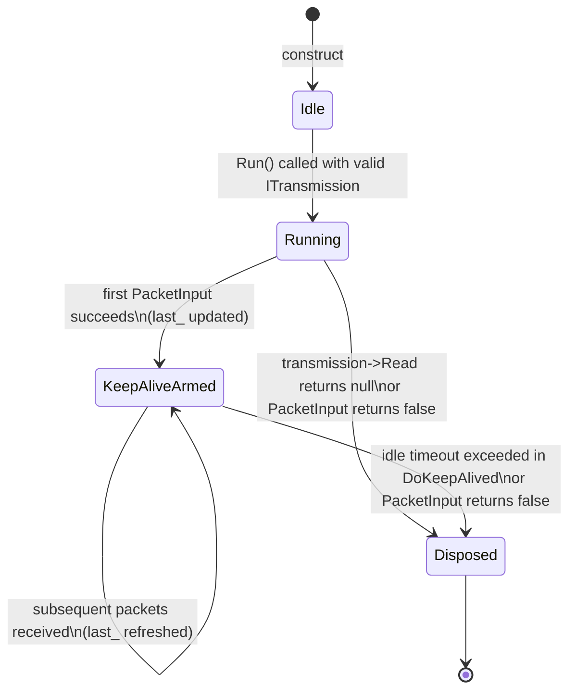

### PacketAction Opcodes and Their Role in State Transitions

The `PacketAction` enum defines 21 opcodes. `PacketInput` reads the first byte of every inbound frame, selects the opcode, parses the remaining wire format, and calls the corresponding `On*` virtual method. The table below maps each opcode to its wire role and the state change it may trigger in derived classes.

| Opcode | Hex | Direction | Wire Role | State Effect |
|--------|-----|-----------|-----------|--------------|
| `PacketAction_INFO` | `0x7E` | Server → Client | Session quota and bandwidth QoS payload. Contains `VirtualEthernetInformation` struct plus optional JSON extension. | Client records quota; may update rate-limiter state. |
| `PacketAction_KEEPALIVED` | `0x7F` | Bidirectional | Heartbeat with random printable payload. Receiver updates `last_`. | Refreshes `last_` timestamp, preventing idle-timeout disposal. |
| `PacketAction_SYN` | `0x2A` | Client → Server | TCP connect request. Carries 3-byte connection ID plus encoded destination endpoint. | Server opens real TCP socket; triggers `OnConnect`. |
| `PacketAction_SYNOK` | `0x2B` | Server → Client | TCP connect acknowledgment. Carries connection ID plus 1-byte error code. | Client learns connect result via `OnConnectOK`; session enters data-relay state or closes. |
| `PacketAction_PSH` | `0x2C` | Bidirectional | TCP stream data. Carries connection ID plus payload bytes. | Routes payload to the appropriate TCP relay socket via `OnPush`. |
| `PacketAction_FIN` | `0x2D` | Bidirectional | TCP teardown. Carries connection ID. | Closes relay socket; removes connection from session map via `OnDisconnect`. |
| `PacketAction_SENDTO` | `0x2E` | Bidirectional | UDP datagram with source and destination endpoint descriptors. | `OnSendTo` injects datagram into lwIP or forwards to destination. |
| `PacketAction_ECHO` | `0x2F` | Client → Server | Latency probe payload. | Server echoes back via `DoEcho(ack_id)`; used for RTT measurement. |
| `PacketAction_ECHOACK` | `0x30` | Server → Client | Echo acknowledgment carrying the probe ID. | Client records RTT sample via `OnEcho(ack_id)`. |
| `PacketAction_NAT` | `0x29` | Bidirectional | Raw IP frame forwarding (encapsulated NAT payload). | `OnNat` decapsulates and injects into lwIP or routes to destination. |
| `PacketAction_LAN` | `0x28` | Server → Client | LAN subnet advertisement (ip + mask pair). | Client adds route to virtual NIC via `OnLan`. |
| `PacketAction_STATIC` | `0x31` | Client → Server | Static port mapping query. | Server looks up mapping and replies with STATICACK via `OnStatic`. |
| `PacketAction_STATICACK` | `0x32` | Server → Client | Static port mapping acknowledgment. Carries FSID, session ID, remote port. | Client records static mapping via `OnStatic(fsid, session_id, remote_port)`. |
| `PacketAction_MUX` | `0x35` | Client → Server | MUX channel setup request. Carries VLAN ID, max connections, acceleration flag. | Server creates MUX context; replies with MUXON via `OnMux`. |
| `PacketAction_MUXON` | `0x36` | Server → Client | MUX channel setup acknowledgment. Carries VLAN ID, seq, ack. | Client activates MUX channel via `OnMuxON`. |
| `PacketAction_FRP_ENTRY` | `0x20` | Client → Server | FRP: register a port mapping (TCP/UDP, in/out, remote port). | Server registers FRP rule via `OnFrpEntry`. |
| `PacketAction_FRP_CONNECT` | `0x21` | Bidirectional | FRP: open a new tunneled connection on a registered port. | Receiver creates FRP relay session via `OnFrpConnect`. |
| `PacketAction_FRP_CONNECTOK` | `0x22` | Bidirectional | FRP: connection open acknowledgment with error code. | Peer learns FRP connect result via `OnFrpConnectOK`. |
| `PacketAction_FRP_PUSH` | `0x23` | Bidirectional | FRP: stream data for a tunneled connection. | `OnFrpPush` routes payload to FRP relay socket. |
| `PacketAction_FRP_DISCONNECT` | `0x24` | Bidirectional | FRP: notify connection closure. | `OnFrpDisconnect` closes FRP relay socket. |
| `PacketAction_FRP_SENDTO` | `0x25` | Bidirectional | FRP: UDP datagram delivery on a registered port. | `OnFrpSendTo` forwards UDP payload via FRP UDP relay. |

### Opcode Dispatch Flow

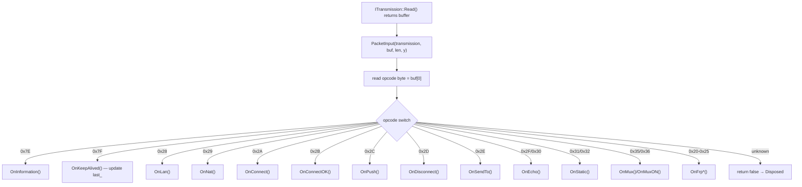

### Keepalive / Heartbeat Mechanism

`DoKeepAlived(transmission, now)` is called by a per-session timer, typically from the session scheduler on every tick. The logic is:

1. Compute `deadline = last_ + (max_timeout_ms + EXTRA_FAULT_TOLERANT_TIME)`. If `now >= deadline`, the session is considered dead — return `false` to signal disposal.
2. On the first call (`next_ka_ == 0`), schedule the first keep-alive at a random delay within `[1000ms, max_timeout_ms]` to avoid synchronization storms from many sessions.
3. If `now >= next_ka_`, send a `PacketAction_KEEPALIVED` frame with a random printable payload (length randomly chosen up to MTU) to avoid traffic pattern fingerprinting.
4. Schedule the next keep-alive at another random interval.

The receiver side is simple: a `PacketAction_KEEPALIVED` frame updates `last_` and returns `true`. No acknowledgment is sent. The random payload prevents passive observers from identifying keep-alive traffic by size or period.

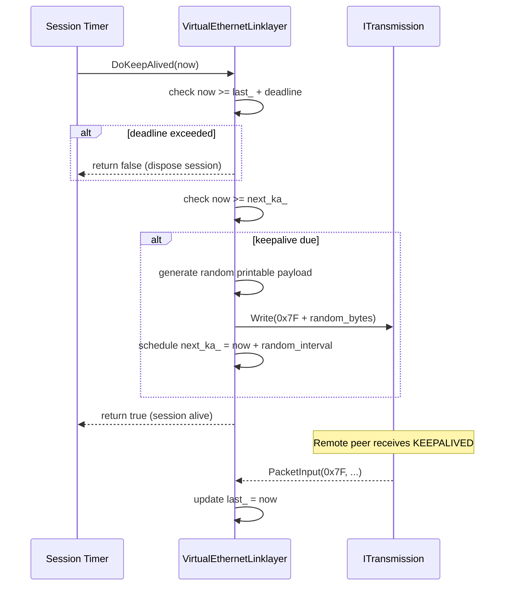

---

## 3. VEthernet (Virtual NIC) State Machine

### Overview

`VEthernet` (`ppp/ethernet/VEthernet.h`) represents the virtual network interface card that bridges the OS TAP/TUN driver (or Android VPN service fd) with the lwIP TCP/IP stack. It has a clear three-state lifecycle driven by TAP device availability and the lwIP stack initialization sequence.

### States and Transitions

**Open**: The TAP device file descriptor has been acquired and the lwIP `netif` has been registered. The IP address and netmask configured in `AppConfiguration` have been assigned to the netif. The `VEthernet` is ready to send and receive but the application-level session may not yet be established.

**Running**: The associated `VirtualEthernetLinklayer` session has completed its handshake. The TAP input loop is active: raw Ethernet frames from the OS are read, passed to lwIP via `netif_input`, and lwIP routes IP datagrams through the session's `DoNat` / `DoSendTo` path to the tunnel. Outbound frames from lwIP (responses from real destinations, arriving via the tunnel) are written back to the TAP device.

**Disposed**: The session has ended (link-layer timeout, error, or explicit close). lwIP `netif` is removed. The TAP file descriptor is closed. All references to the `VEthernet` object are released, triggering destructor cleanup via RAII.

### State Diagram

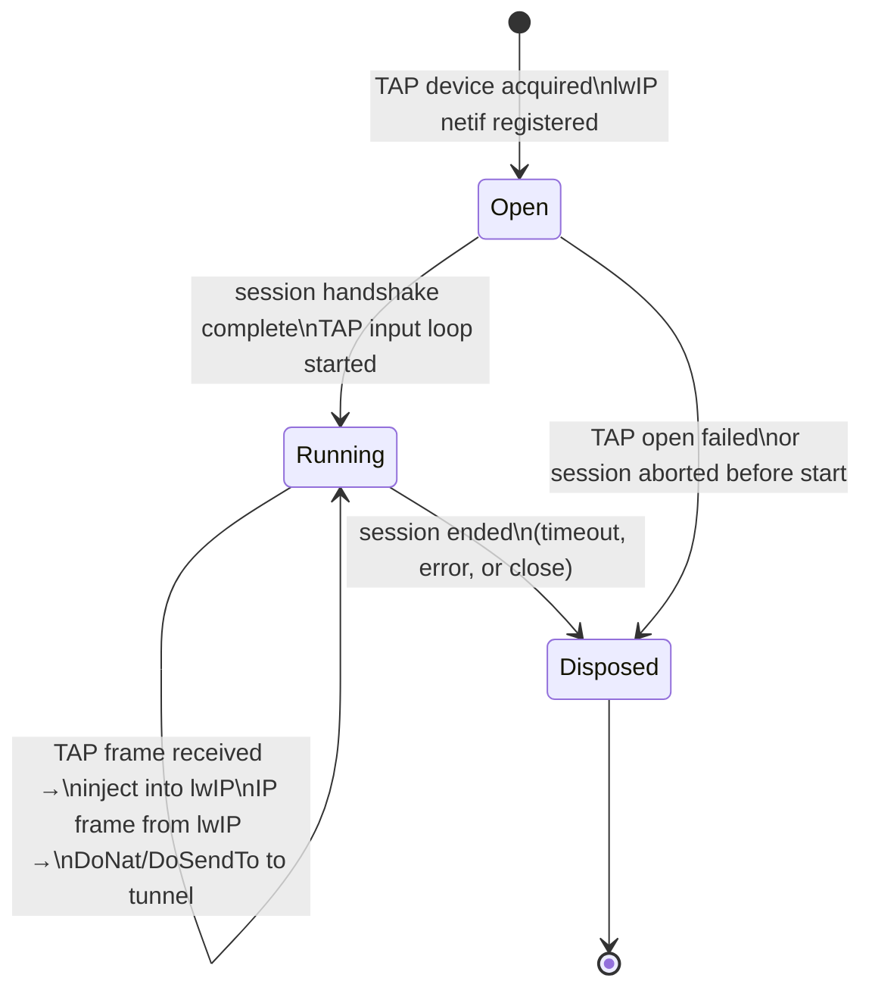

### VEthernet Data Plane Flows

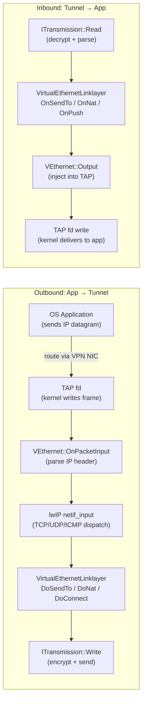

### How TAP Input Triggers State Transitions

The TAP input loop runs inside a coroutine spawned by `Executors::Spawn`. It calls `ITap::Read()` in a yield-suspend loop. Each successful read produces a raw Ethernet frame. The frame is validated (minimum size, EtherType check) and passed to `lwip_netif_input()`. lwIP processes the IP layer: ARP, ICMP, TCP, and UDP are all handled internally. When lwIP wants to send a packet out (e.g., a TCP response received from the tunnel), it calls the `netif->output` callback, which serializes the IP frame via `VirtualEthernetPacket::Pack` and forwards it to the TAP device.

On Android the TAP device is replaced by a `ParcelFileDescriptor` from the VPN service, but the `VEthernet` interface is identical; only the `ITap` implementation differs.

---

## 4. Session (Exchanger) Lifecycle

### Client Session States

The client session is managed by `VEthernetExchanger`. It begins when the client application establishes a connection to the server and ends when the transmission fails or the keep-alive expires.

| State | Description |
|-------|-------------|
| `Connecting` | `ITransmission` carrier is being established; TLS or WebSocket handshake in progress. |
| `Handshaking` | Carrier is up; link-layer `INFO` exchange in progress (client receives quota from server). |
| `Active` | INFO received; `Run()` loop running; lwIP traffic is being tunneled. |
| `Disposing` | `Run()` exited or keep-alive failed; resources being released. |
| `Disposed` | All sockets, timers, and lwIP references released. |

### Server Session States

The server does not have a single `VEthernetExchanger`. Instead, `VirtualEthernetSwitcher` maintains a map of per-client session handlers. Each handler lifecycle is:

| State | Description |
|-------|-------------|
| `Accepted` | New TCP connection from client accepted; `ITransmission` being negotiated. |
| `Authenticated` | Handshake complete; server sends `INFO` frame with quota. |
| `Active` | `Run()` loop running; forwarding TCP, UDP, and NAT traffic. |
| `Disposing` | `Run()` exited; session map entry being removed; relay sockets being closed. |
| `Disposed` | All resources released; session object reference count drops to zero. |

### Session Lifecycle Diagram

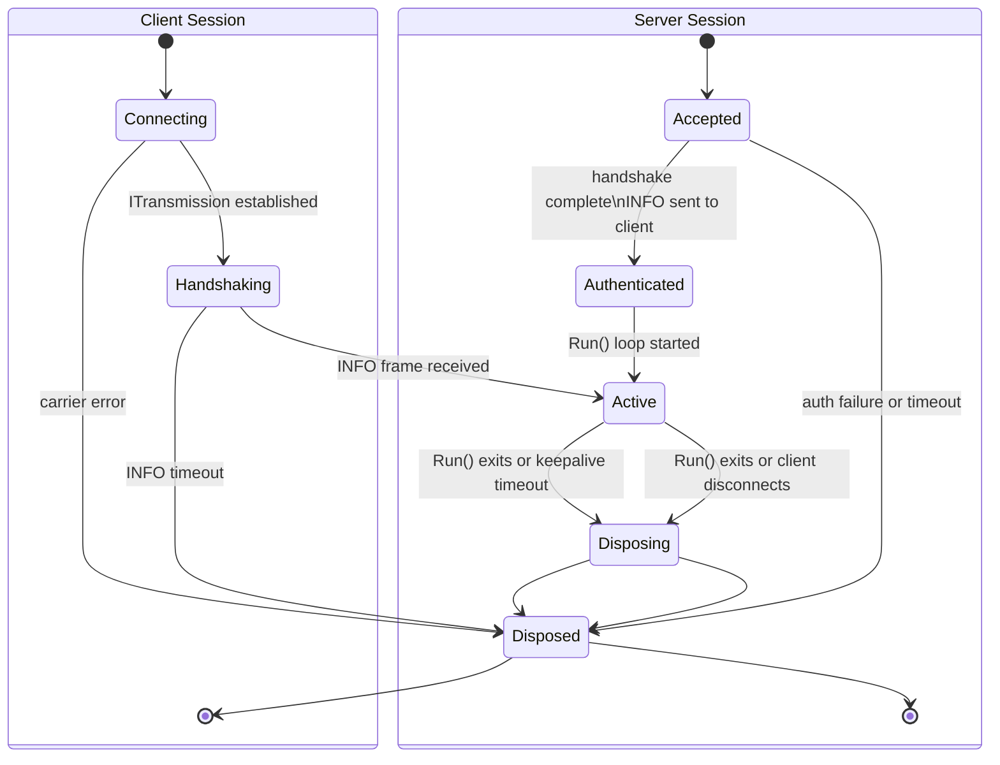

### TCP Virtual Accept Retry Schedule

The client-side virtual TCP stack (VTcpServer inside lwIP) retries `Accept()` on failure with an exponential-ish backoff schedule that avoids thundering-herd retries when the remote server is temporarily unreachable:

| Retry Attempt | Wait (ms) |
|---------------|-----------|
| 1 | 200 |
| 2 | 400 |
| 3 | 800 |
| 4 | 1200 |
| 5 | 1600 |

`EndAccept()` cancels any pending retry timer. `Finalize()` is the safety-fallback that cleans up after all retries are exhausted without a successful accept.

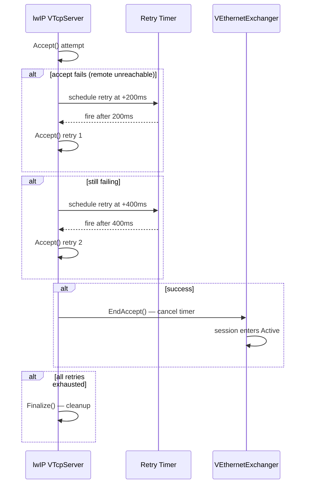

### Dispose Pattern

Both client and server session objects follow a strict dispose pattern to prevent use-after-free in a multi-coroutine environment:

1. An `std::atomic<bool>` flag (`disposed_` or similar) is set with `compare_exchange_strong(memory_order_acq_rel)`. Only the first caller proceeds with cleanup; subsequent calls are no-ops.
2. All timers are cancelled.
3. All relay TCP sockets are closed with `shutdown + close`.
4. All UDP sockets are closed.
5. The `ITransmission` is released (shared_ptr reset).
6. The session map entry is erased under whatever protection the switcher uses for that map.
7. The `VEthernet` (if client) is disposed.
8. The `shared_ptr` to the session object is released, triggering the destructor when the last reference is dropped.

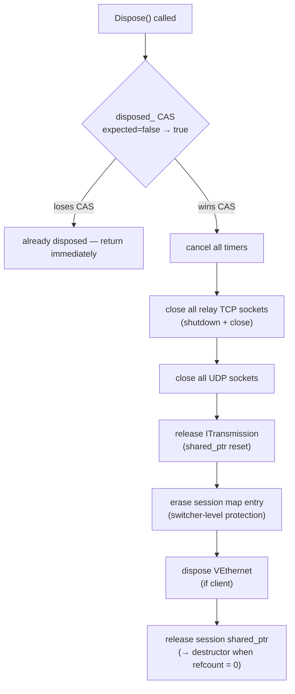

---

## 5. Concurrency Safety in EDSM

### Why Strands Make Most Locks Unnecessary

In a traditional multi-threaded design, a session's state fields must be protected by a mutex because multiple threads can execute session code simultaneously. In the EDSM design, all handlers for a given session are posted to a single strand. The strand guarantees that **at most one handler executes at a time**. This means the session's state fields (connection maps, relay socket pointers, timestamp fields like `last_` and `next_ka_`) need no mutex — the strand provides the happens-before ordering.

The io_context thread pool can have N threads, but for a given strand, only one thread executes its handlers at any moment. The other N-1 threads are free to run handlers from other strands (other sessions) in parallel. This is the key scalability property: session-level isolation is free, and cross-session parallelism is automatic.

### Where Atomic Flags Are Needed

Strands do not help when code outside the strand needs to query or signal a session. The two common cases are:

**Lifecycle flags**: The `disposed_` atomic flag is read by external code (e.g., a timer callback posted to a different strand) before deciding whether to post work to the session's strand. Without an atomic, there is a data race on the flag value. `compare_exchange_strong` with `memory_order_acq_rel` ensures that once the flag is set, all subsequent readers see it set, and the cleanup operations executed by the setter are visible to all threads.

**Connection ID generator**: `VirtualEthernetLinklayer::NewId()` uses `std::atomic<unsigned int>` with `fetch_add(memory_order_relaxed)` to generate unique 24-bit connection IDs across all sessions without a mutex. `relaxed` ordering is sufficient because the only requirement is uniqueness, not happens-before ordering relative to other operations.

### Strand Serialization Sequence

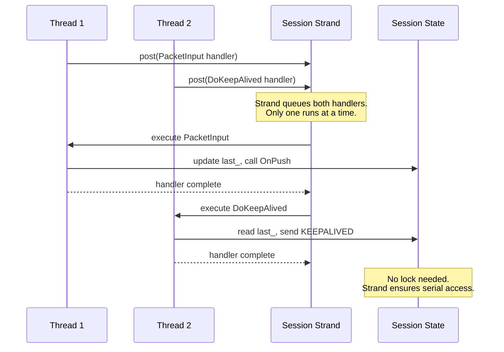

The diagram shows two threads competing to run handlers on the same strand. The strand queues them and dispatches them one at a time. `Session` state is accessed without any mutex because the strand provides mutual exclusion.

### Summary of Synchronization Primitives

| Situation | Primitive | Reason |
|-----------|-----------|--------|
| Per-session state fields | None (strand) | Strand serializes all session handlers. |
| Dispose flag | `std::atomic<bool>` + `compare_exchange_strong(acq_rel)` | External code reads flag outside the strand. |
| Connection ID generation | `std::atomic<unsigned int>` + `fetch_add(relaxed)` | Uniqueness across sessions; no ordering needed. |
| Session map in switcher | Mutex or strand-protected access | Multiple sessions can be added/removed concurrently. |
| Firewall table | Read-write lock or copy-on-write | Firewall rules are read frequently, written rarely. |

---

## 6. MUX Channel State Machine

### Overview

The MUX (multiplexing) subsystem allows a single tunnel session to carry multiple logical virtual channels, increasing throughput and resilience. When `--tun-mux=N` is set on the CLI, the client sends `PacketAction_MUX` to establish N parallel connections under one session.

### MUX States

| State | Description |
|-------|-------------|
| `Inactive` | MUX not requested; single-connection mode. |
| `Requesting` | Client sent `PacketAction_MUX`; waiting for `PacketAction_MUXON`. |
| `Active` | Server acknowledged with `MUXON`; multiple sub-connections active. |
| `Teardown` | Session disposal triggered; sub-connections being closed. |

### MUX Handshake

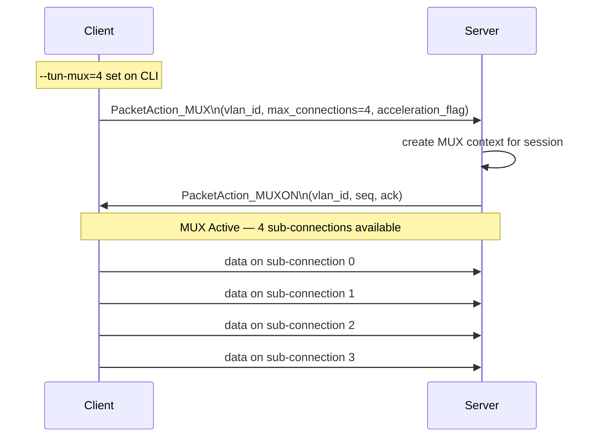

---

## 7. FRP (Fast Reverse Proxy) State Machine

### Overview

FRP allows an external client to connect through the server's public port and have the tunnel forward that connection to a service running on the VPN client side. This is the reverse of normal VPN traffic flow.

### FRP States

| State | Description |
|-------|-------------|
| `Unregistered` | No FRP rule exists for this client. |
| `Registered` | Client sent `FRP_ENTRY`; server has registered the port mapping. |
| `Connecting` | External connection arrived; server sent `FRP_CONNECT` to client. |
| `Tunneling` | Client acknowledged with `FRP_CONNECTOK`; data relay active. |
| `Closed` | Either side sent `FRP_DISCONNECT`; relay cleaned up. |

### FRP Connection Flow

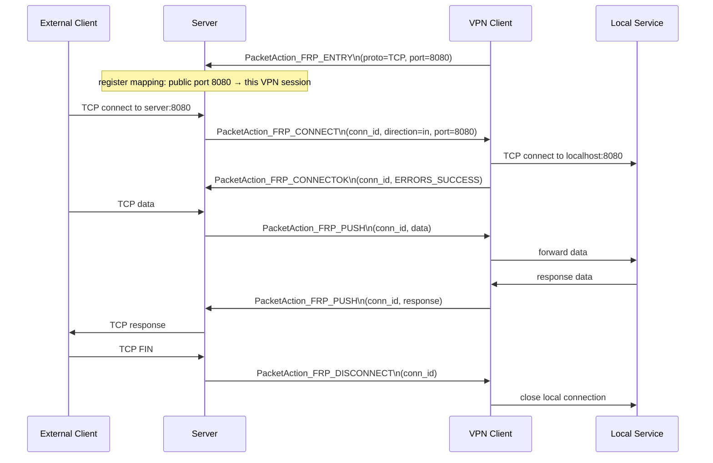

---

## 8. Error Handling in State Transitions

Every state transition that fails must:

1. Call `ppp::diagnostics::SetLastErrorCode(ErrorCode::SomeCode)` with a specific code.
2. Return the appropriate sentinel value (`false`, `-1`, or `NULLPTR`).
3. Not leave the session in an undefined intermediate state.

The calling layer (typically the session scheduler or the dispose chain) reads the error code via `GetLastErrorCode()` or the snapshot API and surfaces it to the Console UI status bar.

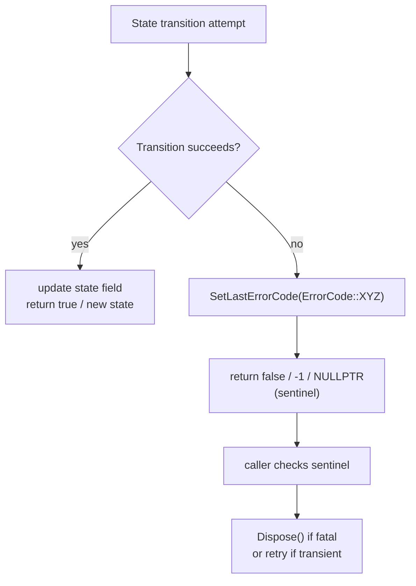

### Common Error Codes for State Transitions

| Error Code | When Set |
|------------|----------|
| `SessionHandshakeFailed` | Handshake timed out or received malformed response |
| `KeepaliveTimeout` | `DoKeepAlived()` determined deadline exceeded |
| `TunnelReadFailed` | `ITransmission::Read()` returned null |
| `TunnelWriteFailed` | `ITransmission::Write()` returned false |
| `SessionDisposed` | Handler entered already-disposed session |
| `RuntimeCoroutineSpawnFailed` | `YieldContext::Spawn()` failed to allocate stack |

---

## 9. Diagnostics and Observability

Session state transitions are observable through two mechanisms:

**Thread-local error codes**: `GetLastErrorCode()` returns the most recent error set by the calling thread. This is the first line of diagnostics when a single transition fails.

**Process-wide error snapshot**: `GetLastErrorCodeSnapshot()` and `GetLastErrorTimestamp()` return the last error that was published process-wide. The Console UI status bar uses these to show the most recent failure without polling individual threads.

**ConsoleUI Info Output**: The `openppp2 info` command in the Console UI prints a snapshot of the current session state, including VPN state, session count, bandwidth, and error snapshot.

See `DIAGNOSTICS_ERROR_SYSTEM.md` for the full diagnostics API.

---

## Related Documents

- [`ARCHITECTURE.md`](ARCHITECTURE.md)
- [`CONCURRENCY_MODEL.md`](CONCURRENCY_MODEL.md)
- [`LINKLAYER_PROTOCOL.md`](LINKLAYER_PROTOCOL.md)
- [`HANDSHAKE_SEQUENCE.md`](HANDSHAKE_SEQUENCE.md)
- [`SOURCE_READING_GUIDE.md`](SOURCE_READING_GUIDE.md)
- [`PACKET_LIFECYCLE.md`](PACKET_LIFECYCLE.md)
- [`DIAGNOSTICS_ERROR_SYSTEM.md`](DIAGNOSTICS_ERROR_SYSTEM.md)
- [`ERROR_CODES.md`](ERROR_CODES.md)
