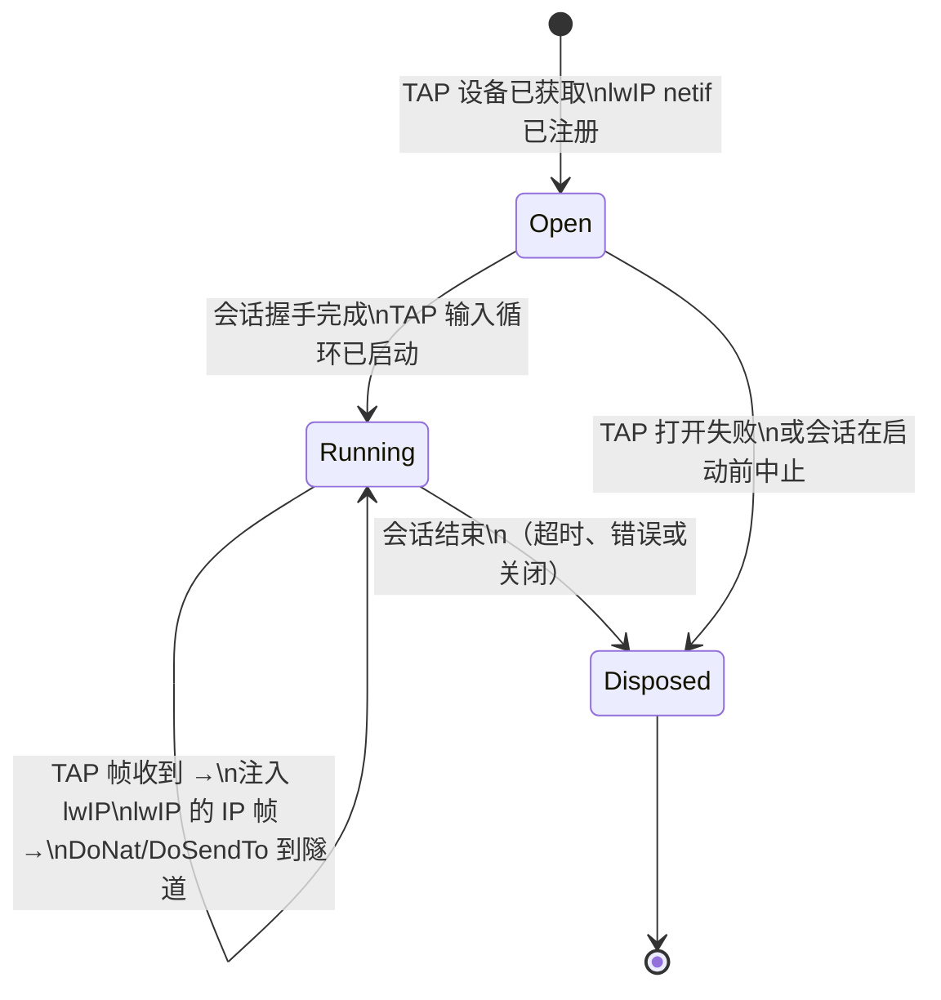
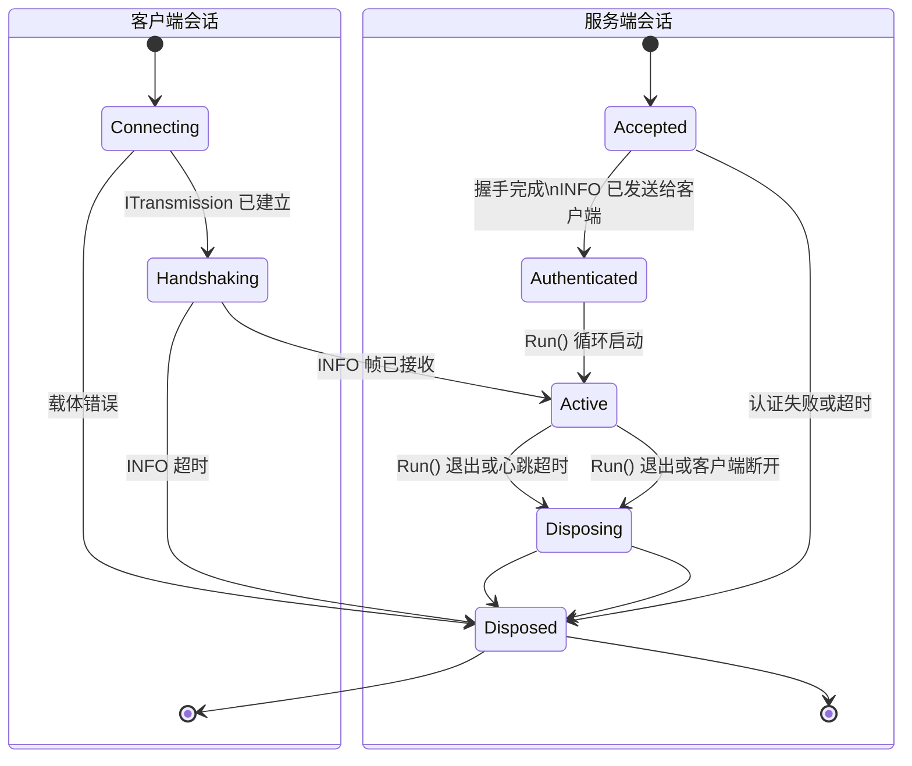
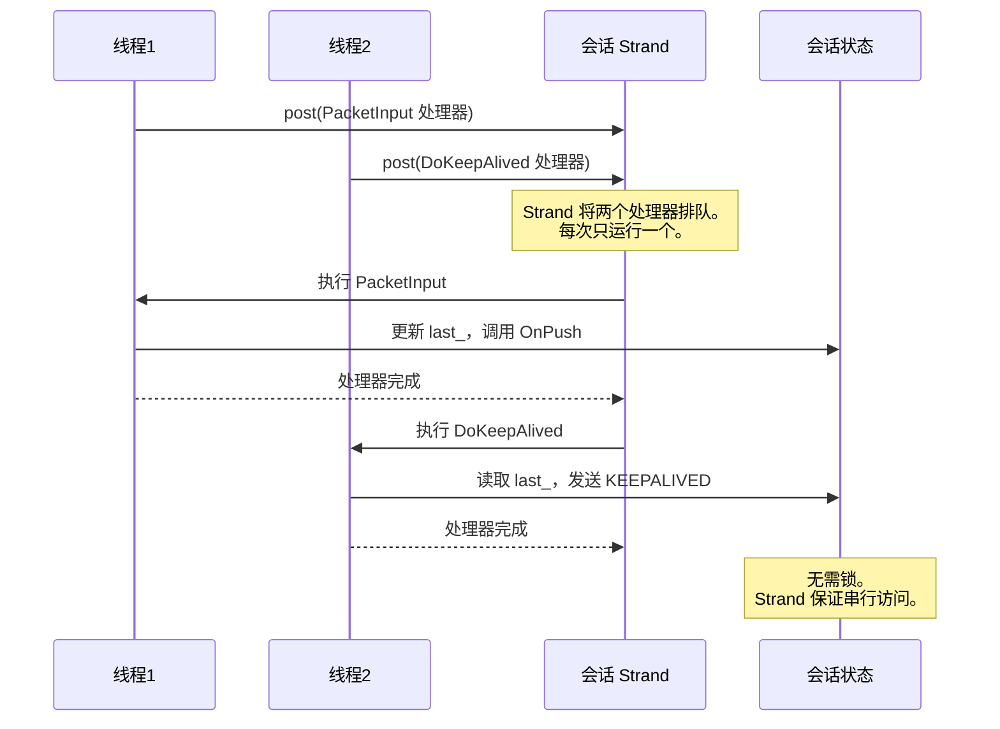

# EDSM 状态机

[English Version](EDSM_STATE_MACHINES.md)

本文档描述 OPENPPP2 中使用的事件驱动状态机（EDSM）架构，涵盖每个状态、每个转换触发器以及保证安全性的并发模型。

---

## 1. EDSM 设计哲学

### EDSM 在本项目中的含义

OPENPPP2 不是传统的请求-响应服务器，而是一个虚拟以太网基础设施，必须同时维护数千个长连接会话，每个会话承载混合的 TCP、UDP、ICMP 和控制流量。核心设计承诺是：**没有任何 OS 线程会阻塞等待网络 I/O**。每个会话作为 Boost.Asio 有栈协程运行；当 I/O 未就绪时协程让出控制权，线程转而处理另一个就绪的协程，原协程在数据到达时恢复执行。

EDSM（事件驱动状态机）这个术语描述了这个结果的本质：每个会话对象是一个状态机，其转换由协议事件驱动（数据包到达、定时器到期、连接完成），事件循环——Boost.Asio `io_context`——通过 strand 而非锁来序列化这些转换。

### 为什么选择 EDSM 而非传统多线程

传统多线程 VPN 服务器为每个会话分配一到两个 OS 线程。当会话数达到数千时，线程上下文切换开销和每线程栈内存成为主要瓶颈。每个共享资源边界都需要加锁，死锁分析的复杂度随线程数量指数级增长。

EDSM 方案颠覆了这一模式：有 O(CPU 核数) 个 OS 线程，每个线程运行许多协程。协程栈很小（通常 64 KB，从 jemalloc 分配），切换耗时纳秒级而非微秒级。strand 将一个会话上的所有操作序列化到同一个逻辑线程，从根本上消除了每会话锁的需求。跨会话数据（switcher 的会话映射表、防火墙表）仍然需要原子操作或共享状态锁，但这些是粗粒度且低频的。

对于代码阅读者，实际含义是：**如果在每会话处理器内看到锁，应将其视为需要关注的信号**。由于 strand 保证串行执行，大多数每会话状态不加锁就是安全的。

### Boost.Asio `io_context` 如何实现事件循环

每个 `io_context` 实例维护一个就绪处理器的运行队列。OS 线程在循环中调用 `io_context::run()`；每次调用从队列中取出一个处理器，执行到完成，然后返回循环。strand（`boost::asio::strand`）包装一个处理器子集，确保无论线程池中有多少线程，同一时刻最多只有一个 strand 包装的处理器在运行。这提供了 EDSM 保证：即使线程池是多线程的，会话 A 的转换永远不会与另一个线程上会话 A 的转换交错执行。

`Executors::Spawn` 创建有栈协程并将其发布到相应的 strand。`YieldContext` 捕获协程的恢复句柄。当异步操作完成时，其完成处理器通过 yield context 恢复协程。协程继续执行，直到再次让出或返回。

---

## 2. VirtualEthernetLinklayer 状态机

### 概述

`VirtualEthernetLinklayer`（`ppp/app/protocol/VirtualEthernetLinklayer.h`）是客户端和服务端所有会话对象的基类。它本身不是一个完整的状态机——它是**协议编解码器和分发器**，驱动在其派生类中实现的状态机（客户端的 `VEthernetExchanger`，服务端的每会话处理器）。尽管如此，链路层本身有一个具有明确定义状态的隐式生命周期。

### 状态

| 状态 | 描述 |
|------|------|
| `Idle` | 对象已构造；未分配传输通道；没有协程在运行。 |
| `Running` | `Run()` 已被调用；接收循环在协程内活跃；`PacketInput` 正在分发帧。 |
| `KeepAliveArmed` | 至少收到一个数据包；`last_` 时间戳已更新；`DoKeepAlived` 定时器逻辑活跃。 |
| `Disposed` | `Run()` 返回（传输读取失败或 `PacketInput` 返回 false）；对象正在被释放。 |

从 `Running` 到 `KeepAliveArmed` 的转换是隐式的——发生在第一次成功的 `PacketInput` 调用时。从 `Running` 或 `KeepAliveArmed` 到 `Disposed` 的转换发生在 `Run()` 退出接收循环时。

### 状态图

### PacketAction 操作码及其在状态转换中的角色

`PacketAction` 枚举定义了 17 个操作码。`PacketInput` 读取每个入站帧的第一个字节，选择操作码，解析剩余的 wire 格式，并调用对应的 `On*` 虚方法。下表将每个操作码映射到其 wire 角色以及它在派生类中可能触发的状态变化。

| 操作码 | 十六进制 | 方向 | Wire 角色 | 状态影响 |
|--------|---------|------|-----------|---------|
| `PacketAction_INFO` | `0x7E` | 服务端 → 客户端 | 会话配额和带宽 QoS 载荷。包含 `VirtualEthernetInformation` 结构体和可选 JSON 扩展。 | 客户端记录配额；可能更新速率限制器状态。 |
| `PacketAction_KEEPALIVED` | `0x7F` | 双向 | 带随机可打印载荷的心跳帧。接收方更新 `last_`。 | 刷新 `last_` 时间戳，防止空闲超时导致的释放。 |
| `PacketAction_SYN` | `0x2A` | 客户端 → 服务端 | TCP 连接请求。携带 3 字节连接 ID 和编码后的目标端点。 | 服务端打开真实 TCP socket；触发 `OnConnect`。 |
| `PacketAction_SYNOK` | `0x2B` | 服务端 → 客户端 | TCP 连接确认。携带连接 ID 和 1 字节错误码。 | 客户端通过 `OnConnectOK` 获知连接结果；会话进入数据中继状态或关闭。 |
| `PacketAction_PSH` | `0x2C` | 双向 | TCP 流数据。携带连接 ID 和载荷字节。 | 通过 `OnPush` 将载荷路由到对应的 TCP 中继 socket。 |
| `PacketAction_FIN` | `0x2D` | 双向 | TCP 关闭通知。携带连接 ID。 | 关闭中继 socket；通过 `OnDisconnect` 从会话映射中移除连接。 |
| `PacketAction_SENDTO` | `0x2E` | 双向 | 带源/目标端点描述符的 UDP 数据报。 | `OnSendTo` 将数据报注入 lwIP 或转发到目标。 |
| `PacketAction_ECHO` | `0x2F` | 客户端 → 服务端 | 延迟探测载荷。 | 服务端通过 `DoEcho(ack_id)` 回应；用于 RTT 测量。 |
| `PacketAction_ECHOACK` | `0x30` | 服务端 → 客户端 | 携带探测 ID 的 Echo 确认。 | 客户端通过 `OnEcho(ack_id)` 记录 RTT 样本。 |
| `PacketAction_NAT` | `0x29` | 双向 | 原始 IP 帧转发（封装的 NAT 载荷）。 | `OnNat` 解封装并注入 lwIP 或路由到目标。 |
| `PacketAction_LAN` | `0x28` | 服务端 → 客户端 | LAN 子网通告（IP + 掩码对）。 | 客户端通过 `OnLan` 向虚拟网卡添加路由。 |
| `PacketAction_STATIC` | `0x31` | 客户端 → 服务端 | 静态端口映射查询。 | 服务端查找映射，通过 `OnStatic` 以 STATICACK 回应。 |
| `PacketAction_STATICACK` | `0x32` | 服务端 → 客户端 | 静态端口映射确认。携带 FSID、会话 ID、远端端口。 | 客户端通过 `OnStatic(fsid, session_id, remote_port)` 记录静态映射。 |
| `PacketAction_MUX` | `0x35` | 客户端 → 服务端 | MUX 通道建立请求。携带 VLAN ID、最大连接数、加速标志。 | 服务端创建 MUX 上下文；通过 `OnMux` 以 MUXON 回应。 |
| `PacketAction_MUXON` | `0x36` | 服务端 → 客户端 | MUX 通道建立确认。携带 VLAN ID、seq、ack。 | 客户端通过 `OnMuxON` 激活 MUX 通道。 |
| `PacketAction_FRP_ENTRY` | `0x20` | 客户端 → 服务端 | FRP：注册端口映射（TCP/UDP、进/出、远端端口）。 | 服务端通过 `OnFrpEntry` 注册 FRP 规则。 |
| `PacketAction_FRP_CONNECT` | `0x21` | 双向 | FRP：在注册端口上打开新的隧道连接。 | 接收方通过 `OnFrpConnect` 创建 FRP 中继会话。 |
| `PacketAction_FRP_CONNECTOK` | `0x22` | 双向 | FRP：连接打开确认，带错误码。 | 对端通过 `OnFrpConnectOK` 获知 FRP 连接结果。 |
| `PacketAction_FRP_PUSH` | `0x23` | 双向 | FRP：隧道连接的流数据。 | `OnFrpPush` 将载荷路由到 FRP 中继 socket。 |
| `PacketAction_FRP_DISCONNECT` | `0x24` | 双向 | FRP：通知连接关闭。 | `OnFrpDisconnect` 关闭 FRP 中继 socket。 |
| `PacketAction_FRP_SENDTO` | `0x25` | 双向 | FRP：在注册端口上发送 UDP 数据报。 | `OnFrpSendTo` 通过 FRP UDP 中继转发 UDP 载荷。 |

### Keepalive / 心跳机制

`DoKeepAlived(transmission, now)` 由每会话定时器调用，通常在会话调度器的每个 tick 上调用。逻辑如下：

1. 计算 `deadline = last_ + (max_timeout_ms + EXTRA_FAULT_TOLERANT_TIME)`。若 `now >= deadline`，会话被认为已死亡——返回 `false` 信号释放。
2. 第一次调用时（`next_ka_ == 0`），在 `[1000ms, max_timeout_ms]` 内随机延迟调度第一次心跳，避免大量会话同步发送心跳引起的风暴。
3. 若 `now >= next_ka_`，发送带随机可打印载荷（长度随机选取，最多 MTU）的 `PacketAction_KEEPALIVED` 帧，避免通过流量模式指纹识别心跳。
4. 以另一个随机间隔调度下一次心跳。

接收方逻辑很简单：`PacketAction_KEEPALIVED` 帧更新 `last_` 并返回 `true`。不发送确认。随机载荷防止被动观察者通过大小或周期识别心跳流量。

---

## 3. VEthernet（虚拟网卡）状态机

### 概述

`VEthernet`（`ppp/ethernet/VEthernet.h`）代表虚拟网卡，它将 OS TAP/TUN 驱动（或 Android VPN 服务 fd）与 lwIP TCP/IP 协议栈桥接起来。它有一个清晰的三状态生命周期，由 TAP 设备可用性和 lwIP 协议栈初始化序列驱动。

### 状态与转换

**Open（已打开）**：TAP 设备文件描述符已获取，lwIP `netif` 已注册。`AppConfiguration` 中配置的 IP 地址和子网掩码已分配给 netif。`VEthernet` 已准备好发送和接收数据，但应用层会话可能尚未建立。

**Running（运行中）**：关联的 `VirtualEthernetLinklayer` 会话已完成握手。TAP 输入循环活跃：从 OS 读取原始以太网帧，通过 `netif_input` 传给 lwIP，lwIP 将 IP 数据报通过会话的 `DoNat`/`DoSendTo` 路径路由到隧道。来自 lwIP 的出站帧（从真实目标通过隧道到达的响应）被写回 TAP 设备。

**Disposed（已释放）**：会话已结束（链路层超时、错误或显式关闭）。lwIP `netif` 已移除。TAP 文件描述符已关闭。对 `VEthernet` 对象的所有引用已释放，通过 RAII 触发析构清理。

### 状态图

### TAP 输入如何触发状态转换

TAP 输入循环在 `Executors::Spawn` 派生的协程内运行，在 yield-suspend 循环中调用 `ITap::Read()`。每次成功读取产生一个原始以太网帧。该帧经过验证（最小尺寸、EtherType 检查），然后传递给 `lwip_netif_input()`。lwIP 处理 IP 层：ARP、ICMP、TCP 和 UDP 均在内部处理。当 lwIP 要发送数据包时（例如从隧道收到的 TCP 响应），它调用 `netif->output` 回调，该回调通过 `VirtualEthernetPacket::Pack` 序列化 IP 帧并将其转发到 TAP 设备。

在 Android 上，TAP 设备被 VPN 服务的 `ParcelFileDescriptor` 替代，但 `VEthernet` 接口完全相同，只有 `ITap` 实现不同。

---

## 4. 会话（Exchanger）生命周期

### 客户端会话状态

客户端会话由 `VEthernetExchanger` 管理。它从客户端应用建立到服务器的连接时开始，到传输失败或心跳超时时结束。

| 状态 | 描述 |
|------|------|
| `Connecting` | `ITransmission` 载体正在建立；TLS 或 WebSocket 握手进行中。 |
| `Handshaking` | 载体已建立；链路层 `INFO` 交换进行中（客户端从服务器接收配额）。 |
| `Active` | INFO 已接收；`Run()` 循环运行中；lwIP 流量正在被隧道传输。 |
| `Disposing` | `Run()` 已退出或心跳失败；资源正在释放。 |
| `Disposed` | 所有 socket、定时器和 lwIP 引用已释放。 |

### 服务端会话状态

服务端没有单一的 `VEthernetExchanger`。`VirtualEthernetSwitcher` 维护每客户端会话处理器的映射表。每个处理器的生命周期是：

| 状态 | 描述 |
|------|------|
| `Accepted` | 客户端新 TCP 连接已接受；`ITransmission` 正在协商。 |
| `Authenticated` | 握手完成；服务器向客户端发送带配额的 `INFO` 帧。 |
| `Active` | `Run()` 循环运行中；正在转发 TCP、UDP 和 NAT 流量。 |
| `Disposing` | `Run()` 已退出；会话映射条目正在移除；中继 socket 正在关闭。 |
| `Disposed` | 所有资源已释放；会话对象引用计数降为零。 |

### 会话生命周期图

### Dispose 模式

客户端和服务端会话对象都遵循严格的 dispose 模式，以防止在多协程环境中出现 use-after-free：

1. 用 `compare_exchange_strong(memory_order_acq_rel)` 设置 `std::atomic<bool>` 标志（`disposed_` 或类似名称）。只有第一个调用者进行清理；后续调用均为空操作。
2. 取消所有定时器。
3. 以 `shutdown + close` 关闭所有中继 TCP socket。
4. 关闭所有 UDP socket。
5. 释放 `ITransmission`（shared_ptr 重置）。
6. 在 switcher 对该映射表使用的任何保护机制下删除会话映射条目。
7. 释放 `VEthernet`（若为客户端）。
8. 释放指向会话对象的 `shared_ptr`，当最后一个引用释放时触发析构函数。

---

## 5. EDSM 中的并发安全性

### 为什么 Strand 使大多数锁变得不必要

在传统多线程设计中，会话的状态字段必须由互斥锁保护，因为多个线程可能同时执行会话代码。在 EDSM 设计中，给定会话的所有处理器都发布到同一个 strand。strand 保证**同一时刻最多只有一个处理器在执行**。这意味着会话的状态字段（连接映射表、中继 socket 指针、`last_` 和 `next_ka_` 等时间戳字段）不需要互斥锁——strand 提供了 happens-before 排序。

io_context 线程池可以有 N 个线程，但对于给定的 strand，任何时刻只有一个线程执行其处理器。其余 N-1 个线程可以自由并行运行其他 strand（其他会话）的处理器。这是关键的可扩展性特性：会话级隔离是免费的，跨会话并行是自动的。

### 哪里需要原子标志

当 strand 外部的代码需要查询或通知一个会话时，strand 就无济于事了。两种常见情况是：

**生命周期标志**：`disposed_` 原子标志被外部代码（例如发布到不同 strand 的定时器回调）读取，以决定是否向会话的 strand 发布工作。没有原子操作，标志值上存在数据竞争。使用 `memory_order_acq_rel` 的 `compare_exchange_strong` 确保一旦标志被设置，所有后续读者都能看到已设置的值，并且设置者执行的清理操作对所有线程可见。

**连接 ID 生成器**：`VirtualEthernetLinklayer::NewId()` 使用带 `fetch_add(memory_order_relaxed)` 的 `std::atomic<unsigned int>` 在所有会话中生成唯一的 24 位连接 ID，无需互斥锁。`relaxed` 排序已足够，因为唯一性是唯一要求，不需要相对其他操作的 happens-before 排序。

### Strand 序列化时序图

上图展示了两个线程竞争在同一 strand 上运行处理器。strand 将它们排队并逐个分发。访问 `Session` 状态时无需互斥锁，因为 strand 提供了互斥。

### 同步原语汇总

| 场景 | 原语 | 原因 |
|------|------|------|
| 每会话状态字段 | 无（依靠 strand） | Strand 序列化所有会话处理器。 |
| Dispose 标志 | `std::atomic<bool>` + `compare_exchange_strong(acq_rel)` | 外部代码在 strand 外读取标志。 |
| 连接 ID 生成 | `std::atomic<unsigned int>` + `fetch_add(relaxed)` | 跨会话唯一性；不需要排序保证。 |
| Switcher 中的会话映射表 | 互斥锁或 strand 保护的访问 | 多个会话可以并发添加/移除。 |
| 防火墙表 | 读写锁或 copy-on-write | 防火墙规则读频繁，写罕见。 |

---

## 相关文档

- [`ARCHITECTURE_CN.md`](ARCHITECTURE_CN.md)
- [`CONCURRENCY_MODEL_CN.md`](CONCURRENCY_MODEL_CN.md)
- [`LINKLAYER_PROTOCOL_CN.md`](LINKLAYER_PROTOCOL_CN.md)
- [`HANDSHAKE_SEQUENCE_CN.md`](HANDSHAKE_SEQUENCE_CN.md)
- [`SOURCE_READING_GUIDE_CN.md`](SOURCE_READING_GUIDE_CN.md)
- [`PACKET_LIFECYCLE_CN.md`](PACKET_LIFECYCLE_CN.md)
