# EDSM 状态机

[English Version](EDSM_STATE_MACHINES.md)

本文档描述 OPENPPP2 中使用的事件驱动状态机（EDSM）架构，涵盖每个状态、每个转换触发器以及保证安全性的并发模型。

---

## 1. EDSM 设计哲学

### 1.1 EDSM 在本项目中的含义

OPENPPP2 不是传统的请求-响应服务器，而是一个虚拟以太网基础设施，必须同时维护数千个长连接会话，每个会话承载混合的 TCP、UDP、ICMP 和控制流量。核心设计承诺是：**没有任何 OS 线程会阻塞等待网络 I/O**。每个会话作为 Boost.Asio 有栈协程运行；当 I/O 未就绪时协程让出控制权，线程转而处理另一个就绪的协程，原协程在数据到达时恢复执行。

EDSM（事件驱动状态机）这个术语描述了这个结果的本质：每个会话对象是一个状态机，其转换由协议事件驱动（数据包到达、定时器到期、连接完成），事件循环——Boost.Asio `io_context`——通过 strand 而非锁来序列化这些转换。

### 1.2 为什么选择 EDSM 而非传统多线程

传统多线程 VPN 服务器为每个会话分配一到两个 OS 线程。当会话数达到数千时，线程上下文切换开销和每线程栈内存成为主要瓶颈。每个共享资源边界都需要加锁，死锁分析的复杂度随线程数量指数级增长。

EDSM 方案颠覆了这一模式：有 O(CPU 核数) 个 OS 线程，每个线程运行许多协程。协程栈很小（通常 64 KB，从 jemalloc 分配），切换耗时纳秒级而非微秒级。strand 将一个会话上的所有操作序列化到同一个逻辑线程，从根本上消除了每会话锁的需求。

| 对比维度 | 传统多线程方案 | EDSM + 协程方案 |
|----------|--------------|----------------|
| OS 线程数 | O(会话数) | O(CPU 核数) |
| 每会话内存 | 1–2 MB 线程栈 | 64 KB 协程栈（jemalloc） |
| 上下文切换 | 微秒级（OS 调度） | 纳秒级（用户态协程切换） |
| 锁需求 | 每会话需锁保护共享状态 | Strand 串行化，大多数每会话状态无需锁 |
| 死锁风险 | 随线程数指数增长 | 大幅降低（锁仅用于跨会话共享数据） |

### 1.3 Boost.Asio `io_context` 如何实现事件循环

每个 `io_context` 实例维护一个就绪处理器的运行队列。OS 线程在循环中调用 `io_context::run()`；每次调用从队列中取出一个处理器，执行到完成，然后返回循环。strand（`boost::asio::strand`）包装一个处理器子集，确保无论线程池中有多少线程，同一时刻最多只有一个 strand 包装的处理器在运行。

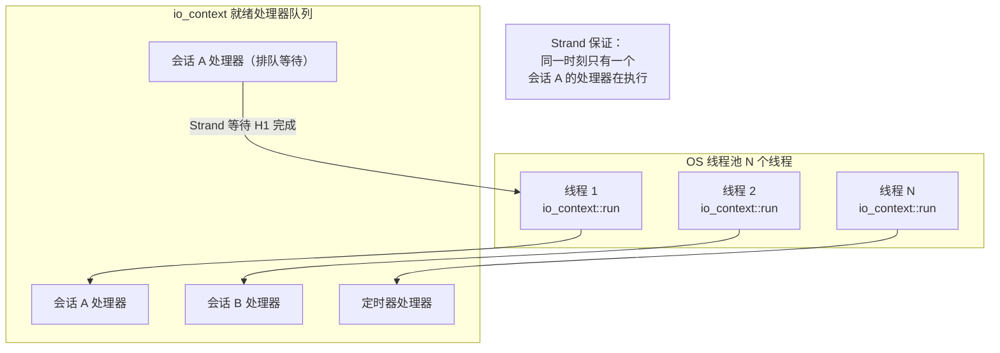

`Executors::Spawn` 创建有栈协程并将其发布到相应的 strand。`YieldContext` 捕获协程的恢复句柄。当异步操作完成时，其完成处理器通过 yield context 恢复协程。

---

## 2. VirtualEthernetLinklayer 状态机

### 2.1 概述

`VirtualEthernetLinklayer`（`ppp/app/protocol/VirtualEthernetLinklayer.h`）是客户端和服务端所有会话对象的基类。它本身不是一个完整的状态机——它是**协议编解码器和分发器**，驱动在其派生类中实现的状态机（客户端的 `VEthernetExchanger`，服务端的每会话处理器）。尽管如此，链路层本身有一个具有明确定义状态的隐式生命周期。

### 2.2 状态定义

| 状态 | 描述 | 进入条件 | 退出条件 |
|------|------|----------|----------|
| `Idle` | 对象已构造；未分配传输通道；没有协程在运行。 | 对象构造 | 调用 `Run()` |
| `Running` | `Run()` 已被调用；接收循环在协程内活跃；`PacketInput` 正在分发帧。 | 调用 `Run()` 并传入有效 transmission | transmission 读取失败或 `PacketInput` 返回 false |
| `KeepAliveArmed` | 至少收到一个数据包；`last_` 时间戳已更新；`DoKeepAlived` 定时器逻辑活跃。 | 第一次成功的 `PacketInput` 调用 | 空闲超时或 `PacketInput` 返回 false |
| `Disposed` | `Run()` 返回；对象正在被释放。 | 任何退出条件 | 析构完成 |

### 2.3 状态图

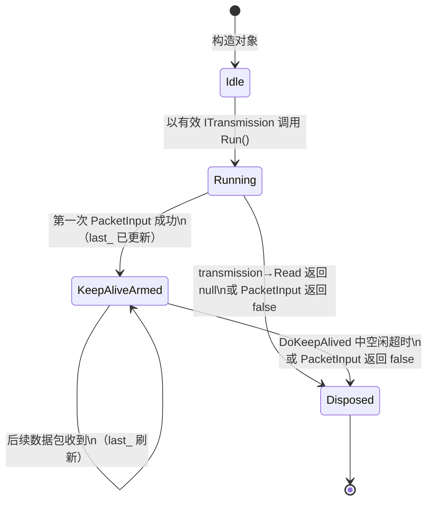

### 2.4 PacketAction 操作码及其状态影响

`PacketAction` 枚举定义了 20+ 个操作码。`PacketInput` 读取每个入站帧的第一个字节，选择操作码，解析剩余的 wire 格式，并调用对应的 `On*` 虚方法。

| 操作码 | 十六进制 | 方向 | Wire 角色 | 状态影响 |
|--------|---------|------|-----------|---------|
| `PacketAction_INFO` | `0x7E` | S → C | 会话配额和带宽 QoS 载荷 | 客户端记录配额；可能更新速率限制器状态 |
| `PacketAction_KEEPALIVED` | `0x7F` | 双向 | 带随机可打印载荷的心跳帧 | 刷新 `last_` 时间戳，防止空闲超时 |
| `PacketAction_SYN` | `0x2A` | C → S | TCP 连接请求；携带 3 字节连接 ID 和编码后的目标端点 | 服务端打开真实 TCP socket；触发 `OnConnect` |
| `PacketAction_SYNOK` | `0x2B` | S → C | TCP 连接确认；携带连接 ID 和 1 字节错误码 | 客户端通过 `OnConnectOK` 获知连接结果 |
| `PacketAction_PSH` | `0x2C` | 双向 | TCP 流数据；携带连接 ID 和载荷字节 | 通过 `OnPush` 将载荷路由到对应的 TCP 中继 socket |
| `PacketAction_FIN` | `0x2D` | 双向 | TCP 关闭通知；携带连接 ID | 关闭中继 socket；通过 `OnDisconnect` 移除连接 |
| `PacketAction_SENDTO` | `0x2E` | 双向 | 带源/目标端点描述符的 UDP 数据报 | `OnSendTo` 将数据报注入 lwIP 或转发到目标 |
| `PacketAction_ECHO` | `0x2F` | C → S | 延迟探测载荷 | 服务端通过 `DoEcho(ack_id)` 回应；用于 RTT 测量 |
| `PacketAction_ECHOACK` | `0x30` | S → C | 携带探测 ID 的 Echo 确认 | 客户端通过 `OnEcho(ack_id)` 记录 RTT 样本 |
| `PacketAction_NAT` | `0x29` | 双向 | 原始 IP 帧转发（封装的 NAT 载荷） | `OnNat` 解封装并注入 lwIP 或路由到目标 |
| `PacketAction_LAN` | `0x28` | S → C | LAN 子网通告（IP + 掩码对） | 客户端通过 `OnLan` 向虚拟网卡添加路由 |
| `PacketAction_STATIC` | `0x31` | C → S | 静态端口映射查询 | 服务端查找映射，通过 `OnStatic` 以 STATICACK 回应 |
| `PacketAction_STATICACK` | `0x32` | S → C | 静态端口映射确认；携带 FSID、会话 ID、远端端口 | 客户端通过 `OnStatic(fsid, session_id, remote_port)` 记录静态映射 |
| `PacketAction_MUX` | `0x35` | C → S | MUX 通道建立请求；携带 VLAN ID、最大连接数、加速标志 | 服务端创建 MUX 上下文；通过 `OnMux` 以 MUXON 回应 |
| `PacketAction_MUXON` | `0x36` | S → C | MUX 通道建立确认；携带 VLAN ID、seq、ack | 客户端通过 `OnMuxON` 激活 MUX 通道 |
| `PacketAction_FRP_ENTRY` | `0x20` | C → S | FRP：注册端口映射（TCP/UDP、进/出、远端端口） | 服务端通过 `OnFrpEntry` 注册 FRP 规则 |
| `PacketAction_FRP_CONNECT` | `0x21` | 双向 | FRP：在注册端口上打开新的隧道连接 | 接收方通过 `OnFrpConnect` 创建 FRP 中继会话 |
| `PacketAction_FRP_CONNECTOK` | `0x22` | 双向 | FRP：连接打开确认，带错误码 | 对端通过 `OnFrpConnectOK` 获知 FRP 连接结果 |
| `PacketAction_FRP_PUSH` | `0x23` | 双向 | FRP：隧道连接的流数据 | `OnFrpPush` 将载荷路由到 FRP 中继 socket |
| `PacketAction_FRP_DISCONNECT` | `0x24` | 双向 | FRP：通知连接关闭 | `OnFrpDisconnect` 关闭 FRP 中继 socket |
| `PacketAction_FRP_SENDTO` | `0x25` | 双向 | FRP：在注册端口上发送 UDP 数据报 | `OnFrpSendTo` 通过 FRP UDP 中继转发 UDP 载荷 |

### 2.5 Keepalive / 心跳机制详解

`DoKeepAlived(transmission, now)` 由每会话定时器调用，通常在会话调度器的每个 tick 上调用。完整逻辑：

1. 计算 `deadline = last_ + (max_timeout_ms + EXTRA_FAULT_TOLERANT_TIME)`。若 `now >= deadline`，会话被认为已死亡——返回 `false` 信号释放。
2. 第一次调用时（`next_ka_ == 0`），在 `[1000ms, max_timeout_ms]` 内随机延迟调度第一次心跳，避免大量会话同步发送心跳引起的风暴。
3. 若 `now >= next_ka_`，发送带随机可打印载荷（长度随机选取，最多 MTU）的 `PacketAction_KEEPALIVED` 帧，避免通过流量模式指纹识别心跳。
4. 以另一个随机间隔调度下一次心跳。

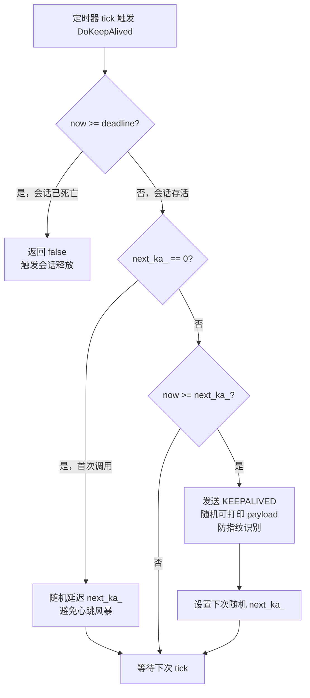

接收方逻辑：`PacketAction_KEEPALIVED` 帧更新 `last_` 并返回 `true`，不发送确认。随机载荷防止被动观察者通过大小或周期识别心跳流量。

---

## 3. VEthernet（虚拟网卡）状态机

### 3.1 概述

`VEthernet`（`ppp/ethernet/VEthernet.h`）代表虚拟网卡，它将 OS TAP/TUN 驱动（或 Android VPN 服务 fd）与 lwIP TCP/IP 协议栈桥接起来。它有一个清晰的三状态生命周期，由 TAP 设备可用性和 lwIP 协议栈初始化序列驱动。

### 3.2 状态与转换

**Open（已打开）**：TAP 设备文件描述符已获取，lwIP `netif` 已注册。`AppConfiguration` 中配置的 IP 地址和子网掩码已分配给 netif。`VEthernet` 已准备好发送和接收数据，但应用层会话可能尚未建立。

**Running（运行中）**：关联的 `VirtualEthernetLinklayer` 会话已完成握手。TAP 输入循环活跃：从 OS 读取原始以太网帧，通过 `netif_input` 传给 lwIP，lwIP 将 IP 数据报通过会话的 `DoNat`/`DoSendTo` 路径路由到隧道。

**Disposed（已释放）**：会话已结束。lwIP `netif` 已移除。TAP 文件描述符已关闭。

### 3.3 状态图

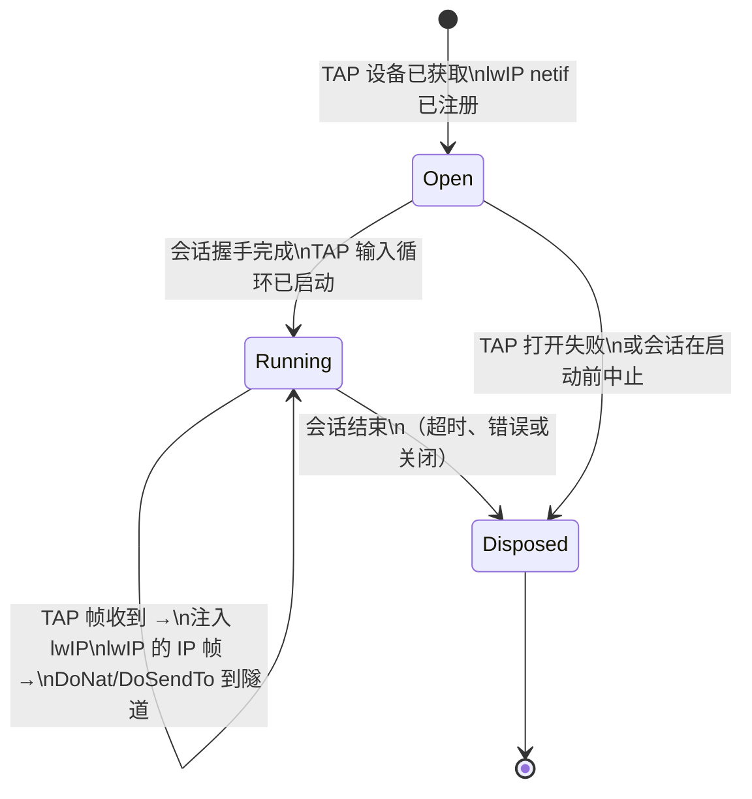

### 3.4 TAP 输入如何触发状态转换

TAP 输入循环在 `Executors::Spawn` 派生的协程内运行，在 yield-suspend 循环中调用 `ITap::Read()`。每次成功读取产生一个原始以太网帧。该帧经过验证（最小尺寸、EtherType 检查），然后传递给 `lwip_netif_input()`。

lwIP 处理 IP 层（ARP、ICMP、TCP、UDP），当 lwIP 要发送数据包时，它调用 `netif->output` 回调，该回调通过 `VirtualEthernetPacket::Pack` 序列化 IP 帧并将其转发到 TAP 设备。

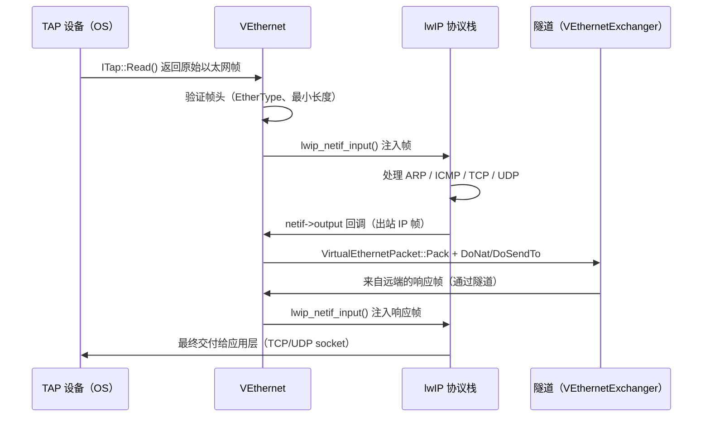

在 Android 上，TAP 设备被 VPN 服务的 `ParcelFileDescriptor` 替代，但 `VEthernet` 接口完全相同，只有 `ITap` 实现不同。

---

## 4. 会话（Exchanger）生命周期

### 4.1 客户端会话状态

客户端会话由 `VEthernetExchanger` 管理。

| 状态 | 描述 | 进入条件 | 退出条件 |
|------|------|----------|----------|
| `Connecting` | `ITransmission` 载体正在建立；TLS 或 WebSocket 握手进行中 | 会话对象创建 | 承载连接成功或失败 |
| `Handshaking` | 载体已建立；链路层 `INFO` 交换进行中 | 承载连接成功 | `INFO` 帧接收成功或超时 |
| `Active` | INFO 已接收；`Run()` 循环运行中；lwIP 流量正在被隧道传输 | `INFO` 帧接收成功 | `Run()` 退出或心跳失败 |
| `Disposing` | `Run()` 已退出或心跳失败；资源正在释放 | `Active` 退出 | 资源释放完成 |
| `Disposed` | 所有 socket、定时器和 lwIP 引用已释放 | 资源释放完成 | 析构 |

### 4.2 服务端会话状态

服务端没有单一的 `VEthernetExchanger`。`VirtualEthernetSwitcher` 维护每客户端会话处理器的映射表。

| 状态 | 描述 | 进入条件 | 退出条件 |
|------|------|----------|----------|
| `Accepted` | 客户端新 TCP 连接已接受；`ITransmission` 正在协商 | 新客户端连接到达 | 握手完成或失败 |
| `Authenticated` | 握手完成；服务器向客户端发送带配额的 `INFO` 帧 | 握手成功 | `Run()` 循环启动 |
| `Active` | `Run()` 循环运行中；正在转发 TCP、UDP 和 NAT 流量 | `INFO` 已发送 | `Run()` 退出或客户端断开 |
| `Disposing` | `Run()` 已退出；会话映射条目正在移除；中继 socket 正在关闭 | `Active` 退出 | 清理完成 |
| `Disposed` | 所有资源已释放；会话对象引用计数降为零 | 清理完成 | 析构 |

### 4.3 会话生命周期图

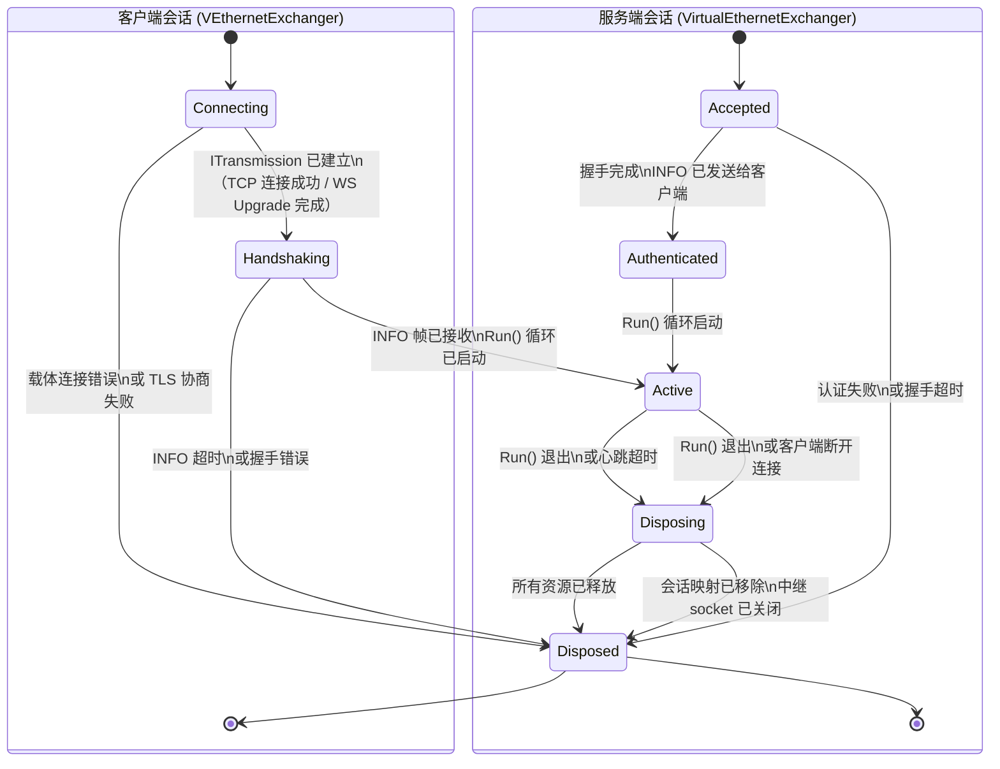

### 4.4 Dispose 模式

客户端和服务端会话对象都遵循严格的 dispose 模式，以防止在多协程环境中出现 use-after-free：

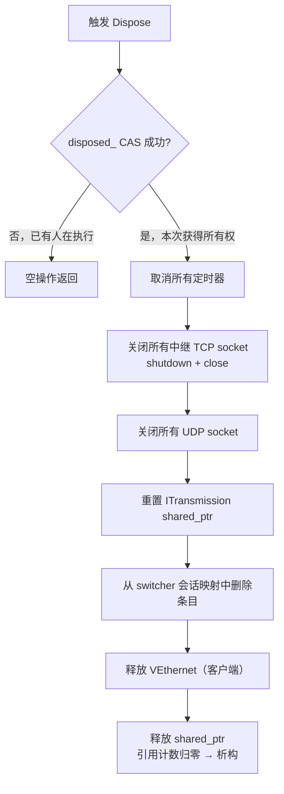

**CAS 的正确用法**：

```cpp
// 只有第一个调用者执行清理，后续调用均为空操作
bool expected = false;
if (!disposed_.compare_exchange_strong(expected, true,
        std::memory_order_acq_rel,
        std::memory_order_relaxed))
{
    return; // 已被其他协程/线程 dispose
}
// 安全地执行清理逻辑
```

---

## 5. 连接（Connection）状态机

### 5.1 TCP 连接条目生命周期

每个通过隧道建立的 TCP 连接在链路层维护一个连接条目（以连接 ID 为键）。

| 状态 | 描述 |
|------|------|
| `Requested` | 客户端发送 SYN；等待服务端响应 |
| `Established` | 服务端发送 SYNOK；双向数据可以传输 |
| `HalfClosed` | 一端发送 FIN；等待对端 FIN |
| `Closed` | 双端均已发送 FIN 或发生错误；连接条目将被移除 |

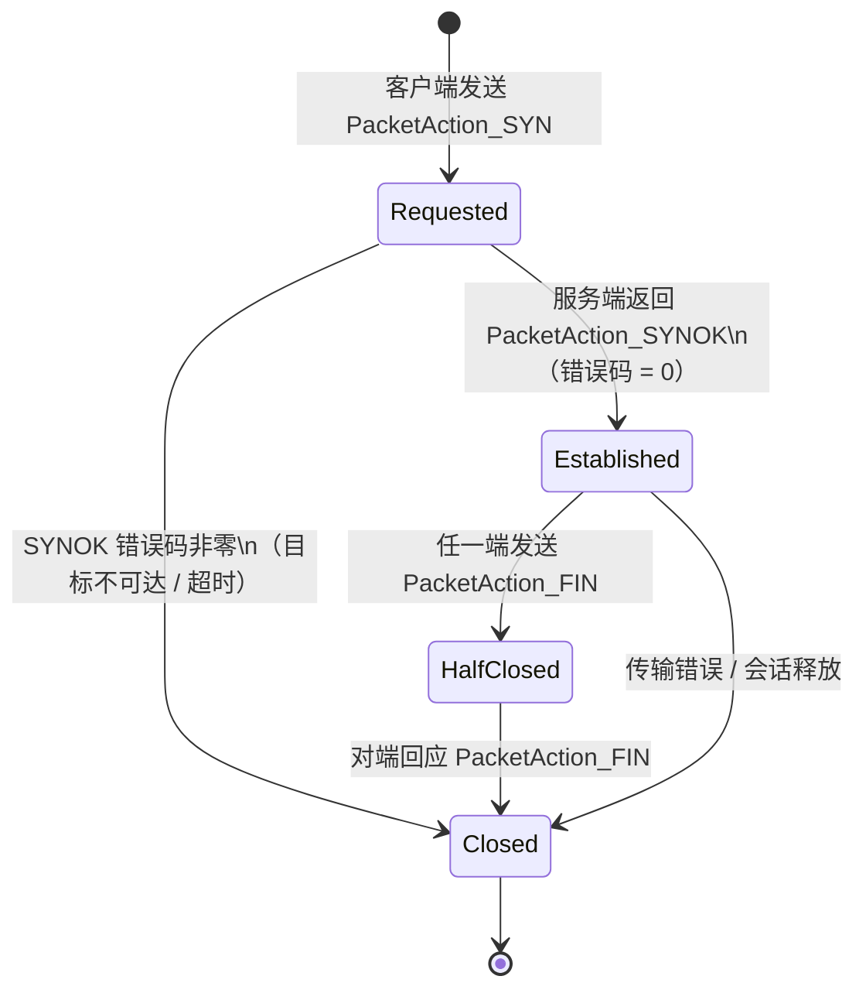

### 5.2 FRP 映射连接生命周期

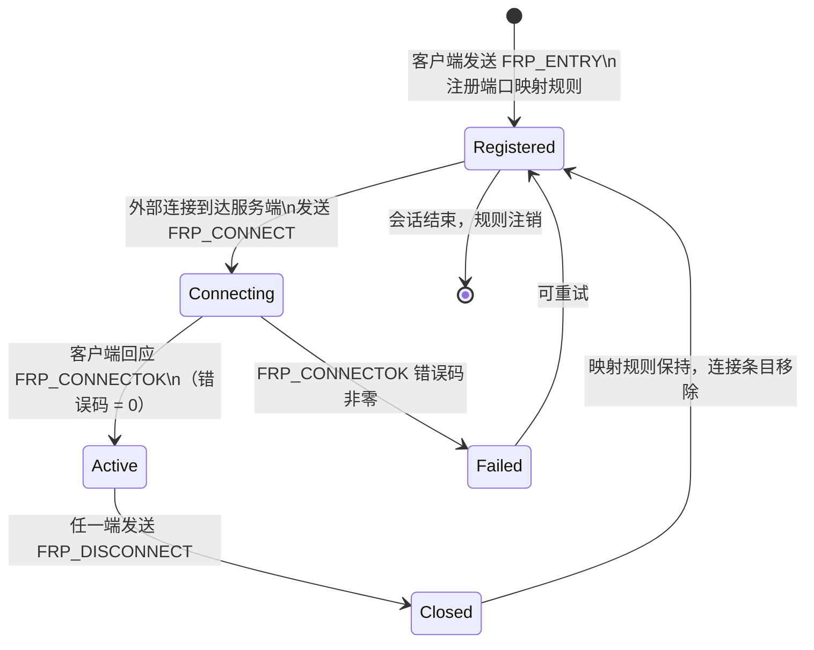

---

## 6. EDSM 中的并发安全性

### 6.1 为什么 Strand 使大多数锁变得不必要

在 EDSM 设计中，给定会话的所有处理器都发布到同一个 strand。strand 保证**同一时刻最多只有一个处理器在执行**。

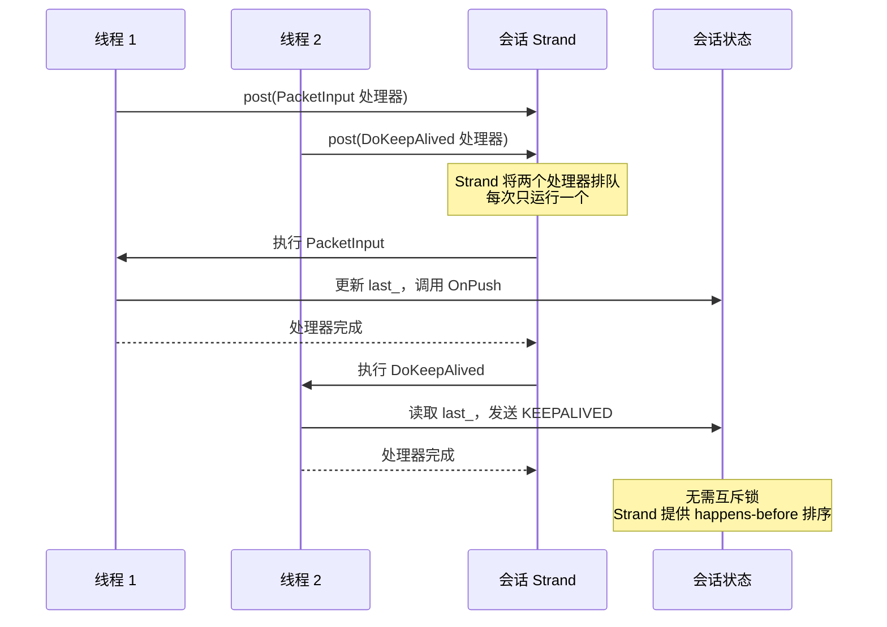

### 6.2 哪里需要原子标志

**生命周期标志**：`disposed_` 原子标志被外部代码（例如定时器回调）读取，以决定是否向会话的 strand 发布工作。使用 `memory_order_acq_rel` 的 `compare_exchange_strong` 确保一旦标志被设置，所有后续读者都能看到已设置的值，且清理操作对所有线程可见。

**连接 ID 生成器**：`VirtualEthernetLinklayer::NewId()` 使用带 `fetch_add(memory_order_relaxed)` 的 `std::atomic<unsigned int>` 在所有会话中生成唯一的 24 位连接 ID，无需互斥锁。

### 6.3 同步原语汇总

| 场景 | 原语 | 原因 |
|------|------|------|
| 每会话状态字段 | 无（依靠 strand） | Strand 序列化所有会话处理器 |
| Dispose 标志 | `std::atomic<bool>` + `compare_exchange_strong(acq_rel)` | 外部代码在 strand 外读取标志 |
| 连接 ID 生成 | `std::atomic<unsigned int>` + `fetch_add(relaxed)` | 跨会话唯一性；不需要排序保证 |
| Switcher 中的会话映射表 | 互斥锁或 strand 保护的访问 | 多个会话可以并发添加/移除 |
| 防火墙表 | 读写锁或 copy-on-write | 防火墙规则读频繁，写罕见 |

### 6.4 死锁预防规则

在此 EDSM 架构中，死锁主要来自以下场景：

1. **在 strand 处理器内同步等待另一个 strand 的结果**：禁止。应改为通过 `asio::post` 将工作发布到目标 strand，并在完成处理器中恢复。
2. **在 strand 处理器内持有互斥锁并尝试获取另一个互斥锁**：若无法避免，必须建立全局锁顺序（按内存地址排序），并严格遵循。
3. **在协程内调用阻塞 OS 系统调用**：禁止。所有 I/O 必须通过 Boost.Asio 异步操作完成，协程挂起等待结果。

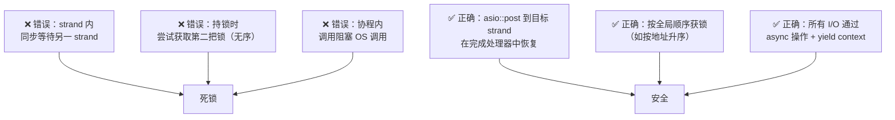

---

## 7. 特殊状态：nullof YieldContext

`nullof<YieldContext>()` 是框架设计的特殊模式，**不是未定义行为**。

它的用途：底层函数通过判断 yield context 是否为 `NULLPTR` 的地址来决定执行模式：

- **传入有效 YieldContext**：函数在协程内挂起等待异步结果（协程同步模式）。
- **传入 `nullof<YieldContext>()`**：函数在调用线程内阻塞等待（线程同步模式）。

典型使用场景：`DoKeepAlived()` 在某些定时器回调路径上不在协程内运行，因此传入 `nullof<YieldContext>()` 以使用线程阻塞模式。

**严禁随意修改此设计**。错误地将 `nullof<YieldContext>()` 改为普通空指针检查会破坏线程同步路径。

---

## 8. 状态机 API 参考

### 8.1 VirtualEthernetLinklayer 关键方法

```cpp
/**
 * @brief 启动会话的接收循环协程。
 *
 * 在协程内循环调用 transmission->Read()，将每个完整帧
 * 传给 PacketInput() 分发到对应的 On* 处理器。
 * 当 Read() 失败或 PacketInput() 返回 false 时，循环退出，
 * 触发 Dispose 流程。
 *
 * @param transmission  已握手的 ITransmission 实例。
 * @param y             协程 yield 上下文。
 * @note                每个会话对象只应调用一次 Run()。
 */
virtual void Run(
    const std::shared_ptr<ITransmission>& transmission,
    YieldContext&                          y) noexcept;

/**
 * @brief 处理心跳逻辑，并判断会话是否应被释放。
 *
 * @param transmission  当前传输对象（用于发送 KEEPALIVED 帧）。
 * @param now           当前时间戳（毫秒，来自 GetTickCount64 或等价函数）。
 * @return              会话仍然存活返回 true；应释放返回 false。
 * @note                必须从会话 strand 上调用，或在 strand 化的定时器处理器中调用。
 */
virtual bool DoKeepAlived(
    const std::shared_ptr<ITransmission>& transmission,
    Int64                                  now) noexcept;

/**
 * @brief 生成一个唯一的 24 位连接 ID。
 *
 * 使用 fetch_add(relaxed) 的原子计数器；对所有会话唯一，不需要
 * happens-before 排序。
 *
 * @return  24 位无符号整数连接 ID。
 */
static UInt32 NewId() noexcept;
```

### 8.2 错误码参考

| ErrorCode | 描述 |
|-----------|------|
| `SessionDisposed` | 会话已释放，操作被拒绝 |
| `KeepaliveTimeout` | 心跳超时，会话被主动关闭 |
| `PacketInputError` | `PacketInput` 收到无效操作码或格式错误的帧 |
| `ConnectionTableFull` | 会话连接表已满，无法建立新 TCP 连接 |
| `RemoteConnectionFailed` | 服务端出站 TCP 连接失败（`SYNOK` 错误码非零） |
| `FrpEntryConflict` | FRP 规则注册冲突（端口已被占用） |
| `MuxHandshakeFailed` | MUX 通道建立失败 |

---

## 相关文档

- [`ARCHITECTURE_CN.md`](ARCHITECTURE_CN.md) — 整体系统架构
- [`CONCURRENCY_MODEL_CN.md`](CONCURRENCY_MODEL_CN.md) — 并发模型详解
- [`LINKLAYER_PROTOCOL_CN.md`](LINKLAYER_PROTOCOL_CN.md) — 链路层操作码 wire 格式
- [`HANDSHAKE_SEQUENCE_CN.md`](HANDSHAKE_SEQUENCE_CN.md) — 握手时序详解
- [`SOURCE_READING_GUIDE_CN.md`](SOURCE_READING_GUIDE_CN.md) — 代码阅读指南
- [`PACKET_LIFECYCLE_CN.md`](PACKET_LIFECYCLE_CN.md) — 数据包完整生命周期
- [`TRANSMISSION_CN.md`](TRANSMISSION_CN.md) — 传输层帧化与保护
