# Engineering Concepts

[中文版本](ENGINEERING_CONCEPTS_CN.md)

## Purpose

This document explains the engineering stance of OPENPPP2 from code facts, not from product slogans. It exists to define the vocabulary used across the rest of the documentation and to explain why the system is shaped as a layered network runtime rather than a consumer VPN product.

The codebase makes its intent visible in `main.cpp`, `ppp/configurations/AppConfiguration.*`, `ppp/transmissions/ITransmission.*`, `ppp/app/protocol/VirtualEthernetLinklayer.*`, `ppp/app/client/*`, `ppp/app/server/*`, and the platform integration directories. Those files show a system that owns transport, protocol, runtime policy, host integration, and optional management in one coordinated whole.

---

## Positioning

OPENPPP2 is closer to network infrastructure than to an end-user VPN application.

That means the project is built around control, explicit state, and platform consequence rather than hiding those things behind a thin UI or a one-click flow. The runtime assumes operators are willing to specify addresses, routes, DNS behavior, listener layout, tunnel transport, and platform integration details.

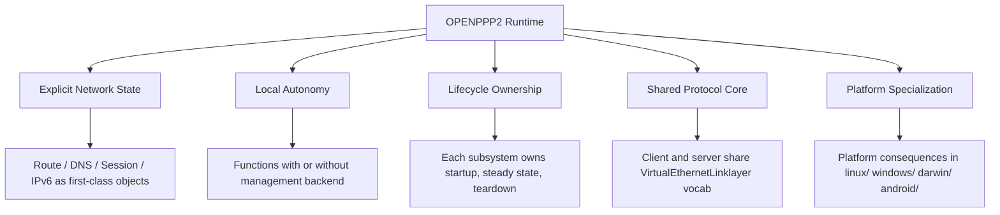

---

## What The Code Optimizes For

| Principle | Meaning in code |
|-----------|-----------------|
| Explicit network state | Route, DNS, session, IPv6, mapping, and listener state are held in objects and configuration |
| Local autonomy | Client and server continue to function with local policy when management is absent |
| Deterministic lifecycle ownership | Each major subsystem owns a clear phase of startup, steady state, and teardown |
| Shared protocol core | Client and server share the same tunnel action vocabulary |
| Platform specialization | Platform-specific consequences stay in platform directories |

---

## Explicit Network State

The runtime keeps state visible instead of hiding it.

Examples:

| Object | Role |
|--------|------|
| `AppConfiguration` | Top-level runtime configuration and normalization container |
| `VirtualEthernetInformation` | Runtime information about the virtual Ethernet environment |
| `VirtualEthernetInformationExtensions` | Platform- and deployment-specific extension state |
| `VEthernetNetworkSwitcher` | Client-side host integration, route and DNS steering, proxy and MUX coordination |
| `VirtualEthernetSwitcher` | Server-side session switching, forwarding, IPv6, and static path management |

The benefit is operational clarity. The cost is that operators must understand the model. OPENPPP2 chooses clarity over artificial simplification because the target use cases require direct control.

### State Lifecycle

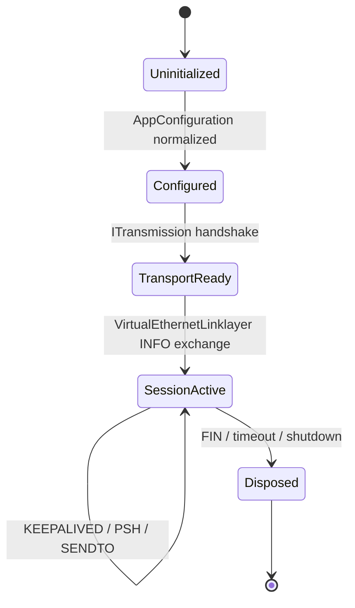

---

## Local Autonomy

The runtime is designed to keep functioning locally.

The code shows this in several places:

| Behavior | Code fact |
|----------|-----------|
| Session state stays local | Session acceptance and switching are handled inside the C++ runtime |
| Traffic statistics stay local | The runtime keeps counters and exposes them directly |
| Routing and DNS are applied locally | Decisions are made in the client runtime rather than via a remote control round-trip |
| Server-side policy can start locally | The server can operate with local configuration even when backend support is absent |

This is not an optional design flourish. Infrastructure software must survive control-plane outages. The runtime therefore treats management as useful but not mandatory.

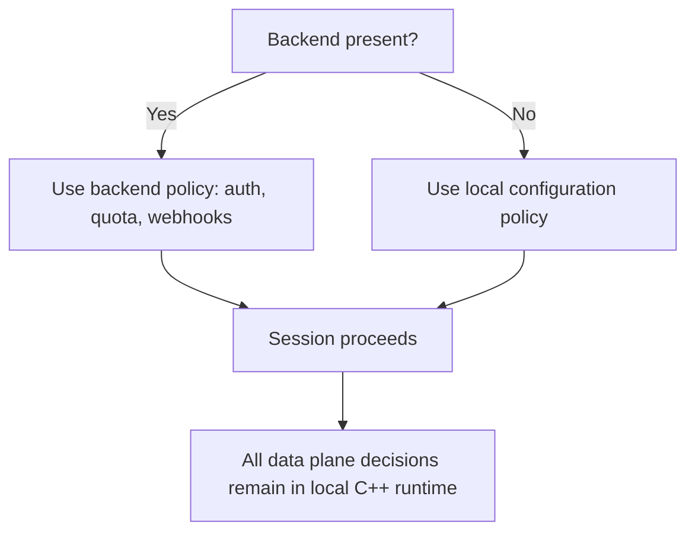

---

## Lifecycle Ownership

Major objects own major phases.

| Object | Responsibility |
|--------|----------------|
| `PppApplication` | Process startup, argument parsing, configuration load, role selection, tick loop, shutdown |
| `ITransmission` | Carrier connection, handshake, protected read/write, timeout and disposal |
| `VEthernetExchanger` / `VirtualEthernetExchanger` | Per-session tunnel work and session-state transition |
| `VEthernetNetworkSwitcher` / `VirtualEthernetSwitcher` | Host integration, adapter lifecycle, listener lifecycle, platform side effects |

This structure matters because it makes failure classes readable. When a resource leaks or a state transition misbehaves, there is usually one owner to inspect.

### Ownership Diagram

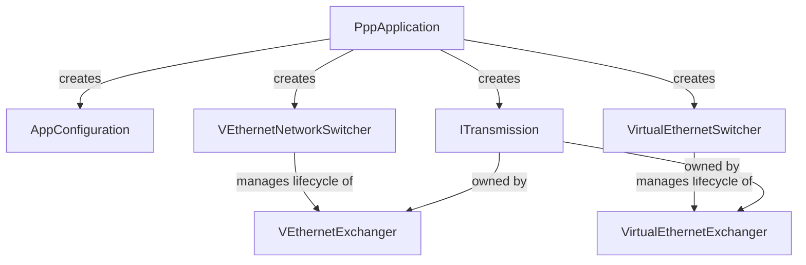

---

## Shared Protocol Core

The client and server share the same tunnel vocabulary in `VirtualEthernetLinklayer`.

That is not the same thing as saying they are symmetric peers. They are not. They share a protocol core, but the runtime role and side effects differ.

The shared vocabulary reduces conceptual fragmentation:

| Shared item | Why it exists |
|-------------|---------------|
| `INFO` | Shared runtime information exchange |
| `KEEPALIVED` | Common heartbeat semantics |
| `LAN`, `NAT` | Shared virtual network actions |
| `SYN`, `SYNOK`, `PSH`, `FIN` | TCP relay semantics |
| `SENDTO`, `ECHO`, `ECHOACK` | UDP and echo semantics |
| `STATIC`, `STATICACK` | Static path negotiation |
| `MUX`, `MUXON` | Multiplexing negotiation |
| `FRP_*` | Reverse mapping and relay |

### Protocol Action Dispatch

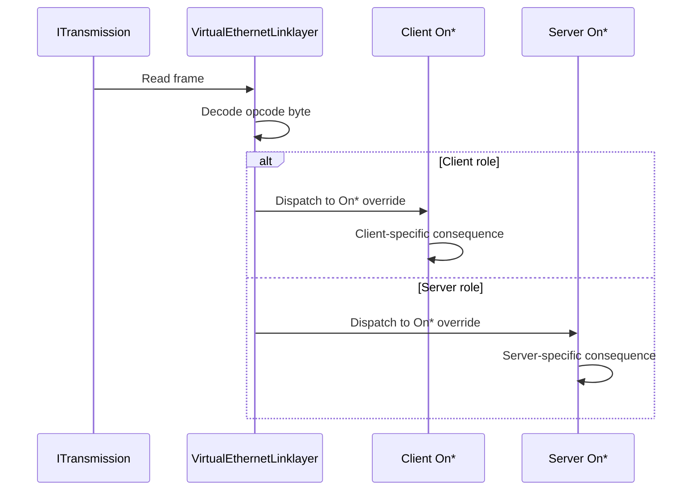

### Do* vs On* Method Convention

Every protocol action follows a consistent method pair convention defined in `VirtualEthernetLinklayer.h`:

| Method type | Direction | Purpose |
|-------------|-----------|---------|
| `Do*()` | Outbound | Serialize and transmit a frame |
| `On*()` | Inbound | Dispatch target after `PacketInput` decodes the opcode byte |

Derived classes override `On*` methods to implement role-specific behavior. The base class owns wire encoding and decoding.

---

## Platform Specialization

The code does not pretend that Windows, Linux, macOS, and Android behave identically.

| Layer | Shared or specialized |
|-------|------------------------|
| Protocol logic | Shared |
| Configuration normalization | Shared |
| Carrier framing and handshake | Shared |
| Adapter and route behavior | Specialized |
| DNS redirection and firewall impact | Specialized |
| IPv6 host setup | Specialized |

This is a practical infrastructure choice. If platform differences are ignored, the result is usually either hidden bugs or reduced capability.

### Platform Directory Structure

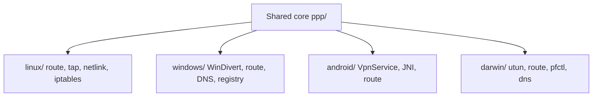

Each platform directory contains implementations of the same interfaces (`ITap`, `INetworkInterface`, socket protection) adapted to the host OS primitives. The interface contracts are defined in the shared core; only the implementation is platform-specific.

---

## Why The System Is Complex

The complexity is real because the problems are real.

OPENPPP2 solves several problems at once:

| Problem | Why it matters |
|---------|----------------|
| Protected tunnel transport | Data must move through untrusted networks |
| Virtual Ethernet forwarding | The runtime must carry network semantics, not just bytes |
| Route and DNS steering | Different traffic needs different paths |
| Reverse service exposure | Services may need to be reachable through the tunnel |
| Static UDP paths | Some traffic needs a lower-latency side path |
| MUX subchannels | Many logical streams may share one transport |
| IPv6 assignment and enforcement | IPv6 must be handled as a first-class case |
| Platform-specific integration | The host OS must be configured correctly |

A simpler description would be misleading.

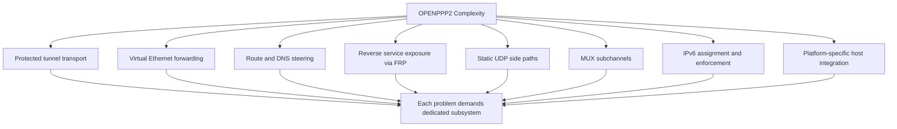

---

## Why Ease Of Use Is Not The Primary Goal

The code targets operators who can manage:

- addresses and masks
- gateways and route tables
- DNS policy
- mappings and reverse exposure
- transport types and certificates
- platform-specific runtime behavior

That is consistent with infrastructure software. Routers and firewalls are useful because they are explicit and controllable, not because they hide the underlying network model.

---

## Tunnel Design View

The tunnel is split into layers:

| Layer | Role |
|-------|------|
| Carrier transport | TCP, WebSocket, WSS, and related carrier behavior |
| Protected transmission | Handshake, framing, header protection, payload protection |
| Tunnel action protocol | The opcode vocabulary for tunnel behavior |
| Platform I/O and route behavior | Host integration and routing consequence |

This separation makes it possible to evolve the system in one layer without rewriting all the others.

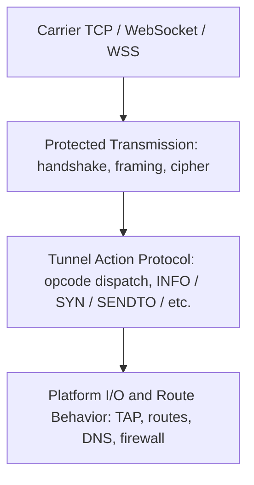

---

## Control Plane View

OPENPPP2 keeps control close to the data plane.

| Control item | Where it lives |
|--------------|----------------|
| Management backend | Optional external component |
| Server session table | Local runtime |
| IPv6 lease state | Local runtime |
| Route decisions | Local runtime |
| DNS decisions | Local runtime |

This is why the backend is optional. The node must still be able to run as a complete network system even when no backend is present.

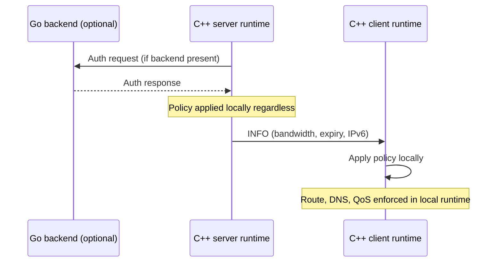

---

## Security View

The code supports a practical defensive posture based on state discipline.

| Defensive feature | Code-grounded meaning |
|-------------------|------------------------|
| Explicit handshake | No data path begins before the handshake state is established |
| Timeout-driven cleanup | Half-open work is disposed instead of lingering indefinitely |
| Explicit session identity | Sessions can be tracked, audited, and closed |
| Local policy validation | Policy is enforced in the local process |
| Explicit route and firewall checks | Packet forwarding is not implicit |
| Configuration-gated features | Capability is controlled by config, not hidden behavior |

OPENPPP2 also uses connection-specific dynamic working-key derivation. That reduces static key reuse. It should not be described as standard PFS unless the codebase proves the stronger property separately.

### Security Enforcement Points

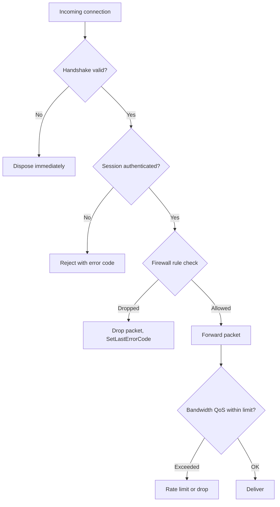

---

## Error Handling Philosophy

All failure paths follow a strict convention:

1. Detect the failure condition.
2. Call `SetLastErrorCode(Error::XYZ)` with the appropriate error code.
3. Return the sentinel value (usually `false`, `-1`, or `NULLPTR`).

There is no logging inside failure paths. The error code propagates to the caller. The outermost layer decides how to surface or report it.

```cpp
// Example: correct failure path
bool VirtualEthernetLinklayer::DoConnect(/*...*/) noexcept {
    if (NULLPTR == transmission_) {
        SetLastErrorCode(Error::SessionDisposed);
        return false;
    }
    // ...
    return true;
}
```

This convention applies uniformly from `ppp/net/` socket primitives all the way up through `VirtualEthernetLinklayer`.

---

## Memory Management Philosophy

The project avoids raw `new`/`delete` in runtime paths and instead uses:

| Mechanism | Purpose |
|-----------|---------|
| `ppp::Malloc` / `ppp::Mfree` | Raw heap allocation routed through jemalloc when available |
| `std::shared_ptr` / `std::weak_ptr` | Cross-thread lifetime management for session objects |
| `ppp::allocator<T>` | STL-compatible allocator routed through jemalloc |
| RAII wrappers | Sockets, file handles, TAP device handles |

The rationale is that this system runs indefinitely as infrastructure. Any allocation that escapes its scope is a defect. The allocator routing ensures that memory fragmentation is managed correctly under long-running load.

---

## Concurrency Philosophy

Three rules govern concurrency:

1. **Never block the IO thread.** Blocking work is posted via `asio::post` or `asio::dispatch`.
2. **Lifetime via shared_ptr.** Objects that cross thread boundaries are always held by `std::shared_ptr`. Weak references are used for back-pointers to avoid cycles.
3. **Atomic flags for lifecycle state.** `std::atomic<bool>` with `compare_exchange_strong(memory_order_acq_rel)` guards startup and shutdown transitions.

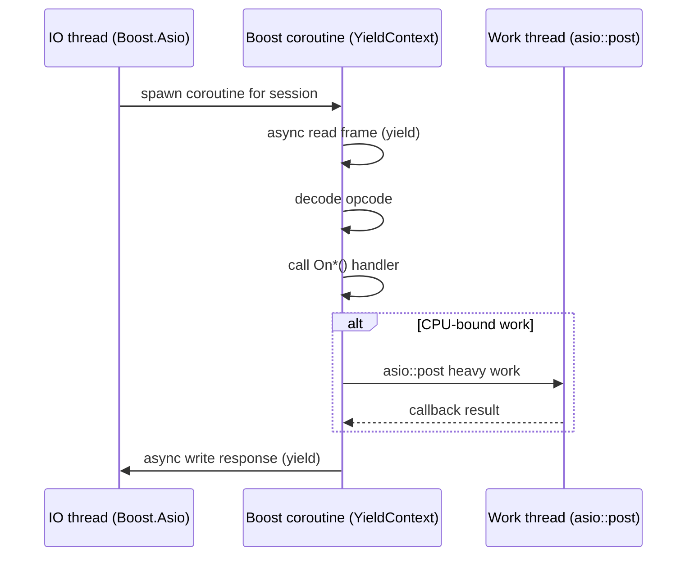

---

## Reading Model

Read the project as cooperating subsystems, not as one algorithm.

1. Process startup and lifecycle
2. Configuration shaping
3. Protected transmission and framing
4. Tunnel action protocol
5. Client runtime behavior
6. Server runtime behavior
7. Platform-specific integration
8. Optional management backend

That is the mental model that the rest of the documentation uses.

### Reading Path Diagram

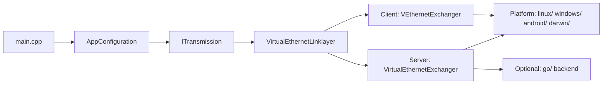

---

## Error Code Reference

Engineering-concept-level error codes from `ppp/diagnostics/ErrorCodes.def` (selection):

| ErrorCode | Description |
|-----------|-------------|
| `AppPreflightCheckFailed` | Startup preflight check failed |
| `RuntimeEnvironmentInvalid` | Runtime environment invalid |
| `SessionDisposed` | Runtime object already disposed |
| `SessionHandshakeFailed` | Session-level handshake did not complete |
| `SessionAuthFailed` | Session authentication failed |
| `SessionQuotaExceeded` | Session quota exceeded |
| `IPv6ServerPrepareFailed` | Server IPv6 environment preparation failed |
| `KeepaliveTimeout` | Peer keepalive heartbeat timed out |

---

## Related Documents

- [`ARCHITECTURE.md`](ARCHITECTURE.md)
- [`TUNNEL_DESIGN.md`](TUNNEL_DESIGN.md)
- [`LINKLAYER_PROTOCOL.md`](LINKLAYER_PROTOCOL.md)
- [`EDSM_STATE_MACHINES.md`](EDSM_STATE_MACHINES.md)
- [`SECURITY.md`](SECURITY.md)
- [`CONCURRENCY_MODEL.md`](CONCURRENCY_MODEL.md)
- [`ERROR_CODES.md`](ERROR_CODES.md)
