# 工程理念

[English Version](ENGINEERING_CONCEPTS.md)

## 目的

本文从代码事实出发解释 OPENPPP2 的工程立场，而不是从产品宣传语出发。它的作用是统一后续文档中的术语，并说明为什么这个系统被组织成一个分层的网络运行时，而不是一个消费级 VPN 产品。

代码中的真实意图可以在 `main.cpp`、`ppp/configurations/AppConfiguration.*`、`ppp/transmissions/ITransmission.*`、`ppp/app/protocol/VirtualEthernetLinklayer.*`、`ppp/app/client/*`、`ppp/app/server/*` 以及平台集成目录中看到。那些文件共同说明：系统同时拥有传输、协议、运行时策略、宿主集成和可选管理能力。

---

## 定位

OPENPPP2 更接近网络基础设施，而不是终端用户 VPN 应用。

这意味着系统强调控制、显式状态和平台后果，而不是用一个很薄的界面把这些东西全部藏起来。这个运行时默认运维者愿意理解地址、路由、DNS、监听器布局、隧道承载类型和平台集成细节。

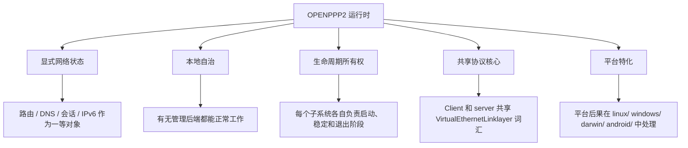

---

## 代码优先优化什么

| 原则 | 代码中的含义 |
|------|--------------|
| 显式网络状态 | 路由、DNS、会话、IPv6、映射和监听状态都保存在对象和配置里 |
| 本地自治 | 在没有管理后端时，客户端和服务端仍然依赖本地策略工作 |
| 确定性的生命周期所有权 | 主要子系统都拥有清晰的启动、稳定运行和退出阶段 |
| 共享协议核心 | 客户端和服务端共享同一套隧道动作词汇 |
| 平台特化 | 平台相关后果留在平台目录中处理 |

---

## 显式网络状态

运行时会把状态保持为可见对象，而不是隐藏起来。

典型对象如下：

| 对象 | 作用 |
|------|------|
| `AppConfiguration` | 顶层配置和归一化容器 |
| `VirtualEthernetInformation` | 虚拟以太网环境的运行时信息 |
| `VirtualEthernetInformationExtensions` | 平台或部署相关的扩展状态 |
| `VEthernetNetworkSwitcher` | 客户端宿主集成、路由和 DNS steering、代理和 MUX 协调 |
| `VirtualEthernetSwitcher` | 服务端会话交换、转发、IPv6 和 static path 管理 |

它的好处是运维清晰。代价是使用者必须理解这个模型。OPENPPP2 选择清晰，而不是人为简化，因为它的目标场景需要直接控制。

### 状态生命周期

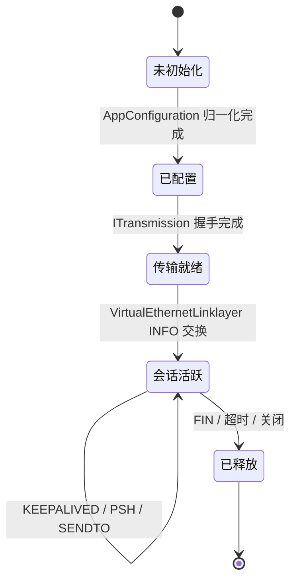

---

## 本地自治

运行时被设计成能在本地继续工作。

代码中可以直接看到以下特征：

| 行为 | 代码事实 |
|------|----------|
| 会话状态保留在本地 | 会话接入和交换都由 C++ 运行时处理 |
| 流量统计保留在本地 | 运行时直接维护计数器并对外暴露 |
| 路由和 DNS 在本地执行 | 决策在客户端运行时内完成，而不是依赖远端控制往返 |
| 服务端可以本地启动策略 | 即使没有后端，服务端也能依赖本地配置工作 |

这不是可有可无的修饰，而是基础设施软件的基本要求。控制面不可用时，数据面也必须能继续工作。

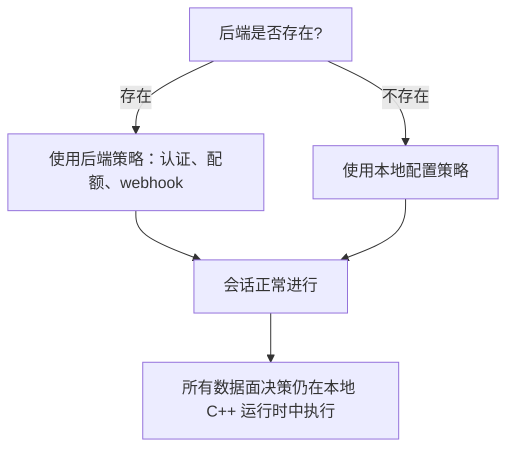

---

## 生命周期所有权

主要对象各自负责自己的阶段。

| 对象 | 责任 |
|------|------|
| `PppApplication` | 进程启动、参数解析、配置加载、角色选择、tick loop 和关闭 |
| `ITransmission` | 承载连接、握手、受保护读写、超时和销毁 |
| `VEthernetExchanger` / `VirtualEthernetExchanger` | 单会话隧道工作和会话状态转换 |
| `VEthernetNetworkSwitcher` / `VirtualEthernetSwitcher` | 宿主集成、适配器生命周期、监听器生命周期和平台副作用 |

这种结构很重要，因为它让故障类型更容易读懂。出现资源泄漏或状态转换问题时，通常都能找到明确的所有者。

### 所有权关系图

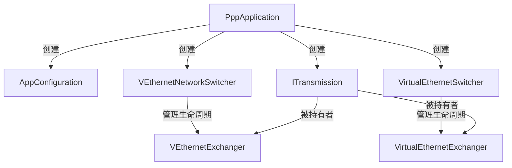

---

## 共享协议核心

客户端和服务端在 `VirtualEthernetLinklayer` 中共享同一套隧道词汇。

这并不等于它们是对称 peer。它们不是。它们共享协议核心，但运行时角色和副作用不同。

共享词汇减少了概念割裂：

| 共享项 | 存在原因 |
|--------|----------|
| `INFO` | 共享运行时信息交换 |
| `KEEPALIVED` | 共享保活语义 |
| `LAN`、`NAT` | 共享虚拟网络动作 |
| `SYN`、`SYNOK`、`PSH`、`FIN` | TCP 中继语义 |
| `SENDTO`、`ECHO`、`ECHOACK` | UDP 和回显语义 |
| `STATIC`、`STATICACK` | static path 协商 |
| `MUX`、`MUXON` | 多路复用协商 |
| `FRP_*` | 反向映射和中继 |

### 协议动作分发

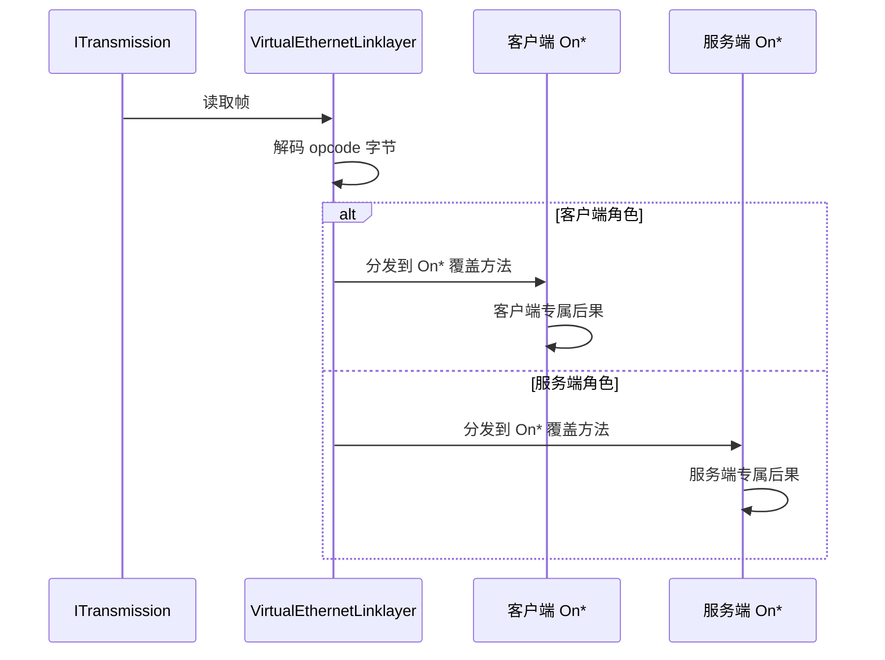

### Do* 与 On* 方法约定

每个协议动作在 `VirtualEthernetLinklayer.h` 中都遵循一致的方法对约定：

| 方法类型 | 方向 | 用途 |
|----------|------|------|
| `Do*()` | 出站 | 序列化并发送帧 |
| `On*()` | 入站 | `PacketInput` 解码 opcode 字节后的分发目标 |

派生类通过重写 `On*` 来实现角色特化行为。基类只负责 wire 编解码和分发。

---

## 平台特化

代码没有假装 Windows、Linux、macOS 和 Android 的行为相同。

| 层 | 共享还是特化 |
|----|--------------|
| 协议逻辑 | 共享 |
| 配置归一化 | 共享 |
| 承载帧化与握手 | 共享 |
| 适配器和路由行为 | 特化 |
| DNS 重定向和防火墙影响 | 特化 |
| IPv6 宿主设置 | 特化 |

这是务实的基础设施选择。如果忽略平台差异，通常会得到隐藏 bug 或能力缩水。

### 平台目录结构

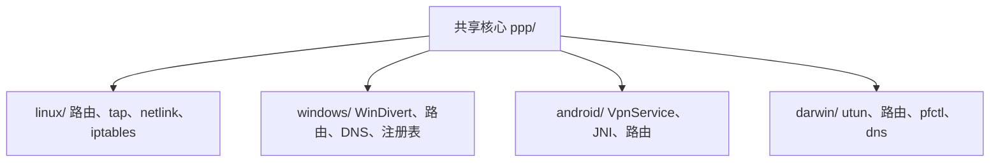

每个平台目录实现同一套接口（`ITap`、`INetworkInterface`、socket 保护），针对宿主 OS 原语进行适配。接口契约在共享核心中定义，只有实现是平台相关的。

---

## 为什么系统会复杂

复杂性是真实存在的，因为问题本身就复杂。

OPENPPP2 同时要解决多类问题：

| 问题 | 为什么重要 |
|------|--------------|
| 受保护隧道传输 | 数据必须穿过不可信网络 |
| 虚拟以太网转发 | 运行时承载的是网络语义，而不只是字节 |
| 路由和 DNS steering | 不同流量需要不同路径 |
| 反向服务暴露 | 有些服务需要通过隧道被远端访问 |
| 静态 UDP 路径 | 某些流量需要更低延迟的旁路 |
| MUX 子通道 | 多个逻辑流要共享一条传输连接 |
| IPv6 分配与执行 | IPv6 必须被当成一等场景处理 |
| 平台特化集成 | 宿主操作系统必须正确配置 |

把它写成一个"小型 VPN 客户端"会误导读者。

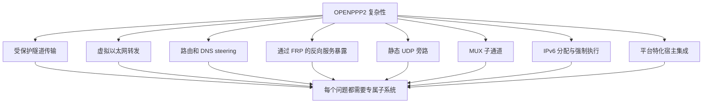

---

## 为什么易用性不是第一目标

代码面向的是能够管理以下内容的运维者：

- 地址与掩码
- 网关与路由表
- DNS 策略
- 映射与反向暴露
- 传输类型与证书
- 平台特化运行行为

这与基础设施软件的气质一致。路由器和防火墙的价值不在于"简单"，而在于"显式"和"可控"。

---

## 隧道设计视角

隧道被拆成多层：

| 层 | 作用 |
|----|------|
| 承载传输层 | TCP、WebSocket、WSS 以及相关承载行为 |
| 受保护传输层 | 握手、帧化、头部保护、负载保护 |
| 隧道动作协议层 | 隧道行为的 opcode 词汇 |
| 平台 I/O 与路由行为层 | 宿主集成和路由后果 |

这种分离让系统可以在一层演进，而不必重写所有层。

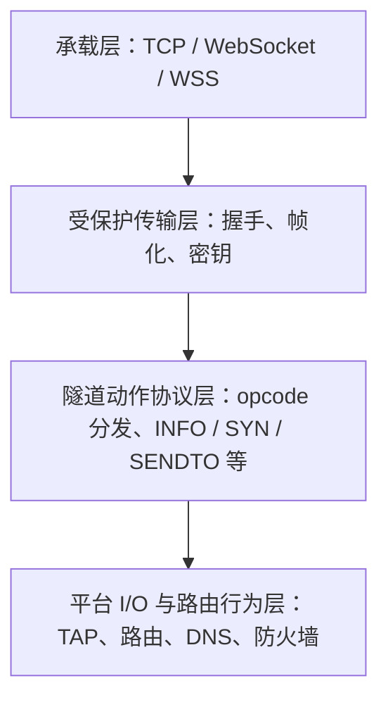

---

## 控制面视角

OPENPPP2 尽量把控制放在靠近数据面的地方。

| 控制项 | 所在位置 |
|--------|----------|
| 管理后端 | 可选外部组件 |
| 服务端会话表 | 本地运行时 |
| IPv6 租约状态 | 本地运行时 |
| 路由决策 | 本地运行时 |
| DNS 决策 | 本地运行时 |

这就是为什么后端是可选项。节点本身必须在没有后端时仍然像一个完整网络系统一样工作。

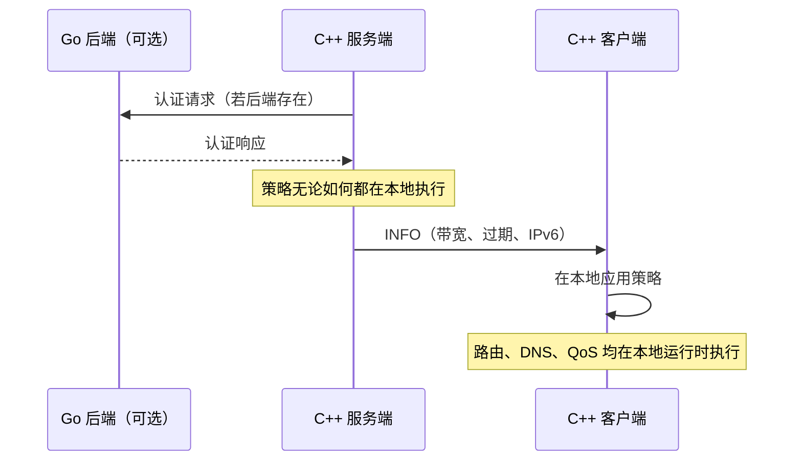

---

## 安全视角

代码支持的是一种基于状态纪律的实际防御姿态。

| 防御特征 | 代码层含义 |
|----------|------------|
| 显式握手 | 在握手状态建立前不进入数据路径 |
| 超时清理 | 半开工作会被销毁，而不是无限挂起 |
| 显式会话标识 | 会话可以被追踪、审计和关闭 |
| 本地策略校验 | 策略在本地进程内执行 |
| 显式路由和防火墙检查 | 包转发不是隐式发生的 |
| 配置门控功能 | 能力由配置控制，而不是隐藏行为 |

OPENPPP2 还使用连接级动态工作密钥派生，减少静态密钥复用。但除非代码另外证明更强的性质，否则不要把它直接说成标准 PFS。

### 安全执行点

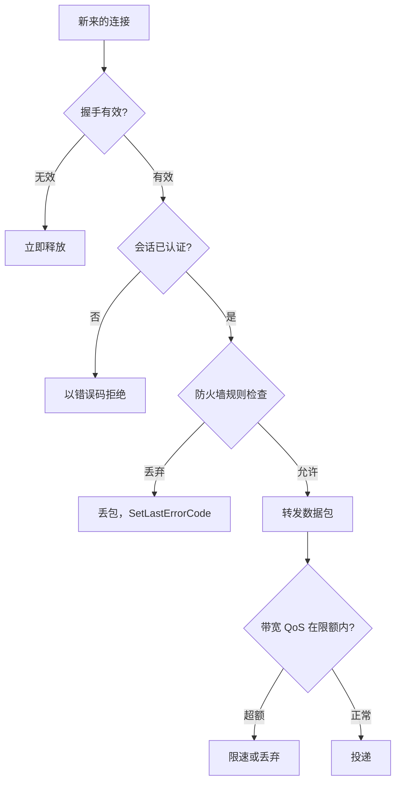

---

## 错误处理哲学

所有失败路径遵循严格的约定：

1. 检测到失败条件。
2. 使用合适的错误码调用 `SetLastErrorCode(Error::XYZ)`。
3. 返回哨兵值（通常是 `false`、`-1` 或 `NULLPTR`）。

失败路径内不打印任何日志。错误码向调用方传播，由最上层决定如何呈现或上报。

```cpp
// 示例：正确的失败路径
bool VirtualEthernetLinklayer::DoConnect(/*...*/) noexcept {
    if (NULLPTR == transmission_) {
        SetLastErrorCode(Error::SessionDisposed);
        return false;
    }
    // ...
    return true;
}
```

这个约定从 `ppp/net/` 的 socket 原语一直统一应用到 `VirtualEthernetLinklayer`。

---

## 内存管理哲学

项目在运行时路径中避免使用裸 `new`/`delete`，而是使用：

| 机制 | 用途 |
|------|------|
| `ppp::Malloc` / `ppp::Mfree` | 有 jemalloc 时路由到 jemalloc 的裸堆分配 |
| `std::shared_ptr` / `std::weak_ptr` | 会话对象的跨线程生命周期管理 |
| `ppp::allocator<T>` | 路由到 jemalloc 的 STL 兼容分配器 |
| RAII 封装 | socket、文件句柄、TAP 设备句柄 |

原因是本系统作为基础设施无限期运行。任何逃出作用域的分配都是缺陷。分配器路由确保在长期负载下内存碎片被正确管理。

---

## 并发哲学

三条规则支配并发行为：

1. **永不阻塞 IO 线程。** 阻塞工作通过 `asio::post` 或 `asio::dispatch` 提交。
2. **通过 shared_ptr 管理生命周期。** 跨线程的对象始终以 `std::shared_ptr` 持有。反向引用使用弱引用避免循环。
3. **原子标志控制生命周期状态。** `std::atomic<bool>` + `compare_exchange_strong(memory_order_acq_rel)` 守护启动和关闭的状态转换。

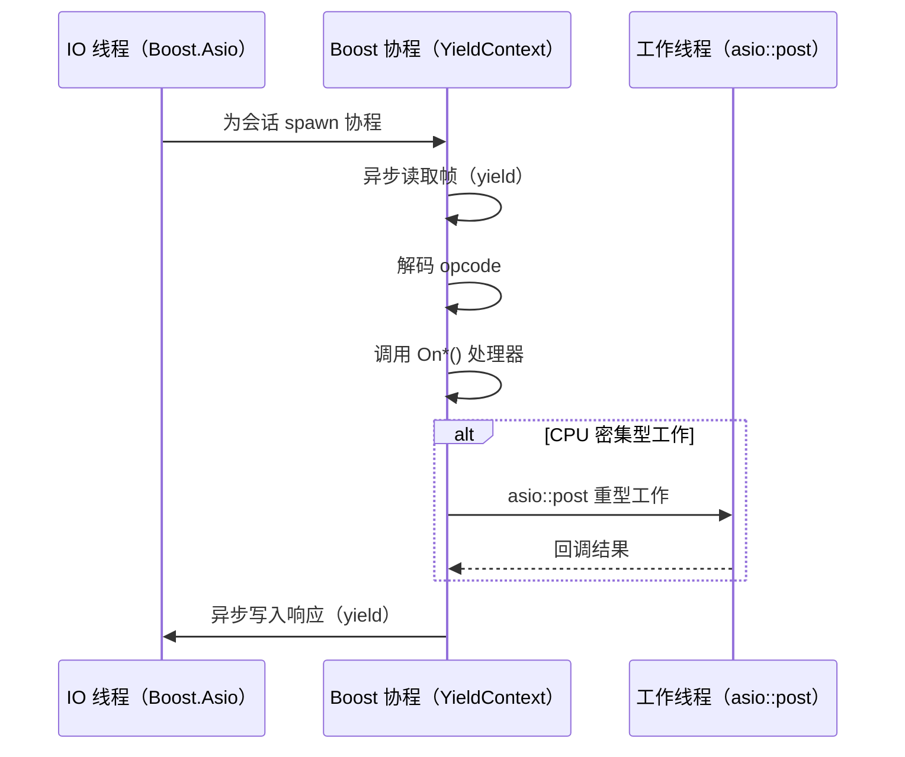

---

## 阅读模型

阅读这个项目时，把它当成协作子系统，而不是一个算法。

1. 进程启动与生命周期
2. 配置整形
3. 受保护传输与帧化
4. 隧道动作协议
5. 客户端运行时行为
6. 服务端运行时行为
7. 平台特化集成
8. 可选管理后端

后续文档都会沿着这个心智模型展开。

### 阅读路径图

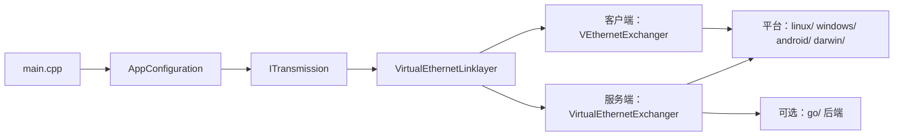

---

## 错误码参考

工程理念层面的错误码（来自 `ppp/diagnostics/ErrorCodes.def`，节选）：

| ErrorCode | 说明 |
|-----------|------|
| `AppPreflightCheckFailed` | 启动预检失败 |
| `RuntimeEnvironmentInvalid` | 运行时环境无效 |
| `SessionDisposed` | 运行时对象已销毁 |
| `SessionHandshakeFailed` | 会话级握手未完成 |
| `SessionAuthFailed` | 会话认证失败 |
| `SessionQuotaExceeded` | 会话额度超限 |
| `IPv6ServerPrepareFailed` | 服务端 IPv6 环境准备失败 |
| `KeepaliveTimeout` | 对端心跳超时 |

---

## 相关文档

- [`ARCHITECTURE_CN.md`](ARCHITECTURE_CN.md)
- [`TUNNEL_DESIGN_CN.md`](TUNNEL_DESIGN_CN.md)
- [`LINKLAYER_PROTOCOL_CN.md`](LINKLAYER_PROTOCOL_CN.md)
- [`EDSM_STATE_MACHINES_CN.md`](EDSM_STATE_MACHINES_CN.md)
- [`SECURITY_CN.md`](SECURITY_CN.md)
- [`CONCURRENCY_MODEL_CN.md`](CONCURRENCY_MODEL_CN.md)
- [`ERROR_CODES_CN.md`](ERROR_CODES_CN.md)
