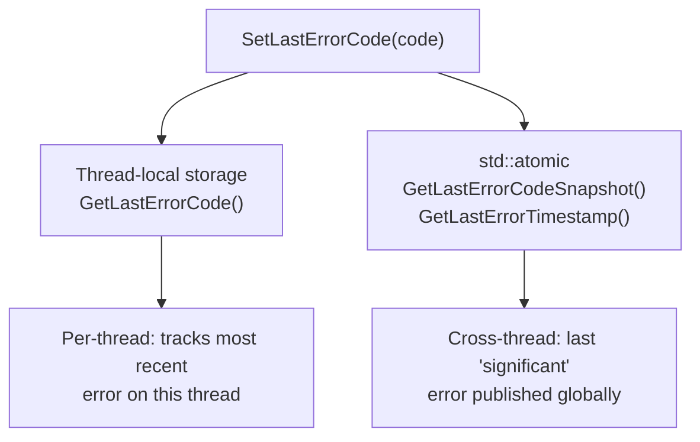
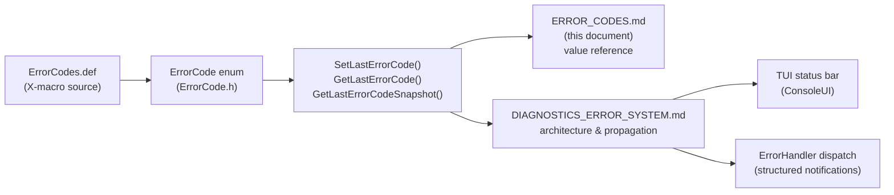

# Error Codes Reference

[中文版本](ERROR_CODES_CN.md)

All error codes are defined in `ppp/diagnostics/ErrorCodes.def` via the X-macro pattern
and exposed as `ppp::diagnostics::ErrorCode` (enum class, `uint32_t` underlying type).

**Total: 466 error codes across 22 categories.**

## API

```cpp
// Set thread-local error code and return false / -1 / NULLPTR
ppp::diagnostics::SetLastErrorCode(ppp::diagnostics::ErrorCode::SomeCode);
bool ppp::diagnostics::SetLastError(ErrorCode);        // returns false
int  ppp::diagnostics::SetLastError<int>(ErrorCode);   // returns -1
T*   ppp::diagnostics::SetLastError<T*>(ErrorCode);    // returns NULLPTR

// Query
ErrorCode   ppp::diagnostics::GetLastErrorCode();           // thread-local
ErrorCode   ppp::diagnostics::GetLastErrorCodeSnapshot();   // last atomically published
uint64_t    ppp::diagnostics::GetLastErrorTimestamp();      // ms of last published error
const char* ppp::diagnostics::FormatErrorString(ErrorCode); // human-readable text
```

---

## Category Map

```mermaid
graph TD
    A[ErrorCode] --> B[Generic - 25]
    A --> C[App - 15]
    A --> D[Config - 21]
    A --> E[Runtime - 15]
    A --> F[Memory - 10]
    A --> G[File - 19]
    A --> H[Network - 25]
    A --> I[Socket - 18]
    A --> J[TCP - 11]
    A --> K[UDP - 10]
    A --> L[DNS - 10]
    A --> M[HTTP - 10]
    A --> N[WebSocket - 10]
    A --> O[TLS - 10]
    A --> P[Tunnel - 19]
    A --> Q[Firewall - 10]
    A --> R[Route - 10]
    A --> S[IPv6 - 36]
    A --> T[IPv4 - 12]
    A --> U[Session - 15]
    A --> V[Protocol - 10]
    A --> W[Mapping - 10]
    A --> X2[PPP/LCP/IPCP - 18]
    A --> Y[Linux - 14]
    A --> Z[Windows - 16]
    A --> AA[ThreadSync - 14]
    A --> BB[Crypto - 14]
    A --> CC[Auth - 14]
    A --> DD[Timer - 14]
    A --> EE[Resource - 14]
    A --> FF[InternalLogic - 14]
```



---

## Category: Generic (25)

| Name | Description |
|------|-------------|
| `Success` | Success |
| `GenericUnknown` | Generic unknown error |
| `GenericInvalidArgument` | Invalid argument |
| `GenericInvalidState` | Invalid state |
| `GenericNotSupported` | Operation not supported |
| `GenericTimeout` | Operation timed out |
| `GenericCanceled` | Operation canceled |
| `GenericNotFound` | Requested item not found |
| `GenericAlreadyExists` | Requested item already exists |
| `GenericBusy` | Resource is busy |
| `GenericInsufficientBuffer` | Insufficient buffer size |
| `GenericOutOfMemory` | Out of memory |
| `GenericOperationFailed` | Operation failed |
| `GenericParseFailed` | Parse failed |
| `GenericChecksumMismatch` | Checksum mismatch |
| `GenericPermissionDenied` | Permission denied |
| `GenericAccessDenied` | Access denied |
| `GenericResourceExhausted` | Resource exhausted |
| `GenericConflict` | Resource conflict |
| `GenericOverflow` | Numeric overflow |
| `GenericUnderflow` | Numeric underflow |
| `GenericDataTruncated` | Data truncated |
| `GenericDataCorrupted` | Data corrupted |
| `GenericRateLimited` | Rate limited |
| `GenericUnavailable` | Service unavailable |

---

## Category: Application (15)

| Name | Description |
|------|-------------|
| `AppStartupFailed` | Application startup failed |
| `AppShutdownFailed` | Application shutdown failed |
| `AppRestartFailed` | Application restart failed |
| `AppAlreadyRunning` | Application already running |
| `AppLockAcquireFailed` | Application lock acquisition failed |
| `AppLockReleaseFailed` | Application lock release failed |
| `AppInvalidCommandLine` | Invalid command-line arguments |
| `AppConfigurationMissing` | Application configuration missing |
| `AppConfigurationInvalid` | Application configuration invalid |
| `AppContextUnavailable` | Application context unavailable |
| `AppThreadPoolInitFailed` | Thread pool initialization failed |
| `AppSignalHandlerInstallFailed` | Signal handler installation failed |
| `AppPrivilegeRequired` | Administrator or root privilege required |
| `AppFeatureDisabled` | Requested feature is disabled |
| `AppPreflightCheckFailed` | Startup preflight check failed |

---

## Category: Configuration (21)

| Name | Description |
|------|-------------|
| `ConfigLoadFailed` | Failed to load configuration |
| `ConfigFileNotFound` | Configuration file not found |
| `ConfigFileUnreadable` | Configuration file unreadable |
| `ConfigFileMalformed` | Configuration file malformed |
| `ConfigSchemaMismatch` | Configuration schema mismatch |
| `ConfigFieldMissing` | Required configuration field missing |
| `ConfigFieldInvalid` | Configuration field invalid |
| `ConfigValueOutOfRange` | Configuration value out of range |
| `ConfigTypeMismatch` | Configuration type mismatch |
| `ConfigDuplicateKey` | Duplicate configuration key |
| `ConfigUnknownKey` | Unknown configuration key |
| `ConfigPathInvalid` | Configuration path invalid |
| `ConfigPathNotAbsolute` | Configuration path not absolute |
| `ConfigDnsRuleLoadFailed` | Failed to load DNS rules |
| `ConfigFirewallRuleLoadFailed` | Failed to load firewall rules |
| `ConfigRouteLoadFailed` | Failed to load route list |
| `ConfigCipherInvalid` | Invalid cipher configuration |
| `ConfigCertificateInvalid` | Invalid certificate configuration |
| `ConfigKeyInvalid` | Invalid key configuration |
| `ConfigConcurrencyInvalid` | Invalid concurrency configuration |

---

## Category: Runtime (15)

| Name | Description |
|------|-------------|
| `RuntimeInitializationFailed` | Runtime initialization failed |
| `RuntimeEnvironmentInvalid` | Runtime environment invalid |
| `RuntimeIoContextMissing` | I/O context unavailable |
| `RuntimeSchedulerUnavailable` | Scheduler unavailable |
| `RuntimeTimerCreateFailed` | Timer creation failed |
| `RuntimeTimerStartFailed` | Timer start failed |
| `RuntimeEventDispatchFailed` | Event dispatch failed |
| `RuntimeTaskPostFailed` | Task post failed |
| `RuntimeCoroutineSpawnFailed` | Coroutine spawn failed |
| `RuntimeThreadStartFailed` | Thread start failed |
| `RuntimeThreadJoinFailed` | Thread join failed |
| `RuntimeThreadNameFailed` | Thread naming failed |
| `RuntimePauseUnsupported` | Pause operation unsupported |
| `RuntimeStateTransitionInvalid` | Invalid runtime state transition |
| `RuntimeInvariantViolation` | Runtime invariant violation |

---

## Category: Memory (10)

| Name | Description |
|------|-------------|
| `MemoryAllocationFailed` | Memory allocation failed |
| `MemoryReallocationFailed` | Memory reallocation failed |
| `MemoryAlignmentInvalid` | Invalid memory alignment |
| `MemoryPoolCreateFailed` | Memory pool creation failed |
| `MemoryPoolExhausted` | Memory pool exhausted |
| `MemoryBufferNull` | Memory buffer is null |
| `MemoryBufferTooSmall` | Memory buffer too small |
| `MemoryCopyFailed` | Memory copy failed |
| `MemoryMapFailed` | Memory mapping failed |
| `MemoryUnmapFailed` | Memory unmapping failed |

---

## Category: File (19)

| Name | Description |
|------|-------------|
| `FileOpenFailed` | File open failed |
| `FileCreateFailed` | File creation failed |
| `FileReadFailed` | File read failed |
| `FileWriteFailed` | File write failed |
| `FileFlushFailed` | File flush failed |
| `FileCloseFailed` | File close failed |
| `FileDeleteFailed` | File delete failed |
| `FileRenameFailed` | File rename failed |
| `FileStatFailed` | File stat failed |
| `FileSeekFailed` | File seek failed |
| `FileTruncateFailed` | File truncate failed |
| `FileLockFailed` | File lock failed |
| `FileUnlockFailed` | File unlock failed |
| `FilePermissionInvalid` | File permission invalid |
| `FilePathInvalid` | File path invalid |
| `FilePathTooLong` | File path too long |
| `FileDirectoryMissing` | Directory missing |
| `FileDirectoryCreateFailed` | Directory creation failed |
| `FileDirectoryEnumerateFailed` | Directory enumeration failed |
| `FileRotationFailed` | Log rotation failed |

---

## Category: Network (25)

| Name | Description |
|------|-------------|
| `NetworkInitializeFailed` | Network initialization failed |
| `NetworkInterfaceUnavailable` | Network interface unavailable |
| `NetworkInterfaceOpenFailed` | Network interface open failed |
| `NetworkInterfaceConfigureFailed` | Network interface configuration failed |
| `NetworkInterfaceRouteFailed` | Network interface route configuration failed |
| `NetworkInterfaceDnsFailed` | Network interface DNS configuration failed |
| `NetworkAddressInvalid` | Network address invalid |
| `NetworkMaskInvalid` | Network mask invalid |
| `NetworkGatewayInvalid` | Network gateway invalid |
| `NetworkGatewayUnreachable` | Network gateway unreachable |
| `NetworkPortInvalid` | Network port invalid |
| `NetworkProtocolUnsupported` | Network protocol unsupported |
| `NetworkMtuInvalid` | Network MTU invalid |
| `NetworkMssInvalid` | Network MSS invalid |
| `NetworkFirewallBlocked` | Network blocked by firewall |
| `NetworkRouteNotFound` | Network route not found |
| `NetworkRouteAddFailed` | Failed to add network route |
| `NetworkRouteDeleteFailed` | Failed to delete network route |
| `NetworkAddressConflict` | Network address conflict |
| `NetworkAddressFamilyMismatch` | Network address family mismatch |
| `NetworkPacketMalformed` | Malformed network packet |
| `NetworkPacketTooLarge` | Network packet too large |
| `NetworkPacketDrop` | Network packet dropped |
| `NetworkPacketChecksumFailed` | Network packet checksum failed |
| `NetworkPacketDirectionInvalid` | Network packet direction invalid |

---

## Category: Socket (18)

| Name | Description |
|------|-------------|
| `SocketCreateFailed` | Socket creation failed |
| `SocketOpenFailed` | Socket open failed |
| `SocketBindFailed` | Socket bind failed |
| `SocketListenFailed` | Socket listen failed |
| `SocketAcceptFailed` | Socket accept failed |
| `SocketConnectFailed` | Socket connect failed |
| `SocketReadFailed` | Socket read failed |
| `SocketWriteFailed` | Socket write failed |
| `SocketShutdownFailed` | Socket shutdown failed |
| `SocketCloseFailed` | Socket close failed |
| `SocketOptionSetFailed` | Socket option set failed |
| `SocketOptionGetFailed` | Socket option get failed |
| `SocketAddressInvalid` | Socket address invalid |
| `SocketWouldBlock` | Socket would block |
| `SocketDisconnected` | Socket disconnected |
| `SocketTimeout` | Socket timeout |
| `SocketRefused` | Socket connection refused |
| `SocketReset` | Socket connection reset |
| `SocketSslHandshakeFailed` | Socket SSL handshake failed |
| `SocketSslVerificationFailed` | Socket SSL verification failed |

---

## Category: TCP (11)

| Name | Description |
|------|-------------|
| `TcpConnectFailed` | TCP connect failed |
| `TcpConnectTimeout` | TCP connect timeout |
| `TcpAcceptFailed` | TCP accept failed |
| `TcpSendFailed` | TCP send failed |
| `TcpReceiveFailed` | TCP receive failed |
| `TcpKeepAliveFailed` | TCP keep-alive failed |
| `TcpMssClampFailed` | TCP MSS clamping failed |
| `TcpWindowSizeSetFailed` | TCP window size configuration failed |
| `TcpFastOpenFailed` | TCP Fast Open configuration failed |
| `TcpCongestionControlFailed` | TCP congestion control configuration failed |
| `TCPLinkDeadlockDetected` | TCP link deadlock detected |

---

## Category: UDP (10)

| Name | Description |
|------|-------------|
| `UdpOpenFailed` | UDP socket open failed |
| `UdpBindFailed` | UDP socket bind failed |
| `UdpSendFailed` | UDP send failed |
| `UdpReceiveFailed` | UDP receive failed |
| `UdpRelayFailed` | UDP relay failed |
| `UdpNamespaceLookupFailed` | UDP namespace lookup failed |
| `UdpDnsRedirectFailed` | UDP DNS redirect failed |
| `UdpMappingFailed` | UDP mapping failed |
| `UdpPortUnavailable` | UDP port unavailable |
| `UdpPacketInvalid` | UDP packet invalid |

---

## Category: DNS (10)

| Name | Description |
|------|-------------|
| `DnsResolveFailed` | DNS resolve failed |
| `DnsCacheFailed` | DNS cache operation failed |
| `DnsRuleRejected` | DNS query rejected by rule |
| `DnsPacketInvalid` | DNS packet invalid |
| `DnsServerUnavailable` | DNS server unavailable |
| `DnsTimeout` | DNS query timeout |
| `DnsResponseInvalid` | DNS response invalid |
| `DnsAddressInvalid` | DNS address invalid |
| `DnsMergeFailed` | DNS merge operation failed |
| `DnsApplyFailed` | DNS configuration apply failed |

---

## Category: HTTP (10)

| Name | Description |
|------|-------------|
| `HttpRequestFailed` | HTTP request failed |
| `HttpStatusInvalid` | HTTP status invalid |
| `HttpResponseInvalid` | HTTP response invalid |
| `HttpProxyConfigureFailed` | HTTP proxy configuration failed |
| `HttpProxyApplyFailed` | HTTP proxy apply failed |
| `HttpHeaderInvalid` | HTTP header invalid |
| `HttpBodyInvalid` | HTTP body invalid |
| `HttpUpgradeFailed` | HTTP protocol upgrade failed |
| `HttpAuthenticationFailed` | HTTP authentication failed |
| `HttpConnectTunnelFailed` | HTTP CONNECT tunnel failed |

---

## Category: WebSocket (10)

| Name | Description |
|------|-------------|
| `WebSocketHandshakeFailed` | WebSocket handshake failed |
| `WebSocketFrameInvalid` | WebSocket frame invalid |
| `WebSocketReadFailed` | WebSocket read failed |
| `WebSocketWriteFailed` | WebSocket write failed |
| `WebSocketCloseFailed` | WebSocket close failed |
| `WebSocketProtocolInvalid` | WebSocket protocol invalid |
| `WebSocketMaskInvalid` | WebSocket mask invalid |
| `WebSocketCompressionFailed` | WebSocket compression failed |
| `WebSocketPingFailed` | WebSocket ping failed |
| `WebSocketPongTimeout` | WebSocket pong timeout |

---

## Category: TLS (10)

| Name | Description |
|------|-------------|
| `TlsContextCreateFailed` | TLS context creation failed |
| `TlsCertificateLoadFailed` | TLS certificate load failed |
| `TlsPrivateKeyLoadFailed` | TLS private key load failed |
| `TlsCaLoadFailed` | TLS CA bundle load failed |
| `TlsCipherConfigureFailed` | TLS cipher configuration failed |
| `TlsHandshakeFailed` | TLS handshake failed |
| `TlsVerifyFailed` | TLS verification failed |
| `TlsRenegotiationFailed` | TLS renegotiation failed |
| `TlsShutdownFailed` | TLS shutdown failed |
| `TlsSessionReuseFailed` | TLS session reuse failed |

---

## Category: Tunnel (19)

| Name | Description |
|------|-------------|
| `TunnelCreateFailed` | Tunnel creation failed |
| `TunnelOpenFailed` | Tunnel open failed |
| `TunnelListenFailed` | Tunnel listen failed |
| `TunnelReadFailed` | Tunnel read failed |
| `TunnelWriteFailed` | Tunnel write failed |
| `TunnelDeviceMissing` | Tunnel device missing |
| `TunnelDevicePermissionDenied` | Tunnel device permission denied |
| `TunnelDeviceConfigureFailed` | Tunnel device configuration failed |
| `TunnelDeviceUnsupported` | Tunnel device unsupported |
| `TunnelAddressConfigureFailed` | Tunnel address configuration failed |
| `TunnelRouteConfigureFailed` | Tunnel route configuration failed |
| `TunnelDnsConfigureFailed` | Tunnel DNS configuration failed |
| `TunnelMtuConfigureFailed` | Tunnel MTU configuration failed |
| `TunnelPromiscConfigureFailed` | Tunnel promiscuous-mode configuration failed |
| `TunnelProtectionConfigureFailed` | Tunnel protection mode configuration failed |
| `TunnelLoopbackSetupFailed` | Tunnel loopback setup failed |
| `TunnelPacketInjectFailed` | Tunnel packet injection failed |
| `TunnelPacketCaptureFailed` | Tunnel packet capture failed |
| `TunnelDisposeFailed` | Tunnel dispose failed |
| `TunnelSessionMismatch` | Tunnel session mismatch |

---

## Category: Firewall (10)

| Name | Description |
|------|-------------|
| `FirewallCreateFailed` | Firewall creation failed |
| `FirewallLoadFailed` | Firewall rule load failed |
| `FirewallApplyFailed` | Firewall apply failed |
| `FirewallRollbackFailed` | Firewall rollback failed |
| `FirewallRuleInvalid` | Firewall rule invalid |
| `FirewallRuleConflict` | Firewall rule conflict |
| `FirewallPortBlocked` | Firewall blocked target port |
| `FirewallSegmentBlocked` | Firewall blocked target segment |
| `FirewallDomainBlocked` | Firewall blocked target domain |
| `FirewallBackendUnavailable` | Firewall backend unavailable |

---

## Category: Route (10)

| Name | Description |
|------|-------------|
| `RouteQueryFailed` | Route query failed |
| `RouteTableUnavailable` | Route table unavailable |
| `RouteAddFailed` | Route add failed |
| `RouteDeleteFailed` | Route delete failed |
| `RouteReplaceFailed` | Route replace failed |
| `RouteFlushFailed` | Route flush failed |
| `RoutePrefixInvalid` | Route prefix invalid |
| `RouteGatewayInvalid` | Route gateway invalid |
| `RouteMetricInvalid` | Route metric invalid |
| `RouteInterfaceInvalid` | Route interface invalid |

---

## Category: IPv6 (36)

| Name | Description |
|------|-------------|
| `IPv6Unsupported` | IPv6 is unsupported on this platform |
| `IPv6ServerPrepareFailed` | IPv6 server environment preparation failed |
| `IPv6ServerFinalizeFailed` | IPv6 server environment finalization failed |
| `IPv6ClientStateCaptureFailed` | IPv6 client state capture failed |
| `IPv6ClientAddressApplyFailed` | IPv6 client address apply failed |
| `IPv6ClientRouteApplyFailed` | IPv6 client route apply failed |
| `IPv6ClientDnsApplyFailed` | IPv6 client DNS apply failed |
| `IPv6ClientRestoreFailed` | IPv6 client configuration restore failed |
| `IPv6DuplicateGUID` | IPv6 duplicate GUID detected |
| `IPv6PrefixInvalid` | IPv6 prefix invalid |
| `IPv6CidrInvalid` | IPv6 CIDR invalid |
| `IPv6AddressInvalid` | IPv6 address invalid |
| `IPv6AddressUnsafe` | IPv6 address rejected by safety policy |
| `IPv6GatewayInvalid` | IPv6 gateway invalid |
| `IPv6GatewayMissing` | IPv6 gateway missing |
| `IPv6GatewayNotReachable` | IPv6 gateway not reachable |
| `IPv6GatewayUnreachable` | IPv6 gateway unreachable |
| `IPv6ModeInvalid` | IPv6 mode invalid |
| `PlatformNotSupportGUAMode` | Platform does not support IPv6 GUA mode |
| `IPv6Nat66Unavailable` | IPv6 NAT66 backend unavailable |
| `IPv6ForwardingEnableFailed` | IPv6 forwarding enable failed |
| `IPv6ForwardRuleApplyFailed` | IPv6 forward rule apply failed |
| `IPv6SubnetForwardFailed` | IPv6 subnet forward failed |
| `IPv6TransitTapOpenFailed` | IPv6 transit TAP open failed |
| `IPv6TransitRouteAddFailed` | IPv6 transit route add failed |
| `IPv6TransitRouteDeleteFailed` | IPv6 transit route delete failed |
| `IPv6NeighborProxyEnableFailed` | IPv6 neighbor proxy enable failed |
| `IPv6NeighborProxyAddFailed` | IPv6 neighbor proxy add failed |
| `IPv6NeighborProxyDeleteFailed` | IPv6 neighbor proxy delete failed |
| `IPv6NDPProxyFailed` | IPv6 NDP proxy failed |
| `IPv6ExternalAccessFailed` | IPv6 external access failed |
| `IPv6LeaseConflict` | IPv6 lease conflict |
| `IPv6LeaseUnavailable` | IPv6 lease unavailable |
| `IPv6LeaseExpired` | IPv6 lease expired |
| `IPv6DataPlaneInstallFailed` | IPv6 dataplane install failed |
| `IPv6PacketRejected` | IPv6 packet rejected |

---

## Category: IPv4 (12)

| Name | Description |
|------|-------------|
| `IPv4AddressInvalid` | IPv4 address invalid |
| `IPv4MaskInvalid` | IPv4 netmask invalid |
| `IPv4GatewayInvalid` | IPv4 gateway invalid |
| `IPv4GatewayNotReachable` | IPv4 gateway not reachable |
| `IPv4RouteAddFailed` | IPv4 route add failed |
| `IPv4RouteDeleteFailed` | IPv4 route delete failed |
| `IPv4FragmentationRequired` | IPv4 fragmentation required |
| `IPv4HeaderInvalid` | IPv4 header invalid |
| `IPv4ChecksumFailed` | IPv4 checksum failed |
| `IPv4OptionUnsupported` | IPv4 option unsupported |
| `IPv4ArpResolveFailed` | IPv4 ARP resolve failed |
| `IPv4MtuDiscoveryFailed` | IPv4 MTU discovery failed |

---

## Category: Session (15)

| Name | Description |
|------|-------------|
| `SessionCreateFailed` | Session creation failed |
| `SessionOpenFailed` | Session open failed |
| `SessionAuthFailed` | Session authentication failed |
| `SessionHandshakeFailed` | Session handshake failed |
| `SessionInformationInvalid` | Session information invalid |
| `SessionUpdateFailed` | Session update failed |
| `SessionCloseFailed` | Session close failed |
| `SessionDisposed` | Session already disposed |
| `SessionNotFound` | Session not found |
| `SessionQuotaExceeded` | Session quota exceeded |
| `SessionBandwidthExceeded` | Session bandwidth quota exceeded |
| `SessionTrafficExceeded` | Session traffic quota exceeded |
| `SessionExpired` | Session expired |
| `SessionIdInvalid` | Session ID invalid |
| `SessionTransportMissing` | Session transport missing |

---

## Category: Protocol (10)

| Name | Description |
|------|-------------|
| `ProtocolFrameInvalid` | Protocol frame invalid |
| `ProtocolPacketActionInvalid` | Protocol packet action invalid |
| `ProtocolVersionMismatch` | Protocol version mismatch |
| `ProtocolCipherMismatch` | Protocol cipher mismatch |
| `ProtocolDecodeFailed` | Protocol decode failed |
| `ProtocolEncodeFailed` | Protocol encode failed |
| `ProtocolCompressionFailed` | Protocol compression failed |
| `ProtocolDecompressionFailed` | Protocol decompression failed |
| `ProtocolKeepAliveTimeout` | Protocol keep-alive timeout |
| `ProtocolMuxFailed` | Protocol multiplexer failure |

---

## Category: Mapping (10)

| Name | Description |
|------|-------------|
| `MappingCreateFailed` | Mapping creation failed |
| `MappingBindFailed` | Mapping bind failed |
| `MappingOpenFailed` | Mapping open failed |
| `MappingConnectFailed` | Mapping connect failed |
| `MappingSendFailed` | Mapping send failed |
| `MappingReceiveFailed` | Mapping receive failed |
| `MappingEntryConflict` | Mapping entry conflict |
| `MappingPortUnavailable` | Mapping port unavailable |
| `MappingDisposeFailed` | Mapping dispose failed |
| `MappingBackendUnavailable` | Mapping backend unavailable |

---

## Category: PPP / LCP / IPCP / IPv6CP (18)

| Name | Description |
|------|-------------|
| `PppFrameInvalid` | PPP frame invalid |
| `PppProtocolFieldInvalid` | PPP protocol field invalid |
| `PppFcsInvalid` | PPP FCS invalid |
| `PppPayloadTooShort` | PPP payload too short |
| `LcpPacketInvalid` | LCP packet invalid |
| `LcpCodeUnsupported` | LCP code unsupported |
| `LcpOptionInvalid` | LCP option invalid |
| `LcpMagicNumberMismatch` | LCP magic number mismatch |
| `LcpEchoTimeout` | LCP echo timeout |
| `IpcpPacketInvalid` | IPCP packet invalid |
| `IpcpOptionInvalid` | IPCP option invalid |
| `IpcpAddressRejected` | IPCP address rejected |
| `IpcpDnsRejected` | IPCP DNS rejected |
| `IpcpNegotiationFailed` | IPCP negotiation failed |
| `Ipv6cpPacketInvalid` | IPv6CP packet invalid |
| `Ipv6cpOptionInvalid` | IPv6CP option invalid |
| `Ipv6cpInterfaceIdInvalid` | IPv6CP interface identifier invalid |
| `Ipv6cpNegotiationFailed` | IPv6CP negotiation failed |

---

## Category: Linux Platform (14)

| Name | Description |
|------|-------------|
| `LinuxNetlinkOpenFailed` | Linux netlink open failed |
| `LinuxNetlinkSendFailed` | Linux netlink send failed |
| `LinuxNetlinkReceiveFailed` | Linux netlink receive failed |
| `LinuxIptablesApplyFailed` | Linux iptables apply failed |
| `LinuxNftablesApplyFailed` | Linux nftables apply failed |
| `LinuxIpRuleAddFailed` | Linux ip rule add failed |
| `LinuxIpRuleDeleteFailed` | Linux ip rule delete failed |
| `LinuxSysctlReadFailed` | Linux sysctl read failed |
| `LinuxSysctlWriteFailed` | Linux sysctl write failed |
| `LinuxProcReadFailed` | Linux procfs read failed |
| `LinuxProcWriteFailed` | Linux procfs write failed |
| `LinuxCapabilityMissing` | Linux capability missing |
| `LinuxNamespaceEnterFailed` | Linux namespace enter failed |
| `LinuxNamespaceCreateFailed` | Linux namespace create failed |

---

## Category: Windows Platform (16)

| Name | Description |
|------|-------------|
| `WindowsWfpEngineOpenFailed` | Windows WFP engine open failed |
| `WindowsWfpFilterAddFailed` | Windows WFP filter add failed |
| `WindowsWfpFilterDeleteFailed` | Windows WFP filter delete failed |
| `WindowsWinDivertOpenFailed` | Windows WinDivert open failed |
| `WindowsWinDivertRecvFailed` | Windows WinDivert receive failed |
| `WindowsWinDivertSendFailed` | Windows WinDivert send failed |
| `WindowsRouteAddFailed` | Windows route add failed |
| `WindowsRouteDeleteFailed` | Windows route delete failed |
| `WindowsAdapterQueryFailed` | Windows adapter query failed |
| `WindowsAdapterConfigureFailed` | Windows adapter configure failed |
| `WindowsRegistryReadFailed` | Windows registry read failed |
| `WindowsRegistryWriteFailed` | Windows registry write failed |
| `WindowsServiceStartFailed` | Windows service start failed |
| `WindowsServiceStopFailed` | Windows service stop failed |
| `WindowsWintunCreateFailed` | Windows Wintun create failed |
| `WindowsWintunSessionStartFailed` | Windows Wintun session start failed |

---

## Category: Thread Synchronization (14)

| Name | Description |
|------|-------------|
| `ThreadSyncMutexInitFailed` | Thread sync mutex init failed |
| `ThreadSyncMutexLockFailed` | Thread sync mutex lock failed |
| `ThreadSyncMutexUnlockFailed` | Thread sync mutex unlock failed |
| `ThreadSyncRwLockInitFailed` | Thread sync rwlock init failed |
| `ThreadSyncRwLockReadLockFailed` | Thread sync rwlock read lock failed |
| `ThreadSyncRwLockWriteLockFailed` | Thread sync rwlock write lock failed |
| `ThreadSyncRwLockUnlockFailed` | Thread sync rwlock unlock failed |
| `ThreadSyncConditionInitFailed` | Thread sync condition init failed |
| `ThreadSyncConditionWaitFailed` | Thread sync condition wait failed |
| `ThreadSyncConditionSignalFailed` | Thread sync condition signal failed |
| `ThreadSyncSemaphoreInitFailed` | Thread sync semaphore init failed |
| `ThreadSyncSemaphoreWaitFailed` | Thread sync semaphore wait failed |
| `ThreadSyncSemaphorePostFailed` | Thread sync semaphore post failed |
| `ThreadSyncDeadlockDetected` | Thread sync deadlock detected |

---

## Category: Cryptography (14)

| Name | Description |
|------|-------------|
| `CryptoCertificateParseFailed` | Crypto certificate parse failed |
| `CryptoCertificateExpired` | Crypto certificate expired |
| `CryptoCertificateNotYetValid` | Crypto certificate not yet valid |
| `CryptoCertificateRevoked` | Crypto certificate revoked |
| `CryptoCertificateChainInvalid` | Crypto certificate chain invalid |
| `CryptoCertificateSubjectMismatch` | Crypto certificate subject mismatch |
| `CryptoCertificateIssuerUnknown` | Crypto certificate issuer unknown |
| `CryptoCertificateKeyUsageInvalid` | Crypto certificate key usage invalid |
| `CryptoPrivateKeyParseFailed` | Crypto private key parse failed |
| `CryptoPrivateKeyMismatch` | Crypto private key mismatch |
| `CryptoSignatureVerifyFailed` | Crypto signature verify failed |
| `CryptoRandomDeviceFailed` | Crypto random device failed |
| `CryptoAlgorithmUnsupported` | Crypto algorithm unsupported |
| `CryptoOcspCheckFailed` | Crypto OCSP check failed |

---

## Category: Authentication (14)

| Name | Description |
|------|-------------|
| `AuthUserNotFound` | Auth user not found |
| `AuthCredentialMissing` | Auth credential missing |
| `AuthCredentialInvalid` | Auth credential invalid |
| `AuthPasswordExpired` | Auth password expired |
| `AuthTokenMissing` | Auth token missing |
| `AuthTokenExpired` | Auth token expired |
| `AuthTokenInvalid` | Auth token invalid |
| `AuthTokenSignatureInvalid` | Auth token signature invalid |
| `AuthChallengeFailed` | Auth challenge failed |
| `AuthMfaRequired` | Auth MFA required |
| `AuthMfaInvalid` | Auth MFA invalid |
| `AuthPolicyDenied` | Auth policy denied |
| `AuthPermissionDenied` | Auth permission denied |
| `AuthRoleMissing` | Auth role missing |

---

## Category: Timer (14)

| Name | Description |
|------|-------------|
| `TimerWheelInitFailed` | Timer wheel init failed |
| `TimerScheduleFailed` | Timer schedule failed |
| `TimerCancelFailed` | Timer cancel failed |
| `TimerCallbackFailed` | Timer callback failed |
| `TimerResolutionInvalid` | Timer resolution invalid |
| `TimerQueueOverflow` | Timer queue overflow |
| `TimerSystemClockSkew` | Timer system clock skew detected |
| `TimerHandshakeTimeout` | Timer handshake timeout |
| `TimerKeepAliveTimeout` | Timer keep-alive timeout |
| `TimerReconnectTimeout` | Timer reconnect timeout |
| `TimerIdleTimeout` | Timer idle timeout |
| `TimerShutdownTimeout` | Timer shutdown timeout |
| `TimerDrainTimeout` | Timer drain timeout |
| `TimerDnsQueryTimeout` | Timer DNS query timeout |

---

## Category: Resource Exhaustion (14)

| Name | Description |
|------|-------------|
| `ResourceExhaustedThreads` | Resource exhausted: threads |
| `ResourceExhaustedFileDescriptors` | Resource exhausted: file descriptors |
| `ResourceExhaustedSockets` | Resource exhausted: sockets |
| `ResourceExhaustedPorts` | Resource exhausted: ports |
| `ResourceExhaustedEphemeralPorts` | Resource exhausted: ephemeral ports |
| `ResourceExhaustedBandwidth` | Resource exhausted: bandwidth |
| `ResourceExhaustedCpu` | Resource exhausted: CPU |
| `ResourceExhaustedDisk` | Resource exhausted: disk |
| `ResourceExhaustedInodes` | Resource exhausted: inodes |
| `ResourceExhaustedPacketBuffers` | Resource exhausted: packet buffers |
| `ResourceExhaustedNatTable` | Resource exhausted: NAT table |
| `ResourceExhaustedConntrack` | Resource exhausted: conntrack table |
| `ResourceExhaustedSessionSlots` | Resource exhausted: session slots |
| `ResourceExhaustedRouteTable` | Resource exhausted: route table |

---

## Category: Internal Logic (14)

| Name | Description |
|------|-------------|
| `InternalLogicAssertionFailed` | Internal logic assertion failed |
| `InternalLogicNullPointer` | Internal logic null pointer |
| `InternalLogicStateCorrupted` | Internal logic state corrupted |
| `InternalLogicUnexpectedBranch` | Internal logic unexpected branch |
| `InternalLogicInvariantBroken` | Internal logic invariant broken |
| `InternalLogicReentrancyDetected` | Internal logic reentrancy detected |
| `InternalLogicOwnershipViolation` | Internal logic ownership violation |
| `InternalLogicSequenceError` | Internal logic sequence error |
| `InternalLogicCacheInconsistent` | Internal logic cache inconsistent |
| `InternalLogicDuplicateDispatch` | Internal logic duplicate dispatch |
| `InternalLogicMessageOrderInvalid` | Internal logic message order invalid |
| `InternalLogicCounterOverflow` | Internal logic counter overflow |
| `InternalLogicUnexpectedEof` | Internal logic unexpected EOF |
| `InternalLogicUnreachableCode` | Internal logic unreachable code |

---

## How to Add a New Error Code

1. Open `ppp/diagnostics/ErrorCodes.def`.
2. Add a new line in the appropriate category block:
   ```c
   X(MyNewError, "Human readable description")
   ```
3. Use the code in your error path:
   ```cpp
   return ppp::diagnostics::SetLastError<bool>(
       ppp::diagnostics::ErrorCode::MyNewError);
   ```
4. Update this document and `ERROR_CODES_CN.md`.

## How to Use Error Codes Correctly

Every failure branch must:

1. **Detect** the error condition.
2. **Set** the error code: `ppp::diagnostics::SetLastErrorCode(...)`.
3. **Return** the appropriate sentinel (`false`, `-1`, or `NULLPTR`).

A sentinel-only return without setting an error code is insufficient. Unused error
codes (defined in the `.def` file but never referenced in any `.cpp`) should be removed.

---

## Error Code Architecture Deep Dive

### X-Macro Expansion

The entire error code enumeration is generated from a single source file `ppp/diagnostics/ErrorCodes.def` using the X-macro pattern:

```cpp
// ErrorCodes.def (excerpt)
X(Success,                     "Success")
X(GenericUnknown,              "Generic unknown error")
X(AppStartupFailed,            "Application startup failed")
// ... 463 more entries ...

// ErrorCode.h — expansion into enum class
enum class ErrorCode : uint32_t
{
#define X(name, desc) name,
#include "ppp/diagnostics/ErrorCodes.def"
#undef X
};

// Error.cpp — expansion into string table
static const char* s_error_strings[] = {
#define X(name, desc) desc,
#include "ppp/diagnostics/ErrorCodes.def"
#undef X
};
```

This means adding a new error code requires only one `.def` file edit — the enum member, the string table entry, and the `FormatErrorString()` lookup are all derived automatically.

### Thread-Local vs. Atomic Snapshot

Two error storage mechanisms coexist:



`SetLastErrorCode()` always updates the thread-local value. It also conditionally updates the global atomic snapshot — the condition is typically that the error code is non-zero (non-success). The atomic snapshot stores both the error code and a timestamp packed into a single 64-bit value: high 32 bits = millisecond timestamp truncated to 32 bits, low 32 bits = error code value.

`GetLastErrorTimestamp()` returns the millisecond timestamp of the most recently published non-success error. This is used by the TUI status bar to display the recency of the last problem.

### `SetLastError` Template Variants

The template overloads make the error-path pattern maximally concise:

```cpp
// Returns false after setting error code — used in bool-returning functions
bool result = ppp::diagnostics::SetLastError(ErrorCode::SocketConnectFailed);
// result == false

// Returns -1 after setting error code — used in int-returning functions
int fd = ppp::diagnostics::SetLastError<int>(ErrorCode::SocketCreateFailed);
// fd == -1

// Returns NULLPTR after setting error code — used in pointer-returning functions
SomeObject* ptr = ppp::diagnostics::SetLastError<SomeObject*>(ErrorCode::MemoryAllocationFailed);
// ptr == NULLPTR
```

All three variants call `SetLastErrorCode()` first, then return their sentinel value. This eliminates the two-line pattern:

```cpp
// Old pattern (verbose)
SetLastErrorCode(ErrorCode::SocketConnectFailed);
return false;

// New pattern (concise)
return SetLastError(ErrorCode::SocketConnectFailed);
```

---

## Error Code Usage Patterns by Subsystem

### Startup Pipeline Error Codes

The startup pipeline (`PppApplication::Main()` and `PreparedLoopbackEnvironment()`) uses a strictly linear error-code progression. Each step sets exactly one error code on failure:

```mermaid
flowchart TD
    A["IsUserAnAdministrator() fails"] --> E1["AppPrivilegeRequired"]
    B["prevent_rerun_.Exists() true"] --> E2["AppAlreadyRunning"]
    C["prevent_rerun_.Open() fails"] --> E3["AppLockAcquireFailed"]
    D["Windows TAP driver check fails"] --> E4["NetworkInterfaceConfigureFailed"]
    F["ITap::Create() returns null"] --> E5["TunnelOpenFailed"]
    G["ITap::Open() fails"] --> E6["TunnelListenFailed"]
    H["VEthernet::Open() fails, NIC null"] --> E7["NetworkInterfaceUnavailable"]
    I["VEthernet::Open() fails, NIC not null"] --> E5
    J["ipv6::PrepareServerEnvironment fails"] --> E8["IPv6ServerPrepareFailed"]
    K["VirtualEthernetSwitcher::Open fails"] --> E5
    L["VirtualEthernetSwitcher::Run fails"] --> E6
    M["NextTickAlwaysTimeout fails"] --> E9["RuntimeTimerStartFailed"]
```



### Session Lifecycle Error Codes

A session progresses through several lifecycle stages. Each potential failure maps to a specific error code:

| Stage | Failure Condition | Error Code |
|-------|------------------|-----------|
| Handshake NOP read | Read timeout | `TimerHandshakeTimeout` |
| Handshake NOP read | Decrypt failure | `ProtocolDecodeFailed` |
| Handshake session ID | Invalid value | `SessionIdInvalid` |
| Handshake cipher rebuild | Unsupported cipher | `ProtocolCipherMismatch` |
| INFO frame receive | Malformed frame | `SessionInformationInvalid` |
| INFO frame receive | Quota exceeded | `SessionQuotaExceeded` |
| INFO frame receive | Session expired | `SessionExpired` |
| Data loop read | Socket disconnected | `SocketDisconnected` |
| Data loop read | WebSocket frame invalid | `WebSocketFrameInvalid` |
| Keepalive check | No RX beyond deadline | `ProtocolKeepAliveTimeout` |
| Managed server auth | Auth rejected | `AuthCredentialInvalid` or `AuthTokenExpired` |
| IPv6 assignment | Lease conflict | `IPv6LeaseConflict` |
| IPv6 assignment | No addresses available | `IPv6LeaseUnavailable` |

### Protocol-Layer Error Codes

Protocol errors (opcode violations, decode failures) use the `Protocol*` category. These typically indicate either a version mismatch between client and server, network corruption, or an active attacker:

| Error Code | Typical Cause |
|-----------|--------------|
| `ProtocolFrameInvalid` | Frame header decode failed (bad seed byte or length) |
| `ProtocolPacketActionInvalid` | Unknown opcode byte received |
| `ProtocolVersionMismatch` | Client and server compiled with incompatible protocol versions |
| `ProtocolCipherMismatch` | Key material exchange resulted in different derived keys |
| `ProtocolDecodeFailed` | Decryption or checksum verification failed |
| `ProtocolKeepAliveTimeout` | Remote peer stopped sending keepalives |
| `ProtocolMuxFailed` | MUX channel negotiation failed |

---

## Error Code Diagnostic Workflow

### Step 1 — Capture the Snapshot

When a problem occurs, the first step is to capture the error code snapshot before it is overwritten:

```cpp
ErrorCode code = ppp::diagnostics::GetLastErrorCodeSnapshot();
uint64_t  ts   = ppp::diagnostics::GetLastErrorTimestamp();
const char* msg = ppp::diagnostics::FormatErrorString(code);

printf("[%llu ms] Last error: %s (0x%08X)\n", ts, msg, (uint32_t)code);
```

### Step 2 — Map to Category

The error code value is a contiguous integer (0-based enum). The category can be identified by inspecting `ERROR_CODES.md` or by examining the `ErrorCodes.def` file directly. The first 25 entries are Generic, the next 15 are App, and so on.

### Step 3 — Correlate with TUI

The TUI status bar displays the most recent snapshot in the bottom status line. If the TUI is not available (piped stdout), the startup summary text includes the last error before the process exits.

### Step 4 — Trace to Source

Each error code is set in exactly one (or very few) places in the source. Use `grep` or an IDE search to find all `SetLastErrorCode(ErrorCode::XYZ)` call sites and examine the surrounding logic.

```bash
# Find all call sites for a specific error code
grep -rn "TunnelOpenFailed" ppp/ linux/ windows/ android/ darwin/
```

### Step 5 — Check Thread-Local vs. Snapshot

If the snapshot shows a different error than expected, remember:
- The snapshot reflects the **last non-success error published across all threads**.
- The thread-local value reflects the **last error on the specific thread** being inspected.
- In a race, two threads may set different errors simultaneously; the snapshot captures whichever atomic CAS wins.

---

## Error Code Frequency in Normal Operation

In a healthy running instance with active sessions, the following error codes appear routinely and are **not** indicative of problems:

| Error Code | Normal Occurrence | Reason |
|-----------|------------------|--------|
| `GenericCanceled` | On every `timer->cancel()` call | Timers are cancelled during disposal |
| `GenericTimeout` | On DNS query timeouts | Upstream DNS may be slow |
| `SocketDisconnected` | When any peer closes a connection | Normal TCP lifecycle |
| `SessionDisposed` | After every session teardown | Normal lifecycle |
| `FirewallSegmentBlocked` | For outbound-blocked destinations | Normal firewall policy |

The following error codes indicate **actual problems** and should be investigated:

| Error Code | Severity | Likely Cause |
|-----------|----------|-------------|
| `AppPrivilegeRequired` | Fatal (startup) | Process not running as root/admin |
| `AppAlreadyRunning` | Fatal (startup) | Stale lock file or duplicate process |
| `TunnelOpenFailed` | Fatal (startup) | TAP driver not installed |
| `ProtocolKeepAliveTimeout` | Session loss | Network interruption or remote crash |
| `ProtocolCipherMismatch` | Session fail | Client/server key mismatch |
| `IPv6LeaseConflict` | IPv6 failure | IP collision in the address pool |
| `ResourceExhaustedSessionSlots` | Capacity | Server at maximum connection limit |
| `ResourceExhaustedEphemeralPorts` | Relay failure | NAT table exhausted |
| `AuthCredentialInvalid` | Auth failure | Wrong password or token |
| `InternalLogicStateCorrupted` | Bug | Report to developers |

---

## Error Handler Registration API

Beyond the error code storage API, OPENPPP2 provides an error handler dispatch mechanism for structured error notifications:

```cpp
// Register a handler with a stable key
ppp::diagnostics::ErrorHandler::RegisterErrorHandler(
    "my-module",
    [](ErrorCode code, uint64_t timestamp_ms) noexcept
    {
        // Called when a significant error is published
        // Must be noexcept — exceptions here are silently swallowed
    });

// Remove the handler
ppp::diagnostics::ErrorHandler::RegisterErrorHandler("my-module", nullptr);
```

Handler registration is described in detail in `ERROR_HANDLING_API.md`. Key points for error-code consumers:

- Handlers are dispatched on the thread that calls `SetLastErrorCode()`.
- The handler receives the error code and the millisecond timestamp of the error.
- Handlers must not call back into `SetLastErrorCode()` recursively — this would cause infinite dispatch.
- All handlers must be registered before worker threads start (during the startup initialization window).

---

## Integration with Diagnostics Error System

`ERROR_CODES.md` documents the error code *values*. The higher-level diagnostics architecture — how errors propagate, how the snapshot ring is maintained, and how the TUI consumes diagnostics — is documented in [`DIAGNOSTICS_ERROR_SYSTEM.md`](DIAGNOSTICS_ERROR_SYSTEM.md).

The relationship between the two documents:



---

## Quick Reference: Most Common Error Codes by Feature Area

### VPN Tunnel Establishment

```
TunnelOpenFailed          — TAP device could not be created or opened
TunnelListenFailed        — Server could not bind/listen on port
TunnelDevicePermissionDenied — /dev/net/tun not accessible
NetworkInterfaceUnavailable — Specified NIC does not exist
NetworkInterfaceConfigureFailed — Could not configure IP/GW/DNS on TAP
```

### Session Handshake

```
SessionHandshakeFailed    — Generic handshake failure
TimerHandshakeTimeout     — Handshake did not complete within timeout
ProtocolDecodeFailed      — Handshake frame decrypt/parse failed
ProtocolCipherMismatch    — Key derivation resulted in different ciphers
SessionIdInvalid          — Received session ID is 0 or out of range
```

### Ongoing Session

```
ProtocolKeepAliveTimeout  — No data received within keepalive window
SocketDisconnected        — TCP connection dropped by remote
WebSocketFrameInvalid     — WebSocket frame corrupt or unexpected
SessionQuotaExceeded      — Session bandwidth or traffic limit hit
SessionExpired            — Session time-to-live exceeded
```

### Authentication (Managed Server)

```
AuthUserNotFound          — Username not in backend database
AuthCredentialInvalid     — Wrong password or token
AuthTokenExpired          — JWT or session token expired
AuthPolicyDenied          — IP-based or time-based policy rejected login
AuthMfaRequired           — MFA step required but not provided
```

### IPv6

```
IPv6ServerPrepareFailed   — Could not set up NDP proxy or IPv6 forwarding
IPv6LeaseConflict         — Requested IPv6 address already in use
IPv6LeaseUnavailable      — IPv6 address pool exhausted
IPv6ForwardingEnableFailed — Could not enable ip6_forwarding sysctl
IPv6NeighborProxyAddFailed — netlink NDP proxy add command failed
```

### Platform-Specific

```
LinuxIptablesApplyFailed  — iptables/nftables rule could not be applied
LinuxNetlinkOpenFailed    — netlink socket could not be opened
WindowsWintunCreateFailed — Wintun adapter creation failed
WindowsWfpEngineOpenFailed — Windows Filtering Platform unavailable
WindowsRegistryReadFailed — TAP component ID registry lookup failed
```
