# 错误码参考手册

[English Version](ERROR_CODES.md)

所有错误码通过 X-macro 模式定义在 `ppp/diagnostics/ErrorCodes.def` 中，
以 `ppp::diagnostics::ErrorCode`（`enum class`，底层类型 `uint32_t`）形式暴露。

**共计 466 个错误码，分 22 个大类。**

## API 接口

```cpp
// 设置线程本地错误码并返回 false / -1 / NULLPTR
ppp::diagnostics::SetLastErrorCode(ppp::diagnostics::ErrorCode::SomeCode);
bool ppp::diagnostics::SetLastError(ErrorCode);        // 返回 false
int  ppp::diagnostics::SetLastError<int>(ErrorCode);   // 返回 -1
T*   ppp::diagnostics::SetLastError<T*>(ErrorCode);    // 返回 NULLPTR

// 查询
ErrorCode   ppp::diagnostics::GetLastErrorCode();           // 线程本地值
ErrorCode   ppp::diagnostics::GetLastErrorCodeSnapshot();   // 最后原子发布值
uint64_t    ppp::diagnostics::GetLastErrorTimestamp();      // 最后发布错误的毫秒时间戳
const char* ppp::diagnostics::FormatErrorString(ErrorCode); // 可读文本描述
```

---

## 分类总览

```mermaid
graph TD
    A[ErrorCode] --> B[Generic 通用 - 25]
    A --> C[App 应用 - 15]
    A --> D[Config 配置 - 21]
    A --> E[Runtime 运行时 - 15]
    A --> F[Memory 内存 - 10]
    A --> G[File 文件 - 19]
    A --> H[Network 网络 - 25]
    A --> I[Socket 套接字 - 18]
    A --> J[TCP - 11]
    A --> K[UDP - 10]
    A --> L[DNS - 10]
    A --> M[HTTP - 10]
    A --> N[WebSocket - 10]
    A --> O[TLS - 10]
    A --> P[Tunnel 隧道 - 19]
    A --> Q[Firewall 防火墙 - 10]
    A --> R[Route 路由 - 10]
    A --> S[IPv6 - 36]
    A --> T[IPv4 - 12]
    A --> U[Session 会话 - 15]
    A --> V[Protocol 协议 - 10]
    A --> W[Mapping 映射 - 10]
    A --> X2[PPP/LCP/IPCP - 18]
    A --> Y[Linux 平台 - 14]
    A --> Z[Windows 平台 - 16]
    A --> AA[ThreadSync 线程同步 - 14]
    A --> BB[Crypto 密码学 - 14]
    A --> CC[Auth 认证 - 14]
    A --> DD[Timer 定时器 - 14]
    A --> EE[Resource 资源耗尽 - 14]
    A --> FF[InternalLogic 内部逻辑 - 14]
```



---

## 类别：Generic 通用（25 个）

| 名称 | 描述 |
|------|------|
| `Success` | 成功 |
| `GenericUnknown` | 未知错误 |
| `GenericInvalidArgument` | 参数无效 |
| `GenericInvalidState` | 状态无效 |
| `GenericNotSupported` | 操作不支持 |
| `GenericTimeout` | 操作超时 |
| `GenericCanceled` | 操作被取消 |
| `GenericNotFound` | 请求的对象不存在 |
| `GenericAlreadyExists` | 请求的对象已存在 |
| `GenericBusy` | 资源繁忙 |
| `GenericInsufficientBuffer` | 缓冲区不足 |
| `GenericOutOfMemory` | 内存耗尽 |
| `GenericOperationFailed` | 操作失败 |
| `GenericParseFailed` | 解析失败 |
| `GenericChecksumMismatch` | 校验和不匹配 |
| `GenericPermissionDenied` | 权限拒绝 |
| `GenericAccessDenied` | 访问拒绝 |
| `GenericResourceExhausted` | 资源耗尽 |
| `GenericConflict` | 资源冲突 |
| `GenericOverflow` | 数值溢出 |
| `GenericUnderflow` | 数值下溢 |
| `GenericDataTruncated` | 数据被截断 |
| `GenericDataCorrupted` | 数据损坏 |
| `GenericRateLimited` | 速率受限 |
| `GenericUnavailable` | 服务不可用 |

---

## 类别：Application 应用（15 个）

| 名称 | 描述 |
|------|------|
| `AppStartupFailed` | 应用启动失败 |
| `AppShutdownFailed` | 应用关闭失败 |
| `AppRestartFailed` | 应用重启失败 |
| `AppAlreadyRunning` | 应用已在运行 |
| `AppLockAcquireFailed` | 应用锁获取失败 |
| `AppLockReleaseFailed` | 应用锁释放失败 |
| `AppInvalidCommandLine` | 命令行参数无效 |
| `AppConfigurationMissing` | 应用配置缺失 |
| `AppConfigurationInvalid` | 应用配置无效 |
| `AppContextUnavailable` | 应用上下文不可用 |
| `AppThreadPoolInitFailed` | 线程池初始化失败 |
| `AppSignalHandlerInstallFailed` | 信号处理器安装失败 |
| `AppPrivilegeRequired` | 需要管理员或 root 权限 |
| `AppFeatureDisabled` | 请求的功能已禁用 |
| `AppPreflightCheckFailed` | 启动预检失败 |

---

## 类别：Configuration 配置（21 个）

| 名称 | 描述 |
|------|------|
| `ConfigLoadFailed` | 加载配置失败 |
| `ConfigFileNotFound` | 配置文件未找到 |
| `ConfigFileUnreadable` | 配置文件不可读 |
| `ConfigFileMalformed` | 配置文件格式错误 |
| `ConfigSchemaMismatch` | 配置架构不匹配 |
| `ConfigFieldMissing` | 必填配置字段缺失 |
| `ConfigFieldInvalid` | 配置字段无效 |
| `ConfigValueOutOfRange` | 配置值超出范围 |
| `ConfigTypeMismatch` | 配置类型不匹配 |
| `ConfigDuplicateKey` | 重复的配置键 |
| `ConfigUnknownKey` | 未知的配置键 |
| `ConfigPathInvalid` | 配置路径无效 |
| `ConfigPathNotAbsolute` | 配置路径非绝对路径 |
| `ConfigDnsRuleLoadFailed` | DNS 规则加载失败 |
| `ConfigFirewallRuleLoadFailed` | 防火墙规则加载失败 |
| `ConfigRouteLoadFailed` | 路由列表加载失败 |
| `ConfigCipherInvalid` | 加密算法配置无效 |
| `ConfigCertificateInvalid` | 证书配置无效 |
| `ConfigKeyInvalid` | 密钥配置无效 |
| `ConfigConcurrencyInvalid` | 并发配置无效 |

---

## 类别：Runtime 运行时（15 个）

| 名称 | 描述 |
|------|------|
| `RuntimeInitializationFailed` | 运行时初始化失败 |
| `RuntimeEnvironmentInvalid` | 运行时环境无效 |
| `RuntimeIoContextMissing` | I/O 上下文不可用 |
| `RuntimeSchedulerUnavailable` | 调度器不可用 |
| `RuntimeTimerCreateFailed` | 定时器创建失败 |
| `RuntimeTimerStartFailed` | 定时器启动失败 |
| `RuntimeEventDispatchFailed` | 事件分发失败 |
| `RuntimeTaskPostFailed` | 任务投递失败 |
| `RuntimeCoroutineSpawnFailed` | 协程创建失败 |
| `RuntimeThreadStartFailed` | 线程启动失败 |
| `RuntimeThreadJoinFailed` | 线程 join 失败 |
| `RuntimeThreadNameFailed` | 线程命名失败 |
| `RuntimePauseUnsupported` | 暂停操作不支持 |
| `RuntimeStateTransitionInvalid` | 无效的运行时状态迁移 |
| `RuntimeInvariantViolation` | 运行时不变量被违反 |

---

## 类别：Memory 内存（10 个）

| 名称 | 描述 |
|------|------|
| `MemoryAllocationFailed` | 内存分配失败 |
| `MemoryReallocationFailed` | 内存重分配失败 |
| `MemoryAlignmentInvalid` | 内存对齐无效 |
| `MemoryPoolCreateFailed` | 内存池创建失败 |
| `MemoryPoolExhausted` | 内存池耗尽 |
| `MemoryBufferNull` | 内存缓冲区为空 |
| `MemoryBufferTooSmall` | 内存缓冲区过小 |
| `MemoryCopyFailed` | 内存复制失败 |
| `MemoryMapFailed` | 内存映射失败 |
| `MemoryUnmapFailed` | 内存取消映射失败 |

---

## 类别：File 文件（19 个）

| 名称 | 描述 |
|------|------|
| `FileOpenFailed` | 文件打开失败 |
| `FileCreateFailed` | 文件创建失败 |
| `FileReadFailed` | 文件读取失败 |
| `FileWriteFailed` | 文件写入失败 |
| `FileFlushFailed` | 文件刷新失败 |
| `FileCloseFailed` | 文件关闭失败 |
| `FileDeleteFailed` | 文件删除失败 |
| `FileRenameFailed` | 文件重命名失败 |
| `FileStatFailed` | 文件 stat 失败 |
| `FileSeekFailed` | 文件定位失败 |
| `FileTruncateFailed` | 文件截断失败 |
| `FileLockFailed` | 文件加锁失败 |
| `FileUnlockFailed` | 文件解锁失败 |
| `FilePermissionInvalid` | 文件权限无效 |
| `FilePathInvalid` | 文件路径无效 |
| `FilePathTooLong` | 文件路径过长 |
| `FileDirectoryMissing` | 目录不存在 |
| `FileDirectoryCreateFailed` | 目录创建失败 |
| `FileDirectoryEnumerateFailed` | 目录枚举失败 |
| `FileRotationFailed` | 日志轮转失败 |

---

## 类别：Network 网络（25 个）

| 名称 | 描述 |
|------|------|
| `NetworkInitializeFailed` | 网络初始化失败 |
| `NetworkInterfaceUnavailable` | 网络接口不可用 |
| `NetworkInterfaceOpenFailed` | 网络接口打开失败 |
| `NetworkInterfaceConfigureFailed` | 网络接口配置失败 |
| `NetworkInterfaceRouteFailed` | 网络接口路由配置失败 |
| `NetworkInterfaceDnsFailed` | 网络接口 DNS 配置失败 |
| `NetworkAddressInvalid` | 网络地址无效 |
| `NetworkMaskInvalid` | 网络掩码无效 |
| `NetworkGatewayInvalid` | 网络网关无效 |
| `NetworkGatewayUnreachable` | 网络网关不可达 |
| `NetworkPortInvalid` | 网络端口无效 |
| `NetworkProtocolUnsupported` | 网络协议不支持 |
| `NetworkMtuInvalid` | 网络 MTU 无效 |
| `NetworkMssInvalid` | 网络 MSS 无效 |
| `NetworkFirewallBlocked` | 被防火墙拦截 |
| `NetworkRouteNotFound` | 网络路由未找到 |
| `NetworkRouteAddFailed` | 添加网络路由失败 |
| `NetworkRouteDeleteFailed` | 删除网络路由失败 |
| `NetworkAddressConflict` | 网络地址冲突 |
| `NetworkAddressFamilyMismatch` | 网络地址族不匹配 |
| `NetworkPacketMalformed` | 网络数据包格式错误 |
| `NetworkPacketTooLarge` | 网络数据包过大 |
| `NetworkPacketDrop` | 网络数据包丢弃 |
| `NetworkPacketChecksumFailed` | 网络数据包校验和失败 |
| `NetworkPacketDirectionInvalid` | 网络数据包方向无效 |

---

## 类别：Socket 套接字（18 个）

| 名称 | 描述 |
|------|------|
| `SocketCreateFailed` | 套接字创建失败 |
| `SocketOpenFailed` | 套接字打开失败 |
| `SocketBindFailed` | 套接字绑定失败 |
| `SocketListenFailed` | 套接字监听失败 |
| `SocketAcceptFailed` | 套接字接受连接失败 |
| `SocketConnectFailed` | 套接字连接失败 |
| `SocketReadFailed` | 套接字读取失败 |
| `SocketWriteFailed` | 套接字写入失败 |
| `SocketShutdownFailed` | 套接字关闭失败 |
| `SocketCloseFailed` | 套接字销毁失败 |
| `SocketOptionSetFailed` | 套接字选项设置失败 |
| `SocketOptionGetFailed` | 套接字选项获取失败 |
| `SocketAddressInvalid` | 套接字地址无效 |
| `SocketWouldBlock` | 套接字会阻塞 |
| `SocketDisconnected` | 套接字已断开 |
| `SocketTimeout` | 套接字超时 |
| `SocketRefused` | 套接字连接被拒绝 |
| `SocketReset` | 套接字连接被重置 |
| `SocketSslHandshakeFailed` | 套接字 SSL 握手失败 |
| `SocketSslVerificationFailed` | 套接字 SSL 验证失败 |

---

## 类别：TCP（11 个）

| 名称 | 描述 |
|------|------|
| `TcpConnectFailed` | TCP 连接失败 |
| `TcpConnectTimeout` | TCP 连接超时 |
| `TcpAcceptFailed` | TCP 接受连接失败 |
| `TcpSendFailed` | TCP 发送失败 |
| `TcpReceiveFailed` | TCP 接收失败 |
| `TcpKeepAliveFailed` | TCP keep-alive 失败 |
| `TcpMssClampFailed` | TCP MSS 限制失败 |
| `TcpWindowSizeSetFailed` | TCP 窗口大小配置失败 |
| `TcpFastOpenFailed` | TCP Fast Open 配置失败 |
| `TcpCongestionControlFailed` | TCP 拥塞控制配置失败 |
| `TCPLinkDeadlockDetected` | TCP 链路死锁检测 |

---

## 类别：UDP（10 个）

| 名称 | 描述 |
|------|------|
| `UdpOpenFailed` | UDP 套接字打开失败 |
| `UdpBindFailed` | UDP 套接字绑定失败 |
| `UdpSendFailed` | UDP 发送失败 |
| `UdpReceiveFailed` | UDP 接收失败 |
| `UdpRelayFailed` | UDP 中继失败 |
| `UdpNamespaceLookupFailed` | UDP 命名空间查找失败 |
| `UdpDnsRedirectFailed` | UDP DNS 重定向失败 |
| `UdpMappingFailed` | UDP 映射失败 |
| `UdpPortUnavailable` | UDP 端口不可用 |
| `UdpPacketInvalid` | UDP 数据包无效 |

---

## 类别：DNS（10 个）

| 名称 | 描述 |
|------|------|
| `DnsResolveFailed` | DNS 解析失败 |
| `DnsCacheFailed` | DNS 缓存操作失败 |
| `DnsRuleRejected` | DNS 查询被规则拒绝 |
| `DnsPacketInvalid` | DNS 数据包无效 |
| `DnsServerUnavailable` | DNS 服务器不可用 |
| `DnsTimeout` | DNS 查询超时 |
| `DnsResponseInvalid` | DNS 响应无效 |
| `DnsAddressInvalid` | DNS 地址无效 |
| `DnsMergeFailed` | DNS 合并操作失败 |
| `DnsApplyFailed` | DNS 配置应用失败 |

---

## 类别：HTTP（10 个）

| 名称 | 描述 |
|------|------|
| `HttpRequestFailed` | HTTP 请求失败 |
| `HttpStatusInvalid` | HTTP 状态码无效 |
| `HttpResponseInvalid` | HTTP 响应无效 |
| `HttpProxyConfigureFailed` | HTTP 代理配置失败 |
| `HttpProxyApplyFailed` | HTTP 代理应用失败 |
| `HttpHeaderInvalid` | HTTP 头部无效 |
| `HttpBodyInvalid` | HTTP 请求体无效 |
| `HttpUpgradeFailed` | HTTP 协议升级失败 |
| `HttpAuthenticationFailed` | HTTP 认证失败 |
| `HttpConnectTunnelFailed` | HTTP CONNECT 隧道失败 |

---

## 类别：WebSocket（10 个）

| 名称 | 描述 |
|------|------|
| `WebSocketHandshakeFailed` | WebSocket 握手失败 |
| `WebSocketFrameInvalid` | WebSocket 帧无效 |
| `WebSocketReadFailed` | WebSocket 读取失败 |
| `WebSocketWriteFailed` | WebSocket 写入失败 |
| `WebSocketCloseFailed` | WebSocket 关闭失败 |
| `WebSocketProtocolInvalid` | WebSocket 协议无效 |
| `WebSocketMaskInvalid` | WebSocket 掩码无效 |
| `WebSocketCompressionFailed` | WebSocket 压缩失败 |
| `WebSocketPingFailed` | WebSocket Ping 失败 |
| `WebSocketPongTimeout` | WebSocket Pong 超时 |

---

## 类别：TLS（10 个）

| 名称 | 描述 |
|------|------|
| `TlsContextCreateFailed` | TLS 上下文创建失败 |
| `TlsCertificateLoadFailed` | TLS 证书加载失败 |
| `TlsPrivateKeyLoadFailed` | TLS 私钥加载失败 |
| `TlsCaLoadFailed` | TLS CA 证书包加载失败 |
| `TlsCipherConfigureFailed` | TLS 密码套件配置失败 |
| `TlsHandshakeFailed` | TLS 握手失败 |
| `TlsVerifyFailed` | TLS 验证失败 |
| `TlsRenegotiationFailed` | TLS 重协商失败 |
| `TlsShutdownFailed` | TLS 关闭失败 |
| `TlsSessionReuseFailed` | TLS 会话复用失败 |

---

## 类别：Tunnel 隧道（19 个）

| 名称 | 描述 |
|------|------|
| `TunnelCreateFailed` | 隧道创建失败 |
| `TunnelOpenFailed` | 隧道打开失败 |
| `TunnelListenFailed` | 隧道监听失败 |
| `TunnelReadFailed` | 隧道读取失败 |
| `TunnelWriteFailed` | 隧道写入失败 |
| `TunnelDeviceMissing` | 隧道设备缺失 |
| `TunnelDevicePermissionDenied` | 隧道设备权限拒绝 |
| `TunnelDeviceConfigureFailed` | 隧道设备配置失败 |
| `TunnelDeviceUnsupported` | 隧道设备不支持 |
| `TunnelAddressConfigureFailed` | 隧道地址配置失败 |
| `TunnelRouteConfigureFailed` | 隧道路由配置失败 |
| `TunnelDnsConfigureFailed` | 隧道 DNS 配置失败 |
| `TunnelMtuConfigureFailed` | 隧道 MTU 配置失败 |
| `TunnelPromiscConfigureFailed` | 隧道混杂模式配置失败 |
| `TunnelProtectionConfigureFailed` | 隧道保护模式配置失败 |
| `TunnelLoopbackSetupFailed` | 隧道环回设置失败 |
| `TunnelPacketInjectFailed` | 隧道数据包注入失败 |
| `TunnelPacketCaptureFailed` | 隧道数据包捕获失败 |
| `TunnelDisposeFailed` | 隧道销毁失败 |
| `TunnelSessionMismatch` | 隧道会话不匹配 |

---

## 类别：Firewall 防火墙（10 个）

| 名称 | 描述 |
|------|------|
| `FirewallCreateFailed` | 防火墙创建失败 |
| `FirewallLoadFailed` | 防火墙规则加载失败 |
| `FirewallApplyFailed` | 防火墙应用失败 |
| `FirewallRollbackFailed` | 防火墙回滚失败 |
| `FirewallRuleInvalid` | 防火墙规则无效 |
| `FirewallRuleConflict` | 防火墙规则冲突 |
| `FirewallPortBlocked` | 防火墙拦截目标端口 |
| `FirewallSegmentBlocked` | 防火墙拦截目标网段 |
| `FirewallDomainBlocked` | 防火墙拦截目标域名 |
| `FirewallBackendUnavailable` | 防火墙后端不可用 |

---

## 类别：Route 路由（10 个）

| 名称 | 描述 |
|------|------|
| `RouteQueryFailed` | 路由查询失败 |
| `RouteTableUnavailable` | 路由表不可用 |
| `RouteAddFailed` | 路由添加失败 |
| `RouteDeleteFailed` | 路由删除失败 |
| `RouteReplaceFailed` | 路由替换失败 |
| `RouteFlushFailed` | 路由刷新失败 |
| `RoutePrefixInvalid` | 路由前缀无效 |
| `RouteGatewayInvalid` | 路由网关无效 |
| `RouteMetricInvalid` | 路由 Metric 无效 |
| `RouteInterfaceInvalid` | 路由接口无效 |

---

## 类别：IPv6（36 个）

| 名称 | 描述 |
|------|------|
| `IPv6Unsupported` | 该平台不支持 IPv6 |
| `IPv6ServerPrepareFailed` | IPv6 服务端环境准备失败 |
| `IPv6ServerFinalizeFailed` | IPv6 服务端环境清理失败 |
| `IPv6ClientStateCaptureFailed` | IPv6 客户端状态捕获失败 |
| `IPv6ClientAddressApplyFailed` | IPv6 客户端地址应用失败 |
| `IPv6ClientRouteApplyFailed` | IPv6 客户端路由应用失败 |
| `IPv6ClientDnsApplyFailed` | IPv6 客户端 DNS 应用失败 |
| `IPv6ClientRestoreFailed` | IPv6 客户端配置恢复失败 |
| `IPv6DuplicateGUID` | 检测到重复的 IPv6 GUID |
| `IPv6PrefixInvalid` | IPv6 前缀无效 |
| `IPv6CidrInvalid` | IPv6 CIDR 无效 |
| `IPv6AddressInvalid` | IPv6 地址无效 |
| `IPv6AddressUnsafe` | IPv6 地址被安全策略拒绝 |
| `IPv6GatewayInvalid` | IPv6 网关无效 |
| `IPv6GatewayMissing` | IPv6 网关缺失 |
| `IPv6GatewayNotReachable` | IPv6 网关不可达 |
| `IPv6GatewayUnreachable` | IPv6 网关无法到达 |
| `IPv6ModeInvalid` | IPv6 模式无效 |
| `PlatformNotSupportGUAMode` | 平台不支持 IPv6 GUA 模式 |
| `IPv6Nat66Unavailable` | IPv6 NAT66 后端不可用 |
| `IPv6ForwardingEnableFailed` | IPv6 转发启用失败 |
| `IPv6ForwardRuleApplyFailed` | IPv6 转发规则应用失败 |
| `IPv6SubnetForwardFailed` | IPv6 子网转发失败 |
| `IPv6TransitTapOpenFailed` | IPv6 传输 TAP 打开失败 |
| `IPv6TransitRouteAddFailed` | IPv6 传输路由添加失败 |
| `IPv6TransitRouteDeleteFailed` | IPv6 传输路由删除失败 |
| `IPv6NeighborProxyEnableFailed` | IPv6 邻居代理启用失败 |
| `IPv6NeighborProxyAddFailed` | IPv6 邻居代理添加失败 |
| `IPv6NeighborProxyDeleteFailed` | IPv6 邻居代理删除失败 |
| `IPv6NDPProxyFailed` | IPv6 NDP 代理失败 |
| `IPv6ExternalAccessFailed` | IPv6 外部访问失败 |
| `IPv6LeaseConflict` | IPv6 租约冲突 |
| `IPv6LeaseUnavailable` | IPv6 租约不可用 |
| `IPv6LeaseExpired` | IPv6 租约已过期 |
| `IPv6DataPlaneInstallFailed` | IPv6 数据平面安装失败 |
| `IPv6PacketRejected` | IPv6 数据包被拒绝 |

---

## 类别：IPv4（12 个）

| 名称 | 描述 |
|------|------|
| `IPv4AddressInvalid` | IPv4 地址无效 |
| `IPv4MaskInvalid` | IPv4 网络掩码无效 |
| `IPv4GatewayInvalid` | IPv4 网关无效 |
| `IPv4GatewayNotReachable` | IPv4 网关不可达 |
| `IPv4RouteAddFailed` | IPv4 路由添加失败 |
| `IPv4RouteDeleteFailed` | IPv4 路由删除失败 |
| `IPv4FragmentationRequired` | 需要 IPv4 分片 |
| `IPv4HeaderInvalid` | IPv4 头部无效 |
| `IPv4ChecksumFailed` | IPv4 校验和失败 |
| `IPv4OptionUnsupported` | IPv4 选项不支持 |
| `IPv4ArpResolveFailed` | IPv4 ARP 解析失败 |
| `IPv4MtuDiscoveryFailed` | IPv4 MTU 发现失败 |

---

## 类别：Session 会话（15 个）

| 名称 | 描述 |
|------|------|
| `SessionCreateFailed` | 会话创建失败 |
| `SessionOpenFailed` | 会话打开失败 |
| `SessionAuthFailed` | 会话认证失败 |
| `SessionHandshakeFailed` | 会话握手失败 |
| `SessionInformationInvalid` | 会话信息无效 |
| `SessionUpdateFailed` | 会话更新失败 |
| `SessionCloseFailed` | 会话关闭失败 |
| `SessionDisposed` | 会话已销毁 |
| `SessionNotFound` | 会话未找到 |
| `SessionQuotaExceeded` | 会话配额超限 |
| `SessionBandwidthExceeded` | 会话带宽配额超限 |
| `SessionTrafficExceeded` | 会话流量配额超限 |
| `SessionExpired` | 会话已过期 |
| `SessionIdInvalid` | 会话 ID 无效 |
| `SessionTransportMissing` | 会话传输层缺失 |

---

## 类别：Protocol 协议（10 个）

| 名称 | 描述 |
|------|------|
| `ProtocolFrameInvalid` | 协议帧无效 |
| `ProtocolPacketActionInvalid` | 协议数据包动作无效 |
| `ProtocolVersionMismatch` | 协议版本不匹配 |
| `ProtocolCipherMismatch` | 协议密码套件不匹配 |
| `ProtocolDecodeFailed` | 协议解码失败 |
| `ProtocolEncodeFailed` | 协议编码失败 |
| `ProtocolCompressionFailed` | 协议压缩失败 |
| `ProtocolDecompressionFailed` | 协议解压失败 |
| `ProtocolKeepAliveTimeout` | 协议 keep-alive 超时 |
| `ProtocolMuxFailed` | 协议多路复用器失败 |

---

## 类别：Mapping 映射（10 个）

| 名称 | 描述 |
|------|------|
| `MappingCreateFailed` | 映射创建失败 |
| `MappingBindFailed` | 映射绑定失败 |
| `MappingOpenFailed` | 映射打开失败 |
| `MappingConnectFailed` | 映射连接失败 |
| `MappingSendFailed` | 映射发送失败 |
| `MappingReceiveFailed` | 映射接收失败 |
| `MappingEntryConflict` | 映射条目冲突 |
| `MappingPortUnavailable` | 映射端口不可用 |
| `MappingDisposeFailed` | 映射销毁失败 |
| `MappingBackendUnavailable` | 映射后端不可用 |

---

## 类别：PPP / LCP / IPCP / IPv6CP（18 个）

| 名称 | 描述 |
|------|------|
| `PppFrameInvalid` | PPP 帧无效 |
| `PppProtocolFieldInvalid` | PPP 协议字段无效 |
| `PppFcsInvalid` | PPP FCS 无效 |
| `PppPayloadTooShort` | PPP 负载过短 |
| `LcpPacketInvalid` | LCP 数据包无效 |
| `LcpCodeUnsupported` | LCP 代码不支持 |
| `LcpOptionInvalid` | LCP 选项无效 |
| `LcpMagicNumberMismatch` | LCP 魔术数字不匹配 |
| `LcpEchoTimeout` | LCP 回显超时 |
| `IpcpPacketInvalid` | IPCP 数据包无效 |
| `IpcpOptionInvalid` | IPCP 选项无效 |
| `IpcpAddressRejected` | IPCP 地址被拒绝 |
| `IpcpDnsRejected` | IPCP DNS 被拒绝 |
| `IpcpNegotiationFailed` | IPCP 协商失败 |
| `Ipv6cpPacketInvalid` | IPv6CP 数据包无效 |
| `Ipv6cpOptionInvalid` | IPv6CP 选项无效 |
| `Ipv6cpInterfaceIdInvalid` | IPv6CP 接口标识符无效 |
| `Ipv6cpNegotiationFailed` | IPv6CP 协商失败 |

---

## 类别：Linux 平台（14 个）

| 名称 | 描述 |
|------|------|
| `LinuxNetlinkOpenFailed` | Linux Netlink 打开失败 |
| `LinuxNetlinkSendFailed` | Linux Netlink 发送失败 |
| `LinuxNetlinkReceiveFailed` | Linux Netlink 接收失败 |
| `LinuxIptablesApplyFailed` | Linux iptables 应用失败 |
| `LinuxNftablesApplyFailed` | Linux nftables 应用失败 |
| `LinuxIpRuleAddFailed` | Linux ip rule 添加失败 |
| `LinuxIpRuleDeleteFailed` | Linux ip rule 删除失败 |
| `LinuxSysctlReadFailed` | Linux sysctl 读取失败 |
| `LinuxSysctlWriteFailed` | Linux sysctl 写入失败 |
| `LinuxProcReadFailed` | Linux procfs 读取失败 |
| `LinuxProcWriteFailed` | Linux procfs 写入失败 |
| `LinuxCapabilityMissing` | Linux 能力（Capability）缺失 |
| `LinuxNamespaceEnterFailed` | Linux 命名空间进入失败 |
| `LinuxNamespaceCreateFailed` | Linux 命名空间创建失败 |

---

## 类别：Windows 平台（16 个）

| 名称 | 描述 |
|------|------|
| `WindowsWfpEngineOpenFailed` | Windows WFP 引擎打开失败 |
| `WindowsWfpFilterAddFailed` | Windows WFP 过滤器添加失败 |
| `WindowsWfpFilterDeleteFailed` | Windows WFP 过滤器删除失败 |
| `WindowsWinDivertOpenFailed` | Windows WinDivert 打开失败 |
| `WindowsWinDivertRecvFailed` | Windows WinDivert 接收失败 |
| `WindowsWinDivertSendFailed` | Windows WinDivert 发送失败 |
| `WindowsRouteAddFailed` | Windows 路由添加失败 |
| `WindowsRouteDeleteFailed` | Windows 路由删除失败 |
| `WindowsAdapterQueryFailed` | Windows 网卡查询失败 |
| `WindowsAdapterConfigureFailed` | Windows 网卡配置失败 |
| `WindowsRegistryReadFailed` | Windows 注册表读取失败 |
| `WindowsRegistryWriteFailed` | Windows 注册表写入失败 |
| `WindowsServiceStartFailed` | Windows 服务启动失败 |
| `WindowsServiceStopFailed` | Windows 服务停止失败 |
| `WindowsWintunCreateFailed` | Windows Wintun 创建失败 |
| `WindowsWintunSessionStartFailed` | Windows Wintun 会话启动失败 |

---

## 类别：Thread Synchronization 线程同步（14 个）

| 名称 | 描述 |
|------|------|
| `ThreadSyncMutexInitFailed` | 互斥锁初始化失败 |
| `ThreadSyncMutexLockFailed` | 互斥锁加锁失败 |
| `ThreadSyncMutexUnlockFailed` | 互斥锁解锁失败 |
| `ThreadSyncRwLockInitFailed` | 读写锁初始化失败 |
| `ThreadSyncRwLockReadLockFailed` | 读写锁读锁失败 |
| `ThreadSyncRwLockWriteLockFailed` | 读写锁写锁失败 |
| `ThreadSyncRwLockUnlockFailed` | 读写锁解锁失败 |
| `ThreadSyncConditionInitFailed` | 条件变量初始化失败 |
| `ThreadSyncConditionWaitFailed` | 条件变量等待失败 |
| `ThreadSyncConditionSignalFailed` | 条件变量信号失败 |
| `ThreadSyncSemaphoreInitFailed` | 信号量初始化失败 |
| `ThreadSyncSemaphoreWaitFailed` | 信号量等待失败 |
| `ThreadSyncSemaphorePostFailed` | 信号量发布失败 |
| `ThreadSyncDeadlockDetected` | 检测到线程死锁 |

---

## 类别：Cryptography 密码学（14 个）

| 名称 | 描述 |
|------|------|
| `CryptoCertificateParseFailed` | 证书解析失败 |
| `CryptoCertificateExpired` | 证书已过期 |
| `CryptoCertificateNotYetValid` | 证书尚未生效 |
| `CryptoCertificateRevoked` | 证书已吊销 |
| `CryptoCertificateChainInvalid` | 证书链无效 |
| `CryptoCertificateSubjectMismatch` | 证书主体不匹配 |
| `CryptoCertificateIssuerUnknown` | 证书颁发者未知 |
| `CryptoCertificateKeyUsageInvalid` | 证书密钥用途无效 |
| `CryptoPrivateKeyParseFailed` | 私钥解析失败 |
| `CryptoPrivateKeyMismatch` | 私钥不匹配 |
| `CryptoSignatureVerifyFailed` | 签名验证失败 |
| `CryptoRandomDeviceFailed` | 随机数设备失败 |
| `CryptoAlgorithmUnsupported` | 加密算法不支持 |
| `CryptoOcspCheckFailed` | OCSP 检查失败 |

---

## 类别：Authentication 认证（14 个）

| 名称 | 描述 |
|------|------|
| `AuthUserNotFound` | 用户未找到 |
| `AuthCredentialMissing` | 凭据缺失 |
| `AuthCredentialInvalid` | 凭据无效 |
| `AuthPasswordExpired` | 密码已过期 |
| `AuthTokenMissing` | Token 缺失 |
| `AuthTokenExpired` | Token 已过期 |
| `AuthTokenInvalid` | Token 无效 |
| `AuthTokenSignatureInvalid` | Token 签名无效 |
| `AuthChallengeFailed` | 认证挑战失败 |
| `AuthMfaRequired` | 需要多因素认证 |
| `AuthMfaInvalid` | 多因素认证无效 |
| `AuthPolicyDenied` | 策略拒绝 |
| `AuthPermissionDenied` | 权限拒绝 |
| `AuthRoleMissing` | 角色缺失 |

---

## 类别：Timer 定时器（14 个）

| 名称 | 描述 |
|------|------|
| `TimerWheelInitFailed` | 时间轮初始化失败 |
| `TimerScheduleFailed` | 定时器调度失败 |
| `TimerCancelFailed` | 定时器取消失败 |
| `TimerCallbackFailed` | 定时器回调失败 |
| `TimerResolutionInvalid` | 定时器精度无效 |
| `TimerQueueOverflow` | 定时器队列溢出 |
| `TimerSystemClockSkew` | 检测到系统时钟偏移 |
| `TimerHandshakeTimeout` | 握手定时器超时 |
| `TimerKeepAliveTimeout` | Keep-alive 定时器超时 |
| `TimerReconnectTimeout` | 重连定时器超时 |
| `TimerIdleTimeout` | 空闲定时器超时 |
| `TimerShutdownTimeout` | 关闭定时器超时 |
| `TimerDrainTimeout` | 排空定时器超时 |
| `TimerDnsQueryTimeout` | DNS 查询定时器超时 |

---

## 类别：Resource Exhaustion 资源耗尽（14 个）

| 名称 | 描述 |
|------|------|
| `ResourceExhaustedThreads` | 资源耗尽：线程 |
| `ResourceExhaustedFileDescriptors` | 资源耗尽：文件描述符 |
| `ResourceExhaustedSockets` | 资源耗尽：套接字 |
| `ResourceExhaustedPorts` | 资源耗尽：端口 |
| `ResourceExhaustedEphemeralPorts` | 资源耗尽：临时端口 |
| `ResourceExhaustedBandwidth` | 资源耗尽：带宽 |
| `ResourceExhaustedCpu` | 资源耗尽：CPU |
| `ResourceExhaustedDisk` | 资源耗尽：磁盘 |
| `ResourceExhaustedInodes` | 资源耗尽：inode |
| `ResourceExhaustedPacketBuffers` | 资源耗尽：数据包缓冲区 |
| `ResourceExhaustedNatTable` | 资源耗尽：NAT 表 |
| `ResourceExhaustedConntrack` | 资源耗尽：conntrack 表 |
| `ResourceExhaustedSessionSlots` | 资源耗尽：会话槽 |
| `ResourceExhaustedRouteTable` | 资源耗尽：路由表 |

---

## 类别：Internal Logic 内部逻辑（14 个）

| 名称 | 描述 |
|------|------|
| `InternalLogicAssertionFailed` | 内部逻辑断言失败 |
| `InternalLogicNullPointer` | 内部逻辑空指针 |
| `InternalLogicStateCorrupted` | 内部逻辑状态损坏 |
| `InternalLogicUnexpectedBranch` | 内部逻辑意外分支 |
| `InternalLogicInvariantBroken` | 内部逻辑不变量被破坏 |
| `InternalLogicReentrancyDetected` | 检测到内部逻辑重入 |
| `InternalLogicOwnershipViolation` | 内部逻辑所有权违规 |
| `InternalLogicSequenceError` | 内部逻辑序列错误 |
| `InternalLogicCacheInconsistent` | 内部逻辑缓存不一致 |
| `InternalLogicDuplicateDispatch` | 内部逻辑重复分发 |
| `InternalLogicMessageOrderInvalid` | 内部逻辑消息顺序无效 |
| `InternalLogicCounterOverflow` | 内部逻辑计数器溢出 |
| `InternalLogicUnexpectedEof` | 内部逻辑意外 EOF |
| `InternalLogicUnreachableCode` | 内部逻辑不可达代码 |

---

## 如何添加新错误码

1. 打开 `ppp/diagnostics/ErrorCodes.def`。
2. 在适当的类别块中添加一行：
   ```c
   X(MyNewError, "Human readable description")
   ```
3. 在错误路径中使用该错误码：
   ```cpp
   return ppp::diagnostics::SetLastError<bool>(
       ppp::diagnostics::ErrorCode::MyNewError);
   ```
4. 同步更新本文档和 `ERROR_CODES.md`。

## 错误码正确使用规范

每个失败分支必须：

1. **检测**错误条件。
2. **设置**错误码：`ppp::diagnostics::SetLastErrorCode(...)`。
3. **返回**适当的哨兵值（`false`、`-1` 或 `NULLPTR`）。

仅返回哨兵值而不设置错误码是不完整的。`.def` 文件中定义但在任何 `.cpp` 中未被引用的错误码应当删除。
