# 错误码参考手册

[English Version](ERROR_CODES.md)

本文档由 `ppp/diagnostics/ErrorCodes.def` 生成。该文件是 `ppp::diagnostics::ErrorCode` 的唯一事实来源。

**实时总量：595 个错误码。**

严重级别分布：kInfo=8、kWarning=25、kError=539、kFatal=23。

`ERROR_CODES_CN.md` 目前保留原始核心分类表（220 基线条目）以便阅读。
完整实时目录（含扩展子系统专用条目与保留位）以 `ppp/diagnostics/ErrorCodes.def` 为唯一事实来源。

## API 接口

```cpp
// 设置线程本地错误码并返回 false / -1 / NULLPTR
ppp::diagnostics::SetLastErrorCode(ppp::diagnostics::ErrorCode::SomeCode);
bool ppp::diagnostics::SetLastError(ErrorCode);        // 返回 false
int  ppp::diagnostics::SetLastError<int>(ErrorCode);   // 返回 -1
T*   ppp::diagnostics::SetLastError<T*>(ErrorCode);    // 返回 NULLPTR

// 查询
ErrorCode   ppp::diagnostics::GetLastErrorCode();           // 线程本地值
ErrorCode   ppp::diagnostics::GetLastErrorCodeSnapshot();   // 最后原子发布值
uint64_t    ppp::diagnostics::GetLastErrorTimestamp();      // 最后发布错误的毫秒时间戳
const char* ppp::diagnostics::FormatErrorString(ErrorCode); // 可读文本描述
ppp::string ppp::diagnostics::FormatErrorTriplet(ErrorCode); // "<id> <name>: <message>"
bool ppp::diagnostics::IsValidErrorCodeValue(int);           // 原始整数校验
```

---

## 分类总览

```mermaid
graph TD
    A[ErrorCode] --> C0[Generic - 12]
    A[ErrorCode] --> C0H[Android Lib - 3]
    A[ErrorCode] --> C0A[Main Entry - 1]
    A[ErrorCode] --> C0B[Socket Runtime - 7]
    A[ErrorCode] --> C0C[VNetstack - 4]
    A[ErrorCode] --> C0D[SYSNAT - 14]
    A[ErrorCode] --> C0E[TapLinux - 3]
    A[ErrorCode] --> C0F[VEthernet Switcher - 1]
    A[ErrorCode] --> C0G[VEthernet Exchanger - 1]
    A[ErrorCode] --> C1[Application - 8]
    A[ErrorCode] --> C2[Configuration - 11]
    A[ErrorCode] --> C3[Runtime - 12]
    A[ErrorCode] --> C4[Memory - 6]
    A[ErrorCode] --> C5[File - 10]
    A[ErrorCode] --> C6[Network - 12]
    A[ErrorCode] --> C7[Socket - 14]
    A[ErrorCode] --> C8[TCP - 4]
    A[ErrorCode] --> C9[UDP - 5]
    A[ErrorCode] --> C10[DNS - 5]
    A[ErrorCode] --> C11[HTTP - 5]
    A[ErrorCode] --> C12[WebSocket - 3]
    A[ErrorCode] --> C13[Tunnel - 12]
    A[ErrorCode] --> C14[Firewall - 1]
    A[ErrorCode] --> C15[Route - 6]
    A[ErrorCode] --> C16[IPv6 - 30]
    A[ErrorCode] --> C17[Session - 9]
    A[ErrorCode] --> C18[Protocol - 5]
    A[ErrorCode] --> C19[Mapping - 3]
    A[ErrorCode] --> C20[Windows Platform - 4]
    A[ErrorCode] --> C21[Thread Synchronization - 1]
    A[ErrorCode] --> C22[Cryptography - 1]
    A[ErrorCode] --> C23[Authentication - 3]
    A[ErrorCode] --> C24[Timer - 1]
    A[ErrorCode] --> C25[Resource Exhaustion - 2]
    A[ErrorCode] --> C26[Internal Logic - 1]
```



---

## 类别：Generic（12 个）

| 名称 | 描述（与源码一致） | 严重级别 |
|------|-------------------|----------|
| `Success` | Success | `kInfo` |
| `GenericUnknown` | Generic unknown error | `kError` |
| `GenericInvalidArgument` | Invalid argument | `kError` |
| `GenericInvalidState` | Invalid state | `kError` |
| `GenericNotSupported` | Operation not supported | `kFatal` |
| `GenericAlreadyExists` | Requested item already exists | `kError` |
| `GenericInsufficientBuffer` | Insufficient buffer size | `kError` |
| `GenericOutOfMemory` | Out of memory | `kError` |
| `GenericOperationFailed` | Operation failed | `kError` |
| `GenericParseFailed` | Parse failed | `kError` |
| `GenericConflict` | Resource conflict | `kError` |
| `GenericOverflow` | Numeric overflow | `kError` |

---

## 类别：Main Entry（1 个）

| 名称 | 描述（与源码一致） | 严重级别 |
|------|-------------------|----------|
| `AppMainRunFailedWithoutSpecificError` | Application run returned failure without publishing a specific error code | `kFatal` |

---

## 类别：Android Lib（3 个）

| 名称 | 描述（与源码一致） | 严重级别 |
|------|-------------------|----------|
| `AndroidLibInvalidState` | Android libopenppp2 state is invalid for this operation | `kError` |
| `AndroidLibUnknownFailure` | Android libopenppp2 returned an unknown failure | `kError` |
| `AndroidLibNullCallback` | Android libopenppp2 callback is null | `kError` |

---

## 类别：Socket Runtime（7 个）

| 名称 | 描述（与源码一致） | 严重级别 |
|------|-------------------|----------|
| `SocketInvalidHandle` | Socket handle is invalid | `kError` |
| `SocketNotOpen` | Socket is not open | `kError` |
| `SocketInvalidState` | Socket state is invalid for this operation | `kError` |
| `SocketNativeHandleQueryFailed` | Failed to query native socket handle | `kError` |
| `SocketNullInstance` | Socket instance is null | `kError` |
| `SocketNullAcceptCallback` | Socket accept callback is null | `kError` |
| `StreamDescriptorNull` | Stream descriptor pointer is null | `kError` |

---

## 类别：VNetstack（4 个）

| 名称 | 描述（与源码一致） | 严重级别 |
|------|-------------------|----------|
| `VNetstackNullPacketInput` | VNetstack received null packet or invalid packet length | `kError` |
| `VNetstackNullLinkInput` | VNetstack received null link reference | `kError` |
| `VNetstackNullSocketInput` | VNetstack received null accepted socket | `kError` |
| `VNetstackSyncAckInvalidState` | VNetstack sync-ack state transition is invalid | `kError` |

---

## 类别：SYSNAT（14 个）

| 名称 | 描述（与源码一致） | 严重级别 |
|------|-------------------|----------|
| `SysnatUnknownFailure` | SYSNAT returned an unknown failure code | `kError` |
| `SysnatInvalidInterfaceName` | SYSNAT interface name is invalid | `kError` |
| `SysnatBpfObjectOpenFailed` | SYSNAT failed to open BPF object file | `kError` |
| `SysnatBpfProgramNotFound` | SYSNAT required BPF program was not found | `kError` |
| `SysnatBpfLoadFailed` | SYSNAT failed to load BPF object | `kError` |
| `SysnatMapPinFailed` | SYSNAT failed to pin BPF map | `kError` |
| `SysnatTcHookCreateFailed` | SYSNAT failed to create TC hook | `kError` |
| `SysnatTcAttachFailed` | SYSNAT failed to attach TC program | `kError` |
| `SysnatTcDetachFailed` | SYSNAT failed to detach TC program | `kError` |
| `SysnatMapOpenFailed` | SYSNAT failed to open pinned map | `kError` |
| `SysnatMapUpdateFailed` | SYSNAT failed to update map rule | `kError` |
| `SysnatMapDeleteFailed` | SYSNAT failed to delete map rule | `kError` |
| `SysnatAlreadyAttached` | SYSNAT program is already attached | `kWarning` |
| `SysnatNotAttached` | SYSNAT program is not attached | `kWarning` |

---

## 类别：TapLinux（3 个）

| 名称 | 描述（与源码一致） | 严重级别 |
|------|-------------------|----------|
| `TapLinuxCommandEmpty` | TapLinux shell command is empty | `kError` |
| `TapLinuxUnsafeToken` | TapLinux input contains unsafe shell token | `kError` |
| `TapLinuxInterfaceNameTooLong` | TapLinux interface name exceeds kernel limit | `kError` |

---

## 类别：VEthernet Switcher（1 个）

| 名称 | 描述（与源码一致） | 严重级别 |
|------|-------------------|----------|
| `VEthernetNetworkSwitcherDnsRulesEmpty` | VEthernetNetworkSwitcher DNS rule input is empty | `kError` |

---

## 类别：VEthernet Exchanger（1 个）

| 名称 | 描述（与源码一致） | 严重级别 |
|------|-------------------|----------|
| `VEthernetExchangerTimeoutEntryConflict` | VirtualEthernetExchanger timeout entry already exists | `kError` |

---

## 类别：Application（8 个）

| 名称 | 描述（与源码一致） | 严重级别 |
|------|-------------------|----------|
| `AppAlreadyRunning` | Application already running | `kWarning` |
| `AppLockAcquireFailed` | Application lock acquisition failed | `kError` |
| `AppLockReleaseFailed` | Application lock release failed | `kWarning` |
| `AppInvalidCommandLine` | Invalid command-line arguments | `kWarning` |
| `AppConfigurationMissing` | Application configuration missing | `kFatal` |
| `AppContextUnavailable` | Application context unavailable | `kError` |
| `AppPrivilegeRequired` | Administrator or root privilege required | `kError` |
| `AppPreflightCheckFailed` | Startup preflight check failed | `kFatal` |

---

## 类别：Configuration（11 个）

| 名称 | 描述（与源码一致） | 严重级别 |
|------|-------------------|----------|
| `ConfigLoadFailed` | Failed to load configuration | `kFatal` |
| `ConfigFileNotFound` | Configuration file not found | `kFatal` |
| `ConfigFileUnreadable` | Configuration file unreadable | `kFatal` |
| `ConfigFileMalformed` | Configuration file malformed | `kFatal` |
| `ConfigFieldMissing` | Required configuration field missing | `kFatal` |
| `ConfigFieldInvalid` | Configuration field invalid | `kFatal` |
| `ConfigValueOutOfRange` | Configuration value out of range | `kFatal` |
| `ConfigTypeMismatch` | Configuration type mismatch | `kFatal` |
| `ConfigPathInvalid` | Configuration path invalid | `kFatal` |
| `ConfigDnsRuleLoadFailed` | Failed to load DNS rules | `kError` |
| `ConfigRouteLoadFailed` | Failed to load route list | `kError` |

---

## 类别：Runtime（12 个）

| 名称 | 描述（与源码一致） | 严重级别 |
|------|-------------------|----------|
| `RuntimeInitializationFailed` | Runtime initialization failed | `kFatal` |
| `RuntimeEnvironmentInvalid` | Runtime environment invalid | `kFatal` |
| `RuntimeIoContextMissing` | I/O context unavailable | `kError` |
| `RuntimeSchedulerUnavailable` | Scheduler unavailable | `kError` |
| `RuntimeTimerCreateFailed` | Timer creation failed | `kError` |
| `RuntimeTimerStartFailed` | Timer start failed | `kError` |
| `RuntimeEventDispatchFailed` | Event dispatch failed | `kError` |
| `RuntimeTaskPostFailed` | Task post failed | `kError` |
| `RuntimeCoroutineSpawnFailed` | Coroutine spawn failed | `kError` |
| `RuntimeThreadStartFailed` | Thread start failed | `kError` |
| `RuntimeThreadJoinFailed` | Thread join failed | `kError` |
| `RuntimeStateTransitionInvalid` | Invalid runtime state transition | `kError` |

---

## 类别：Memory（6 个）

| 名称 | 描述（与源码一致） | 严重级别 |
|------|-------------------|----------|
| `MemoryAllocationFailed` | Memory allocation failed | `kFatal` |
| `MemoryPoolCreateFailed` | Memory pool creation failed | `kFatal` |
| `MemoryPoolExhausted` | Memory pool exhausted | `kError` |
| `MemoryBufferNull` | Memory buffer is null | `kError` |
| `MemoryMapFailed` | Memory mapping failed | `kError` |
| `MemoryUnmapFailed` | Memory unmapping failed | `kError` |

---

## 类别：File（10 个）

| 名称 | 描述（与源码一致） | 严重级别 |
|------|-------------------|----------|
| `FileOpenFailed` | File open failed | `kError` |
| `FileCreateFailed` | File creation failed | `kError` |
| `FileReadFailed` | File read failed | `kError` |
| `FileWriteFailed` | File write failed | `kError` |
| `FileFlushFailed` | File flush failed | `kError` |
| `FileDeleteFailed` | File delete failed | `kError` |
| `FileStatFailed` | File stat failed | `kError` |
| `FilePathInvalid` | File path invalid | `kError` |
| `FileDirectoryCreateFailed` | Directory creation failed | `kError` |
| `FileDirectoryEnumerateFailed` | Directory enumeration failed | `kError` |

---

## 类别：Network（12 个）

| 名称 | 描述（与源码一致） | 严重级别 |
|------|-------------------|----------|
| `NetworkInterfaceUnavailable` | Network interface unavailable | `kError` |
| `NetworkInterfaceOpenFailed` | Network interface open failed | `kError` |
| `NetworkInterfaceConfigureFailed` | Network interface configuration failed | `kError` |
| `NetworkAddressInvalid` | Network address invalid | `kError` |
| `NetworkMaskInvalid` | Network mask invalid | `kError` |
| `NetworkGatewayInvalid` | Network gateway invalid | `kError` |
| `NetworkPortInvalid` | Network port invalid | `kError` |
| `NetworkProtocolUnsupported` | Network protocol unsupported | `kError` |
| `NetworkFirewallBlocked` | Network blocked by firewall | `kWarning` |
| `NetworkAddressFamilyMismatch` | Network address family mismatch | `kError` |
| `NetworkPacketMalformed` | Malformed network packet | `kError` |
| `NetworkPacketTooLarge` | Network packet too large | `kError` |

---

## 类别：Socket（14 个）

| 名称 | 描述（与源码一致） | 严重级别 |
|------|-------------------|----------|
| `SocketCreateFailed` | Socket creation failed | `kError` |
| `SocketOpenFailed` | Socket open failed | `kError` |
| `SocketBindFailed` | Socket bind failed | `kError` |
| `SocketListenFailed` | Socket listen failed | `kError` |
| `SocketAcceptFailed` | Socket accept failed | `kError` |
| `SocketConnectFailed` | Socket connect failed | `kError` |
| `SocketReadFailed` | Socket read failed | `kError` |
| `SocketWriteFailed` | Socket write failed | `kError` |
| `SocketOptionSetFailed` | Socket option set failed | `kError` |
| `SocketOptionGetFailed` | Socket option get failed | `kError` |
| `SocketAddressInvalid` | Socket address invalid | `kError` |
| `SocketDisconnected` | Socket disconnected | `kWarning` |
| `SocketTimeout` | Socket timeout | `kWarning` |
| `SocketRefused` | Socket connection refused | `kError` |

---

## 类别：TCP（4 个）

| 名称 | 描述（与源码一致） | 严重级别 |
|------|-------------------|----------|
| `TcpConnectFailed` | TCP connect failed | `kError` |
| `TcpConnectTimeout` | TCP connect timeout | `kWarning` |
| `TcpReceiveFailed` | TCP receive failed | `kError` |
| `TCPLinkDeadlockDetected` | TCP link deadlock detected | `kFatal` |

---

## 类别：UDP（5 个）

| 名称 | 描述（与源码一致） | 严重级别 |
|------|-------------------|----------|
| `UdpOpenFailed` | UDP socket open failed | `kError` |
| `UdpSendFailed` | UDP send failed | `kError` |
| `UdpRelayFailed` | UDP relay failed | `kError` |
| `UdpMappingFailed` | UDP mapping failed | `kError` |
| `UdpPacketInvalid` | UDP packet invalid | `kError` |

---

## 类别：DNS（5 个）

| 名称 | 描述（与源码一致） | 严重级别 |
|------|-------------------|----------|
| `DnsResolveFailed` | DNS resolve failed | `kError` |
| `DnsCacheFailed` | DNS cache operation failed | `kError` |
| `DnsPacketInvalid` | DNS packet invalid | `kError` |
| `DnsResponseInvalid` | DNS response invalid | `kError` |
| `DnsAddressInvalid` | DNS address invalid | `kError` |

---

## 类别：HTTP（5 个）

| 名称 | 描述（与源码一致） | 严重级别 |
|------|-------------------|----------|
| `HttpRequestFailed` | HTTP request failed | `kError` |
| `HttpResponseInvalid` | HTTP response invalid | `kError` |
| `HttpProxyApplyFailed` | HTTP proxy apply failed | `kError` |
| `HttpHeaderInvalid` | HTTP header invalid | `kError` |
| `HttpConnectTunnelFailed` | HTTP CONNECT tunnel failed | `kError` |

---

## 类别：WebSocket（3 个）

| 名称 | 描述（与源码一致） | 严重级别 |
|------|-------------------|----------|
| `WebSocketHandshakeFailed` | WebSocket handshake failed | `kError` |
| `WebSocketReadFailed` | WebSocket read failed | `kError` |
| `WebSocketWriteFailed` | WebSocket write failed | `kError` |

---

## 类别：Tunnel（12 个）

| 名称 | 描述（与源码一致） | 严重级别 |
|------|-------------------|----------|
| `TunnelOpenFailed` | Tunnel open failed | `kError` |
| `TunnelListenFailed` | Tunnel listen failed | `kError` |
| `TunnelReadFailed` | Tunnel read failed | `kError` |
| `TunnelWriteFailed` | Tunnel write failed | `kError` |
| `TunnelDeviceMissing` | Tunnel device missing | `kError` |
| `TunnelDeviceConfigureFailed` | Tunnel device configuration failed | `kError` |
| `TunnelDeviceUnsupported` | Tunnel device unsupported | `kFatal` |
| `TunnelAddressConfigureFailed` | Tunnel address configuration failed | `kError` |
| `TunnelMtuConfigureFailed` | Tunnel MTU configuration failed | `kError` |
| `TunnelProtectionConfigureFailed` | Tunnel protection mode configuration failed | `kError` |
| `TunnelLoopbackSetupFailed` | Tunnel loopback setup failed | `kError` |
| `TunnelPacketInjectFailed` | Tunnel packet injection failed | `kError` |

---

## 类别：Firewall（1 个）

| 名称 | 描述（与源码一致） | 严重级别 |
|------|-------------------|----------|
| `FirewallCreateFailed` | Firewall creation failed | `kError` |

---

## 类别：Route（6 个）

| 名称 | 描述（与源码一致） | 严重级别 |
|------|-------------------|----------|
| `RouteQueryFailed` | Route query failed | `kError` |
| `RouteTableUnavailable` | Route table unavailable | `kError` |
| `RouteAddFailed` | Route add failed | `kError` |
| `RouteDeleteFailed` | Route delete failed | `kError` |
| `RouteReplaceFailed` | Route replace failed | `kError` |
| `RouteInterfaceInvalid` | Route interface invalid | `kError` |

---

## 类别：IPv6（30 个）

| 名称 | 描述（与源码一致） | 严重级别 |
|------|-------------------|----------|
| `IPv6Unsupported` | IPv6 is unsupported on this platform | `kFatal` |
| `IPv6ServerPrepareFailed` | IPv6 server environment preparation failed | `kError` |
| `IPv6ClientAddressApplyFailed` | IPv6 client address apply failed | `kError` |
| `IPv6ClientRouteApplyFailed` | IPv6 client route apply failed | `kError` |
| `IPv6ClientDnsApplyFailed` | IPv6 client DNS apply failed | `kError` |
| `IPv6PrefixInvalid` | IPv6 prefix invalid | `kError` |
| `IPv6CidrInvalid` | IPv6 CIDR invalid | `kError` |
| `IPv6AddressInvalid` | IPv6 address invalid | `kError` |
| `IPv6AddressUnsafe` | IPv6 address rejected by safety policy | `kError` |
| `IPv6GatewayInvalid` | The IPv6 gateway address received from the server is malformed or is not a valid unicast address. | `kError` |
| `IPv6GatewayMissing` | IPv6 gateway missing | `kError` |
| `IPv6GatewayNotReachable` | IPv6 gateway not reachable | `kError` |
| `IPv6ModeInvalid` | IPv6 mode invalid | `kError` |
| `PlatformNotSupportGUAMode` | Platform does not support IPv6 GUA mode | `kFatal` |
| `IPv6Nat66Unavailable` | IPv6 NAT66 backend unavailable | `kError` |
| `IPv6ForwardingEnableFailed` | IPv6 forwarding enable failed | `kError` |
| `IPv6ForwardRuleApplyFailed` | IPv6 forward rule apply failed | `kError` |
| `IPv6SubnetForwardFailed` | IPv6 subnet forward failed | `kError` |
| `IPv6TransitTapOpenFailed` | IPv6 transit TAP open failed | `kError` |
| `IPv6TransitRouteAddFailed` | IPv6 transit route add failed | `kError` |
| `IPv6TransitRouteDeleteFailed` | IPv6 transit route delete failed | `kError` |
| `IPv6NeighborProxyEnableFailed` | IPv6 neighbor proxy enable failed | `kError` |
| `IPv6NeighborProxyAddFailed` | IPv6 neighbor proxy add failed | `kError` |
| `IPv6NeighborProxyDeleteFailed` | IPv6 neighbor proxy delete failed | `kError` |
| `IPv6NDPProxyFailed` | The kernel NDP proxy entry for the assigned IPv6 address could not be installed via netlink. | `kError` |
| `IPv6LeaseConflict` | IPv6 lease conflict | `kError` |
| `IPv6LeaseUnavailable` | No IPv6 lease is currently active for this session; the session may not have completed IPv6 negotiation. | `kWarning` |
| `IPv6LeaseExpired` | The IPv6 lease has passed its expiry deadline and has been evicted from the active lease table. | `kWarning` |
| `IPv6PacketRejected` | IPv6 packet rejected | `kError` |
| `IPv6SubnetMaskInvalid` | The IPv6 subnet mask or prefix length derived from the server assignment does not produce a valid network boundary. | `kError` |

---

## 类别：Session（9 个）

| 名称 | 描述（与源码一致） | 严重级别 |
|------|-------------------|----------|
| `SessionCreateFailed` | Session creation failed | `kError` |
| `SessionOpenFailed` | Session open failed | `kError` |
| `SessionAuthFailed` | Session authentication failed | `kError` |
| `SessionHandshakeFailed` | Session handshake failed | `kError` |
| `SessionDisposed` | Session already disposed | `kError` |
| `SessionNotFound` | Session not found | `kError` |
| `SessionQuotaExceeded` | Session quota exceeded | `kError` |
| `SessionIdInvalid` | Session ID invalid | `kError` |
| `SessionTransportMissing` | Session transport missing | `kError` |

---

## 类别：Protocol（5 个）

| 名称 | 描述（与源码一致） | 严重级别 |
|------|-------------------|----------|
| `ProtocolFrameInvalid` | Protocol frame invalid | `kError` |
| `ProtocolPacketActionInvalid` | Protocol packet action invalid | `kError` |
| `ProtocolDecodeFailed` | Protocol decode failed | `kError` |
| `ProtocolEncodeFailed` | Protocol encode failed | `kError` |
| `ProtocolMuxFailed` | Protocol multiplexer failure | `kError` |

---

## 类别：Mapping（3 个）

| 名称 | 描述（与源码一致） | 严重级别 |
|------|-------------------|----------|
| `MappingCreateFailed` | Mapping creation failed | `kError` |
| `MappingOpenFailed` | Mapping open failed | `kError` |
| `MappingEntryConflict` | Mapping entry conflict | `kError` |

---

## 类别：Windows Platform（4 个）

| 名称 | 描述（与源码一致） | 严重级别 |
|------|-------------------|----------|
| `WindowsServiceStartFailed` | Windows service start failed | `kError` |
| `WindowsServiceStopFailed` | Windows service stop failed | `kError` |
| `WindowsWintunCreateFailed` | Windows Wintun create failed | `kError` |
| `WindowsWintunSessionStartFailed` | Windows Wintun session start failed | `kError` |

---

## 类别：Thread Synchronization（1 个）

| 名称 | 描述（与源码一致） | 严重级别 |
|------|-------------------|----------|
| `ThreadSyncConditionWaitFailed` | Thread sync condition wait failed | `kError` |

---

## 类别：Cryptography（1 个）

| 名称 | 描述（与源码一致） | 严重级别 |
|------|-------------------|----------|
| `CryptoAlgorithmUnsupported` | Crypto algorithm unsupported | `kError` |

---

## 类别：Authentication（3 个）

| 名称 | 描述（与源码一致） | 严重级别 |
|------|-------------------|----------|
| `AuthCredentialMissing` | Auth credential missing | `kError` |
| `AuthCredentialInvalid` | Auth credential invalid | `kError` |
| `AuthChallengeFailed` | Auth challenge failed | `kError` |

---

## 类别：Timer（1 个）

| 名称 | 描述（与源码一致） | 严重级别 |
|------|-------------------|----------|
| `TimerResolutionInvalid` | Timer resolution invalid | `kError` |

---

## 类别：Resource Exhaustion（2 个）

| 名称 | 描述（与源码一致） | 严重级别 |
|------|-------------------|----------|
| `ResourceExhaustedFileDescriptors` | Resource exhausted: file descriptors | `kError` |
| `ResourceExhaustedSockets` | Resource exhausted: sockets | `kError` |

---

## 类别：Internal Logic（1 个）

| 名称 | 描述（与源码一致） | 严重级别 |
|------|-------------------|----------|
| `InternalLogicNullPointer` | Internal logic null pointer | `kFatal` |

---

## 类别：Security Posture Warnings（安全姿态警告，6 个）

配置验证阶段发出的非致命警告。不阻断启动；遗留配置保持向后兼容。

| 名称 | 描述（与源码一致） | 严重级别 |
|------|-------------------|----------|
| `ConfigWeakKeyDefault` | Protocol or transport key equals the well-known default value ("ppp"); insecure for production use | `kWarning` |
| `ConfigWeakKeyShort` | Protocol or transport key is shorter than 8 bytes; trivially brute-forced | `kWarning` |
| `ConfigPlaintextEnabled` | Plaintext mode is enabled (key.plaintext=true); no encryption applied | `kWarning` |
| `ConfigLegacyCipherAlgorithm` | Protocol or transport cipher uses a legacy algorithm (RC4, DES/3DES, Blowfish, CAST5, SEED, IDEA) | `kWarning` |
| `ConfigLegacyCipherShortKey` | Cipher key length is below 128 bits | `kWarning` |
| `ConfigLegacyKdfMd5` | Key derivation uses MD5 internally (EVP_BytesToKey); legacy KDF | `kWarning` |

---

## 维护规则

1. 新增、删除、重命名错误码时，只修改 `ppp/diagnostics/ErrorCodes.def`。
2. 每个失败分支遵循：检测失败 -> `SetLastErrorCode(...)` -> 返回哨兵值。
3. 对于在 C/C++ 源码中不再被引用的错误码，应从定义中删除。
4. 每次改动后同步更新本文档和 `ERROR_CODES.md`。

## 添加新错误码

```c
// ErrorCodes.def
X(MyNewErrorCode, "Human-readable description", ErrorSeverity::kError)
```

```cpp
// 失败路径使用示例
return ppp::diagnostics::SetLastError<bool>(
    ppp::diagnostics::ErrorCode::MyNewErrorCode);
```
