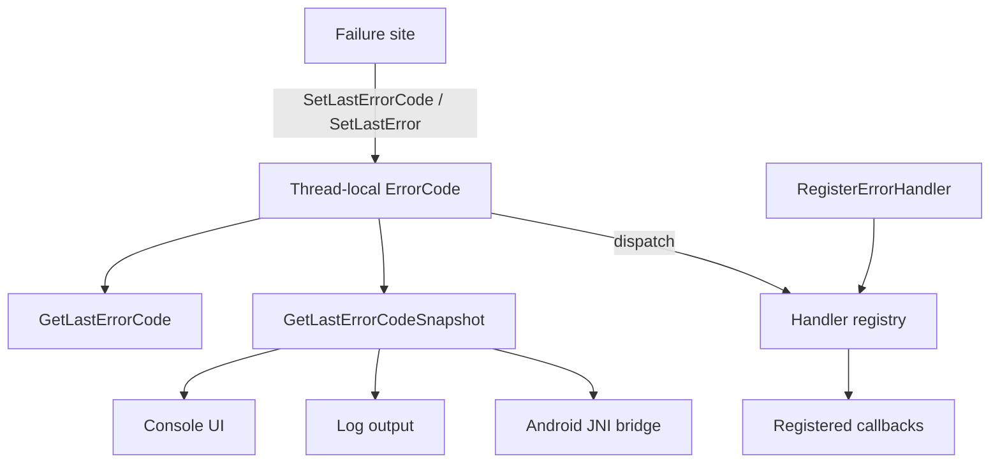
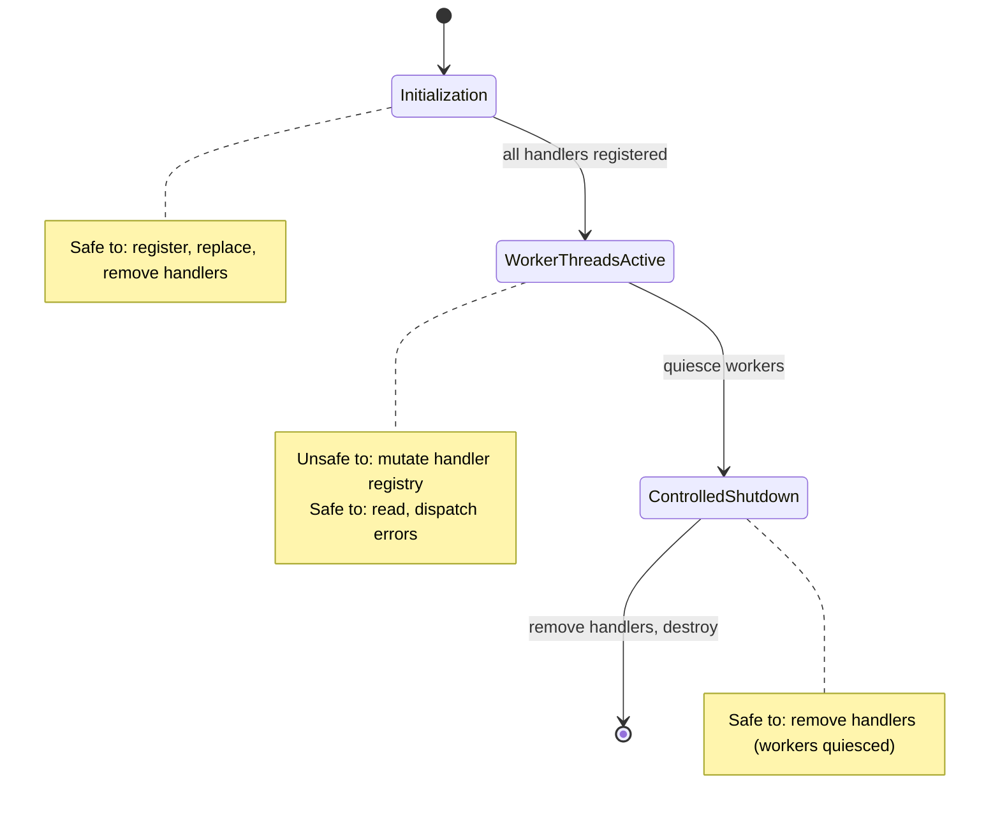
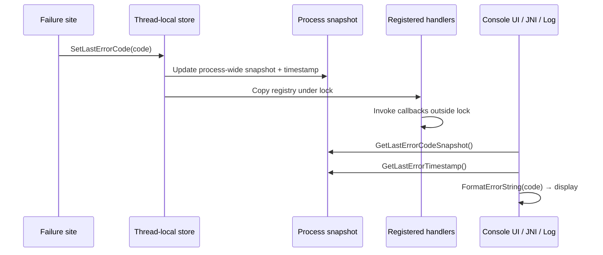

# Error Handling API

[中文版本](ERROR_HANDLING_API_CN.md)

## Scope

This document defines the diagnostics error API contract used by startup/runtime paths and operational surfaces in OPENPPP2.

The API is implemented in:
- `ppp/diagnostics/Error.h`
- `ppp/diagnostics/ErrorHandler.h`
- `ppp/diagnostics/Error.cpp`
- `ppp/diagnostics/ErrorHandler.cpp`

---

## Architecture Overview



The design is single-source: every failure path sets diagnostics once, and all presentation layers read from the same snapshot.

---

## Core API Surface

### Primary Setter Functions

#### `SetLastErrorCode`

```cpp
/**
 * @brief Set the thread-local last error code.
 * @param code  The ErrorCode value to record.
 * @note  Also updates the process-wide snapshot and timestamp.
 *        Dispatches to all registered error handlers.
 */
void SetLastErrorCode(ppp::diagnostics::ErrorCode code) noexcept;
```

This is the primary entry point for recording a failure.
Call it before returning any failure sentinel (`false`, `-1`, `NULLPTR`).

#### `SetLastError` (overloads)

```cpp
/**
 * @brief Set the error code and return a bool failure value.
 * @param code   The ErrorCode to record.
 * @param result The value to return (typically false).
 * @return       The value of result unchanged.
 */
bool SetLastError(ppp::diagnostics::ErrorCode code, bool result) noexcept;

/**
 * @brief Set the error code and return an integer failure value.
 * @param code   The ErrorCode to record.
 * @param result The integer return value (typically -1).
 * @return       The value of result unchanged.
 */
int SetLastError(ppp::diagnostics::ErrorCode code, int result) noexcept;

/**
 * @brief Set the error code and return a pointer failure value.
 * @param code   The ErrorCode to record.
 * @param result The pointer return value (typically NULLPTR).
 * @return       The value of result unchanged.
 */
void* SetLastError(ppp::diagnostics::ErrorCode code, void* result) noexcept;
```

These helpers let callers combine the error set and return statement:

```cpp
return SetLastError(ErrorCode::SocketBindFailed, false);
```

---

### Getter Functions

#### `GetLastErrorCode`

```cpp
/**
 * @brief Get the current thread-local error code.
 * @return The most recently set ErrorCode on this thread.
 * @note  Returns ErrorCode::Success if no error has been set.
 */
ppp::diagnostics::ErrorCode GetLastErrorCode() noexcept;
```

#### `GetLastErrorCodeSnapshot`

```cpp
/**
 * @brief Get the process-wide most recent error code snapshot.
 * @return The ErrorCode from the most recent SetLastErrorCode call across all threads.
 * @note  This is a snapshot; it may be overwritten by concurrent threads.
 */
ppp::diagnostics::ErrorCode GetLastErrorCodeSnapshot() noexcept;
```

#### `GetLastErrorTimestamp`

```cpp
/**
 * @brief Get the timestamp of the most recent process-wide error.
 * @return Unix timestamp (seconds) of the last SetLastErrorCode call.
 */
int64_t GetLastErrorTimestamp() noexcept;
```

---

### Format Function

#### `FormatErrorString`

```cpp
/**
 * @brief Format an ErrorCode as a human-readable string.
 * @param code  The ErrorCode to format.
 * @return      A descriptive string for the error code.
 */
ppp::string FormatErrorString(ppp::diagnostics::ErrorCode code) noexcept;
```

Used by Console UI and log surfaces to convert error codes to displayable text.

---

## Handler Registration

### `RegisterErrorHandler`

```cpp
/**
 * @brief Register or replace an error notification handler.
 * @param key     Unique string identifier for this registration slot.
 * @param handler Callback function receiving the integer form of ErrorCode.
 *                Pass a null function to remove the handler for this key.
 * @note  Key-based: registering with an existing key replaces the previous handler.
 * @note  Registration is intended for initialization / teardown phases only.
 *        Do not call from hot paths while worker threads are active.
 */
void RegisterErrorHandler(
    const ppp::string& key,
    const ppp::function<void(int err)>& handler) noexcept;
```

### Handler Dispatch Contract

When `SetLastErrorCode` is called:

1. The thread-local ErrorCode is updated.
2. The process-wide snapshot is updated.
3. The handler registry is **copied under lock**.
4. Handlers are **invoked outside the lock**.

This guarantees:
- No deadlock between dispatch and registration.
- Handlers see consistent state.
- A slow handler does not block other threads from setting errors.

---

## Handler Registration Thread-Safety Boundary



Registration changes are lifecycle-managed operations, not hot-path controls.

---

## Diagnostics Coverage Policy

All failure branches in operational code must set diagnostics before returning failure sentinels.

### Required Coverage Points

| Category | Required action |
|----------|----------------|
| Startup failures | `SetLastErrorCode(...)` before returning `false` |
| Environment preparation failures | `SetLastErrorCode(...)` before returning failure |
| Transport open / reconnect failures | `SetLastErrorCode(...)` in failure branch |
| Session handshake failures | `SetLastErrorCode(...)` before returning |
| Rollback failures | `SetLastErrorCode(...)` even if best-effort rollback continues |
| New failure branches | Must not rely on generic fallback messages only |

### Coverage Example

```cpp
bool VEthernetNetworkSwitcher::Open() noexcept {
    // ... attempt to open virtual adapter ...
    if (!adapter_opened) {
        return SetLastError(ErrorCode::TunnelOpenFailed, false);  // CORRECT
    }

    if (!route_applied) {
        return SetLastError(ErrorCode::RouteAddFailed, false);  // CORRECT
    }

    return true;
}
```

Anti-pattern (incomplete coverage):

```cpp
bool SomeFunction() noexcept {
    if (!DoSomething()) {
        return false;  // WRONG: no diagnostics set
    }
    return true;
}
```

---

## Error Propagation Model



Diagnostics flow is single-source:
- The backend (C++ runtime) sets `ErrorCode`.
- All presentation layers (Console UI, log, JNI) read snapshots.
- Bridge layers (Android JNI) preserve semantic mapping instead of introducing parallel enums.

### C Subsystem Bridge (SYSNAT)

For C modules that return non-enum integer error codes (for example `linux/ppp/tap/openppp2_sysnat.c`), use an explicit bridge mapping at the C/C++ boundary:

- map each C `ERR_*` value to one `ppp::diagnostics::ErrorCode`
- publish diagnostics only on failure branches
- keep C return codes for local control flow, and use `ErrorCode` for global diagnostics surfaces

Example (`linux/ppp/tap/openppp2_sysnat.h` + `ppp/ethernet/VNetstack.cpp`):

```cpp
int status = openppp2_sysnat_attach(interface_name.data());
if (0 != status) {
    openppp2_sysnat_publish_error(status);
    return false;
}
```

---

## Android JNI Integration

The Android JNI bridge in `android/` maps `ErrorCode` values to Java-visible integer error codes.

Contract:
- JNI error integers should map to core `ErrorCode` values where practical.
- `run` / `stop` / `release` transitions preserve consistent error meaning across the native/managed boundary.
- Android bridge errors are part of the same diagnostics pipeline, not a separate troubleshooting universe.

Example mapping:

```cpp
// android/src/main/cpp/bridge.cpp
jint openppp2_run(...) {
    if (!app.Run()) {
        return static_cast<jint>(ppp::diagnostics::GetLastErrorCode());
    }
    return 0;
}
```

---

## Error Code Reference

Key `ppp::diagnostics::ErrorCode` values relevant to the error handling API:

| ErrorCode | Value | Description |
|-----------|-------|-------------|
| `Success` | 0 | No error |
| `GenericUnknown` | 1 | Generic unknown error |
| `ConfigLoadFailed` | 54 | Configuration load or validation failure |
| `AppPrivilegeRequired` | 52 | Insufficient OS privilege |
| `AppAlreadyRunning` | 46 | Another instance is already running |
| `TunnelOpenFailed` | 141 | Virtual adapter open failed |
| `RouteAddFailed` | 156 | Route table modification failed |
| `ConfigDnsRuleLoadFailed` | 63 | DNS configuration failed |
| `SocketBindFailed` | 107 | Socket bind operation failed |
| `SessionHandshakeFailed` | 193 | Transport handshake did not complete |
| `TcpConnectTimeout` | 121 | Handshake timed out |
| `SessionAuthFailed` | 192 | Authentication rejected |
| `NetworkInterfaceOpenFailed` | 94 | Cannot reach management backend |
| `AuthCredentialInvalid` | 214 | Backend rejected authentication |
| `SessionQuotaExceeded` | 196 | User quota exhausted |

See `ppp/diagnostics/Error.h` for the complete enum definition.

---

## Usage Examples

### Basic failure path

```cpp
#include "ppp/diagnostics/Error.h"

bool OpenSocket(const IPEndPoint& endpoint) noexcept {
    int fd = ::socket(AF_INET, SOCK_STREAM, 0);
    if (fd < 0) {
        return SetLastError(ErrorCode::SocketCreateFailed, false);
    }

    if (::bind(fd, ...) < 0) {
        ::close(fd);
        return SetLastError(ErrorCode::SocketBindFailed, false);
    }

    return true;
}
```

### Registering an error handler at startup

```cpp
#include "ppp/diagnostics/ErrorHandler.h"

void InitDiagnostics() {
    RegisterErrorHandler("console-ui", [](int err) {
        auto code = static_cast<ppp::diagnostics::ErrorCode>(err);
        ppp::string msg = FormatErrorString(code);
        ConsoleUI::Instance().ShowError(msg);
    });

    RegisterErrorHandler("log-sink", [](int err) {
        // write to structured log
        WriteLog("error", err);
    });
}
```

### Reading diagnostics at the presentation layer

```cpp
void DisplayStatus() {
    auto code      = GetLastErrorCodeSnapshot();
    auto timestamp = GetLastErrorTimestamp();
    auto message   = FormatErrorString(code);

    printf("[%lld] Last error: %s (%d)\n",
           (long long)timestamp,
           message.c_str(),
           static_cast<int>(code));
}
```

### Removing a handler during shutdown

```cpp
void ShutdownDiagnostics() {
    // Pass null function to remove the handler slot
    RegisterErrorHandler("console-ui", nullptr);
    RegisterErrorHandler("log-sink",   nullptr);
}
```

---

## Implementation Notes

- Thread-local storage for `ErrorCode` avoids contention between worker threads.
- The process-wide snapshot uses `std::atomic` operations for lock-free reads.
- Handler dispatch copies the registry under `std::mutex` then invokes outside.
  This prevents handlers from deadlocking on re-entrant error calls.
- `FormatErrorString` returns a static or pool-allocated string.
  It is safe to call from signal handlers.

---

## Operational Checklist

When adding a new failure branch:

- [ ] Call `SetLastErrorCode(...)` or `SetLastError(...)` before returning failure.
- [ ] Choose the most specific `ErrorCode` available; do not default to broad generic codes.
- [ ] If no specific code exists, add one to `ppp/diagnostics/Error.h` with a clear comment.
- [ ] Verify the new code appears in `FormatErrorString` with a meaningful message.
- [ ] Update `ERROR_CODES.md` and `ERROR_CODES_CN.md` if a new code is added.

Entry-point guardrail:

- [ ] In `main.cpp`, if `Run()` fails but thread-local diagnostics is still `Success`, set a non-success fallback (`AppMainRunFailedWithoutSpecificError`) before printing.

---

## Related Documents

- [`ERROR_CODES.md`](ERROR_CODES.md)
- [`DIAGNOSTICS_ERROR_SYSTEM.md`](DIAGNOSTICS_ERROR_SYSTEM.md)
- [`OPERATIONS.md`](OPERATIONS.md)
- [`STARTUP_AND_LIFECYCLE.md`](STARTUP_AND_LIFECYCLE.md)
